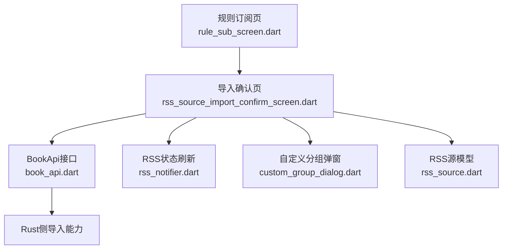
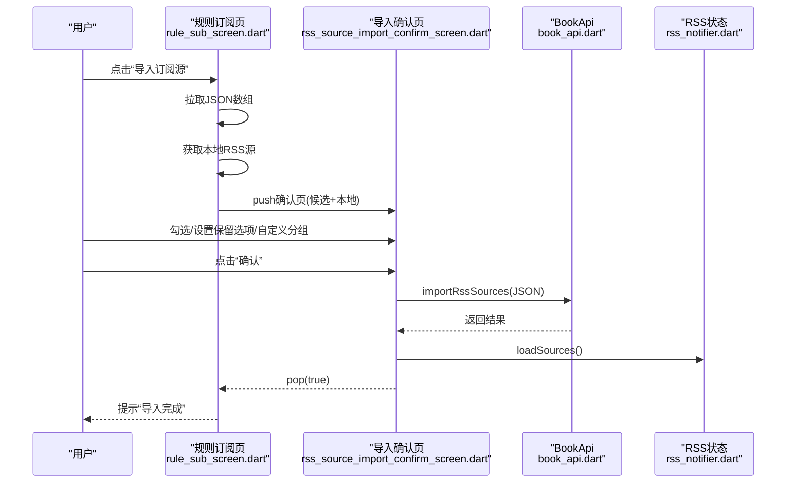
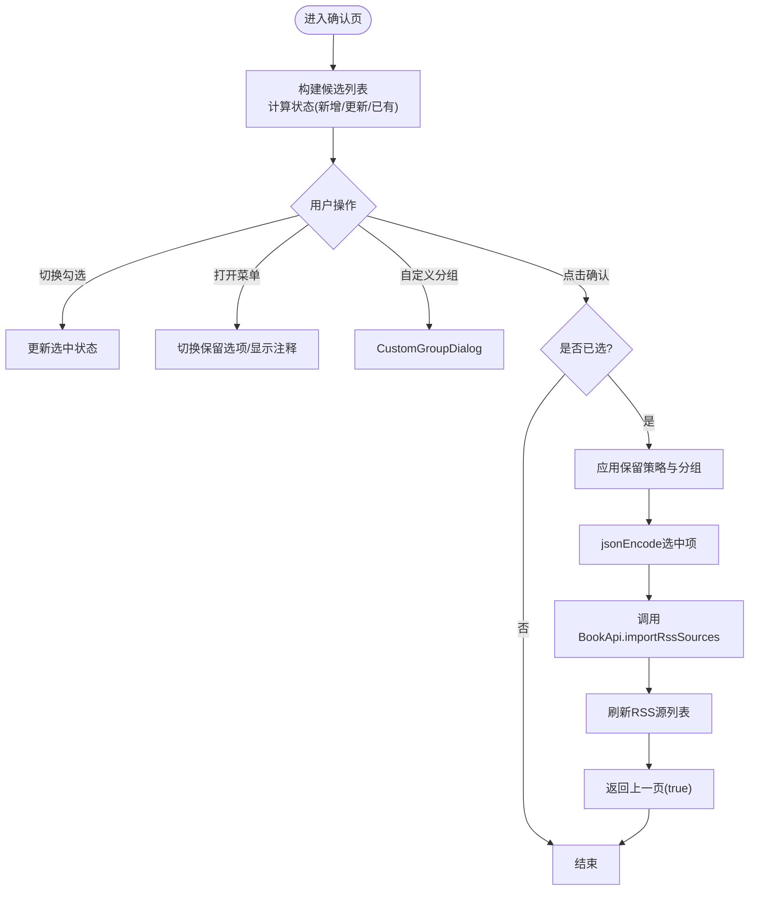
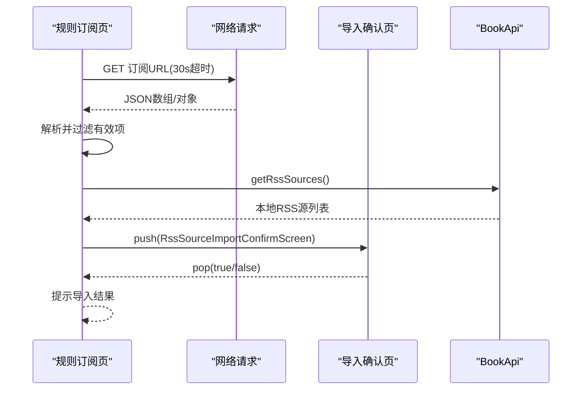
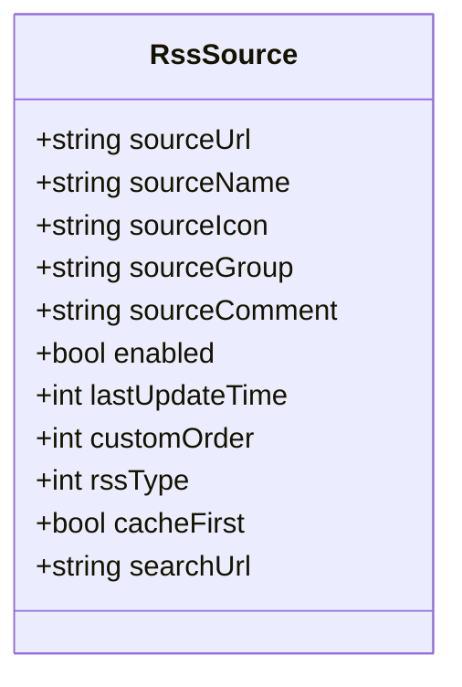
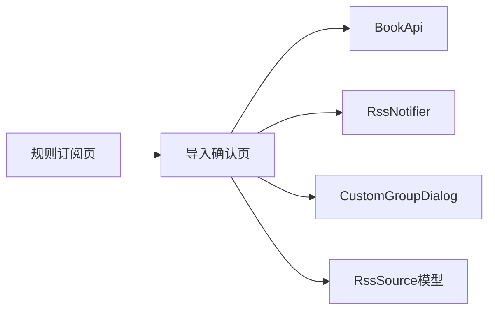

# RSS源导入确认界面

<cite>
**本文引用的文件**   
- [rss_source_import_confirm_screen.dart](file://flutter_legado/lib/src/screens/rss_source_import_confirm_screen.dart)
- [rule_sub_screen.dart](file://flutter_legado/lib/src/screens/rule_sub_screen.dart)
- [book_api.dart](file://flutter_legado/lib/src/services/book_api.dart)
- [rss_notifier.dart](file://flutter_legado/lib/src/providers/rss/rss_notifier.dart)
- [rss_source.dart](file://flutter_legado/lib/src/models/rss_source.dart)
- [custom_group_dialog.dart](file://flutter_legado/lib/src/widgets/custom_group_dialog.dart)
</cite>

## 目录
1. [简介](#简介)
2. [项目结构](#项目结构)
3. [核心组件](#核心组件)
4. [架构总览](#架构总览)
5. [详细组件分析](#详细组件分析)
6. [依赖关系分析](#依赖关系分析)
7. [性能考量](#性能考量)
8. [故障排查指南](#故障排查指南)
9. [结论](#结论)

## 简介
本文件聚焦于“RSS源导入确认界面”的实现与流程，说明用户从拉取候选RSS订阅源到勾选确认、应用保留策略并写入数据库的完整交互链路。该界面以Flutter实现，采用Riverpod进行状态管理，并通过BookApi调用Rust侧能力完成最终入库。

## 项目结构
- 入口与导航：规则订阅页触发导入流程，将候选JSON数组与本地RSS源列表传入确认页。
- 确认页：展示候选项、默认选择策略（新增/更新默认选中）、菜单选项（保留原名/分组/启用状态/显示注释）、自定义分组、全选/取消全选、确认导入。
- 数据层：通过BookApi接口调用Rust侧导入能力；完成后刷新RSS源列表。
- 模型：RssSource定义RSS源字段，用于本地对比与保留策略合并。

**图表来源** 
- [rule_sub_screen.dart:370-569](file://flutter_legado/lib/src/screens/rule_sub_screen.dart#L370-L569)
- [rss_source_import_confirm_screen.dart:1-427](file://flutter_legado/lib/src/screens/rss_source_import_confirm_screen.dart#L1-L427)
- [book_api.dart:210-230](file://flutter_legado/lib/src/services/book_api.dart#L210-L230)
- [rss_notifier.dart:7](file://flutter_legado/lib/src/providers/rss/rss_notifier.dart#L7)
- [custom_group_dialog.dart:1](file://flutter_legado/lib/src/widgets/custom_group_dialog.dart#L1)
- [rss_source.dart:1-59](file://flutter_legado/lib/src/models/rss_source.dart#L1-L59)

**章节来源**
- [rule_sub_screen.dart:370-569](file://flutter_legado/lib/src/screens/rule_sub_screen.dart#L370-L569)
- [rss_source_import_confirm_screen.dart:1-427](file://flutter_legado/lib/src/screens/rss_source_import_confirm_screen.dart#L1-L427)
- [book_api.dart:210-230](file://flutter_legado/lib/src/services/book_api.dart#L210-L230)
- [rss_notifier.dart:7](file://flutter_legado/lib/src/providers/rss/rss_notifier.dart#L7)
- [custom_group_dialog.dart:1](file://flutter_legado/lib/src/widgets/custom_group_dialog.dart#L1)
- [rss_source.dart:1-59](file://flutter_legado/lib/src/models/rss_source.dart#L1-L59)

## 核心组件
- RssSourceImportConfirmScreen：确认页主体，负责候选项渲染、选择状态、菜单选项、自定义分组、确认导入逻辑。
- RuleSubScreen._importRssSources：发起导入流程，拉取JSON、获取本地RSS源、跳转确认页。
- BookApi.importRssSources：对外暴露的导入接口，实际由Rust侧处理。
- RssNotifier：导入成功后刷新RSS源列表。
- CustomGroupDialog：提供自定义分组名称与“追加分组”开关。
- RssSource：RSS源实体模型，用于本地对比与保留策略合并。

**章节来源**
- [rss_source_import_confirm_screen.dart:33-168](file://flutter_legado/lib/src/screens/rss_source_import_confirm_screen.dart#L33-L168)
- [rule_sub_screen.dart:378-432](file://flutter_legado/lib/src/screens/rule_sub_screen.dart#L378-L432)
- [book_api.dart:215-216](file://flutter_legado/lib/src/services/book_api.dart#L215-L216)
- [rss_notifier.dart:7](file://flutter_legado/lib/src/providers/rss/rss_notifier.dart#L7)
- [custom_group_dialog.dart:1](file://flutter_legado/lib/src/widgets/custom_group_dialog.dart#L1)
- [rss_source.dart:1-59](file://flutter_legado/lib/src/models/rss_source.dart#L1-L59)

## 架构总览
下图展示了从规则订阅页发起导入到确认页执行导入并刷新状态的时序。

**图表来源** 
- [rule_sub_screen.dart:378-432](file://flutter_legado/lib/src/screens/rule_sub_screen.dart#L378-L432)
- [rss_source_import_confirm_screen.dart:112-168](file://flutter_legado/lib/src/screens/rss_source_import_confirm_screen.dart#L112-L168)
- [book_api.dart:215-216](file://flutter_legado/lib/src/services/book_api.dart#L215-L216)
- [rss_notifier.dart:7](file://flutter_legado/lib/src/providers/rss/rss_notifier.dart#L7)

## 详细组件分析

### 导入确认页（RssSourceImportConfirmScreen）
- 候选项展示：每项包含勾选框、源名、状态标签（新增/更新/已有）、打开查看JSON按钮；可选显示源注释。
- 默认选择策略：新增与更新默认选中，已有不选。
- 菜单选项：保留原名、保留分组、保留启用状态、显示源注释。
- 自定义分组：支持输入新分组名与“追加分组”模式，合并现有分组。
- 确认导入：对选中项拷贝原始Map，按保留策略覆盖字段，必要时合并分组，最后jsonEncode直传Rust侧宽松反序列化。
- 错误处理：导入失败时弹出SnackBar提示；加载过程中禁用确认按钮并显示进度指示。

**图表来源** 
- [rss_source_import_confirm_screen.dart:87-168](file://flutter_legado/lib/src/screens/rss_source_import_confirm_screen.dart#L87-L168)
- [rss_source_import_confirm_screen.dart:172-186](file://flutter_legado/lib/src/screens/rss_source_import_confirm_screen.dart#L172-L186)
- [rss_source_import_confirm_screen.dart:226-340](file://flutter_legado/lib/src/screens/rss_source_import_confirm_screen.dart#L226-L340)

**章节来源**
- [rss_source_import_confirm_screen.dart:33-168](file://flutter_legado/lib/src/screens/rss_source_import_confirm_screen.dart#L33-L168)
- [rss_source_import_confirm_screen.dart:172-186](file://flutter_legado/lib/src/screens/rss_source_import_confirm_screen.dart#L172-L186)
- [rss_source_import_confirm_screen.dart:226-340](file://flutter_legado/lib/src/screens/rss_source_import_confirm_screen.dart#L226-L340)

### 规则订阅页导入流程（RuleSubScreen._importRssSources）
- 拉取JSON：超时保护，非200状态码抛出异常。
- 解析校验：仅接受数组或对象（对象收拢为单元素数组）。
- 本地源读取：获取本地RSS源用于状态判定与保留合并。
- 跳转确认页：传递候选与本地源列表，等待返回结果并提示。

**图表来源** 
- [rule_sub_screen.dart:378-432](file://flutter_legado/lib/src/screens/rule_sub_screen.dart#L378-L432)
- [rule_sub_screen.dart:492-503](file://flutter_legado/lib/src/screens/rule_sub_screen.dart#L492-L503)

**章节来源**
- [rule_sub_screen.dart:378-432](file://flutter_legado/lib/src/screens/rule_sub_screen.dart#L378-L432)
- [rule_sub_screen.dart:492-503](file://flutter_legado/lib/src/screens/rule_sub_screen.dart#L492-L503)

### 数据模型（RssSource）
- 关键字段：sourceUrl、sourceName、sourceGroup、sourceComment、enabled、lastUpdateTime、customOrder等。
- 用途：本地对比判断新增/更新/已有；保留策略合并时覆盖同名段；customOrder恒保留本地值。

**图表来源** 
- [rss_source.dart:1-59](file://flutter_legado/lib/src/models/rss_source.dart#L1-L59)

**章节来源**
- [rss_source.dart:1-59](file://flutter_legado/lib/src/models/rss_source.dart#L1-L59)

### 自定义分组弹窗（CustomGroupDialog）
- 功能：初始分组名与“追加分组”开关；返回(名称, 是否追加)。
- 使用场景：在确认页中根据用户输入决定替换或合并分组。

**章节来源**
- [custom_group_dialog.dart:1](file://flutter_legado/lib/src/widgets/custom_group_dialog.dart#L1)

## 依赖关系分析
- 界面层：确认页依赖BookApi与RssNotifier；规则订阅页负责数据准备与路由。
- 服务层：BookApi作为统一接口，屏蔽Rust侧实现细节。
- 模型层：RssSource用于本地对比与保留策略合并。
- 工具层：CustomGroupDialog提供分组配置交互。

**图表来源** 
- [rule_sub_screen.dart:378-432](file://flutter_legado/lib/src/screens/rule_sub_screen.dart#L378-L432)
- [rss_source_import_confirm_screen.dart:112-168](file://flutter_legado/lib/src/screens/rss_source_import_confirm_screen.dart#L112-L168)
- [book_api.dart:215-216](file://flutter_legado/lib/src/services/book_api.dart#L215-L216)
- [rss_notifier.dart:7](file://flutter_legado/lib/src/providers/rss/rss_notifier.dart#L7)
- [custom_group_dialog.dart:1](file://flutter_legado/lib/src/widgets/custom_group_dialog.dart#L1)
- [rss_source.dart:1-59](file://flutter_legado/lib/src/models/rss_source.dart#L1-L59)

**章节来源**
- [rule_sub_screen.dart:378-432](file://flutter_legado/lib/src/screens/rule_sub_screen.dart#L378-L432)
- [rss_source_import_confirm_screen.dart:112-168](file://flutter_legado/lib/src/screens/rss_source_import_confirm_screen.dart#L112-L168)
- [book_api.dart:215-216](file://flutter_legado/lib/src/services/book_api.dart#L215-L216)
- [rss_notifier.dart:7](file://flutter_legado/lib/src/providers/rss/rss_notifier.dart#L7)
- [custom_group_dialog.dart:1](file://flutter_legado/lib/src/widgets/custom_group_dialog.dart#L1)
- [rss_source.dart:1-59](file://flutter_legado/lib/src/models/rss_source.dart#L1-L59)

## 性能考量
- 网络请求：拉取订阅源与本地源均设置超时保护，避免长时间阻塞。
- 数据转换：预览阶段不做严格类型化解析，减少第三方字段导致的解析开销与失败率；确认导入时直接jsonEncode原始Map交由Rust侧宽松反序列化。
- UI渲染：列表项轻量渲染，仅在需要时展开注释；全选/取消全选批量更新状态。
- 刷新策略：导入成功后一次性刷新RSS源列表，避免多次重绘。

[本节为通用指导，无需引用具体文件]

## 故障排查指南
- 网络超时：检查网络连接与订阅URL可达性；确认超时时间合理。
- JSON格式错误：确保返回内容为数组或对象；若为对象会被收拢为单元素数组。
- 导入失败：查看SnackBar提示信息；常见原因包括字段缺失、网络异常或Rust侧校验失败。
- 未刷新列表：确认导入成功后是否调用loadSources刷新RSS源列表。

**章节来源**
- [rule_sub_screen.dart:378-432](file://flutter_legado/lib/src/screens/rule_sub_screen.dart#L378-L432)
- [rss_source_import_confirm_screen.dart:154-168](file://flutter_legado/lib/src/screens/rss_source_import_confirm_screen.dart#L154-L168)

## 结论
RSS源导入确认界面通过清晰的交互流程与稳健的数据处理策略，实现了从候选展示、用户确认到最终入库的完整闭环。其设计兼顾了第三方源的多样性与用户体验，同时借助Rust侧能力保证导入效率与兼容性。建议在实际使用中关注网络稳定性与JSON格式规范，以获得最佳导入体验。