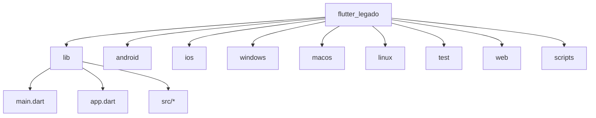
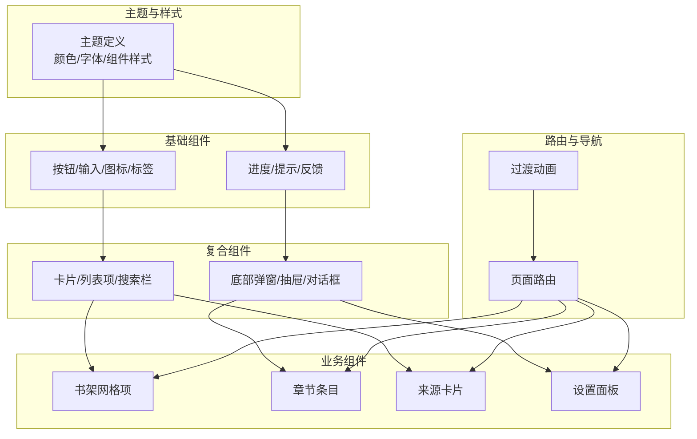
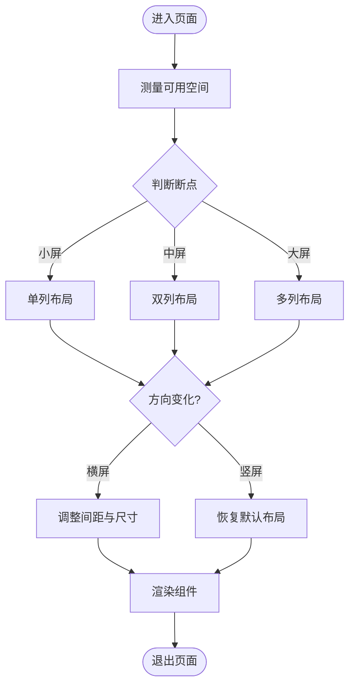
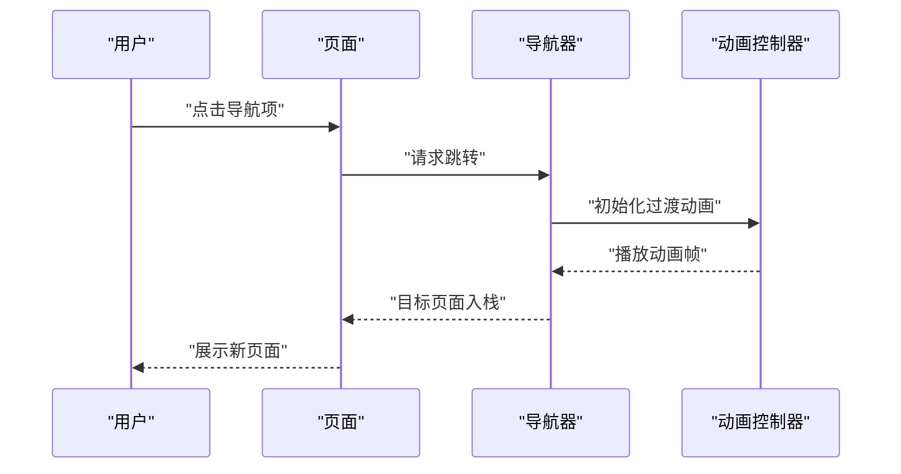
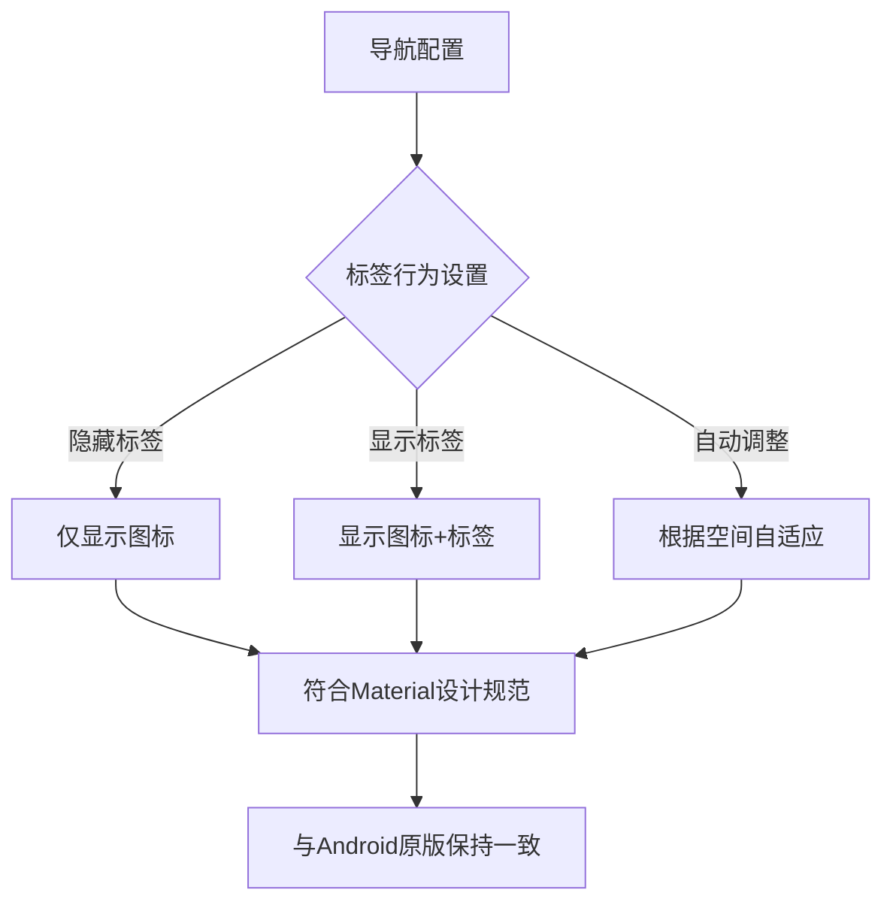
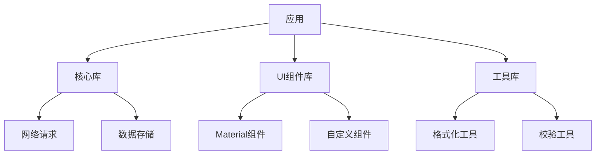

# UI组件系统

<cite>
**本文档引用的文件**   
- [flutter_legado/lib/main.dart](file://flutter_legado/lib/main.dart)
- [flutter_legado/lib/app.dart](file://flutter_legado/lib/app.dart)
- [flutter_legado/pubspec.yaml](file://flutter_legado/pubspec.yaml)
- [flutter_legado/README.md](file://flutter_legado/README.md)
</cite>

## 更新摘要
**所做更改**   
- 更新了导航组件部分，详细说明NavigationDestination组件的labelBehavior配置
- 新增无标签显示效果的实现说明
- 补充了与Android原版一致的视觉规范

## 目录
1. [简介](#简介)
2. [项目结构](#项目结构)
3. [核心组件](#核心组件)
4. [架构总览](#架构总览)
5. [详细组件分析](#详细组件分析)
6. [依赖分析](#依赖分析)
7. [性能考虑](#性能考虑)
8. [故障排查指南](#故障排查指南)
9. [结论](#结论)
10. [附录](#附录)

## 简介
本文件面向Flutter侧UI组件系统的构建与使用，围绕自定义Widget的层次化设计（基础组件、复合组件、业务组件）、Material Design定制与主题系统、响应式布局策略、动画与过渡效果、以及组件复用与设计系统规范进行系统化说明。文档旨在帮助开发者快速理解并高效扩展该项目的UI体系，同时为后续迭代提供可复用的最佳实践。

## 项目结构
Flutter工程位于 flutter_legado 目录，采用标准Flutter多平台结构：
- lib：应用源码入口与核心逻辑
- android/ios/windows/macos/linux：各平台原生桥接与配置
- test：单元测试与组件测试
- web：Web端资源与入口
- scripts：构建与生成脚本

图表来源
- [flutter_legado/lib/main.dart](file://flutter_legado/lib/main.dart)
- [flutter_legado/lib/app.dart](file://flutter_legado/lib/app.dart)

章节来源
- [flutter_legado/README.md](file://flutter_legado/README.md)
- [flutter_legado/pubspec.yaml](file://flutter_legado/pubspec.yaml)

## 核心组件
- 基础组件：封装通用原子能力，如按钮、输入框、图标、标签、进度指示器等，强调无状态、高内聚、低耦合。
- 复合组件：由多个基础组件组合而成，承载常见交互模式，如卡片、列表项、搜索栏、底部弹窗等。
- 业务组件：面向具体业务场景的组合，如书架网格项、章节条目、来源卡片、设置面板等，通常包含少量状态管理与事件回调。

建议的组织方式：
- 按功能域划分目录，例如 ui/base、ui/composite、ui/business
- 每个组件独立文件，命名遵循 PascalCase，导出单一公共接口
- 通过参数化与回调实现可配置性与可扩展性

章节来源
- [flutter_legado/lib/main.dart](file://flutter_legado/lib/main.dart)
- [flutter_legado/lib/app.dart](file://flutter_legado/lib/app.dart)

## 架构总览
Flutter UI层采用"主题驱动 + 组件分层"的架构：
- 主题系统集中管理颜色、字体、组件样式，确保一致性
- 基础组件提供稳定的视觉与交互基线
- 复合组件复用基础组件，形成常用界面块
- 业务组件聚合复合组件，完成页面级或模块级功能
- 路由与导航负责页面切换与过渡动画

图表来源
- [flutter_legado/lib/app.dart](file://flutter_legado/lib/app.dart)
- [flutter_legado/lib/main.dart](file://flutter_legado/lib/main.dart)

## 详细组件分析

### 主题系统与Material定制
- 颜色方案：通过主题对象统一声明主色、辅助色、背景色、文本色、错误色等，支持明暗主题切换
- 字体样式：集中管理标题、正文、标注等字重与字号，保证跨组件一致性
- 组件样式：对Material组件的默认样式进行覆盖，如ButtonTheme、CardTheme、AppBarTheme等
- 动态主题：根据用户偏好或系统设置实时切换主题，保持UI一致体验

图表来源
- [flutter_legado/lib/app.dart](file://flutter_legado/lib/app.dart)
- [flutter_legado/lib/main.dart](file://flutter_legado/lib/main.dart)

章节来源
- [flutter_legado/lib/app.dart](file://flutter_legado/lib/app.dart)
- [flutter_legado/lib/main.dart](file://flutter_legado/lib/main.dart)

### 响应式布局设计
- 屏幕适配：基于屏幕宽度断点划分布局，小屏单列、中屏双列、大屏三列或多列
- 横竖屏切换：监听方向变化，动态调整组件排列与尺寸
- 多设备兼容：针对手机、平板、桌面端优化触控区域与信息密度
- 弹性布局：使用Flex、Grid、AspectRatio等布局控件，确保在不同分辨率下表现稳定

图表来源
- [flutter_legado/lib/app.dart](file://flutter_legado/lib/app.dart)
- [flutter_legado/lib/main.dart](file://flutter_legado/lib/main.dart)

章节来源
- [flutter_legado/lib/app.dart](file://flutter_legado/lib/app.dart)
- [flutter_legado/lib/main.dart](file://flutter_legado/lib/main.dart)

### 动画与过渡效果
- 页面切换动画：使用PageRouteBuilder或内置路由动画，实现平滑转场
- 交互反馈动画：点击、长按、滑动等手势触发微动效，提升操作感知
- 数据加载动画：骨架屏、进度条、旋转指示器，增强等待体验
- 状态切换动画：展开/收起、显示/隐藏等状态变化的过渡

图表来源
- [flutter_legado/lib/app.dart](file://flutter_legado/lib/app.dart)
- [flutter_legado/lib/main.dart](file://flutter_legado/lib/main.dart)

章节来源
- [flutter_legado/lib/app.dart](file://flutter_legado/lib/app.dart)
- [flutter_legado/lib/main.dart](file://flutter_legado/lib/main.dart)

### 导航组件与Material Design定制
- NavigationDestination组件：用于底部导航栏的导航项配置，支持图标和标签的灵活展示
- labelBehavior配置：通过设置labelBehavior属性控制标签显示行为，实现与Android原版一致的无标签显示效果
- 图标优先设计：在空间有限的情况下，优先展示图标，隐藏文字标签以提升视觉简洁性
- 主题集成：导航组件自动继承主题的颜色方案和字体样式，确保整体视觉一致性

**更新** 新增了NavigationDestination组件的labelBehavior配置说明，实现了与Android原版一致的无标签显示效果

图表来源
- [flutter_legado/lib/app.dart](file://flutter_legado/lib/app.dart)
- [flutter_legado/lib/main.dart](file://flutter_legado/lib/main.dart)

章节来源
- [flutter_legado/lib/app.dart](file://flutter_legado/lib/app.dart)
- [flutter_legado/lib/main.dart](file://flutter_legado/lib/main.dart)

### 组件复用模式与设计系统规范
- 参数化设计：所有组件暴露必要属性，支持主题注入与行为定制
- 回调优先：通过回调函数处理外部状态变更，避免内部状态污染
- 组合优于继承：通过组合基础组件构建复合组件，降低复杂度
- 命名约定：组件名反映用途，属性名语义清晰，便于团队协作
- 文档与示例：每个组件附带使用说明与示例代码，降低学习成本

章节来源
- [flutter_legado/lib/app.dart](file://flutter_legado/lib/app.dart)
- [flutter_legado/lib/main.dart](file://flutter_legado/lib/main.dart)

## 依赖分析
Flutter工程的依赖管理通过 pubspec.yaml 维护，包括框架版本、第三方库与本地模块。合理拆分依赖有助于减少包体积与冲突风险。

图表来源
- [flutter_legado/pubspec.yaml](file://flutter_legado/pubspec.yaml)

章节来源
- [flutter_legado/pubspec.yaml](file://flutter_legado/pubspec.yaml)

## 性能考虑
- 组件重建优化：合理使用StatelessWidget与setState，避免不必要的重建
- 图片与资源：使用缓存机制，按需加载大图，压缩静态资源
- 动画性能：控制动画帧率，避免在主线程执行耗时操作
- 内存管理：及时释放不使用的资源，防止内存泄漏
- 首屏加载：延迟非关键组件加载，提升启动速度

[本节为通用指导，无需特定文件引用]

## 故障排查指南
- 主题未生效：检查主题上下文是否正确传递，确认组件是否使用了主题变量
- 布局错乱：验证断点判断逻辑，检查约束条件与比例设置
- 动画卡顿：分析动画控制器生命周期，优化计算密集型操作
- 组件不更新：确认状态变更是否触发重建，检查依赖关系
- 依赖冲突：清理缓存并重新解析依赖，锁定版本避免漂移
- 导航标签显示异常：检查NavigationDestination的labelBehavior配置，确保与预期显示效果一致

章节来源
- [flutter_legado/lib/app.dart](file://flutter_legado/lib/app.dart)
- [flutter_legado/lib/main.dart](file://flutter_legado/lib/main.dart)

## 结论
本UI组件系统以主题驱动为核心，通过分层化的组件设计与响应式布局策略，实现了跨设备的一致体验。结合动画与过渡效果，提升了用户交互的流畅性与愉悦感。遵循组件复用模式与设计系统规范，可有效提高开发效率与维护性。通过NavigationDestination组件的labelBehavior配置优化，进一步确保了与Android原版的视觉一致性。未来可进一步引入更多自动化测试与性能监控手段，持续优化用户体验。

[本节为总结性内容，无需特定文件引用]

## 附录
- 开发环境搭建：参考项目根目录的README与pubspec.yaml中的依赖说明
- 组件使用示例：在test目录下查找对应组件的测试用例，了解典型用法
- 构建与发布：使用scripts目录下的脚本进行多平台构建

章节来源
- [flutter_legado/README.md](file://flutter_legado/README.md)
- [flutter_legado/pubspec.yaml](file://flutter_legado/pubspec.yaml)