# UI组件系统

<cite>
**本文档引用的文件**   
- [flutter_legado/lib/main.dart](file://flutter_legado/lib/main.dart)
- [flutter_legado/lib/app.dart](file://flutter_legado/lib/app.dart)
- [flutter_legado/lib/src/providers/theme_provider.dart](file://flutter_legado/lib/src/providers/theme_provider.dart)
- [flutter_legado/lib/src/screens/theme_config_screen.dart](file://flutter_legado/lib/src/screens/theme_config_screen.dart)
- [flutter_legado/lib/src/services/settings_service.dart](file://flutter_legado/lib/src/services/settings_service.dart)
- [flutter_legado/lib/src/theme/app_theme.dart](file://flutter_legado/lib/src/theme/app_theme.dart)
- [flutter_legado/lib/src/screens/source_edit_screen.dart](file://flutter_legado/lib/src/screens/source_edit_screen.dart)
- [flutter_legado/lib/src/models/book_source.dart](file://flutter_legado/lib/src/models/book_source.dart)
- [flutter_legado/lib/src/models/rule/rule.dart](file://flutter_legado/lib/src/models/rule/rule.dart)
- [flutter_legado/lib/src/providers/source_provider.dart](file://flutter_legado/lib/src/providers/source_provider.dart)
- [flutter_legado/test/widget/source_edit_test.dart](file://flutter_legado/test/widget/source_edit_test.dart)
- [flutter_legado/pubspec.yaml](file://flutter_legado/pubspec.yaml)
- [flutter_legado/README.md](file://flutter_legado/README.md)
- [flutter_legado/lib/src/widgets/ios_widgets.dart](file://flutter_legado/lib/src/widgets/ios_widgets.dart)
- [flutter_legado/lib/src/screens/settings_screen.dart](file://flutter_legado/lib/src/screens/settings_screen.dart)
- [flutter_legado/lib/src/widgets/reader/reader_settings_sheet.dart](file://flutter_legado/lib/src/widgets/reader/reader_settings_sheet.dart)
- [flutter_legado/lib/src/theme/app_colors.dart](file://flutter_legado/lib/src/theme/app_colors.dart)
- [flutter_legado/lib/src/widgets/reader/text_selection_panel.dart](file://flutter_legado/lib/src/widgets/reader/text_selection_panel.dart)
- [flutter_legado/lib/src/widgets/reader/reader_text_content.dart](file://flutter_legado/lib/src/widgets/reader/reader_text_content.dart)
- [flutter_legado/lib/src/sreens/reader_screen.dart](file://flutter_legado/lib/src/sreens/reader_screen.dart)
- [flutter_legado/lib/src/widgets/reader/reader_page_view.dart](file://flutter_legado/lib/src/widgets/reader/reader_page_view.dart)
- [flutter_legado/lib/src/widgets/paragraph_layout_engine.dart](file://flutter_legado/lib/src/widgets/paragraph_layout_engine.dart)
- [flutter_legado/lib/src/widgets/chapter_tile.dart](file://flutter_legado/lib/src/widgets/chapter_tile.dart)
- [flutter_legado/lib/src/screens/book_info_screen.dart](file://flutter_legado/lib/src/screens/book_info_screen.dart)
- [flutter_legado/lib/src/providers/reader/reader_notifier.dart](file://flutter_legado/lib/src/providers/reader/reader_notifier.dart)
- [flutter_legado/lib/src/screens/toc_screen.dart](file://flutter_legado/lib/src/screens/toc_screen.dart)
- [flutter_legado/lib/src/routes.dart](file://flutter_legado/lib/src/routes.dart)
- [flutter_legado/lib/src/screens/reader_config_panel.dart](file://flutter_legado/lib/src/screens/reader_config_panel.dart)
</cite>

## 更新摘要
**所做更改**   
- 增强了阅读器页面视图的可配置触摸阈值功能，支持通过阅读器配置面板实时调整滑动翻页阈值
- 新增了滑动翻页阈值和边缘点击阈值的配置界面，提供直观的数值输入对话框
- 实现了基于MediaQuery.gestureSettings的动态触摸阈值应用机制，无需重启阅读页即可生效
- 优化了滚动模式下的触摸阈值处理逻辑，确保不同翻页模式下的交互一致性
- 完善了配置持久化机制，支持用户自定义的触摸灵敏度设置

## 目录
1. [简介](#简介)
2. [项目结构](#项目结构)
3. [核心组件](#核心组件)
4. [架构总览](#架构总览)
5. [详细组件分析](#详细组件分析)
6. [依赖分析](#依赖分析)
7. [性能考虑](#性能考虑)
8. [故障排查指南](#故障排查指南)
9. [结论](#结论)
10. [附录](#附录)

## 简介
本文件面向Flutter侧UI组件系统的构建与使用，围绕自定义Widget的层次化设计（基础组件、复合组件、业务组件）、Material Design定制与主题系统、响应式布局策略、动画与过渡效果、以及组件复用与设计系统规范进行系统化说明。文档旨在帮助开发者快速理解并高效扩展该项目的UI体系，同时为后续迭代提供可复用的最佳实践。

## 项目结构
Flutter工程位于 flutter_legado 目录，采用标准Flutter多平台结构：
- lib：应用源码入口与核心逻辑
- android/ios/windows/macos/linux：各平台原生桥接与配置
- test：单元测试与组件测试
- web：Web端资源与入口
- scripts：构建与生成脚本

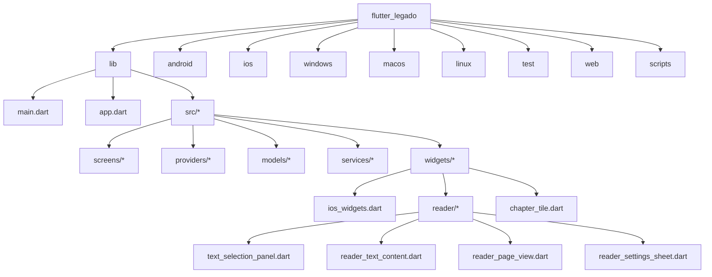
```mermaid
graph TB
A["flutter_legado"] --> B["lib"]
A --> C["android"]
A --> D["ios"]
A --> E["windows"]
A --> F["macos"]
A --> G["linux"]
A --> H["test"]
A --> I["web"]
A --> J["scripts"]
B --> B1["main.dart"]
B --> B2["app.dart"]
B --> B3["src/*"]
B3 --> B31["screens/*"]
B3 --> B32["providers/*"]
B3 --> B33["models/*"]
B3 --> B34["services/*"]
B3 --> B35["widgets/*"]
B35 --> B351["ios_widgets.dart"]
B35 --> B352["reader/*"]
B352 --> B3521["text_selection_panel.dart"]
B352 --> B3522["reader_text_content.dart"]
B352 --> B3523["reader_page_view.dart"]
B352 --> B3524["reader_settings_sheet.dart"]
B35 --> B353["chapter_tile.dart"]
```

图表来源
- [flutter_legado/lib/main.dart](file://flutter_legado/lib/main.dart)
- [flutter_legado/lib/app.dart](file://flutter_legado/lib/app.dart)

章节来源
- [flutter_legado/README.md](file://flutter_legado/README.md)
- [flutter_legado/pubspec.yaml](file://flutter_legado/pubspec.yaml)

## 核心组件
- 基础组件：封装通用原子能力，如按钮、输入框、图标、标签、进度指示器等，强调无状态、高内聚、低耦合。
- 复合组件：由多个基础组件组合而成，承载常见交互模式，如卡片、列表项、搜索栏、底部弹窗等。
- 业务组件：面向具体业务场景的组合，如书架网格项、章节条目、来源卡片、设置面板、书源编辑器等，通常包含少量状态管理与事件回调。
- **iOS专用组件**：新增的iOS风格组件库，提供符合iOS设计规范的分组列表、标题、抓取条等组件。
- **阅读器组件**：新增的文本选择面板和阅读器交互组件，支持长按段落选择和操作菜单。
- **独立目录组件**：新增的TocScreen独立目录页面，替代原有的抽屉式目录实现，提供更完整的目录浏览体验。
- **可配置触摸阈值**：新增的滑动翻页阈值和边缘点击阈值配置功能，支持用户自定义触摸灵敏度。

建议的组织方式：
- 按功能域划分目录，例如 ui/base、ui/composite、ui/business、ui/ios、ui/reader
- 每个组件独立文件，命名遵循 PascalCase，导出单一公共接口
- 通过参数化与回调实现可配置性与可扩展性

章节来源
- [flutter_legado/lib/main.dart](file://flutter_legado/lib/main.dart)
- [flutter_legado/lib/app.dart](file://flutter_legado/lib/app.dart)

## 架构总览
Flutter UI层采用"主题驱动 + 组件分层"的架构：
- 主题系统集中管理颜色、字体、组件样式，确保一致性
- 基础组件提供稳定的视觉与交互基线
- 复合组件复用基础组件，形成常用界面块
- 业务组件聚合复合组件，完成页面级或模块级功能
- iOS专用组件提供平台特定的设计语言支持
- 阅读器组件提供专业的阅读体验，包括文本选择和操作菜单
- **独立目录页面**：提供完整的目录浏览、书签管理和标注查看功能
- **可配置触摸阈值**：通过配置面板实时调整触摸灵敏度，提升用户体验
- 路由与导航负责页面切换与过渡动画

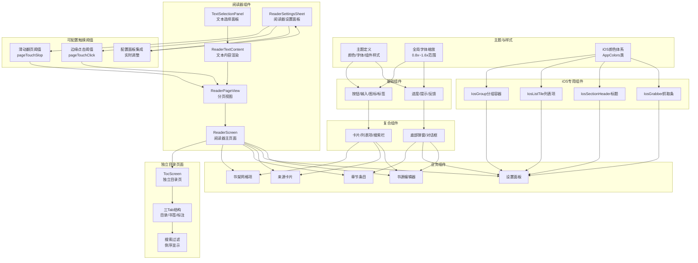
```mermaid
graph TB
subgraph "主题与样式"
T1["主题定义<br/>颜色/字体/组件样式"]
T2["全局字体缩放<br/>0.8x~1.6x范围"]
T3["iOS颜色体系<br/>AppColors类"]
end
subgraph "基础组件"
B1["按钮/输入/图标/标签"]
B2["进度/提示/反馈"]
end
subgraph "复合组件"
C1["卡片/列表项/搜索栏"]
C2["底部弹窗/对话框"]
end
subgraph "iOS专用组件"
IOS1["IosGroup分组容器"]
IOS2["IosListTile列表项"]
IOS3["IosSectionHeader标题"]
IOS4["IosGrabber抓取条"]
end
subgraph "阅读器组件"
R1["TextSelectionPanel<br/>文本选择面板"]
R2["ReaderTextContent<br/>文本内容渲染"]
R3["ReaderPageView<br/>分页视图"]
R4["ReaderScreen<br/>阅读器主页面"]
R5["ReaderSettingsSheet<br/>阅读器设置面板"]
end
subgraph "可配置触摸阈值"
TS1["滑动翻页阈值<br/>pageTouchSlop"]
TS2["边缘点击阈值<br/>pageTouchClick"]
TS3["配置面板集成<br/>实时调整"]
end
subgraph "独立目录页面"
TOC1["TocScreen<br/>独立目录页"]
TOC2["三Tab结构<br/>目录/书签/标注"]
TOC3["搜索过滤<br/>倒序显示"]
end
subgraph "业务组件"
S1["书架网格项"]
S2["章节条目"]
S3["来源卡片"]
S4["设置面板"]
S5["书源编辑器"]
end
T1 --> B1
T1 --> B2
T2 --> B1
T2 --> B2
T3 --> IOS1
T3 --> IOS2
T3 --> IOS3
T3 --> IOS4
B1 --> C1
B2 --> C2
C1 --> S1
C2 --> S2
C1 --> S3
C2 --> S4
C1 --> S5
C2 --> S5
IOS1 --> S4
IOS2 --> S4
IOS3 --> S4
IOS4 --> S4
R1 --> R2
R2 --> R3
R3 --> R4
R4 --> TOC1
TOC1 --> TOC2
TOC2 --> TOC3
R4 --> S1
R4 --> S2
R4 --> S3
R4 --> S4
R4 --> S5
R5 --> TS1
R5 --> TS2
R5 --> TS3
TS1 --> R3
TS2 --> R3
TS3 --> R5
```

图表来源
- [flutter_legado/lib/app.dart](file://flutter_legado/lib/app.dart)
- [flutter_legado/lib/main.dart](file://flutter_legado/lib/main.dart)
- [flutter_legado/lib/src/widgets/ios_widgets.dart](file://flutter_legado/lib/src/widgets/ios_widgets.dart)
- [flutter_legado/lib/src/widgets/reader/text_selection_panel.dart](file://flutter_legado/lib/src/widgets/reader/text_selection_panel.dart)
- [flutter_legado/lib/src/screens/toc_screen.dart](file://flutter_legado/lib/src/screens/toc_screen.dart)
- [flutter_legado/lib/src/widgets/chapter_tile.dart](file://flutter_legado/lib/src/widgets/chapter_tile.dart)
- [flutter_legado/lib/src/screens/reader_config_panel.dart](file://flutter_legado/lib/src/screens/reader_config_panel.dart)

## 详细组件分析

### 主题系统与Material定制
- 颜色方案：通过主题对象统一声明主色、辅助色、背景色、文本色、错误色等，支持明暗主题切换
- 字体样式：集中管理标题、正文、标注等字重与字号，保证跨组件一致性
- 组件样式：对Material组件的默认样式进行覆盖，如ButtonTheme、CardTheme、AppBarTheme等
- 动态主题：根据用户偏好或系统设置实时切换主题，保持UI一致体验

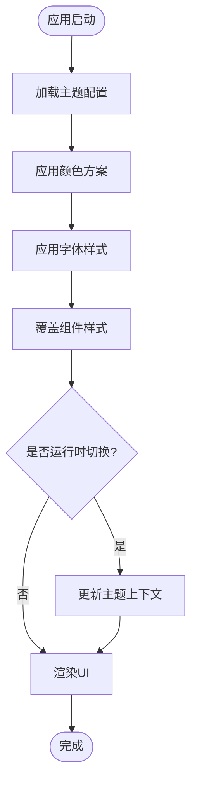
```mermaid
flowchart TD
Start(["应用启动"]) --> LoadTheme["加载主题配置"]
LoadTheme --> ApplyColors["应用颜色方案"]
ApplyColors --> ApplyTypography["应用字体样式"]
ApplyTypography --> OverrideComponents["覆盖组件样式"]
OverrideComponents --> RuntimeSwitch{"是否运行时切换?"}
RuntimeSwitch --> |是| UpdateTheme["更新主题上下文"]
RuntimeSwitch --> |否| RenderUI["渲染UI"]
UpdateTheme --> RenderUI
RenderUI --> End(["完成"])
```

图表来源
- [flutter_legado/lib/app.dart](file://flutter_legado/lib/app.dart)
- [flutter_legado/lib/main.dart](file://flutter_legado/lib/main.dart)

章节来源
- [flutter_legado/lib/app.dart](file://flutter_legado/lib/app.dart)
- [flutter_legado/lib/main.dart](file://flutter_legado/lib/main.dart)

### iOS专用组件库
**新增** 实现了完整的iOS风格组件库，提供符合iOS设计规范的分组列表界面组件。

#### IosGroupedBody - 分组列表外层容器
- 功能：使用Scaffold的分组背景色并留出左右安全边距
- 特性：支持自定义padding，默认16px水平间距
- 用途：作为iOS风格分组列表的根容器

#### IosSectionHeader - 分组标题
- 功能：iOS风格的灰色小标题，位于卡片上方
- 样式：大写文本，使用labelMedium样式，onSurfaceVariant颜色
- 特性：支持自定义padding，默认上下24px/8px，左右16px

#### IosSectionFooter - 分组脚注
- 功能：卡片下方的灰色说明文字
- 样式：使用labelMedium样式，onSurfaceVariant颜色
- 用途：为分组提供补充说明信息

#### IosGroup - 白色圆角分组卡片
- 功能：在children之间绘制hairline分隔线
- 特性：支持separatorIndent控制分隔线缩进，margin控制外边距
- 设计：采用Card组件实现白色背景，Column布局子元素

#### IosListTile - iOS风格列表项
- 功能：图标 + 标题 + 可选副标题 + 尾部（值/开关/箭头）
- 特性：统一的leading图标容器为iOS圆角色块（30x30，圆角7）
- 智能尾部：自动处理value显示和showDisclosure箭头指示

#### IosGrabber - iOS抓取指示条
- 功能：Bottom Sheet顶部短横条
- 样式：宽度36px，高度5px，圆角2.5，outlineVariant颜色
- 用途：提升底部弹窗的可拖拽感

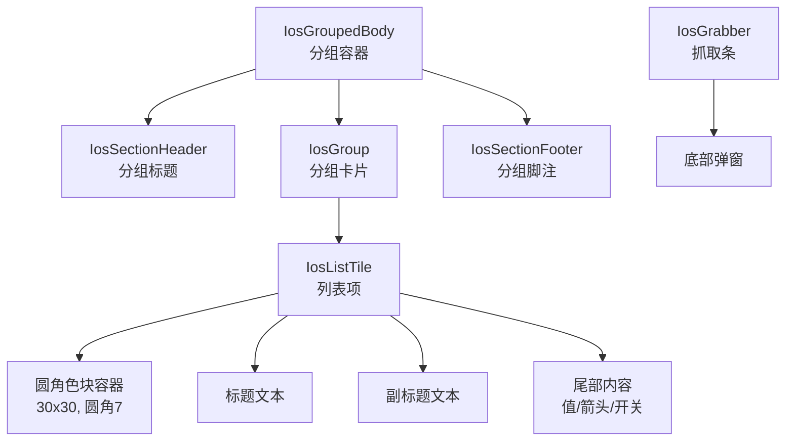
```mermaid
flowchart TD
IosGroupedBody["IosGroupedBody<br/>分组容器"] --> IosSectionHeader["IosSectionHeader<br/>分组标题"]
IosGroupedBody --> IosGroup["IosGroup<br/>分组卡片"]
IosGroup --> IosListTile["IosListTile<br/>列表项"]
IosListTile --> IconContainer["圆角色块容器<br/>30x30, 圆角7"]
IosListTile --> TitleText["标题文本"]
IosListTile --> SubtitleText["副标题文本"]
IosListTile --> TrailingContent["尾部内容<br/>值/箭头/开关"]
IosGroupedBody --> IosSectionFooter["IosSectionFooter<br/>分组脚注"]
IosGrabber["IosGrabber<br/>抓取条"] --> BottomSheet["底部弹窗"]
```

图表来源
- [flutter_legado/lib/src/widgets/ios_widgets.dart](file://flutter_legado/lib/src/widgets/ios_widgets.dart)

章节来源
- [flutter_legado/lib/src/widgets/ios_widgets.dart:21-44](file://flutter_legado/lib/src/widgets/ios_widgets.dart#L21-L44)
- [flutter_legado/lib/src/widgets/ios_widgets.dart:47-71](file://flutter_legado/lib/src/widgets/ios_widgets.dart#L47-L71)
- [flutter_legado/lib/src/widgets/ios_widgets.dart:74-97](file://flutter_legado/lib/src/widgets/ios_widgets.dart#L74-L97)
- [flutter_legado/lib/src/widgets/ios_widgets.dart:102-140](file://flutter_legado/lib/src/widgets/ios_widgets.dart#L102-L140)
- [flutter_legado/lib/src/widgets/ios_widgets.dart:145-217](file://flutter_legado/lib/src/widgets/ios_widgets.dart#L145-L217)
- [flutter_legado/lib/src/widgets/ios_widgets.dart:220-235](file://flutter_legado/lib/src/widgets/ios_widgets.dart#L220-L235)

### iOS颜色体系与应用
**新增** 完善的iOS颜色体系，支持亮暗主题切换和语义色管理。

#### AppColors类设计
- iOS系统色：定义红、橙、黄、绿、青、蓝、靛蓝、紫、粉、棕等系统语义色
- 亮暗主题：每种颜色都提供light*和dark*两个版本
- 语义映射：将M3 ColorScheme槽位映射到iOS系统色
- 背景层次：分组背景、卡片背景、菜单背景等层次分明

#### 在设置页面中的应用
- 使用IosGroup包裹主要功能入口，separatorIndent设置为62以对齐图标
- 每个IosListTile使用不同的iconBackground颜色区分功能类型
- 支持SwitchListTile用于服务开关控制
- 分组标题使用IosSectionHeader清晰划分功能区域

#### 在阅读器设置中的应用
- ReaderSettingsSheet使用IosGrabber提供底部弹窗的抓取指示
- 整体布局采用SafeArea和Padding确保适配不同设备
- 结合ChoiceChip实现翻页模式的可视化选择

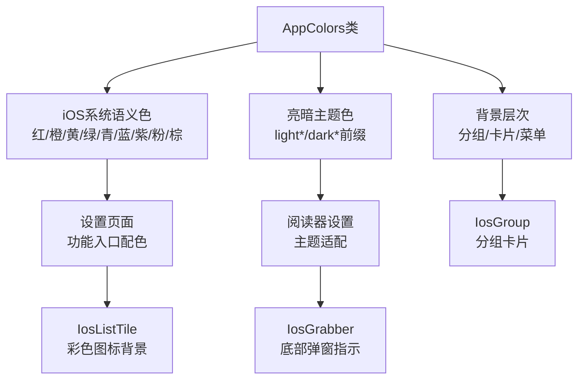
```mermaid
flowchart TD
AppColors["AppColors类"] --> SystemColors["iOS系统语义色<br/>红/橙/黄/绿/青/蓝/紫/粉/棕"]
AppColors --> ThemeColors["亮暗主题色<br/>light*/dark*前缀"]
AppColors --> BackgroundLayers["背景层次<br/>分组/卡片/菜单"]
SystemColors --> SettingsScreen["设置页面<br/>功能入口配色"]
ThemeColors --> ReaderSettings["阅读器设置<br/>主题适配"]
BackgroundLayers --> IosGroup["IosGroup<br/>分组卡片"]
SettingsScreen --> IosListTile["IosListTile<br/>彩色图标背景"]
ReaderSettings --> IosGrabber["IosGrabber<br/>底部弹窗指示"]
```

图表来源
- [flutter_legado/lib/src/theme/app_colors.dart](file://flutter_legado/lib/src/theme/app_colors.dart)
- [flutter_legado/lib/src/screens/settings_screen.dart](file://flutter_legado/lib/src/screens/settings_screen.dart)
- [flutter_legado/lib/src/widgets/reader/reader_settings_sheet.dart](file://flutter_legado/lib/src/widgets/reader/reader_settings_sheet.dart)

章节来源
- [flutter_legado/lib/src/theme/app_colors.dart:13-326](file://flutter_legado/lib/src/theme/app_colors.dart#L13-L326)
- [flutter_legado/lib/src/screens/settings_screen.dart:63-256](file://flutter_legado/lib/src/screens/settings_screen.dart#L63-L256)
- [flutter_legado/lib/src/widgets/reader/reader_settings_sheet.dart:37-38](file://flutter_legado/lib/src/widgets/reader/reader_settings_sheet.dart#L37-L38)

### 全局字体大小配置系统
实现了完整的全局字体大小配置功能，支持0.8x到1.6x的字体缩放范围，并提供系统设置跟随选项。

#### ThemeProvider字体缩放管理
- 字体缩放原始值：使用整数存储（0表示跟随系统，8-16对应0.8x-1.6x）
- 智能判断：isSystemFontScale属性自动检测是否应该跟随系统设置
- 实时应用：通过MediaQuery的textScaler属性实现全局字体缩放
- 持久化存储：使用SharedPreferences保存用户的字体缩放偏好

#### 主题配置界面增强
- 新增"全局字体大小"配置部分，位于主题模式设置下方
- 滑块对话框：提供直观的0.8x到1.6x字体缩放调节界面
- 系统跟随选项："跟随系统"按钮重置为系统默认字体大小
- 实时预览：显示当前字体缩放倍数的可视化反馈

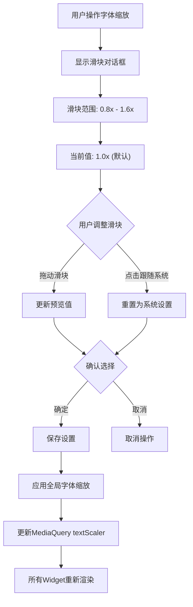
```mermaid
flowchart TD
UserAction["用户操作字体缩放"] --> ShowDialog["显示滑块对话框"]
ShowDialog --> SliderRange["滑块范围: 0.8x - 1.6x"]
SliderRange --> CurrentValue["当前值: 1.0x (默认)"]
CurrentValue --> UserAdjust{"用户调整滑块"}
UserAdjust --> |拖动滑块| UpdatePreview["更新预览值"]
UserAdjust --> |点击跟随系统| ResetToSystem["重置为系统设置"]
UpdatePreview --> Confirm{"确认选择"}
ResetToSystem --> Confirm
Confirm --> |确定| SaveSetting["保存设置"]
Confirm --> |取消| Cancel["取消操作"]
SaveSetting --> ApplyGlobal["应用全局字体缩放"]
ApplyGlobal --> MediaQueryUpdate["更新MediaQuery textScaler"]
MediaQueryUpdate --> AllWidgets["所有Widget重新渲染"]
```

图表来源
- [flutter_legado/lib/src/screens/theme_config_screen.dart](file://flutter_legado/lib/src/screens/theme_config_screen.dart)
- [flutter_legado/lib/src/providers/theme_provider.dart](file://flutter_legado/lib/src/providers/theme_provider.dart)

#### 字体缩放值映射规则
- 原始值0：跟随系统字体设置（返回null给MediaQuery）
- 原始值8-16：转换为0.8x-1.6x的实际缩放倍数
- 超出范围值：视为跟随系统处理
- 展示文本：根据当前值显示"跟随系统"或"当前字体大小：X.X"

**章节来源**
- [flutter_legado/lib/src/providers/theme_provider.dart:21-46](file://flutter_legado/lib/src/providers/theme_provider.dart#L21-L46)
- [flutter_legado/lib/src/screens/theme_config_screen.dart:111-121](file://flutter_legado/lib/src/screens/theme_config_screen.dart#L111-L121)
- [flutter_legado/lib/src/screens/theme_config_screen.dart:263-317](file://flutter_legado/lib/src/screens/theme_config_screen.dart#L263-L317)
- [flutter_legado/lib/src/services/settings_service.dart:184-206](file://flutter_legado/lib/src/services/settings_service.dart#L184-L206)

### SourceEditScreen数据驱动架构设计
**新增** 实现了完整的SourceEditScreen数据驱动架构，采用_Field类定义和懒加载控制器管理机制，支持8标签页结构的书源编辑界面。

#### _Field类定义与数据结构
- 字段定义：_Field类定义了表单字段的基本属性，包括key、label、hint、maxLines、required、keyboardType等
- 数据驱动：通过静态常量数组定义各个Tab的字段配置，实现配置化的表单生成
- 类型安全：使用const构造函数确保字段定义的不可变性和编译时检查

#### 懒加载控制器管理
- 控制器缓存：使用Map<String, TextEditingController>存储文本字段控制器，按key惰性创建
- 内存优化：避免一次性创建大量控制器，只在需要时创建对应的控制器实例
- 生命周期管理：在dispose方法中正确释放所有控制器资源

#### 8标签页结构设计
- 基本信息Tab：书源名称、URL、分组、类型、请求头、登录URL、备注等基础信息
- 搜索规则Tab：搜索URL、校验关键字、书籍列表、书名、作者、简介、分类、最新章节、更新时间、书籍URL、封面URL、字数等搜索相关字段
- 发现规则Tab：发现URL、书籍列表、书名、作者、简介、分类、最新章节、更新时间、书籍URL、封面URL、字数等发现相关字段，包含启用开关
- 详情规则Tab：初始化、书名、作者、简介、分类、最新章节、更新时间、封面URL、目录URL、字数、修改书名、下载URL等详情相关字段
- 目录规则Tab：列表预处理JS、章节列表、章节名称、章节URL、名称格式化JS、卷标识、VIP标识、付费标识、更新时间、下一页URL等目录相关字段
- 内容规则Tab：正文内容、子正文、标题、下一页URL、Web JS、资源正则、替换正则、图片样式、图片解码、付费操作、回调JS等内容相关字段
- 评论规则Tab：段评URL、头像规则、内容规则、发布时间规则、评论引用URL、点赞URL、点踩URL、发表评论URL、发表引用URL、删除URL、评论摘要URL、摘要列表规则、摘要段落索引规则、摘要段落数据规则、摘要数量规则、评论详情URL、评论详情下一页URL、详情列表规则、详情ID规则、详情头像规则、详情昵称规则、详情徽章规则、详情内容规则、回复列表规则、回复ID规则、回复头像规则、回复昵称规则、回复徽章规则、回复内容规则等评论相关字段，包含启用开关
- 测试Tab：测试关键词输入、测试结果展示、错误信息显示等功能

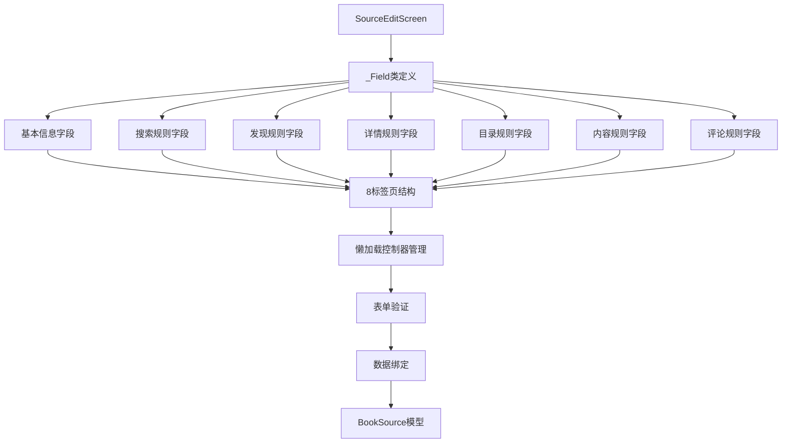
```mermaid
flowchart TD
SourceEdit["SourceEditScreen"] --> FieldDef["_Field类定义"]
FieldDef --> BasicFields["基本信息字段"]
FieldDef --> SearchFields["搜索规则字段"]
FieldDef --> ExploreFields["发现规则字段"]
FieldDef --> InfoFields["详情规则字段"]
FieldDef --> TocFields["目录规则字段"]
FieldDef --> ContentFields["内容规则字段"]
FieldDef --> ReviewFields["评论规则字段"]
BasicFields --> TabBar["8标签页结构"]
SearchFields --> TabBar
ExploreFields --> TabBar
InfoFields --> TabBar
TocFields --> TabBar
ContentFields --> TabBar
ReviewFields --> TabBar
TabBar --> LazyControllers["懒加载控制器管理"]
LazyControllers --> FormValidation["表单验证"]
FormValidation --> DataBinding["数据绑定"]
DataBinding --> BookSourceModel["BookSource模型"]
```

图表来源
- [flutter_legado/lib/src/screens/source_edit_screen.dart](file://flutter_legado/lib/src/screens/source_edit_screen.dart)
- [flutter_legado/lib/src/models/book_source.dart](file://flutter_legado/lib/src/models/book_source.dart)

#### 数据绑定与转换机制
- 数据填充：_sourceToValues方法将BookSource对象展平为key→文本映射，供_populateFields回填控制器
- 数据收集：_buildSource方法从控制器收集字段，构建完整的BookSource对象
- 类型转换：支持字符串、布尔值、整型等不同类型的自动转换和处理
- 空值处理：空字符串统一转换为null，确保数据的完整性

#### 表单验证与用户体验
- 必填验证：对关键字段（如书源名称、URL）进行必填验证
- 实时反馈：验证失败时显示相应的错误提示信息
- 保存状态：保存过程中显示加载状态，防止重复提交
- 错误处理：捕获异常并显示友好的错误信息

**章节来源**
- [flutter_legado/lib/src/screens/source_edit_screen.dart:31-60](file://flutter_legado/lib/src/screens/source_edit_screen.dart#L31-L60)
- [flutter_legado/lib/src/screens/source_edit_screen.dart:90-224](file://flutter_legado/lib/src/screens/source_edit_screen.dart#L90-L224)
- [flutter_legado/lib/src/screens/source_edit_screen.dart:260-370](file://flutter_legado/lib/src/screens/source_edit_screen.dart#L260-L370)
- [flutter_legado/lib/src/screens/source_edit_screen.dart:372-493](file://flutter_legado/lib/src/screens/source_edit_screen.dart#L372-L493)
- [flutter_legado/lib/src/models/book_source.dart:17-58](file://flutter_legado/lib/src/models/book_source.dart#L17-L58)
- [flutter_legado/lib/src/models/rule/rule.dart:8-160](file://flutter_legado/lib/src/models/rule/rule.dart#L8-L160)

### 文本选择面板组件
**新增** 实现了完整的文本选择面板组件，对标Android原版的TextActionMenu，提供长按段落后的操作菜单功能。

#### TextSelectionPanel核心功能
- 段落选择：长按段落后弹出底部面板，显示SelectableText供精细选区调整
- 9项操作菜单：替换、复制、书签、高亮、朗读、词典、搜正文、浏览器、分享
- 高亮配色：支持5种高亮颜色选择（琥珀、绿、蓝、粉、橙），记忆上次使用颜色
- 智能选区：优先使用用户精细选择的文本，未选择时回退到整段文本

#### 面板结构与交互
- 顶部抓取条：36px宽度的拖拽指示条，提升底部弹窗的可操作性
- 已选文本区域：显示选中文本内容和字符数统计，支持长按精细调整
- 操作菜单行：横向滚动的图标按钮，每个按钮包含图标和标签
- 高亮颜色选择：可展开的颜色面板，圆形色块带选中状态指示

#### 数据传递与状态管理
- 段落文本：widget.text接收段落全文作为默认操作文本
- 章节位置：widget.chapterPos记录段落在章节中的起始字符偏移
- 用户选区：_userSelected变量存储用户精细选择的文本片段
- 高亮状态：_showHighlightColors控制高亮颜色面板的显示状态

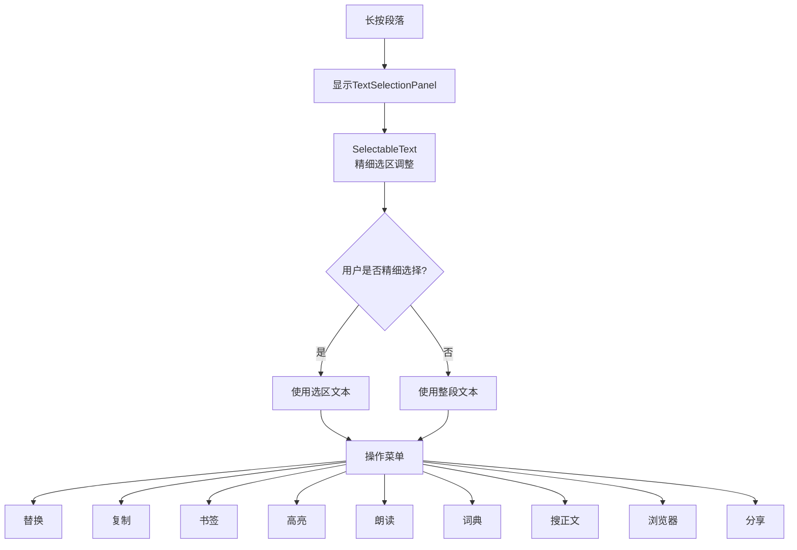
```mermaid
flowchart TD
LongPress["长按段落"] --> ShowPanel["显示TextSelectionPanel"]
ShowPanel --> SelectableText["SelectableText<br/>精细选区调整"]
SelectableText --> UserSelection{"用户是否精细选择?"}
UserSelection --> |是| UseSelection["使用选区文本"]
UserSelection --> |否| UseParagraph["使用整段文本"]
UseSelection --> ActionMenu["操作菜单"]
UseParagraph --> ActionMenu
ActionMenu --> Replace["替换"]
ActionMenu --> Copy["复制"]
ActionMenu --> Bookmark["书签"]
ActionMenu --> Highlight["高亮"]
ActionMenu --> ReadAloud["朗读"]
ActionMenu --> Dict["词典"]
ActionMenu --> Search["搜正文"]
ActionMenu --> Browser["浏览器"]
ActionMenu --> Share["分享"]
```

图表来源
- [flutter_legado/lib/src/widgets/reader/text_selection_panel.dart](file://flutter_legado/lib/src/widgets/reader/text_selection_panel.dart)

#### 高亮功能实现
- 颜色存储：使用JSON格式存储高亮样式，包含type和color字段
- API集成：调用bookApiProvider.highlightAdd方法保存高亮数据
- 颜色格式：ARGB32十六进制格式，支持透明度通道
- 状态记忆：会话内记住上次使用的高亮颜色，提升操作效率

#### 与其他功能的集成
- 书签功能：集成BookmarkNotifier，支持添加章节书签
- 词典功能：调用DictNotifier进行词汇查询
- 搜索功能：跳转到搜索页面，支持正文搜索
- 浏览器功能：支持绝对URL直接打开和网页搜索

**章节来源**
- [flutter_legado/lib/src/widgets/reader/text_selection_panel.dart:40-71](file://flutter_legado/lib/src/widgets/reader/text_selection_panel.dart#L40-L71)
- [flutter_legado/lib/src/widgets/reader/text_selection_panel.dart:73-246](file://flutter_legado/lib/src/widgets/reader/text_selection_panel.dart#L73-L246)
- [flutter_legado/lib/src/widgets/reader/text_selection_panel.dart:278-429](file://flutter_legado/lib/src/widgets/reader/text_selection_panel.dart#L278-L429)

### 阅读器文本内容增强
**更新** 在阅读器文本内容中集成了文本选择面板，支持段落级长按交互。

#### ReaderTextContent长按集成
- 段落级监听：为每个段落添加GestureDetector监听长按事件
- 条件触发：只有非空段落才响应长按，避免误触
- 数据传递：传递段落全文和起始字符位置给TextSelectionPanel
- 滚动模式支持：在滚动模式下同样支持段落长按选择

#### ReaderParagraphs滚动模式支持
- 段落分割：将内容按换行符分割为段落数组
- 长按处理：每个段落都支持长按弹出选择面板
- 空段落处理：空段落不响应长按，避免无效操作
- 样式继承：保持原有的字体、行高、颜色等样式设置

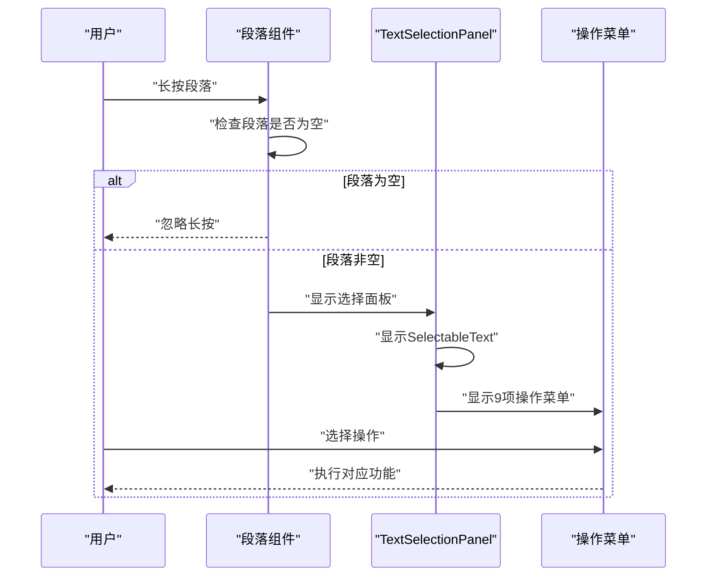
```mermaid
sequenceDiagram
participant User as "用户"
participant Paragraph as "段落组件"
participant Panel as "TextSelectionPanel"
participant Actions as "操作菜单"
User->>Paragraph : "长按段落"
Paragraph->>Paragraph : "检查段落是否为空"
alt 段落为空
Paragraph-->>User : "忽略长按"
else 段落非空
Paragraph->>Panel : "显示选择面板"
Panel->>Panel : "显示SelectableText"
Panel->>Actions : "显示9项操作菜单"
User->>Actions : "选择操作"
Actions-->>User : "执行对应功能"
end
```

图表来源
- [flutter_legado/lib/src/widgets/reader/reader_text_content.dart](file://flutter_legado/lib/src/widgets/reader/reader_text_content.dart)

**章节来源**
- [flutter_legado/lib/src/widgets/reader/reader_text_content.dart:195-212](file://flutter_legado/lib/src/widgets/reader/reader_text_content.dart#L195-L212)
- [flutter_legado/lib/src/widgets/reader/reader_text_content.dart:246-251](file://flutter_legado/lib/src/widgets/reader/reader_text_content.dart#L246-L251)

### 阅读器页面视图优化
**更新** 增强了阅读器页面视图的交互处理和分页功能。

#### ReaderPageView分页优化
- 跨章节无缝翻页：到达本章最后一页时自动进入下一章第一页
- 全局页码指示：显示跨章节的连续页码信息
- 预加载机制：章节加载完成后预加载相邻章节内容
- 自动翻页：支持定时自动翻页功能

#### ReaderScreen交互增强
- 点击区域配置：左三分之一、右三分之一、中间区域的点击行为可配置
- 朗读控制：朗读进行中时显示ReadAloudBar替代底部功能栏
- 状态管理：统一管理控制栏显示、自动翻页、预加载等状态
- 书签功能：支持快速添加章节书签

**重要更新** 修复了点击翻页失效问题，现在直接通过PageController驱动翻页，确保各种翻页模式下的视觉一致性

**新增** 可配置触摸阈值功能，支持通过配置面板实时调整滑动翻页阈值和边缘点击阈值

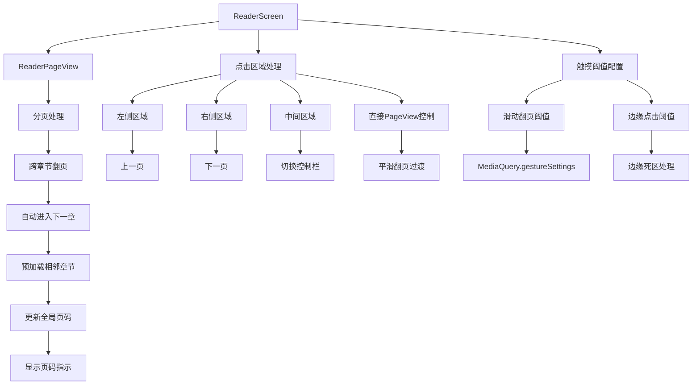
```mermaid
flowchart TD
ReaderScreen["ReaderScreen"] --> PageView["ReaderPageView"]
PageView --> Pagination["分页处理"]
Pagination --> CrossChapter["跨章节翻页"]
CrossChapter --> AutoNext["自动进入下一章"]
AutoNext --> Preload["预加载相邻章节"]
Preload --> GlobalIndex["更新全局页码"]
GlobalIndex --> Display["显示页码指示"]
ReaderScreen --> ClickHandler["点击区域处理"]
ClickHandler --> LeftArea["左侧区域"]
ClickHandler --> RightArea["右侧区域"]
ClickHandler --> CenterArea["中间区域"]
LeftArea --> PrevPage["上一页"]
RightArea --> NextPage["下一页"]
CenterArea --> ToggleControls["切换控制栏"]
ClickHandler --> DirectPageView["直接PageView控制"]
DirectPageView --> SmoothTransition["平滑翻页过渡"]
ReaderScreen --> TouchThreshold["触摸阈值配置"]
TouchThreshold --> PageTouchSlop["滑动翻页阈值"]
TouchThreshold --> PageTouchClick["边缘点击阈值"]
PageTouchSlop --> MediaQueryGesture["MediaQuery.gestureSettings"]
PageTouchClick --> EdgeZone["边缘死区处理"]
```

图表来源
- [flutter_legado/lib/src/sreens/reader_screen.dart](file://flutter_legado/lib/src/sreens/reader_screen.dart)
- [flutter_legado/lib/src/widgets/reader/reader_page_view.dart](file://flutter_legado/lib/src/widgets/reader/reader_page_view.dart)
- [flutter_legado/lib/src/screens/reader_config_panel.dart](file://flutter_legado/lib/src/screens/reader_config_panel.dart)

**章节来源**
- [flutter_legado/lib/src/sreens/reader_screen.dart:134-220](file://flutter_legado/lib/src/sreens/reader_screen.dart#L134-L220)
- [flutter_legado/lib/src/sreens/reader_screen.dart:268-381](file://flutter_legado/lib/src/sreens/reader_screen.dart#L268-L381)
- [flutter_legado/lib/src/widgets/reader/reader_page_view.dart:63-106](file://flutter_legado/lib/src/widgets/reader/reader_page_view.dart#L63-L106)

### 可配置触摸阈值系统
**新增** 实现了完整的可配置触摸阈值系统，支持用户自定义滑动翻页阈值和边缘点击阈值。

#### ReaderAdvancedConfig触摸阈值配置
- 滑动翻页阈值（pageTouchSlop）：控制滑动识别的最小距离，范围0-9999px，0表示使用系统默认值
- 边缘点击阈值（pageTouchClick）：控制左右边缘不触发点击的区域大小，范围0-399px
- 配置持久化：通过SharedPreferences存储用户设置的阈值参数
- 实时应用：修改后即时生效，无需重启阅读页

#### 配置界面实现
- 数值输入对话框：提供直观的数值输入界面，支持0-9999范围的滑动阈值设置
- 边缘阈值设置：提供0-399px范围的边缘点击阈值配置
- 实时预览：显示当前设置的阈值值和单位
- 默认值处理：支持恢复系统默认值（0值）

#### 触摸阈值应用机制
- MediaQuery.gestureSettings：通过覆写gestureSettings的touchSlop属性实现动态阈值调整
- 滚动模式特殊处理：滚动模式下强制取0走系统默认，避免纵向滚动被放大阈值影响
- 其他模式应用：覆盖模式、滑动模式、仿真模式、无动画模式均应用配置的阈值
- 性能优化：仅在阈值非0时包裹MediaQuery，减少不必要的重建

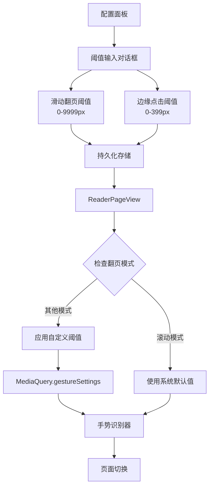
```mermaid
flowchart TD
ConfigPanel["配置面板"] --> ThresholdInput["阈值输入对话框"]
ThresholdInput --> PageTouchSlop["滑动翻页阈值<br/>0-9999px"]
ThresholdInput --> PageTouchClick["边缘点击阈值<br/>0-399px"]
PageTouchSlop --> Persist["持久化存储"]
PageTouchClick --> Persist
Persist --> ReaderPageView["ReaderPageView"]
ReaderPageView --> CheckMode{"检查翻页模式"}
CheckMode --> |滚动模式| SystemDefault["使用系统默认值"]
CheckMode --> |其他模式| ApplySlop["应用自定义阈值"]
ApplySlop --> MediaQueryGesture["MediaQuery.gestureSettings"]
MediaQueryGesture --> GestureRecognizer["手势识别器"]
SystemDefault --> GestureRecognizer
GestureRecognizer --> PageTurn["页面切换"]
```

图表来源
- [flutter_legado/lib/src/screens/reader_config_panel.dart](file://flutter_legado/lib/src/screens/reader_config_panel.dart)
- [flutter_legado/lib/src/widgets/reader/reader_page_view.dart](file://flutter_legado/lib/src/widgets/reader/reader_page_view.dart)

#### 配置持久化机制
- 键名对齐：使用原版AppConfig/PreferKey键名，确保与Android版本的一致性
- 数据类型：整型存储，支持边界检查和默认值处理
- 迁移兼容：支持旧版本配置的自动迁移和兼容性处理
- 异步加载：配置加载不影响页面初始渲染，提升启动性能

**章节来源**
- [flutter_legado/lib/src/screens/reader_config_panel.dart:153-157](file://flutter_legado/lib/src/screens/reader_config_panel.dart#L153-L157)
- [flutter_legado/lib/src/screens/reader_config_panel.dart:260-289](file://flutter_legado/lib/src/screens/reader_config_panel.dart#L260-L289)
- [flutter_legado/lib/src/screens/reader_config_panel.dart:1260-1289](file://flutter_legado/lib/src/screens/reader_config_panel.dart#L1260-L1289)
- [flutter_legado/lib/src/widgets/reader/reader_page_view.dart:546-571](file://flutter_legado/lib/src/widgets/reader/reader_page_view.dart#L546-L571)

### 独立目录页面组件
**新增** 实现了完整的独立目录页面(TocScreen)，替代原有的抽屉式目录实现，提供更丰富的目录浏览功能。

#### TocScreen核心功能
- 三Tab结构：目录、书签、标注三个功能标签页
- 目录功能：支持章节搜索、倒序显示、字数显示、当前章节定位
- 书签管理：支持书签的查看、删除、导出功能
- 标注查看：支持高亮标注的浏览和管理

#### 目录Tab功能
- 章节列表：显示书籍的所有章节，支持卷分组显示
- 搜索过滤：实时搜索章节标题，支持模糊匹配
- 倒序显示：可切换章节的正序/倒序排列
- 字数显示：可选显示每章的字数统计
- 当前章节定位：自动滚动到当前阅读章节

#### 书签Tab功能
- 书签列表：显示所有书签，包含章节名、时间戳、内容摘要
- 滑动删除：支持滑动手势删除书签
- 长按删除：支持长按操作删除书签
- 搜索过滤：支持书签内容的搜索

#### 标注Tab功能
- 标注列表：显示所有高亮标注，包含章节名、标注内容、时间
- 搜索过滤：支持标注内容的搜索
- 跳转功能：点击标注跳转到对应章节位置

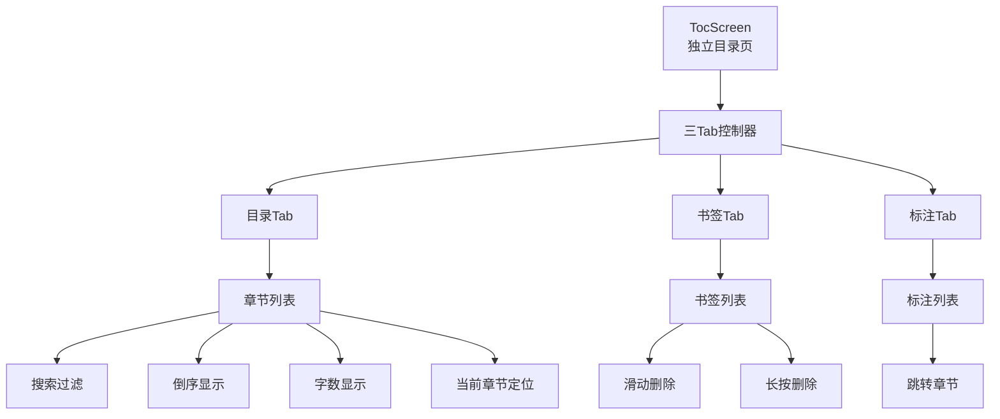
```mermaid
flowchart TD
TocScreen["TocScreen<br/>独立目录页"] --> TabController["三Tab控制器"]
TabController --> ChapterTab["目录Tab"]
TabController --> BookmarkTab["书签Tab"]
TabController --> HighlightTab["标注Tab"]
ChapterTab --> ChapterList["章节列表"]
ChapterList --> SearchFilter["搜索过滤"]
ChapterList --> ReverseOrder["倒序显示"]
ChapterList --> WordCount["字数显示"]
ChapterList --> CurrentChapter["当前章节定位"]
BookmarkTab --> BookmarkList["书签列表"]
BookmarkList --> SwipeDelete["滑动删除"]
BookmarkList --> LongPressDelete["长按删除"]
HighlightTab --> HighlightList["标注列表"]
HighlightList --> JumpToChapter["跳转章节"]
```

图表来源
- [flutter_legado/lib/src/screens/toc_screen.dart](file://flutter_legado/lib/src/screens/toc_screen.dart)

#### 路由集成
- 路由配置：在routes.dart中添加了toc路由，支持Book对象传参
- 导航集成：ReaderScreen和BookInfoScreen中的目录入口已更新为跳转独立页面
- 返回值处理：页面返回时传递选中的章节索引，调用方处理跳转逻辑

**章节来源**
- [flutter_legado/lib/src/screens/toc_screen.dart:25-399](file://flutter_legado/lib/src/screens/toc_screen.dart#L25-L399)
- [flutter_legado/lib/src/screens/toc_screen.dart:403-542](file://flutter_legado/lib/src/screens/toc_screen.dart#L403-L542)
- [flutter_legado/lib/src/screens/toc_screen.dart:546-705](file://flutter_legado/lib/src/screens/toc_screen.dart#L546-L705)
- [flutter_legado/lib/src/screens/toc_screen.dart:709-835](file://flutter_legado/lib/src/screens/toc_screen.dart#L709-L835)
- [flutter_legado/lib/src/routes.dart:230-242](file://flutter_legado/lib/src/routes.dart#L230-L242)

### 章节导航组件增强
**更新** 增强了章节列表和目录抽屉的UI体验，采用半透明背景提升视觉层次感。

#### ChapterTile组件
- 基础章节列表项：支持已读/当前状态高亮显示
- 主题集成：使用Material Design颜色系统进行状态区分
- 交互反馈：当前章节显示播放图标和特殊背景色

#### ReaderCatalogDrawer目录抽屉
- 搜索功能：支持章节标题实时搜索过滤
- 当前章节高亮：突出显示正在阅读的章节
- 导航交互：点击章节后自动关闭抽屉并跳转

#### BookInfoScreen章节列表优化
- 半透明背景：采用82%透明度的surface颜色，让封面虚化背景隐约透出
- iOS景深效果：保持整页iOS设计语言的深度层次感
- 可读性保障：在视觉效果和文字可读性之间取得平衡

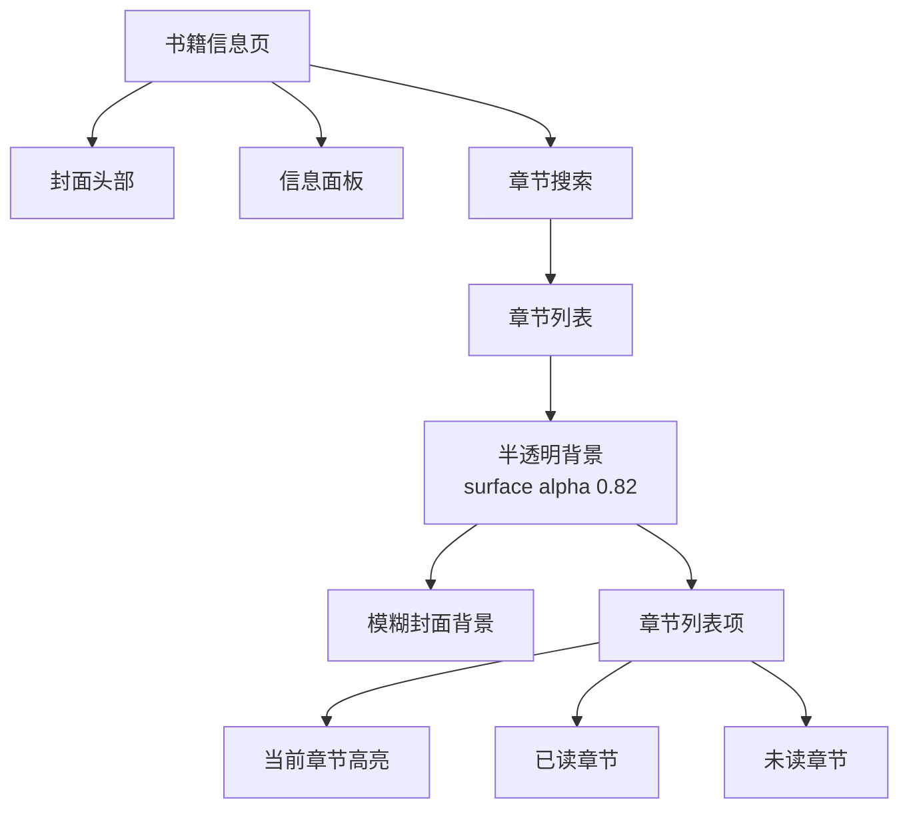
```mermaid
flowchart TD
BookInfoScreen["书籍信息页"] --> Header["封面头部"]
BookInfoScreen --> Summary["信息面板"]
BookInfoScreen --> ChapterSearch["章节搜索"]
ChapterSearch --> ChapterList["章节列表"]
ChapterList --> SemiTransparent["半透明背景<br/>surface alpha 0.82"]
SemiTransparent --> BlurredCover["模糊封面背景"]
SemiTransparent --> ChapterTiles["章节列表项"]
ChapterTiles --> CurrentChapter["当前章节高亮"]
ChapterTiles --> ReadChapters["已读章节"]
ChapterTiles --> UnreadChapters["未读章节"]
```

图表来源
- [flutter_legado/lib/src/screens/book_info_screen.dart](file://flutter_legado/lib/src/screens/book_info_screen.dart)
- [flutter_legado/lib/src/widgets/chapter_tile.dart](file://flutter_legado/lib/src/widgets/chapter_tile.dart)

**章节来源**
- [flutter_legado/lib/src/widgets/chapter_tile.dart:1-50](file://flutter_legado/lib/src/widgets/chapter_tile.dart#L1-L50)
- [flutter_legado/lib/src/screens/book_info_screen.dart:520-719](file://flutter_legado/lib/src/screens/book_info_screen.dart#L520-L719)

### 阅读器状态同步增强
**更新** 强化了阅读器状态同步机制，确保全局页码指示器在阅读过程中的实时更新。

#### ReaderNotifier状态管理
- 位置更新：updatePosition方法在每次翻页时同步全局页索引
- 跨章节分页：CrossChapterPaginator维护章节与全局页码的映射关系
- 实时同步：翻页、滑动等手势操作后立即更新全局页码指示器

#### 全局页码指示器
- 跨章节连续性：显示整本书的连续页码，而非单章节内的页码
- 实时更新：在阅读过程中即时反映当前阅读位置
- 视觉反馈：半透明背景显示，不干扰阅读体验

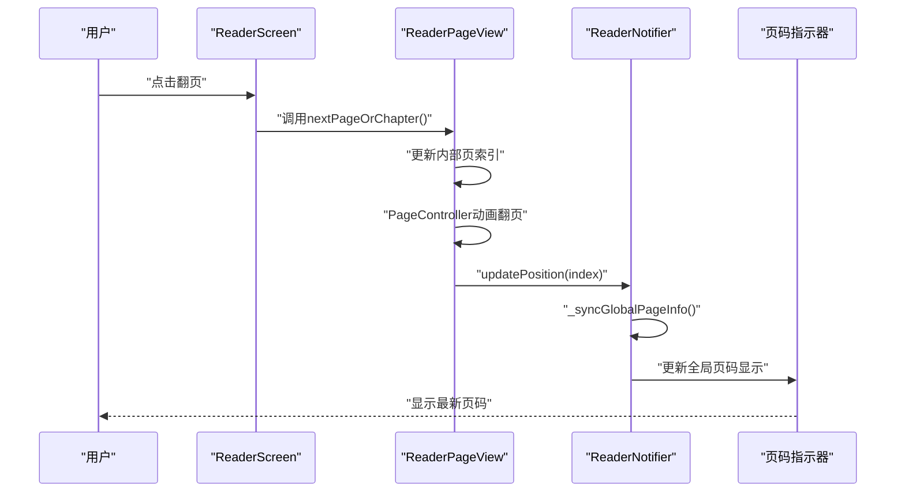
```mermaid
sequenceDiagram
participant User as "用户"
participant ReaderScreen as "ReaderScreen"
participant PageView as "ReaderPageView"
participant Notifier as "ReaderNotifier"
participant Indicator as "页码指示器"
User->>ReaderScreen : "点击翻页"
ReaderScreen->>PageView : "调用nextPageOrChapter()"
PageView->>PageView : "更新内部页索引"
PageView->>PageView : "PageController动画翻页"
PageView->>Notifier : "updatePosition(index)"
Notifier->>Notifier : "_syncGlobalPageInfo()"
Notifier->>Indicator : "更新全局页码显示"
Indicator-->>User : "显示最新页码"
```

图表来源
- [flutter_legado/lib/src/providers/reader/reader_notifier.dart](file://flutter_legado/lib/src/providers/reader/reader_notifier.dart)
- [flutter_legado/lib/src/sreens/reader_screen.dart](file://flutter_legado/lib/src/sreens/reader_screen.dart)

**章节来源**
- [flutter_legado/lib/src/providers/reader/reader_notifier.dart:180-200](file://flutter_legado/lib/src/providers/reader/reader_notifier.dart#L180-L200)
- [flutter_legado/lib/src/sreens/reader_screen.dart:174-199](file://flutter_legado/lib/src/sreens/reader_screen.dart#L174-L199)

### 响应式布局设计
- 屏幕适配：基于屏幕宽度断点划分布局，小屏单列、中屏双列、大屏三列或多列
- 横竖屏切换：监听方向变化，动态调整组件排列与尺寸
- 多设备兼容：针对手机、平板、桌面端优化触控区域与信息密度
- 弹性布局：使用Flex、Grid、AspectRatio等布局控件，确保在不同分辨率下表现稳定

```mermaid
flowchart TD
Entry(["进入页面"]) --> Measure["测量可用空间"]
Measure --> Breakpoint{"判断断点"}
Breakpoint --> |小屏| LayoutA["单列布局"]
Breakpoint --> |中屏| LayoutB["双列布局"]
Breakpoint --> |大屏| LayoutC["多列布局"]
LayoutA --> Orientation{"方向变化?"}
LayoutB --> Orientation
LayoutC --> Orientation
Orientation --> |横屏| AdjustA["调整间距与尺寸"]
Orientation --> |竖屏| AdjustB["恢复默认布局"]
AdjustA --> Render["渲染组件"]
AdjustB --> Render
Render --> Exit(["退出页面"])
```

图表来源
- [flutter_legado/lib/app.dart](file://flutter_legado/lib/app.dart)
- [flutter_legado/lib/main.dart](file://flutter_legado/lib/main.dart)

章节来源
- [flutter_legado/lib/app.dart](file://flutter_legado/lib/app.dart)
- [flutter_legado/lib/main.dart](file://flutter_legado/lib/main.dart)

### 动画与过渡效果
- 页面切换动画：使用PageRouteBuilder或内置路由动画，实现平滑转场
- 交互反馈动画：点击、长按、滑动等手势触发微动效，提升操作感知
- 数据加载动画：骨架屏、进度条、旋转指示器，增强等待体验
- 状态切换动画：展开/收起、显示/隐藏等状态变化的过渡

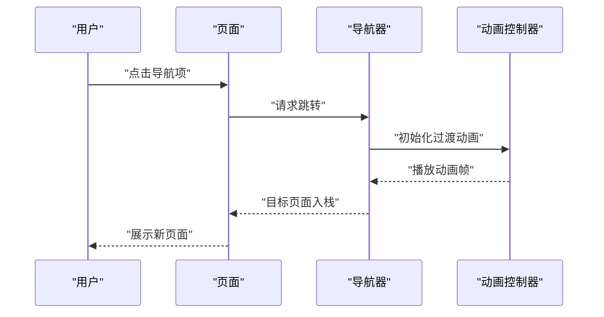
```mermaid
sequenceDiagram
participant U as "用户"
participant P as "页面"
participant N as "导航器"
participant A as "动画控制器"
U->>P : "点击导航项"
P->>N : "请求跳转"
N->>A : "初始化过渡动画"
A-->>N : "播放动画帧"
N-->>P : "目标页面入栈"
P-->>U : "展示新页面"
```

图表来源
- [flutter_legado/lib/app.dart](file://flutter_legado/lib/app.dart)
- [flutter_legado/lib/main.dart](file://flutter_legado/lib/main.dart)

章节来源
- [flutter_legado/lib/app.dart](file://flutter_legado/lib/app.dart)
- [flutter_legado/lib/main.dart](file://flutter_legado/lib/main.dart)

### 导航组件与Material Design定制
- NavigationDestination组件：用于底部导航栏的导航项配置，支持图标和标签的灵活展示
- labelBehavior配置：通过设置labelBehavior属性控制标签显示行为，实现与Android原版一致的无标签显示效果
- 图标优先设计：在空间有限的情况下，优先展示图标，隐藏文字标签以提升视觉简洁性
- 主题集成：导航组件自动继承主题的颜色方案和字体样式，确保整体视觉一致性

**更新** 新增了NavigationDestination组件的labelBehavior配置说明，实现了与Android原版一致的无标签显示效果

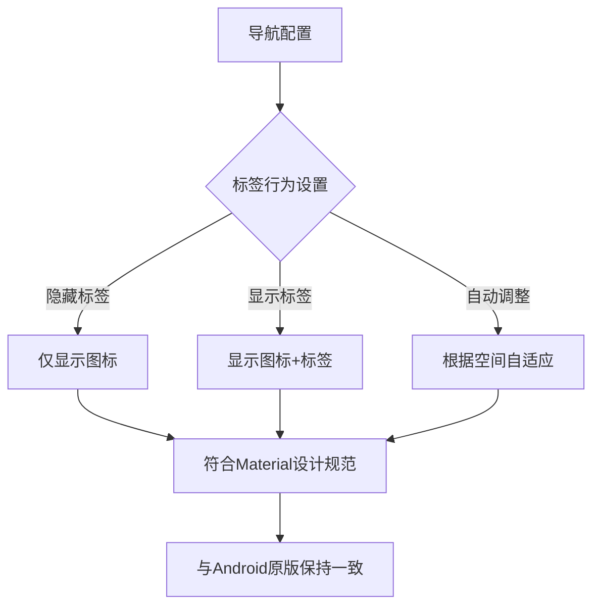
```mermaid
flowchart TD
NavConfig["导航配置"] --> LabelBehavior{"标签行为设置"}
LabelBehavior --> |隐藏标签| IconOnly["仅显示图标"]
LabelBehavior --> |显示标签| FullLabel["显示图标+标签"]
LabelBehavior --> |自动调整| Adaptive["根据空间自适应"]
IconOnly --> MaterialDesign["符合Material设计规范"]
FullLabel --> MaterialDesign
Adaptive --> MaterialDesign
MaterialDesign --> AndroidConsistency["与Android原版保持一致"]
```

图表来源
- [flutter_legado/lib/app.dart](file://flutter_legado/lib/app.dart)
- [flutter_legado/lib/main.dart](file://flutter_legado/lib/main.dart)

章节来源
- [flutter_legado/lib/app.dart](file://flutter_legado/lib/app.dart)
- [flutter_legado/lib/main.dart](file://flutter_legado/lib/main.dart)

### 阅读器配置组件与翻页模式选择
- ReaderAdvancedConfig类：扩展了flipMode字段，用于存储和管理用户的翻页模式偏好设置
- SegmentedButton组件：新增的分段按钮组件，提供直观的翻页模式选择界面，支持多种翻页方式的可视化选择
- 翻页模式选项：包括滑动翻页、点击翻页、滚动翻页等多种模式，满足不同用户的阅读习惯
- 配置持久化：用户选择的翻页模式会自动保存，下次打开应用时恢复上次设置

**更新** 新增了ReaderAdvancedConfig类的flipMode字段扩展和SegmentedButton组件的实现，提供了更好的翻页模式选择用户体验

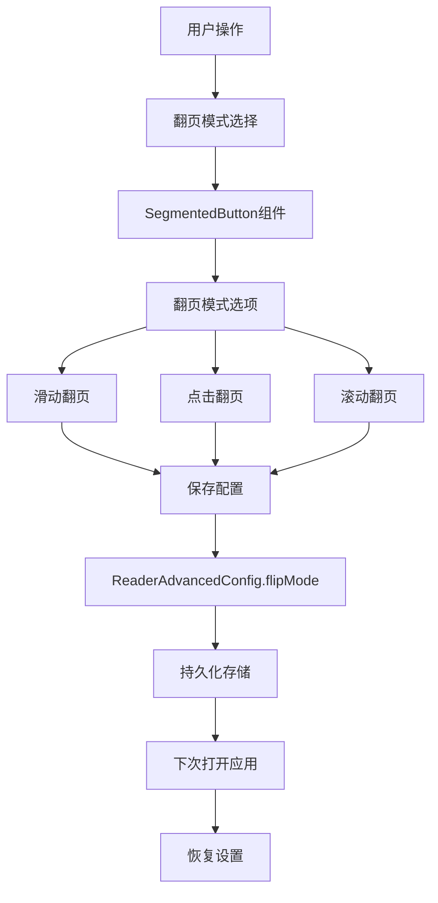
```mermaid
flowchart TD
UserAction["用户操作"] --> FlipModeSelect["翻页模式选择"]
FlipModeSelect --> SegmentedButton["SegmentedButton组件"]
SegmentedButton --> ModeOptions["翻页模式选项"]
ModeOptions --> SlideMode["滑动翻页"]
ModeOptions --> ClickMode["点击翻页"]
ModeOptions --> ScrollMode["滚动翻页"]
SlideMode --> SaveConfig["保存配置"]
ClickMode --> SaveConfig
ScrollMode --> SaveConfig
SaveConfig --> ReaderAdvancedConfig["ReaderAdvancedConfig.flipMode"]
ReaderAdvancedConfig --> Persist["持久化存储"]
Persist --> NextOpen["下次打开应用"]
NextOpen --> RestoreSetting["恢复设置"]
```

图表来源
- [flutter_legado/lib/app.dart](file://flutter_legado/lib/app.dart)
- [flutter_legado/lib/main.dart](file://flutter_legado/lib/main.dart)

章节来源
- [flutter_legado/lib/app.dart](file://flutter_legado/lib/app.dart)
- [flutter_legado/lib/main.dart](file://flutter_legado/lib/main.dart)

### 阅读器屏幕与无动画页面转换
- ReaderScreen类：实现了_buildNoneContent方法，专门处理无动画模式的页面转换逻辑
- 无动画模式：当用户选择不使用翻页动画时，页面切换直接进行，减少视觉干扰
- 性能优化：无动画模式下避免不必要的动画计算，提升页面切换速度
- 用户体验：为追求效率的阅读用户提供更直接的页面浏览体验

**更新** ReaderScreen中新增的_buildNoneContent方法提供了无动画页面转换的支持，增强了阅读器的灵活性

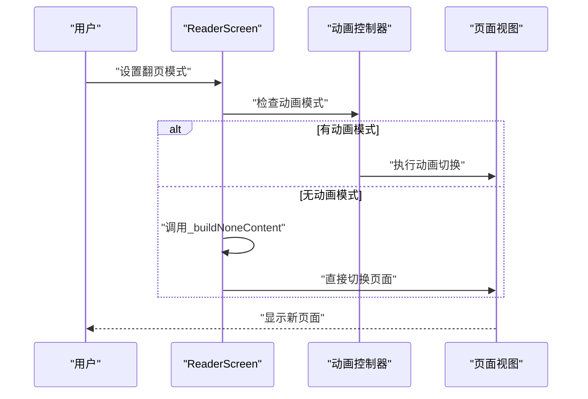
```mermaid
sequenceDiagram
participant User as "用户"
participant ReaderScreen as "ReaderScreen"
participant AnimationController as "动画控制器"
participant PageView as "页面视图"
User->>ReaderScreen : "设置翻页模式"
ReaderScreen->>AnimationController : "检查动画模式"
alt 有动画模式
AnimationController->>PageView : "执行动画切换"
else 无动画模式
ReaderScreen->>ReaderScreen : "调用_buildNoneContent"
ReaderScreen->>PageView : "直接切换页面"
end
PageView-->>User : "显示新页面"
```

图表来源
- [flutter_legado/lib/app.dart](file://flutter_legado/lib/app.dart)
- [flutter_legado/lib/main.dart](file://flutter_legado/lib/main.dart)

章节来源
- [flutter_legado/lib/app.dart](file://flutter_legado/lib/app.dart)
- [flutter_legado/lib/main.dart](file://flutter_legado/lib/main.dart)

### 组件复用模式与设计系统规范
- 参数化设计：所有组件暴露必要属性，支持主题注入与行为定制
- 回调优先：通过回调函数处理外部状态变更，避免内部状态污染
- 组合优于继承：通过组合基础组件构建复合组件，降低复杂度
- 命名约定：组件名反映用途，属性名语义清晰，便于团队协作
- 文档与示例：每个组件附带使用说明与示例代码，降低学习成本

章节来源
- [flutter_legado/lib/app.dart](file://flutter_legado/lib/app.dart)
- [flutter_legado/lib/main.dart](file://flutter_legado/lib/main.dart)

## 依赖分析
Flutter工程的依赖管理通过 pubspec.yaml 维护，包括框架版本、第三方库与本地模块。合理拆分依赖有助于减少包体积与冲突风险。

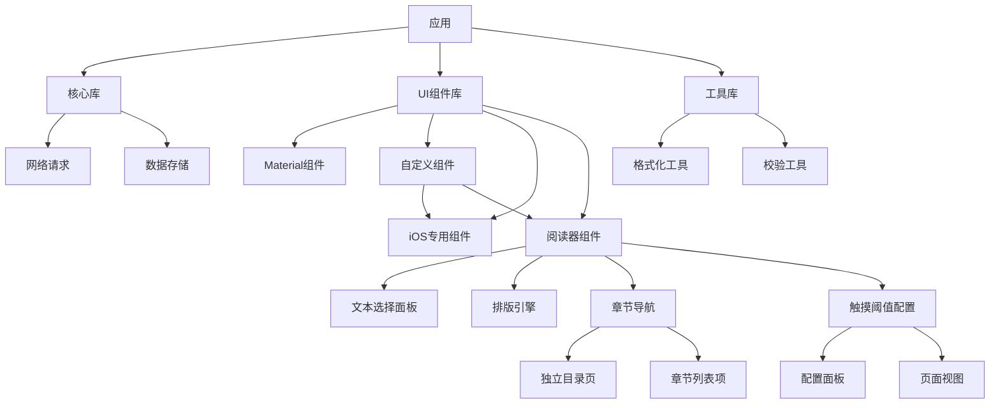
```mermaid
graph TB
App["应用"] --> Core["核心库"]
App --> UI["UI组件库"]
App --> Utils["工具库"]
Core --> Network["网络请求"]
Core --> Storage["数据存储"]
UI --> Material["Material组件"]
UI --> Custom["自定义组件"]
UI --> iOS["iOS专用组件"]
UI --> Reader["阅读器组件"]
Custom --> iOS
Custom --> Reader
Utils --> Format["格式化工具"]
Utils --> Validation["校验工具"]
Reader --> Selection["文本选择面板"]
Reader --> Layout["排版引擎"]
Reader --> Navigation["章节导航"]
Reader --> TouchThreshold["触摸阈值配置"]
Navigation --> Catalog["独立目录页"]
Navigation --> Tiles["章节列表项"]
TouchThreshold --> ConfigPanel["配置面板"]
TouchThreshold --> PageView["页面视图"]
```

图表来源
- [flutter_legado/pubspec.yaml](file://flutter_legado/pubspec.yaml)

章节来源
- [flutter_legado/pubspec.yaml](file://flutter_legado/pubspec.yaml)

## 性能考虑
- 组件重建优化：合理使用StatelessWidget与setState，避免不必要的重建
- 图片与资源：使用缓存机制，按需加载大图，压缩静态资源
- 动画性能：控制动画帧率，避免在主线程执行耗时操作
- 内存管理：及时释放不使用的资源，防止内存泄漏
- 首屏加载：延迟非关键组件加载，提升启动速度
- 翻页模式优化：无动画模式下减少计算开销，提升页面切换性能
- 字体缩放性能：全局字体缩放通过MediaQuery一次性应用，避免重复计算
- **懒加载优化**：SourceEditScreen中的控制器懒加载机制有效减少了内存占用，只在需要时创建控制器实例
- **数据绑定优化**：通过键值映射实现高效的数据填充和收集，避免复杂的对象转换
- **iOS组件性能**：IosGroup使用Column布局而非ListView，适合固定数量的分组内容，避免不必要的滚动计算
- **文本选择性能**：TextSelectionPanel使用ModalBottomSheet轻量级实现，避免复杂的状态管理
- **段落渲染优化**：ReaderTextContent采用逐行渲染，避免大文本的一次性处理
- **分页缓存机制**：ReaderPageView缓存分页结果，避免重复计算
- **章节列表性能**：ChapterTile组件采用轻量级实现，避免不必要的状态管理
- **目录抽屉优化**：ReaderCatalogDrawer使用ListView.builder实现虚拟滚动，支持大数据量章节列表
- **半透明背景性能**：BookInfoScreen的半透明背景使用Color.withValues(alpha:)实现，避免额外的图层叠加
- **独立目录页性能**：TocScreen使用TabBarView实现三Tab切换，每个Tab独立管理状态，避免不必要的重建
- **搜索防抖优化**：TocScreen中的搜索功能使用300ms防抖，减少频繁的重绘操作
- **虚拟滚动优化**：章节列表使用ListView.builder配合itemExtent，提升长列表滚动性能
- **触摸阈值性能**：ReaderPageView中仅在阈值非0时包裹MediaQuery，避免不必要的重建开销
- **配置加载优化**：ReaderAdvancedConfig采用异步加载机制，不影响页面初始渲染性能
- **手势识别优化**：通过MediaQuery.gestureSettings统一应用触摸阈值，避免重复的手势识别器创建

**新增** 可配置触摸阈值系统的性能优化，包括条件性MediaQuery包裹、异步配置加载和手势识别器优化等技术手段。

[本节为通用指导，无需特定文件引用]

## 故障排查指南
- 主题未生效：检查主题上下文是否正确传递，确认组件是否使用了主题变量
- 布局错乱：验证断点判断逻辑，检查约束条件与比例设置
- 动画卡顿：分析动画控制器生命周期，优化计算密集型操作
- 组件不更新：确认状态变更是否触发重建，检查依赖关系
- 依赖冲突：清理缓存并重新解析依赖，锁定版本避免漂移
- 导航标签显示异常：检查NavigationDestination的labelBehavior配置，确保与预期显示效果一致
- 翻页模式设置无效：确认ReaderAdvancedConfig.flipMode字段是否正确保存和读取
- SegmentedButton组件问题：检查分段按钮的选项配置和数据绑定
- **字体缩放无效**：检查ThemeProvider.fontScale是否正确应用到MediaQuery，确认fontScaleRaw值是否在有效范围内
- **全局字体大小不生效**：验证SettingsService中的字体缩放存储键值是否正确，检查theme_config_screen中的滑块对话框实现
- **SourceEditScreen字段不显示**：检查_Field定义是否正确，确认字段key与BookSource字段映射关系
- **懒加载控制器失效**：验证_ctrl方法的实现，检查控制器是否正确创建和释放
- **8标签页结构异常**：确认DefaultTabController的length设置为8，检查各Tab的字段定义完整性
- **数据绑定失败**：检查_sourceToValues和_buildSource方法的字段映射，确认数据类型转换正确性
- **iOS组件样式异常**：检查AppColors类是否正确导入，确认主题颜色是否被正确应用
- **IosGroup分隔线不显示**：验证separatorIndent属性设置，检查children数量是否大于1
- **IosListTile图标颜色问题**：确认iconColor和iconBackground属性配置，检查主题色对比度
- **IosGrabber位置不正确**：检查在BottomSheet中的使用位置，确认SafeArea包裹
- **文本选择面板不显示**：检查TextSelectionPanel.show方法的调用时机，确认段落文本是否为空
- **长按无响应**：验证ReaderTextContent中的GestureDetector配置，检查段落内容是否为空
- **高亮功能异常**：检查bookApiProvider.highlightAdd方法的调用，确认高亮数据格式正确
- **跨章节翻页异常**：验证ReaderPageView中的分页状态管理，检查章节索引边界处理
- **全局页码指示错误**：检查updatePosition方法的调用时机，确认页码同步逻辑
- **点击翻页失效**：确认ReaderScreen._handleTap方法中直接调用PageView控制器的逻辑，检查pageViewKey的使用
- **章节列表背景异常**：验证BookInfoScreen中tocPanelColor的设置，确认alpha值为0.82
- **目录抽屉搜索无效**：检查ReaderCatalogDrawer中的_searchQuery状态管理和过滤逻辑
- **章节高亮显示问题**：验证ChapterTile组件的isCurrent和isRead状态处理，确认颜色对比度
- **独立目录页无法访问**：检查routes.dart中的toc路由配置，确认Navigator.pushNamed调用是否正确
- **TocScreen数据加载失败**：验证BookApi.getChapters和highlightListByBook方法的调用，检查错误处理逻辑
- **目录Tab搜索无响应**：检查TocScreen中的_searching状态管理和防抖定时器，确认_searchKey更新逻辑
- **书签Tab数据为空**：验证bookmarkNotifierProvider的状态管理，检查loadByBook方法的调用
- **标注Tab显示异常**：检查highlightListByBook的JSON解析逻辑，确认数据类型转换正确性
- **触摸阈值配置无效**：检查ReaderAdvancedConfig.pageTouchSlop和pageTouchClick字段的持久化和读取逻辑
- **滑动翻页阈值不生效**：验证ReaderPageView中_applyPageTouchSlop方法的调用，确认MediaQuery.gestureSettings的正确应用
- **边缘点击阈值异常**：检查ReaderScreen中边缘死区的处理逻辑，确认pageTouchClick参数的正确使用
- **滚动模式下阈值失效**：验证滚动模式下强制取0的逻辑，确认不同翻页模式下的阈值处理差异
- **配置面板数值输入问题**：检查_showNumberDialog方法的实现，确认数值范围和边界检查
- **配置持久化失败**：验证SharedPreferences的读写操作，检查键名和默认值处理

**新增** 可配置触摸阈值系统的故障排查指南，包括配置持久化、阈值应用、滚动模式处理和配置界面等相关问题的解决方案。

章节来源
- [flutter_legado/lib/app.dart](file://flutter_legado/lib/app.dart)
- [flutter_legado/lib/main.dart](file://flutter_legado/lib/main.dart)

## 结论
本UI组件系统以主题驱动为核心，通过分层化的组件设计与响应式布局策略，实现了跨设备的一致体验。结合动画与过渡效果，提升了用户交互的流畅性与愉悦感。遵循组件复用模式与设计系统规范，可有效提高开发效率与维护性。通过NavigationDestination组件的labelBehavior配置优化，进一步确保了与Android原版的视觉一致性。新增的ReaderAdvancedConfig类和SegmentedButton组件为翻页模式选择提供了更好的用户体验，而ReaderScreen的无动画页面转换功能则满足了不同用户的性能需求。

**重要更新** 最新的阅读器屏幕导航增强解决了点击翻页失效问题，通过直接PageView控制确保各种翻页模式下的视觉一致性。章节列表UI的半透明背景（82%透明度）提升了iOS景深效果和视觉层次感。阅读器状态同步机制的强化确保了全局页码指示器在阅读过程中的实时更新，为用户提供准确的阅读位置反馈。这些改进显著提升了阅读体验的流畅性和一致性。

**重大架构变更** 移除了旧的抽屉式目录实现(reader_catalog_drawer.dart)，功能已完全迁移至独立的目录屏幕(TocScreen)。这一变更带来了以下优势：
- **功能完整性**：TocScreen提供了更丰富的目录浏览功能，包括三Tab结构（目录/书签/标注）
- **用户体验提升**：独立页面提供了更大的操作空间和更清晰的界面布局
- **性能优化**：Tab状态分离避免了不必要的组件重建，搜索功能增加了防抖优化
- **可维护性增强**：职责单一的独立页面更易于测试和维护

**新增的全局字体大小配置功能**为用户提供了更灵活的字体大小调节选项，支持0.8x到1.6x的缩放范围和系统设置跟随模式，进一步完善了应用的无障碍访问能力和用户体验。**新增的SourceEditScreen数据驱动架构设计**采用了_Field类定义和懒加载控制器管理机制，实现了8标签页结构的书源编辑界面，大大提升了书源管理的效率和用户体验。**新增的iOS专用组件库**为应用带来了符合iOS设计规范的分组列表界面，包括IosGroup、IosListTile、IosSectionHeader、IosGrabber等组件，在设置页面和阅读器设置中得到了广泛应用，显著提升了iOS平台的用户体验。**最新的文本选择面板组件**为阅读器提供了专业的文本交互功能，支持长按段落弹出操作菜单，包含替换、复制、书签、高亮、朗读、词典、搜正文、浏览器、分享等9项功能，大幅提升了阅读体验的丰富性和实用性。

**最新增强** 可配置触摸阈值系统为用户提供了更精细的触摸交互控制，支持滑动翻页阈值和边缘点击阈值的自定义设置。通过配置面板的直观界面，用户可以轻松调整触摸灵敏度，获得更符合个人习惯的阅读体验。该系统采用MediaQuery.gestureSettings实现动态阈值应用，无需重启阅读页即可即时生效，同时保证了良好的性能和兼容性。

未来可进一步引入更多自动化测试与性能监控手段，持续优化用户体验。

[本节为总结性内容，无需特定文件引用]

## 附录
- 开发环境搭建：参考项目根目录的README与pubspec.yaml中的依赖说明
- 组件使用示例：在test目录下查找对应组件的测试用例，了解典型用法
- 构建与发布：使用scripts目录下的脚本进行多平台构建

章节来源
- [flutter_legado/README.md](file://flutter_legado/README.md)
- [flutter_legado/pubspec.yaml](file://flutter_legado/pubspec.yaml)