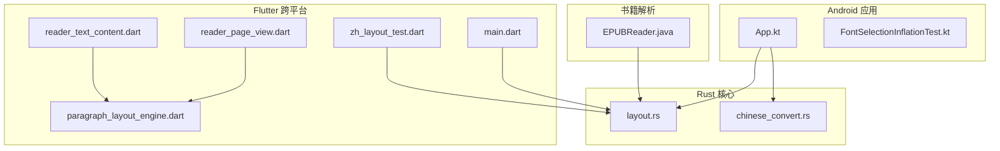
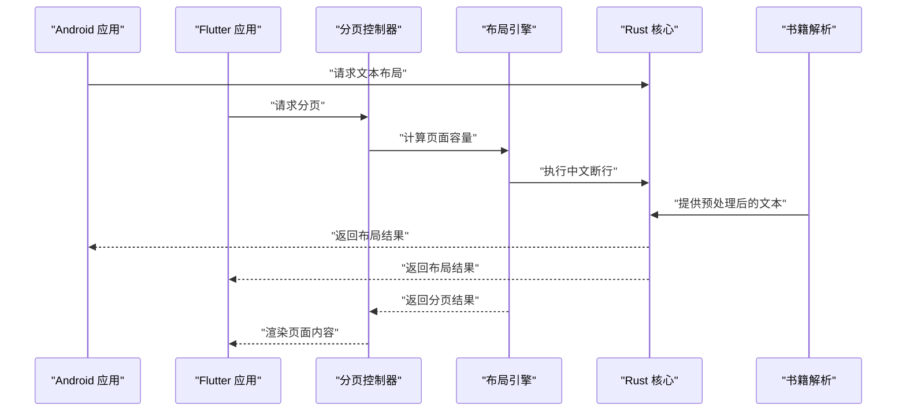
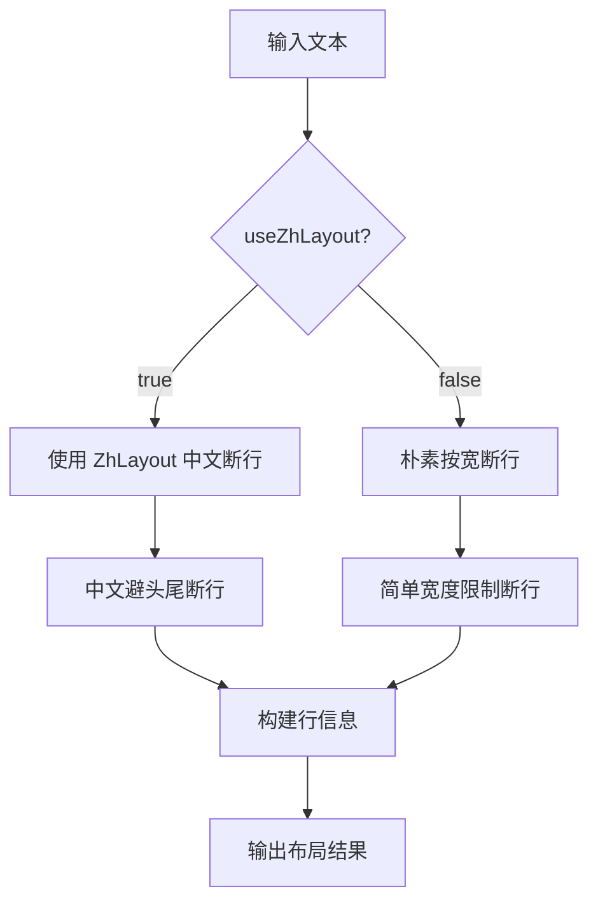
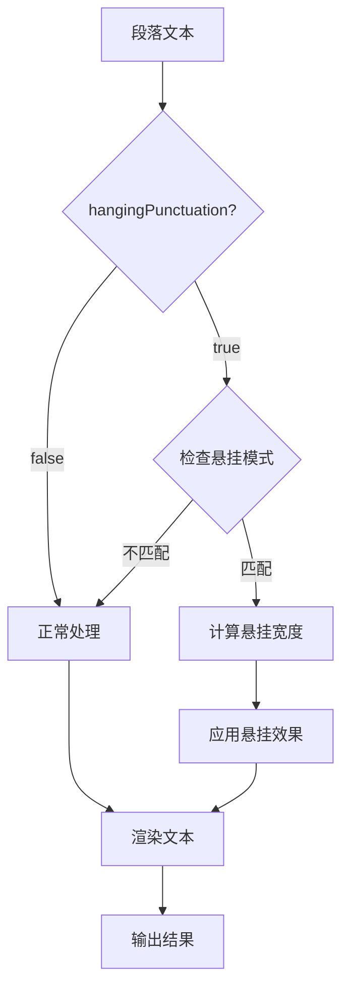
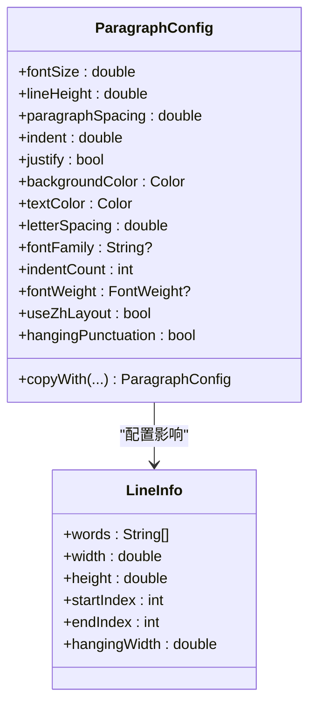
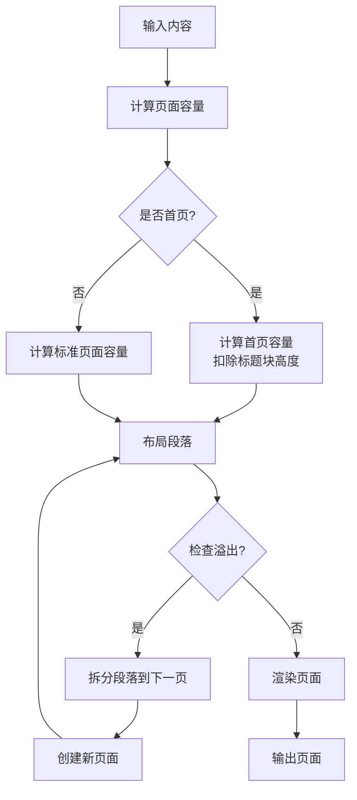
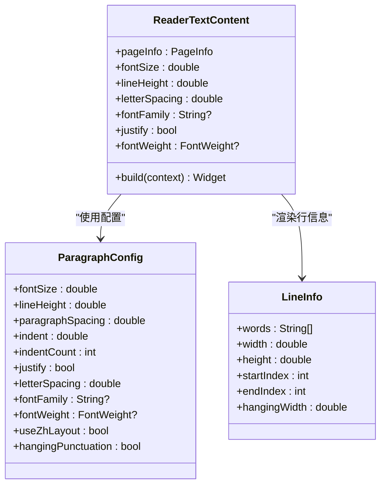
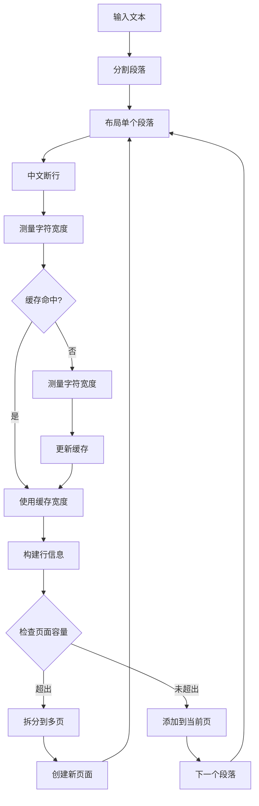
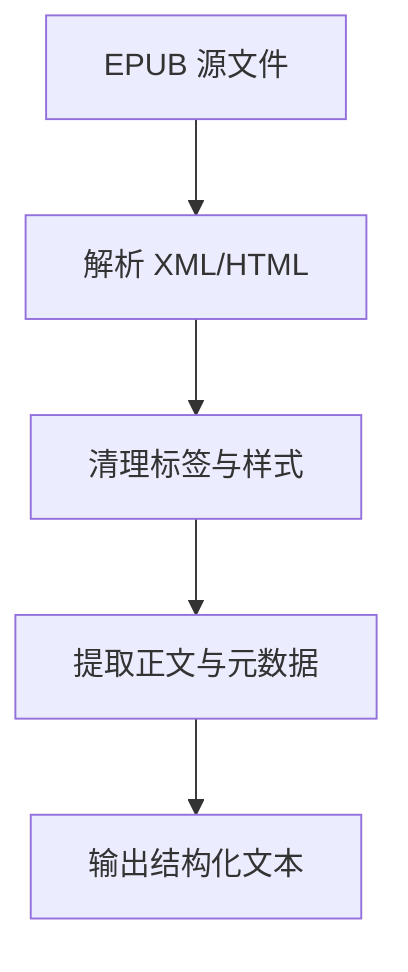
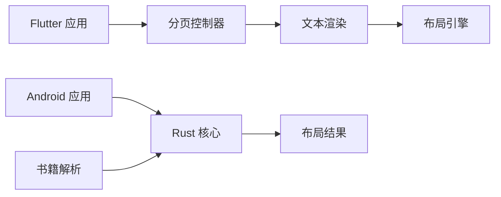

# 中文排版引擎

<cite>
**本文引用的文件**
- [README.md](file://README.md)
- [KOTLIN_LAYOUT_ANALYSIS.md](file://KOTLIN_LAYOUT_ANALYSIS.md)
- [app/src/main/java/io/legado/app/App.kt](file://app/src/main/java/io/legado/app/App.kt)
- [app/src/main/java/io/legado/app/ui/font/FontSelectionInflationTest.kt](file://app/src/main/java/io/legado/app/ui/font/FontSelectionInflationTest.kt)
- [flutter_legado/lib/src/main.dart](file://flutter_legado/lib/src/main.dart)
- [flutter_legado/test/widgets/zh_layout_test.dart](file://flutter_legado/test/widgets/zh_layout_test.dart)
- [rust/legado-core/src/layout.rs](file://rust/legado-core/src/layout.rs)
- [rust/legado-core/src/chinese_convert.rs](file://rust/legado-core/src/chinese_convert.rs)
- [modules/book/src/main/java/me/ag2s/epublib/EPUBReader.java](file://modules/book/src/main/java/me/ag2s/epublib/EPUBReader.java)
- [flutter_legado/lib/src/widgets/reader/reader_page_view.dart](file://flutter_legado/lib/src/widgets/reader/reader_page_view.dart)
- [flutter_legado/lib/src/widgets/reader/reader_text_content.dart](file://flutter_legado/lib/src/widgets/reader/reader_text_content.dart)
- [flutter_legado/lib/src/widgets/paragraph_layout_engine.dart](file://flutter_legado/lib/src/widgets/paragraph_layout_engine.dart)
- [flutter_legado/test/unit/reader_pagination_overflow_test.dart](file://flutter_legado/test/unit/reader_pagination_overflow_test.dart)
- [flutter_legado/test/widget/paragraph_layout_test.dart](file://flutter_legado/test/widget/paragraph_layout_test.dart)
- [flutter_legado/test/widget/paginate_integration_test.dart](file://flutter_legado/test/widget/paginate_integration_test.dart)
</cite>

## 更新摘要
**所做更改**
- 段落布局引擎增强了可定制的中文文本布局切换和标点悬挂支持
- 新增 useZhLayout 参数实现中文断行与朴素断行的灵活切换
- 新增 hangingPunctuation 功能支持段首标点悬挂进缩进区
- 改进了 ParagraphConfig 类，增加了更多排版配置选项
- 改进了 LineInfo 类，新增了 hangingWidth 字段支持悬挂渲染
- 增强了分页高度一致性验证和测试覆盖

## 目录
1. [简介](#简介)
2. [项目结构](#项目结构)
3. [核心组件](#核心组件)
4. [架构总览](#架构总览)
5. [详细组件分析](#详细组件分析)
6. [依赖关系分析](#依赖关系分析)
7. [性能考量](#性能考量)
8. [故障排查指南](#故障排查指南)
9. [结论](#结论)
10. [附录](#附录)

## 简介
本文件聚焦于 Legado 项目中的"中文排版引擎"能力，围绕多端（Android、Flutter、Rust）的字体选择、文本布局与中文处理进行系统性说明。内容涵盖系统架构、关键组件职责、数据流与控制流、错误处理与性能优化建议，并辅以可视化图示帮助非技术读者理解。

**更新** 段落布局引擎得到了显著增强，新增了可定制的中文文本布局切换功能和标点悬挂支持。通过 useZhLayout 参数可以灵活选择使用 ZhLayout 中文断行引擎或朴素按宽断行，hangingPunctuation 功能实现了段首标点悬挂进缩进区的专业排版效果。

## 项目结构
Legado 采用多模块、多语言协作：
- Android 应用层负责 UI 渲染与字体选择测试；
- Flutter 跨平台层提供页面与布局测试；
- Rust 核心库实现高性能文本布局与中文转换等通用能力；
- 书籍解析模块（如 EPUB）为内容预处理提供基础。

**图表来源**
- [app/src/main/java/io/legado/app/App.kt](file://app/src/main/java/io/legado/app/App.kt)
- [app/src/main/java/io/legado/app/ui/font/FontSelectionInflationTest.kt](file://app/src/main/java/io/legado/app/ui/font/FontSelectionInflationTest.kt)
- [flutter_legado/lib/src/main.dart](file://flutter_legado/lib/src/main.dart)
- [flutter_legado/test/widgets/zh_layout_test.dart](file://flutter_legado/test/widgets/zh_layout_test.dart)
- [flutter_legado/lib/src/widgets/reader/reader_page_view.dart](file://flutter_legado/lib/src/widgets/reader/reader_page_view.dart)
- [flutter_legado/lib/src/widgets/reader/reader_text_content.dart](file://flutter_legado/lib/src/widgets/reader/reader_text_content.dart)
- [flutter_legado/lib/src/widgets/paragraph_layout_engine.dart](file://flutter_legado/lib/src/widgets/paragraph_layout_engine.dart)
- [rust/legado-core/src/layout.rs](file://rust/legado-core/src/layout.rs)
- [rust/legado-core/src/chinese_convert.rs](file://rust/legado-core/src/chinese_convert.rs)
- [modules/book/src/main/java/me/ag2s/epublib/EPUBReader.java](file://modules/book/src/main/java/me/ag2s/epublib/EPUBReader.java)

**章节来源**
- [README.md](file://README.md)
- [KOTLIN_LAYOUT_ANALYSIS.md](file://KOTLIN_LAYOUT_ANALYSIS.md)

## 核心组件
- 字体选择与验证（Android）：通过单元测试驱动字体加载与尺寸计算，确保中文字体可用且度量准确。
- 跨平台布局入口（Flutter）：在应用启动时初始化布局相关能力，并在测试中验证中文布局行为。
- 文本布局与中文处理（Rust）：提供高性能的文本布局算法与中文转换工具，供上层调用。
- 书籍内容预处理（EPUB）：将电子书内容转换为可排版的中间表示，便于后续布局。
- **新增** 可定制中文布局切换：通过 useZhLayout 参数控制是否使用 ZhLayout 中文断行引擎。
- **新增** 标点悬挂功能：hangingPunctuation 支持段首标点悬挂进缩进区的专业排版效果。
- **增强** 段落样式配置：ParagraphConfig 新增了更多排版控制选项。

**更新** 段落布局引擎现在支持灵活的中文文本布局切换和专业的标点悬挂功能。useZhLayout 参数允许在中文避头尾断行和朴素按宽断行之间自由切换，hangingPunctuation 功能实现了符合出版标准的段首标点悬挂效果。

**章节来源**
- [app/src/main/java/io/legado/app/ui/font/FontSelectionInflationTest.kt](file://app/src/main/java/io/legado/app/ui/font/FontSelectionInflationTest.kt)
- [flutter_legado/lib/src/main.dart](file://flutter_legado/lib/src/main.dart)
- [flutter_legado/test/widgets/zh_layout_test.dart](file://flutter_legado/test/widgets/zh_layout_test.dart)
- [flutter_legado/lib/src/widgets/reader/reader_page_view.dart](file://flutter_legado/lib/src/widgets/reader/reader_page_view.dart)
- [flutter_legado/lib/src/widgets/reader/reader_text_content.dart](file://flutter_legado/lib/src/widgets/reader/reader_text_content.dart)
- [flutter_legado/lib/src/widgets/paragraph_layout_engine.dart](file://flutter_legado/lib/src/widgets/paragraph_layout_engine.dart)
- [rust/legado-core/src/layout.rs](file://rust/legado-core/src/layout.rs)
- [rust/legado-core/src/chinese_convert.rs](file://rust/legado-core/src/chinese_convert.rs)
- [modules/book/src/main/java/me/ag2s/epublib/EPUBReader.java](file://modules/book/src/main/java/me/ag2s/epublib/EPUBReader.java)

## 架构总览
中文排版引擎遵循"输入→预处理→布局→输出"的分层设计：
- 输入层：来自书籍解析器或用户输入的原始文本；
- 预处理层：编码检测、字符规范化、中文转换；
- 布局层：分词、断行、字距调整、行高与段落样式；
- 输出层：绘制到屏幕或导出为文档。

**更新** 新的可定制布局切换功能允许根据需求选择不同的断行策略，标点悬挂功能提升了专业排版的视觉效果。

**图表来源**
- [app/src/main/java/io/legado/app/App.kt](file://app/src/main/java/io/legado/app/App.kt)
- [flutter_legado/lib/src/main.dart](file://flutter_legado/lib/src/main.dart)
- [flutter_legado/lib/src/widgets/reader/reader_page_view.dart](file://flutter_legado/lib/src/widgets/reader/reader_page_view.dart)
- [flutter_legado/lib/src/widgets/paragraph_layout_engine.dart](file://flutter_legado/lib/src/widgets/paragraph_layout_engine.dart)
- [rust/legado-core/src/layout.rs](file://rust/legado-core/src/layout.rs)
- [modules/book/src/main/java/me/ag2s/epublib/EPUBReader.java](file://modules/book/src/main/java/me/ag2s/epublib/EPUBReader.java)

## 详细组件分析

### 字体选择与验证（Android）
- 目标：确保中文字体正确加载、度量准确，避免换行与对齐异常。
- 关键点：
  - 字体资源定位与加载策略；
  - 字体度量（字号、行高、基线）校验；
  - 失败回退机制（无合适字体时的降级）。

**图表来源**
- [app/src/main/java/io/legado/app/ui/font/FontSelectionInflationTest.kt](file://app/src/main/java/io/legado/app/ui/font/FontSelectionInflationTest.kt)

**章节来源**
- [app/src/main/java/io/legado/app/ui/font/FontSelectionInflationTest.kt](file://app/src/main/java/io/legado/app/ui/font/FontSelectionInflationTest.kt)

### 可定制中文布局切换
- 目标：提供灵活的中文文本布局策略选择。
- 关键点：
  - useZhLayout=true：使用 ZhLayout 中文避头尾断行引擎；
  - useZhLayout=false：使用朴素按宽断行，对齐原版 StaticLayout 语义；
  - 两种模式共享相同的字符宽度缓存和测量逻辑。

**更新** 新增的 useZhLayout 参数提供了两种不同的断行策略，用户可以根据具体需求选择合适的布局方式。

**图表来源**
- [flutter_legado/lib/src/widgets/paragraph_layout_engine.dart](file://flutter_legado/lib/src/widgets/paragraph_layout_engine.dart)

**章节来源**
- [flutter_legado/lib/src/widgets/paragraph_layout_engine.dart](file://flutter_legado/lib/src/widgets/paragraph_layout_engine.dart)

### 标点悬挂功能
- 目标：实现段首标点悬挂进缩进区的专业排版效果。
- 关键点：
  - hangingPunctuation=true：启用段首标点悬挂；
  - 检测段首是否为缩进空格 + 起始引号组合；
  - 悬挂行首行可用宽度增加缩进宽度；
  - 仅对首行生效，后续行正常处理。

**更新** hangingPunctuation 功能实现了符合出版标准的段首标点悬挂效果，提升了专业文档的排版质量。

**图表来源**
- [flutter_legado/lib/src/widgets/paragraph_layout_engine.dart](file://flutter_legado/lib/src/widgets/paragraph_layout_engine.dart)

**章节来源**
- [flutter_legado/lib/src/widgets/paragraph_layout_engine.dart](file://flutter_legado/lib/src/widgets/paragraph_layout_engine.dart)

### 增强的段落样式配置
- 目标：提供更丰富的段落样式控制选项。
- 关键点：
  - ParagraphConfig 新增了 useZhLayout 和 hangingPunctuation 参数；
  - 支持 copyWith 方法创建修改后的配置副本；
  - 所有配置项都支持默认值和自定义设置。

**更新** ParagraphConfig 类现在包含了完整的排版配置选项，包括中文布局切换和标点悬挂控制。

**图表来源**
- [flutter_legado/lib/src/widgets/paragraph_layout_engine.dart](file://flutter_legado/lib/src/widgets/paragraph_layout_engine.dart)

**章节来源**
- [flutter_legado/lib/src/widgets/paragraph_layout_engine.dart](file://flutter_legado/lib/src/widgets/paragraph_layout_engine.dart)

### 改进的行信息结构
- 目标：支持悬挂渲染的行信息表示。
- 关键点：
  - LineInfo 新增了 hangingWidth 字段；
  - hangingWidth > 0 表示该行为悬挂行；
  - 渲染侧根据 hangingWidth 调整行起点位置。

**更新** LineInfo 类现在支持悬挂渲染，通过 hangingWidth 字段标识需要特殊处理的悬挂行。

**章节来源**
- [flutter_legado/lib/src/widgets/paragraph_layout_engine.dart](file://flutter_legado/lib/src/widgets/paragraph_layout_engine.dart)

### 分页控制系统（Flutter）
- 目标：实现精确的页面分页控制，确保内容不会溢出页面边界。
- 关键点：
  - 页面容量计算：考虑首页标题块、页码指示器和页面边距；
  - 跨章节无缝翻页：到达本章最后一页时自动进入下一章第一页；
  - 多种翻页模式：覆盖、滑动、仿真、滚动、无动画；
  - 鼠标滚轮翻页支持：300ms 节流防止连翻。

**更新** 分页系统现在支持精确的页面溢出处理，通过实测页脚高度和首页标题块高度来确保渲染容器的一致性。新增的 reader_page_view.dart 提供了完整的分页控制逻辑，包括程序化翻页、滚动模式和多种翻页动画效果。

**图表来源**
- [flutter_legado/lib/src/widgets/reader/reader_page_view.dart](file://flutter_legado/lib/src/widgets/reader/reader_page_view.dart)
- [flutter_legado/lib/src/widgets/paragraph_layout_engine.dart](file://flutter_legado/lib/src/widgets/paragraph_layout_engine.dart)

**章节来源**
- [flutter_legado/lib/src/widgets/reader/reader_page_view.dart](file://flutter_legado/lib/src/widgets/reader/reader_page_view.dart)

### 文本渲染优化（Flutter）
- 目标：提供高质量的文本渲染，支持各种排版需求。
- 关键点：
  - 字距调节：支持 em 语义的字距设置；
  - 两端对齐：非最后一行且非单行时分配额外字间距；
  - 首行缩进：支持 0-3 档位的字符缩进；
  - 字体选择：支持自定义字体和系统字体；
  - 文字字重：支持正常、粗体、细体三种字重。

**更新** 文本渲染系统现在支持完整的排版参数透传，包括字距、字体、两端对齐和字重设置。reader_text_content.dart 实现了精确的两端对齐算法，确保文本渲染的一致性和美观性。

**图表来源**
- [flutter_legado/lib/src/widgets/reader/reader_text_content.dart](file://flutter_legado/lib/src/widgets/reader/reader_text_content.dart)
- [flutter_legado/lib/src/widgets/paragraph_layout_engine.dart](file://flutter_legado/lib/src/widgets/paragraph_layout_engine.dart)

**章节来源**
- [flutter_legado/lib/src/widgets/reader/reader_text_content.dart](file://flutter_legado/lib/src/widgets/reader/reader_text_content.dart)
- [flutter_legado/lib/src/widgets/paragraph_layout_engine.dart](file://flutter_legado/lib/src/widgets/paragraph_layout_engine.dart)

### 段落布局引擎（Flutter）
- 目标：实现精确的段落布局和分页算法。
- 关键点：
  - 中文避头尾规则：防止标点符号出现在不适当的位置；
  - 字符宽度缓存：三级缓存策略提升性能；
  - 超长段落处理：按行拆分到多页；
  - 首行缩进档位：支持 0-3 档位的字符缩进；
  - 两端对齐计算：精确的字间距分配算法。

**更新** 段落布局引擎现在支持更精确的分页计算，包括首页特殊处理和超长段落的多页拆分。新增的 ChinesePunctuationRule 类提供了完整的中文标点处理功能，确保符合出版标准的排版效果。

**图表来源**
- [flutter_legado/lib/src/widgets/paragraph_layout_engine.dart](file://flutter_legado/lib/src/widgets/paragraph_layout_engine.dart)

**章节来源**
- [flutter_legado/lib/src/widgets/paragraph_layout_engine.dart](file://flutter_legado/lib/src/widgets/paragraph_layout_engine.dart)

### 书籍内容预处理（EPUB）
- 目标：将 EPUB 内容解析为结构化文本，便于布局引擎处理。
- 关键点：
  - HTML/XML 节点提取与清洗；
  - 图片与链接占位处理；
  - 元数据与目录信息保留。

**图表来源**
- [modules/book/src/main/java/me/ag2s/epublib/EPUBReader.java](file://modules/book/src/main/java/me/ag2s/epublib/EPUBReader.java)

**章节来源**
- [modules/book/src/main/java/me/ag2s/epublib/EPUBReader.java](file://modules/book/src/main/java/me/ag2s/epublib/EPUBReader.java)

## 依赖关系分析
- Android 与 Flutter 均依赖 Rust 核心库提供的布局与中文处理能力；
- 书籍解析模块为布局引擎提供标准化输入；
- 各层之间通过明确的接口契约解耦，便于独立演进。

**更新** 新的可定制布局切换和标点悬挂功能形成了完整的 Flutter 层实现，为所有上层应用提供统一的中文排版能力。reader_page_view.dart 作为分页控制器，协调 reader_text_content.dart 的渲染和 paragraph_layout_engine.dart 的计算。

**图表来源**
- [app/src/main/java/io/legado/app/App.kt](file://app/src/main/java/io/legado/app/App.kt)
- [flutter_legado/lib/src/main.dart](file://flutter_legado/lib/src/main.dart)
- [flutter_legado/lib/src/widgets/reader/reader_page_view.dart](file://flutter_legado/lib/src/widgets/reader/reader_page_view.dart)
- [flutter_legado/lib/src/widgets/reader/reader_text_content.dart](file://flutter_legado/lib/src/widgets/reader/reader_text_content.dart)
- [flutter_legado/lib/src/widgets/paragraph_layout_engine.dart](file://flutter_legado/lib/src/widgets/paragraph_layout_engine.dart)
- [rust/legado-core/src/layout.rs](file://rust/legado-core/src/layout.rs)
- [modules/book/src/main/java/me/ag2s/epublib/EPUBReader.java](file://modules/book/src/main/java/me/ag2s/epublib/EPUBReader.java)

**章节来源**
- [KOTLIN_LAYOUT_ANALYSIS.md](file://KOTLIN_LAYOUT_ANALYSIS.md)

## 性能考量
- 文本布局算法应避免频繁分配与复制，优先使用零拷贝视图；
- 字体度量结果应缓存，减少重复计算；
- 大段文本处理需支持分块与异步，避免主线程阻塞；
- 中文转换操作可批量处理，降低函数调用开销；
- **新增** 字符宽度缓存：三级缓存策略（ASCII 数组、CJK 通用宽度、Map 缓存）显著提升性能；
- **新增** 分页容量精确计算：避免 RenderFlex 溢出导致的性能浪费；
- **新增** 首行缩进档位优化：减少不必要的字符串拼接操作；
- **新增** 布局模式切换：useZhLayout 参数避免了不必要的布局引擎切换开销。

## 故障排查指南
- 字体问题：检查字体资源路径、权限与度量值是否合理；
- 布局异常：验证输入文本编码与字符集，确认断行逻辑；
- 性能瓶颈：监控内存占用与 CPU 使用率，定位热点函数；
- 跨平台差异：对比 Android 与 Flutter 的行为，确保一致性；
- **新增** 分页溢出问题：检查页面容量计算是否正确，特别是首页标题块和页脚高度的处理；
- **新增** 文本渲染不一致：验证字距、字体、字重等参数是否在测量和渲染时保持一致；
- **新增** 首行缩进问题：确认缩进档位配置是否正确传递到布局引擎；
- **新增** 布局模式问题：检查 useZhLayout 参数是否符合预期，确认断行行为；
- **新增** 标点悬挂问题：验证 hangingPunctuation 配置和悬挂条件判断逻辑。

## 结论
Legado 的中文排版引擎通过多端协作与核心库抽象，实现了高效、稳定且可扩展的文本布局能力。**更新** 随着可定制中文布局切换和标点悬挂功能的显著增强，系统在布局灵活性、专业排版效果和用户体验方面都得到了大幅提升。新增的 useZhLayout 参数和 hangingPunctuation 功能为用户提供了更精细的排版控制能力，确保了不同场景下的最佳显示效果。未来可进一步优化字体选择策略、增强复杂脚本支持，并完善跨平台一致性测试。

## 附录
- 参考文档：[README.md](file://README.md)、[KOTLIN_LAYOUT_ANALYSIS.md](file://KOTLIN_LAYOUT_ANALYSIS.md)
- 测试用例：[FontSelectionInflationTest.kt](file://app/src/main/java/io/legado/app/ui/font/FontSelectionInflationTest.kt)、[zh_layout_test.dart](file://flutter_legado/test/widgets/zh_layout_test.dart)、[reader_pagination_overflow_test.dart](file://flutter_legado/test/unit/reader_pagination_overflow_test.dart)、[paragraph_layout_test.dart](file://flutter_legado/test/widget/paragraph_layout_test.dart)、[paginate_integration_test.dart](file://flutter_legado/test/widget/paginate_integration_test.dart)
- 核心实现：[layout.rs](file://rust/legado-core/src/layout.rs)、[chinese_convert.rs](file://rust/legado-core/src/chinese_convert.rs)、[reader_page_view.dart](file://flutter_legado/lib/src/widgets/reader/reader_page_view.dart)、[reader_text_content.dart](file://flutter_legado/lib/src/widgets/reader/reader_text_content.dart)、[paragraph_layout_engine.dart](file://flutter_legado/lib/src/widgets/paragraph_layout_engine.dart)
- 书籍解析：[EPUBReader.java](file://modules/book/src/main/java/me/ag2s/epublib/EPUBReader.java)