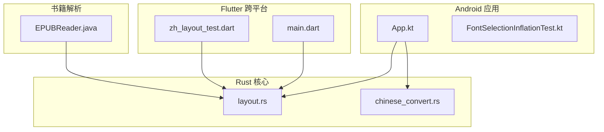
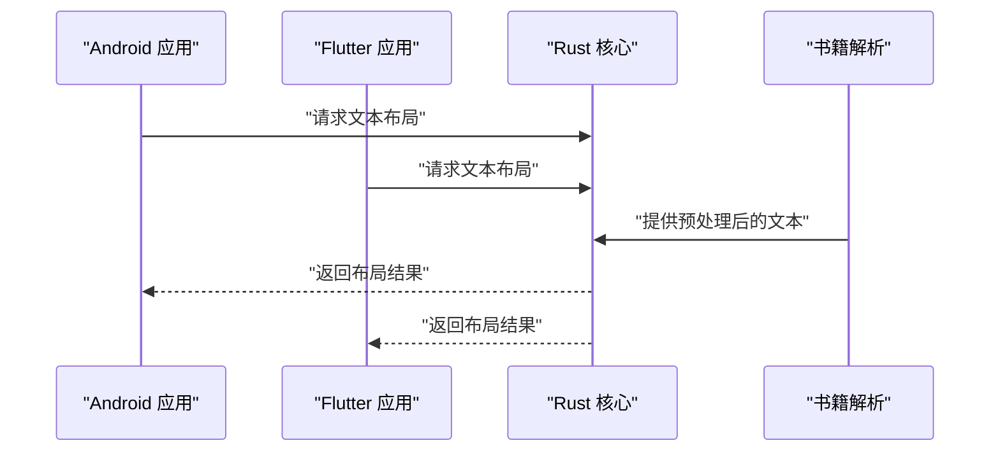
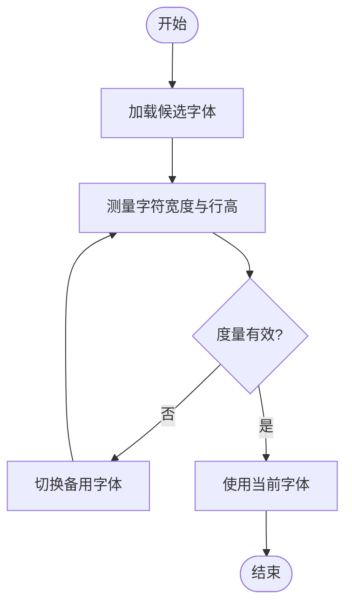
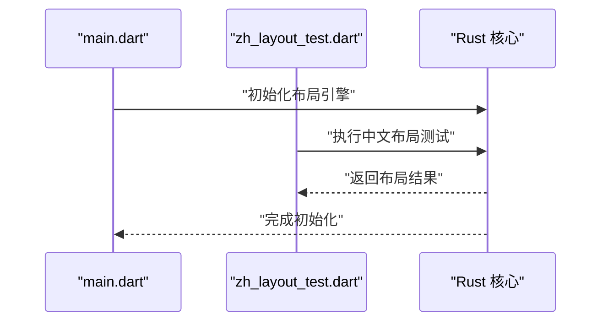
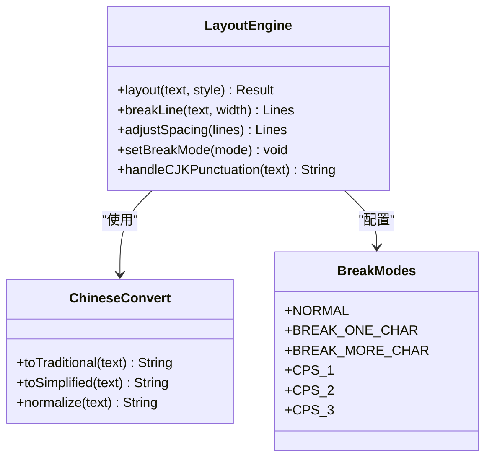
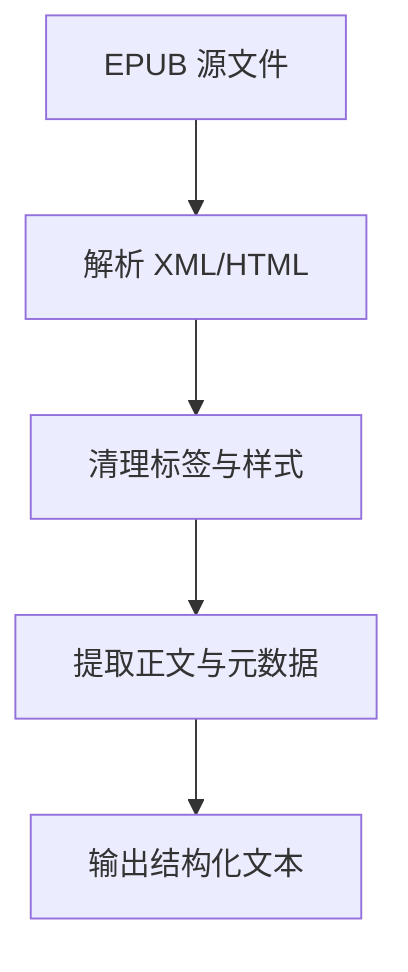
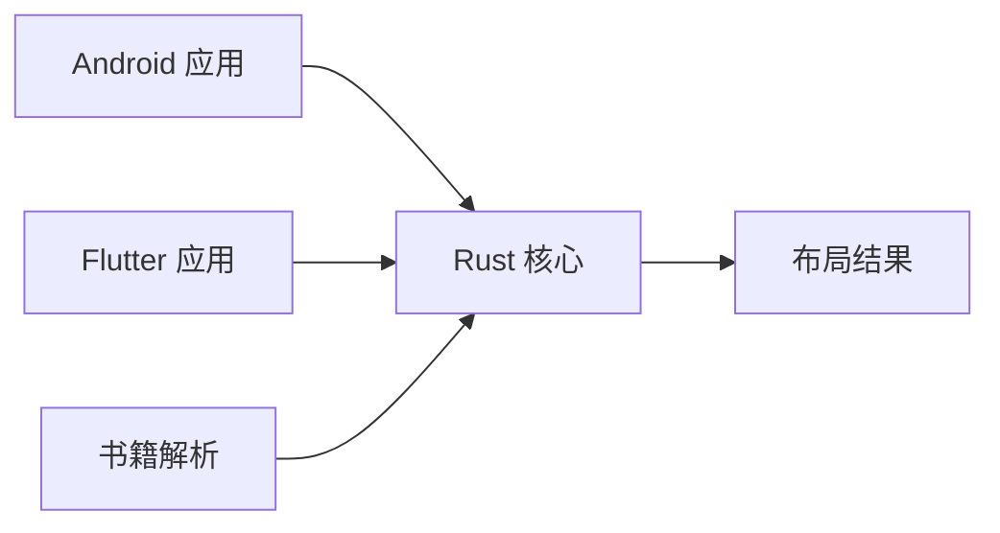

# 中文排版引擎

<cite>
**本文引用的文件**   
- [README.md](file://README.md)
- [KOTLIN_LAYOUT_ANALYSIS.md](file://KOTLIN_LAYOUT_ANALYSIS.md)
- [app/src/main/java/io/legado/app/App.kt](file://app/src/main/java/io/legado/app/App.kt)
- [app/src/main/java/io/legado/app/ui/font/FontSelectionInflationTest.kt](file://app/src/main/java/io/legado/app/ui/font/FontSelectionInflationTest.kt)
- [flutter_legado/lib/src/main.dart](file://flutter_legado/lib/src/main.dart)
- [flutter_legado/test/widgets/zh_layout_test.dart](file://flutter_legado/test/widgets/zh_layout_test.dart)
- [rust/legado-core/src/layout.rs](file://rust/legado-core/src/layout.rs)
- [rust/legado-core/src/chinese_convert.rs](file://rust/legado-core/src/chinese_convert.rs)
- [modules/book/src/main/java/me/ag2s/epublib/EPUBReader.java](file://modules/book/src/main/java/me/ag2s/epublib/EPUBReader.java)
</cite>

## 更新摘要
**所做更改**   
- 更新了 Rust 核心布局算法的实现细节，反映从 Flutter/Dart 迁移到 Rust 的变更
- 新增了六种断行模式（NORMAL、BREAK_ONE_CHAR、BREAK_MORE_CHAR、CPS_1、CPS_2、CPS_3）的详细说明
- 增强了 CJK 标点符号处理的文档描述
- 更新了性能优化和跨平台兼容性的相关内容

## 目录
1. [简介](#简介)
2. [项目结构](#项目结构)
3. [核心组件](#核心组件)
4. [架构总览](#架构总览)
5. [详细组件分析](#详细组件分析)
6. [依赖关系分析](#依赖关系分析)
7. [性能考量](#性能考量)
8. [故障排查指南](#故障排查指南)
9. [结论](#结论)
10. [附录](#附录)

## 简介
本文件聚焦于 Legado 项目中的"中文排版引擎"能力，围绕多端（Android、Flutter、Rust）的字体选择、文本布局与中文处理进行系统性说明。内容涵盖系统架构、关键组件职责、数据流与控制流、错误处理与性能优化建议，并辅以可视化图示帮助非技术读者理解。

**更新** 中文排版引擎的核心算法已从 Flutter/Dart 实现完全迁移至 Rust 语言，提供了更高的性能和更好的跨平台兼容性。新的 Rust 实现支持六种不同的断行模式和全面的 CJK 标点符号处理功能。

## 项目结构
Legado 采用多模块、多语言协作：
- Android 应用层负责 UI 渲染与字体选择测试；
- Flutter 跨平台层提供页面与布局测试；
- Rust 核心库实现高性能文本布局与中文转换等通用能力；
- 书籍解析模块（如 EPUB）为内容预处理提供基础。

图表来源
- [app/src/main/java/io/legado/app/App.kt](file://app/src/main/java/io/legado/app/App.kt)
- [app/src/main/java/io/legado/app/ui/font/FontSelectionInflationTest.kt](file://app/src/main/java/io/legado/app/ui/font/FontSelectionInflationTest.kt)
- [flutter_legado/lib/src/main.dart](file://flutter_legado/lib/src/main.dart)
- [flutter_legado/test/widgets/zh_layout_test.dart](file://flutter_legado/test/widgets/zh_layout_test.dart)
- [rust/legado-core/src/layout.rs](file://rust/legado-core/src/layout.rs)
- [rust/legado-core/src/chinese_convert.rs](file://rust/legado-core/src/chinese_convert.rs)
- [modules/book/src/main/java/me/ag2s/epublib/EPUBReader.java](file://modules/book/src/main/java/me/ag2s/epublib/EPUBReader.java)

章节来源
- [README.md](file://README.md)
- [KOTLIN_LAYOUT_ANALYSIS.md](file://KOTLIN_LAYOUT_ANALYSIS.md)

## 核心组件
- 字体选择与验证（Android）：通过单元测试驱动字体加载与尺寸计算，确保中文字体可用且度量准确。
- 跨平台布局入口（Flutter）：在应用启动时初始化布局相关能力，并在测试中验证中文布局行为。
- 文本布局与中文处理（Rust）：提供高性能的文本布局算法与中文转换工具，供上层调用。
- 书籍内容预处理（EPUB）：将电子书内容转换为可排版的中间表示，便于后续布局。

**更新** Rust 核心组件现在包含完整的 ZhLayout 算法实现，支持多种断行模式和 CJK 标点符号处理，显著提升了性能和跨平台兼容性。

章节来源
- [app/src/main/java/io/legado/app/ui/font/FontSelectionInflationTest.kt](file://app/src/main/java/io/legado/app/ui/font/FontSelectionInflationTest.kt)
- [flutter_legado/lib/src/main.dart](file://flutter_legado/lib/src/main.dart)
- [flutter_legado/test/widgets/zh_layout_test.dart](file://flutter_legado/test/widgets/zh_layout_test.dart)
- [rust/legado-core/src/layout.rs](file://rust/legado-core/src/layout.rs)
- [rust/legado-core/src/chinese_convert.rs](file://rust/legado-core/src/chinese_convert.rs)
- [modules/book/src/main/java/me/ag2s/epublib/EPUBReader.java](file://modules/book/src/main/java/me/ag2s/epublib/EPUBReader.java)

## 架构总览
中文排版引擎遵循"输入→预处理→布局→输出"的分层设计：
- 输入层：来自书籍解析器或用户输入的原始文本；
- 预处理层：编码检测、字符规范化、中文转换；
- 布局层：分词、断行、字距调整、行高与段落样式；
- 输出层：绘制到屏幕或导出为文档。

图表来源
- [app/src/main/java/io/legado/app/App.kt](file://app/src/main/java/io/legado/app/App.kt)
- [flutter_legado/lib/src/main.dart](file://flutter_legado/lib/src/main.dart)
- [rust/legado-core/src/layout.rs](file://rust/legado-core/src/layout.rs)
- [modules/book/src/main/java/me/ag2s/epublib/EPUBReader.java](file://modules/book/src/main/java/me/ag2s/epublib/EPUBReader.java)

## 详细组件分析

### 字体选择与验证（Android）
- 目标：确保中文字体正确加载、度量准确，避免换行与对齐异常。
- 关键点：
  - 字体资源定位与加载策略；
  - 字体度量（字号、行高、基线）校验；
  - 失败回退机制（无合适字体时的降级）。

图表来源
- [app/src/main/java/io/legado/app/ui/font/FontSelectionInflationTest.kt](file://app/src/main/java/io/legado/app/ui/font/FontSelectionInflationTest.kt)

章节来源
- [app/src/main/java/io/legado/app/ui/font/FontSelectionInflationTest.kt](file://app/src/main/java/io/legado/app/ui/font/FontSelectionInflationTest.kt)

### 跨平台布局入口（Flutter）
- 目标：在 Flutter 侧统一初始化布局能力，并通过测试覆盖中文布局场景。
- 关键点：
  - 应用启动时注册布局服务；
  - 测试用例模拟不同字号、行距与段落样式；
  - 与 Rust 核心的交互接口封装。

图表来源
- [flutter_legado/lib/src/main.dart](file://flutter_legado/lib/src/main.dart)
- [flutter_legado/test/widgets/zh_layout_test.dart](file://flutter_legado/test/widgets/zh_layout_test.dart)
- [rust/legado-core/src/layout.rs](file://rust/legado-core/src/layout.rs)

章节来源
- [flutter_legado/lib/src/main.dart](file://flutter_legado/lib/src/main.dart)
- [flutter_legado/test/widgets/zh_layout_test.dart](file://flutter_legado/test/widgets/zh_layout_test.dart)

### 文本布局与中文处理（Rust）
- 目标：提供高性能、可扩展的文本布局与中文处理能力。
- 关键点：
  - 文本分词与断行算法；
  - 中文字符集支持与转换；
  - 内存友好与并发安全的实现。

**更新** Rust 实现的 ZhLayout 算法现在支持六种断行模式：
- NORMAL：标准断行模式
- BREAK_ONE_CHAR：单字符断行
- BREAK_MORE_CHAR：多字符断行
- CPS_1、CPS_2、CPS_3：CJK 标点符号处理的不同级别

此外，新增了对 CJK 标点符号的全面处理功能，确保中文排版符合出版标准。

图表来源
- [rust/legado-core/src/layout.rs](file://rust/legado-core/src/layout.rs)
- [rust/legado-core/src/chinese_convert.rs](file://rust/legado-core/src/chinese_convert.rs)

章节来源
- [rust/legado-core/src/layout.rs](file://rust/legado-core/src/layout.rs)
- [rust/legado-core/src/chinese_convert.rs](file://rust/legado-core/src/chinese_convert.rs)

### 书籍内容预处理（EPUB）
- 目标：将 EPUB 内容解析为结构化文本，便于布局引擎处理。
- 关键点：
  - HTML/XML 节点提取与清洗；
  - 图片与链接占位处理；
  - 元数据与目录信息保留。

图表来源
- [modules/book/src/main/java/me/ag2s/epublib/EPUBReader.java](file://modules/book/src/main/java/me/ag2s/epublib/EPUBReader.java)

章节来源
- [modules/book/src/main/java/me/ag2s/epublib/EPUBReader.java](file://modules/book/src/main/java/me/ag2s/epublib/EPUBReader.java)

## 依赖关系分析
- Android 与 Flutter 均依赖 Rust 核心库提供的布局与中文处理能力；
- 书籍解析模块为布局引擎提供标准化输入；
- 各层之间通过明确的接口契约解耦，便于独立演进。

**更新** Rust 核心库现在作为独立的性能优化层，为所有上层应用提供统一的中文排版能力，消除了平台特定的实现差异。

图表来源
- [app/src/main/java/io/legado/app/App.kt](file://app/src/main/java/io/legado/app/App.kt)
- [flutter_legado/lib/src/main.dart](file://flutter_legado/lib/src/main.dart)
- [rust/legado-core/src/layout.rs](file://rust/legado-core/src/layout.rs)
- [modules/book/src/main/java/me/ag2s/epublib/EPUBReader.java](file://modules/book/src/main/java/me/ag2s/epublib/EPUBReader.java)

章节来源
- [KOTLIN_LAYOUT_ANALYSIS.md](file://KOTLIN_LAYOUT_ANALYSIS.md)

## 性能考量
- 文本布局算法应避免频繁分配与复制，优先使用零拷贝视图；
- 字体度量结果应缓存，减少重复计算；
- 大段文本处理需支持分块与异步，避免主线程阻塞；
- 中文转换操作可批量处理，降低函数调用开销；
- **新增** Rust 实现利用其内存安全性和零成本抽象特性，显著提升布局性能；
- **新增** 六种断行模式可根据具体需求选择最优算法，平衡速度与精度。

## 故障排查指南
- 字体问题：检查字体资源路径、权限与度量值是否合理；
- 布局异常：验证输入文本编码与字符集，确认断行逻辑；
- 性能瓶颈：监控内存占用与 CPU 使用率，定位热点函数；
- 跨平台差异：对比 Android 与 Flutter 的行为，确保一致性；
- **新增** Rust 核心问题：检查断行模式配置是否正确，验证 CJK 标点符号处理参数。

## 结论
Legado 的中文排版引擎通过多端协作与核心库抽象，实现了高效、稳定且可扩展的文本布局能力。**更新** 随着 ZhLayout 算法迁移到 Rust 实现，系统在性能、跨平台兼容性和功能完整性方面都得到了显著提升。未来可进一步优化字体选择策略、增强复杂脚本支持，并完善跨平台一致性测试。

## 附录
- 参考文档：[README.md](file://README.md)、[KOTLIN_LAYOUT_ANALYSIS.md](file://KOTLIN_LAYOUT_ANALYSIS.md)
- 测试用例：[FontSelectionInflationTest.kt](file://app/src/main/java/io/legado/app/ui/font/FontSelectionInflationTest.kt)、[zh_layout_test.dart](file://flutter_legado/test/widgets/zh_layout_test.dart)
- 核心实现：[layout.rs](file://rust/legado-core/src/layout.rs)、[chinese_convert.rs](file://rust/legado-core/src/chinese_convert.rs)
- 书籍解析：[EPUBReader.java](file://modules/book/src/main/java/me/ag2s/epublib/EPUBReader.java)