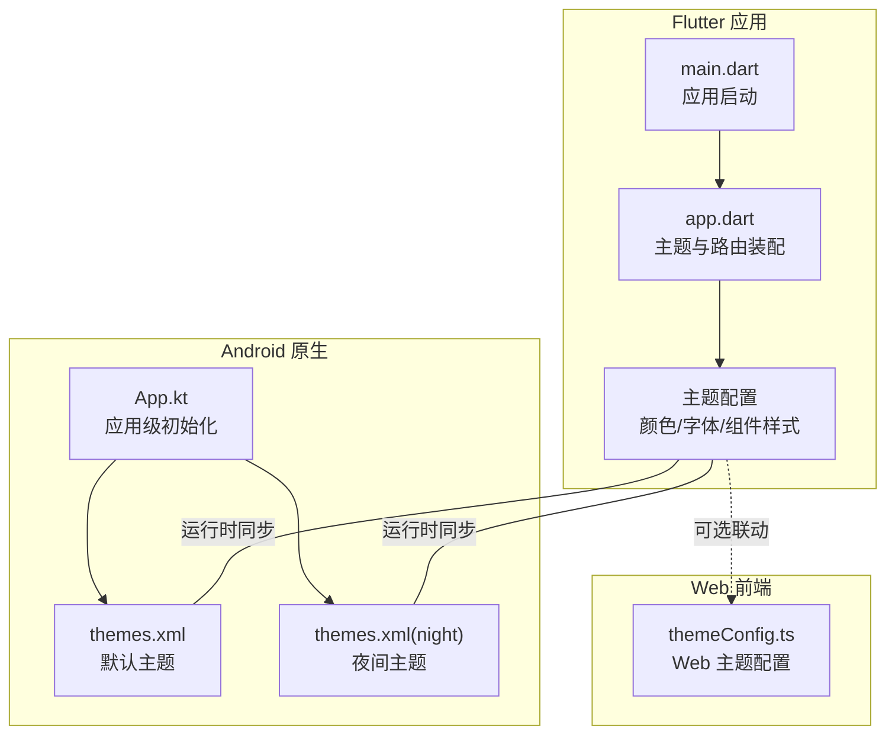
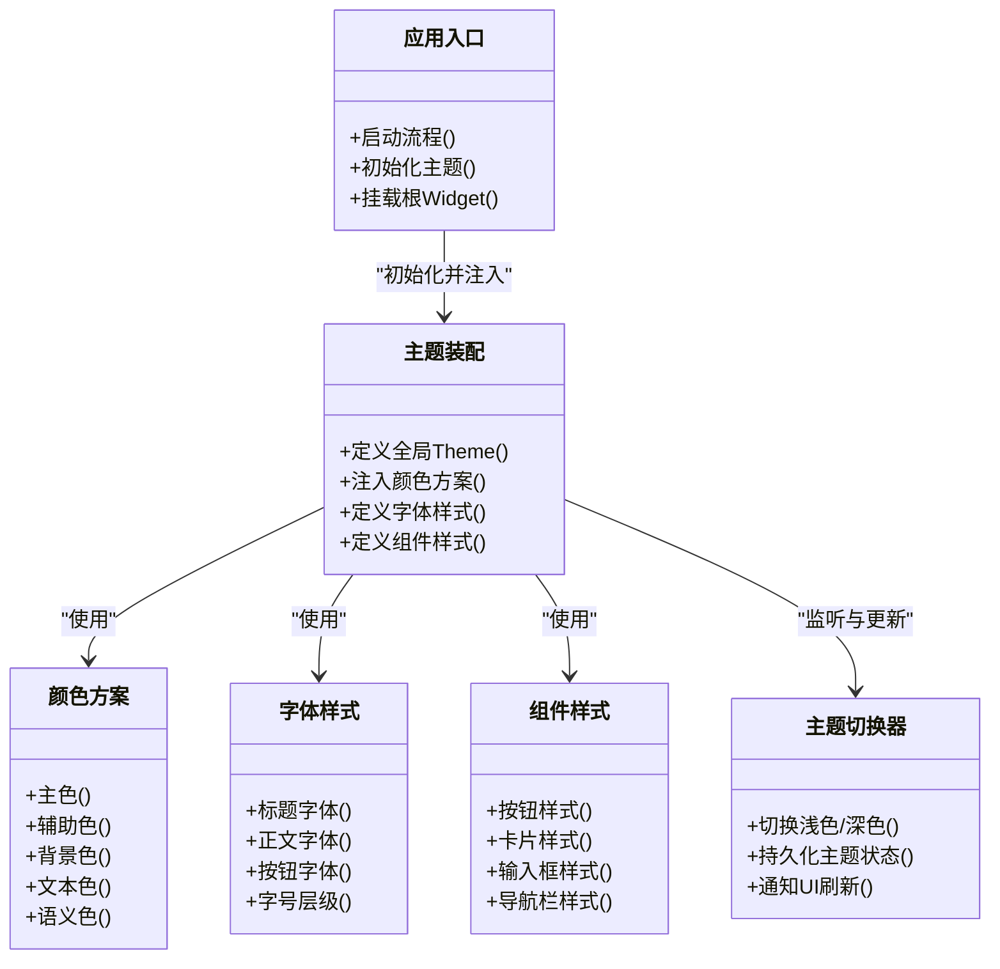
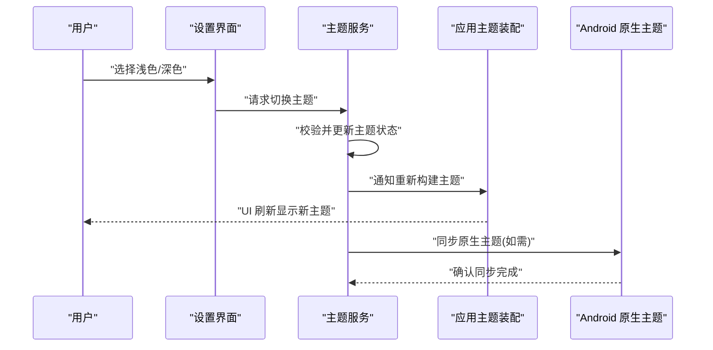
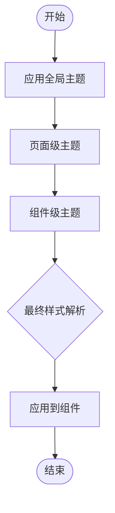
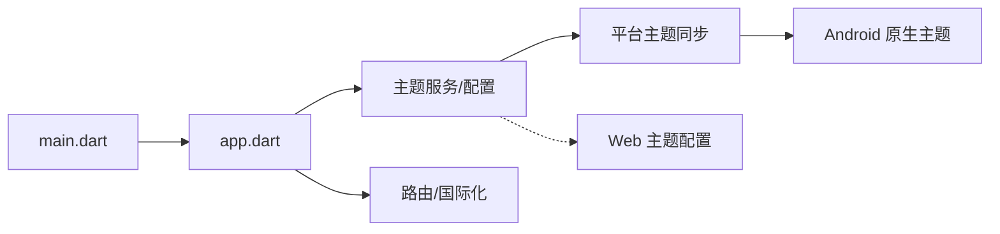

# 主题系统

<cite>
**本文引用的文件**   
- [flutter_legado/lib/app.dart](file://flutter_legado/lib/app.dart)
- [flutter_legado/lib/main.dart](file://flutter_legado/lib/main.dart)
- [flutter_legado/pubspec.yaml](file://flutter_legado/pubspec.yaml)
- [app/src/main/java/io/legado/app/App.kt](file://app/src/main/java/io/legado/app/App.kt)
- [app/src/main/res/values/themes.xml](file://app/src/main/res/values/themes.xml)
- [app/src/main/res/values-night/themes.xml](file://app/src/main/res/values-night/themes.xml)
- [modules/web/src/config/themeConfig.ts](file://modules/web/src/config/themeConfig.ts)
</cite>

## 目录
1. [简介](#简介)
2. [项目结构](#项目结构)
3. [核心组件](#核心组件)
4. [架构总览](#架构总览)
5. [详细组件分析](#详细组件分析)
6. [依赖分析](#依赖分析)
7. [性能考虑](#性能考虑)
8. [故障排查指南](#故障排查指南)
9. [结论](#结论)
10. [附录](#附录)

## 简介
本文件系统化梳理 Flutter 主题体系与 Material Design 主题的定制、扩展与统一管理，覆盖颜色方案、字体样式、组件样式的集中配置；阐述浅色/深色模式的动态切换机制；说明从全局到局部的主题覆盖层次；并提供主题开发指南（创建新主题变体、适配不同设备）以及配置文件使用示例与最佳实践。文档同时给出跨端（Flutter、Android 原生、Web）主题相关的关键入口与协作方式，帮助读者快速理解并高效扩展主题能力。

## 项目结构
Flutter 主题相关的代码主要位于 flutter_legado 模块中，包括应用入口、主题初始化与运行时配置；Android 原生层提供默认主题与夜间模式资源；Web 侧通过独立的主题配置进行样式管理。整体结构如下：

图表来源
- [flutter_legado/lib/main.dart](file://flutter_legado/lib/main.dart)
- [flutter_legado/lib/app.dart](file://flutter_legado/lib/app.dart)
- [app/src/main/java/io/legado/app/App.kt](file://app/src/main/java/io/legado/app/App.kt)
- [app/src/main/res/values/themes.xml](file://app/src/main/res/values/themes.xml)
- [app/src/main/res/values-night/themes.xml](file://app/src/main/res/values-night/themes.xml)
- [modules/web/src/config/themeConfig.ts](file://modules/web/src/config/themeConfig.ts)

章节来源
- [flutter_legado/lib/main.dart](file://flutter_legado/lib/main.dart)
- [flutter_legado/lib/app.dart](file://flutter_legado/lib/app.dart)
- [app/src/main/java/io/legado/app/App.kt](file://app/src/main/java/io/legado/app/App.kt)
- [app/src/main/res/values/themes.xml](file://app/src/main/res/values/themes.xml)
- [app/src/main/res/values-night/themes.xml](file://app/src/main/res/values-night/themes.xml)
- [modules/web/src/config/themeConfig.ts](file://modules/web/src/config/themeConfig.ts)

## 核心组件
- 应用入口与主题装配
  - main.dart：负责应用启动、平台初始化、主题环境准备与根 Widget 挂载。
  - app.dart：定义 MaterialApp 或自定义 App Shell，集中注入 Theme、路由、国际化等。
- Android 原生主题资源
  - themes.xml：定义默认（浅色）主题、颜色、字体、组件样式。
  - themes.xml(night)：定义夜间（深色）主题，与默认主题形成对照。
- Web 主题配置
  - themeConfig.ts：为 Web 端提供主题变量与样式映射，便于与 Flutter 主题保持一致。

章节来源
- [flutter_legado/lib/main.dart](file://flutter_legado/lib/main.dart)
- [flutter_legado/lib/app.dart](file://flutter_legado/lib/app.dart)
- [app/src/main/res/values/themes.xml](file://app/src/main/res/values/themes.xml)
- [app/src/main/res/values-night/themes.xml](file://app/src/main/res/values-night/themes.xml)
- [modules/web/src/config/themeConfig.ts](file://modules/web/src/config/themeConfig.ts)

## 架构总览
Flutter 主题体系遵循“全局主题 + 局部覆盖”的层级模型，结合 Material Design 的颜色、字体、组件样式三要素，实现统一且可定制的视觉风格。Android 原生层提供基础主题资源，Flutter 层在运行时加载并覆盖，Web 端通过独立配置保持风格一致。

图表来源
- [flutter_legado/lib/app.dart](file://flutter_legado/lib/app.dart)
- [flutter_legado/lib/main.dart](file://flutter_legado/lib/main.dart)

## 详细组件分析

### 颜色方案与字体样式统一管理
- 颜色方案
  - 将主色、辅助色、背景色、文本色、语义色（成功、警告、错误等）集中定义，确保全应用一致性。
  - 支持按 Light/Dark 两套配色表，运行时切换时自动替换。
- 字体样式
  - 定义标题、正文、按钮等字体的族名、粗细、字号层级，保证可读性与品牌一致性。
  - 可通过主题对象暴露给各组件，避免硬编码。

章节来源
- [flutter_legado/lib/app.dart](file://flutter_legado/lib/app.dart)

### 组件样式的集中配置
- 按钮、卡片、输入框、导航栏等常用组件的样式在主题中统一定义，便于全局调整。
- 组件样式应基于颜色方案与字体样式派生，减少重复与不一致。

章节来源
- [flutter_legado/lib/app.dart](file://flutter_legado/lib/app.dart)

### 动态主题切换机制（浅色/深色）
- 触发源
  - 用户设置、系统主题跟随、定时策略等。
- 切换流程
  - 读取目标主题模式 → 更新主题状态 → 通知 UI 重建 → 持久化保存。
- 与原生层联动
  - Flutter 层切换后，必要时与 Android 原生主题资源同步，保证 WebView、系统控件等表现一致。

图表来源
- [flutter_legado/lib/app.dart](file://flutter_legado/lib/app.dart)
- [flutter_legado/lib/main.dart](file://flutter_legado/lib/main.dart)
- [app/src/main/java/io/legado/app/App.kt](file://app/src/main/java/io/legado/app/App.kt)

章节来源
- [flutter_legado/lib/app.dart](file://flutter_legado/lib/app.dart)
- [flutter_legado/lib/main.dart](file://flutter_legado/lib/main.dart)
- [app/src/main/java/io/legado/app/App.kt](file://app/src/main/java/io/legado/app/App.kt)

### 主题配置的层次结构与覆盖机制
- 全局主题
  - 在应用根节点定义，包含颜色、字体、组件样式的基础值。
- 局部主题
  - 在特定页面或组件树内包裹主题，覆盖全局值，实现差异化展示。
- 优先级
  - 局部主题 > 父级主题 > 全局主题，越靠近组件的覆盖生效。

章节来源
- [flutter_legado/lib/app.dart](file://flutter_legado/lib/app.dart)

### 主题开发指南
- 创建新主题变体
  - 定义新的颜色方案与字体样式，保持语义命名一致。
  - 在主题装配处注册新变体，并在设置界面提供切换入口。
- 适配不同设备
  - 根据屏幕尺寸与密度调整字号、间距、阴影等细节。
  - 针对横竖屏、平板与大屏优化布局与主题表现。
- 与 Web 端保持一致
  - 将 Flutter 主题变量映射到 Web 的 themeConfig.ts，确保多端风格统一。

章节来源
- [flutter_legado/lib/app.dart](file://flutter_legado/lib/app.dart)
- [modules/web/src/config/themeConfig.ts](file://modules/web/src/config/themeConfig.ts)

### 配置文件使用示例与最佳实践
- 建议将主题变量拆分为颜色、字体、组件三个子配置，便于维护与复用。
- 使用语义化命名（如 primary、onPrimary、surface、error），避免直接使用 RGB/HSL。
- 在切换主题时批量更新，减少重绘次数；对复杂页面采用懒加载与缓存策略。
- 为 Web 端建立映射表，确保 Flutter 与 Web 的主题变量一一对应。

章节来源
- [flutter_legado/lib/app.dart](file://flutter_legado/lib/app.dart)
- [modules/web/src/config/themeConfig.ts](file://modules/web/src/config/themeConfig.ts)

## 依赖分析
Flutter 主题装配依赖于应用入口与主题服务；Android 原生主题资源作为基础样式；Web 主题配置用于多端一致性。依赖关系如下：

图表来源
- [flutter_legado/lib/main.dart](file://flutter_legado/lib/main.dart)
- [flutter_legado/lib/app.dart](file://flutter_legado/lib/app.dart)
- [app/src/main/java/io/legado/app/App.kt](file://app/src/main/java/io/legado/app/App.kt)
- [modules/web/src/config/themeConfig.ts](file://modules/web/src/config/themeConfig.ts)

章节来源
- [flutter_legado/lib/main.dart](file://flutter_legado/lib/main.dart)
- [flutter_legado/lib/app.dart](file://flutter_legado/lib/app.dart)
- [app/src/main/java/io/legado/app/App.kt](file://app/src/main/java/io/legado/app/App.kt)
- [modules/web/src/config/themeConfig.ts](file://modules/web/src/config/themeConfig.ts)

## 性能考虑
- 主题切换时尽量批量更新，避免频繁重建整棵树。
- 对大页面采用延迟渲染与分页加载，降低首次绘制时间。
- 使用常量与不可变对象存储主题变量，减少不必要的分配。
- 对 WebView 与原生控件的主题同步做异步处理，避免阻塞 UI。

[本节为通用指导，不直接分析具体文件]

## 故障排查指南
- 主题未生效
  - 检查是否在正确的 Widget 树中包裹了主题。
  - 确认局部主题是否被更高层覆盖。
- 切换后部分组件未更新
  - 检查是否使用了静态颜色或硬编码样式。
  - 确认是否需要调用刷新方法或重建相关组件。
- 与原生主题不一致
  - 检查 Android 原生 themes.xml 与 Flutter 主题变量的映射是否正确。
  - 确认 WebView 是否使用了正确的主题上下文。

章节来源
- [flutter_legado/lib/app.dart](file://flutter_legado/lib/app.dart)
- [app/src/main/res/values/themes.xml](file://app/src/main/res/values/themes.xml)
- [app/src/main/res/values-night/themes.xml](file://app/src/main/res/values-night/themes.xml)

## 结论
本主题系统以 Flutter 为核心，结合 Android 原生与 Web 端的主题配置，实现了统一的 Material Design 风格管理与动态切换能力。通过颜色、字体、组件样式的集中定义与层次化覆盖，开发者可以快速创建新主题变体并适配多设备。建议在开发过程中严格遵循语义化命名与映射规范，确保多端一致性与可维护性。

[本节为总结性内容，不直接分析具体文件]

## 附录
- 关键入口文件
  - Flutter 应用入口与主题装配：[flutter_legado/lib/main.dart](file://flutter_legado/lib/main.dart)、[flutter_legado/lib/app.dart](file://flutter_legado/lib/app.dart)
  - Android 原生主题资源：[app/src/main/res/values/themes.xml](file://app/src/main/res/values/themes.xml)、[app/src/main/res/values-night/themes.xml](file://app/src/main/res/values-night/themes.xml)
  - Web 主题配置：[modules/web/src/config/themeConfig.ts](file://modules/web/src/config/themeConfig.ts)
- 依赖与配置
  - Flutter 依赖与插件：[flutter_legado/pubspec.yaml](file://flutter_legado/pubspec.yaml)
  - 应用级初始化：[app/src/main/java/io/legado/app/App.kt](file://app/src/main/java/io/legado/app/App.kt)

章节来源
- [flutter_legado/lib/main.dart](file://flutter_legado/lib/main.dart)
- [flutter_legado/lib/app.dart](file://flutter_legado/lib/app.dart)
- [flutter_legado/pubspec.yaml](file://flutter_legado/pubspec.yaml)
- [app/src/main/java/io/legado/app/App.kt](file://app/src/main/java/io/legado/app/App.kt)
- [app/src/main/res/values/themes.xml](file://app/src/main/res/values/themes.xml)
- [app/src/main/res/values-night/themes.xml](file://app/src/main/res/values-night/themes.xml)
- [modules/web/src/config/themeConfig.ts](file://modules/web/src/config/themeConfig.ts)