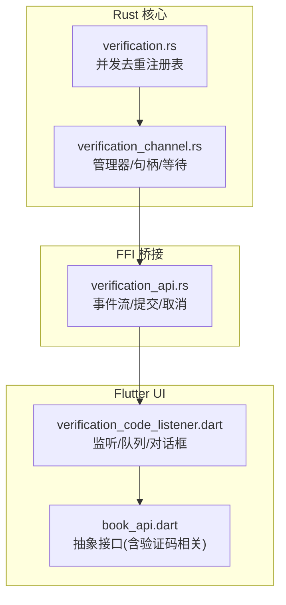
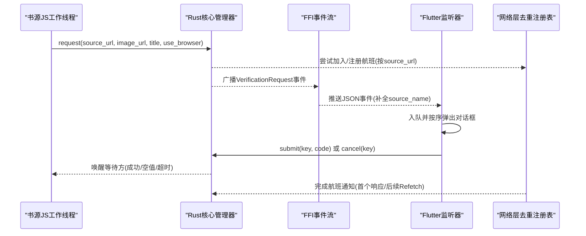
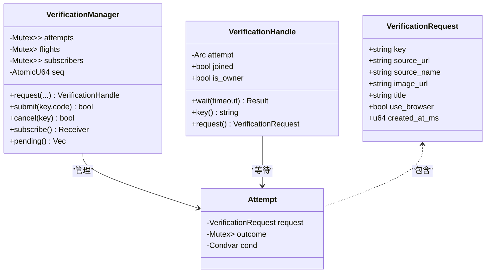
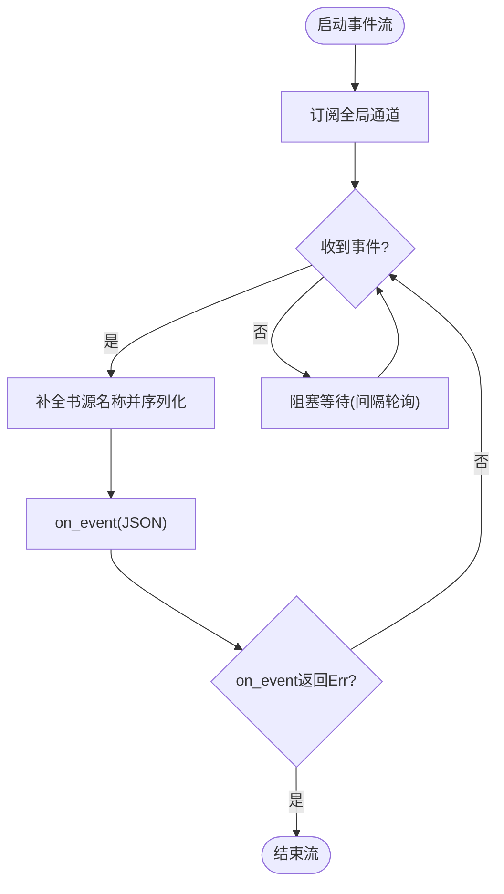
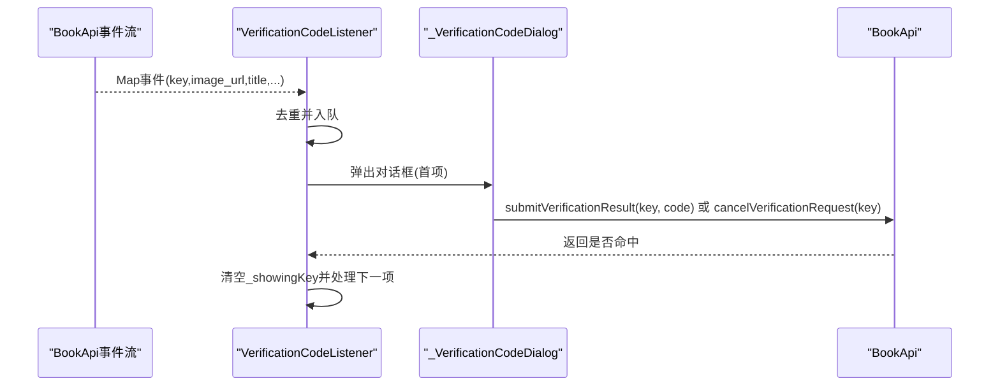
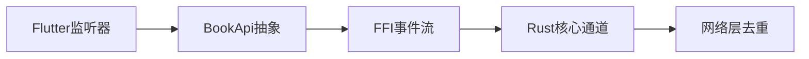

# 全局验证码系统

<cite>
**本文引用的文件**   
- [verification_channel.rs](file://rust/legado-core/src/verification_channel.rs)
- [verification_api.rs](file://rust/legado-ffi/src/api/verification_api.rs)
- [verification.rs](file://rust/legado-net/src/verification.rs)
- [verification_code_listener.dart](file://flutter_legado/lib/src/widgets/verification_code_listener.dart)
- [book_api.dart](file://flutter_legado/lib/src/services/book_api.dart)
</cite>

## 目录
1. [简介](#简介)
2. [项目结构](#项目结构)
3. [核心组件](#核心组件)
4. [架构总览](#架构总览)
5. [详细组件分析](#详细组件分析)
6. [依赖分析](#依赖分析)
7. [性能考虑](#性能考虑)
8. [故障排查指南](#故障排查指南)
9. [结论](#结论)

## 简介
本文件系统性梳理 Legado 项目中的“全局验证码系统”，覆盖 Rust 核心通道、FFI 桥接、网络层并发去重以及 Flutter UI 监听与交互。该机制对齐 Kotlin 的 SourceVerificationHelp 语义，实现“书源 JS 挂起等待 ↔ Flutter 验证码对话框”的全局事件通道，支持同书源并发请求的去重共享结果、超时清理、空值判定与幂等提交等关键特性。

## 项目结构
全局验证码系统由以下层次组成：
- Rust 核心通道（legado-core）：定义请求模型、管理器、句柄与等待/唤醒机制
- FFI API（legado-ffi）：暴露事件流、提交与取消接口，补全书源名称并序列化事件
- 网络层并发去重（legado-net）：按 source_url 进行验证航班去重，避免重复弹窗
- Flutter 监听器（flutter_legado）：订阅事件流、队列化展示对话框、回传或取消结果



**图表来源** 
- [verification_channel.rs:1-120](file://rust/legado-core/src/verification_channel.rs#L1-L120)
- [verification.rs:1-80](file://rust/legado-net/src/verification.rs#L1-L80)
- [verification_api.rs:1-60](file://rust/legado-ffi/src/api/verification_api.rs#L1-L60)
- [verification_code_listener.dart:1-60](file://flutter_legado/lib/src/widgets/verification_code_listener.dart#L1-L60)
- [book_api.dart:120-145](file://flutter_legado/lib/src/services/book_api.dart#L120-L145)

**章节来源**
- [verification_channel.rs:1-120](file://rust/legado-core/src/verification_channel.rs#L1-L120)
- [verification_api.rs:1-60](file://rust/legado-ffi/src/api/verification_api.rs#L1-L60)
- [verification.rs:1-80](file://rust/legado-net/src/verification.rs#L1-L80)
- [verification_code_listener.dart:1-60](file://flutter_legado/lib/src/widgets/verification_code_listener.dart#L1-L60)
- [book_api.dart:120-145](file://flutter_legado/lib/src/services/book_api.dart#L120-L145)

## 核心组件
- 验证码请求模型与事件字段契约：key、source_url、source_name、image_url、title、use_browser、created_at_ms
- 验证管理器：维护请求表、航班索引、订阅者列表；支持广播、回放进行中请求、去重共享结果
- 请求句柄：阻塞等待结果、超时处理、owner 清理
- FFI 事件流：长期轮询 mpsc 通道，补全书源名称后推送 JSON 事件
- Flutter 监听器：订阅事件、队列化展示对话框、提交或取消结果
- 网络层并发去重：按 source_url 注册/加入航班，统一通知等待者

**章节来源**
- [verification_channel.rs:35-95](file://rust/legado-core/src/verification_channel.rs#L35-L95)
- [verification_channel.rs:131-197](file://rust/legado-core/src/verification_channel.rs#L131-L197)
- [verification_channel.rs:284-353](file://rust/legado-core/src/verification_channel.rs#L284-L353)
- [verification_api.rs:31-84](file://rust/legado-ffi/src/api/verification_api.rs#L31-L84)
- [verification_code_listener.dart:18-95](file://flutter_legado/lib/src/widgets/verification_code_listener.dart#L18-L95)
- [verification.rs:18-79](file://rust/legado-net/src/verification.rs#L18-L79)

## 架构总览
下图展示从书源 JS 触发到 Flutter 弹出对话框并回传结果的完整调用链。



**图表来源** 
- [verification_channel.rs:131-197](file://rust/legado-core/src/verification_channel.rs#L131-L197)
- [verification_channel.rs:314-353](file://rust/legado-core/src/verification_channel.rs#L314-L353)
- [verification_api.rs:52-84](file://rust/legado-ffi/src/api/verification_api.rs#L52-L84)
- [verification_code_listener.dart:53-91](file://flutter_legado/lib/src/widgets/verification_code_listener.dart#L53-L91)
- [verification.rs:30-79](file://rust/legado-net/src/verification.rs#L30-L79)

## 详细组件分析

### Rust 核心通道（verification_channel.rs）
- 数据结构
  - VerificationRequest：事件载荷，snake_case 字段
  - Attempt：单次验证尝试，包含请求与结局槽位、条件变量
  - VerificationManager：全局单例，管理 attempts/flights/subscribers/seq
  - VerificationHandle：返回给等待方的句柄，提供 wait(timeout)
- 关键流程
  - request：生成 key，创建 Attempt，写入 attempts 与 flights（去重），广播事件
  - submit/cancel：结束请求，设置 Outcome，唤醒所有等待方
  - subscribe/pending：订阅事件流，回放进行中请求
  - wait：condvar 阻塞等待，空值判定在等待侧，超时 owner 清理
- 并发与线程模型
  - 等待侧使用 std condvar，不阻塞 tokio 工作者
  - 提交侧无阻塞，notify_all 唤醒
  - 订阅侧使用 std::sync::mpsc，跨线程接收



**图表来源** 
- [verification_channel.rs:35-95](file://rust/legado-core/src/verification_channel.rs#L35-L95)
- [verification_channel.rs:82-95](file://rust/legado-core/src/verification_channel.rs#L82-L95)
- [verification_channel.rs:284-353](file://rust/legado-core/src/verification_channel.rs#L284-L353)

**章节来源**
- [verification_channel.rs:35-95](file://rust/legado-core/src/verification_channel.rs#L35-L95)
- [verification_channel.rs:131-197](file://rust/legado-core/src/verification_channel.rs#L131-L197)
- [verification_channel.rs:284-353](file://rust/legado-core/src/verification_channel.rs#L284-L353)

### FFI 事件流与API（verification_api.rs）
- 职责
  - serialize_event：补全书源名称后序列化为 JSON
  - run_verification_request_stream：长期存活的事件流，阻塞接收 mpsc 并回调 on_event
  - submit_verification_result / cancel_verification_request：对齐 Kotlin setResult/checkResult
  - pending_requests_json：调试用拉取式消费
- 设计要点
  - 使用 blocking 池接收 mpsc，避免占用 tokio 工作者
  - 事件字段契约 snake_case，确保 Flutter 解析稳定
  - 晚订阅回放进行中请求，保证 UI 恢复时不遗漏



**图表来源** 
- [verification_api.rs:31-84](file://rust/legado-ffi/src/api/verification_api.rs#L31-L84)

**章节来源**
- [verification_api.rs:31-84](file://rust/legado-ffi/src/api/verification_api.rs#L31-L84)
- [verification_api.rs:86-105](file://rust/legado-ffi/src/api/verification_api.rs#L86-L105)

### 网络层并发去重（verification.rs）
- 目标：对相同 sourceUrl 的并发验证请求去重，避免重复弹窗
- 关键类型
  - VerificationFlightRegistry：按 source_url 维护发送者列表
  - VerificationResult：Response(code, cookie) 或 Refetch
- 行为
  - register：注册新航班，返回 receiver
  - try_join：尝试加入已有航班
  - complete：完成验证，第一个得到完整结果，其余得到 Refetch

```mermaid
classDiagram
class VerificationFlightRegistry {
-Arc<Mutex<HashMap<String,Vec<oneshot : : Sender>>>> flights
+register(source_url) Receiver
+try_join(source_url) Option<Receiver>
+complete(source_url, result) void
+can_join(source_url) bool
}
class VerificationResult {
<<enum>>
Response{code : string, cookie : string}
Refetch
}
VerificationFlightRegistry --> VerificationResult : "通知"
```

**图表来源** 
- [verification.rs:18-79](file://rust/legado-net/src/verification.rs#L18-L79)

**章节来源**
- [verification.rs:18-79](file://rust/legado-net/src/verification.rs#L18-L79)

### Flutter 监听器与对话框（verification_code_listener.dart）
- 职责
  - 订阅 BookApi.verificationRequestStream
  - 队列化请求，逐个弹出对话框（同一时刻仅一个）
  - 用户输入后提交结果，关闭对话框则取消请求
  - 溢出菜单支持禁用/删除书源
- 关键点
  - 去重：正在展示或队列中已有同 key 的请求直接忽略
  - 安全：builder 上下文持有全局 Navigator，跨页面弹窗安全
  - 对齐 Kotlin：关闭未提交以空结果唤醒等待方



**图表来源** 
- [verification_code_listener.dart:53-91](file://flutter_legado/lib/src/widgets/verification_code_listener.dart#L53-L91)
- [verification_code_listener.dart:133-173](file://flutter_legado/lib/src/widgets/verification_code_listener.dart#L133-L173)

**章节来源**
- [verification_code_listener.dart:18-95](file://flutter_legado/lib/src/widgets/verification_code_listener.dart#L18-L95)
- [verification_code_listener.dart:133-173](file://flutter_legado/lib/src/widgets/verification_code_listener.dart#L133-L173)

### Flutter API 抽象（book_api.dart）
- 验证码相关方法
  - verificationRequestStream：订阅事件流（长期存活）
  - submitVerificationResult：提交验证码结果
  - cancelVerificationRequest：取消验证码请求
- 说明：这些方法为抽象接口，真实实现由 RustApi/MockBookApi 提供

**章节来源**
- [book_api.dart:122-144](file://flutter_legado/lib/src/services/book_api.dart#L122-L144)

## 依赖分析
- 模块耦合
  - FFI 依赖 Rust 核心通道（事件流、提交/取消）
  - Flutter 监听器依赖 BookApi 抽象（解耦具体实现）
  - Rust 核心通道依赖网络层去重注册表（可选增强）
- 外部依赖
  - serde/serde_json：事件序列化
  - tokio：异步运行时（FFI 流）
  - std::sync：condvar/mpsc/Mutex/OnceLock（核心通道）



**图表来源** 
- [verification_code_listener.dart:18-45](file://flutter_legado/lib/src/widgets/verification_code_listener.dart#L18-L45)
- [book_api.dart:122-144](file://flutter_legado/lib/src/services/book_api.dart#L122-L144)
- [verification_api.rs:52-84](file://rust/legado-ffi/src/api/verification_api.rs#L52-L84)
- [verification_channel.rs:131-197](file://rust/legado-core/src/verification_channel.rs#L131-L197)
- [verification.rs:18-79](file://rust/legado-net/src/verification.rs#L18-L79)

**章节来源**
- [verification_code_listener.dart:18-45](file://flutter_legado/lib/src/widgets/verification_code_listener.dart#L18-L45)
- [book_api.dart:122-144](file://flutter_legado/lib/src/services/book_api.dart#L122-L144)
- [verification_api.rs:52-84](file://rust/legado-ffi/src/api/verification_api.rs#L52-L84)
- [verification_channel.rs:131-197](file://rust/legado-core/src/verification_channel.rs#L131-L197)
- [verification.rs:18-79](file://rust/legado-net/src/verification.rs#L18-L79)

## 性能考虑
- 事件流轮询间隔：1 秒，平衡及时性与空转开销
- 阻塞接收放入 blocking 池，避免占用 tokio 工作者
- 同书源并发去重：减少重复弹窗与网络/IO 压力
- 超时清理：owner 超时自动收尾，防止悬挂状态累积
- 回放进行中请求：晚订阅 UI 不会错过已挂起的验证

[本节为通用指导，无需引用具体文件]

## 故障排查指南
- 常见错误
  - 验证结果为空：UI 关闭对话框或未提交，等待侧报空值错误
  - 超时：默认 5 分钟，owner 超时后清理注册表
  - 未知 key 提交：返回 false，表示未命中进行中的请求
  - 重复提交：首次结果生效，后续提交无效
- 定位建议
  - 检查 pending_requests_json 输出是否为合法数组
  - 确认事件字段契约（snake_case）完整
  - 观察订阅回放是否正常（晚订阅应收到进行中请求）
  - 核对同书源去重逻辑（joined/is_owner 标志）

**章节来源**
- [verification_channel.rs:314-353](file://rust/legado-core/src/verification_channel.rs#L314-L353)
- [verification_api.rs:101-105](file://rust/legado-ffi/src/api/verification_api.rs#L101-L105)
- [verification_code_listener.dart:84-91](file://flutter_legado/lib/src/widgets/verification_code_listener.dart#L84-L91)

## 结论
全局验证码系统通过 Rust 核心通道、FFI 事件流、网络层去重与 Flutter 监听器的协同，实现了高内聚、低耦合、可观测且易扩展的验证码交互机制。其设计严格对齐 Kotlin 语义，具备并发去重、超时清理、空值判定与幂等提交等关键能力，适用于多平台、多线程环境下的复杂书源验证场景。