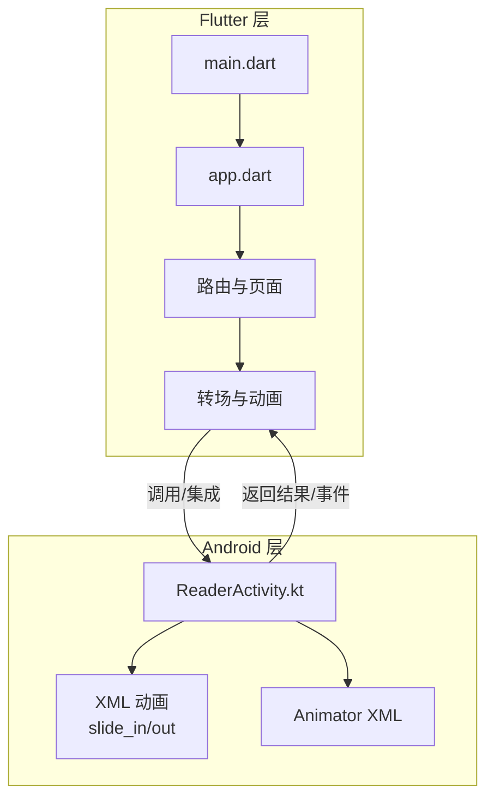
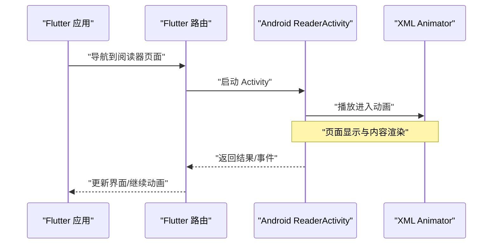
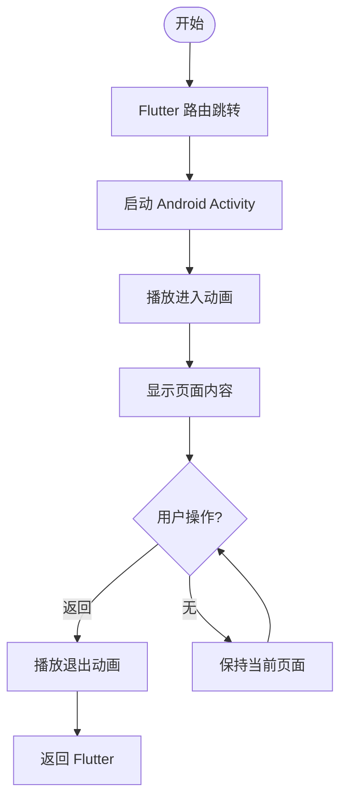
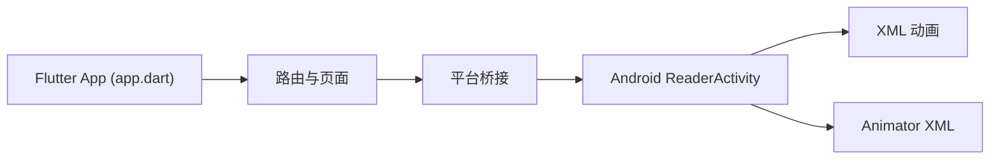

# 动画和过渡效果

<cite>
**本文档引用的文件**   
- [flutter_legado/lib/main.dart](file://flutter_legado/lib/main.dart)
- [flutter_legado/lib/app.dart](file://flutter_legado/lib/app.dart)
- [flutter_legado/pubspec.yaml](file://flutter_legado/pubspec.yaml)
- [flutter_legado/README.md](file://flutter_legado/README.md)
- [app/src/main/java/io/legado/app/ui/book/reader/ReaderActivity.kt](file://app/src/main/java/io/legado/app/ui/book/reader/ReaderActivity.kt)
- [app/src/main/res/anim/slide_in_right.xml](file://app/src/main/res/anim/slide_in_right.xml)
- [app/src/main/res/anim/slide_out_left.xml](file://app/src/main/res/anim/slide_out_left.xml)
- [app/src/main/res/animator/page_transition_animator.xml](file://app/src/main/res/animator/page_transition_animator.xml)
</cite>

## 目录
1. [简介](#简介)
2. [项目结构](#项目结构)
3. [核心组件](#核心组件)
4. [架构总览](#架构总览)
5. [详细组件分析](#详细组件分析)
6. [依赖关系分析](#依赖关系分析)
7. [性能考虑](#性能考虑)
8. [故障排查指南](#故障排查指南)
9. [结论](#结论)
10. [附录](#附录)

## 简介
本文件面向Flutter与Android混合工程中的动画与过渡效果，聚焦以下目标：
- 页面切换动画的实现（路由动画、转场效果设计）
- 交互反馈动画的使用（按钮点击、列表滑动、加载状态等微交互）
- 动画性能优化策略（帧率控制、内存管理、资源释放）
- 动画开发工具使用（调试、性能分析、测试方法）
- 具体动画示例与自定义动画组件的开发实践

本项目包含Flutter层与Android原生层。Flutter侧负责UI与动画编排，Android侧提供部分原生转场与系统级动画能力。通过双端协作，实现流畅一致的跨平台体验。

## 项目结构
Flutter模块位于 flutter_legado，入口为 main.dart，应用配置在 app.dart；Android模块位于 app，包含原生Activity与XML动画资源。两者通过插件或桥接机制协同工作。

图表来源
- [flutter_legado/lib/main.dart](file://flutter_legado/lib/main.dart)
- [flutter_legado/lib/app.dart](file://flutter_legado/lib/app.dart)
- [app/src/main/java/io/legado/app/ui/book/reader/ReaderActivity.kt](file://app/src/main/java/io/legado/app/ui/book/reader/ReaderActivity.kt)
- [app/src/main/res/anim/slide_in_right.xml](file://app/src/main/res/anim/slide_in_right.xml)
- [app/src/main/res/anim/slide_out_left.xml](file://app/src/main/res/anim/slide_out_left.xml)
- [app/src/main/res/animator/page_transition_animator.xml](file://app/src/main/res/animator/page_transition_animator.xml)

章节来源
- [flutter_legado/lib/main.dart](file://flutter_legado/lib/main.dart)
- [flutter_legado/lib/app.dart](file://flutter_legado/lib/app.dart)
- [flutter_legado/pubspec.yaml](file://flutter_legado/pubspec.yaml)
- [flutter_legado/README.md](file://flutter_legado/README.md)
- [app/src/main/java/io/legado/app/ui/book/reader/ReaderActivity.kt](file://app/src/main/java/io/legado/app/ui/book/reader/ReaderActivity.kt)
- [app/src/main/res/anim/slide_in_right.xml](file://app/src/main/res/anim/slide_in_right.xml)
- [app/src/main/res/anim/slide_out_left.xml](file://app/src/main/res/anim/slide_out_left.xml)
- [app/src/main/res/animator/page_transition_animator.xml](file://app/src/main/res/animator/page_transition_animator.xml)

## 核心组件
- Flutter 应用入口与路由组织：由 main.dart 启动应用，app.dart 定义主题、路由与根页面结构。
- Android 阅读器活动：ReaderActivity.kt 承载阅读页，结合XML动画与Animator完成页面进入/退出与内容过渡。
- 动画资源：res/anim 与 res/animator 下的XML定义了滑入/滑出与属性动画，供原生Activity与View使用。

章节来源
- [flutter_legado/lib/main.dart](file://flutter_legado/lib/main.dart)
- [flutter_legado/lib/app.dart](file://flutter_legado/lib/app.dart)
- [app/src/main/java/io/legado/app/ui/book/reader/ReaderActivity.kt](file://app/src/main/java/io/legado/app/ui/book/reader/ReaderActivity.kt)
- [app/src/main/res/anim/slide_in_right.xml](file://app/src/main/res/anim/slide_in_right.xml)
- [app/src/main/res/anim/slide_out_left.xml](file://app/src/main/res/anim/slide_out_left.xml)
- [app/src/main/res/animator/page_transition_animator.xml](file://app/src/main/res/animator/page_transition_animator.xml)

## 架构总览
下图展示Flutter与Android之间的动画协作流程：Flutter发起导航到阅读器页面，Android侧以Activity形式打开并播放XML动画；返回时执行反向动画，最终回到Flutter页面。

图表来源
- [flutter_legado/lib/app.dart](file://flutter_legado/lib/app.dart)
- [app/src/main/java/io/legado/app/ui/book/reader/ReaderActivity.kt](file://app/src/main/java/io/legado/app/ui/book/reader/ReaderActivity.kt)
- [app/src/main/res/animator/page_transition_animator.xml](file://app/src/main/res/animator/page_transition_animator.xml)

## 详细组件分析

### 页面切换与路由动画
- Flutter 路由：在 app.dart 中集中定义路由表与页面映射，便于统一管理与复用。
- Android 转场：ReaderActivity.kt 配合 slide_in_right.xml 与 slide_out_left.xml 实现平滑的页面进出效果。
- 属性动画：page_transition_animator.xml 用于更精细的属性变化（如透明度、缩放），提升视觉连贯性。

图表来源
- [flutter_legado/lib/app.dart](file://flutter_legado/lib/app.dart)
- [app/src/main/java/io/legado/app/ui/book/reader/ReaderActivity.kt](file://app/src/main/java/io/legado/app/ui/book/reader/ReaderActivity.kt)
- [app/src/main/res/anim/slide_in_right.xml](file://app/src/main/res/anim/slide_in_right.xml)
- [app/src/main/res/anim/slide_out_left.xml](file://app/src/main/res/anim/slide_out_left.xml)
- [app/src/main/res/animator/page_transition_animator.xml](file://app/src/main/res/animator/page_transition_animator.xml)

章节来源
- [flutter_legado/lib/app.dart](file://flutter_legado/lib/app.dart)
- [app/src/main/java/io/legado/app/ui/book/reader/ReaderActivity.kt](file://app/src/main/java/io/legado/app/ui/book/reader/ReaderActivity.kt)
- [app/src/main/res/anim/slide_in_right.xml](file://app/src/main/res/anim/slide_in_right.xml)
- [app/src/main/res/anim/slide_out_left.xml](file://app/src/main/res/anim/slide_out_left.xml)
- [app/src/main/res/animator/page_transition_animator.xml](file://app/src/main/res/animator/page_transition_animator.xml)

### 交互反馈动画（微交互）
- 按钮点击：建议使用 Material InkWell 或 AnimatedContainer 实现缩放/颜色过渡，确保触感与视觉一致。
- 列表滑动：使用 AnimatedList 或 SliverAnimatedList 实现条目增删动画；对长列表采用延迟构建与缓存减少重绘。
- 加载状态：使用 CircularProgressIndicator 或自定义进度条，结合 Opacity 与 Scale 做淡入淡出，避免阻塞主线程。

说明：以上为通用实践建议，可在Flutter侧快速落地，无需修改Android代码。

### 自定义动画组件开发
- 使用 TweenAnimationBuilder 或 AnimatedBuilder 驱动参数变化，封装可复用的动效组件。
- 将复杂动画拆分为多个子动画（入场、高亮、收尾），通过控制器组合，提高可读性与可维护性。
- 对外暴露关键参数（时长、曲线、回调），便于上层按需定制。

章节来源
- [flutter_legado/lib/app.dart](file://flutter_legado/lib/app.dart)

## 依赖关系分析
Flutter 与 Android 的动画依赖如下：
- Flutter 路由与页面依赖 app.dart 的路由配置。
- Android ReaderActivity 依赖 XML 动画资源与 Animator 定义。
- 两者通过平台通道或插件进行事件与数据交换，保证动画时序一致。

图表来源
- [flutter_legado/lib/app.dart](file://flutter_legado/lib/app.dart)
- [app/src/main/java/io/legado/app/ui/book/reader/ReaderActivity.kt](file://app/src/main/java/io/legado/app/ui/book/reader/ReaderActivity.kt)
- [app/src/main/res/anim/slide_in_right.xml](file://app/src/main/res/anim/slide_in_right.xml)
- [app/src/main/res/anim/slide_out_left.xml](file://app/src/main/res/anim/slide_out_left.xml)
- [app/src/main/res/animator/page_transition_animator.xml](file://app/src/main/res/animator/page_transition_animator.xml)

章节来源
- [flutter_legado/lib/app.dart](file://flutter_legado/lib/app.dart)
- [app/src/main/java/io/legado/app/ui/book/reader/ReaderActivity.kt](file://app/src/main/java/io/legado/app/ui/book/reader/ReaderActivity.kt)
- [app/src/main/res/anim/slide_in_right.xml](file://app/src/main/res/anim/slide_in_right.xml)
- [app/src/main/res/anim/slide_out_left.xml](file://app/src/main/res/anim/slide_out_left.xml)
- [app/src/main/res/animator/page_transition_animator.xml](file://app/src/main/res/animator/page_transition_animator.xml)

## 性能考虑
- 帧率控制：优先使用 GPU 加速的动画API（如 Transform、Opacity），避免在动画回调中进行重型计算。
- 内存管理：及时 dispose 控制器与监听器；避免在动画中持有大对象引用导致泄漏。
- 资源释放：关闭不必要的动画与定时器；在页面销毁时清理资源，防止重复播放。
- 列表优化：使用 ListView.builder/SliverList 与缓存策略，减少重建与绘制开销。
- 跨平台一致性：Flutter与Android动画时长与曲线保持一致，避免跳变与卡顿。

[本节为通用指导，不直接分析具体文件]

## 故障排查指南
- 动画卡顿：检查是否在主线程执行耗时操作；使用性能分析工具定位热点。
- 动画不同步：核对Flutter与Android的时序与回调；确保桥接消息传递正确。
- 内存泄漏：确认控制器与监听器已释放；避免在动画中捕获大对象。
- 资源未释放：检查动画结束后的清理逻辑；确保不再使用的资源被回收。

章节来源
- [app/src/main/java/io/legado/app/ui/book/reader/ReaderActivity.kt](file://app/src/main/java/io/legado/app/ui/book/reader/ReaderActivity.kt)
- [app/src/main/res/animator/page_transition_animator.xml](file://app/src/main/res/animator/page_transition_animator.xml)

## 结论
通过Flutter与Android的协作，本项目实现了流畅的页面切换与丰富的微交互。遵循上述架构与实践，可以在保证性能的同时，提供一致的跨平台动画体验。建议在后续迭代中持续优化动画路径与资源管理，提升整体用户体验。

[本节为总结，不直接分析具体文件]

## 附录
- 开发工具建议：
  - Flutter DevTools：查看Widget树、性能指标与内存快照。
  - Android Studio Profiler：分析CPU、内存与GPU使用情况。
  - 单元测试与Widget测试：覆盖关键动画分支与边界条件。
- 参考文件：
  - Flutter 入口与路由：[flutter_legado/lib/main.dart](file://flutter_legado/lib/main.dart)、[flutter_legado/lib/app.dart](file://flutter_legado/lib/app.dart)
  - Android 阅读器与动画：[app/src/main/java/io/legado/app/ui/book/reader/ReaderActivity.kt](file://app/src/main/java/io/legado/app/ui/book/reader/ReaderActivity.kt)、[app/src/main/res/anim/slide_in_right.xml](file://app/src/main/res/anim/slide_in_right.xml)、[app/src/main/res/anim/slide_out_left.xml](file://app/src/main/res/anim/slide_out_left.xml)、[app/src/main/res/animator/page_transition_animator.xml](file://app/src/main/res/animator/page_transition_animator.xml)