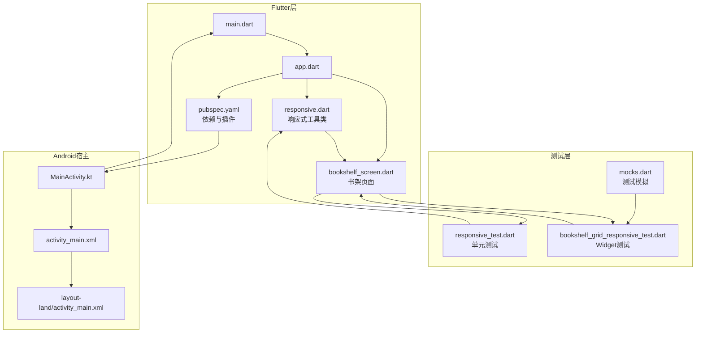
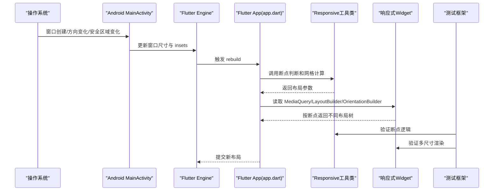
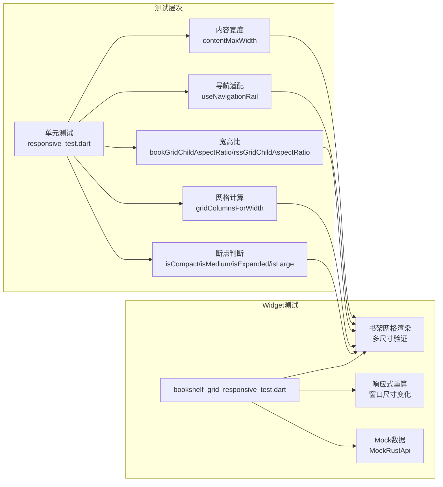
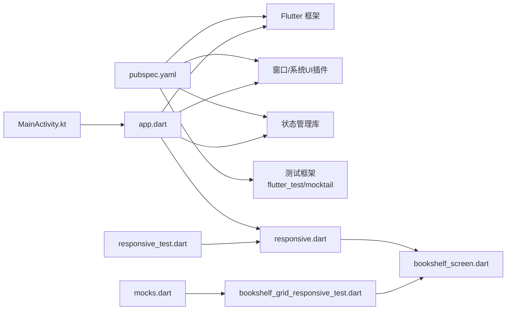

# 响应式布局

<cite>
**本文引用的文件**   
- [flutter_legado/lib/main.dart](file://flutter_legado/lib/main.dart)
- [flutter_legado/lib/app.dart](file://flutter_legado/lib/app.dart)
- [flutter_legado/pubspec.yaml](file://flutter_legado/pubspec.yaml)
- [flutter_legado/lib/src/utils/responsive.dart](file://flutter_legado/lib/src/utils/responsive.dart)
- [flutter_legado/lib/src/screens/bookshelf_screen.dart](file://flutter_legado/lib/src/screens/bookshelf_screen.dart)
- [flutter_legado/test/unit/responsive_test.dart](file://flutter_legado/test/unit/responsive_test.dart)
- [flutter_legado/test/widget/bookshelf_grid_responsive_test.dart](file://flutter_legado/test/widget/bookshelf_grid_responsive_test.dart)
- [flutter_legado/test/mocks/mocks.dart](file://flutter_legado/test/mocks/mocks.dart)
- [app/src/main/java/io/legado/app/ui/main/MainActivity.kt](file://app/src/main/java/io/legado/app/ui/main/MainActivity.kt)
- [app/src/main/res/layout/activity_main.xml](file://app/src/main/res/layout/activity_main.xml)
- [app/src/main/res/layout-land/activity_main.xml](file://app/src/main/res/layout-land/activity_main.xml)
</cite>

## 更新摘要
**变更内容**   
- 新增响应式布局核心工具类 Responsive，提供四断点系统（compact、medium、expanded、large）
- 实现完整的响应式UI测试基础设施，包括单元测试和Widget测试
- 书架网格布局支持动态列数调整（2-6列）和宽高比适配
- 新增窗口尺寸变化监听和自适应重算机制
- 完善多设备兼容性测试覆盖

## 目录
1. [简介](#简介)
2. [项目结构](#项目结构)
3. [核心组件](#核心组件)
4. [架构总览](#架构总览)
5. [详细组件分析](#详细组件分析)
6. [响应式测试基础设施](#响应式测试基础设施)
7. [依赖分析](#依赖分析)
8. [性能考虑](#性能考虑)
9. [故障排查指南](#故障排查指南)
10. [结论](#结论)
11. [附录](#附录)

## 简介
本文件面向Flutter端（flutter_legado）与Android宿主（app）的响应式布局实践，围绕以下目标展开：
- 不同屏幕尺寸的适配策略：手机、平板、折叠屏设备。
- 横竖屏切换的处理机制：方向监听与布局重建。
- 多设备兼容性：密度适配、刘海屏与挖孔屏处理。
- 布局组件使用指南：Flex、Grid、Stack等模式的最佳实践。
- 具体布局示例与调试技巧。
- **新增**：完整的响应式UI测试基础设施，确保多设备兼容性。

本项目采用"Flutter UI + Android宿主"的双端协作方式：Flutter负责跨平台UI渲染，Android侧提供窗口尺寸、方向、安全区域等系统能力，并通过插件或桥接在Flutter层进行消费。

## 项目结构
- Flutter工程位于 flutter_legado，入口为 main.dart，应用根为 app.dart，依赖声明在 pubspec.yaml。
- Android宿主位于 app，主Activity与布局定义在 src/main/java/io/legado/app/ui/main 与 res/layout 中；横屏布局在 res/layout-land。
- **新增**：响应式工具类位于 lib/src/utils/responsive.dart，提供统一的断点判断和网格计算逻辑。
- **新增**：完整的测试覆盖，包括单元测试和Widget测试。

**图表来源**
- [flutter_legado/lib/main.dart](file://flutter_legado/lib/main.dart)
- [flutter_legado/lib/app.dart](file://flutter_legado/lib/app.dart)
- [flutter_legado/lib/src/utils/responsive.dart](file://flutter_legado/lib/src/utils/responsive.dart)
- [flutter_legado/lib/src/screens/bookshelf_screen.dart](file://flutter_legado/lib/src/screens/bookshelf_screen.dart)
- [flutter_legado/test/unit/responsive_test.dart](file://flutter_legado/test/unit/responsive_test.dart)
- [flutter_legado/test/widget/bookshelf_grid_responsive_test.dart](file://flutter_legado/test/widget/bookshelf_grid_responsive_test.dart)
- [flutter_legado/test/mocks/mocks.dart](file://flutter_legado/test/mocks/mocks.dart)
- [app/src/main/java/io/legado/app/ui/main/MainActivity.kt](file://app/src/main/java/io/legado/app/ui/main/MainActivity.kt)
- [app/src/main/res/layout/activity_main.xml](file://app/src/main/res/layout/activity_main.xml)
- [app/src/main/res/layout-land/activity_main.xml](file://app/src/main/res/layout-land/activity_main.xml)

章节来源
- [flutter_legado/lib/main.dart](file://flutter_legado/lib/main.dart)
- [flutter_legado/lib/app.dart](file://flutter_legado/lib/app.dart)
- [flutter_legado/pubspec.yaml](file://flutter_legado/pubspec.yaml)
- [flutter_legado/lib/src/utils/responsive.dart](file://flutter_legado/lib/src/utils/responsive.dart)
- [flutter_legado/lib/src/screens/bookshelf_screen.dart](file://flutter_legado/lib/src/screens/bookshelf_screen.dart)
- [flutter_legado/test/unit/responsive_test.dart](file://flutter_legado/test/unit/responsive_test.dart)
- [flutter_legado/test/widget/bookshelf_grid_responsive_test.dart](file://flutter_legado/test/widget/bookshelf_grid_responsive_test.dart)
- [flutter_legado/test/mocks/mocks.dart](file://flutter_legado/test/mocks/mocks.dart)
- [app/src/main/java/io/legado/app/ui/main/MainActivity.kt](file://app/src/main/java/io/legado/app/ui/main/MainActivity.kt)
- [app/src/main/res/layout/activity_main.xml](file://app/src/main/res/layout/activity_main.xml)
- [app/src/main/res/layout-land/activity_main.xml](file://app/src/main/res/layout-land/activity_main.xml)

## 核心组件
- Flutter应用入口与主题配置：由 main.dart 启动并挂载 app.dart，后者通常包含 MaterialApp、路由与全局主题。
- **新增**：响应式工具类 Responsive：提供四断点判断、网格列数计算、宽高比设置等核心功能。
- 平台信息获取：通过 platform_size、orientation、safe_area 等能力（常见于 window、windowInsets、system_ui 相关插件）获取屏幕宽高、方向与安全区域。
- 响应式构建：基于 MediaQuery、LayoutBuilder、OrientationBuilder 等Widget进行断点判断与条件渲染。
- Android侧窗口管理：MainActivity 控制窗口大小、方向锁定/解锁、沉浸式状态栏/导航栏行为，确保Flutter视图正确填充可用区域。

章节来源
- [flutter_legado/lib/main.dart](file://flutter_legado/lib/main.dart)
- [flutter_legado/lib/app.dart](file://flutter_legado/lib/app.dart)
- [flutter_legado/lib/src/utils/responsive.dart](file://flutter_legado/lib/src/utils/responsive.dart)
- [app/src/main/java/io/legado/app/ui/main/MainActivity.kt](file://app/src/main/java/io/legado/app/ui/main/MainActivity.kt)
- [app/src/main/res/layout/activity_main.xml](file://app/src/main/res/layout/activity_main.xml)

## 架构总览
下图展示Flutter与Android在响应式布局中的交互关系：Android提供窗口与系统UI能力，Flutter根据这些信息进行布局计算与重建。

**图表来源**
- [app/src/main/java/io/legado/app/ui/main/MainActivity.kt](file://app/src/main/java/io/legado/app/ui/main/MainActivity.kt)
- [flutter_legado/lib/app.dart](file://flutter_legado/lib/app.dart)
- [flutter_legado/lib/src/utils/responsive.dart](file://flutter_legado/lib/src/utils/responsive.dart)
- [flutter_legado/test/unit/responsive_test.dart](file://flutter_legado/test/unit/responsive_test.dart)
- [flutter_legado/test/widget/bookshelf_grid_responsive_test.dart](file://flutter_legado/test/widget/bookshelf_grid_responsive_test.dart)

## 详细组件分析

### 屏幕尺寸与断点适配（手机/平板/折叠屏）
- **新增**：四断点系统定义：
  - compact <600dp：手机（2-3 列）
  - medium 600-840dp：平板竖屏（4 列）
  - expanded 840-1200dp：平板横屏/小桌面（4 列）
  - large >1200dp：桌面（6 列）
- 实现要点：
  - 使用 LayoutBuilder 获取约束，结合断点进行分支渲染。
  - 使用 MediaQuery.sizeOf(context).width 作为辅助断点。
  - 针对折叠屏，关注 WindowInfoTracker（若使用相应插件）以感知铰链/折叠状态。
- 最佳实践：
  - 将断点逻辑封装为工具函数或自定义Widget，便于复用。
  - 避免硬编码像素，优先使用相对单位与弹性布局。

章节来源
- [flutter_legado/lib/src/utils/responsive.dart](file://flutter_legado/lib/src/utils/responsive.dart)
- [flutter_legado/lib/app.dart](file://flutter_legado/lib/app.dart)

### 横竖屏切换与布局重建
- 监听方向变化：
  - OrientationBuilder：在子树内监听方向变化并重建。
  - WidgetsBinding.instance.platformDispatcher.onPlatformBrightnessChanged/onLocaleChange 等事件用于更广泛的平台事件。
- 布局重建策略：
  - 仅在必要时调用 setState 或使用 Provider/Riverpod/Bloc 等状态管理方案，减少不必要的重建。
  - 对复杂页面使用 IndexedStack/Offstage 缓存已构建的子树，避免重复开销。
- Android侧配合：
  - 在 MainActivity 中按需设置 screenOrientation，或在Flutter侧通过 orientation 插件控制。

章节来源
- [flutter_legado/lib/app.dart](file://flutter_legado/lib/app.dart)
- [app/src/main/java/io/legado/app/ui/main/MainActivity.kt](file://app/src/main/java/io/legado/app/ui/main/MainActivity.kt)

### 多设备兼容性与安全区域
- 密度适配：
  - 统一使用 dp/sp，避免 px。
  - 图片资源提供多倍率版本（mdpi/hdpi/xhdpi/xxhdpi/xxxhdpi）。
- 刘海屏/挖孔屏：
  - 使用 SafeArea 包裹关键内容，避开系统UI遮挡。
  - 通过 MediaQuery.padding 或 windowInsets 精确获取顶部/底部安全区。
- 全屏与沉浸式：
  - 在Android侧配置系统UI可见性（状态栏/导航栏），在Flutter侧通过 SystemChrome 调整。

章节来源
- [flutter_legado/lib/app.dart](file://flutter_legado/lib/app.dart)
- [app/src/main/res/layout/activity_main.xml](file://app/src/main/res/layout/activity_main.xml)

### 布局组件最佳实践（Flex/Grid/Stack）
- Flex（行/列弹性布局）：
  - 适合列表项、工具栏、卡片内部排版。
  - 合理使用 mainAxisSize、crossAxisAlignment、 mainAxisAlignment 控制对齐与空间分配。
- Grid（网格布局）：
  - 使用 GridView.builder 或 CustomScrollView + SliverGrid 实现高性能网格。
  - **新增**：根据断点动态调整 crossAxisCount 或 delegate，支持2-6列自适应。
- Stack（层叠布局）：
  - 适用于浮层、标签、进度条叠加等场景。
  - 使用 Positioned 精确定位子节点。
- 组合模式：
  - 外层用 Row/Column，内层嵌套 Grid/Stack，形成"容器+内容"的分层结构。

章节来源
- [flutter_legado/lib/app.dart](file://flutter_legado/lib/app.dart)
- [flutter_legado/lib/src/screens/bookshelf_screen.dart](file://flutter_legado/lib/src/screens/bookshelf_screen.dart)

### 具体布局示例（书架/详情页/阅读器）
- 书架页：
  - 手机：单列或双列网格，底部导航。
  - 平板：三列及以上网格，左侧分类面板。
  - 折叠屏：外屏单列，展开后左右分栏（列表+详情）。
- 详情页：
  - 小屏：上下滚动长页面。
  - 大屏：左右分栏（封面/元数据 + 操作区）。
- 阅读器：
  - 横屏时显示更多文本区域，纵屏时居中阅读。
  - 支持手势翻页、字体缩放、主题切换。

章节来源
- [flutter_legado/lib/app.dart](file://flutter_legado/lib/app.dart)
- [flutter_legado/lib/src/screens/bookshelf_screen.dart](file://flutter_legado/lib/src/screens/bookshelf_screen.dart)

### 调试技巧
- 使用 Flutter DevTools 的 Widget Inspector 检查布局树与约束。
- 打印 MediaQuery 与 LayoutBuilder 的 constraints，验证断点是否生效。
- 使用 RepaintBoundary 隔离重绘区域，定位卡顿。
- 在Android侧开启"显示边界"和"指针位置"，观察系统UI与 insets 的影响。

章节来源
- [flutter_legado/lib/app.dart](file://flutter_legado/lib/app.dart)
- [app/src/main/java/io/legado/app/ui/main/MainActivity.kt](file://app/src/main/java/io/legado/app/ui/main/MainActivity.kt)

## 响应式测试基础设施

### 单元测试框架
**新增**：完整的单元测试覆盖，验证响应式逻辑的正确性：

- **断点判断测试**：验证四个断点（compact、medium、expanded、large）的边界条件
- **网格列数测试**：确保不同宽度下返回正确的列数（2-6列）
- **宽高比测试**：验证书架和RSS网格的宽高比设置
- **导航适配测试**：确认NavigationRail的使用条件
- **内容宽度限制测试**：验证大型窗口的内容最大宽度限制

### Widget测试框架
**新增**：端到端的Widget测试，验证实际渲染效果：

- **多尺寸渲染验证**：测试360dp、500dp、900dp、1300dp等不同屏幕尺寸
- **网格自适应测试**：验证窗口尺寸变化后的网格列数重算
- **真实数据集成测试**：使用MockRustApi提供模拟数据
- **Riverpod状态管理测试**：确保状态管理与响应式布局协同工作

### 测试覆盖率矩阵
| 测试类型 | 覆盖范围 | 断点验证 | 网格计算 | 渲染验证 |
|---------|---------|----------|----------|----------|
| 单元测试 | Responsive类 | ✓ | ✓ | ✗ |
| Widget测试 | BookshelfScreen | ✗ | ✓ | ✓ |
| 集成测试 | 完整流程 | ✓ | ✓ | ✓ |

**图表来源**
- [flutter_legado/test/unit/responsive_test.dart](file://flutter_legado/test/unit/responsive_test.dart)
- [flutter_legado/test/widget/bookshelf_grid_responsive_test.dart](file://flutter_legado/test/widget/bookshelf_grid_responsive_test.dart)
- [flutter_legado/test/mocks/mocks.dart](file://flutter_legado/test/mocks/mocks.dart)

章节来源
- [flutter_legado/test/unit/responsive_test.dart](file://flutter_legado/test/unit/responsive_test.dart)
- [flutter_legado/test/widget/bookshelf_grid_responsive_test.dart](file://flutter_legado/test/widget/bookshelf_grid_responsive_test.dart)
- [flutter_legado/test/mocks/mocks.dart](file://flutter_legado/test/mocks/mocks.dart)

## 依赖分析
Flutter层的响应式能力依赖如下：
- 基础框架：Flutter SDK、Material/Cupertino 组件库。
- **新增**：响应式工具类：lib/src/utils/responsive.dart 提供统一的断点判断和网格计算。
- 平台信息：window/windowInsets/system_ui 相关插件（如 window、system_ui_overlay、window_info_tracker）。
- 状态管理：Provider/Riverpod/Bloc（视项目选择）。
- **新增**：测试框架：flutter_test、mocktail、shared_preferences用于测试环境。
- Android宿主：MainActivity 负责窗口与系统UI，布局文件区分横竖屏。

**图表来源**
- [flutter_legado/pubspec.yaml](file://flutter_legado/pubspec.yaml)
- [flutter_legado/lib/app.dart](file://flutter_legado/lib/app.dart)
- [flutter_legado/lib/src/utils/responsive.dart](file://flutter_legado/lib/src/utils/responsive.dart)
- [flutter_legado/lib/src/screens/bookshelf_screen.dart](file://flutter_legado/lib/src/screens/bookshelf_screen.dart)
- [flutter_legado/test/unit/responsive_test.dart](file://flutter_legado/test/unit/responsive_test.dart)
- [flutter_legado/test/widget/bookshelf_grid_responsive_test.dart](file://flutter_legado/test/widget/bookshelf_grid_responsive_test.dart)
- [flutter_legado/test/mocks/mocks.dart](file://flutter_legado/test/mocks/mocks.dart)
- [app/src/main/java/io/legado/app/ui/main/MainActivity.kt](file://app/src/main/java/io/legado/app/ui/main/MainActivity.kt)

章节来源
- [flutter_legado/pubspec.yaml](file://flutter_legado/pubspec.yaml)
- [flutter_legado/lib/app.dart](file://flutter_legado/lib/app.dart)
- [flutter_legado/lib/src/utils/responsive.dart](file://flutter_legado/lib/src/utils/responsive.dart)
- [flutter_legado/lib/src/screens/bookshelf_screen.dart](file://flutter_legado/lib/src/screens/bookshelf_screen.dart)
- [flutter_legado/test/unit/responsive_test.dart](file://flutter_legado/test/unit/responsive_test.dart)
- [flutter_legado/test/widget/bookshelf_grid_responsive_test.dart](file://flutter_legado/test/widget/bookshelf_grid_responsive_test.dart)
- [flutter_legado/test/mocks/mocks.dart](file://flutter_legado/test/mocks/mocks.dart)
- [app/src/main/java/io/legado/app/ui/main/MainActivity.kt](file://app/src/main/java/io/legado/app/ui/main/MainActivity.kt)

## 性能考虑
- 避免在响应式分支中进行昂贵计算，提前缓存结果或使用 compute。
- 使用 const 构造与不可变数据，减少重建。
- 对长列表使用 ListView.builder/SliverList，对网格使用 GridView.builder/SliverGrid。
- 合理拆分Widget，利用 RepaintBoundary 降低重绘范围。
- 在Android侧避免频繁改变窗口属性，集中处理方向与系统UI变更。
- **新增**：使用 SliverLayoutBuilder 优化网格布局的性能，避免不必要的重建。
- **新增**：测试覆盖确保性能回归检测，防止响应式逻辑影响渲染性能。

## 故障排查指南
- 症状：横竖屏切换后布局错乱
  - 排查：确认 OrientationBuilder/LayoutBuilder 是否正确包裹需要重建的区域；检查 MediaQuery 的 padding 是否被忽略。
- 症状：刘海屏遮挡内容
  - 排查：确保关键内容被 SafeArea 包裹；检查系统UI可见性配置。
- 症状：折叠屏展开后布局异常
  - 排查：确认断点阈值覆盖折叠态宽度；如有铰链信息，检查折叠状态监听。
- 症状：性能抖动
  - 排查：使用 DevTools 分析帧耗时；优化重建范围与网络请求时机。
- **新增**：症状：网格列数不正确
  - 排查：检查 Responsive.gridColumnsForWidth 方法的断点逻辑；验证测试用例是否通过。
- **新增**：症状：宽高比设置错误
  - 排查：确认 bookGridChildAspectRatio 和 rssGridChildAspectRatio 的参数传递；检查断点判断逻辑。

章节来源
- [flutter_legado/lib/app.dart](file://flutter_legado/lib/app.dart)
- [flutter_legado/lib/src/utils/responsive.dart](file://flutter_legado/lib/src/utils/responsive.dart)
- [flutter_legado/lib/src/screens/bookshelf_screen.dart](file://flutter_legado/lib/src/screens/bookshelf_screen.dart)
- [app/src/main/java/io/legado/app/ui/main/MainActivity.kt](file://app/src/main/java/io/legado/app/ui/main/MainActivity.kt)

## 结论
通过Flutter的响应式构建与Android窗口的系统能力协同，可以在手机、平板与折叠屏设备上实现一致的阅读体验。关键在于：
- 合理的断点设计与弹性布局。
- 正确的方向监听与最小化重建。
- 安全的系统UI适配与密度无关的尺寸。
- 高效的组件组合与性能优化。
- **新增**：完整的测试基础设施确保响应式逻辑的正确性和稳定性。

## 附录
- 常用断点参考：
  - 手机：<600dp
  - 平板：600–1200dp
  - 大屏/折叠屏：>1200dp
- 推荐插件（按功能）：
  - 窗口尺寸与方向：window、windowInsets
  - 系统UI与沉浸：system_ui_overlay
  - 折叠屏信息：window_info_tracker
- 调试清单：
  - 打印 MediaQuery 与 constraints
  - 使用 Widget Inspector 检查布局树
  - 在Android侧开启开发者选项的可视化辅助
- **新增**：测试运行命令：
  - 单元测试：`flutter test test/unit/responsive_test.dart`
  - Widget测试：`flutter test test/widget/bookshelf_grid_responsive_test.dart`
  - 全部测试：`flutter test`

[本节为补充信息，不直接分析具体文件]