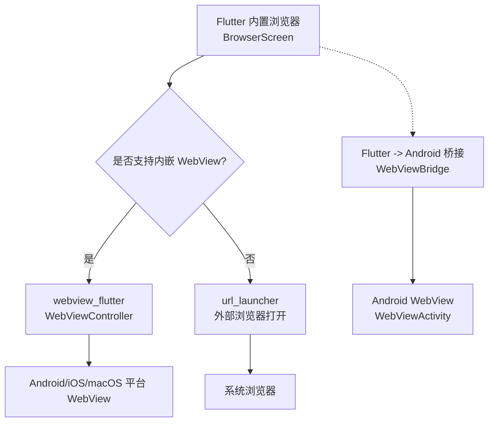
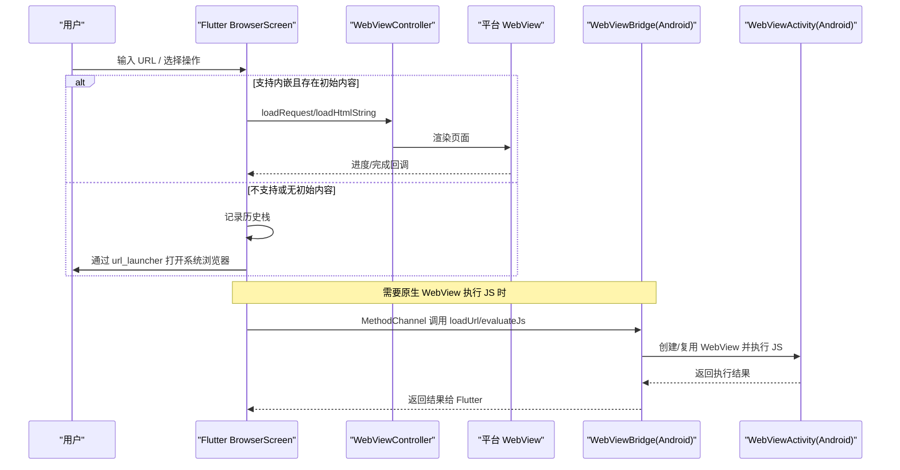
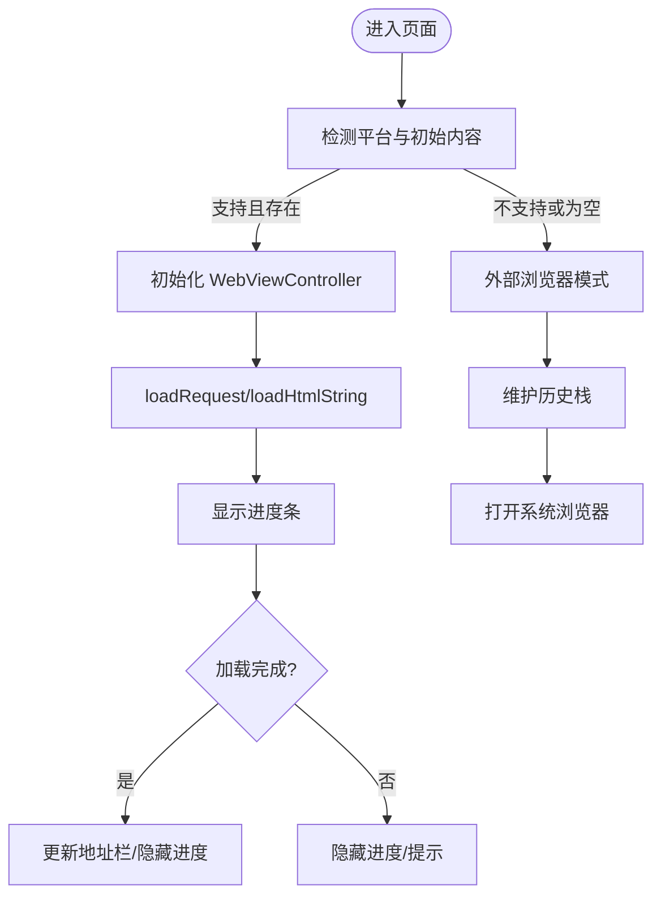
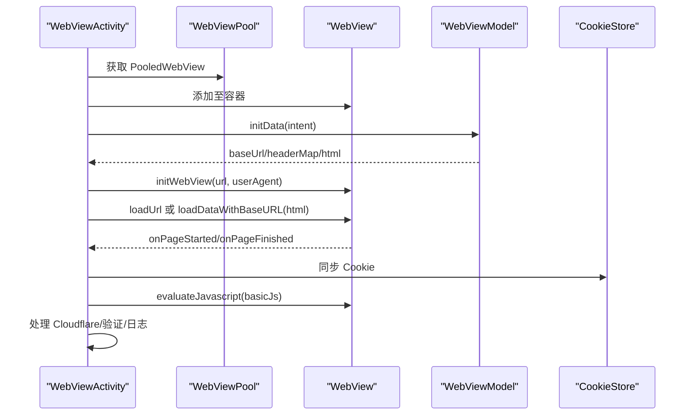
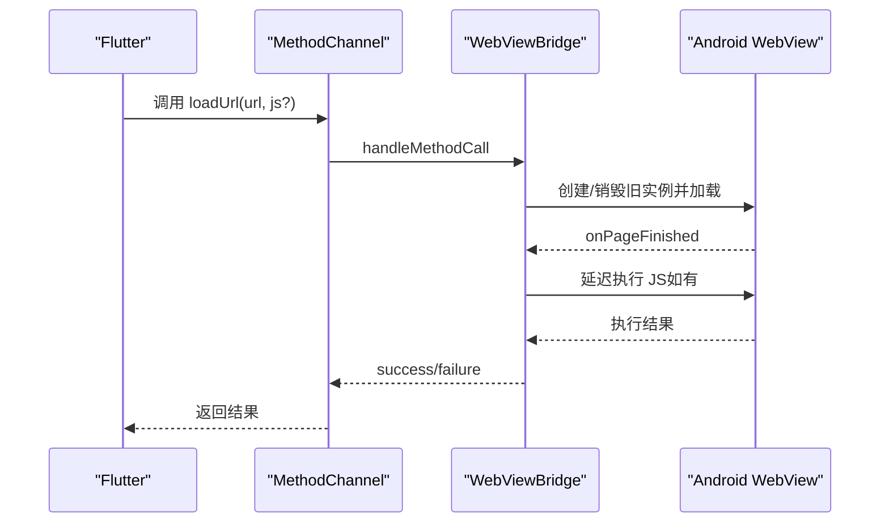
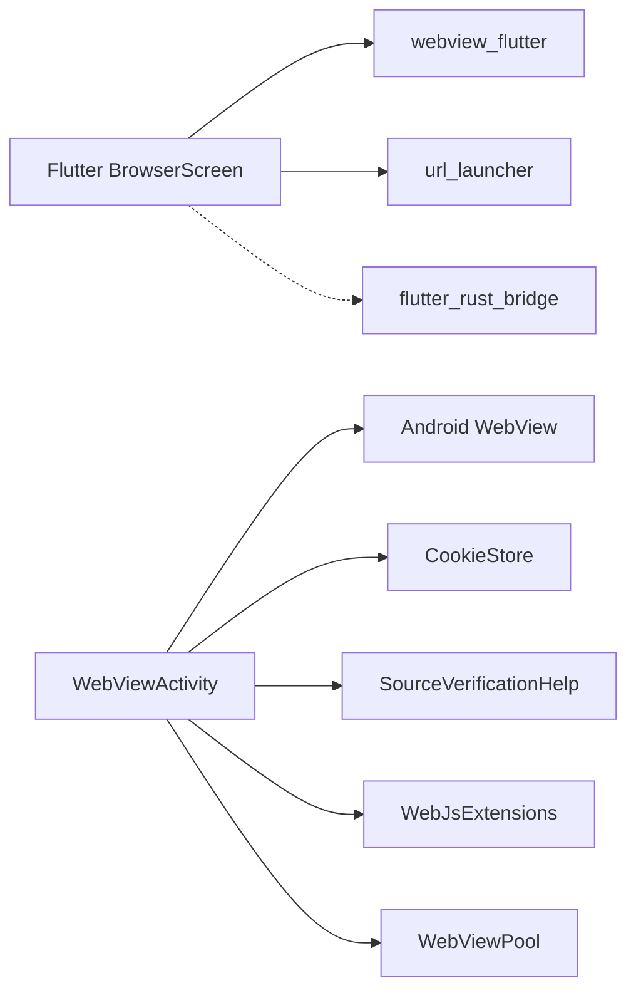

# 浏览器界面增强

<cite>
**本文引用的文件**
- [README.md](file://README.md)
- [browser_screen.dart](file://flutter_legado/lib/src/screens/browser_screen.dart)
- [WebViewActivity.kt](file://app/src/main/java/io/legado/app/ui/browser/WebViewActivity.kt)
- [PooledWebView.kt](file://app/src/main/java/io/legado/app/help/webView/PooledWebView.kt)
- [WebViewBridge.kt](file://flutter_legado/android/app/src/main/kotlin/io/legado/flutter/WebViewBridge.kt)
- [pubspec.yaml](file://flutter_legado/pubspec.yaml)
</cite>

## 目录
1. [简介](#简介)
2. [项目结构](#项目结构)
3. [核心组件](#核心组件)
4. [架构总览](#架构总览)
5. [详细组件分析](#详细组件分析)
6. [依赖关系分析](#依赖关系分析)
7. [性能考量](#性能考量)
8. [故障排查指南](#故障排查指南)
9. [结论](#结论)
10. [附录](#附录)

## 简介
本文件聚焦“浏览器界面增强”主题，围绕 Flutter 内置浏览器页面与 Android WebView 能力进行系统化说明。内容涵盖双模实现（内嵌 WebView 与外部浏览器降级）、导航历史、JS 提取助手、Android 端 WebView 生命周期与资源池、以及 Flutter 到 Android 的桥接执行 JS 的能力。目标是帮助开发者快速理解并扩展浏览器相关功能，同时提供可操作的排障建议与优化方向。

## 项目结构
本项目采用 Rust 核心 + Flutter UI 的跨平台架构，浏览器能力由 Flutter 层提供统一入口，并在支持的平台使用内嵌 WebView；在不支持或无初始内容的场景下，回退到系统浏览器打开，同时维护本地导航历史并提供 JS 提取工具。Android 端通过 Activity 承载原生 WebView，配合 WebView 池化与 JS 接口，完成复杂网页交互与验证流程。

图表来源
- [browser_screen.dart:1-466](file://flutter_legado/lib/src/screens/browser_screen.dart#L1-L466)
- [WebViewActivity.kt:1-531](file://app/src/main/java/io/legado/app/ui/browser/WebViewActivity.kt#L1-L531)
- [WebViewBridge.kt:1-178](file://flutter_legado/android/app/src/main/kotlin/io/legado/flutter/WebViewBridge.kt#L1-L178)

章节来源
- [README.md:1-121](file://README.md#L1-L121)

## 核心组件
- Flutter 内置浏览器页面：提供地址栏、前进/后退/刷新、内嵌 WebView 加载、外部打开、JS 提取脚本复制与结果粘贴区。
- Android WebView 活动页：负责真实 WebView 初始化、Cookie 注入、下载、全屏、JS 接口绑定、URL 拦截与跳转、Cloudflare 验证处理等。
- WebView 池化对象：封装真实 WebView 实例与上下文更新，便于复用与释放。
- Flutter 到 Android 桥接：在 Flutter 侧调用 Android WebView 执行 JS，用于反爬虫验证等需要原生 WebView 的场景。

章节来源
- [browser_screen.dart:1-466](file://flutter_legado/lib/src/screens/browser_screen.dart#L1-L466)
- [WebViewActivity.kt:1-531](file://app/src/main/java/io/legado/app/ui/browser/WebViewActivity.kt#L1-L531)
- [PooledWebView.kt:1-22](file://app/src/main/java/io/legado/app/help/webView/PooledWebView.kt#L1-L22)
- [WebViewBridge.kt:1-178](file://flutter_legado/android/app/src/main/kotlin/io/legado/flutter/WebViewBridge.kt#L1-L178)

## 架构总览
下图展示了从 Flutter 到 Android 的浏览器能力链路，包括内嵌 WebView 模式与外部浏览器降级路径，以及桥接执行 JS 的流程。

图表来源
- [browser_screen.dart:1-466](file://flutter_legado/lib/src/screens/browser_screen.dart#L1-L466)
- [WebViewBridge.kt:1-178](file://flutter_legado/android/app/src/main/kotlin/io/legado/flutter/WebViewBridge.kt#L1-L178)
- [WebViewActivity.kt:1-531](file://app/src/main/java/io/legado/app/ui/browser/WebViewActivity.kt#L1-L531)

## 详细组件分析

### Flutter 内置浏览器页面（BrowserScreen）
- 双模策略：当平台支持且携带初始 URL/HTML 时使用 webview_flutter 内嵌；否则维护本地历史并通过 url_launcher 打开系统浏览器。
- 地址栏与导航：支持前进/后退/刷新；在非内嵌模式下维护历史栈，显示当前页序号。
- JS 提取助手：内置常用脚本（标题、正文、链接、章节列表、图片地址），一键复制到剪贴板，提供结果粘贴区。
- 错误与提示：加载失败时停止进度指示；无法打开外部链接时给出提示。

图表来源
- [browser_screen.dart:1-466](file://flutter_legado/lib/src/screens/browser_screen.dart#L1-L466)

章节来源
- [browser_screen.dart:1-466](file://flutter_legado/lib/src/screens/browser_screen.dart#L1-L466)

### Android WebView 活动页（WebViewActivity）
- 生命周期管理：获取/释放 WebView 池化实例；onPause/onResume 控制 WebView 状态；onDestroy 释放。
- 初始化配置：设置 UA、Cookie、下载监听、长按保存图片、JS 接口绑定、进度条、全屏切换。
- URL 拦截与跳转：http/https 正常加载；legado/yuedu 协议跳转到在线导入；其他协议提示并跳转外部应用。
- 验证与日志：支持 Cloudflare 挑战检测；可选输出控制台日志到应用日志。
- 菜单操作：刷新、外部打开、复制链接、保存验证码、禁用/删除源、全屏、日志开关。

图表来源
- [WebViewActivity.kt:1-531](file://app/src/main/java/io/legado/app/ui/browser/WebViewActivity.kt#L1-L531)
- [PooledWebView.kt:1-22](file://app/src/main/java/io/legado/app/help/webView/PooledWebView.kt#L1-L22)

章节来源
- [WebViewActivity.kt:1-531](file://app/src/main/java/io/legado/app/ui/browser/WebViewActivity.kt#L1-L531)
- [PooledWebView.kt:1-22](file://app/src/main/java/io/legado/app/help/webView/PooledWebView.kt#L1-L22)

### Flutter -> Android 桥接（WebViewBridge）
- 方法通道：提供 loadUrl、evaluateJs、close 三种方法。
- 安全结果包装：防止重复回复，保证单次成功/错误/未实现。
- 超时与错误：加载超时返回错误；主框架加载失败返回错误；未初始化执行 JS 返回错误。
- 生命周期：destroy 清理 WebView，避免内存泄漏。

图表来源
- [WebViewBridge.kt:1-178](file://flutter_legado/android/app/src/main/kotlin/io/legado/flutter/WebViewBridge.kt#L1-L178)

章节来源
- [WebViewBridge.kt:1-178](file://flutter_legado/android/app/src/main/kotlin/io/legado/flutter/WebViewBridge.kt#L1-L178)

## 依赖关系分析
- Flutter 层依赖：
  - webview_flutter：用于内嵌 WebView 渲染。
  - url_launcher：用于外部浏览器打开。
  - flutter_rust_bridge：与 Rust 核心交互（非浏览器直接依赖）。
- Android 层依赖：
  - WebView 与系统服务：CookieManager、DownloadListener、WebChromeClient、WebSettings。
  - 应用内部模块：CookieStore、SourceVerificationHelp、WebJsExtensions、WebViewPool。

图表来源
- [pubspec.yaml:1-53](file://flutter_legado/pubspec.yaml#L1-L53)
- [WebViewActivity.kt:1-531](file://app/src/main/java/io/legado/app/ui/browser/WebViewActivity.kt#L1-L531)

章节来源
- [pubspec.yaml:1-53](file://flutter_legado/pubspec.yaml#L1-L53)
- [WebViewActivity.kt:1-531](file://app/src/main/java/io/legado/app/ui/browser/WebViewActivity.kt#L1-L531)

## 性能考量
- 内嵌 WebView 优先：在支持平台且有初始内容时使用内嵌 WebView，减少跳转开销，提升体验。
- 历史栈管理：非内嵌模式下维护本地历史，避免频繁重建页面。
- WebView 池化：Android 端通过 PooledWebView 复用实例，降低创建/销毁成本。
- 进度反馈：内嵌与原生 WebView 均提供进度指示，改善感知性能。
- JS 执行时机：桥接执行 JS 时延迟执行，确保 DOM 就绪，减少无效重试。
- 资源释放：及时关闭/销毁 WebView，避免内存泄漏。

[本节为通用指导，不直接分析具体文件]

## 故障排查指南
- 无法打开外部链接：检查 url_launcher 权限与系统浏览器可用性；确认 URL 格式正确。
- 内嵌 WebView 加载失败：查看 onWebResourceError 回调；确认网络与证书；必要时切换到外部打开。
- 桥接执行 JS 超时：检查 loadUrl 超时配置；确认目标站点可达；避免阻塞主线程。
- Cloudflare 验证：在 onPageFinished 中检测挑战标志；按业务需求触发验证流程。
- Cookie 不同步：确保在 onPageFinished 同步 Cookie；检查域名与路径匹配。
- 内存泄漏：确保 onDestroy 释放 WebView 实例；避免持有 Activity 引用。

章节来源
- [browser_screen.dart:1-466](file://flutter_legado/lib/src/screens/browser_screen.dart#L1-L466)
- [WebViewActivity.kt:1-531](file://app/src/main/java/io/legado/app/ui/browser/WebViewActivity.kt#L1-L531)
- [WebViewBridge.kt:1-178](file://flutter_legado/android/app/src/main/kotlin/io/legado/flutter/WebViewBridge.kt#L1-L178)

## 结论
本增强方案通过 Flutter 内置浏览器页面与 Android WebView 的深度结合，实现了跨平台的浏览体验：在支持平台提供内嵌渲染与完整导航，在不支持场景提供稳定的外部打开与本地历史；同时通过桥接机制满足需要原生 WebView 的复杂 JS 执行需求。配合 WebView 池化与完善的错误处理，整体具备较好的可用性与可维护性。后续可进一步扩展多标签、书签、阅读模式与更丰富的 JS 提取模板。

[本节为总结性内容，不直接分析具体文件]

## 附录
- 关键依赖版本：webview_flutter、url_launcher 等见 pubspec.yaml。
- 开发环境要求：Rust 与 Flutter SDK 版本见 README。

章节来源
- [pubspec.yaml:1-53](file://flutter_legado/pubspec.yaml#L1-L53)
- [README.md:1-121](file://README.md#L1-L121)