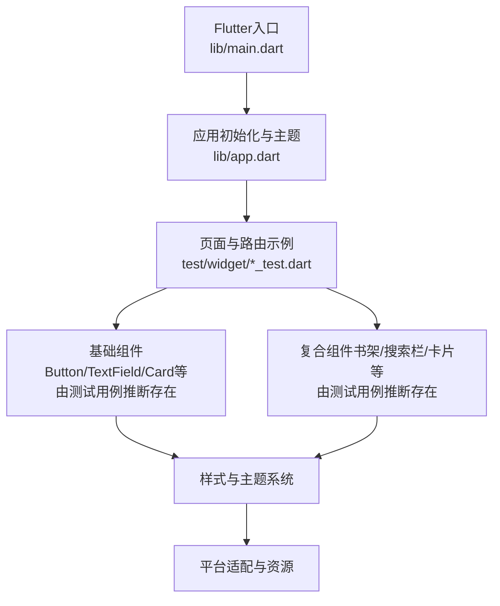
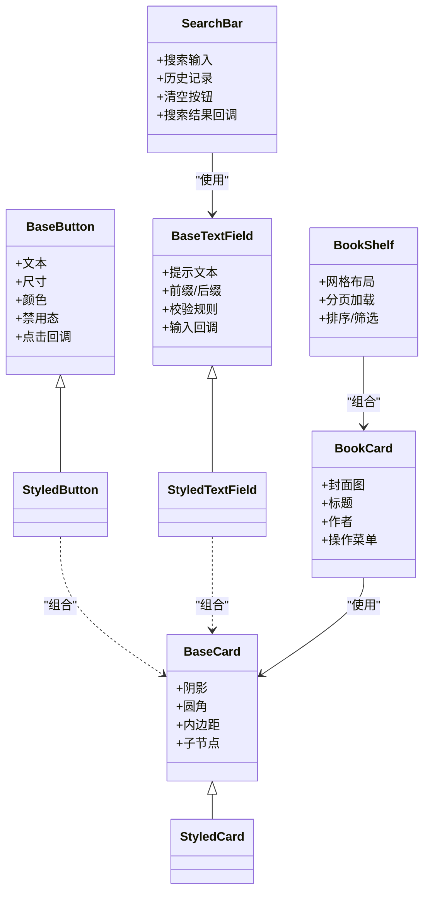
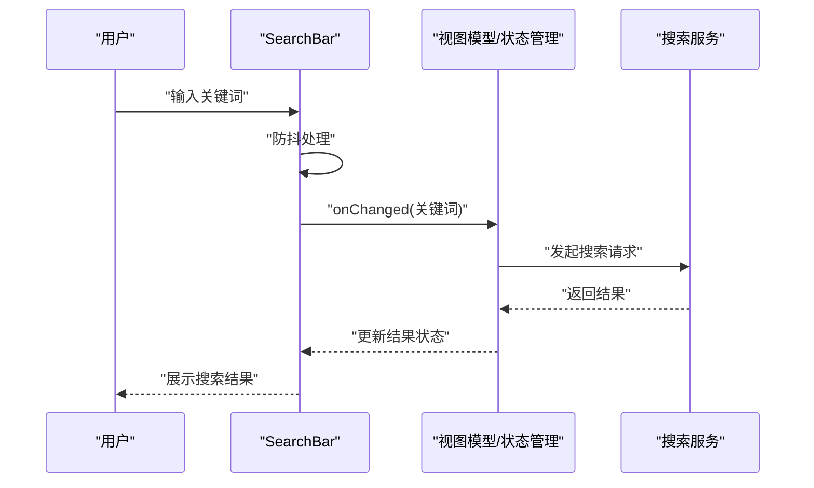
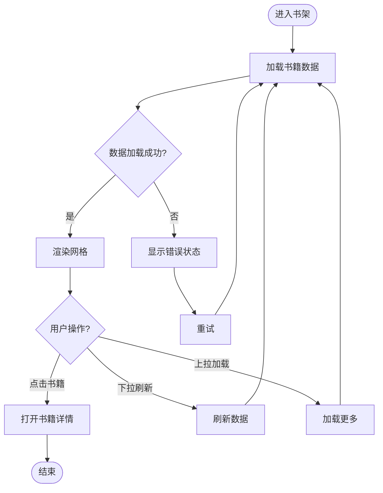
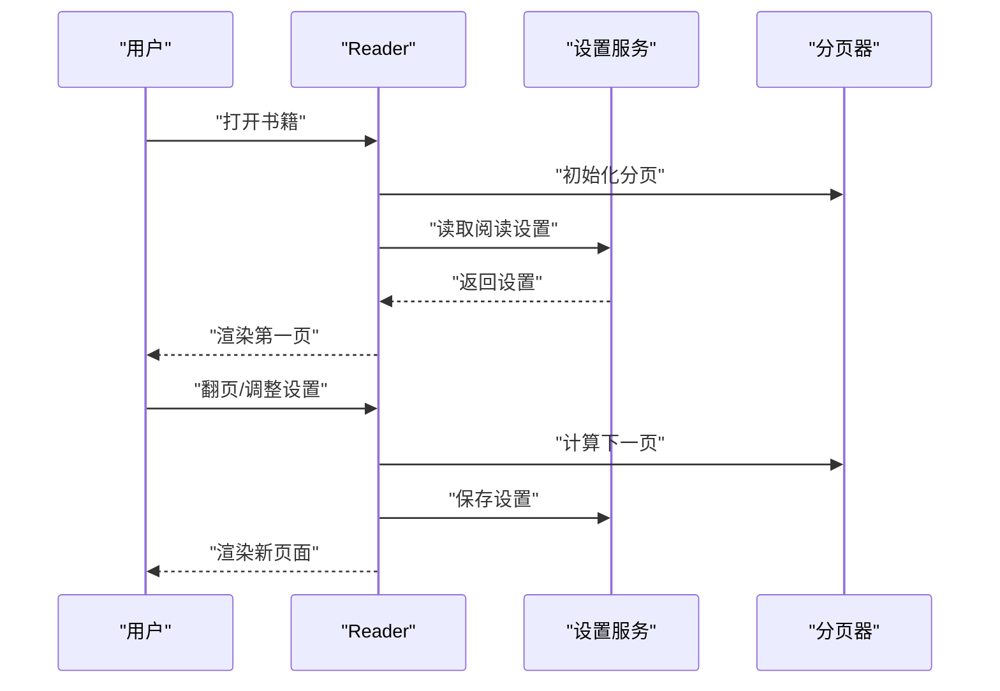
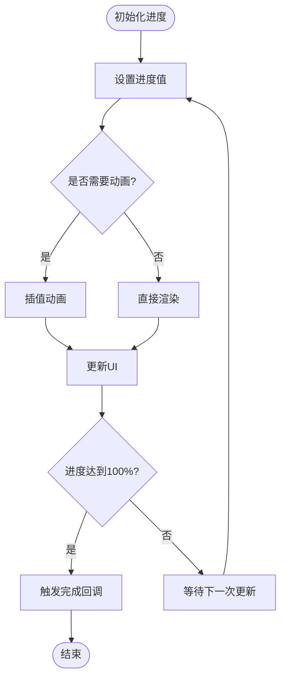
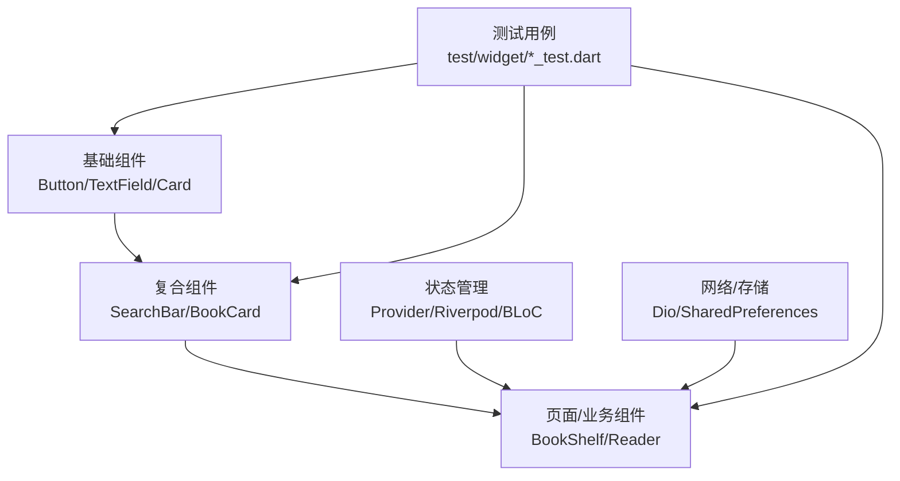

# 自定义Widget组件

<cite>
**本文引用的文件**   
- [pubspec.yaml](file://flutter_legado/pubspec.yaml)
- [main.dart](file://flutter_legado/lib/main.dart)
- [app.dart](file://flutter_legado/lib/app.dart)
- [badge_widget_test.dart](file://flutter_legado/test/widget/badge_widget_test.dart)
- [book_grid_item_test.dart](file://flutter_legado/test/widget/book_grid_item_test.dart)
- [bookshelf_test.dart](file://flutter_legado/test/widget/bookshelf_test.dart)
- [bottom_sheet_widget_test.dart](file://flutter_legado/test/widget/bottom_sheet_widget_test.dart)
- [chapter_tile_test.dart](file://flutter_legado/test/widget/chapter_tile_test.dart)
- [custom_progress_test.dart](file://flutter_legado/test/widget/custom_progress_test.dart)
- [loading_overlay_test.dart](file://flutter_legado/test/widget/loading_overlay_test.dart)
- [reader_test.dart](file://flutter_legado/test/widget/reader_test.dart)
- [search_bar_widget_test.dart](file://flutter_legado/test/widget/search_bar_widget_test.dart)
- [settings_test.dart](file://flutter_legado/test/widget/settings_test.dart)
- [source_card_test.dart](file://flutter_legado/test/widget/source_card_test.dart)
- [swipe_action_test.dart](file://flutter_legado/test/widget/swipe_action_test.dart)
- [tag_chip_test.dart](file://flutter_legado/test/widget/tag_chip_test.dart)
</cite>

## 目录
1. [简介](#简介)
2. [项目结构](#项目结构)
3. [核心组件](#核心组件)
4. [架构总览](#架构总览)
5. [详细组件分析](#详细组件分析)
6. [依赖分析](#依赖分析)
7. [性能考虑](#性能考虑)
8. [故障排查指南](#故障排查指南)
9. [结论](#结论)
10. [附录](#附录)

## 简介
本文件面向Flutter端自定义Widget组件的设计与实现，聚焦基础组件（如Button、TextField、Card等）的封装与扩展、复合组件的构建模式、属性配置与事件处理、状态管理策略，以及可复用性与最佳实践。文档基于仓库中Flutter模块的结构与测试用例进行归纳，帮助读者快速理解并落地一套高质量、可维护、可访问且高性能的UI组件体系。

## 项目结构
Flutter模块位于 flutter_legado 目录下，核心入口为 lib/main.dart 与 lib/app.dart，测试用例集中在 test/widget 目录，覆盖多种业务组件与交互场景。通过测试用例可以反推组件的职责边界、输入输出契约与交互流程。

图表来源
- [main.dart](file://flutter_legado/lib/main.dart)
- [app.dart](file://flutter_legado/lib/app.dart)

章节来源
- [pubspec.yaml](file://flutter_legado/pubspec.yaml)
- [main.dart](file://flutter_legado/lib/main.dart)
- [app.dart](file://flutter_legado/lib/app.dart)

## 核心组件
围绕Flutter常用UI元素，建议将基础组件抽象为可复用的“设计系统”单元：
- Button：统一按钮风格、尺寸、禁用态、加载态、点击反馈；支持无障碍标签与语义化描述。
- TextField：统一输入框样式、前缀/后缀图标、校验提示、防抖输入、键盘类型控制。
- Card：统一卡片容器、阴影、圆角、内边距、内容区布局。
- Chip/Tag：用于标签、筛选、选择项展示。
- Progress：进度指示器、环形进度、线性进度、占位骨架屏。
- BottomSheet：底部弹出面板，承载表单或操作列表。
- SearchBar：搜索输入、历史、清空、结果预览。
- SwipeAction：滑动触发操作（删除、收藏等）。
- Reader：阅读页容器，支持翻页、字体、行距、背景切换。

这些组件在仓库测试用例中被广泛使用，例如：
- 搜索栏组件：[search_bar_widget_test.dart](file://flutter_legado/test/widget/search_bar_widget_test.dart)
- 底部面板组件：[bottom_sheet_widget_test.dart](file://flutter_legado/test/widget/bottom_sheet_widget_test.dart)
- 滑动操作组件：[swipe_action_test.dart](file://flutter_legado/test/widget/swipe_action_test.dart)
- 阅读组件：[reader_test.dart](file://flutter_legado/test/widget/reader_test.dart)
- 进度组件：[custom_progress_test.dart](file://flutter_legado/test/widget/custom_progress_test.dart)
- 标签组件：[tag_chip_test.dart](file://flutter_legado/test/widget/tag_chip_test.dart)
- 卡片组件：[source_card_test.dart](file://flutter_legado/test/widget/source_card_test.dart)
- 书架组件：[bookshelf_test.dart](file://flutter_legado/test/widget/bookshelf_test.dart)
- 章节条目组件：[chapter_tile_test.dart](file://flutter_legado/test/widget/chapter_tile_test.dart)
- 书籍网格项组件：[book_grid_item_test.dart](file://flutter_legado/test/widget/book_grid_item_test.dart)
- 徽章组件：[badge_widget_test.dart](file://flutter_legado/test/widget/badge_widget_test.dart)
- 加载遮罩组件：[loading_overlay_test.dart](file://flutter_legado/test/widget/loading_overlay_test.dart)
- 设置组件：[settings_test.dart](file://flutter_legado/test/widget/settings_test.dart)

章节来源
- [search_bar_widget_test.dart](file://flutter_legado/test/widget/search_bar_widget_test.dart)
- [bottom_sheet_widget_test.dart](file://flutter_legado/test/widget/bottom_sheet_widget_test.dart)
- [swipe_action_test.dart](file://flutter_legado/test/widget/swipe_action_test.dart)
- [reader_test.dart](file://flutter_legado/test/widget/reader_test.dart)
- [custom_progress_test.dart](file://flutter_legado/test/widget/custom_progress_test.dart)
- [tag_chip_test.dart](file://flutter_legado/test/widget/tag_chip_test.dart)
- [source_card_test.dart](file://flutter_legado/test/widget/source_card_test.dart)
- [bookshelf_test.dart](file://flutter_legado/test/widget/bookshelf_test.dart)
- [chapter_tile_test.dart](file://flutter_legado/test/widget/chapter_tile_test.dart)
- [book_grid_item_test.dart](file://flutter_legado/test/widget/book_grid_item_test.dart)
- [badge_widget_test.dart](file://flutter_legado/test/widget/badge_widget_test.dart)
- [loading_overlay_test.dart](file://flutter_legado/test/widget/loading_overlay_test.dart)
- [settings_test.dart](file://flutter_legado/test/widget/settings_test.dart)

## 架构总览
组件体系采用“基础组件 + 复合组件 + 页面/业务组件”的分层组织方式：
- 基础组件：原子化的UI单元，关注样式、交互与可访问性。
- 复合组件：组合多个基础组件，提供业务语义（如书架、搜索栏、卡片）。
- 页面/业务组件：聚合复合组件，承载具体业务逻辑与状态。

图表来源
- [search_bar_widget_test.dart](file://flutter_legado/test/widget/search_bar_widget_test.dart)
- [source_card_test.dart](file://flutter_legado/test/widget/source_card_test.dart)
- [bookshelf_test.dart](file://flutter_legado/test/widget/bookshelf_test.dart)

章节来源
- [app.dart](file://flutter_legado/lib/app.dart)
- [search_bar_widget_test.dart](file://flutter_legado/test/widget/search_bar_widget_test.dart)
- [source_card_test.dart](file://flutter_legado/test/widget/source_card_test.dart)
- [bookshelf_test.dart](file://flutter_legado/test/widget/bookshelf_test.dart)

## 详细组件分析

### 搜索栏组件（SearchBar）
职责：提供统一的搜索输入、历史、清空与结果回调；支持防抖、键盘类型、无障碍标签。
- 属性配置：提示文本、默认值、键盘类型、是否自动聚焦、是否显示历史、是否显示清空按钮。
- 事件处理：输入变化回调、提交回调、清空回调、历史点击回调。
- 状态管理：内部持有输入状态，向上暴露回调；可与Provider/Riverpod/BLoC集成。
- 可访问性：语义化标签、读屏支持、焦点顺序。
- 性能优化：防抖输入、延迟渲染历史列表、避免不必要的重建。

图表来源
- [search_bar_widget_test.dart](file://flutter_legado/test/widget/search_bar_widget_test.dart)

章节来源
- [search_bar_widget_test.dart](file://flutter_legado/test/widget/search_bar_widget_test.dart)

### 书架组件（BookShelf）
职责：以网格形式展示书籍卡片，支持分页加载、排序与筛选。
- 属性配置：列数、间距、加载策略、空状态、错误状态。
- 事件处理：点击书籍、长按菜单、下拉刷新、上拉加载更多。
- 状态管理：分页数据、加载状态、错误信息、筛选条件。
- 可访问性：列表项语义、图片替代文本、焦点导航。
- 性能优化：虚拟列表、图片懒加载、缓存策略。

图表来源
- [bookshelf_test.dart](file://flutter_legado/test/widget/bookshelf_test.dart)

章节来源
- [bookshelf_test.dart](file://flutter_legado/test/widget/bookshelf_test.dart)

### 阅读组件（Reader）
职责：提供阅读页容器，支持翻页、字体大小、行距、背景切换、书签。
- 属性配置：字体、行距、背景色、是否夜间模式、是否显示工具栏。
- 事件处理：翻页、点击显示/隐藏工具栏、添加书签、调整设置。
- 状态管理：当前页码、阅读进度、设置持久化。
- 可访问性：大字体支持、高对比度、读屏朗读。
- 性能优化：文本分块渲染、图片预加载、内存回收。

图表来源
- [reader_test.dart](file://flutter_legado/test/widget/reader_test.dart)

章节来源
- [reader_test.dart](file://flutter_legado/test/widget/reader_test.dart)

### 进度组件（CustomProgress）
职责：提供线性/环形进度指示，支持百分比、颜色、动画。
- 属性配置：进度值、颜色、宽度、动画时长。
- 事件处理：进度变化回调、完成回调。
- 状态管理：内部进度状态，支持外部驱动。
- 可访问性：语义化进度描述、读屏支持。
- 性能优化：避免频繁重建、使用动画帧优化。

图表来源
- [custom_progress_test.dart](file://flutter_legado/test/widget/custom_progress_test.dart)

章节来源
- [custom_progress_test.dart](file://flutter_legado/test/widget/custom_progress_test.dart)

### 标签组件（TagChip）
职责：展示标签、筛选、选择项，支持多选、禁用、删除。
- 属性配置：文本、选中态、禁用态、颜色、删除回调。
- 事件处理：点击切换选中、删除回调。
- 状态管理：选中集合、过滤条件。
- 可访问性：语义化标签、键盘操作支持。
- 性能优化：批量渲染、避免重复创建。

章节来源
- [tag_chip_test.dart](file://flutter_legado/test/widget/tag_chip_test.dart)

### 卡片组件（SourceCard）
职责：展示源信息，包含封面、标题、作者、操作菜单。
- 属性配置：封面图、标题、作者、操作项。
- 事件处理：点击卡片、长按菜单、分享。
- 状态管理：本地缓存、加载状态。
- 可访问性：图片替代文本、菜单项语义。
- 性能优化：图片缓存、懒加载。

章节来源
- [source_card_test.dart](file://flutter_legado/test/widget/source_card_test.dart)

### 底部面板组件（BottomSheet）
职责：底部弹出面板，承载表单或操作列表。
- 属性配置：标题、内容、是否可关闭、确认/取消按钮。
- 事件处理：确认、取消、关闭回调。
- 状态管理：表单数据、验证状态。
- 可访问性：焦点管理、读屏支持。
- 性能优化：按需渲染、避免阻塞主线程。

章节来源
- [bottom_sheet_widget_test.dart](file://flutter_legado/test/widget/bottom_sheet_widget_test.dart)

### 滑动操作组件（SwipeAction）
职责：左右滑动触发操作（删除、收藏等）。
- 属性配置：左滑操作、右滑操作、阈值、动画。
- 事件处理：滑动开始、结束、操作回调。
- 状态管理：滑动距离、操作状态。
- 可访问性：手势冲突处理、读屏支持。
- 性能优化：手势识别优化、避免重绘。

章节来源
- [swipe_action_test.dart](file://flutter_legado/test/widget/swipe_action_test.dart)

### 加载遮罩组件（LoadingOverlay）
职责：全局或局部加载遮罩，防止误操作。
- 属性配置：是否显示、文案、背景透明度。
- 事件处理：显示/隐藏回调。
- 状态管理：全局加载状态。
- 可访问性：语义化加载描述、读屏支持。
- 性能优化：延迟显示、避免闪烁。

章节来源
- [loading_overlay_test.dart](file://flutter_legado/test/widget/loading_overlay_test.dart)

### 徽章组件（Badge）
职责：显示数量、状态标识。
- 属性配置：数值、颜色、位置。
- 事件处理：点击回调。
- 状态管理：数值更新。
- 可访问性：语义化描述、读屏支持。
- 性能优化：条件渲染、避免重绘。

章节来源
- [badge_widget_test.dart](file://flutter_legado/test/widget/badge_widget_test.dart)

### 书籍网格项组件（BookGridItem）
职责：书籍网格中的单项展示。
- 属性配置：封面、标题、作者、选中态。
- 事件处理：点击、长按菜单。
- 状态管理：本地选中状态。
- 可访问性：图片替代文本、菜单项语义。
- 性能优化：图片缓存、懒加载。

章节来源
- [book_grid_item_test.dart](file://flutter_legado/test/widget/book_grid_item_test.dart)

### 章节条目组件（ChapterTile）
职责：章节列表中的单项展示。
- 属性配置：章节名、字数、是否已读。
- 事件处理：点击跳转、标记已读。
- 状态管理：阅读进度。
- 可访问性：语义化描述、读屏支持。
- 性能优化：虚拟列表、按需渲染。

章节来源
- [chapter_tile_test.dart](file://flutter_legado/test/widget/chapter_tile_test.dart)

### 设置组件（Settings）
职责：提供用户偏好设置界面。
- 属性配置：设置项列表、默认值、变更回调。
- 事件处理：切换开关、输入修改、保存。
- 状态管理：本地持久化、同步到全局。
- 可访问性：语义化控件、读屏支持。
- 性能优化：增量更新、避免全量重建。

章节来源
- [settings_test.dart](file://flutter_legado/test/widget/settings_test.dart)

## 依赖分析
组件之间的依赖关系清晰，基础组件被复合组件复用，复合组件被页面/业务组件组合。测试用例作为契约验证，确保组件行为稳定。

图表来源
- [search_bar_widget_test.dart](file://flutter_legado/test/widget/search_bar_widget_test.dart)
- [bookshelf_test.dart](file://flutter_legado/test/widget/bookshelf_test.dart)
- [reader_test.dart](file://flutter_legado/test/widget/reader_test.dart)

章节来源
- [pubspec.yaml](file://flutter_legado/pubspec.yaml)
- [search_bar_widget_test.dart](file://flutter_legado/test/widget/search_bar_widget_test.dart)
- [bookshelf_test.dart](file://flutter_legado/test/widget/bookshelf_test.dart)
- [reader_test.dart](file://flutter_legado/test/widget/reader_test.dart)

## 性能考虑
- 避免不必要的重建：使用const构造、合理拆分组件、使用ValueListenableBuilder。
- 图片与媒体优化：懒加载、缓存、压缩、WebP格式。
- 列表优化：虚拟列表、分页加载、避免长列表卡顿。
- 动画优化：使用ImplicitlyAnimatedWidget、减少重绘区域。
- 内存管理：及时释放资源、避免循环引用、使用弱引用。
- 网络请求优化：缓存、去重、超时与重试策略。

## 故障排查指南
- 组件不响应事件：检查事件绑定是否正确、焦点是否在组件上、是否被父组件拦截。
- 样式异常：检查主题配置、样式优先级、平台差异。
- 状态不同步：检查状态管理是否正确更新、是否触发了正确的setState或通知。
- 性能问题：使用DevTools分析渲染耗时、内存占用、GPU绘制。
- 可访问性问题：检查语义化标签、读屏支持、键盘导航。

## 结论
通过基础组件与复合组件的分层设计，结合清晰的属性配置、事件处理与状态管理策略，可以构建出高质量、可复用、可访问且高性能的Flutter UI组件体系。测试用例作为契约保障，确保组件行为稳定可靠。遵循最佳实践，持续优化性能与用户体验，是打造优秀Flutter应用的关键。

## 附录
- 组件命名规范：使用PascalCase，动词+名词（如SearchBar、BookCard）。
- 属性命名规范：使用小驼峰，语义明确（如isLoading、onSubmit）。
- 事件回调规范：使用on前缀（如onClick、onChange）。
- 样式规范：使用Theme统一管理颜色、字体、间距。
- 可访问性规范：提供语义化标签、读屏支持、键盘导航。
- 测试规范：单元测试覆盖关键路径、集成测试验证交互流程。