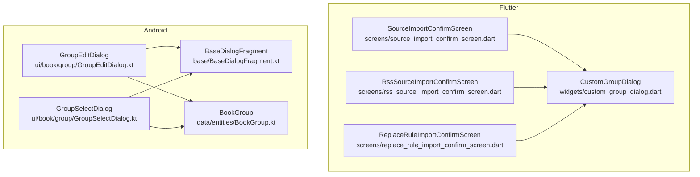
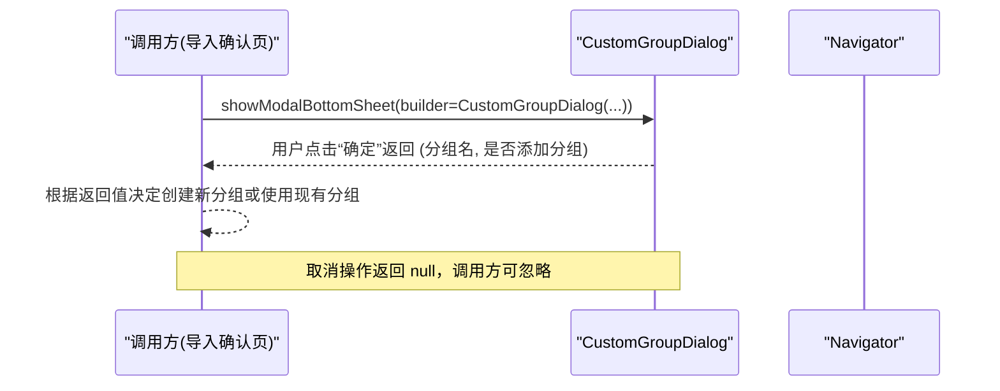
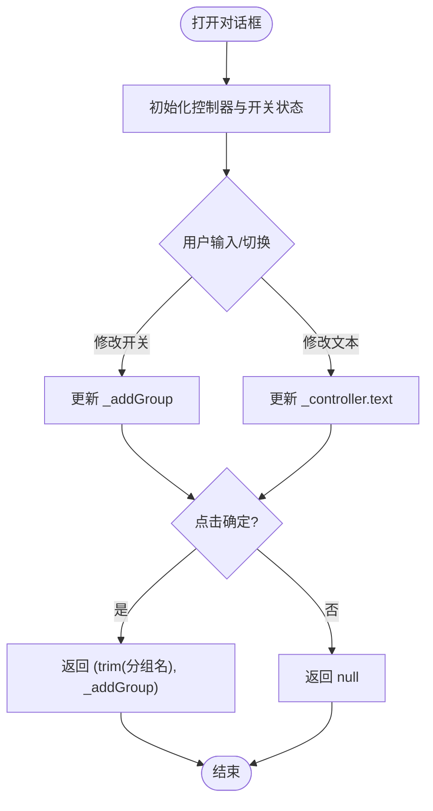
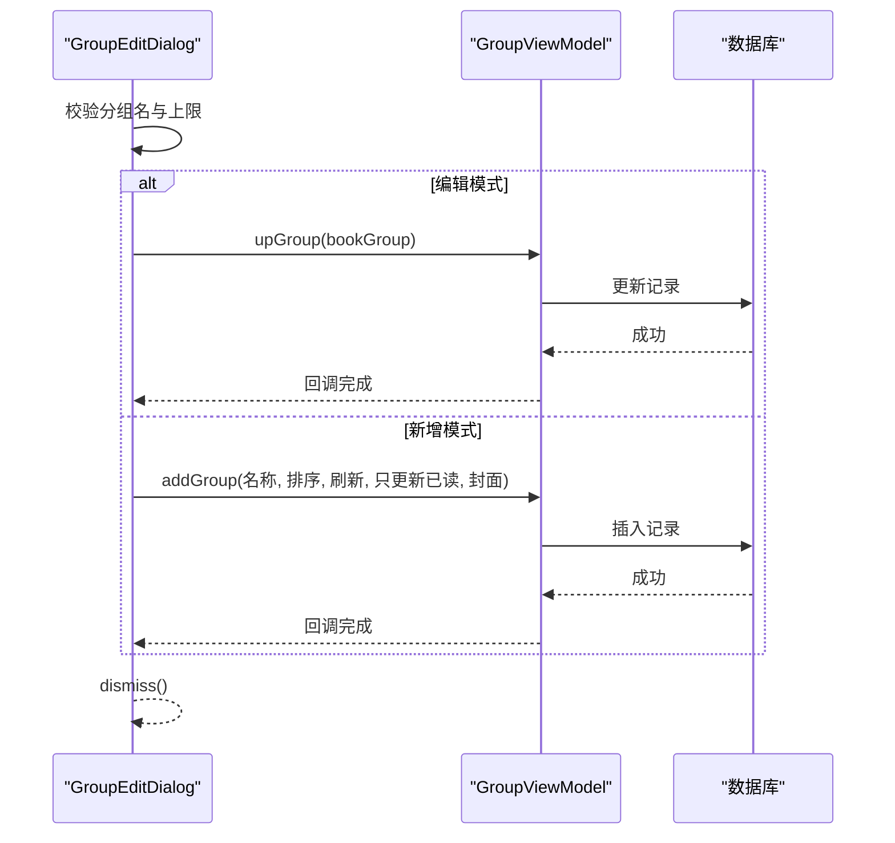
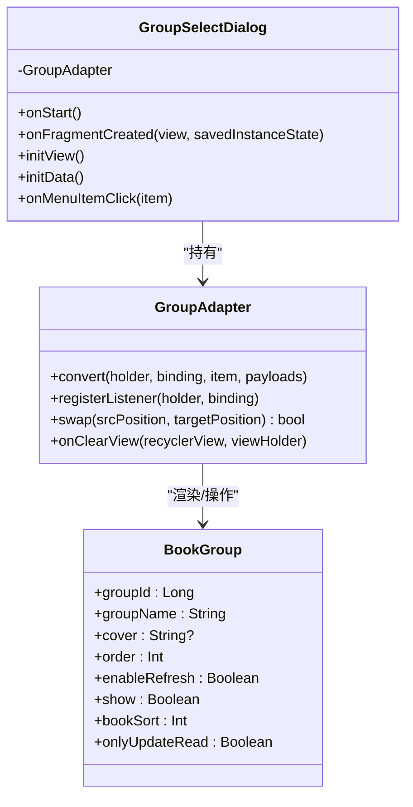
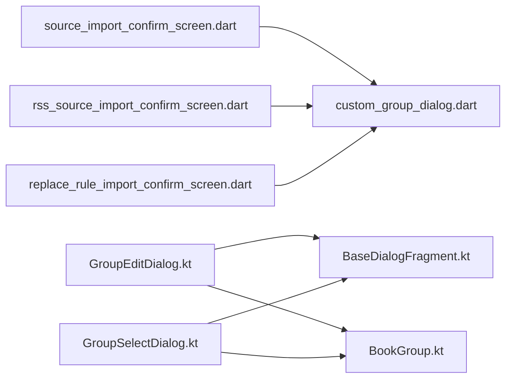

# 自定义分组对话框组件

<cite>
**本文引用的文件**
- [custom_group_dialog.dart](file://flutter_legado/lib/src/widgets/custom_group_dialog.dart)
- [source_import_confirm_screen.dart](file://flutter_legado/lib/src/screens/source_import_confirm_screen.dart)
- [rss_source_import_confirm_screen.dart](file://flutter_legado/lib/src/screens/rss_source_import_confirm_screen.dart)
- [replace_rule_import_confirm_screen.dart](file://flutter_legado/lib/src/screens/replace_rule_import_confirm_screen.dart)
- [GroupEditDialog.kt](file://app/src/main/java/io/legado/app/ui/book/group/GroupEditDialog.kt)
- [BaseDialogFragment.kt](file://app/src/main/java/io/legado/app/base/BaseDialogFragment.kt)
- [BookGroup.kt](file://app/src/main/java/io/legado/app/data/entities/BookGroup.kt)
- [GroupSelectDialog.kt](file://app/src/main/java/io/legado/app/ui/book/group/GroupSelectDialog.kt)
</cite>

## 目录
1. [简介](#简介)
2. [项目结构](#项目结构)
3. [核心组件](#核心组件)
4. [架构总览](#架构总览)
5. [详细组件分析](#详细组件分析)
6. [依赖关系分析](#依赖关系分析)
7. [性能考量](#性能考量)
8. [故障排查指南](#故障排查指南)
9. [结论](#结论)
10. [附录](#附录)

## 简介
本文件围绕“自定义分组对话框组件”进行系统化文档化，覆盖 Flutter 端的 CustomGroupDialog 与 Android 端相关的分组编辑、选择与管理能力。该组件用于在导入书源、订阅源或替换规则时，提供“添加分组/使用现有分组”的交互入口，并返回用户选择的分组名称与是否新建分组的决策结果。Android 侧与之配套的有 BookGroup 实体、分组编辑对话框与分组选择对话框等。

## 项目结构
- Flutter 端：自定义分组对话框位于 widgets 目录，被多个导入确认页面复用。
- Android 端：分组相关 UI 集中在 ui/book/group 包下，包含编辑、选择与管理对话框；数据模型为 BookGroup。

**图表来源**
- [custom_group_dialog.dart:1-74](file://flutter_legado/lib/src/widgets/custom_group_dialog.dart#L1-L74)
- [source_import_confirm_screen.dart:178-183](file://flutter_legado/lib/src/screens/source_import_confirm_screen.dart#L178-L183)
- [rss_source_import_confirm_screen.dart:172-175](file://flutter_legado/lib/src/screens/rss_source_import_confirm_screen.dart#L172-L175)
- [replace_rule_import_confirm_screen.dart:174-177](file://flutter_legado/lib/src/screens/replace_rule_import_confirm_screen.dart#L174-L177)
- [GroupEditDialog.kt:31-38](file://app/src/main/java/io/legado/app/ui/book/group/GroupEditDialog.kt#L31-L38)
- [BaseDialogFragment.kt:31-40](file://app/src/main/java/io/legado/app/base/BaseDialogFragment.kt#L31-L40)
- [BookGroup.kt:15-30](file://app/src/main/java/io/legado/app/data/entities/BookGroup.kt#L15-L30)
- [GroupSelectDialog.kt:35-43](file://app/src/main/java/io/legado/app/ui/book/group/GroupSelectDialog.kt#L35-L43)

**章节来源**
- [custom_group_dialog.dart:1-74](file://flutter_legado/lib/src/widgets/custom_group_dialog.dart#L1-L74)
- [GroupEditDialog.kt:31-174](file://app/src/main/java/io/legado/app/ui/book/group/GroupEditDialog.kt#L31-L174)
- [BaseDialogFragment.kt:31-127](file://app/src/main/java/io/legado/app/base/BaseDialogFragment.kt#L31-L127)
- [BookGroup.kt:1-81](file://app/src/main/java/io/legado/app/data/entities/BookGroup.kt#L1-L81)
- [GroupSelectDialog.kt:35-167](file://app/src/main/java/io/legado/app/ui/book/group/GroupSelectDialog.kt#L35-L167)

## 核心组件
- Flutter 自定义分组对话框（CustomGroupDialog）
  - 作用：提供“添加分组开关 + 分组名称输入”，确定后返回（分组名, 是否添加分组），取消返回 null。
  - 生命周期：控制器绑定对话框子树，随子树卸载统一释放，避免退场动画期间 dispose 引发断言。
  - 调用方：多个导入确认页通过 showModalBottomSheet 展示并接收返回值。

- Android 分组编辑对话框（GroupEditDialog）
  - 作用：新增/编辑分组，支持封面选择、排序、刷新策略与只更新已读等配置。
  - 基类：继承 BaseDialogFragment，统一窗口样式、键盘适配与显示流程。

- Android 分组选择对话框（GroupSelectDialog）
  - 作用：以列表形式展示所有分组，支持多选、拖拽排序、编辑条目与返回选中结果。

- 数据模型（BookGroup）
  - 字段：分组ID、名称、封面、排序、刷新开关、显示开关、排序策略、只更新已读等。
  - 常量：内置特殊分组 ID（全部、本地、音频、视频、错误等）。

**章节来源**
- [custom_group_dialog.dart:10-74](file://flutter_legado/lib/src/widgets/custom_group_dialog.dart#L10-L74)
- [GroupEditDialog.kt:31-174](file://app/src/main/java/io/legado/app/ui/book/group/GroupEditDialog.kt#L31-L174)
- [GroupSelectDialog.kt:35-167](file://app/src/main/java/io/legado/app/ui/book/group/GroupSelectDialog.kt#L35-L167)
- [BookGroup.kt:15-81](file://app/src/main/java/io/legado/app/data/entities/BookGroup.kt#L15-L81)

## 架构总览
Flutter 端通过统一的对话框组件对外暴露简单接口，Android 端则提供更丰富的分组管理能力（编辑、选择、排序、持久化）。两者通过一致的交互语义（是否新建分组、分组名称）协同工作。

**图表来源**
- [custom_group_dialog.dart:36-73](file://flutter_legado/lib/src/widgets/custom_group_dialog.dart#L36-L73)
- [source_import_confirm_screen.dart:178-183](file://flutter_legado/lib/src/screens/source_import_confirm_screen.dart#L178-L183)

## 详细组件分析

### Flutter 自定义分组对话框（CustomGroupDialog）
- 设计要点
  - 使用 AlertDialog 承载内容，包含 SwitchListTile 控制“添加分组”开关与 TextField 输入分组名称。
  - 确定按钮返回 trim 后的分组名与开关状态；取消按钮返回 null。
  - TextEditingController 在 dispose 中释放，避免内存泄漏。
- 使用方式
  - 各导入确认页通过 showModalBottomSheet 展示，并在 Future 中获取返回值。
- 复杂度与性能
  - 界面轻量，无复杂计算；TextField 与 Switch 的响应式更新开销极低。

**图表来源**
- [custom_group_dialog.dart:24-73](file://flutter_legado/lib/src/widgets/custom_group_dialog.dart#L24-L73)

**章节来源**
- [custom_group_dialog.dart:10-74](file://flutter_legado/lib/src/widgets/custom_group_dialog.dart#L10-L74)

### Android 分组编辑对话框（GroupEditDialog）
- 功能点
  - 新增/编辑分组：校验分组名非空、上限检查（如达到最大数量提示）。
  - 封面管理：支持从外部选择图片，保存至应用外部存储目录，MD5 命名避免重复。
  - 排序与策略：设置分组排序、是否启用刷新、是否仅更新已读。
  - 删除分组：二次确认后执行删除。
- 交互流程
  - 通过 viewBinding 绑定布局，Toolbar 主题色设置，按钮事件处理。
  - 使用 ViewModel 执行增删改操作，完成后 dismiss。

**图表来源**
- [GroupEditDialog.kt:118-161](file://app/src/main/java/io/legado/app/ui/book/group/GroupEditDialog.kt#L118-L161)

**章节来源**
- [GroupEditDialog.kt:31-174](file://app/src/main/java/io/legado/app/ui/book/group/GroupEditDialog.kt#L31-L174)

### Android 分组选择对话框（GroupSelectDialog）
- 功能点
  - 列表展示所有分组，支持多选（位运算组合 groupId）、拖拽排序、编辑条目。
  - 通过 Flow 监听数据库变化，实时更新列表。
  - 返回选中的分组 ID 组合给调用方。

**图表来源**
- [GroupSelectDialog.kt:35-167](file://app/src/main/java/io/legado/app/ui/book/group/GroupSelectDialog.kt#L35-L167)
- [BookGroup.kt:15-81](file://app/src/main/java/io/legado/app/data/entities/BookGroup.kt#L15-L81)

**章节来源**
- [GroupSelectDialog.kt:35-167](file://app/src/main/java/io/legado/app/ui/book/group/GroupSelectDialog.kt#L35-L167)

### Android 基础对话框基类（BaseDialogFragment）
- 职责
  - 统一对话框窗口样式、软键盘适配、E-Ink 模式背景与边框处理。
  - 提供 show 方法防止连续 add 事务导致的异常。
  - 封装 execute 协程执行器与 findParentTextInputLayout 工具方法。

**章节来源**
- [BaseDialogFragment.kt:31-127](file://app/src/main/java/io/legado/app/base/BaseDialogFragment.kt#L31-L127)

## 依赖关系分析
- Flutter 端
  - CustomGroupDialog 被多个导入确认页引用，形成“多对一”的复用关系。
- Android 端
  - GroupEditDialog 与 GroupSelectDialog 均继承 BaseDialogFragment，共享基础能力。
  - GroupEditDialog 与 GroupSelectDialog 依赖 BookGroup 实体进行数据展示与持久化。

**图表来源**
- [source_import_confirm_screen.dart:178-183](file://flutter_legado/lib/src/screens/source_import_confirm_screen.dart#L178-L183)
- [rss_source_import_confirm_screen.dart:172-175](file://flutter_legado/lib/src/screens/rss_source_import_confirm_screen.dart#L172-L175)
- [replace_rule_import_confirm_screen.dart:174-177](file://flutter_legado/lib/src/screens/replace_rule_import_confirm_screen.dart#L174-L177)
- [GroupEditDialog.kt:31-38](file://app/src/main/java/io/legado/app/ui/book/group/GroupEditDialog.kt#L31-L38)
- [GroupSelectDialog.kt:35-43](file://app/src/main/java/io/legado/app/ui/book/group/GroupSelectDialog.kt#L35-L43)
- [BaseDialogFragment.kt:31-40](file://app/src/main/java/io/legado/app/base/BaseDialogFragment.kt#L31-L40)
- [BookGroup.kt:15-30](file://app/src/main/java/io/legado/app/data/entities/BookGroup.kt#L15-L30)

**章节来源**
- [custom_group_dialog.dart:1-74](file://flutter_legado/lib/src/widgets/custom_group_dialog.dart#L1-L74)
- [GroupEditDialog.kt:31-174](file://app/src/main/java/io/legado/app/ui/book/group/GroupEditDialog.kt#L31-L174)
- [GroupSelectDialog.kt:35-167](file://app/src/main/java/io/legado/app/ui/book/group/GroupSelectDialog.kt#L35-L167)
- [BaseDialogFragment.kt:31-127](file://app/src/main/java/io/legado/app/base/BaseDialogFragment.kt#L31-L127)
- [BookGroup.kt:1-81](file://app/src/main/java/io/legado/app/data/entities/BookGroup.kt#L1-L81)

## 性能考量
- Flutter
  - 对话框内仅包含少量控件，构建成本低；注意 TextField controller 的生命周期管理，避免在退出动画期间 dispose。
- Android
  - GroupSelectDialog 使用 Flow 收集数据变更，建议合理节流（conflate）以避免频繁重建列表。
  - 封面图片读取与写入应放在 IO 线程，避免阻塞主线程。

[本节为通用指导，不直接分析具体文件]

## 故障排查指南
- Flutter 对话框返回值为 null
  - 可能原因：用户点击取消或未正确传参。
  - 处理建议：在调用方判断是否为 null，必要时回退到默认分组逻辑。
- Android 分组上限提示
  - 现象：新增分组时报错提示已达上限。
  - 处理建议：检查业务层限制逻辑（如 63 个上限）与数据库约束。
- Android 封面加载失败
  - 现象：选择图片后无法显示。
  - 处理建议：检查 URI scheme、权限与文件路径生成逻辑（MD5 命名与后缀处理）。

**章节来源**
- [custom_group_dialog.dart:58-73](file://flutter_legado/lib/src/widgets/custom_group_dialog.dart#L58-L73)
- [GroupEditDialog.kt:118-161](file://app/src/main/java/io/legado/app/ui/book/group/GroupEditDialog.kt#L118-L161)

## 结论
CustomGroupDialog 提供了简洁一致的分组选择与新建入口，适用于多种导入场景；Android 端配套的分组成员管理与选择能力完善，满足复杂业务需求。建议在跨端协作中保持交互语义一致，确保用户体验统一。

[本节为总结性内容，不直接分析具体文件]

## 附录
- 最佳实践
  - Flutter：在对话框关闭后再处理返回值，避免异步时序问题。
  - Android：使用 BaseDialogFragment 的统一能力减少样板代码；对耗时操作使用协程与 IO 调度器。
- 扩展建议
  - 增加分组名称唯一性校验与冲突提示。
  - 为 Flutter 端增加输入校验（非空、长度限制）以提升健壮性。

[本节为通用指导，不直接分析具体文件]