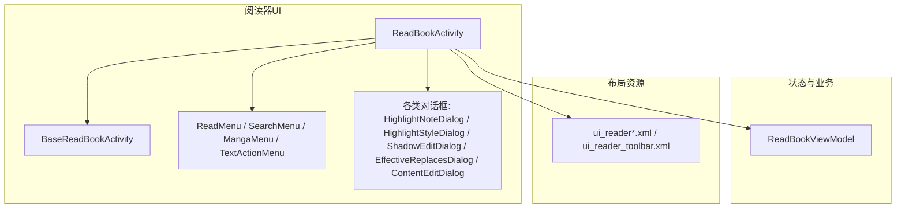
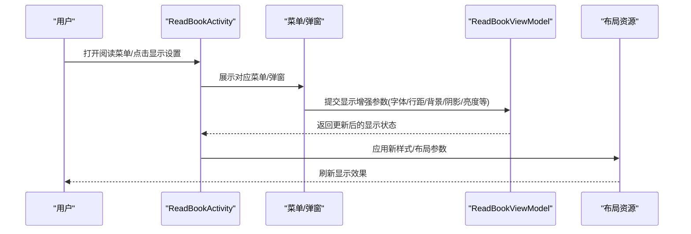
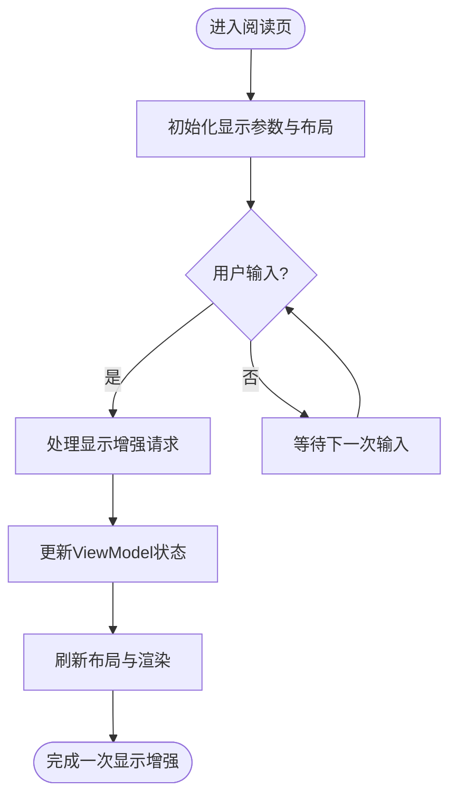
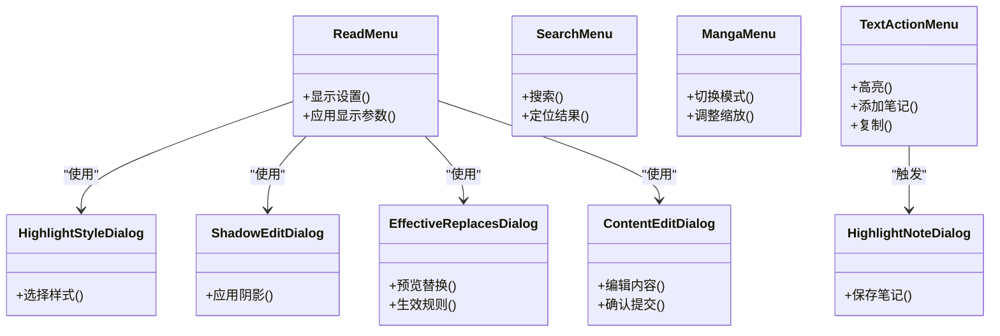
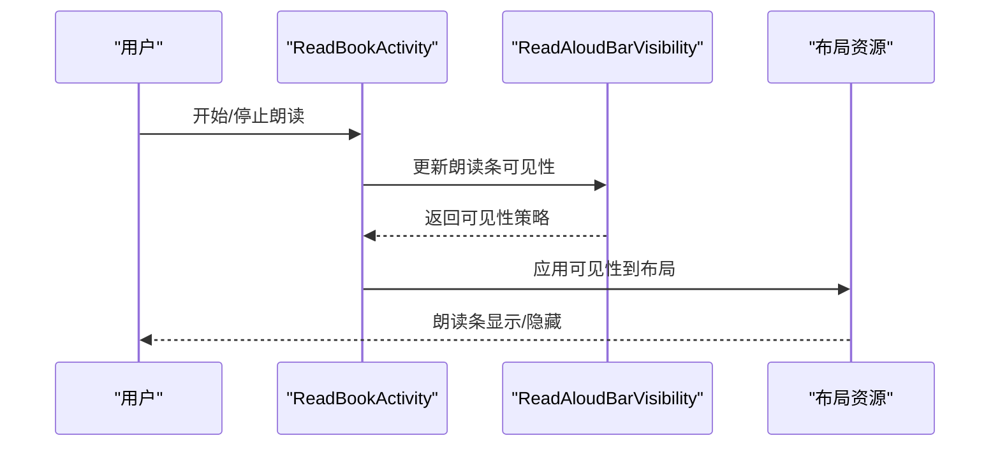
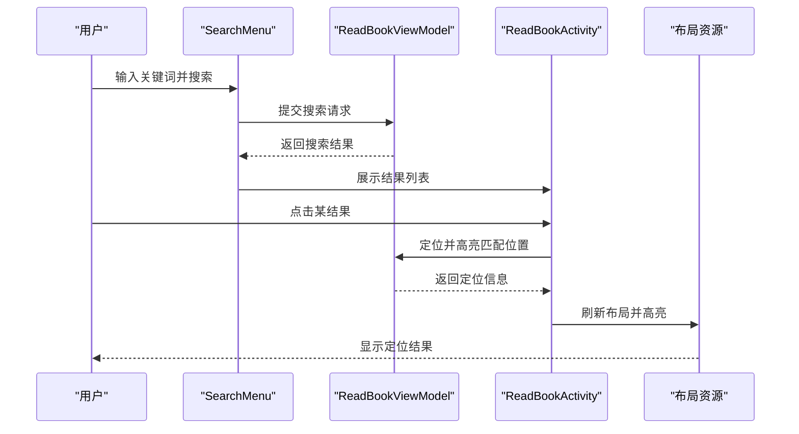
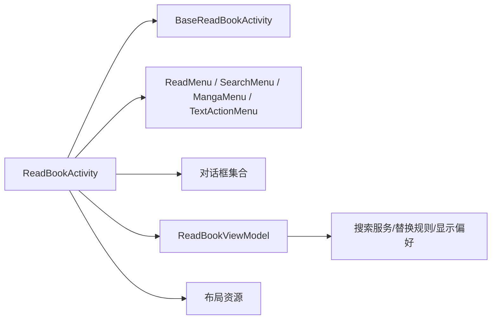

# 阅读器显示增强

<cite>
**本文引用的文件**
- [ReadBookActivity.kt](file://app/src/main/java/io/legado/app/ui/book/read/ReadBookActivity.kt)
- [BaseReadBookActivity.kt](file://app/src/main/java/io/legado/app/ui/book/read/BaseReadBookActivity.kt)
- [ReadMenu.kt](file://app/src/main/java/io/legado/app/ui/book/read/ReadMenu.kt)
- [SearchMenu.kt](file://app/src/main/java/io/legado/app/ui/book/read/SearchMenu.kt)
- [MangaMenu.kt](file://app/src/main/java/io/legado/app/ui/book/read/MangaMenu.kt)
- [TextActionMenu.kt](file://app/src/main/java/io/legado/app/ui/book/read/TextActionMenu.kt)
- [HighlightNoteDialog.kt](file://app/src/main/java/io/legado/app/ui/book/read/HighlightNoteDialog.kt)
- [HighlightStyleDialog.kt](file://app/src/main/java/io/legado/app/ui/book/read/HighlightStyleDialog.kt)
- [ShadowEditDialog.kt](file://app/src/main/java/io/legado/app/ui/book/read/ShadowEditDialog.kt)
- [EffectiveReplacesDialog.kt](file://app/src/main/java/io/legado/app/ui/book/read/EffectiveReplacesDialog.kt)
- [ContentEditDialog.kt](file://app/src/main/java/io/legado/app/ui/book/read/ContentEditDialog.kt)
- [ReadAloudBarVisibility.kt](file://app/src/main/java/io/legado/app/ui/book/read/ReadAloudBarVisibility.kt)
- [ReadBookViewModel.kt](file://app/src/main/java/io/legado/app/ui/book/read/ReadBookViewModel.kt)
- [ui_reader.xml](file://_verify_batch3/ui_reader.xml)
- [ui_reader2.xml](file://_verify_batch3/ui_reader2.xml)
- [ui_reader3.xml](file://_verify_batch3/ui_reader3.xml)
- [ui_reader_toolbar.xml](file://_verify_batch6/ui_reader_toolbar.xml)
</cite>

## 目录
1. [简介](#简介)
2. [项目结构](#项目结构)
3. [核心组件](#核心组件)
4. [架构总览](#架构总览)
5. [详细组件分析](#详细组件分析)
6. [依赖关系分析](#依赖关系分析)
7. [性能考量](#性能考量)
8. [故障排查指南](#故障排查指南)
9. [结论](#结论)
10. [附录](#附录)

## 简介
本文件聚焦“阅读器显示增强”主题，围绕阅读界面的交互菜单、高亮与标注、内容编辑、搜索与替换、以及朗读条可见性等能力进行系统化梳理。文档从系统架构、组件职责、数据流与处理逻辑、集成点与错误处理、性能特征等维度展开，并辅以时序图、流程图和类图帮助理解实现细节。目标读者包括希望快速上手阅读器显示增强的开发者与维护者。

## 项目结构
本项目采用分层组织：UI层位于 app 模块的 ui/book/read 目录，负责阅读器界面与交互；配置与状态由 ViewModel 管理；资源与布局以 XML 形式提供（在 _verify_batch3/_verify_batch6 中保留多版本 UI 快照）。整体呈现“页面活动 + 菜单/弹窗 + 视图模型 + 布局资源”的组合方式，便于对显示增强功能进行独立演进与回归验证。

图表来源
- [ReadBookActivity.kt:1-200](file://app/src/main/java/io/legado/app/ui/book/read/ReadBookActivity.kt#L1-L200)
- [BaseReadBookActivity.kt:1-200](file://app/src/main/java/io/legado/app/ui/book/read/BaseReadBookActivity.kt#L1-L200)
- [ReadMenu.kt:1-200](file://app/src/main/java/io/legado/app/ui/book/read/ReadMenu.kt#L1-L200)
- [SearchMenu.kt:1-200](file://app/src/main/java/io/legado/app/ui/book/read/SearchMenu.kt#L1-L200)
- [MangaMenu.kt:1-200](file://app/src/main/java/io/legado/app/ui/book/read/MangaMenu.kt#L1-L200)
- [TextActionMenu.kt:1-200](file://app/src/main/java/io/legado/app/ui/book/read/TextActionMenu.kt#L1-L200)
- [HighlightNoteDialog.kt:1-200](file://app/src/main/java/io/legado/app/ui/book/read/HighlightNoteDialog.kt#L1-L200)
- [HighlightStyleDialog.kt:1-200](file://app/src/main/java/io/legado/app/ui/book/read/HighlightStyleDialog.kt#L1-L200)
- [ShadowEditDialog.kt:1-200](file://app/src/main/java/io/legado/app/ui/book/read/ShadowEditDialog.kt#L1-L200)
- [EffectiveReplacesDialog.kt:1-200](file://app/src/main/java/io/legado/app/ui/book/read/EffectiveReplacesDialog.kt#L1-L200)
- [ContentEditDialog.kt:1-200](file://app/src/main/java/io/legado/app/ui/book/read/ContentEditDialog.kt#L1-L200)
- [ReadBookViewModel.kt:1-200](file://app/src/main/java/io/legado/app/ui/book/read/ReadBookViewModel.kt#L1-L200)
- [ui_reader.xml:1-200](file://_verify_batch3/ui_reader.xml#L1-L200)
- [ui_reader_toolbar.xml:1-200](file://_verify_batch6/ui_reader_toolbar.xml#L1-L200)

章节来源
- [ReadBookActivity.kt:1-200](file://app/src/main/java/io/legado/app/ui/book/read/ReadBookActivity.kt#L1-L200)
- [BaseReadBookActivity.kt:1-200](file://app/src/main/java/io/legado/app/ui/book/read/BaseReadBookActivity.kt#L1-L200)
- [ui_reader.xml:1-200](file://_verify_batch3/ui_reader.xml#L1-L200)
- [ui_reader_toolbar.xml:1-200](file://_verify_batch6/ui_reader_toolbar.xml#L1-L200)

## 核心组件
- 阅读器主活动：承载阅读页生命周期、手势、菜单显隐、全屏切换、工具栏与底部控制条等显示增强相关行为。
- 基类活动：抽取通用显示增强能力（如沉浸式、状态栏/导航栏适配、屏幕方向与尺寸变化处理等），供具体阅读器活动复用。
- 菜单与弹窗：
  - 阅读菜单：提供翻页模式、字体大小、行距、背景、亮度、阴影等显示设置入口。
  - 搜索菜单：支持全文检索、结果列表、跳转定位。
  - 漫画菜单：针对漫画场景的显示增强（如滚动模式、分页策略）。
  - 文本操作菜单：选中后的高亮、笔记、复制、查找等。
  - 高亮与样式：高亮笔记记录、高亮样式选择。
  - 阴影编辑：为文字添加投影效果以提升可读性。
  - 有效替换：基于规则的内容替换预览与生效。
  - 内容编辑：临时编辑当前内容片段。
- 朗读条可见性：控制朗读进度条的显示与隐藏，避免遮挡正文。
- 视图模型：集中管理阅读状态、显示偏好、搜索结果缓存、替换规则应用等。

章节来源
- [ReadMenu.kt:1-200](file://app/src/main/java/io/legado/app/ui/book/read/ReadMenu.kt#L1-L200)
- [SearchMenu.kt:1-200](file://app/src/main/java/io/legado/app/ui/book/read/SearchMenu.kt#L1-L200)
- [MangaMenu.kt:1-200](file://app/src/main/java/io/legado/app/ui/book/read/MangaMenu.kt#L1-L200)
- [TextActionMenu.kt:1-200](file://app/src/main/java/io/legado/app/ui/book/read/TextActionMenu.kt#L1-L200)
- [HighlightNoteDialog.kt:1-200](file://app/src/main/java/io/legado/app/ui/book/read/HighlightNoteDialog.kt#L1-L200)
- [HighlightStyleDialog.kt:1-200](file://app/src/main/java/io/legado/app/ui/book/read/HighlightStyleDialog.kt#L1-L200)
- [ShadowEditDialog.kt:1-200](file://app/src/main/java/io/legado/app/ui/book/read/ShadowEditDialog.kt#L1-L200)
- [EffectiveReplacesDialog.kt:1-200](file://app/src/main/java/io/legado/app/ui/book/read/EffectiveReplacesDialog.kt#L1-L200)
- [ContentEditDialog.kt:1-200](file://app/src/main/java/io/legado/app/ui/book/read/ContentEditDialog.kt#L1-L200)
- [ReadAloudBarVisibility.kt:1-200](file://app/src/main/java/io/legado/app/ui/book/read/ReadAloudBarVisibility.kt#L1-L200)
- [ReadBookViewModel.kt:1-200](file://app/src/main/java/io/legado/app/ui/book/read/ReadBookViewModel.kt#L1-L200)

## 架构总览
阅读器显示增强遵循“UI 事件驱动 + ViewModel 状态管理 + 布局资源驱动渲染”的模式。用户通过菜单或手势触发显示增强操作，UI 层调用 ViewModel 更新状态，再由布局资源与渲染管线刷新显示。

图表来源
- [ReadBookActivity.kt:1-200](file://app/src/main/java/io/legado/app/ui/book/read/ReadBookActivity.kt#L1-L200)
- [ReadMenu.kt:1-200](file://app/src/main/java/io/legado/app/ui/book/read/ReadMenu.kt#L1-L200)
- [ReadBookViewModel.kt:1-200](file://app/src/main/java/io/legado/app/ui/book/read/ReadBookViewModel.kt#L1-L200)
- [ui_reader.xml:1-200](file://_verify_batch3/ui_reader.xml#L1-L200)

## 详细组件分析

### 阅读器主活动与基类活动
- 职责：管理阅读页生命周期、全屏/沉浸模式、状态栏与导航栏适配、手势与触摸事件分发、菜单显隐与动画、朗读条可见性联动。
- 显示增强关键点：
  - 动态调整字体、行距、字重、背景、亮度、阴影等视觉属性。
  - 根据设备尺寸与方向自适应排版与控件布局。
  - 与朗读条可见性协调，避免遮挡正文。
- 典型流程：用户操作 → 活动拦截 → 更新 ViewModel → 刷新布局 → 反馈用户。

图表来源
- [BaseReadBookActivity.kt:1-200](file://app/src/main/java/io/legado/app/ui/book/read/BaseReadBookActivity.kt#L1-L200)
- [ReadBookActivity.kt:1-200](file://app/src/main/java/io/legado/app/ui/book/read/ReadBookActivity.kt#L1-L200)
- [ReadAloudBarVisibility.kt:1-200](file://app/src/main/java/io/legado/app/ui/book/read/ReadAloudBarVisibility.kt#L1-L200)

章节来源
- [BaseReadBookActivity.kt:1-200](file://app/src/main/java/io/legado/app/ui/book/read/BaseReadBookActivity.kt#L1-L200)
- [ReadBookActivity.kt:1-200](file://app/src/main/java/io/legado/app/ui/book/read/ReadBookActivity.kt#L1-L200)

### 菜单与弹窗体系
- 阅读菜单：提供显示增强入口（字体、行距、背景、亮度、阴影等），将用户选择转换为 ViewModel 的状态变更。
- 搜索菜单：支持关键词检索、结果列表、定位跳转，影响阅读内容的可视范围与高亮。
- 漫画菜单：针对漫画场景的显示增强（滚动/分页、缩放、对齐等）。
- 文本操作菜单：选中后的高亮、笔记、复制、查找等，直接影响文本层的显示与标注。
- 高亮与样式：记录高亮位置与样式，支持自定义颜色与透明度。
- 阴影编辑：为文字添加投影，提升对比度与可读性。
- 有效替换：基于规则的文本替换预览与生效，影响最终渲染内容。
- 内容编辑：临时编辑当前内容片段，用于调试或快速修正。

图表来源
- [ReadMenu.kt:1-200](file://app/src/main/java/io/legado/app/ui/book/read/ReadMenu.kt#L1-L200)
- [SearchMenu.kt:1-200](file://app/src/main/java/io/legado/app/ui/book/read/SearchMenu.kt#L1-L200)
- [MangaMenu.kt:1-200](file://app/src/main/java/io/legado/app/ui/book/read/MangaMenu.kt#L1-L200)
- [TextActionMenu.kt:1-200](file://app/src/main/java/io/legado/app/ui/book/read/TextActionMenu.kt#L1-L200)
- [HighlightNoteDialog.kt:1-200](file://app/src/main/java/io/legado/app/ui/book/read/HighlightNoteDialog.kt#L1-L200)
- [HighlightStyleDialog.kt:1-200](file://app/src/main/java/io/legado/app/ui/book/read/HighlightStyleDialog.kt#L1-L200)
- [ShadowEditDialog.kt:1-200](file://app/src/main/java/io/legado/app/ui/book/read/ShadowEditDialog.kt#L1-L200)
- [EffectiveReplacesDialog.kt:1-200](file://app/src/main/java/io/legado/app/ui/book/read/EffectiveReplacesDialog.kt#L1-L200)
- [ContentEditDialog.kt:1-200](file://app/src/main/java/io/legado/app/ui/book/read/ContentEditDialog.kt#L1-L200)

章节来源
- [ReadMenu.kt:1-200](file://app/src/main/java/io/legado/app/ui/book/read/ReadMenu.kt#L1-L200)
- [SearchMenu.kt:1-200](file://app/src/main/java/io/legado/app/ui/book/read/SearchMenu.kt#L1-L200)
- [MangaMenu.kt:1-200](file://app/src/main/java/io/legado/app/ui/book/read/MangaMenu.kt#L1-L200)
- [TextActionMenu.kt:1-200](file://app/src/main/java/io/legado/app/ui/book/read/TextActionMenu.kt#L1-L200)
- [HighlightNoteDialog.kt:1-200](file://app/src/main/java/io/legado/app/ui/book/read/HighlightNoteDialog.kt#L1-L200)
- [HighlightStyleDialog.kt:1-200](file://app/src/main/java/io/legado/app/ui/book/read/HighlightStyleDialog.kt#L1-L200)
- [ShadowEditDialog.kt:1-200](file://app/src/main/java/io/legado/app/ui/book/read/ShadowEditDialog.kt#L1-L200)
- [EffectiveReplacesDialog.kt:1-200](file://app/src/main/java/io/legado/app/ui/book/read/EffectiveReplacesDialog.kt#L1-L200)
- [ContentEditDialog.kt:1-200](file://app/src/main/java/io/legado/app/ui/book/read/ContentEditDialog.kt#L1-L200)

### 朗读条可见性与显示协调
- 职责：在朗读过程中控制朗读条的显示与隐藏，避免遮挡正文，同时保证用户可便捷访问朗读控制。
- 显示增强关键点：
  - 根据阅读模式与手势自动切换可见性。
  - 与全屏/沉浸模式协同，确保控件不被遮挡。
  - 与菜单显隐联动，减少界面干扰。

图表来源
- [ReadAloudBarVisibility.kt:1-200](file://app/src/main/java/io/legado/app/ui/book/read/ReadAloudBarVisibility.kt#L1-L200)
- [ReadBookActivity.kt:1-200](file://app/src/main/java/io/legado/app/ui/book/read/ReadBookActivity.kt#L1-L200)
- [ui_reader_toolbar.xml:1-200](file://_verify_batch6/ui_reader_toolbar.xml#L1-L200)

章节来源
- [ReadAloudBarVisibility.kt:1-200](file://app/src/main/java/io/legado/app/ui/book/read/ReadAloudBarVisibility.kt#L1-L200)
- [ui_reader_toolbar.xml:1-200](file://_verify_batch6/ui_reader_toolbar.xml#L1-L200)

### 搜索与定位流程
- 职责：执行全文检索，展示结果列表，支持跳转到匹配位置并高亮显示。
- 显示增强关键点：
  - 搜索结果列表的加载与分页。
  - 匹配位置的定位与高亮。
  - 与阅读菜单中的显示设置联动（如字体、行距）保持阅读体验一致。

图表来源
- [SearchMenu.kt:1-200](file://app/src/main/java/io/legado/app/ui/book/read/SearchMenu.kt#L1-L200)
- [ReadBookViewModel.kt:1-200](file://app/src/main/java/io/legado/app/ui/book/read/ReadBookViewModel.kt#L1-L200)
- [ReadBookActivity.kt:1-200](file://app/src/main/java/io/legado/app/ui/book/read/ReadBookActivity.kt#L1-L200)

章节来源
- [SearchMenu.kt:1-200](file://app/src/main/java/io/legado/app/ui/book/read/SearchMenu.kt#L1-L200)
- [ReadBookViewModel.kt:1-200](file://app/src/main/java/io/legado/app/ui/book/read/ReadBookViewModel.kt#L1-L200)

## 依赖关系分析
- 组件耦合：
  - 活动与基类活动：继承复用显示增强通用逻辑。
  - 活动与菜单/弹窗：通过回调与事件传递用户意图。
  - 活动与视图模型：单向依赖，活动读取/更新状态，ViewModel 不反向依赖 UI。
  - 布局资源：作为渲染载体，受活动与 ViewModel 状态驱动。
- 外部集成点：
  - 设备适配：状态栏/导航栏、屏幕方向与尺寸变化。
  - 朗读服务：朗读条可见性与播放状态同步。
  - 搜索服务：检索引擎与结果缓存。
- 潜在循环依赖：应避免 ViewModel 直接持有 Activity 引用，防止内存泄漏与循环依赖。

图表来源
- [ReadBookActivity.kt:1-200](file://app/src/main/java/io/legado/app/ui/book/read/ReadBookActivity.kt#L1-L200)
- [BaseReadBookActivity.kt:1-200](file://app/src/main/java/io/legado/app/ui/book/read/BaseReadBookActivity.kt#L1-L200)
- [ReadBookViewModel.kt:1-200](file://app/src/main/java/io/legado/app/ui/book/read/ReadBookViewModel.kt#L1-L200)

章节来源
- [ReadBookActivity.kt:1-200](file://app/src/main/java/io/legado/app/ui/book/read/ReadBookActivity.kt#L1-L200)
- [BaseReadBookActivity.kt:1-200](file://app/src/main/java/io/legado/app/ui/book/read/BaseReadBookActivity.kt#L1-L200)
- [ReadBookViewModel.kt:1-200](file://app/src/main/java/io/legado/app/ui/book/read/ReadBookViewModel.kt#L1-L200)

## 性能考量
- 渲染优化：
  - 批量更新显示参数，减少多次重绘。
  - 使用懒加载与分页加载搜索结果，降低首屏压力。
  - 合理设置阴影与高亮的绘制区域，避免全量重绘。
- 内存管理：
  - 避免在 ViewModel 中持有 Activity 引用。
  - 及时释放大对象（如图片、文本块）与监听器。
- 交互流畅性：
  - 菜单与弹窗的显示/隐藏使用平滑动画。
  - 朗读条可见性切换时避免阻塞主线程。

[本节为通用性能建议，无需特定文件引用]

## 故障排查指南
- 常见问题：
  - 显示设置未生效：检查 ViewModel 状态是否正确更新，布局是否重新应用。
  - 朗读条遮挡正文：确认朗读条可见性策略与全屏/沉浸模式是否冲突。
  - 搜索结果定位失败：核对搜索索引与定位算法，检查高亮区域计算。
  - 高亮样式异常：确认样式参数合法性与绘制边界。
- 诊断步骤：
  - 启用日志输出，记录显示参数变更与布局刷新时机。
  - 使用 UI 快照（ui_reader*.xml、ui_reader_toolbar.xml）对比前后差异。
  - 逐步隔离问题：先复现最小用例，再引入更多显示增强选项。

章节来源
- [ReadBookActivity.kt:1-200](file://app/src/main/java/io/legado/app/ui/book/read/ReadBookActivity.kt#L1-L200)
- [ReadAloudBarVisibility.kt:1-200](file://app/src/main/java/io/legado/app/ui/book/read/ReadAloudBarVisibility.kt#L1-L200)
- [ui_reader.xml:1-200](file://_verify_batch3/ui_reader.xml#L1-L200)
- [ui_reader_toolbar.xml:1-200](file://_verify_batch6/ui_reader_toolbar.xml#L1-L200)

## 结论
阅读器显示增强以活动与基类活动为核心，结合菜单/弹窗与视图模型，形成清晰的“事件→状态→渲染”闭环。通过合理的依赖管理与性能优化，能够在多设备与多场景下提供稳定且一致的阅读体验。后续可进一步扩展显示增强能力（如主题切换、动态字体、无障碍支持），并保持与现有架构的一致性。

[本节为总结性内容，无需特定文件引用]

## 附录
- UI 资源参考：
  - 阅读器主布局：ui_reader.xml、ui_reader2.xml、ui_reader3.xml
  - 工具栏布局：ui_reader_toolbar.xml
- 相关文件路径：
  - 活动与基类：ReadBookActivity.kt、BaseReadBookActivity.kt
  - 菜单与弹窗：ReadMenu.kt、SearchMenu.kt、MangaMenu.kt、TextActionMenu.kt、HighlightNoteDialog.kt、HighlightStyleDialog.kt、ShadowEditDialog.kt、EffectiveReplacesDialog.kt、ContentEditDialog.kt
  - 朗读条可见性：ReadAloudBarVisibility.kt
  - 视图模型：ReadBookViewModel.kt

[本节为附录说明，无需特定文件引用]