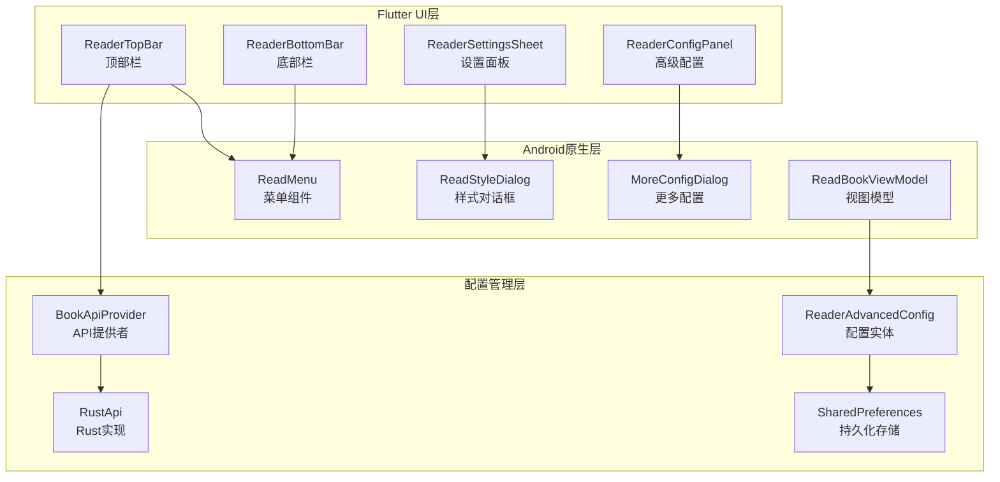
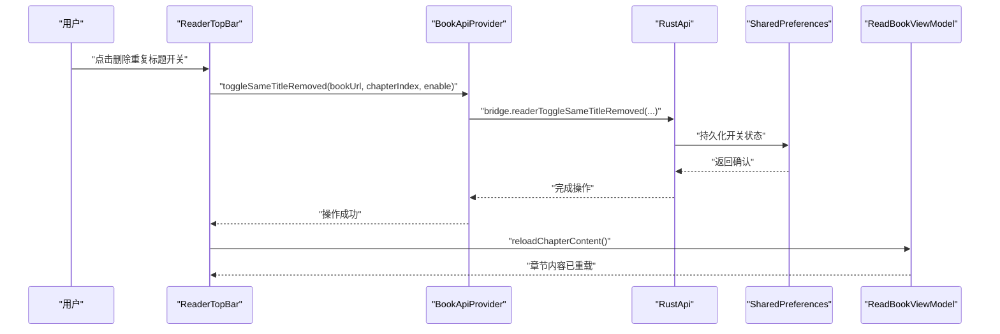
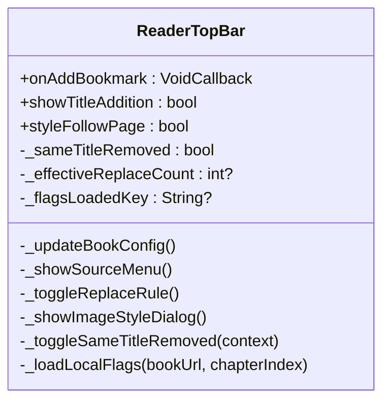
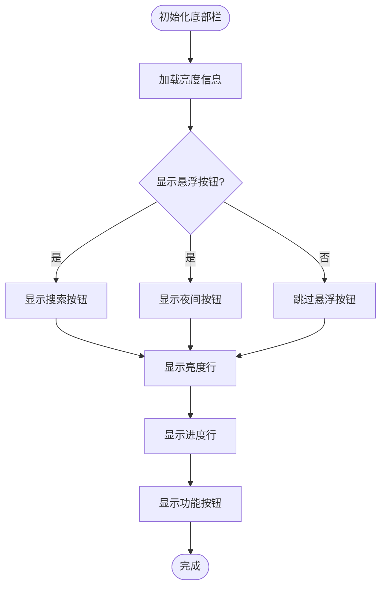
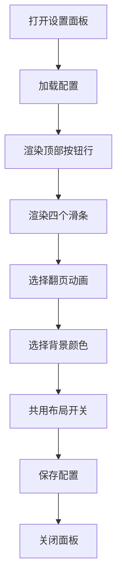
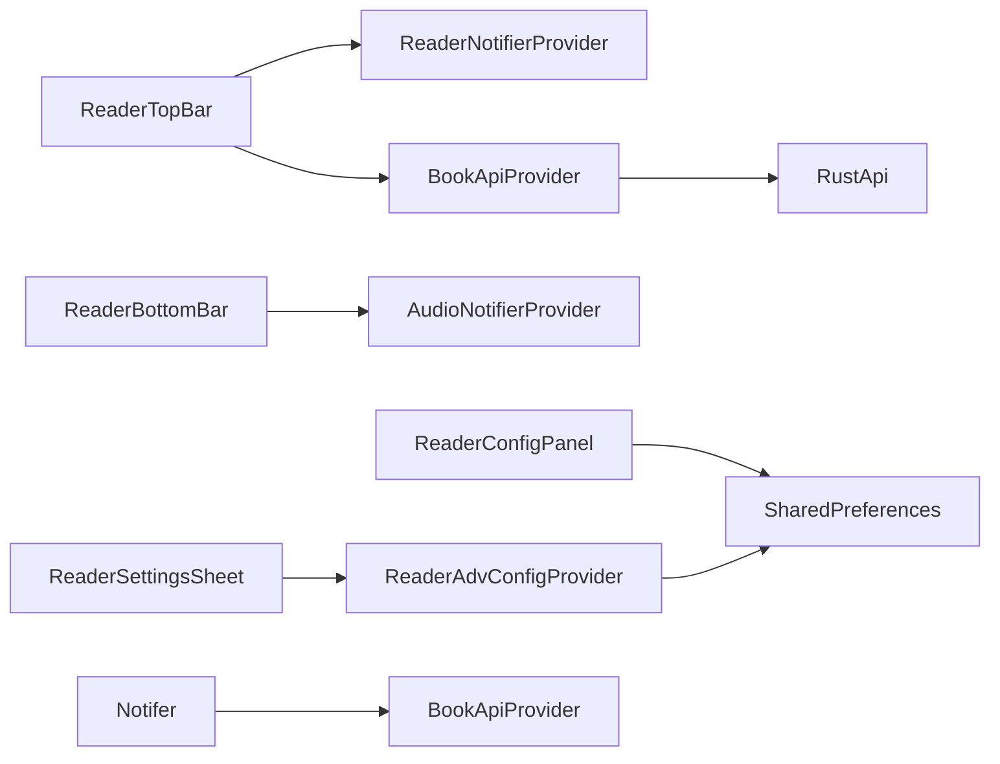

# 阅读器顶部栏增强

<cite>
**本文引用的文件**   
- [reader_top_bar.dart](file://flutter_legado/lib/src/widgets/reader/reader_top_bar.dart)
- [reader_bottom_bar.dart](file://flutter_legado/lib/src/widgets/reader/reader_bottom_bar.dart)
- [reader_settings_sheet.dart](file://flutter_legado/lib/src/widgets/reader/reader_settings_sheet.dart)
- [reader_config_panel.dart](file://flutter_legado/lib/src/screens/reader_config_panel.dart)
- [ReadMenu.kt](file://app/src/main/java/io/legado/app/ui/book/read/ReadMenu.kt)
- [ReadStyleDialog.kt](file://app/src/main/java/io/legado/app/ui/book/read/config/ReadStyleDialog.kt)
- [MoreConfigDialog.kt](file://app/src/main/java/io/legado/app/ui/book/read/config/MoreConfigDialog.kt)
- [ReadBookActivity.kt](file://app/src/main/java/io/legado/app/ui/book/read/ReadBookActivity.kt)
- [ReadBookViewModel.kt](file://app/src/main/java/io/legado/app/ui/book/read/ReadBookViewModel.kt)
- [book_api.dart](file://flutter_legado/lib/src/services/book_api.dart)
- [rust_api.dart](file://flutter_legado/lib/src/services/rust_api.dart)
- [mock_book_api.dart](file://flutter_legado/lib/src/services/mock_book_api.dart)
- [API_CONTRACT.md](file://docs/API_CONTRACT.md)
</cite>

## 更新摘要
**所做更改**   
- 新增章节级别重复标题删除切换功能，与原始应用的reverseRemoveSameTitle行为保持一致
- 实现章级opt-out机制，支持每个章节独立控制是否去除重复标题
- 添加持久化状态存储，确保开关状态在应用重启后保持
- 完善Flutter端与Android原版的对齐实现，包括FFI接口调用和状态同步
- 增强溢出菜单中的删除重复标题选项，提供直观的开关界面

## 目录
1. [简介](#简介)
2. [项目结构](#项目结构)
3. [核心组件](#核心组件)
4. [架构总览](#架构总览)
5. [详细组件分析](#详细组件分析)
6. [Android与Flutter对齐实现](#android与flutter对齐实现)
7. [顶部栏增强功能](#顶部栏增强功能)
8. [底部栏重新设计](#底部栏重新设计)
9. [设置面板增强](#设置面板增强)
10. [依赖关系分析](#依赖关系分析)
11. [性能考虑](#性能考虑)
12. [故障排查指南](#故障排查指南)
13. [结论](#结论)
14. [附录](#附录)

## 简介
本文件聚焦于"阅读器顶部栏增强"功能的代码级文档，围绕Flutter端阅读器界面与Android原版的对齐实现进行系统化说明。内容涵盖顶部栏、底部栏和设置面板的重构设计，以及与Android ReadMenu、ReadStyleDialog和MoreConfig对话框的功能对齐。通过清晰的组件分层与模板化设计，实现了灵活、可扩展的阅读界面功能。

**更新** 新增了章节级别的重复标题删除切换功能，与原始应用的reverseRemoveSameTitle行为保持一致，支持持久化状态存储，为读者提供了更精细的章节内容控制能力。

## 项目结构
与"阅读器顶部栏增强"直接相关的代码主要分布在以下模块与路径：
- Flutter UI层：顶部栏、底部栏、设置面板组件
- Android原生层：ReadMenu、ReadStyleDialog、MoreConfigDialog
- 配置管理：ReaderAdvancedConfig、偏好设置持久化
- 状态管理：Riverpod Provider状态管理
- FFI接口：BookApiProvider、RustApi实现跨平台通信

图表来源 
- [reader_top_bar.dart:30-50](file://flutter_legado/lib/src/widgets/reader/reader_top_bar.dart#L30-L50)
- [reader_bottom_bar.dart:21-61](file://flutter_legado/lib/src/widgets/reader/reader_bottom_bar.dart#L21-L61)
- [reader_settings_sheet.dart:24-48](file://flutter_legado/lib/src/widgets/reader/reader_settings_sheet.dart#L24-L48)
- [reader_config_panel.dart:452-499](file://flutter_legado/lib/src/screens/reader_config_panel.dart#L452-L499)
- [ReadMenu.kt:66-174](file://app/src/main/java/io/legado/app/ui/book/read/ReadMenu.kt#L66-L174)
- [ReadBookViewModel.kt:535-544](file://app/src/main/java/io/legado/app/ui/book/read/ReadBookViewModel.kt#L535-L544)
- [book_api.dart:428-432](file://flutter_legado/lib/src/services/book_api.dart#L428-L432)
- [rust_api.dart:951-960](file://flutter_legado/lib/src/services/rust_api.dart#L951-L960)

章节来源
- [reader_top_bar.dart:1-1289](file://flutter_legado/lib/src/widgets/reader/reader_top_bar.dart#L1-L1289)
- [reader_bottom_bar.dart:1-366](file://flutter_legado/lib/src/widgets/reader/reader_bottom_bar.dart#L1-L366)
- [reader_settings_sheet.dart:1-600](file://flutter_legado/lib/src/widgets/reader/reader_settings_sheet.dart#L1-L600)
- [reader_config_panel.dart:1-1595](file://flutter_legado/lib/src/screens/reader_config_panel.dart#L1-L1595)
- [ReadMenu.kt:1-705](file://app/src/main/java/io/legado/app/ui/book/read/ReadMenu.kt#L1-L705)
- [ReadBookViewModel.kt:1-620](file://app/src/main/java/io/legado/app/ui/book/read/ReadBookViewModel.kt#L1-L620)
- [book_api.dart:1-1066](file://flutter_legado/lib/src/services/book_api.dart#L1-L1066)
- [rust_api.dart:1-2370](file://flutter_legado/lib/src/services/rust_api.dart#L1-L2370)

## 核心组件
- ReaderTopBar：Flutter端顶部栏组件，对齐Android ReadMenu的标题栏和菜单功能，新增重复标题删除切换
- ReaderBottomBar：Flutter端底部栏组件，提供悬浮按钮、亮度控制和导航功能
- ReaderSettingsSheet：Flutter端设置面板，对齐Android ReadStyleDialog的样式配置
- ReaderConfigPanel：Flutter端高级配置面板，对齐Android MoreConfigDialog的更多设置
- ReaderAdvancedConfig：配置实体类，管理所有阅读器相关配置项
- BookApiProvider：API提供者接口，定义toggleSameTitleRemoved等阅读操作
- RustApi：Rust侧实现，通过FFI调用底层功能
- ReadBookViewModel：Android端视图模型，处理重复标题删除的业务逻辑

章节来源
- [reader_top_bar.dart:30-50](file://flutter_legado/lib/src/widgets/reader/reader_top_bar.dart#L30-L50)
- [reader_bottom_bar.dart:21-61](file://flutter_legado/lib/src/widgets/reader/reader_bottom_bar.dart#L21-L61)
- [reader_settings_sheet.dart:24-48](file://flutter_legado/lib/src/widgets/reader/reader_settings_sheet.dart#L24-L48)
- [reader_config_panel.dart:452-499](file://flutter_legado/lib/src/screens/reader_config_panel.dart#L452-L499)
- [book_api.dart:428-432](file://flutter_legado/lib/src/services/book_api.dart#L428-L432)
- [rust_api.dart:951-960](file://flutter_legado/lib/src/services/rust_api.dart#L951-L960)
- [ReadBookViewModel.kt:535-544](file://app/src/main/java/io/legado/app/ui/book/read/ReadBookViewModel.kt#L535-L544)

## 架构总览
顶部栏增强的整体流程如下：
- 用户交互：通过点击屏幕或手势触发工具栏显示
- 配置管理：ReaderAdvancedConfig统一管理所有配置项
- 状态同步：通过Riverpod Provider实现跨组件状态共享
- 平台对齐：Flutter端组件严格对齐Android原版的UI和行为
- 持久化存储：使用SharedPreferences保存用户配置
- FFI通信：通过BookApiProvider和RustApi实现跨平台功能调用

图表来源 
- [reader_top_bar.dart:738-766](file://flutter_legado/lib/src/widgets/reader/reader_top_bar.dart#L738-L766)
- [book_api.dart:428-432](file://flutter_legado/lib/src/services/book_api.dart#L428-L432)
- [rust_api.dart:951-960](file://flutter_legado/lib/src/services/rust_api.dart#L951-L960)
- [ReadBookViewModel.kt:535-544](file://app/src/main/java/io/legado/app/ui/book/read/ReadBookViewModel.kt#L535-L544)

## 详细组件分析

### ReaderTopBar（顶部栏组件）
- 职责：实现与Android ReadMenu对齐的顶部栏功能，包括标题显示、源操作菜单、溢出菜单等
- 关键特性：
  - 标题附加区：显示章节名、URL和书源徽章
  - 源操作菜单：登录源、章节购买、编辑源、禁用源
  - 溢出菜单：替换规则、重新分段、图片样式等
  - 沉浸式样式：支持跟随阅读页背景色
  - **新增**：重复标题删除切换开关，支持章级opt-out机制

图表来源 
- [reader_top_bar.dart:30-50](file://flutter_legado/lib/src/widgets/reader/reader_top_bar.dart#L30-L50)
- [reader_top_bar.dart:60-95](file://flutter_legado/lib/src/widgets/reader/reader_top_bar.dart#L60-L95)
- [reader_top_bar.dart:738-766](file://flutter_legado/lib/src/widgets/reader/reader_top_bar.dart#L738-L766)

章节来源
- [reader_top_bar.dart:30-50](file://flutter_legado/lib/src/widgets/reader/reader_top_bar.dart#L30-L50)
- [reader_top_bar.dart:60-95](file://flutter_legado/lib/src/widgets/reader/reader_top_bar.dart#L60-L95)
- [reader_top_bar.dart:738-766](file://flutter_legado/lib/src/widgets/reader/reader_top_bar.dart#L738-L766)
- [reader_top_bar.dart:1140-1148](file://flutter_legado/lib/src/widgets/reader/reader_top_bar.dart#L1140-L1148)

### ReaderBottomBar（底部栏组件）
- 职责：实现悬浮按钮行、亮度控制和进度导航功能
- 关键特性：
  - 悬浮按钮行：全文搜索和夜间模式切换
  - 亮度控制：自动亮度和手动亮度调节
  - 进度导航：上一章、进度条、下一章
  - 功能按钮：目录、朗读、界面设置、更多设置

图表来源 
- [reader_bottom_bar.dart:74-91](file://flutter_legado/lib/src/widgets/reader/reader_bottom_bar.dart#L74-L91)
- [reader_bottom_bar.dart:131-167](file://flutter_legado/lib/src/widgets/reader/reader_bottom_bar.dart#L131-L167)
- [reader_bottom_bar.dart:197-317](file://flutter_legado/lib/src/widgets/reader/reader_bottom_bar.dart#L197-L317)

章节来源
- [reader_bottom_bar.dart:74-91](file://flutter_legado/lib/src/widgets/reader/reader_bottom_bar.dart#L74-L91)
- [reader_bottom_bar.dart:131-167](file://flutter_legado/lib/src/widgets/reader/reader_bottom_bar.dart#L131-L167)
- [reader_bottom_bar.dart:197-317](file://flutter_legado/lib/src/widgets/reader/reader_bottom_bar.dart#L197-L317)

### ReaderSettingsSheet（设置面板）
- 职责：提供样式配置界面，对齐Android ReadStyleDialog
- 关键特性：
  - 顶部按钮行：字重、字体、缩进、简繁转换、边距、信息
  - 四滑条：字号、字距、行距、段距
  - 翻页动画：覆盖、滑动、仿真、滚动、无动画
  - 背景色预设：多种预设颜色 + 自定义配色

图表来源 
- [reader_settings_sheet.dart:106-271](file://flutter_legado/lib/src/widgets/reader/reader_settings_sheet.dart#L106-L271)
- [reader_settings_sheet.dart:275-335](file://flutter_legado/lib/src/widgets/reader/reader_settings_sheet.dart#L275-L335)
- [reader_settings_sheet.dart:430-465](file://flutter_legado/lib/src/widgets/reader/reader_settings_sheet.dart#L430-L465)

章节来源
- [reader_settings_sheet.dart:106-271](file://flutter_legado/lib/src/widgets/reader/reader_settings_sheet.dart#L106-L271)
- [reader_settings_sheet.dart:275-335](file://flutter_legado/lib/src/widgets/reader/reader_settings_sheet.dart#L275-L335)
- [reader_settings_sheet.dart:430-465](file://flutter_legado/lib/src/widgets/reader/reader_settings_sheet.dart#L430-L465)

### ReaderConfigPanel（高级配置面板）
- 职责：提供详细的阅读器配置选项，对齐Android MoreConfigDialog
- 关键特性：
  - 自动翻页：开关、间隔、方向设置
  - 点击区域映射：左中右区域的点击行为
  - 段落间距：可视化调节
  - 字体排版：字体选择、字距、缩进等
  - 页面边距：上下左右边距设置
  - 更多配置：系统级阅读设置

章节来源
- [reader_config_panel.dart:452-499](file://flutter_legado/lib/src/screens/reader_config_panel.dart#L452-L499)
- [reader_config_panel.dart:548-606](file://flutter_legado/lib/src/screens/reader_config_panel.dart#L548-L606)
- [reader_config_panel.dart:622-800](file://flutter_legado/lib/src/screens/reader_config_panel.dart#L622-L800)

## Android与Flutter对齐实现

### 顶部栏对齐
Flutter端的ReaderTopBar严格对齐Android ReadMenu的布局和交互：
- 标题附加区显示章节名、URL和书源徽章
- 源操作菜单包含登录源、章节购买、编辑源、禁用源
- 溢出菜单顺序和条件显隐逐项对齐
- 夜间/搜索按钮迁至底栏悬浮按钮行
- **新增**：重复标题删除切换开关，与原版menu_same_title_removed完全对齐

### 底部栏对齐
Flutter端的ReaderBottomBar对齐Android ReadMenu的底部栏：
- 悬浮按钮行包含搜索和夜间模式
- 亮度行支持自动亮度和手动调节
- 进度导航包含上一章、进度条、下一章
- 功能按钮包含目录、朗读、界面设置、更多设置

### 设置面板对齐
Flutter端的ReaderSettingsSheet和ReaderConfigPanel对齐Android对话框：
- ReaderSettingsSheet对齐ReadStyleDialog的样式配置
- ReaderConfigPanel对齐MoreConfigDialog的更多设置
- 配置项键名与Android原版保持一致
- 持久化存储使用相同的SharedPreferences键

### 重复标题删除功能对齐
**新增**：Flutter端实现了与Android原版完全一致的重复标题删除功能：
- 通过BookApiProvider.toggleSameTitleRemoved方法调用FFI接口
- 使用SharedPreferences进行本地状态持久化
- 支持章级opt-out机制，每个章节可独立控制
- 切换后立即重载章节内容，确保状态实时生效

章节来源
- [reader_top_bar.dart:21-30](file://flutter_legado/lib/src/widgets/reader/reader_top_bar.dart#L21-L30)
- [reader_bottom_bar.dart:14-20](file://flutter_legado/lib/src/widgets/reader/reader_bottom_bar.dart#L14-L20)
- [reader_settings_sheet.dart:16-23](file://flutter_legado/lib/src/widgets/reader/reader_settings_sheet.dart#L16-L23)
- [reader_config_panel.dart:91-128](file://flutter_legado/lib/src/screens/reader_config_panel.dart#L91-L128)
- [reader_top_bar.dart:738-766](file://flutter_legado/lib/src/widgets/reader/reader_top_bar.dart#L738-L766)
- [ReadMenu.kt:107-125](file://app/src/main/java/io/legado/app/ui/book/read/ReadMenu.kt#L107-L125)
- [ReadBookViewModel.kt:535-544](file://app/src/main/java/io/legado/app/ui/book/read/ReadBookViewModel.kt#L535-L544)

## 顶部栏增强功能

### 源操作菜单
新增的源操作菜单功能从底栏迁移至顶栏源名称徽章：
- 登录源：跳转到源登录页面
- 章节购买：执行章节购买动作
- 编辑源：跳转到源编辑页面
- 禁用源：禁用当前书源

### 标题附加区
标题附加区显示丰富的书籍信息：
- 章节名：当前阅读的章节标题
- 章节URL：点击可复制章节链接
- 书源徽章：显示书源名称，点击弹出源操作菜单

### 溢出菜单
溢出菜单提供丰富的阅读辅助功能：
- **新增**：删除重复标题开关，支持章级opt-out机制
- 替换规则：开启/关闭文本替换规则
- 重新分段：重新处理章节分段
- 图片样式：选择图片显示方式
- 更新目录：刷新书籍目录
- 模拟追读：模拟追更体验
- 编辑内容：编辑当前章节内容
- 反转内容：反转正文内容

### 重复标题删除切换功能
**新增**：实现了完整的重复标题删除切换功能：
- 章级控制：每个章节可独立控制是否去除重复标题
- 全局默认：默认值为true（去除重复标题），与原版一致
- 持久化存储：使用SharedPreferences保存开关状态
- 即时生效：切换后立即重载章节内容
- 状态同步：换书/换章时重新加载本地状态

章节来源
- [reader_top_bar.dart:571-643](file://flutter_legado/lib/src/widgets/reader/reader_top_bar.dart#L571-L643)
- [reader_top_bar.dart:695-774](file://flutter_legado/lib/src/widgets/reader/reader_top_bar.dart#L695-L774)
- [reader_top_bar.dart:116-196](file://flutter_legado/lib/src/widgets/reader/reader_top_bar.dart#L116-L196)
- [reader_top_bar.dart:738-766](file://flutter_legado/lib/src/widgets/reader/reader_top_bar.dart#L738-L766)
- [reader_top_bar.dart:1140-1148](file://flutter_legado/lib/src/widgets/reader/reader_top_bar.dart#L1140-L1148)

## 底部栏重新设计

### 悬浮按钮行
悬浮按钮行提供快速访问功能：
- 全文搜索：打开全文搜索功能
- 夜间模式：切换日间/夜间主题

### 亮度控制
亮度控制行支持灵活的亮度调节：
- 自动亮度：自动检测并调节屏幕亮度
- 手动亮度：通过滑块手动调节亮度
- 平台适配：在不可用的平台上自动隐藏

### 进度导航
进度导航提供精确的章节定位：
- 上一章：跳转到前一章节
- 进度条：支持页面模式和章节模式
- 下一章：跳转到下一章节

### 功能按钮
功能按钮提供主要的阅读控制：
- 目录：打开书籍目录
- 朗读：启动/停止朗读功能
- 界面设置：打开样式设置面板
- 更多设置：打开高级配置面板

章节来源
- [reader_bottom_bar.dart:131-167](file://flutter_legado/lib/src/widgets/reader/reader_bottom_bar.dart#L131-L167)
- [reader_bottom_bar.dart:197-228](file://flutter_legado/lib/src/widgets/reader/reader_bottom_bar.dart#L197-L228)
- [reader_bottom_bar.dart:232-277](file://flutter_legado/lib/src/widgets/reader/reader_bottom_bar.dart#L232-L277)
- [reader_bottom_bar.dart:279-317](file://flutter_legado/lib/src/widgets/reader/reader_bottom_bar.dart#L279-L317)

## 设置面板增强

### 样式配置
ReaderSettingsSheet提供完整的样式配置：
- 字重调节：中/粗/细三态循环
- 字体选择：跳转到字体管理页面
- 缩进设置：0-3字符档位选择
- 简繁转换：不转换/繁→简/简→繁
- 边距设置：打开页面边距配置
- 信息设置：打开状态栏提示配置

### 滑条调节
四个滑条提供精细的排版控制：
- 字号：12-32范围连续调节
- 字距：-0.5~1.0em范围调节
- 行距：1.0-3.0范围连续调节
- 段距：0-2.0范围调节

### 翻页动画
五种翻页动画模式：
- 覆盖模式：页面覆盖效果
- 滑动模式：页面滑动效果
- 仿真模式：仿真翻页效果
- 滚动模式：滚动翻页效果
- 无动画：直接切换页面

### 背景色配置
丰富的背景色选择：
- 预设颜色：16种预设颜色
- 自定义配色：长按圆圈进入自定义配色
- 文字颜色：支持自动跟随背景
- 背景颜色：独立设置背景色

章节来源
- [reader_settings_sheet.dart:126-177](file://flutter_legado/lib/src/widgets/reader/reader_settings_sheet.dart#L126-L177)
- [reader_settings_sheet.dart:179-249](file://flutter_legado/lib/src/widgets/reader/reader_settings_sheet.dart#L179-L249)
- [reader_settings_sheet.dart:469-544](file://flutter_legado/lib/src/widgets/reader/reader_settings_sheet.dart#L469-L544)

## 依赖关系分析
组件间的依赖关系如下：
- ReaderTopBar依赖ReaderNotifierProvider获取阅读状态
- ReaderBottomBar依赖AudioNotifierProvider处理朗读功能
- ReaderSettingsSheet依赖ReaderAdvConfigProvider管理样式配置
- ReaderConfigPanel依赖SharedPreferences进行配置持久化
- **新增**：ReaderTopBar通过BookApiProvider调用RustApi实现重复标题删除功能
- 所有组件都依赖于Android框架的基础服务

图表来源 
- [reader_top_bar.dart:102-114](file://flutter_legado/lib/src/widgets/reader/reader_top_bar.dart#L102-L114)
- [reader_bottom_bar.dart:103-108](file://flutter_legado/lib/src/widgets/reader/reader_bottom_bar.dart#L103-L108)
- [reader_settings_sheet.dart:82-103](file://flutter_legado/lib/src/widgets/reader/reader_settings_sheet.dart#L82-L103)
- [reader_config_panel.dart:211-364](file://flutter_legado/lib/src/screens/reader_config_panel.dart#L211-L364)
- [reader_top_bar.dart:745-747](file://flutter_legado/lib/src/widgets/reader/reader_top_bar.dart#L745-L747)
- [book_api.dart:428-432](file://flutter_legado/lib/src/services/book_api.dart#L428-L432)
- [rust_api.dart:951-960](file://flutter_legado/lib/src/services/rust_api.dart#L951-L960)

章节来源
- [reader_top_bar.dart:102-114](file://flutter_legado/lib/src/widgets/reader/reader_top_bar.dart#L102-L114)
- [reader_bottom_bar.dart:103-108](file://flutter_legado/lib/src/widgets/reader/reader_bottom_bar.dart#L103-L108)
- [reader_settings_sheet.dart:82-103](file://flutter_legado/lib/src/widgets/reader/reader_settings_sheet.dart#L82-L103)
- [reader_config_panel.dart:211-364](file://flutter_legado/lib/src/screens/reader_config_panel.dart#L211-L364)
- [reader_top_bar.dart:745-747](file://flutter_legado/lib/src/widgets/reader/reader_top_bar.dart#L745-L747)

## 性能考虑
- 配置懒加载：ReaderAdvancedConfig采用异步加载避免阻塞主线程
- 增量更新：仅更新变化的配置项，减少不必要的重绘
- 内存优化：及时释放不再使用的中间对象，避免内存泄漏
- 平台适配：在不可用的平台上优雅降级，保证应用稳定性
- 事件优化：合理使用事件总线，避免过度通信导致性能问题
- 缓存策略：对频繁读取的配置数据进行本地缓存
- **新增**：重复标题删除状态本地缓存，避免频繁的FFI调用

## 故障排查指南
- 顶部栏显示异常：检查ReaderTopBar的布局参数和主题配置
- 底部栏功能失效：验证ReaderBottomBar的事件绑定是否正确
- 设置面板无法打开：确认ReaderSettingsSheet的调用路径
- 配置不生效：检查ReaderAdvancedConfig的持久化逻辑
- 亮度控制失败：验证SystemBrightness平台的可用性
- 源操作菜单错误：检查BookApiProvider的连接状态
- 样式配置丢失：确认SharedPreferences的读写权限
- **新增**：重复标题删除功能异常：检查FFI接口调用和SharedPreferences状态

章节来源
- [reader_top_bar.dart:92-114](file://flutter_legado/lib/src/widgets/reader/reader_top_bar.dart#L92-L114)
- [reader_bottom_bar.dart:74-91](file://flutter_legado/lib/src/widgets/reader/reader_bottom_bar.dart#L74-L91)
- [reader_settings_sheet.dart:82-103](file://flutter_legado/lib/src/widgets/reader/reader_settings_sheet.dart#L82-L103)
- [reader_config_panel.dart:211-364](file://flutter_legado/lib/src/screens/reader_config_panel.dart#L211-L364)
- [reader_top_bar.dart:738-766](file://flutter_legado/lib/src/widgets/reader/reader_top_bar.dart#L738-L766)

## 结论
"阅读器顶部栏增强"通过Flutter端与Android原版的全面对齐，实现了统一且高质量的阅读体验。顶部栏、底部栏和设置面板的重构设计严格遵循Android原版的行为和布局，同时充分利用Flutter的优势提供了流畅的用户界面。新增的源操作菜单、沉浸式样式、进度条行为模式以及**章节级别重复标题删除切换功能**进一步提升了用户体验。通过清晰的组件分层和配置管理，该实现为后续的功能扩展奠定了坚实的基础。

**新增功能亮点**：章节级别重复标题删除切换功能实现了与原始应用reverseRemoveSameTitle行为的完全对齐，支持章级opt-out机制和持久化状态存储，为读者提供了更精细的内容控制能力。

## 附录
- 术语表：
  - 顶部栏：阅读器界面的顶部工具栏，显示标题和操作按钮
  - 底部栏：阅读器界面的底部控制栏，提供导航和设置功能
  - 悬浮按钮：浮动在界面上的快捷操作按钮
  - 沉浸式模式：隐藏系统状态栏和导航栏的全屏显示模式
  - 进度条行为：控制进度条交互方式的配置选项
  - 源操作：与书源相关的操作，如登录、编辑、禁用等
  - **新增**：重复标题删除：移除章节中重复出现的标题文本
  - **新增**：章级opt-out：针对特定章节的个性化配置覆盖
- 参考实现：
  - 顶部栏实现：[reader_top_bar.dart](file://flutter_legado/lib/src/widgets/reader/reader_top_bar.dart)
  - 底部栏实现：[reader_bottom_bar.dart](file://flutter_legado/lib/src/widgets/reader/reader_bottom_bar.dart)
  - 设置面板实现：[reader_settings_sheet.dart](file://flutter_legado/lib/src/widgets/reader/reader_settings_sheet.dart)
  - 高级配置实现：[reader_config_panel.dart](file://flutter_legado/lib/src/screens/reader_config_panel.dart)
  - Android原型：[ReadMenu.kt](file://app/src/main/java/io/legado/app/ui/book/read/ReadMenu.kt)
  - 样式对话框：[ReadStyleDialog.kt](file://app/src/main/java/io/legado/app/ui/book/read/config/ReadStyleDialog.kt)
  - 更多配置：[MoreConfigDialog.kt](file://app/src/main/java/io/legado/app/ui/book/read/config/MoreConfigDialog.kt)
  - **新增**：重复标题删除实现：[ReadBookViewModel.kt](file://app/src/main/java/io/legado/app/ui/book/read/ReadBookViewModel.kt)
  - **新增**：FFI接口定义：[book_api.dart](file://flutter_legado/lib/src/services/book_api.dart)
  - **新增**：Rust实现：[rust_api.dart](file://flutter_legado/lib/src/services/rust_api.dart)
  - **新增**：API契约：[API_CONTRACT.md](file://docs/API_CONTRACT.md)