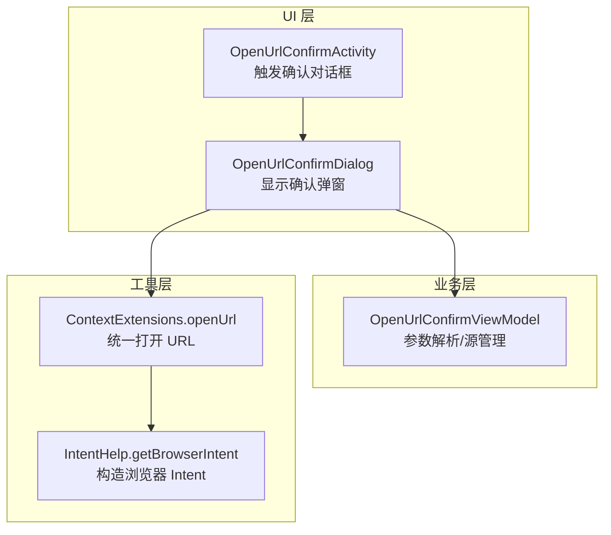
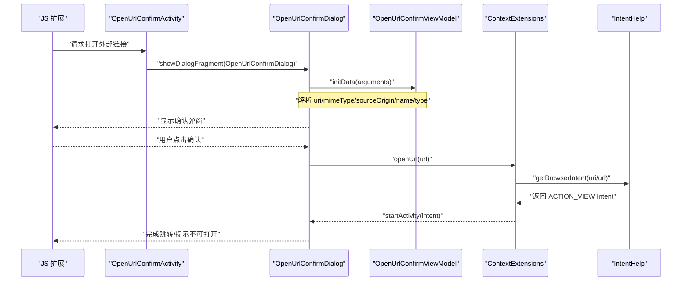
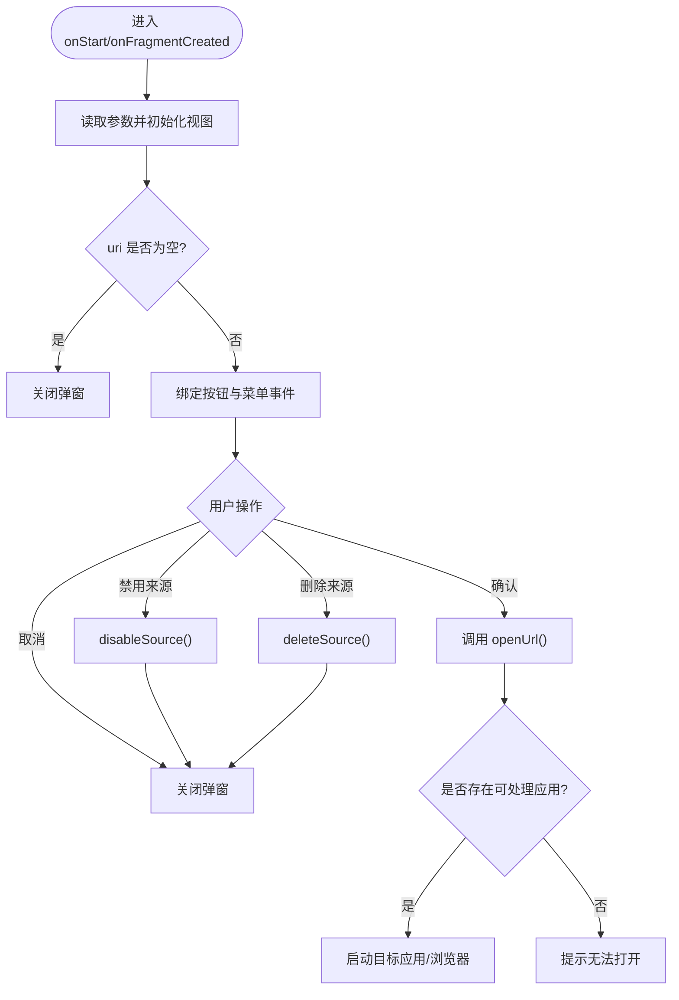
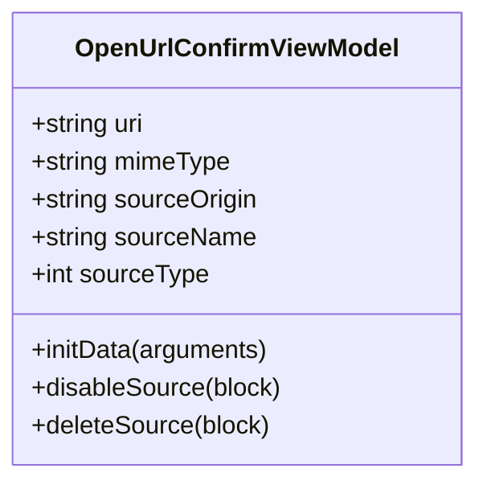
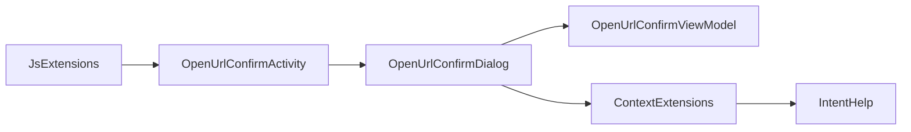

# 外部链接安全确认对话框

<cite>
**本文引用的文件**   
- [OpenUrlConfirmDialog.kt](file://app/src/main/java/io/legado/app/ui/association/OpenUrlConfirmDialog.kt)
- [OpenUrlConfirmViewModel.kt](file://app/src/main/java/io/legado/app/ui/association/OpenUrlConfirmViewModel.kt)
- [ContextExtensions.kt](file://app/src/main/java/io/legado/app/utils/ContextExtensions.kt)
- [IntentHelp.kt](file://app/src/main/java/io/legado/app/help/IntentHelp.kt)
- [JsExtensions.kt](file://app/src/main/java/io/legado/app/help/JsExtensions.kt)
- [OpenUrlConfirmActivity.kt](file://app/src/main/java/io/legado/app/ui/association/OpenUrlConfirmActivity.kt)
</cite>

## 目录
1. [简介](#简介)
2. [项目结构](#项目结构)
3. [核心组件](#核心组件)
4. [架构总览](#架构总览)
5. [详细组件分析](#详细组件分析)
6. [依赖关系分析](#依赖关系分析)
7. [性能与安全考量](#性能与安全考量)
8. [故障排查指南](#故障排查指南)
9. [结论](#结论)
10. [附录](#附录)

## 简介
本文件聚焦于“外部链接安全确认对话框”的实现与使用，涵盖从触发入口、用户确认、到最终跳转的完整流程。该功能在应用内发起外部链接或协议跳转前，通过弹窗向用户明确展示目标来源信息并征得同意，从而降低误点风险与潜在的安全隐患。

## 项目结构
围绕该功能的代码主要分布在以下位置：
- UI 层：确认对话框与活动（Fragment/Activity）
- 数据与业务层：ViewModel 负责参数解析与源管理操作
- 工具层：URL 打开与 Intent 构造的统一封装

**图表来源** 
- [OpenUrlConfirmActivity.kt:1-40](file://app/src/main/java/io/legado/app/ui/association/OpenUrlConfirmActivity.kt#L1-L40)
- [OpenUrlConfirmDialog.kt:1-133](file://app/src/main/java/io/legado/app/ui/association/OpenUrlConfirmDialog.kt#L1-L133)
- [OpenUrlConfirmViewModel.kt:1-43](file://app/src/main/java/io/legado/app/ui/association/OpenUrlConfirmViewModel.kt#L1-L43)
- [ContextExtensions.kt:370-439](file://app/src/main/java/io/legado/app/utils/ContextExtensions.kt#L370-L439)
- [IntentHelp.kt:1-50](file://app/src/main/java/io/legado/app/help/IntentHelp.kt#L1-L50)

**章节来源**
- [OpenUrlConfirmDialog.kt:1-133](file://app/src/main/java/io/legado/app/ui/association/OpenUrlConfirmDialog.kt#L1-L133)
- [OpenUrlConfirmViewModel.kt:1-43](file://app/src/main/java/io/legado/app/ui/association/OpenUrlConfirmViewModel.kt#L1-L43)
- [ContextExtensions.kt:370-439](file://app/src/main/java/io/legado/app/utils/ContextExtensions.kt#L370-L439)
- [IntentHelp.kt:1-50](file://app/src/main/java/io/legado/app/help/IntentHelp.kt#L1-L50)

## 核心组件
- OpenUrlConfirmDialog：确认弹窗，负责展示来源信息、用户交互以及执行跳转或禁用/删除来源等操作。
- OpenUrlConfirmViewModel：承载弹窗所需的数据（URI、MIME、来源名称/地址/类型），并提供禁用或删除来源的业务方法。
- ContextExtensions.openUrl：统一的 URL 打开入口，内部委托给 IntentHelp 构造合适的 Intent。
- IntentHelp.getBrowserIntent：根据 URI/URL 构造 ACTION_VIEW 的 Intent，并在无默认处理时回退为选择器。
- JsExtensions.openUrl：JS 扩展接口，供脚本侧调用以打开外部链接（可走确认流程或直接打开）。

**章节来源**
- [OpenUrlConfirmDialog.kt:23-133](file://app/src/main/java/io/legado/app/ui/association/OpenUrlConfirmDialog.kt#L23-L133)
- [OpenUrlConfirmViewModel.kt:10-43](file://app/src/main/java/io/legado/app/ui/association/OpenUrlConfirmViewModel.kt#L10-L43)
- [ContextExtensions.kt:371-387](file://app/src/main/java/io/legado/app/utils/ContextExtensions.kt#L371-L387)
- [IntentHelp.kt:13-25](file://app/src/main/java/io/legado/app/help/IntentHelp.kt#L13-L25)
- [JsExtensions.kt:1189-1199](file://app/src/main/java/io/legado/app/help/JsExtensions.kt#L1189-L1199)

## 架构总览
下图展示了从 JS 扩展触发到用户确认并最终打开外部链接的时序。

**图表来源** 
- [JsExtensions.kt:1189-1199](file://app/src/main/java/io/legado/app/help/JsExtensions.kt#L1189-L1199)
- [OpenUrlConfirmActivity.kt:1-40](file://app/src/main/java/io/legado/app/ui/association/OpenUrlConfirmActivity.kt#L1-L40)
- [OpenUrlConfirmDialog.kt:50-102](file://app/src/main/java/io/legado/app/ui/association/OpenUrlConfirmDialog.kt#L50-L102)
- [OpenUrlConfirmViewModel.kt:18-24](file://app/src/main/java/io/legado/app/ui/association/OpenUrlConfirmViewModel.kt#L18-L24)
- [ContextExtensions.kt:371-387](file://app/src/main/java/io/legado/app/utils/ContextExtensions.kt#L371-L387)
- [IntentHelp.kt:17-25](file://app/src/main/java/io/legado/app/help/IntentHelp.kt#L17-L25)

## 详细组件分析

### OpenUrlConfirmDialog（确认对话框）
- 职责
  - 接收并展示来源信息（名称、地址、类型等）
  - 提供“取消”和“确认”按钮
  - 确认后通过统一入口打开外部链接
  - 支持菜单项：禁用来源、删除来源（二次确认）
- 关键流程
  - 初始化：读取参数、设置标题/副标题、绑定事件
  - 打开链接：构建 ACTION_VIEW Intent，校验是否有可处理的应用，失败则提示
  - 菜单操作：调用 ViewModel 的禁用/删除方法，成功后关闭弹窗

**图表来源** 
- [OpenUrlConfirmDialog.kt:45-102](file://app/src/main/java/io/legado/app/ui/association/OpenUrlConfirmDialog.kt#L45-L102)
- [OpenUrlConfirmDialog.kt:104-125](file://app/src/main/java/io/legado/app/ui/association/OpenUrlConfirmDialog.kt#L104-L125)

**章节来源**
- [OpenUrlConfirmDialog.kt:23-133](file://app/src/main/java/io/legado/app/ui/association/OpenUrlConfirmDialog.kt#L23-L133)

### OpenUrlConfirmViewModel（数据与源管理）
- 职责
  - 保存弹窗所需的上下文数据（URI、MIME、来源名/地址/类型）
  - 提供禁用与删除来源的方法，调用 SourceHelp 完成持久化操作
- 关键点
  - initData 负责从 Bundle 中解析参数
  - disableSource/deleteSource 采用异步执行模式，成功回调后关闭弹窗

**图表来源** 
- [OpenUrlConfirmViewModel.kt:10-43](file://app/src/main/java/io/legado/app/ui/association/OpenUrlConfirmViewModel.kt#L10-L43)

**章节来源**
- [OpenUrlConfirmViewModel.kt:10-43](file://app/src/main/java/io/legado/app/ui/association/OpenUrlConfirmViewModel.kt#L10-L43)

### ContextExtensions.openUrl（统一打开入口）
- 职责
  - 对外暴露 openUrl(String/Uri) 方法
  - 内部委托 IntentHelp 构造 ACTION_VIEW 的 Intent
  - 捕获异常并给出友好提示
- 关键点
  - 使用 try/catch 包裹 startActivity，避免崩溃
  - 错误信息通过 toastOnUi 反馈给用户

**章节来源**
- [ContextExtensions.kt:371-387](file://app/src/main/java/io/legado/app/utils/ContextExtensions.kt#L371-L387)

### IntentHelp.getBrowserIntent（Intent 构造）
- 职责
  - 将 URL/Uri 转换为 ACTION_VIEW 的 Intent
  - 若无默认处理应用，返回 createChooser 以便用户选择
- 关键点
  - 添加 FLAG_ACTIVITY_NEW_TASK
  - resolveActivity 为空时回退为选择器

**章节来源**
- [IntentHelp.kt:13-25](file://app/src/main/java/io/legado/app/help/IntentHelp.kt#L13-L25)

### JsExtensions.openUrl（JS 扩展）
- 职责
  - 暴露 openUrl(url, mimeType?) 给 JS 调用
  - 用于在脚本逻辑中打开外部链接
- 关键点
  - 对超长 URL 进行长度限制校验
  - 可结合上层确认流程或直接打开（由调用方决定）

**章节来源**
- [JsExtensions.kt:1189-1199](file://app/src/main/java/io/legado/app/help/JsExtensions.kt#L1189-L1199)

### OpenUrlConfirmActivity（触发入口）
- 职责
  - 作为入口 Activity，负责弹出 OpenUrlConfirmDialog
- 关键点
  - 将来源信息（origin/name/type）与目标 URI/MIME 一并传入对话框

**章节来源**
- [OpenUrlConfirmActivity.kt:1-40](file://app/src/main/java/io/legado/app/ui/association/OpenUrlConfirmActivity.kt#L1-L40)

## 依赖关系分析
- 低耦合设计
  - Dialog 仅依赖 ViewModel 进行数据与源管理，不直接访问数据库
  - URL 打开逻辑集中在 ContextExtensions 与 IntentHelp，便于统一维护
- 可能的循环依赖
  - 当前未见循环引用；ViewModel 依赖 SourceHelp（未在本文件中展开）
- 外部依赖
  - Android 系统 Intent 机制（ACTION_VIEW）
  - 第三方库 splitties.init.appCtx（应用上下文）

**图表来源** 
- [OpenUrlConfirmDialog.kt:1-133](file://app/src/main/java/io/legado/app/ui/association/OpenUrlConfirmDialog.kt#L1-L133)
- [OpenUrlConfirmViewModel.kt:1-43](file://app/src/main/java/io/legado/app/ui/association/OpenUrlConfirmViewModel.kt#L1-L43)
- [ContextExtensions.kt:370-439](file://app/src/main/java/io/legado/app/utils/ContextExtensions.kt#L370-L439)
- [IntentHelp.kt:1-50](file://app/src/main/java/io/legado/app/help/IntentHelp.kt#L1-L50)
- [JsExtensions.kt:1189-1199](file://app/src/main/java/io/legado/app/help/JsExtensions.kt#L1189-L1199)
- [OpenUrlConfirmActivity.kt:1-40](file://app/src/main/java/io/legado/app/ui/association/OpenUrlConfirmActivity.kt#L1-L40)

**章节来源**
- [OpenUrlConfirmDialog.kt:1-133](file://app/src/main/java/io/legado/app/ui/association/OpenUrlConfirmDialog.kt#L1-L133)
- [OpenUrlConfirmViewModel.kt:1-43](file://app/src/main/java/io/legado/app/ui/association/OpenUrlConfirmViewModel.kt#L1-L43)
- [ContextExtensions.kt:370-439](file://app/src/main/java/io/legado/app/utils/ContextExtensions.kt#L370-L439)
- [IntentHelp.kt:1-50](file://app/src/main/java/io/legado/app/help/IntentHelp.kt#L1-L50)
- [JsExtensions.kt:1189-1199](file://app/src/main/java/io/legado/app/help/JsExtensions.kt#L1189-L1199)
- [OpenUrlConfirmActivity.kt:1-40](file://app/src/main/java/io/legado/app/ui/association/OpenUrlConfirmActivity.kt#L1-L40)

## 性能与安全考量
- 性能
  - 弹窗轻量，仅在必要时显示；跳转逻辑简单，无阻塞 I/O
  - 建议避免重复创建相同参数的弹窗实例，复用 ViewModel 状态
- 安全
  - 所有外部跳转均经过用户确认，减少误触风险
  - 通过 IntentHelp 统一构造 ACTION_VIEW，避免绕过系统选择器
  - 对超长 URL 进行长度限制（JsExtensions），防止恶意输入
  - 建议在后续版本增加白名单/域名校验与来源可信度评分

[本节为通用指导，无需特定文件来源]

## 故障排查指南
- 现象：点击确认后提示“无法打开”
  - 检查目标 URI/MIME 是否正确
  - 确认设备是否安装可处理该协议的 App
  - 查看日志输出（AppLog.put）定位异常
- 现象：弹窗未显示或立即消失
  - 检查传入的 uri 是否为空
  - 确认 Fragment/Activity 生命周期是否正常
- 现象：禁用/删除来源无效
  - 检查 SourceHelp 相关实现与权限
  - 确认 sourceOrigin 与 sourceType 匹配

**章节来源**
- [OpenUrlConfirmDialog.kt:78-102](file://app/src/main/java/io/legado/app/ui/association/OpenUrlConfirmDialog.kt#L78-L102)
- [OpenUrlConfirmDialog.kt:104-125](file://app/src/main/java/io/legado/app/ui/association/OpenUrlConfirmDialog.kt#L104-L125)
- [OpenUrlConfirmViewModel.kt:26-40](file://app/src/main/java/io/legado/app/ui/association/OpenUrlConfirmViewModel.kt#L26-L40)

## 结论
“外部链接安全确认对话框”通过清晰的 UI 交互与统一的跳转封装，有效提升了应用外跳的安全性。其职责边界清晰、依赖关系简洁，易于扩展与维护。建议在后续迭代中加入更严格的来源校验与策略控制，进一步提升安全性与用户体验。

[本节为总结性内容，无需特定文件来源]

## 附录
- 相关资源
  - 布局文件：dialog_open_url_confirm（由 binding 引用）
  - 菜单资源：open_url_confirm（禁用/删除来源）
- 最佳实践
  - 始终对用户可见的来源信息进行展示
  - 对异常路径进行友好提示与日志记录
  - 保持 Intent 构造与跳转逻辑集中管理

[本节为补充说明，无需特定文件来源]