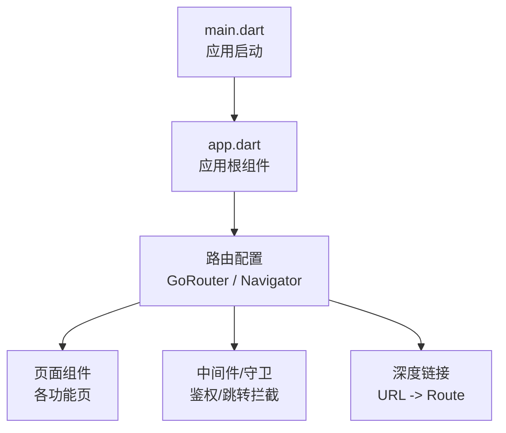
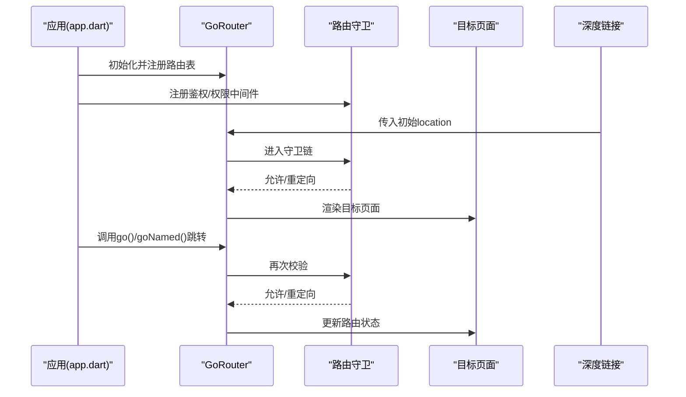
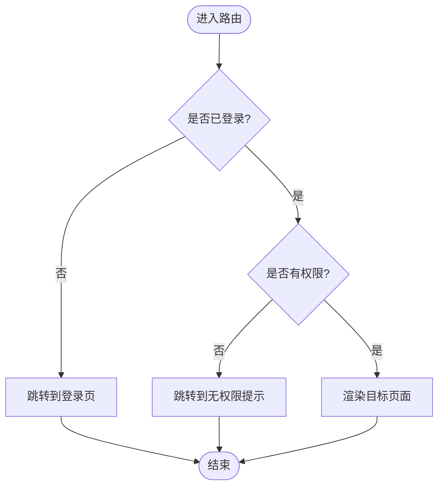
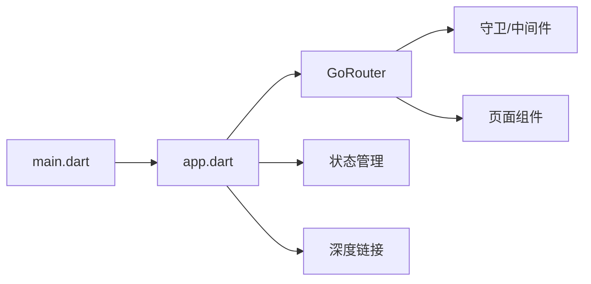

# 导航和路由

<cite>
**本文引用的文件**   
- [flutter_legado/lib/main.dart](file://flutter_legado/lib/main.dart)
- [flutter_legado/lib/app.dart](file://flutter_legado/lib/app.dart)
- [flutter_legado/pubspec.yaml](file://flutter_legado/pubspec.yaml)
</cite>

## 目录
1. [简介](#简介)
2. [项目结构](#项目结构)
3. [核心组件](#核心组件)
4. [架构总览](#架构总览)
5. [详细组件分析](#详细组件分析)
6. [依赖分析](#依赖分析)
7. [性能考虑](#性能考虑)
8. [故障排查指南](#故障排查指南)
9. [结论](#结论)
10. [附录](#附录)

## 简介
本章节面向Flutter端（flutter_legado）的导航与路由系统，目标是帮助开发者理解如何在项目中配置GoRouter或原生Navigator、如何进行参数传递与嵌套路由、如何实现命名/动态/条件路由、如何设计路由守卫与权限控制、以及如何处理深度链接与路由状态。同时给出性能优化与内存管理建议，确保在复杂业务场景下保持流畅与稳定。

## 项目结构
Flutter模块位于 flutter_legado 目录下，入口文件为 main.dart，应用根组件通常由 app.dart 提供。路由相关代码一般集中在应用初始化阶段，通过 MaterialApp/CupertinoApp 的 navigatorKey 与 GoRouter 实例进行集中式配置。

图表来源
- [flutter_legado/lib/main.dart](file://flutter_legado/lib/main.dart)
- [flutter_legado/lib/app.dart](file://flutter_legado/lib/app.dart)

章节来源
- [flutter_legado/lib/main.dart](file://flutter_legado/lib/main.dart)
- [flutter_legado/lib/app.dart](file://flutter_legado/lib/app.dart)

## 核心组件
- 应用入口与根组件：负责创建全局 navigatorKey、初始化主题、注入服务，并装配路由。
- 路由引擎：推荐使用 GoRouter，便于声明式配置、嵌套路由、动态路径与深度链接；若使用原生 Navigator 2.0，则需自行实现 RouterDelegate 与 RouteInformationParser。
- 页面与子路由：按功能域组织页面，配合 ShellRoute/子路由表构建多级导航结构。
- 路由守卫与中间件：统一处理登录态校验、角色权限、访问白名单等。
- 深度链接处理器：解析外部 URL，映射到具体路由与参数，支持回退栈与状态恢复。

章节来源
- [flutter_legado/lib/main.dart](file://flutter_legado/lib/main.dart)
- [flutter_legado/lib/app.dart](file://flutter_legado/lib/app.dart)

## 架构总览
下图展示基于 GoRouter 的典型架构：应用入口创建 GoRouter 实例，注册路由表与中间件，页面组件通过 context.go() 或 goNamed() 进行跳转，深度链接由 routeInformationParser 与 locationBuilder 协同完成。

图表来源
- [flutter_legado/lib/app.dart](file://flutter_legado/lib/app.dart)

## 详细组件分析

### 路由配置与最佳实践
- 命名路由：为每个页面定义稳定的名称，便于跨模块引用与维护。
- 动态路由：使用路径参数与查询参数承载上下文数据，避免将大对象放入路由。
- 条件路由：根据用户角色、设备类型、功能开关等动态决定可访问的路由。
- 嵌套路由：使用 ShellRoute 或子路由表组织 TabBar/侧边栏等复合布局。
- 默认路由与错误路由：设置首页与未匹配时的兜底页面。

章节来源
- [flutter_legado/lib/app.dart](file://flutter_legado/lib/app.dart)

### 参数传递与状态同步
- 路径参数：用于标识资源ID等短小关键信息。
- 查询参数：用于筛选、排序、分页等可选参数。
- 表单/弹窗返回：通过 Navigator 返回值或事件总线同步状态。
- 路由状态管理：结合 Provider/Riverpod/BLoC 在路由变化时刷新必要状态。

章节来源
- [flutter_legado/lib/app.dart](file://flutter_legado/lib/app.dart)

### 路由守卫与权限控制
- 登录检查：在进入受保护路由前校验登录态，未登录则跳转到登录页并携带返回地址。
- 角色权限：根据用户角色/权限列表决定是否允许访问某路由。
- 动态权限：结合后端接口或本地策略实时判断。
- 防重复跳转：对敏感操作增加节流与确认逻辑。

章节来源
- [flutter_legado/lib/app.dart](file://flutter_legado/lib/app.dart)

### 深度链接支持
- 解析URL：将 scheme/host/path/query 映射到路由与参数。
- 首次启动：从系统获取初始location并驱动路由树。
- 运行时切换：监听location变化，触发页面重建与数据加载。
- 平台差异：Android/iOS/Web 的Intent/Info.plist/manifest配置需适配。

章节来源
- [flutter_legado/lib/app.dart](file://flutter_legado/lib/app.dart)

### 嵌套路由与Shell布局
- ShellRoute：承载TabBar/Drawer等公共外壳，内部维护各自子路由。
- 子路由表：按模块划分，提升可读性与可测试性。
- 层级控制：合理使用 push/pop/replace，避免过深堆栈。

章节来源
- [flutter_legado/lib/app.dart](file://flutter_legado/lib/app.dart)

### 示例流程图：条件路由与守卫

图表来源
- [flutter_legado/lib/app.dart](file://flutter_legado/lib/app.dart)

## 依赖分析
- 第三方库：GoRouter 及其插件（如 go_router_builder）可简化生成与类型安全。
- 状态管理：Provider/Riverpod/BLoC 与路由联动，保证状态一致性。
- 平台能力：深度链接需要 AndroidManifest/Info.plist/Web manifest 配置。

图表来源
- [flutter_legado/lib/main.dart](file://flutter_legado/lib/main.dart)
- [flutter_legado/lib/app.dart](file://flutter_legado/lib/app.dart)

章节来源
- [flutter_legado/pubspec.yaml](file://flutter_legado/pubspec.yaml)
- [flutter_legado/lib/main.dart](file://flutter_legado/lib/main.dart)
- [flutter_legado/lib/app.dart](file://flutter_legado/lib/app.dart)

## 性能考虑
- 路由懒加载：按需加载页面与依赖，减少首屏体积。
- 路由缓存：合理设置 keepPages，避免频繁重建。
- 避免大对象入参：优先使用ID+远程/本地数据源加载详情。
- 减少重绘：在路由切换时隔离无关Widget的重建范围。
- 深度链接解析：缓存解析结果，避免重复计算。
- 栈管理：及时 pop 不再需要的页面，防止内存泄漏。

[本节为通用指导，不直接分析具体文件]

## 故障排查指南
- 路由无法匹配：检查路径格式、命名冲突、大小写与斜杠。
- 守卫死循环：确保重定向目标不被守卫再次拦截。
- 深度链接无效：核对平台配置、scheme/host、权限声明。
- 参数丢失：确认路径参数与查询参数是否正确传递与解析。
- 内存增长：定位长时间驻留的页面与未释放的资源。

[本节为通用指导，不直接分析具体文件]

## 结论
通过集中式路由配置、清晰的守卫机制与合理的状态管理，可以在Flutter应用中构建稳定、可扩展且高性能的导航体系。推荐优先采用 GoRouter 以简化嵌套路由与深度链接的实现，并结合状态管理与平台能力，满足复杂业务需求。

[本节为总结，不直接分析具体文件]

## 附录
- 术语说明
  - 命名路由：以字符串命名的路由，便于跨模块引用。
  - 动态路由：包含可变段的路径，如 /book/:id。
  - 条件路由：根据运行时条件决定跳转目标。
  - 深度链接：通过外部URL直接打开指定页面。
  - 路由守卫：在路由切换前后执行的校验逻辑。

[本节为概念说明，不直接分析具体文件]