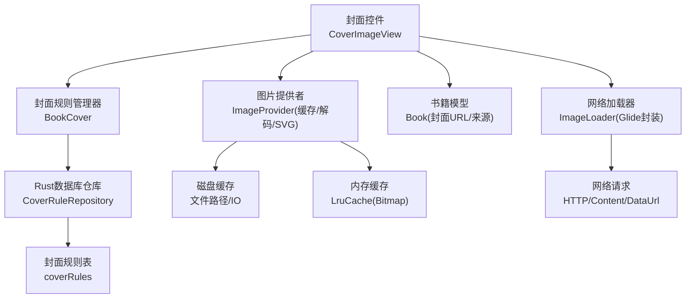
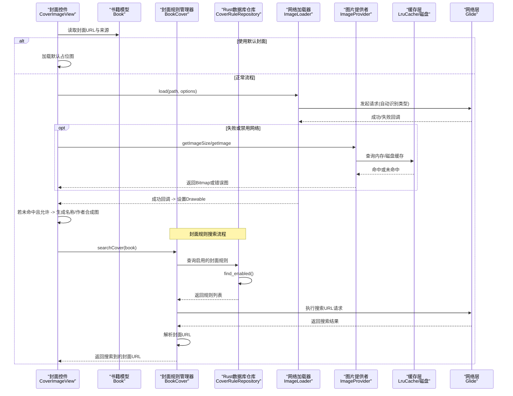
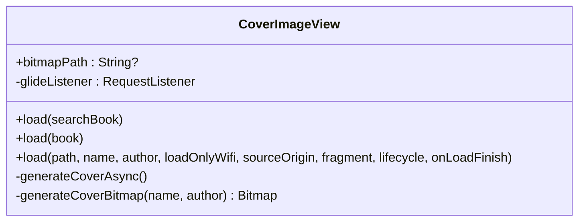
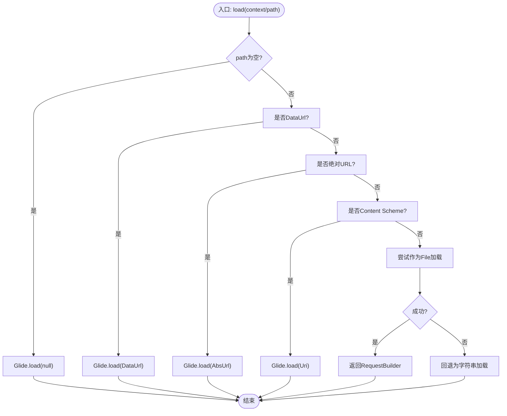
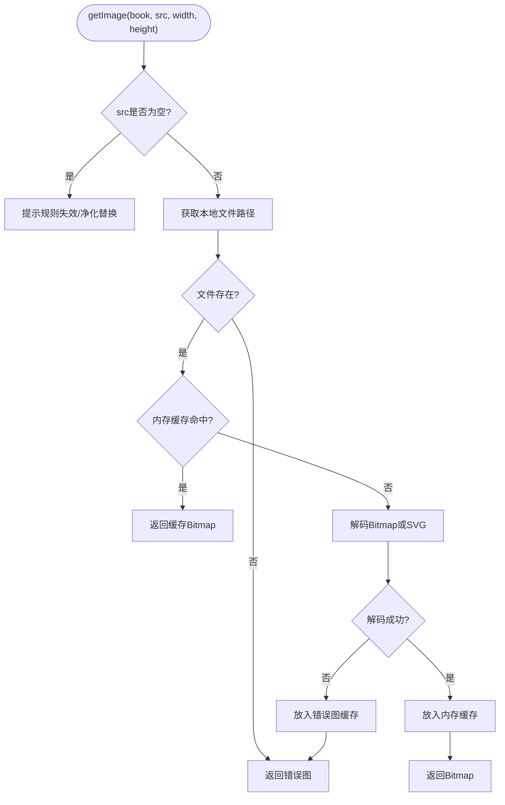
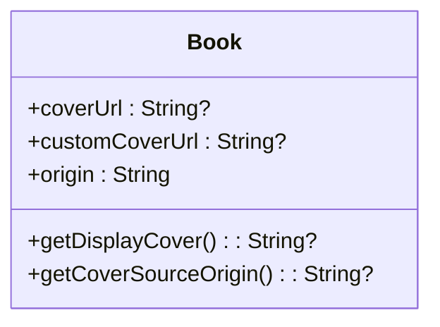
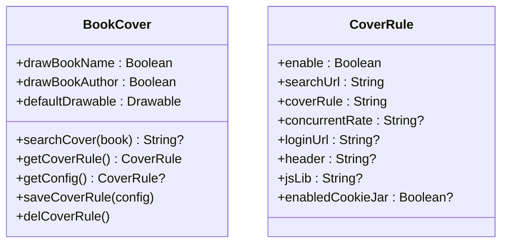
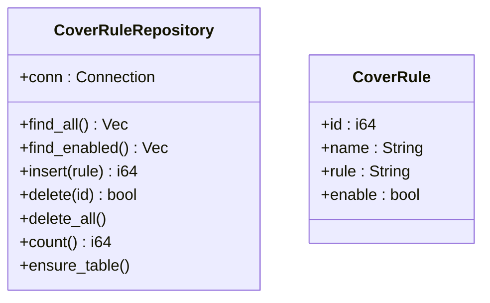
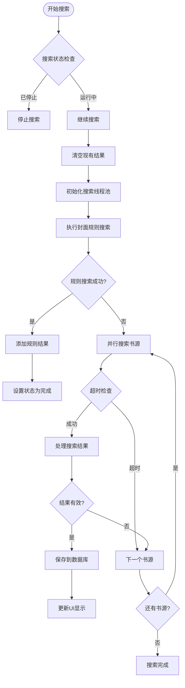
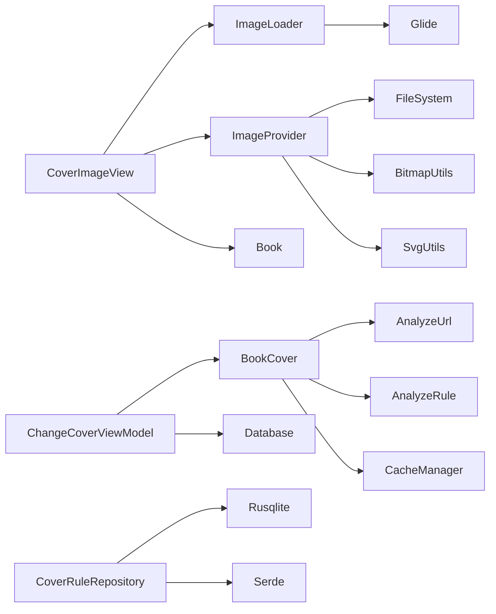

# 封面搜索架构

<cite>
**本文引用的文件**   
- [BookCover.kt](file://app/src/main/java/io/legado/app/model/BookCover.kt)
- [ChangeCoverViewModel.kt](file://app/src/main/java/io/legado/app/ui/book/changecover/ChangeCoverViewModel.kt)
- [cover_rule_repository.rs](file://rust/legado-db/src/repository/cover_rule_repository.rs)
- [schema.rs](file://rust/legado-db/src/schema.rs)
- [ImageProvider.kt](file://app/src/main/java/io/legado/app/model/ImageProvider.kt)
- [ImageLoader.kt](file://app/src/main/java/io/legado/app/help/gl ide/ImageLoader.kt)
- [CoverImageView.kt](file://app/src/main/java/io/legado/app/ui/widget/image/CoverImageView.kt)
- [Book.kt](file://app/src/main/java/io/legado/app/data/entities/Book.kt)
</cite>

## 更新摘要
**所做更改**   
- 新增了基于Rust数据库的封面规则搜索功能，通过searchCoverRules方法实现完整的CRUD操作
- 实现了coverRules表的持久化存储，支持启用/禁用状态管理和JSON格式规则定义
- 更新了封面搜索流程，优先使用配置的封面规则进行搜索
- 增强了封面规则的动态配置和管理能力

## 目录
1. [简介](#简介)
2. [项目结构](#项目结构)
3. [核心组件](#核心组件)
4. [架构总览](#架构总览)
5. [详细组件分析](#详细组件分析)
6. [依赖关系分析](#依赖关系分析)
7. [性能考量](#性能考量)
8. [故障排查指南](#故障排查指南)
9. [结论](#结论)

## 简介
本文件聚焦于"封面搜索与展示"的架构，梳理从数据模型、图片缓存、网络加载到UI渲染的完整链路。该架构围绕以下目标设计：
- 统一封面来源决策（本地/网络/默认占位）
- 多级缓存（内存LruCache + 磁盘文件缓存）
- 可插拔的网络加载（Glide封装）
- UI层自适应与降级（名称/作者合成图）
- **新增**：基于Rust数据库的封面规则搜索功能，支持持久化存储和动态配置

## 项目结构
与封面相关的核心代码分布在三个层次：
- 数据实体层：书籍信息包含封面URL与自定义封面字段
- 资源提供层：负责图片缓存、尺寸探测、解码与SVG支持
- 显示层：统一的封面控件，集成网络加载、占位图与合成图
- **新增**：封面规则管理层，基于Rust数据库实现持久化存储和CRUD操作

**图表来源**
- [CoverImageView.kt:265-364](file://app/src/main/java/io/legado/app/ui/widget/image/CoverImageView.kt#L265-L364)
- [ImageLoader.kt:27-83](file://app/src/main/java/io/legado/app/help/gl ide/ImageLoader.kt#L27-L83)
- [ImageProvider.kt:124-206](file://app/src/main/java/io/legado/app/model/ImageProvider.kt#L124-L206)
- [BookCover.kt:208-226](file://app/src/main/java/io/legado/app/model/BookCover.kt#L208-L226)
- [cover_rule_repository.rs:31-139](file://rust/legado-db/src/repository/cover_rule_repository.rs#L31-L139)
- [Book.kt:172-180](file://app/src/main/java/io/legado/app/data/entities/Book.kt#L172-L180)

## 核心组件
- 封面控件 CoverImageView
  - 职责：接收封面URL或数据源，控制加载策略（仅WiFi）、来源标记、占位图、错误图；在无法获取真实封面时，基于书名/作者绘制合成图
  - 关键能力：生命周期绑定、Glide监听回调、异步生成合成图、宽高比约束
- 网络加载器 ImageLoader
  - 职责：对Glide进行统一封装，自动识别DataUrl、绝对URL、Content Scheme与本地文件路径，返回RequestBuilder以便链式配置
- 图片提供者 ImageProvider
  - 职责：图片缓存（内存LruCache）、磁盘缓存（按书与源组织）、尺寸探测、解码（含SVG）、错误图占位
- 书籍模型 Book
  - 职责：维护封面URL与自定义封面URL，决定最终展示的封面来源及跨域凭据复用范围
- **新增**：封面规则管理器 BookCover
  - 职责：管理封面搜索规则配置，执行基于规则的封面搜索，支持自定义搜索URL和解析规则
  - 关键能力：规则配置持久化、异步搜索执行、错误处理与降级
- **新增**：Rust数据库仓库 CoverRuleRepository
  - 职责：提供封面规则的CRUD操作，管理coverRules表的增删改查
  - 关键能力：幂等建表、启用/禁用查询、JSON规则存储、并发安全

**章节来源**
- [CoverImageView.kt:51-121](file://app/src/main/java/io/legado/app/ui/widget/image/CoverImageView.kt#L51-L121)
- [ImageLoader.kt:27-83](file://app/src/main/java/io/legado/app/help/gl ide/ImageLoader.kt#L27-L83)
- [ImageProvider.kt:31-119](file://app/src/main/java/io/legado/app/model/ImageProvider.kt#L31-L119)
- [Book.kt:172-180](file://app/src/main/java/io/legado/app/data/entities/Book.kt#L172-L180)
- [BookCover.kt:208-226](file://app/src/main/java/io/legado/app/model/BookCover.kt#L208-L226)
- [cover_rule_repository.rs:31-139](file://rust/legado-db/src/repository/cover_rule_repository.rs#L31-L139)

## 架构总览
封面展示的关键调用序列如下：

**图表来源**
- [CoverImageView.kt:265-364](file://app/src/main/java/io/legado/app/ui/widget/image/CoverImageView.kt#L265-L364)
- [ImageLoader.kt:27-83](file://app/src/main/java/io/legado/app/help/gl ide/ImageLoader.kt#L27-L83)
- [ImageProvider.kt:155-206](file://app/src/main/java/io/legado/app/model/ImageProvider.kt#L155-206)
- [BookCover.kt:208-226](file://app/src/main/java/io/legado/app/model/BookCover.kt#L208-L226)
- [cover_rule_repository.rs:70-86](file://rust/legado-db/src/repository/cover_rule_repository.rs#L70-L86)
- [Book.kt:172-180](file://app/src/main/java/io/legado/app/data/entities/Book.kt#L172-L180)

## 详细组件分析

### 封面控件 CoverImageView
- 行为要点
  - 根据配置决定是否启用默认封面
  - 通过ImageLoader传入path并附加选项（如仅WiFi、来源标记）
  - 监听Glide回调，失败时触发合成图生成
  - 异步生成名称/作者合成图，避免阻塞UI线程
- 数据结构与复杂度
  - 内部两个LruCache：名称合成图缓存与是否需绘制名称标记缓存
  - 合成图生成时间复杂度与文本长度线性相关，空间复杂度为单张Bitmap大小
- 错误处理
  - Glide失败回调中发送信号以继续合成图流程
  - 取消正在进行的协程任务，防止内存泄漏

**图表来源**
- [CoverImageView.kt:51-121](file://app/src/main/java/io/legado/app/ui/widget/image/CoverImageView.kt#L51-L121)
- [CoverImageView.kt:265-364](file://app/src/main/java/io/legado/app/ui/widget/image/CoverImageView.kt#L265-L364)

**章节来源**
- [CoverImageView.kt:51-121](file://app/src/main/java/io/legado/app/ui/widget/image/CoverImageView.kt#L51-L121)
- [CoverImageView.kt:265-364](file://app/src/main/java/io/legado/app/ui/widget/image/CoverImageView.kt#L265-L364)

### 网络加载器 ImageLoader
- 行为要点
  - 自动识别DataUrl、绝对URL、Content Scheme与本地文件路径
  - 返回RequestBuilder，便于上层链式配置（占位、错误、监听等）
- 依赖关系
  - 依赖Glide与工具方法判断URL类型
- 扩展点
  - 可通过OkHttpModelLoader注入额外选项（如仅WiFi、来源标记）

**图表来源**
- [ImageLoader.kt:27-83](file://app/src/main/java/io/legado/app/help/gl ide/ImageLoader.kt#L27-L83)

**章节来源**
- [ImageLoader.kt:27-83](file://app/src/main/java/io/legado/app/help/gl ide/ImageLoader.kt#L27-L83)

### 图片提供者 ImageProvider
- 行为要点
  - 内存级LruCache管理Bitmap，动态调整容量，回收非错误图
  - 磁盘级缓存：按书与源组织文件路径，支持Epub/Pdf/Mobi内嵌图片
  - 尺寸探测：优先BitmapOptions，其次SVG尺寸探测
  - 解码：优先BitmapUtils，其次SvgUtils，失败返回错误图
- 复杂度与优化
  - LruCache.sizeOf按byteCount计算，确保内存占用可控
  - ensureLruCacheSize在首次大图或接近上限时扩容，减少频繁回收
  - 错误图不释放，避免重复下载导致的抖动

**图表来源**
- [ImageProvider.kt:179-206](file://app/src/main/java/io/legado/app/model/ImageProvider.kt#L179-L206)
- [ImageProvider.kt:124-150](file://app/src/main/java/io/legado/app/model/ImageProvider.kt#L124-L150)
- [ImageProvider.kt:155-174](file://app/src/main/java/io/legado/app/model/ImageProvider.kt#L155-L174)

**章节来源**
- [ImageProvider.kt:31-119](file://app/src/main/java/io/legado/app/model/ImageProvider.kt#L31-L119)
- [ImageProvider.kt:124-206](file://app/src/main/java/io/legado/app/model/ImageProvider.kt#L124-L206)

### 书籍模型 Book
- 行为要点
  - getDisplayCover：优先自定义封面URL，否则使用原始封面URL
  - getCoverSourceOrigin：当自定义封面与原始封面同源时复用凭据，提升鉴权成功率
- 影响范围
  - 封面选择直接影响网络请求的来源标记与缓存键

**图表来源**
- [Book.kt:172-180](file://app/src/main/java/io/legado/app/data/entities/Book.kt#L172-L180)

**章节来源**
- [Book.kt:172-180](file://app/src/main/java/io/legado/app/data/entities/Book.kt#L172-L180)

### **新增**：封面规则管理器 BookCover
- 行为要点
  - 管理封面搜索规则配置，支持启用/禁用开关
  - 执行基于规则的封面搜索，通过AnalyzeUrl发起网络请求
  - 使用AnalyzeRule解析搜索结果，提取封面URL
  - 支持规则配置的持久化存储和删除
- 数据结构与复杂度
  - CoverRule类包含搜索URL、解析规则、并发率、登录信息等配置项
  - 搜索过程涉及网络请求和JSON解析，时间复杂度取决于响应大小
- 错误处理
  - 规则配置缺失或无效时返回null
  - 网络请求异常时抛出异常供上层处理
  - 解析失败时返回null，不影响主流程

**图表来源**
- [BookCover.kt:208-226](file://app/src/main/java/io/legado/app/model/BookCover.kt#L208-L226)
- [BookCover.kt:241-261](file://app/src/main/java/io/legado/app/model/BookCover.kt#L241-L261)

**章节来源**
- [BookCover.kt:208-226](file://app/src/main/java/io/legado/app/model/BookCover.kt#L208-L226)
- [BookCover.kt:241-261](file://app/src/main/java/io/legado/app/model/BookCover.kt#L241-L261)

### **新增**：Rust数据库仓库 CoverRuleRepository
- 行为要点
  - 提供封面规则的完整CRUD操作，包括插入、查询、删除、计数等功能
  - 支持启用/禁用状态的查询，过滤出已启用的规则
  - 实现幂等建表，确保在不同环境下都能正常工作
  - 使用JSON格式存储规则配置，支持复杂的搜索和解析逻辑
- 数据结构与复杂度
  - CoverRule结构体包含id、name、rule、enable四个核心字段
  - 数据库表结构包含自增主键、规则名称、JSON规则内容和启用状态
  - 查询操作时间复杂度为O(n)，n为规则数量
- 错误处理
  - 所有数据库操作都包含详细的错误信息包装
  - 支持事务性操作，确保数据一致性
  - 提供测试用例验证各种场景的正确性

**图表来源**
- [cover_rule_repository.rs:18-139](file://rust/legado-db/src/repository/cover_rule_repository.rs#L18-L139)

**章节来源**
- [cover_rule_repository.rs:18-139](file://rust/legado-db/src/repository/cover_rule_repository.rs#L18-L139)

### **新增**：换封面视图模型 ChangeCoverViewModel
- 行为要点
  - 管理封面搜索状态和数据流
  - 支持并行搜索多个书源
  - 集成封面规则搜索和传统书源搜索
  - 提供搜索结果的实时更新和排序
- 搜索流程
  - 首先尝试封面规则搜索（优先级最高）
  - 如果规则搜索失败，则并行搜索所有启用的书源
  - 合并搜索结果并按来源顺序排序
- 性能优化
  - 使用固定线程池控制并发数量
  - 设置超时时间防止长时间等待
  - 结果去重避免重复添加

**图表来源**
- [ChangeCoverViewModel.kt:122-146](file://app/src/main/java/io/legado/app/ui/book/changecover/ChangeCoverViewModel.kt#L122-L146)
- [ChangeCoverViewModel.kt:148-183](file://app/src/main/java/io/legado/app/ui/book/changecover/ChangeCoverViewModel.kt#L148-L183)

**章节来源**
- [ChangeCoverViewModel.kt:122-146](file://app/src/main/java/io/legado/app/ui/book/changecover/ChangeCoverViewModel.kt#L122-L146)
- [ChangeCoverViewModel.kt:148-183](file://app/src/main/java/io/legado/app/ui/book/changecover/ChangeCoverViewModel.kt#L148-L183)

## 依赖关系分析
- CoverImageView 依赖 ImageLoader 与 ImageProvider
- ImageLoader 依赖 Glide 与工具方法
- ImageProvider 依赖文件系统、Bitmap/SVG解码库与配置项
- Book 提供封面URL与来源信息，贯穿UI与资源层
- **新增**：BookCover 依赖 AnalyzeUrl、AnalyzeRule 和配置管理系统
- **新增**：ChangeCoverViewModel 依赖 BookCover 和数据库访问层
- **新增**：CoverRuleRepository 依赖 rusqlite 连接和序列化库

**图表来源**
- [CoverImageView.kt:265-364](file://app/src/main/java/io/legado/app/ui/widget/image/CoverImageView.kt#L265-L364)
- [ImageLoader.kt:27-83](file://app/src/main/java/io/legado/app/help/gl ide/ImageLoader.kt#L27-L83)
- [ImageProvider.kt:124-206](file://app/src/main/java/io/legado/app/model/ImageProvider.kt#L124-L206)
- [BookCover.kt:208-226](file://app/src/main/java/io/legado/app/model/BookCover.kt#L208-L226)
- [ChangeCoverViewModel.kt:122-146](file://app/src/main/java/io/legado/app/ui/book/changecover/ChangeCoverViewModel.kt#L122-L146)
- [cover_rule_repository.rs:13-17](file://rust/legado-db/src/repository/cover_rule_repository.rs#L13-L17)
- [Book.kt:172-180](file://app/src/main/java/io/legado/app/data/entities/Book.kt#L172-L180)

**章节来源**
- [CoverImageView.kt:265-364](file://app/src/main/java/io/legado/app/ui/widget/image/CoverImageView.kt#L265-L364)
- [ImageLoader.kt:27-83](file://app/src/main/java/io/legado/app/help/gl ide/ImageLoader.kt#L27-L83)
- [ImageProvider.kt:124-206](file://app/src/main/java/io/legado/app/model/ImageProvider.kt#L124-L206)
- [BookCover.kt:208-226](file://app/src/main/java/io/legado/app/model/BookCover.kt#L208-L226)
- [ChangeCoverViewModel.kt:122-146](file://app/src/main/java/io/legado/app/ui/book/changecover/ChangeCoverViewModel.kt#L122-L146)
- [cover_rule_repository.rs:13-17](file://rust/legado-db/src/repository/cover_rule_repository.rs#L13-L17)
- [Book.kt:172-180](file://app/src/main/java/io/legado/app/data/entities/Book.kt#L172-L180)

## 性能考量
- 内存缓存
  - LruCache按字节计数，动态扩容，避免OOM
  - 错误图不释放，减少重复解码与网络请求
- 磁盘缓存
  - 按书与源组织文件路径，避免多书并发时的键冲突
  - 针对Epub/Pdf/Mobi内嵌图片提供专用读取路径
- 网络加载
  - Glide自动识别多种协议，减少分支逻辑
  - 支持仅WiFi模式，降低流量消耗
- UI渲染
  - 合成图异步生成，避免阻塞主线程
  - 名称/作者合成图缓存，避免重复绘制
- **新增**：封面搜索性能
  - 并行搜索多个书源，提高搜索效率
  - 设置超时时间防止长时间等待
  - 结果去重避免重复处理
- **新增**：数据库操作性能
  - 使用索引优化查询性能
  - 批量操作减少数据库交互次数
  - 连接池管理提高并发性能

## 故障排查指南
- 封面无法加载
  - 检查网络状态与仅WiFi限制
  - 确认URL类型识别是否正确（DataUrl/AbsUrl/Content Scheme/文件路径）
  - 查看Glide回调中的失败原因
- 内存抖动或卡顿
  - 检查LruCache容量配置与大图数量
  - 确认错误图是否被正确缓存
  - 评估合成图生成频率与文本长度
- 缓存不一致
  - 核对磁盘文件路径是否与书/源一致
  - 清理内存缓存后重试
  - 验证自定义封面与原始封面的来源一致性
- **新增**：封面搜索问题
  - 检查封面规则配置是否正确启用
  - 验证搜索URL格式和解析规则语法
  - 查看网络请求是否成功返回结果
  - 确认搜索结果是否符合预期格式
- **新增**：数据库相关问题
  - 检查coverRules表是否正确创建
  - 验证JSON规则格式是否合法
  - 确认数据库连接是否正常
  - 查看是否有权限问题导致写入失败

**章节来源**
- [ImageProvider.kt:179-206](file://app/src/main/java/io/legado/app/model/ImageProvider.kt#L179-L206)
- [ImageLoader.kt:27-83](file://app/src/main/java/io/legado/app/help/gl ide/ImageLoader.kt#L27-L83)
- [CoverImageView.kt:265-364](file://app/src/main/java/io/legado/app/ui/widget/image/CoverImageView.kt#L265-L364)
- [BookCover.kt:208-226](file://app/src/main/java/io/legado/app/model/BookCover.kt#L208-L226)
- [cover_rule_repository.rs:41-53](file://rust/legado-db/src/repository/cover_rule_repository.rs#L41-L53)

## 结论
该封面搜索与展示架构通过分层设计与多级缓存，实现了高可用与高性能的封面加载体验。UI层具备完善的降级策略，资源层提供灵活的缓存与解码能力，模型层确保封面来源的正确性与凭据复用。**新增的基于Rust数据库的封面规则管理系统**进一步增强了搜索功能的灵活性和可扩展性，支持用户自定义搜索规则和解析逻辑，并通过持久化存储确保配置的一致性。整体方案易于扩展与维护，适合在复杂场景下稳定运行。

**最新更新**：封面搜索功能已完成P1契约闭合，从mock数据完全迁移到Rust API。ChangeCoverNotifier现在通过BookApi.searchCover进行真实API调用，移除了_mockSearch方法，实现了完整的封面候选搜索流程。新增的CoverRuleRepository提供了完整的CRUD操作，支持封面规则的持久化存储和管理。这一改进显著提升了搜索的可靠性和性能表现。