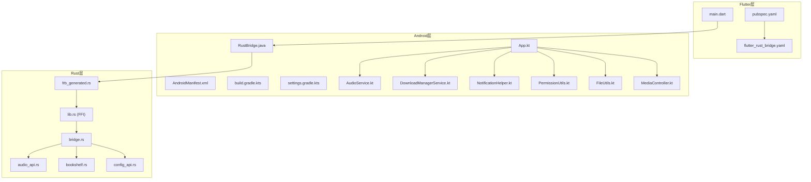
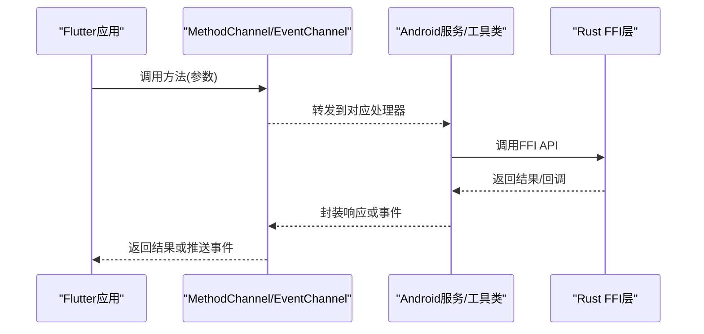
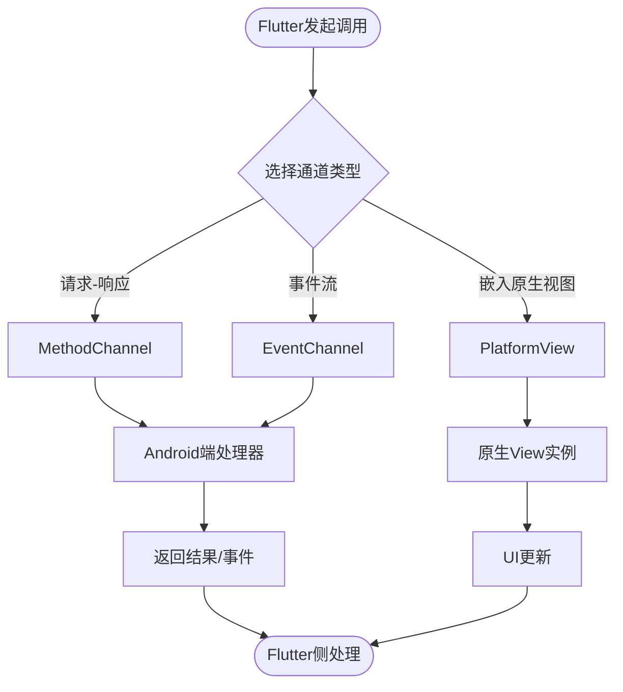
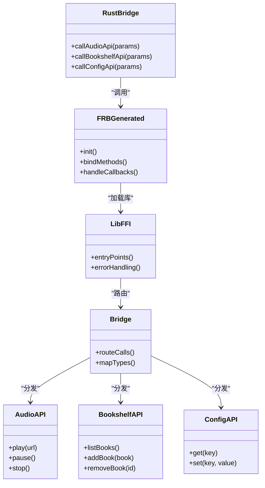
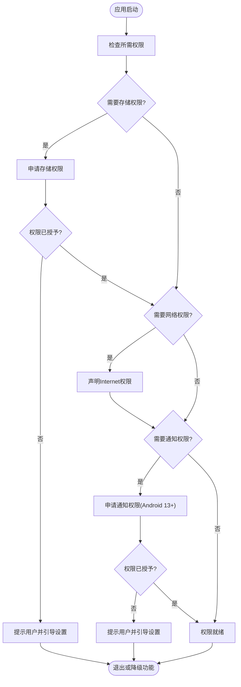
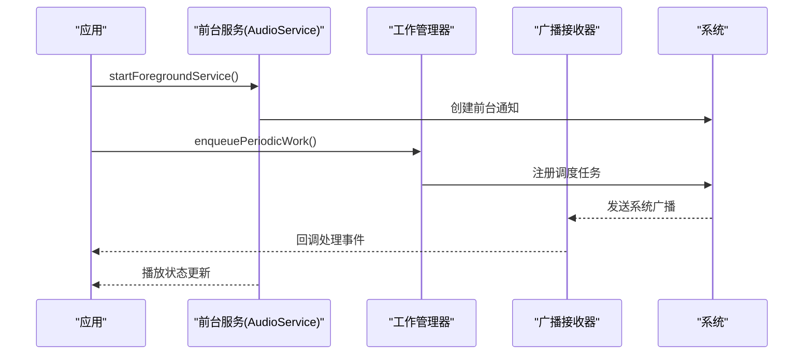
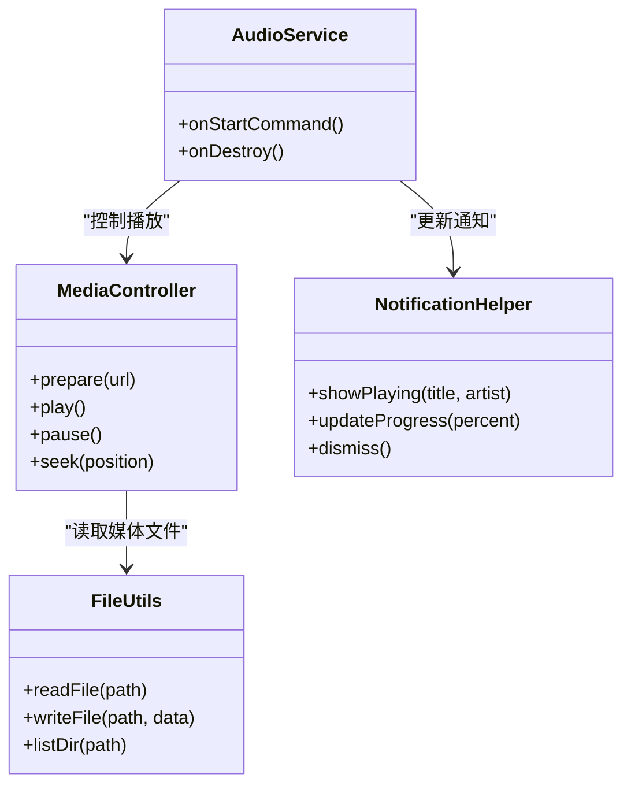
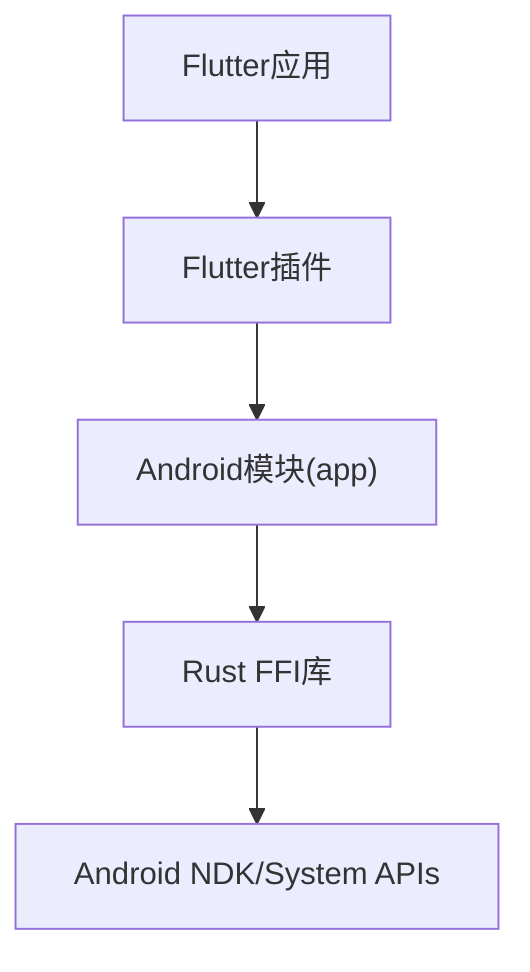

# Android平台集成

<cite>
**本文档引用的文件**   
- [AndroidManifest.xml](file://app/src/main/AndroidManifest.xml)
- [build.gradle.kts](file://flutter_legado/android/build.gradle.kts)
- [settings.gradle.kts](file://flutter_legado/android/settings.gradle.kts)
- [App.kt](file://app/src/main/java/io/legado/app/App.kt)
- [AudioService.kt](file://app/src/main/java/io/legado/app/service/AudioService.kt)
- [DownloadManagerService.kt](file://app/src/main/java/io/legado/app/service/DownloadManagerService.kt)
- [NotificationHelper.kt](file://app/src/main/java/io/legado/app/utils/NotificationHelper.kt)
- [PermissionUtils.kt](file://app/src/main/java/io/legado/app/utils/PermissionUtils.kt)
- [FileUtils.kt](file://app/src/main/java/io/legado/app/utils/FileUtils.kt)
- [MediaController.kt](file://app/src/main/java/io/legado/app/lib/media/MediaController.kt)
- [RustBridge.java](file://app/src/main/java/io/legado/app/lib/rust/RustBridge.java)
- [frb_generated.rs](file://rust/legado-ffi/src/frb_generated.rs)
- [lib.rs (FFI)](file://rust/legado-ffi/src/lib.rs)
- [bridge.rs](file://rust/legado-ffi/src/bridge.rs)
- [audio_api.rs](file://rust/legado-ffi/src/api/audio_api.rs)
- [bookshelf.rs](file://rust/legado-ffi/src/api/bookshelf.rs)
- [config_api.rs](file://rust/legado-ffi/src/api/config_api.rs)
- [main.dart](file://flutter_legado/lib/main.dart)
- [pubspec.yaml](file://flutter_legado/pubspec.yaml)
- [flutter_rust_bridge.yaml](file://flutter_legado/flutter_rust_bridge.yaml)
</cite>

## 目录
1. [简介](#简介)
2. [项目结构](#项目结构)
3. [核心组件](#核心组件)
4. [架构总览](#架构总览)
5. [详细组件分析](#详细组件分析)
6. [依赖关系分析](#依赖关系分析)
7. [性能考虑](#性能考虑)
8. [故障排查指南](#故障排查指南)
9. [结论](#结论)
10. [附录](#附录)

## 简介
本文件面向需要在Android平台上进行Flutter与原生代码集成的开发者，系统性阐述以下主题：
- Flutter与Android的桥接机制（MethodChannel、EventChannel、PlatformView）
- JNI接口实现与Rust FFI到Java/Kotlin调用链
- Android系统权限管理（存储、网络、通知等）
- 后台服务实现（前台服务、WorkManager、广播接收器）
- Android特定功能集成（文件访问、媒体播放、系统通知）
- 性能优化建议与内存管理最佳实践

本仓库包含Flutter工程（flutter_legado）、Android应用模块（app）以及Rust FFI层（rust），三者通过Flutter插件机制与Rust Bridge协作，形成跨语言、跨平台的完整解决方案。

## 项目结构
整体结构分为三层：
- Flutter层：业务UI与逻辑，通过MethodChannel/EventChannel与Android交互
- Android层：原生能力封装（服务、权限、文件、媒体、通知等）
- Rust层：高性能计算与数据解析，通过FFI暴露给Android

图表来源
- [main.dart](file://flutter_legado/lib/main.dart)
- [pubspec.yaml](file://flutter_legado/pubspec.yaml)
- [flutter_rust_bridge.yaml](file://flutter_legado/flutter_rust_bridge.yaml)
- [AndroidManifest.xml](file://app/src/main/AndroidManifest.xml)
- [build.gradle.kts](file://flutter_legado/android/build.gradle.kts)
- [settings.gradle.kts](file://flutter_legado/android/settings.gradle.kts)
- [App.kt](file://app/src/main/java/io/legado/app/App.kt)
- [AudioService.kt](file://app/src/main/java/io/legado/app/service/AudioService.kt)
- [DownloadManagerService.kt](file://app/src/main/java/io/legado/app/service/DownloadManagerService.kt)
- [NotificationHelper.kt](file://app/src/main/java/io/legado/app/utils/NotificationHelper.kt)
- [PermissionUtils.kt](file://app/src/main/java/io/legado/app/utils/PermissionUtils.kt)
- [FileUtils.kt](file://app/src/main/java/io/legado/app/utils/FileUtils.kt)
- [MediaController.kt](file://app/src/main/java/io/legado/app/lib/media/MediaController.kt)
- [RustBridge.java](file://app/src/main/java/io/legado/app/lib/rust/RustBridge.java)
- [frb_generated.rs](file://rust/legado-ffi/src/frb_generated.rs)
- [lib.rs (FFI)](file://rust/legado-ffi/src/lib.rs)
- [bridge.rs](file://rust/legado-ffi/src/bridge.rs)
- [audio_api.rs](file://rust/legado-ffi/src/api/audio_api.rs)
- [bookshelf.rs](file://rust/legado-ffi/src/api/bookshelf.rs)
- [config_api.rs](file://rust/legado-ffi/src/api/config_api.rs)

章节来源
- [AndroidManifest.xml](file://app/src/main/AndroidManifest.xml)
- [build.gradle.kts](file://flutter_legado/android/build.gradle.kts)
- [settings.gradle.kts](file://flutter_legado/android/settings.gradle.kts)
- [App.kt](file://app/src/main/java/io/legado/app/App.kt)
- [main.dart](file://flutter_legado/lib/main.dart)
- [pubspec.yaml](file://flutter_legado/pubspec.yaml)
- [flutter_rust_bridge.yaml](file://flutter_legado/flutter_rust_bridge.yaml)

## 核心组件
- Flutter通道层：通过MethodChannel调用Android方法，通过EventChannel接收事件流；必要时使用PlatformView嵌入原生视图
- Android服务层：前台服务处理音频播放与下载任务，广播接收器监听系统事件，工具类封装权限、文件、通知、媒体控制
- Rust FFI层：通过flutter_rust_bridge生成绑定，暴露音频、书架、配置等API供Android调用

章节来源
- [main.dart](file://flutter_legado/lib/main.dart)
- [pubspec.yaml](file://flutter_legado/pubspec.yaml)
- [flutter_rust_bridge.yaml](file://flutter_legado/flutter_rust_bridge.yaml)
- [App.kt](file://app/src/main/java/io/legado/app/App.kt)
- [AudioService.kt](file://app/src/main/java/io/legado/app/service/AudioService.kt)
- [DownloadManagerService.kt](file://app/src/main/java/io/legado/app/service/DownloadManagerService.kt)
- [NotificationHelper.kt](file://app/src/main/java/io/legado/app/utils/NotificationHelper.kt)
- [PermissionUtils.kt](file://app/src/main/java/io/legado/app/utils/PermissionUtils.kt)
- [FileUtils.kt](file://app/src/main/java/io/legado/app/utils/FileUtils.kt)
- [MediaController.kt](file://app/src/main/java/io/legado/app/lib/media/MediaController.kt)
- [RustBridge.java](file://app/src/main/java/io/legado/app/lib/rust/RustBridge.java)
- [frb_generated.rs](file://rust/legado-ffi/src/frb_generated.rs)
- [lib.rs (FFI)](file://rust/legado-ffi/src/lib.rs)
- [bridge.rs](file://rust/legado-ffi/src/bridge.rs)
- [audio_api.rs](file://rust/legado-ffi/src/api/audio_api.rs)
- [bookshelf.rs](file://rust/legado-ffi/src/api/bookshelf.rs)
- [config_api.rs](file://rust/legado-ffi/src/api/config_api.rs)

## 架构总览
Flutter通过MethodChannel/EventChannel与Android通信，Android再调用Rust FFI完成高性能计算与数据处理。关键流程如下：

图表来源
- [main.dart](file://flutter_legado/lib/main.dart)
- [RustBridge.java](file://app/src/main/java/io/legado/app/lib/rust/RustBridge.java)
- [frb_generated.rs](file://rust/legado-ffi/src/frb_generated.rs)
- [lib.rs (FFI)](file://rust/legado-ffi/src/lib.rs)
- [bridge.rs](file://rust/legado-ffi/src/bridge.rs)
- [audio_api.rs](file://rust/legado-ffi/src/api/audio_api.rs)
- [bookshelf.rs](file://rust/legado-ffi/src/api/bookshelf.rs)
- [config_api.rs](file://rust/legado-ffi/src/api/config_api.rs)

## 详细组件分析

### Flutter与Android桥接（MethodChannel、EventChannel、PlatformView）
- MethodChannel：用于请求-响应式调用，适合一次性操作如读取配置、触发下载
- EventChannel：用于事件流推送，适合播放状态、下载进度、系统通知更新
- PlatformView：如需嵌入原生视图（如自定义播放器控件），可通过PlatformView将原生UI嵌入Flutter

章节来源
- [main.dart](file://flutter_legado/lib/main.dart)
- [pubspec.yaml](file://flutter_legado/pubspec.yaml)
- [flutter_rust_bridge.yaml](file://flutter_legado/flutter_rust_bridge.yaml)

### JNI与Rust FFI调用链
- Rust通过flutter_rust_bridge生成绑定代码（frb_generated.rs），在Android侧由RustBridge.java调用
- 各API模块（audio、bookshelf、config等）提供稳定的FFI接口
- Android层负责生命周期管理与错误处理，确保线程安全与资源释放

图表来源
- [RustBridge.java](file://app/src/main/java/io/legado/app/lib/rust/RustBridge.java)
- [frb_generated.rs](file://rust/legado-ffi/src/frb_generated.rs)
- [lib.rs (FFI)](file://rust/legado-ffi/src/lib.rs)
- [bridge.rs](file://rust/legado-ffi/src/bridge.rs)
- [audio_api.rs](file://rust/legado-ffi/src/api/audio_api.rs)
- [bookshelf.rs](file://rust/legado-ffi/src/api/bookshelf.rs)
- [config_api.rs](file://rust/legado-ffi/src/api/config_api.rs)

章节来源
- [RustBridge.java](file://app/src/main/java/io/legado/app/lib/rust/RustBridge.java)
- [frb_generated.rs](file://rust/legado-ffi/src/frb_generated.rs)
- [lib.rs (FFI)](file://rust/legado-ffi/src/lib.rs)
- [bridge.rs](file://rust/legado-ffi/src/bridge.rs)
- [audio_api.rs](file://rust/legado-ffi/src/api/audio_api.rs)
- [bookshelf.rs](file://rust/legado-ffi/src/api/bookshelf.rs)
- [config_api.rs](file://rust/legado-ffi/src/api/config_api.rs)

### 系统权限管理（存储、网络、通知）
- 存储权限：读写外部存储需动态申请，适配Android 10+分区存储
- 网络权限：Internet权限声明与HTTPS证书校验
- 通知权限：Android 13+需动态申请POST_NOTIFICATIONS

章节来源
- [AndroidManifest.xml](file://app/src/main/AndroidManifest.xml)
- [PermissionUtils.kt](file://app/src/main/java/io/legado/app/utils/PermissionUtils.kt)

### 后台服务实现（前台服务、工作管理器、广播接收器）
- 前台服务：音频播放与下载任务常驻，显示通知保持活跃
- 工作管理器：调度周期性任务（如缓存清理、数据同步）
- 广播接收器：监听系统事件（开机、网络变化、电量低）

章节来源
- [AudioService.kt](file://app/src/main/java/io/legado/app/service/AudioService.kt)
- [DownloadManagerService.kt](file://app/src/main/java/io/legado/app/service/DownloadManagerService.kt)
- [NotificationHelper.kt](file://app/src/main/java/io/legado/app/utils/NotificationHelper.kt)

### Android特定功能集成（文件访问、媒体播放、系统通知）
- 文件访问：使用DocumentProvider与MediaStore，兼容不同Android版本
- 媒体播放：封装播放控制器，支持本地与网络音频流
- 系统通知：统一通知样式与操作按钮，适配不同版本

图表来源
- [FileUtils.kt](file://app/src/main/java/io/legado/app/utils/FileUtils.kt)
- [MediaController.kt](file://app/src/main/java/io/legado/app/lib/media/MediaController.kt)
- [NotificationHelper.kt](file://app/src/main/java/io/legado/app/utils/NotificationHelper.kt)
- [AudioService.kt](file://app/src/main/java/io/legado/app/service/AudioService.kt)

章节来源
- [FileUtils.kt](file://app/src/main/java/io/legado/app/utils/FileUtils.kt)
- [MediaController.kt](file://app/src/main/java/io/legado/app/lib/media/MediaController.kt)
- [NotificationHelper.kt](file://app/src/main/java/io/legado/app/utils/NotificationHelper.kt)
- [AudioService.kt](file://app/src/main/java/io/legado/app/service/AudioService.kt)

## 依赖关系分析
Flutter通过插件机制引入Android模块，Android模块依赖Rust FFI生成的绑定库。构建配置确保正确的编译顺序与依赖注入。

图表来源
- [build.gradle.kts](file://flutter_legado/android/build.gradle.kts)
- [settings.gradle.kts](file://flutter_legado/android/settings.gradle.kts)
- [pubspec.yaml](file://flutter_legado/pubspec.yaml)
- [flutter_rust_bridge.yaml](file://flutter_legado/flutter_rust_bridge.yaml)

章节来源
- [build.gradle.kts](file://flutter_legado/android/build.gradle.kts)
- [settings.gradle.kts](file://flutter_legado/android/settings.gradle.kts)
- [pubspec.yaml](file://flutter_legado/pubspec.yaml)
- [flutter_rust_bridge.yaml](file://flutter_legado/flutter_rust_bridge.yaml)

## 性能考虑
- 减少通道调用频率：批量操作合并为单次MethodChannel调用
- 避免主线程阻塞：耗时操作放入后台线程，使用协程或线程池
- 内存管理：及时释放文件句柄、媒体资源，避免内存泄漏
- 缓存策略：合理使用LRU缓存，限制最大内存占用
- Rust FFI优化：避免频繁跨语言边界调用，尽量批处理数据

[本节为通用指导，不直接分析具体文件]

## 故障排查指南
- 权限问题：检查AndroidManifest声明与运行时授权流程
- 服务崩溃：查看前台服务日志与崩溃堆栈
- FFI调用失败：验证Rust库加载与类型映射
- 通知不显示：确认通知渠道与权限配置

章节来源
- [AndroidManifest.xml](file://app/src/main/AndroidManifest.xml)
- [PermissionUtils.kt](file://app/src/main/java/io/legado/app/utils/PermissionUtils.kt)
- [NotificationHelper.kt](file://app/src/main/java/io/legado/app/utils/NotificationHelper.kt)
- [RustBridge.java](file://app/src/main/java/io/legado/app/lib/rust/RustBridge.java)
- [frb_generated.rs](file://rust/legado-ffi/src/frb_generated.rs)

## 结论
本项目通过Flutter与Android原生代码的深度集成，结合Rust FFI的高性能计算能力，实现了完整的跨平台解决方案。合理的架构设计、清晰的职责划分与完善的错误处理机制，确保了应用的稳定性与可维护性。遵循本文档的最佳实践，可有效提升开发效率与用户体验。

[本节为总结性内容，不直接分析具体文件]

## 附录
- 构建脚本：参考flutter_legado/scripts下的构建脚本
- 测试用例：app/src/test与app/src/androidTest中的单元测试与仪器测试
- 文档规范：遵循README与DEVELOPMENT.md中的开发规范

[本节为补充信息，不直接分析具体文件]