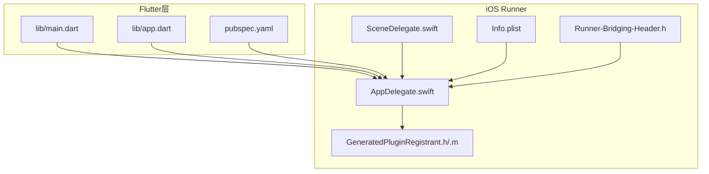
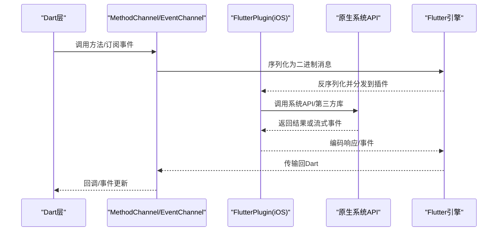
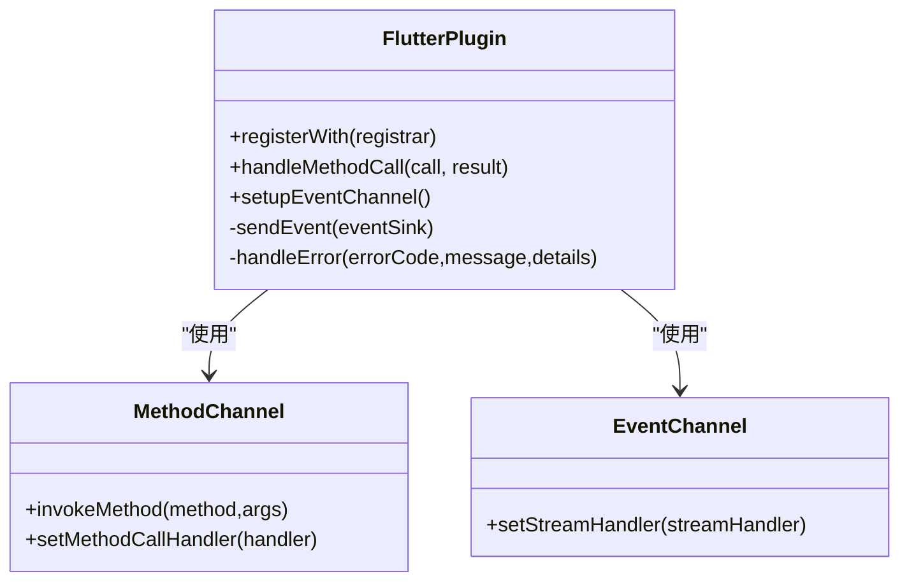
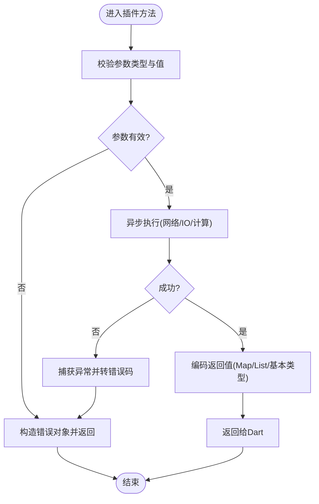
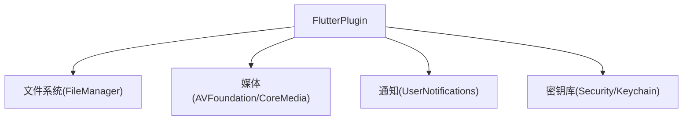
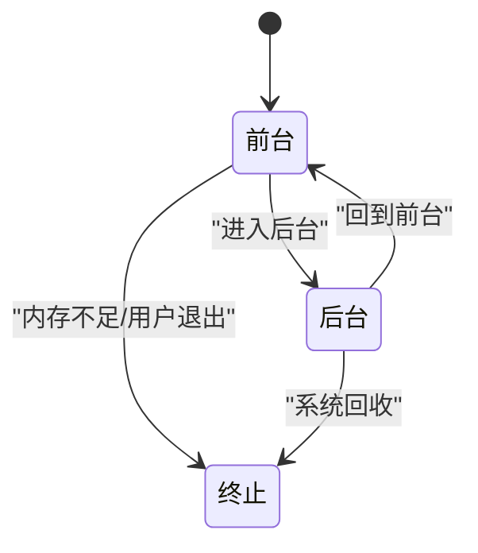
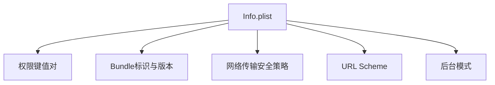
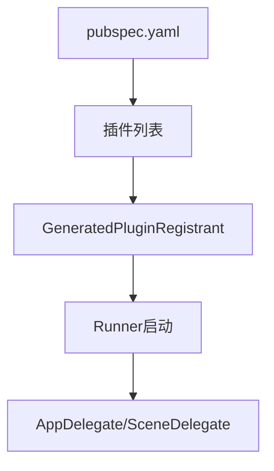

# iOS平台集成

<cite>
**本文引用的文件**   
- [AppDelegate.swift](file://flutter_legado/ios/Runner/AppDelegate.swift)
- [SceneDelegate.swift](file://flutter_legado/ios/Runner/SceneDelegate.swift)
- [Info.plist](file://flutter_legado/ios/Runner/Info.plist)
- [GeneratedPluginRegistrant.h](file://flutter_legado/ios/Runner/GeneratedPluginRegistrant.h)
- [GeneratedPluginRegistrant.m](file://flutter_legado/ios/Runner/GeneratedPluginRegistrant.m)
- [Runner-Bridging-Header.h](file://flutter_legado/ios/Runner/Runner-Bridging-Header.h)
- [pubspec.yaml](file://flutter_legado/pubspec.yaml)
- [main.dart](file://flutter_legado/lib/main.dart)
- [app.dart](file://flutter_legado/lib/app.dart)
</cite>

## 目录
1. [简介](#简介)
2. [项目结构](#项目结构)
3. [核心组件](#核心组件)
4. [架构总览](#架构总览)
5. [详细组件分析](#详细组件分析)
6. [依赖关系分析](#依赖关系分析)
7. [性能考虑](#性能考虑)
8. [故障排查指南](#故障排查指南)
9. [结论](#结论)
10. [附录](#附录) 

## 简介
本文件面向在iOS平台上集成Flutter与原生代码的开发者，系统阐述Flutter与iOS之间的桥接机制（FlutterPlugin、MethodChannel、EventChannel）、Objective-C/Swift桥接要点（类型转换、错误处理、异步操作）、iOS系统API集成（文件系统、媒体框架、推送通知、Keychain安全存储）、iOS特定功能（生命周期管理、后台任务、内存警告），以及应用配置（Info.plist、权限声明、Bundle配置）和性能优化与调试技巧。文档以仓库中的iOS工程结构与关键入口为依据，提供可操作的实践指导。

## 项目结构
Flutter工程的iOS端位于 flutter_legado/ios 目录，核心包括：
- Runner 目标：包含应用启动、插件注册、桥接头文件与配置文件
- Flutter 引擎与构建产物：由Flutter工具链生成
- 资源与Storyboard：应用图标、启动画面等

图表来源 
- [AppDelegate.swift](file://flutter_legado/ios/Runner/AppDelegate.swift)
- [SceneDelegate.swift](file://flutter_legado/ios/Runner/SceneDelegate.swift)
- [Info.plist](file://flutter_legado/ios/Runner/Info.plist)
- [GeneratedPluginRegistrant.h](file://flutter_legado/ios/Runner/GeneratedPluginRegistrant.h)
- [GeneratedPluginRegistrant.m](file://flutter_legado/ios/Runner/GeneratedPluginRegistrant.m)
- [Runner-Bridging-Header.h](file://flutter_legado/ios/Runner/Runner-Bridging-Header.h)
- [main.dart](file://flutter_legado/lib/main.dart)
- [app.dart](file://flutter_legado/lib/app.dart)
- [pubspec.yaml](file://flutter_legado/pubspec.yaml)

章节来源
- [AppDelegate.swift](file://flutter_legado/ios/Runner/AppDelegate.swift)
- [SceneDelegate.swift](file://flutter_legado/ios/Runner/SceneDelegate.swift)
- [Info.plist](file://flutter_legado/ios/Runner/Info.plist)
- [GeneratedPluginRegistrant.h](file://flutter_legado/ios/Runner/GeneratedPluginRegistrant.h)
- [GeneratedPluginRegistrant.m](file://flutter_legado/ios/Runner/GeneratedPluginRegistrant.m)
- [Runner-Bridging-Header.h](file://flutter_legado/ios/Runner/Runner-Bridging-Header.h)
- [main.dart](file://flutter_legado/lib/main.dart)
- [app.dart](file://flutter_legado/lib/app.dart)
- [pubspec.yaml](file://flutter_legado/pubspec.yaml)

## 核心组件
- AppDelegate：负责应用生命周期事件转发给Flutter引擎，并作为原生侧扩展点（如URL Scheme、推送回调、后台任务等）。
- SceneDelegate：iOS 13+场景生命周期管理，将窗口与Flutter视图控制器关联。
- GeneratedPluginRegistrant：自动注册的Flutter插件入口，确保所有依赖插件在应用启动时初始化。
- Runner-Bridging-Header.h：Objective-C/Swift互操作桥接头文件，暴露必要接口供Swift调用。
- Info.plist：应用元数据、权限声明、URL Scheme、背景模式等配置。
- pubspec.yaml：Flutter侧依赖与插件声明，影响iOS端生成的插件注册。

章节来源
- [AppDelegate.swift](file://flutter_legado/ios/Runner/AppDelegate.swift)
- [SceneDelegate.swift](file://flutter_legado/ios/Runner/SceneDelegate.swift)
- [GeneratedPluginRegistrant.h](file://flutter_legado/ios/Runner/GeneratedPluginRegistrant.h)
- [GeneratedPluginRegistrant.m](file://flutter_legado/ios/Runner/GeneratedPluginRegistrant.m)
- [Runner-Bridging-Header.h](file://flutter_legado/ios/Runner/Runner-Bridging-Header.h)
- [Info.plist](file://flutter_legado/ios/Runner/Info.plist)
- [pubspec.yaml](file://flutter_legado/pubspec.yaml)

## 架构总览
Flutter与iOS原生通过以下层次协作：
- Flutter层：Dart代码通过MethodChannel/EventChannel与原生通信
- 插件层：FlutterPlugin实现具体能力，封装系统API
- 原生层：Objective-C/Swift调用系统框架，处理异步与错误
- 引擎层：Flutter Engine负责消息序列化、线程调度与UI渲染

图表来源 
- [AppDelegate.swift](file://flutter_legado/ios/Runner/AppDelegate.swift)
- [SceneDelegate.swift](file://flutter_legado/ios/Runner/SceneDelegate.swift)
- [GeneratedPluginRegistrant.h](file://flutter_legado/ios/Runner/GeneratedPluginRegistrant.h)
- [GeneratedPluginRegistrant.m](file://flutter_legado/ios/Runner/GeneratedPluginRegistrant.m)
- [main.dart](file://flutter_legado/lib/main.dart)
- [app.dart](file://flutter_legado/lib/app.dart)

## 详细组件分析

### Flutter与iOS桥接机制（FlutterPlugin、MethodChannel、EventChannel）
- MethodChannel：用于请求-响应模式的同步/异步调用。Dart侧发起调用，iOS侧在FlutterPlugin中实现对应方法名处理，返回结果或错误码。
- EventChannel：用于流式事件。iOS侧创建事件接收器，持续向Dart侧推送事件；Dart侧监听并处理。
- FlutterPlugin：iOS端实现类需遵循FlutterPlugin协议，注册通道名称与方法处理器，保证线程安全与异常捕获。

图表来源 
- [GeneratedPluginRegistrant.h](file://flutter_legado/ios/Runner/GeneratedPluginRegistrant.h)
- [GeneratedPluginRegistrant.m](file://flutter_legado/ios/Runner/GeneratedPluginRegistrant.m)
- [AppDelegate.swift](file://flutter_legado/ios/Runner/AppDelegate.swift)

章节来源
- [GeneratedPluginRegistrant.h](file://flutter_legado/ios/Runner/GeneratedPluginRegistrant.h)
- [GeneratedPluginRegistrant.m](file://flutter_legado/ios/Runner/GeneratedPluginRegistrant.m)
- [AppDelegate.swift](file://flutter_legado/ios/Runner/AppDelegate.swift)

### Objective-C/Swift桥接要点
- 桥接头文件：Runner-Bridging-Header.h用于暴露Objective-C接口给Swift调用，避免重复声明。
- 类型转换：Dart与Swift/Objective-C之间需进行基础类型与集合类型的映射（如String、Int、Bool、Map、List）。
- 错误处理：统一错误码与错误信息，避免崩溃；在Swift中使用Result或throws并在插件层转换为Flutter错误格式。
- 异步操作：使用DispatchQueue或async/await，确保在主线程更新UI，在后台线程执行耗时任务。

图表来源 
- [Runner-Bridging-Header.h](file://flutter_legado/ios/Runner/Runner-Bridging-Header.h)
- [AppDelegate.swift](file://flutter_legado/ios/Runner/AppDelegate.swift)

章节来源
- [Runner-Bridging-Header.h](file://flutter_legado/ios/Runner/Runner-Bridging-Header.h)
- [AppDelegate.swift](file://flutter_legado/ios/Runner/AppDelegate.swift)

### iOS系统API集成
- 文件系统访问：使用FileManager进行沙盒读写，注意路径权限与沙盒隔离。
- 媒体框架：AVFoundation用于音频播放/录制、视频处理；CoreMedia用于媒体数据处理。
- 推送通知：UserNotifications框架处理本地与远程通知，需在AppDelegate中注册与回调。
- Keychain安全存储：使用Security框架存取敏感信息，避免明文存储。

图表来源 
- [AppDelegate.swift](file://flutter_legado/ios/Runner/AppDelegate.swift)
- [GeneratedPluginRegistrant.m](file://flutter_legado/ios/Runner/GeneratedPluginRegistrant.m)

章节来源
- [AppDelegate.swift](file://flutter_legado/ios/Runner/AppDelegate.swift)
- [GeneratedPluginRegistrant.m](file://flutter_legado/ios/Runner/GeneratedPluginRegistrant.m)

### iOS特定功能
- 生命周期管理：AppDelegate与SceneDelegate分别处理应用级与场景级生命周期，需正确转发给Flutter。
- 后台任务处理：使用BGTaskScheduler或Background Modes启用后台下载、定位、音频等任务。
- 内存警告处理：在内存紧张时释放缓存、停止非关键任务，避免OOM。

图表来源 
- [AppDelegate.swift](file://flutter_legado/ios/Runner/AppDelegate.swift)
- [SceneDelegate.swift](file://flutter_legado/ios/Runner/SceneDelegate.swift)

章节来源
- [AppDelegate.swift](file://flutter_legado/ios/Runner/AppDelegate.swift)
- [SceneDelegate.swift](file://flutter_legado/ios/Runner/SceneDelegate.swift)

### iOS应用配置
- Info.plist：设置应用名称、版本、权限（相机、麦克风、相册、网络等）、URL Scheme、背景模式、NSAppTransportSecurity等。
- Bundle配置：CFBundleIdentifier、CFBundleName、CFBundleShortVersionString等。
- 权限声明：在Info.plist中添加所需权限键值对，并在运行时提示用户授权。

图表来源 
- [Info.plist](file://flutter_legado/ios/Runner/Info.plist)

章节来源
- [Info.plist](file://flutter_legado/ios/Runner/Info.plist)

## 依赖关系分析
Flutter侧依赖通过pubspec.yaml声明，影响iOS端插件自动生成与注册。关键依赖包括：
- Flutter SDK与平台支持
- 第三方插件（如网络、存储、媒体等）
- 自定义插件（如有）

图表来源 
- [pubspec.yaml](file://flutter_legado/pubspec.yaml)
- [GeneratedPluginRegistrant.h](file://flutter_legado/ios/Runner/GeneratedPluginRegistrant.h)
- [GeneratedPluginRegistrant.m](file://flutter_legado/ios/Runner/GeneratedPluginRegistrant.m)
- [AppDelegate.swift](file://flutter_legado/ios/Runner/AppDelegate.swift)
- [SceneDelegate.swift](file://flutter_legado/ios/Runner/SceneDelegate.swift)

章节来源
- [pubspec.yaml](file://flutter_legado/pubspec.yaml)
- [GeneratedPluginRegistrant.h](file://flutter_legado/ios/Runner/GeneratedPluginRegistrant.h)
- [GeneratedPluginRegistrant.m](file://flutter_legado/ios/Runner/GeneratedPluginRegistrant.m)
- [AppDelegate.swift](file://flutter_legado/ios/Runner/AppDelegate.swift)
- [SceneDelegate.swift](file://flutter_legado/ios/Runner/SceneDelegate.swift)

## 性能考虑
- 减少通道调用频率：批量处理与合并请求，降低序列化开销。
- 合理分配线程：I/O与计算在后台线程，UI更新在主线程。
- 内存管理：及时释放大对象，避免循环引用；在内存警告时主动清理缓存。
- 资源加载：懒加载与预加载结合，控制并发数量。
- 调试工具：使用Instruments、Xcode Memory Graph、Console日志定位问题。

## 故障排查指南
- 插件未注册：检查GeneratedPluginRegistrant是否包含依赖插件，确认pubspec.yaml已更新并重新生成。
- 通道方法未找到：核对MethodChannel名称与方法名一致，确保iOS侧已实现处理器。
- 权限被拒：检查Info.plist权限声明与运行时授权流程。
- 崩溃与异常：捕获并记录错误上下文，区分业务错误与系统异常。
- 性能瓶颈：使用Instruments分析CPU、内存、网络与磁盘I/O。

章节来源
- [GeneratedPluginRegistrant.h](file://flutter_legado/ios/Runner/GeneratedPluginRegistrant.h)
- [GeneratedPluginRegistrant.m](file://flutter_legado/ios/Runner/GeneratedPluginRegistrant.m)
- [Info.plist](file://flutter_legado/ios/Runner/Info.plist)
- [AppDelegate.swift](file://flutter_legado/ios/Runner/AppDelegate.swift)

## 结论
iOS平台集成需要清晰理解Flutter与原生之间的通信机制与生命周期管理。通过规范的FlutterPlugin实现、严谨的类型与错误处理、合理的系统API使用与配置管理，可实现稳定高效的跨平台能力。结合性能优化与调试技巧，可进一步提升用户体验与开发效率。

## 附录
- 最佳实践清单：
  - 统一错误码与日志规范
  - 严格权限申请与最小化原则
  - 异步任务超时与重试策略
  - 资源管理与内存监控
  - 自动化测试覆盖关键通道