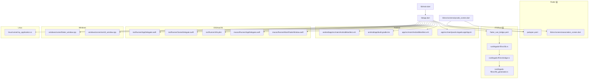
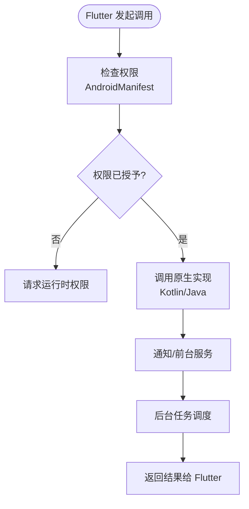
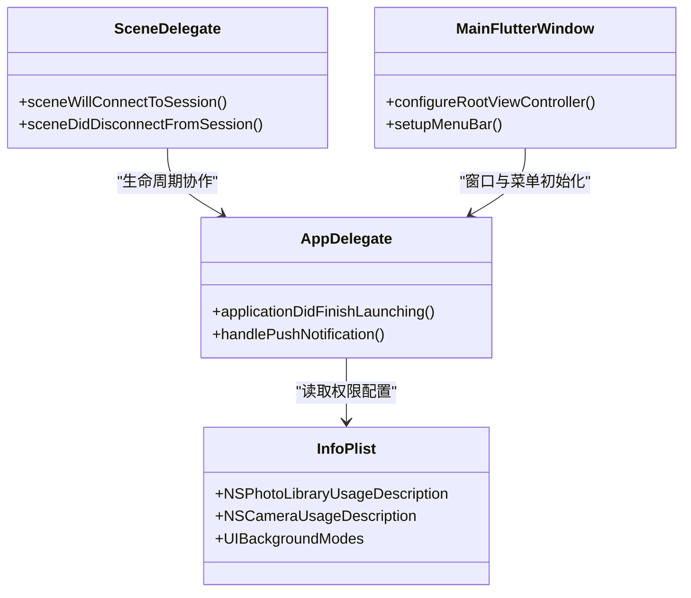
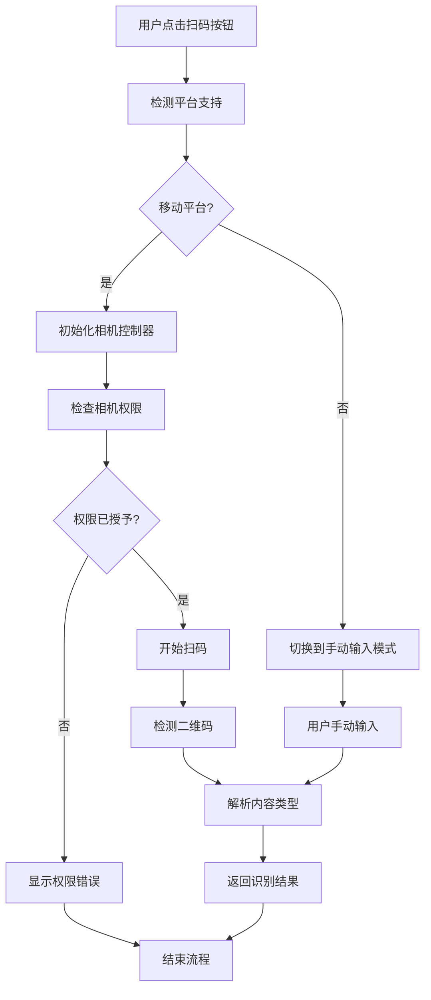
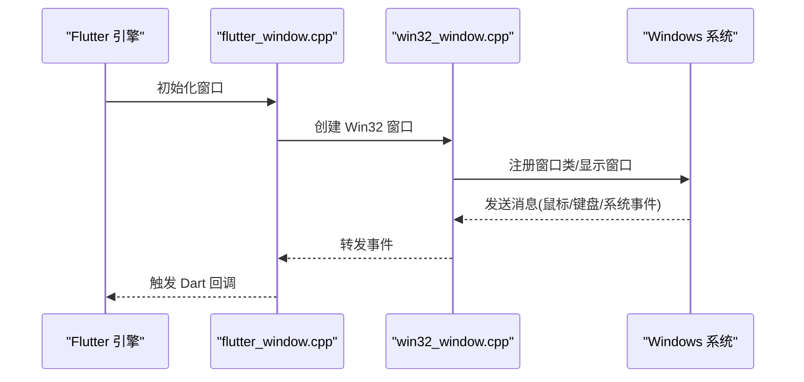
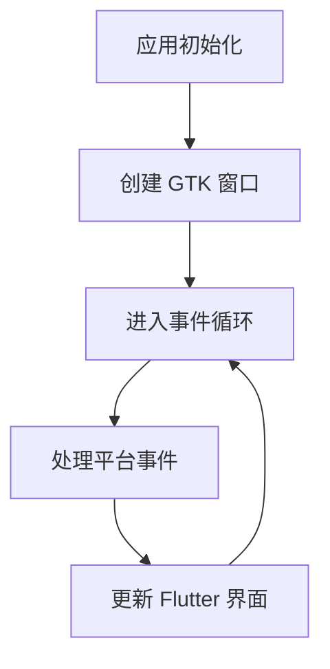
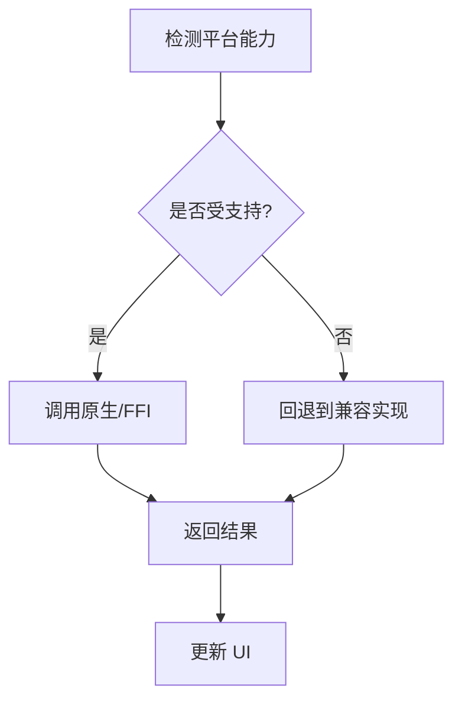
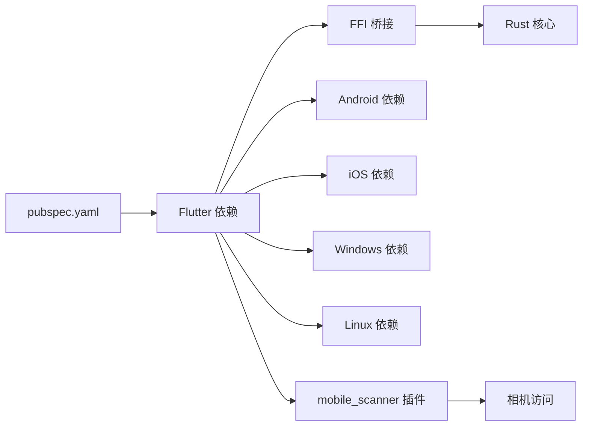

# 平台特定功能

<cite>
**本文引用的文件**   
- [flutter_legado/android/app/src/main/AndroidManifest.xml](file://flutter_legado/android/app/src/main/AndroidManifest.xml)
- [flutter_legado/android/app/build.gradle.kts](file://flutter_legado/android/app/build.gradle.kts)
- [flutter_legado/android/build.gradle.kts](file://flutter_legado/android/build.gradle.kts)
- [flutter_legado/ios/Runner/AppDelegate.swift](file://flutter_legado/ios/Runner/AppDelegate.swift)
- [flutter_legado/ios/Runner/SceneDelegate.swift](file://flutter_legado/ios/Runner/SceneDelegate.swift)
- [flutter_legado/ios/Runner/Info.plist](file://flutter_legado/ios/Runner/Info.plist)
- [flutter_legado/macos/Runner/AppDelegate.swift](file://flutter_legado/macos/Runner/AppDelegate.swift)
- [flutter_legado/macos/Runner/MainFlutterWindow.swift](file://flutter_legado/macos/Runner/MainFlutterWindow.swift)
- [flutter_legado/windows/runner/flutter_window.cpp](file://flutter_legado/windows/runner/flutter_window.cpp)
- [flutter_legado/windows/runner/win32_window.cpp](file://flutter_legado/windows/runner/win32_window.cpp)
- [flutter_legado/linux/runner/my_application.cc](file://flutter_legado/linux/runner/my_application.cc)
- [flutter_legado/lib/main.dart](file://flutter_legado/lib/main.dart)
- [flutter_legado/lib/app.dart](file://flutter_legado/lib/app.dart)
- [flutter_legado/pubspec.yaml](file://flutter_legado/pubspec.yaml)
- [flutter_legado/scripts/generate-bridge.sh](file://flutter_legado/scripts/generate-bridge.sh)
- [flutter_legado/scripts/generate-bridge.ps1](file://flutter_legado/scripts/generate-bridge.ps1)
- [flutter_legado/flutter_rust_bridge.yaml](file://flutter_legado/flutter_rust_bridge.yaml)
- [rust/legado-ffi/src/lib.rs](file://rust/legado-ffi/src/lib.rs)
- [rust/legado-ffi/src/bridge.rs](file://rust/legado-ffi/src/bridge.rs)
- [rust/legado-ffi/src/frb_generated.rs](file://rust/legado-ffi/src/frb_generated.rs)
- [app/src/main/AndroidManifest.xml](file://app/src/main/AndroidManifest.xml)
- [app/src/main/java/io.legado.app/App.kt](file://app/src/main/java/io.legado.app/App.kt)
- [flutter_legado/lib/src/screens/qrcode_screen.dart](file://flutter_legado/lib/src/screens/qrcode_screen.dart)
- [flutter_legado/lib/src/screens/association_screen.dart](file://flutter_legado/lib/src/screens/association_screen.dart)
</cite>

## 更新摘要
**所做更改**   
- 新增QR码扫描功能的平台特定配置说明
- 更新Android平台集成部分，添加相机权限配置详情
- 更新iOS/macOS平台集成部分，添加相机权限描述配置
- 新增QR码扫描功能的详细实现分析
- 更新依赖分析，包含mobile_scanner插件

## 目录
1. [简介](#简介)
2. [项目结构](#项目结构)
3. [核心组件](#核心组件)
4. [架构总览](#架构总览)
5. [详细组件分析](#详细组件分析)
6. [依赖分析](#依赖分析)
7. [性能考虑](#性能考虑)
8. [故障排查指南](#故障排查指南)
9. [结论](#结论)
10. [附录](#附录)

## 简介
本文件聚焦 Flutter 平台的"平台特定功能"集成与实现，覆盖 Android、iOS、桌面（Windows、macOS、Linux）的桥接方式、系统能力调用、通知与后台服务、窗口管理以及跨平台差异处理与兼容性方案。同时给出各平台的性能优化与资源管理建议，帮助开发者在保持跨平台一致性的前提下充分利用原生能力。**最新更新**：新增了QR码扫描功能的完整实现，包括Android和iOS平台的相机权限配置。

## 项目结构
Flutter 工程位于 flutter_legado 目录，包含 android、ios、windows、macos、linux、web 等目标平台；应用入口为 lib/main.dart，UI 初始化在 lib/app.dart；Rust 核心通过 flutter_rust_bridge 暴露 FFI 接口，供 Flutter 侧调用。Android 原生模块 app 提供系统级能力（权限、服务、通知等），并通过 JNI/插件机制与 Flutter 交互。**新增**：QR码扫描功能通过 mobile_scanner 插件实现，支持多平台相机访问。



**图表来源**
- [flutter_legado/lib/main.dart](file://flutter_legado/lib/main.dart)
- [flutter_legado/lib/app.dart](file://flutter_legado/lib/app.dart)
- [flutter_legado/pubspec.yaml](file://flutter_legado/pubspec.yaml)
- [flutter_legado/flutter_rust_bridge.yaml](file://flutter_legado/flutter_rust_bridge.yaml)
- [rust/legado-ffi/src/lib.rs](file://rust/legado-ffi/src/lib.rs)
- [rust/legado-ffi/src/bridge.rs](file://rust/legado-ffi/src/bridge.rs)
- [rust/legado-ffi/src/frb_generated.rs](file://rust/legado-ffi/src/frb_generated.rs)
- [flutter_legado/android/app/src/main/AndroidManifest.xml](file://flutter_legado/android/app/src/main/AndroidManifest.xml)
- [flutter_legado/android/app/build.gradle.kts](file://flutter_legado/android/app/build.gradle.kts)
- [app/src/main/AndroidManifest.xml](file://app/src/main/AndroidManifest.xml)
- [app/src/main/java/io.legado.app/App.kt](file://app/src/main/java/io.legado.app/App.kt)
- [flutter_legado/ios/Runner/AppDelegate.swift](file://flutter_legado/ios/Runner/AppDelegate.swift)
- [flutter_legado/ios/Runner/SceneDelegate.swift](file://flutter_legado/ios/Runner/SceneDelegate.swift)
- [flutter_legado/ios/Runner/Info.plist](file://flutter_legado/ios/Runner/Info.plist)
- [flutter_legado/macos/Runner/AppDelegate.swift](file://flutter_legado/macos/Runner/AppDelegate.swift)
- [flutter_legado/macos/Runner/MainFlutterWindow.swift](file://flutter_legado/macos/Runner/MainFlutterWindow.swift)
- [flutter_legado/windows/runner/flutter_window.cpp](file://flutter_legado/windows/runner/flutter_window.cpp)
- [flutter_legado/windows/runner/win32_window.cpp](file://flutter_legado/windows/runner/win32_window.cpp)
- [flutter_legado/linux/runner/my_application.cc](file://flutter_legado/linux/runner/my_application.cc)
- [flutter_legado/lib/src/screens/qrcode_screen.dart](file://flutter_legado/lib/src/screens/qrcode_screen.dart)
- [flutter_legado/lib/src/screens/association_screen.dart](file://flutter_legado/lib/src/screens/association_screen.dart)

章节来源
- [flutter_legado/lib/main.dart](file://flutter_legado/lib/main.dart)
- [flutter_legado/lib/app.dart](file://flutter_legado/lib/app.dart)
- [flutter_legado/pubspec.yaml](file://flutter_legado/pubspec.yaml)

## 核心组件
- Flutter 应用入口与初始化：main.dart 负责启动 Flutter 引擎并加载应用配置；app.dart 定义应用主题、路由与全局状态。
- Rust FFI 桥接：通过 flutter_rust_bridge 将 Rust 核心能力暴露给 Dart，生成 frb_generated.rs 作为双向通信桥梁。
- Android 原生能力：AndroidManifest 声明权限与服务；Gradle 构建脚本管理依赖与打包；App.kt 完成应用级初始化。
- iOS/macOS 原生能力：AppDelegate/SceneDelegate 管理生命周期；Info.plist 声明权限与特性；MainFlutterWindow 管理窗口。
- Windows/Linux 原生能力：flutter_window/win32_window 或 my_application 负责窗口创建、消息循环与平台事件。
- **新增** QR码扫描功能：通过 mobile_scanner 插件实现跨平台相机访问，支持Android/iOS实时扫码和桌面端降级处理。

章节来源
- [flutter_legado/lib/main.dart](file://flutter_legado/lib/main.dart)
- [flutter_legado/lib/app.dart](file://flutter_legado/lib/app.dart)
- [flutter_legado/flutter_rust_bridge.yaml](file://flutter_legado/flutter_rust_bridge.yaml)
- [rust/legado-ffi/src/lib.rs](file://rust/legado-ffi/src/lib.rs)
- [rust/legado-ffi/src/bridge.rs](file://rust/legado-ffi/src/bridge.rs)
- [rust/legado-ffi/src/frb_generated.rs](file://rust/legado-ffi/src/frb_generated.rs)
- [flutter_legado/android/app/src/main/AndroidManifest.xml](file://flutter_legado/android/app/src/main/AndroidManifest.xml)
- [flutter_legado/android/app/build.gradle.kts](file://flutter_legado/android/app/build.gradle.kts)
- [app/src/main/AndroidManifest.xml](file://app/src/main/AndroidManifest.xml)
- [app/src/main/java/io.legado.app/App.kt](file://app/src/main/java/io.legado.app/App.kt)
- [flutter_legado/ios/Runner/AppDelegate.swift](file://flutter_legado/ios/Runner/AppDelegate.swift)
- [flutter_legado/ios/Runner/SceneDelegate.swift](file://flutter_legado/ios/Runner/SceneDelegate.swift)
- [flutter_legado/ios/Runner/Info.plist](file://flutter_legado/ios/Runner/Info.plist)
- [flutter_legado/macos/Runner/AppDelegate.swift](file://flutter_legado/macos/Runner/AppDelegate.swift)
- [flutter_legado/macos/Runner/MainFlutterWindow.swift](file://flutter_legado/macos/Runner/MainFlutterWindow.swift)
- [flutter_legado/windows/runner/flutter_window.cpp](file://flutter_legado/windows/runner/flutter_window.cpp)
- [flutter_legado/windows/runner/win32_window.cpp](file://flutter_legado/windows/runner/win32_window.cpp)
- [flutter_legado/linux/runner/my_application.cc](file://flutter_legado/linux/runner/my_application.cc)
- [flutter_legado/lib/src/screens/qrcode_screen.dart](file://flutter_legado/lib/src/screens/qrcode_screen.dart)

## 架构总览
下图展示 Flutter 层、Rust FFI 层与各平台原生层的交互关系。Flutter 通过 FFI 调用 Rust 提供的稳定 API；Android/iOS/桌面平台分别通过各自的生命周期与系统 API 扩展能力（如权限、通知、后台任务、窗口管理等）。**新增**：QR码扫描功能通过 mobile_scanner 插件在各平台实现相机访问，并提供统一的Dart接口。

```mermaid
sequenceDiagram
participant UI as "Flutter UI<br/>lib/app.dart"
participant QR as "QR码扫描<br/>qrcode_screen.dart"
participant Bridge as "FFI 桥接<br/>frb_generated.rs"
participant Core as "Rust 核心<br/>legado-ffi/src/lib.rs"
participant And as "Android 原生<br/>AndroidManifest/App.kt"
participant IOS as "iOS/macOS 原生<br/>AppDelegate/Info.plist"
participant Win as "Windows 原生<br/>flutter_window.cpp"
participant Lin as "Linux 原生<br/>my_application.cc"
UI->>QR : 打开扫码页面
QR->>Bridge : 调用平台相关方法
Bridge->>Core : 转发到 Rust 实现
Core-->>Bridge : 返回结果/回调
Bridge-->>UI : 更新状态/渲染
Note over And,IOS : 平台能力由原生层提供
UI->>And : 请求权限/通知/后台服务
UI->>IOS : 请求推送/系统API
UI->>Win : 窗口管理/消息循环
UI->>Lin : 窗口管理/事件分发
```

**图表来源**
- [flutter_legado/lib/app.dart](file://flutter_legado/lib/app.dart)
- [flutter_legado/lib/src/screens/qrcode_screen.dart](file://flutter_legado/lib/src/screens/qrcode_screen.dart)
- [rust/legado-ffi/src/frb_generated.rs](file://rust/legado-ffi/src/frb_generated.rs)
- [rust/legado-ffi/src/lib.rs](file://rust/legado-ffi/src/lib.rs)
- [flutter_legado/android/app/src/main/AndroidManifest.xml](file://flutter_legado/android/app/src/main/AndroidManifest.xml)
- [app/src/main/java/io.legado.app/App.kt](file://app/src/main/java/io.legado.app/App.kt)
- [flutter_legado/ios/Runner/AppDelegate.swift](file://flutter_legado/ios/Runner/AppDelegate.swift)
- [flutter_legado/ios/Runner/Info.plist](file://flutter_legado/ios/Runner/Info.plist)
- [flutter_legado/windows/runner/flutter_window.cpp](file://flutter_legado/windows/runner/flutter_window.cpp)
- [flutter_legado/linux/runner/my_application.cc](file://flutter_legado/linux/runner/my_application.cc)

## 详细组件分析

### Android 平台集成
- 权限与清单：AndroidManifest 声明网络、存储、通知、前台服务等权限；Gradle 构建脚本管理依赖与打包。
- **新增** 相机权限配置：添加了 `CAMERA` 权限和 `hardware.camera` 功能声明，支持QR码扫描功能。
- JNI/插件桥接：通过 platform channel 或 FFI 将 Flutter 调用映射到 Kotlin/Java 实现；App.kt 进行应用级初始化。
- 通知服务：使用系统通知通道与前台服务保证音频/下载等任务的稳定性。
- 后台服务：通过前台服务与 JobScheduler/WorkManager 执行定时任务与长时任务。



**图表来源**
- [flutter_legado/android/app/src/main/AndroidManifest.xml](file://flutter_legado/android/app/src/main/AndroidManifest.xml)
- [flutter_legado/android/app/build.gradle.kts](file://flutter_legado/android/app/build.gradle.kts)
- [app/src/main/java/io.legado.app/App.kt](file://app/src/main/java/io.legado.app/App.kt)

**更新** 相机权限配置详情：
- 第24行：`<uses-permission android:name="android.permission.CAMERA" />` - 相机访问权限
- 第25行：`<uses-feature android:name="android.hardware.camera" android:required="false" />` - 可选相机硬件功能

章节来源
- [flutter_legado/android/app/src/main/AndroidManifest.xml](file://flutter_legado/android/app/src/main/AndroidManifest.xml)
- [flutter_legado/android/app/build.gradle.kts](file://flutter_legado/android/app/build.gradle.kts)
- [app/src/main/java/io.legado.app/App.kt](file://app/src/main/java/io.legado.app/App.kt)

### iOS/macOS 平台集成
- 生命周期与桥接：AppDelegate/SceneDelegate 管理应用生命周期；通过 Objective-C/Swift 桥接调用系统 API。
- **新增** 相机权限描述：在 Info.plist 中添加了 `NSCameraUsageDescription` 键，值为"需要相机权限以扫描二维码导入书源"。
- 系统 API 调用：网络、文件系统、Keychain、推送通知等通过系统框架访问。
- 推送通知：在 Info.plist 中声明能力，并在 AppDelegate/SceneDelegate 中处理注册与回调。
- 窗口管理：macOS 使用 MainFlutterWindow 管理窗口与菜单。



**图表来源**
- [flutter_legado/ios/Runner/AppDelegate.swift](file://flutter_legado/ios/Runner/AppDelegate.swift)
- [flutter_legado/ios/Runner/SceneDelegate.swift](file://flutter_legado/ios/Runner/SceneDelegate.swift)
- [flutter_legado/ios/Runner/Info.plist](file://flutter_legado/ios/Runner/Info.plist)
- [flutter_legado/macos/Runner/MainFlutterWindow.swift](file://flutter_legado/macos/Runner/MainFlutterWindow.swift)

**更新** iOS相机权限配置：
- 第29-30行：`NSCameraUsageDescription` 键值对，提供相机权限使用说明

章节来源
- [flutter_legado/ios/Runner/AppDelegate.swift](file://flutter_legado/ios/Runner/AppDelegate.swift)
- [flutter_legado/ios/Runner/SceneDelegate.swift](file://flutter_legado/ios/Runner/SceneDelegate.swift)
- [flutter_legado/ios/Runner/Info.plist](file://flutter_legado/ios/Runner/Info.plist)
- [flutter_legado/macos/Runner/MainFlutterWindow.swift](file://flutter_legado/macos/Runner/MainFlutterWindow.swift)

### QR码扫描功能实现
**新增** QR码扫描功能通过 mobile_scanner 插件实现，支持多平台相机访问：

- **移动端支持**：Android/iOS 启用相机实时扫码，使用 MobileScannerController 控制相机
- **桌面端降级**：Windows/Linux 显示手动输入模式，提示用户当前平台未启用相机扫码
- **内容识别**：自动识别 legado:// 协议链接、HTTP URL、书源 JSON、文本口令等多种格式
- **错误处理**：完善的相机权限拒绝和无相机设备的错误提示



**图表来源**
- [flutter_legado/lib/src/screens/qrcode_screen.dart](file://flutter_legado/lib/src/screens/qrcode_screen.dart)
- [flutter_legado/lib/src/screens/association_screen.dart](file://flutter_legado/lib/src/screens/association_screen.dart)

章节来源
- [flutter_legado/lib/src/screens/qrcode_screen.dart](file://flutter_legado/lib/src/screens/qrcode_screen.dart)
- [flutter_legado/lib/src/screens/association_screen.dart](file://flutter_legado/lib/src/screens/association_screen.dart)

### Windows 平台支持
- 窗口管理：flutter_window.cpp 与 win32_window.cpp 负责创建窗口、处理消息循环与平台事件。
- 系统集成：可通过 Win32 API 访问剪贴板、文件系统、注册表等。
- 构建与运行：CMake 与 Visual Studio 工具链配合 Flutter 构建。
- **新增** QR码扫描降级：不支持相机功能，显示手动输入界面。



**图表来源**
- [flutter_legado/windows/runner/flutter_window.cpp](file://flutter_legado/windows/runner/flutter_window.cpp)
- [flutter_legado/windows/runner/win32_window.cpp](file://flutter_legado/windows/runner/win32_window.cpp)

章节来源
- [flutter_legado/windows/runner/flutter_window.cpp](file://flutter_legado/windows/runner/flutter_window.cpp)
- [flutter_legado/windows/runner/win32_window.cpp](file://flutter_legado/windows/runner/win32_window.cpp)

### Linux 平台支持
- 窗口管理：my_application.cc 基于 GTK/GLib 创建窗口与事件循环。
- 系统集成：通过 GLib/GIO 访问文件系统、设置、通知等。
- 构建与运行：CMake 与系统包管理器配合 Flutter 构建。
- **新增** QR码扫描降级：不支持相机功能，显示手动输入界面。



**图表来源**
- [flutter_legado/linux/runner/my_application.cc](file://flutter_legado/linux/runner/my_application.cc)

章节来源
- [flutter_legado/linux/runner/my_application.cc](file://flutter_legado/linux/runner/my_application.cc)

### 跨平台差异处理与兼容性
- 条件编译与运行时检测：使用 Platform.isXxx 与 Feature Flags 区分平台行为。
- 统一抽象层：在 Flutter 层封装平台差异，向下调用 FFI 或平台 Channel。
- 降级策略：对不支持的能力提供替代方案或提示用户。
- 构建脚本：generate-bridge.sh/.ps1 与 flutter_rust_bridge.yaml 确保多平台 FFI 一致性。
- **新增** QR码扫描跨平台处理：移动端启用相机，桌面端降级为手动输入。



**图表来源**
- [flutter_legado/scripts/generate-bridge.sh](file://flutter_legado/scripts/generate-bridge.sh)
- [flutter_legado/scripts/generate-bridge.ps1](file://flutter_legado/scripts/generate-bridge.ps1)
- [flutter_legado/flutter_rust_bridge.yaml](file://flutter_legado/flutter_rust_bridge.yaml)

章节来源
- [flutter_legado/scripts/generate-bridge.sh](file://flutter_legado/scripts/generate-bridge.sh)
- [flutter_legado/scripts/generate-bridge.ps1](file://flutter_legado/scripts/generate-bridge.ps1)
- [flutter_legado/flutter_rust_bridge.yaml](file://flutter_legado/flutter_rust_bridge.yaml)

## 依赖分析
Flutter 层依赖 pubspec.yaml 中的插件与库；Rust FFI 通过 flutter_rust_bridge 生成跨语言绑定；Android/iOS/桌面平台依赖各自的构建系统与原生库。



**图表来源**
- [flutter_legado/pubspec.yaml](file://flutter_legado/pubspec.yaml)
- [flutter_legado/flutter_rust_bridge.yaml](file://flutter_legado/flutter_rust_bridge.yaml)
- [rust/legado-ffi/src/lib.rs](file://rust/legado-ffi/src/lib.rs)

**更新** 新增依赖：
- mobile_scanner: ^7.0.0 - QR码扫描插件，支持多平台相机访问

章节来源
- [flutter_legado/pubspec.yaml](file://flutter_legado/pubspec.yaml)
- [flutter_legado/flutter_rust_bridge.yaml](file://flutter_legado/flutter_rust_bridge.yaml)

## 性能考虑
- Android
  - 合理声明权限与最小化依赖，减少 APK 体积与启动时间。
  - 使用前台服务与通知通道保障后台任务稳定性，避免被系统回收。
  - 启用 ProGuard/R8 规则裁剪无用代码。
  - **新增** 相机权限按需申请，避免不必要的权限占用。
- iOS/macOS
  - 按需开启后台模式，避免不必要的后台唤醒。
  - 合理使用 Keychain 与缓存，降低频繁 IO 开销。
  - **新增** 相机权限描述清晰，提升用户授权率。
- Windows/Linux
  - 控制窗口大小与刷新频率，减少重绘压力。
  - 使用异步 I/O 与线程池处理耗时任务。
  - **新增** 桌面端禁用相机功能，避免不必要的资源消耗。
- 通用
  - 通过 FFI 批量传输数据，减少跨语言调用次数。
  - 使用内存池与对象复用，降低 GC 压力。
  - **新增** QR码扫描结果缓存，避免重复解析。

[本节为通用指导，不直接分析具体文件]

## 故障排查指南
- Android
  - 权限未授予导致崩溃：检查 AndroidManifest 与运行时权限流程。
  - 后台服务被杀：确认前台服务与通知通道配置正确。
  - **新增** 相机权限问题：检查 CAMERA 权限声明和用户授权状态。
- iOS/macOS
  - 推送通知无效：检查 Info.plist 能力与 AppDelegate/SceneDelegate 回调。
  - 沙盒限制导致文件读写失败：确认路径与权限。
  - **新增** 相机权限被拒：检查 NSCameraUsageDescription 配置和用户授权。
- Windows/Linux
  - 窗口无法创建：检查 CMake 配置与依赖库版本。
  - 事件丢失：确认事件循环与消息队列未被阻塞。
  - **新增** 相机功能不可用：确认平台支持和降级逻辑正确。
- FFI/Rust
  - 类型不匹配：核对 flutter_rust_bridge.yaml 与生成的 frb_generated.rs。
  - 崩溃定位：查看 Rust 日志与平台堆栈。
- **新增** QR码扫描
  - 扫码无响应：检查 mobile_scanner 插件依赖和相机权限。
  - 识别失败：验证二维码格式和内容编码。
  - 内存泄漏：确认 MobileScannerController 正确释放。

章节来源
- [flutter_legado/android/app/src/main/AndroidManifest.xml](file://flutter_legado/android/app/src/main/AndroidManifest.xml)
- [flutter_legado/ios/Runner/Info.plist](file://flutter_legado/ios/Runner/Info.plist)
- [flutter_legado/ios/Runner/AppDelegate.swift](file://flutter_legado/ios/Runner/AppDelegate.swift)
- [flutter_legado/ios/Runner/SceneDelegate.swift](file://flutter_legado/ios/Runner/SceneDelegate.swift)
- [flutter_legado/windows/runner/flutter_window.cpp](file://flutter_legado/windows/runner/flutter_window.cpp)
- [flutter_legado/linux/runner/my_application.cc](file://flutter_legado/linux/runner/my_application.cc)
- [flutter_legado/flutter_rust_bridge.yaml](file://flutter_legado/flutter_rust_bridge.yaml)
- [rust/legado-ffi/src/frb_generated.rs](file://rust/legado-ffi/src/frb_generated.rs)
- [flutter_legado/lib/src/screens/qrcode_screen.dart](file://flutter_legado/lib/src/screens/qrcode_screen.dart)

## 结论
本项目通过 Flutter + Rust FFI + 多平台原生的分层架构，实现了跨平台一致的体验与强大的原生能力扩展。Android/iOS/桌面平台各司其职，结合统一的 FFI 桥接与构建脚本，确保了可维护性与可扩展性。**最新更新**：QR码扫描功能的成功实现进一步增强了应用的实用性，通过 mobile_scanner 插件提供了跨平台的相机访问能力，同时在桌面端优雅降级为手动输入模式。遵循本文的性能优化与故障排查建议，可进一步提升应用的稳定性与用户体验。

## 附录
- 构建与生成脚本：scripts/generate-bridge.sh/.ps1 用于生成 FFI 绑定；Makefile 与 Gradle/CMake 脚本用于多平台构建。
- 文档与规范：README.md、DEVELOPMENT.md、PROGRESS.md 提供开发流程与进度说明。
- **新增** QR码扫描相关：qrcode_screen.dart 实现完整的扫码功能，association_screen.dart 集成扫码导入流程。

[本节为补充信息，不直接分析具体文件]