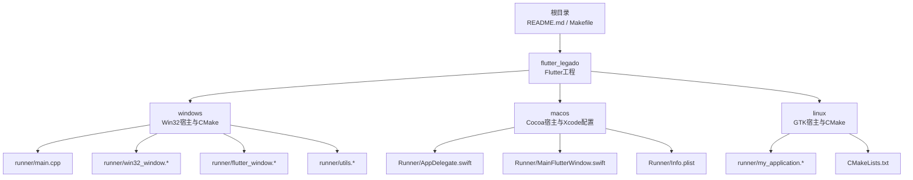
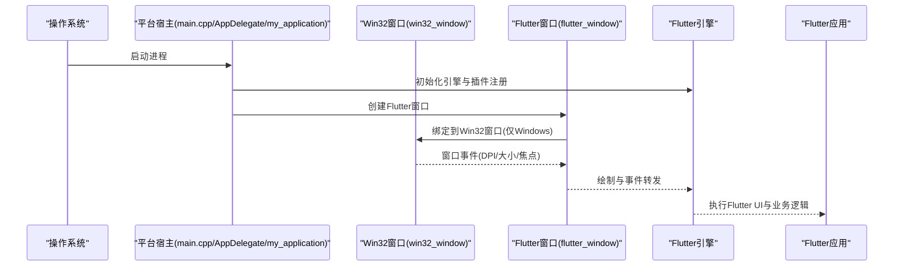
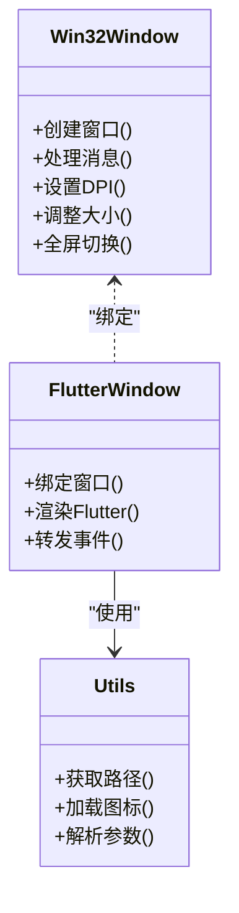
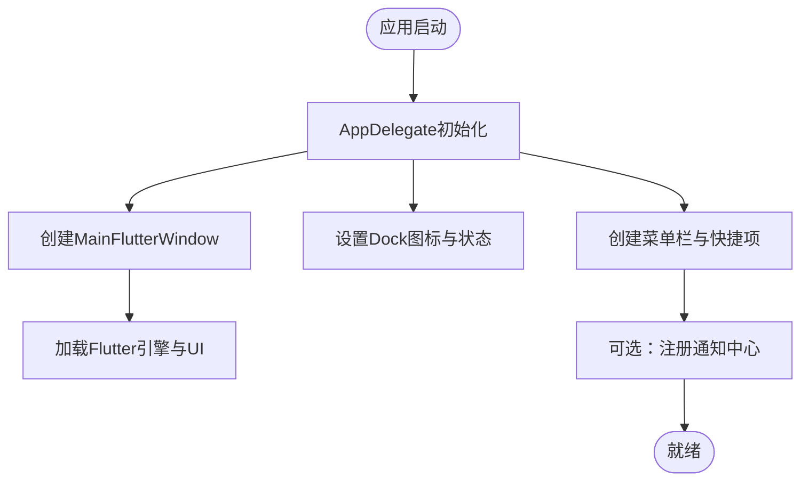
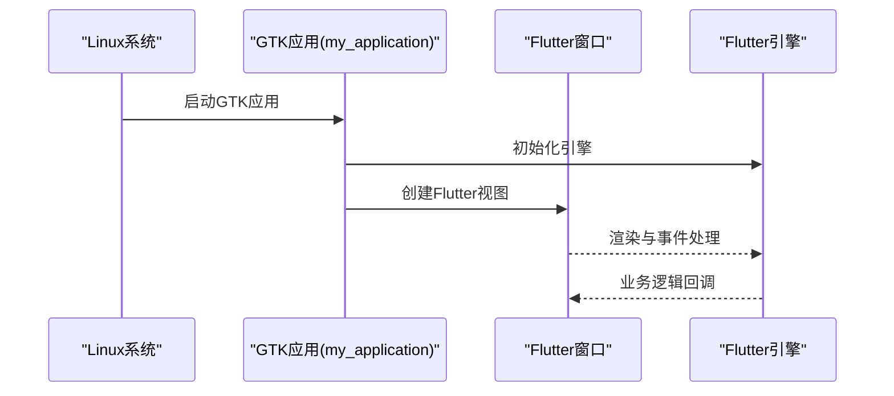
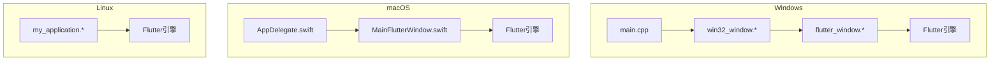

# 桌面平台支持

<cite>
**本文引用的文件**   
- [README.md](file://README.md)
- [Makefile](file://Makefile)
- [flutter_legado/README.md](file://flutter_legado/README.md)
- [flutter_legado/pubspec.yaml](file://flutter_legado/pubspec.yaml)
- [flutter_legado/windows/CMakeLists.txt](file://flutter_legado/windows/CMakeLists.txt)
- [flutter_legado/windows/runner/main.cpp](file://flutter_legado/windows/runner/main.cpp)
- [flutter_legado/windows/runner/win32_window.h](file://flutter_legado/windows/runner/win32_window.h)
- [flutter_legado/windows/runner/win32_window.cpp](file://flutter_legado/windows/runner/win32_window.cpp)
- [flutter_legado/windows/runner/flutter_window.h](file://flutter_legado/windows/runner/flutter_window.h)
- [flutter_legado/windows/runner/flutter_window.cpp](file://flutter_legado/windows/runner/flutter_window.cpp)
- [flutter_legado/windows/runner/utils.h](file://flutter_legado/windows/runner/utils.h)
- [flutter_legado/windows/runner/utils.cpp](file://flutter_legado/windows/runner/utils.cpp)
- [flutter_legado/macos/Runner/AppDelegate.swift](file://flutter_legado/macos/Runner/AppDelegate.swift)
- [flutter_legado/macos/Runner/MainFlutterWindow.swift](file://flutter_legado/macos/Runner/MainFlutterWindow.swift)
- [flutter_legado/macos/Runner/Info.plist](file://flutter_legado/macos/Runner/Info.plist)
- [flutter_legado/linux/runner/my_application.h](file://flutter_legado/linux/runner/my_application.h)
- [flutter_legado/linux/runner/my_application.cc](file://flutter_legado/linux/runner/my_application.cc)
- [flutter_legado/linux/CMakeLists.txt](file://flutter_legado/linux/CMakeLists.txt)
- [flutter_legado/scripts/build-windows.ps1](file://flutter_legado/scripts/build-windows.ps1)
- [flutter_legado/scripts/build-windows.bat](file://flutter_legado/scripts/build-windows.bat)
</cite>

## 目录
1. [简介](#简介)
2. [项目结构](#项目结构)
3. [核心组件](#核心组件)
4. [架构总览](#架构总览)
5. [详细组件分析](#详细组件分析)
6. [依赖分析](#依赖分析)
7. [性能考虑](#性能考虑)
8. [故障排查指南](#故障排查指南)
9. [结论](#结论)
10. [附录](#附录)

## 简介
本文件面向Legado项目的桌面端（Windows、macOS、Linux）集成与使用，重点说明：
- Windows平台集成要点：Win32窗口管理、进程入口、资源与工具函数等。
- macOS平台集成要点：Cocoa框架、应用生命周期、菜单与通知相关配置位置。
- Linux平台集成要点：GTK/原生窗口、X11/Wayland运行环境、打包产物。
- 跨平台桌面特性：窗口尺寸调整、全屏模式、多显示器支持的通用实现方式与注意事项。
- 桌面交互能力：键盘快捷键、鼠标手势、拖放操作在Flutter中的接入点与扩展建议。
- 构建与发布流程：Windows打包脚本、各平台构建配置与产物路径。

本项目采用Flutter作为跨平台UI框架，桌面端通过各自平台的原生宿主（win32_window、MainFlutterWindow、my_application）承载Flutter引擎，业务逻辑由Flutter层提供，系统级能力通过插件或平台通道调用。

## 项目结构
桌面端代码主要位于 flutter_legado 子工程内，包含Windows、macOS、Linux三个平台的原生宿主与构建配置；顶层 README 与 Makefile 提供总体说明与常用命令。

图表来源 
- [flutter_legado/README.md](file://flutter_legado/README.md)
- [flutter_legado/windows/CMakeLists.txt](file://flutter_legado/windows/CMakeLists.txt)
- [flutter_legado/macos/Runner/AppDelegate.swift](file://flutter_legado/macos/Runner/AppDelegate.swift)
- [flutter_legado/linux/CMakeLists.txt](file://flutter_legado/linux/CMakeLists.txt)

章节来源
- [README.md](file://README.md)
- [Makefile](file://Makefile)
- [flutter_legado/README.md](file://flutter_legado/README.md)

## 核心组件
- Windows宿主与窗口管理
  - 入口与消息循环：main.cpp负责初始化并启动Flutter引擎。
  - Win32窗口封装：win32_window.h/.cpp提供窗口创建、事件处理、DPI与缩放适配。
  - Flutter窗口桥接：flutter_window.h/.cpp将Flutter渲染嵌入Win32窗口。
  - 工具函数：utils.h/.cpp提供路径、命令行参数、图标加载等辅助能力。
- macOS宿主与系统集成
  - AppDelegate.swift：应用生命周期、委托方法、菜单栏与通知中心相关设置。
  - MainFlutterWindow.swift：Flutter视图容器与窗口行为控制。
  - Info.plist：权限、CFBundle标识、Dock图标与LSMinimumSystemVersion等元数据。
- Linux宿主与打包
  - my_application.h/.cc：GTK应用入口、窗口创建与事件循环。
  - CMakeLists.txt：依赖查找、目标链接与安装规则。

章节来源
- [flutter_legado/windows/runner/main.cpp](file://flutter_legado/windows/runner/main.cpp)
- [flutter_legado/windows/runner/win32_window.h](file://flutter_legado/windows/runner/win32_window.h)
- [flutter_legado/windows/runner/win32_window.cpp](file://flutter_legado/windows/runner/win32_window.cpp)
- [flutter_legado/windows/runner/flutter_window.h](file://flutter_legado/windows/runner/flutter_window.h)
- [flutter_legado/windows/runner/flutter_window.cpp](file://flutter_legado/windows/runner/flutter_window.cpp)
- [flutter_legado/windows/runner/utils.h](file://flutter_legado/windows/runner/utils.h)
- [flutter_legado/windows/runner/utils.cpp](file://flutter_legado/windows/runner/utils.cpp)
- [flutter_legado/macos/Runner/AppDelegate.swift](file://flutter_legado/macos/Runner/AppDelegate.swift)
- [flutter_legado/macos/Runner/MainFlutterWindow.swift](file://flutter_legado/macos/Runner/MainFlutterWindow.swift)
- [flutter_legado/macos/Runner/Info.plist](file://flutter_legado/macos/Runner/Info.plist)
- [flutter_legado/linux/runner/my_application.h](file://flutter_legado/linux/runner/my_application.h)
- [flutter_legado/linux/runner/my_application.cc](file://flutter_legado/linux/runner/my_application.cc)
- [flutter_legado/linux/CMakeLists.txt](file://flutter_legado/linux/CMakeLists.txt)

## 架构总览
下图展示Flutter引擎在各平台宿主中的嵌入关系与关键调用链。

图表来源 
- [flutter_legado/windows/runner/main.cpp](file://flutter_legado/windows/runner/main.cpp)
- [flutter_legado/windows/runner/win32_window.cpp](file://flutter_legado/windows/runner/win32_window.cpp)
- [flutter_legado/windows/runner/flutter_window.cpp](file://flutter_legado/windows/runner/flutter_window.cpp)
- [flutter_legado/macos/Runner/AppDelegate.swift](file://flutter_legado/macos/Runner/AppDelegate.swift)
- [flutter_legado/linux/runner/my_application.cc](file://flutter_legado/linux/runner/my_application.cc)

## 详细组件分析

### Windows平台集成
- 窗口管理与Win32 API
  - win32_window.h/.cpp封装了窗口类、消息循环、DPI感知、缩放与显示适配。
  - flutter_window.h/.cpp负责Flutter渲染表面与窗口句柄的绑定。
  - main.cpp完成进程入口、命令行解析、图标与资源加载、引擎启动。
- 文件系统与注册表
  - 文件访问通常通过Flutter侧的文件系统API或平台通道调用；如需原生能力，可在win32_window中扩展Win32 API（如路径、I/O）。
  - 注册表操作建议在专用模块中封装，避免侵入窗口层；可通过平台通道暴露给Flutter。
- 构建与打包
  - windows/CMakeLists.txt定义目标、依赖与资源链接。
  - scripts/build-windows.ps1/.bat用于自动化构建与打包（例如生成安装包或可执行文件）。

图表来源 
- [flutter_legado/windows/runner/win32_window.h](file://flutter_legado/windows/runner/win32_window.h)
- [flutter_legado/windows/runner/win32_window.cpp](file://flutter_legado/windows/runner/win32_window.cpp)
- [flutter_legado/windows/runner/flutter_window.h](file://flutter_legado/windows/runner/flutter_window.h)
- [flutter_legado/windows/runner/flutter_window.cpp](file://flutter_legado/windows/runner/flutter_window.cpp)
- [flutter_legado/windows/runner/utils.h](file://flutter_legado/windows/runner/utils.h)
- [flutter_legado/windows/runner/utils.cpp](file://flutter_legado/windows/runner/utils.cpp)

章节来源
- [flutter_legado/windows/CMakeLists.txt](file://flutter_legado/windows/CMakeLists.txt)
- [flutter_legado/windows/runner/main.cpp](file://flutter_legado/windows/runner/main.cpp)
- [flutter_legado/windows/runner/win32_window.h](file://flutter_legado/windows/runner/win32_window.h)
- [flutter_legado/windows/runner/win32_window.cpp](file://flutter_legado/windows/runner/win32_window.cpp)
- [flutter_legado/windows/runner/flutter_window.h](file://flutter_legado/windows/runner/flutter_window.h)
- [flutter_legado/windows/runner/flutter_window.cpp](file://flutter_legado/windows/runner/flutter_window.cpp)
- [flutter_legado/windows/runner/utils.h](file://flutter_legado/windows/runner/utils.h)
- [flutter_legado/windows/runner/utils.cpp](file://flutter_legado/windows/runner/utils.cpp)
- [flutter_legado/scripts/build-windows.ps1](file://flutter_legado/scripts/build-windows.ps1)
- [flutter_legado/scripts/build-windows.bat](file://flutter_legado/scripts/build-windows.bat)

### macOS平台集成
- Cocoa框架与生命周期
  - AppDelegate.swift负责应用启动、委托方法、菜单栏、Dock图标与通知中心相关设置。
  - MainFlutterWindow.swift承载Flutter视图，控制窗口行为（如最小化、全屏、隐藏菜单栏）。
- 配置文件与权限
  - Info.plist定义应用标识、版本、权限请求（如文件系统访问、网络）、Dock图标与最低系统版本。
- 菜单栏与通知
  - 菜单栏项通常在AppDelegate中创建；通知中心通过系统API发送本地通知。

图表来源 
- [flutter_legado/macos/Runner/AppDelegate.swift](file://flutter_legado/macos/Runner/AppDelegate.swift)
- [flutter_legado/macos/Runner/MainFlutterWindow.swift](file://flutter_legado/macos/Runner/MainFlutterWindow.swift)
- [flutter_legado/macos/Runner/Info.plist](file://flutter_legado/macos/Runner/Info.plist)

章节来源
- [flutter_legado/macos/Runner/AppDelegate.swift](file://flutter_legado/macos/Runner/AppDelegate.swift)
- [flutter_legado/macos/Runner/MainFlutterWindow.swift](file://flutter_legado/macos/Runner/MainFlutterWindow.swift)
- [flutter_legado/macos/Runner/Info.plist](file://flutter_legado/macos/Runner/Info.plist)

### Linux平台集成
- GTK宿主与窗口
  - my_application.h/.cc基于GTK创建窗口、事件循环与Flutter嵌入。
- X11/Wayland支持
  - 运行时依赖系统提供的图形后端（X11或Wayland），确保系统已安装相应库与驱动。
- 文件对话框与托盘
  - 文件对话框可通过Flutter插件或GTK原生日程调用；系统托盘需借助平台通道或第三方库。

图表来源 
- [flutter_legado/linux/runner/my_application.h](file://flutter_legado/linux/runner/my_application.h)
- [flutter_legado/linux/runner/my_application.cc](file://flutter_legado/linux/runner/my_application.cc)
- [flutter_legado/linux/CMakeLists.txt](file://flutter_legado/linux/CMakeLists.txt)

章节来源
- [flutter_legado/linux/runner/my_application.h](file://flutter_legado/linux/runner/my_application.h)
- [flutter_legado/linux/runner/my_application.cc](file://flutter_legado/linux/runner/my_application.cc)
- [flutter_legado/linux/CMakeLists.txt](file://flutter_legado/linux/CMakeLists.txt)

### 跨平台桌面特性
- 窗口大小调整与全屏模式
  - Windows：通过win32_window调整窗口样式与状态；Flutter侧监听窗口变化事件。
  - macOS：MainFlutterWindow控制全屏与隐藏菜单栏；注意与系统动画的协调。
  - Linux：GTK窗口属性设置；不同桌面环境对全屏行为存在差异。
- 多显示器支持
  - 使用Flutter的Display与View APIs获取屏幕信息；必要时结合平台通道读取原生显示枚举。
- 用户交互
  - 键盘快捷键：Flutter侧通过Shortcuts与Actions统一处理；平台特定组合键需在宿主层透传。
  - 鼠标手势与拖放：Flutter GestureDetector与Drag&Drop机制；复杂手势可在宿主层扩展。

章节来源
- [flutter_legado/windows/runner/win32_window.cpp](file://flutter_legado/windows/runner/win32_window.cpp)
- [flutter_legado/macos/Runner/MainFlutterWindow.swift](file://flutter_legado/macos/Runner/MainFlutterWindow.swift)
- [flutter_legado/linux/runner/my_application.cc](file://flutter_legado/linux/runner/my_application.cc)

### 构建与发布流程
- Windows
  - 使用scripts/build-windows.ps1或build-windows.bat进行构建与打包；产物通常为exe或安装包。
  - CMakeLists.txt定义编译选项、资源与依赖。
- macOS
  - 通过Xcode或命令行构建；Info.plist配置签名与权限；归档后分发。
- Linux
  - 使用CMake构建；根据发行版准备依赖包；打包为deb/rpm或AppImage。

章节来源
- [flutter_legado/scripts/build-windows.ps1](file://flutter_legado/scripts/build-windows.ps1)
- [flutter_legado/scripts/build-windows.bat](file://flutter_legado/scripts/build-windows.bat)
- [flutter_legado/windows/CMakeLists.txt](file://flutter_legado/windows/CMakeLists.txt)
- [flutter_legado/macos/Runner/Info.plist](file://flutter_legado/macos/Runner/Info.plist)
- [flutter_legado/linux/CMakeLists.txt](file://flutter_legado/linux/CMakeLists.txt)

## 依赖分析
- 平台宿主与Flutter引擎耦合紧密，窗口事件与渲染通过宿主桥接。
- Windows依赖Win32 API与CMake；macOS依赖Cocoa与Xcode；Linux依赖GTK与系统图形后端。
- 插件与平台通道是扩展系统能力的推荐方式，避免直接修改宿主层。

图表来源 
- [flutter_legado/windows/runner/main.cpp](file://flutter_legado/windows/runner/main.cpp)
- [flutter_legado/windows/runner/win32_window.cpp](file://flutter_legado/windows/runner/win32_window.cpp)
- [flutter_legado/windows/runner/flutter_window.cpp](file://flutter_legado/windows/runner/flutter_window.cpp)
- [flutter_legado/macos/Runner/AppDelegate.swift](file://flutter_legado/macos/Runner/AppDelegate.swift)
- [flutter_legado/macos/Runner/MainFlutterWindow.swift](file://flutter_legado/macos/Runner/MainFlutterWindow.swift)
- [flutter_legado/linux/runner/my_application.cc](file://flutter_legado/linux/runner/my_application.cc)

## 性能考虑
- 窗口事件处理应轻量，避免阻塞主线程；大任务下沉至后台协程或平台通道异步执行。
- DPI与缩放：在Windows上启用高DPI感知，减少重绘与布局抖动。
- 多显示器：缓存显示信息，避免频繁查询；全屏切换时优化渲染管线。
- 资源加载：图标与字体按需加载，避免启动耗时过长。

## 故障排查指南
- Windows
  - 若窗口无法显示或DPI异常，检查win32_window的DPI设置与缩放逻辑。
  - 构建失败时确认CMake与依赖库版本匹配。
- macOS
  - 权限不足导致文件访问失败，检查Info.plist权限声明与系统授权。
  - 菜单栏或通知不生效，核查AppDelegate中的注册顺序与事件回调。
- Linux
  - 图形后端缺失导致崩溃，确保X11/Wayland库与驱动已安装。
  - 文件对话框或托盘不可用，检查插件依赖与系统服务。

章节来源
- [flutter_legado/windows/runner/win32_window.cpp](file://flutter_legado/windows/runner/win32_window.cpp)
- [flutter_legado/macos/Runner/AppDelegate.swift](file://flutter_legado/macos/Runner/AppDelegate.swift)
- [flutter_legado/macos/Runner/Info.plist](file://flutter_legado/macos/Runner/Info.plist)
- [flutter_legado/linux/runner/my_application.cc](file://flutter_legado/linux/runner/my_application.cc)

## 结论
Legado的桌面端以Flutter为核心，通过各平台宿主（Win32、Cocoa、GTK）承载引擎与UI。窗口管理、系统菜单、通知与文件系统等能力可通过宿主层扩展或平台通道调用。构建与发布流程在各平台均有明确配置与脚本支持。建议在保持宿主层稳定的前提下，优先通过Flutter与插件体系实现功能扩展，以获得更好的跨平台一致性与可维护性。

## 附录
- 参考文件清单
  - Windows宿主与工具：[flutter_legado/windows/runner/main.cpp](file://flutter_legado/windows/runner/main.cpp)、[flutter_legado/windows/runner/win32_window.h](file://flutter_legado/windows/runner/win32_window.h)、[flutter_legado/windows/runner/win32_window.cpp](file://flutter_legado/windows/runner/win32_window.cpp)、[flutter_legado/windows/runner/flutter_window.h](file://flutter_legado/windows/runner/flutter_window.h)、[flutter_legado/windows/runner/flutter_window.cpp](file://flutter_legado/windows/runner/flutter_window.cpp)、[flutter_legado/windows/runner/utils.h](file://flutter_legado/windows/runner/utils.h)、[flutter_legado/windows/runner/utils.cpp](file://flutter_legado/windows/runner/utils.cpp)、[flutter_legado/windows/CMakeLists.txt](file://flutter_legado/windows/CMakeLists.txt)
  - macOS宿主与配置：[flutter_legado/macos/Runner/AppDelegate.swift](file://flutter_legado/macos/Runner/AppDelegate.swift)、[flutter_legado/macos/Runner/MainFlutterWindow.swift](file://flutter_legado/macos/Runner/MainFlutterWindow.swift)、[flutter_legado/macos/Runner/Info.plist](file://flutter_legado/macos/Runner/Info.plist)
  - Linux宿主与构建：[flutter_legado/linux/runner/my_application.h](file://flutter_legado/linux/runner/my_application.h)、[flutter_legado/linux/runner/my_application.cc](file://flutter_legado/linux/runner/my_application.cc)、[flutter_legado/linux/CMakeLists.txt](file://flutter_legado/linux/CMakeLists.txt)
  - 构建脚本：[flutter_legado/scripts/build-windows.ps1](file://flutter_legado/scripts/build-windows.ps1)、[flutter_legado/scripts/build-windows.bat](file://flutter_legado/scripts/build-windows.bat)
  - 工程说明：[README.md](file://README.md)、[Makefile](file://Makefile)、[flutter_legado/README.md](file://flutter_legado/README.md)、[flutter_legado/pubspec.yaml](file://flutter_legado/pubspec.yaml)