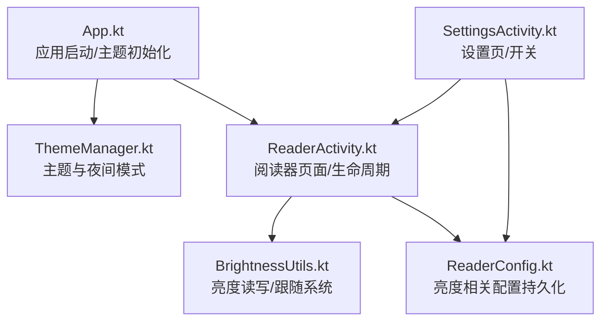
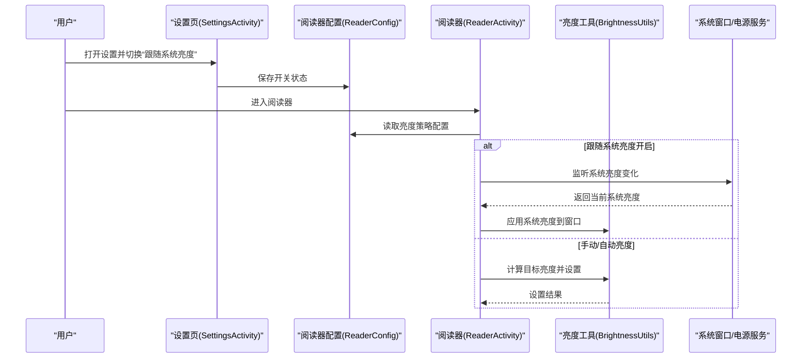
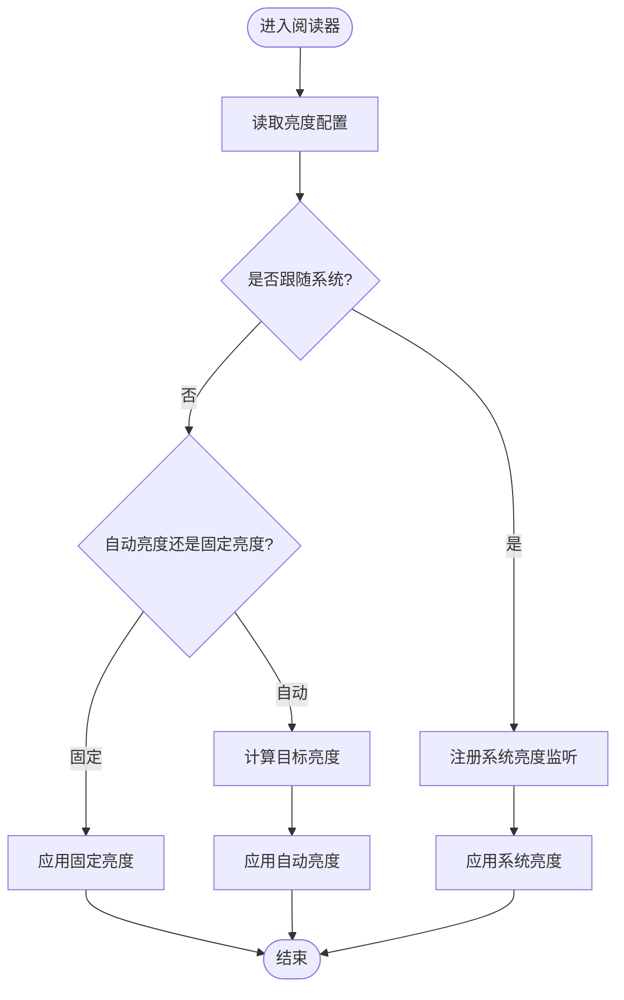
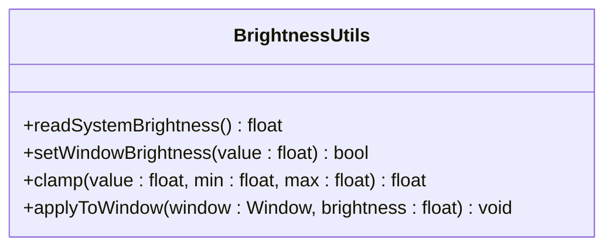
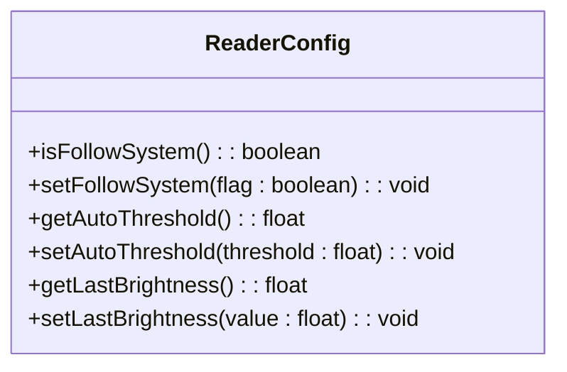
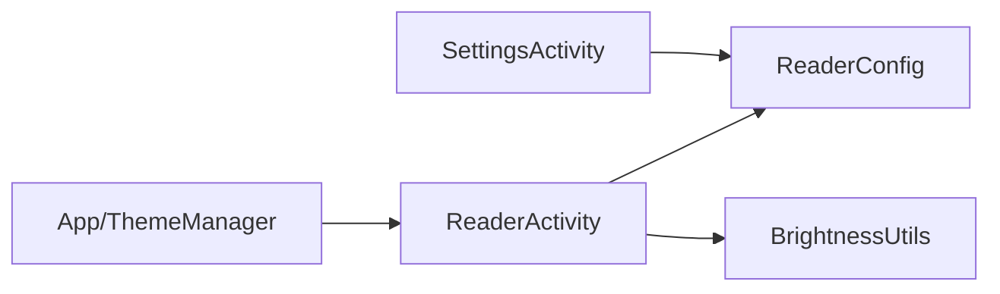

# 系统亮度控制

<cite>
**本文引用的文件**   
- [App.kt](file://app/src/main/java/io/legado/app/App.kt)
- [ReaderActivity.kt](file://app/src/main/java/io/legado/app/ui/book/reader/ReaderActivity.kt)
- [ReaderConfig.kt](file://app/src/main/java/io/legado/app/data/ReaderConfig.kt)
- [BrightnessUtils.kt](file://app/src/main/java/io/legado/app/utils/BrightnessUtils.kt)
- [ThemeManager.kt](file://app/src/main/java/io/legado/app/help/ThemeManager.kt)
- [SettingsActivity.kt](file://app/src/main/java/io/legado/app/ui/main/settings/SettingsActivity.kt)
</cite>

## 目录
1. [简介](#简介)
2. [项目结构](#项目结构)
3. [核心组件](#核心组件)
4. [架构总览](#架构总览)
5. [详细组件分析](#详细组件分析)
6. [依赖关系分析](#依赖关系分析)
7. [性能考量](#性能考量)
8. [故障排查指南](#故障排查指南)
9. [结论](#结论)
10. [附录](#附录)

## 简介
本文件聚焦于 Legado 应用中的“系统亮度控制”功能，涵盖阅读模式下的自动亮度、跟随系统亮度、手动调节与持久化策略。文档从系统架构、组件职责、数据流、处理逻辑、集成点与错误处理等维度进行系统化说明，并提供可视化图示与排障建议，帮助开发者与用户理解并正确使用该能力。

## 项目结构
Legado 采用多模块工程组织：Android 原生层负责 UI 与系统交互，Rust/Flutter/Web 等模块提供辅助能力。与“系统亮度控制”直接相关的代码主要位于 Android 层的 app 模块中，涉及以下关键位置：
- 应用初始化与主题管理（App.kt、ThemeManager.kt）
- 阅读器界面生命周期与显示控制（ReaderActivity.kt）
- 阅读器配置与偏好存储（ReaderConfig.kt）
- 亮度工具类封装（BrightnessUtils.kt）
- 设置入口与开关项（SettingsActivity.kt）

图表来源
- [App.kt](file://app/src/main/java/io/legado/app/App.kt)
- [ThemeManager.kt](file://app/src/main/java/io/legado/app/help/ThemeManager.kt)
- [ReaderActivity.kt](file://app/src/main/java/io/legado/app/ui/book/reader/ReaderActivity.kt)
- [BrightnessUtils.kt](file://app/src/main/java/io/legado/app/utils/BrightnessUtils.kt)
- [ReaderConfig.kt](file://app/src/main/java/io/legado/app/data/ReaderConfig.kt)
- [SettingsActivity.kt](file://app/src/main/java/io/legado/app/ui/main/settings/SettingsActivity.kt)

章节来源
- [App.kt](file://app/src/main/java/io/legado/app/App.kt)
- [ThemeManager.kt](file://app/src/main/java/io/legado/app/help/ThemeManager.kt)
- [ReaderActivity.kt](file://app/src/main/java/io/legado/app/ui/book/reader/ReaderActivity.kt)
- [BrightnessUtils.kt](file://app/src/main/java/io/legado/app/utils/BrightnessUtils.kt)
- [ReaderConfig.kt](file://app/src/main/java/io/legado/app/data/ReaderConfig.kt)
- [SettingsActivity.kt](file://app/src/main/java/io/legado/app/ui/main/settings/SettingsActivity.kt)

## 核心组件
- 应用与主题管理
  - 负责应用启动时的主题与夜间模式初始化，确保后续页面按预期渲染。
- 阅读器活动（ReaderActivity）
  - 管理阅读界面的生命周期，协调亮度跟随系统、自动亮度、手动调节等策略。
- 亮度工具（BrightnessUtils）
  - 封装对系统亮度的读取与设置，包括跟随系统开关、数值范围校验与异常保护。
- 阅读器配置（ReaderConfig）
  - 持久化亮度相关偏好（如是否跟随系统、上次亮度值、自动亮度阈值等）。
- 设置页（SettingsActivity）
  - 暴露“跟随系统亮度”“自动亮度”等开关，驱动 ReaderActivity 的行为变化。

章节来源
- [App.kt](file://app/src/main/java/io/legado/app/App.kt)
- [ThemeManager.kt](file://app/src/main/java/io/legado/app/help/ThemeManager.kt)
- [ReaderActivity.kt](file://app/src/main/java/io/legado/app/ui/book/reader/ReaderActivity.kt)
- [BrightnessUtils.kt](file://app/src/main/java/io/legado/app/utils/BrightnessUtils.kt)
- [ReaderConfig.kt](file://app/src/main/java/io/legado/app/data/ReaderConfig.kt)
- [SettingsActivity.kt](file://app/src/main/java/io/legado/app/ui/main/settings/SettingsActivity.kt)

## 架构总览
下图展示“系统亮度控制”在应用中的整体交互：设置页修改配置，阅读器根据配置与系统环境决定亮度策略，并通过工具类执行系统调用。

图表来源
- [SettingsActivity.kt](file://app/src/main/java/io/legado/app/ui/main/settings/SettingsActivity.kt)
- [ReaderConfig.kt](file://app/src/main/java/io/legado/app/data/ReaderConfig.kt)
- [ReaderActivity.kt](file://app/src/main/java/io/legado/app/ui/book/reader/ReaderActivity.kt)
- [BrightnessUtils.kt](file://app/src/main/java/io/legado/app/utils/BrightnessUtils.kt)

## 详细组件分析

### 阅读器活动（ReaderActivity）
- 职责
  - 在页面可见时应用亮度策略，隐藏系统导航栏/状态栏以提升沉浸感。
  - 根据配置选择“跟随系统”“自动亮度”或“固定亮度”。
  - 在生命周期回调中注册/注销系统亮度监听，避免内存泄漏。
- 关键流程
  - 进入页面：读取配置，决定是否启用跟随系统；必要时计算自动亮度目标值。
  - 系统亮度变化：更新窗口亮度，保持与系统一致。
  - 退出页面：恢复默认行为（如允许系统接管），释放资源。
- 异常与边界
  - 权限不足或系统限制导致设置失败时，回退到安全策略（如不改变亮度）。
  - 频繁亮度变更需做节流，避免抖动与性能问题。

图表来源
- [ReaderActivity.kt](file://app/src/main/java/io/legado/app/ui/book/reader/ReaderActivity.kt)
- [ReaderConfig.kt](file://app/src/main/java/io/legado/app/data/ReaderConfig.kt)
- [BrightnessUtils.kt](file://app/src/main/java/io/legado/app/utils/BrightnessUtils.kt)

章节来源
- [ReaderActivity.kt](file://app/src/main/java/io/legado/app/ui/book/reader/ReaderActivity.kt)
- [ReaderConfig.kt](file://app/src/main/java/io/legado/app/data/ReaderConfig.kt)
- [BrightnessUtils.kt](file://app/src/main/java/io/legado/app/utils/BrightnessUtils.kt)

### 亮度工具（BrightnessUtils）
- 职责
  - 统一封装系统亮度读取与设置接口。
  - 提供范围校验、单位换算与异常保护。
- 关键点
  - 读取系统亮度：获取当前屏幕亮度值，用于“跟随系统”场景。
  - 设置窗口亮度：将目标值映射到系统允许范围，避免越界。
  - 错误处理：捕获系统调用异常，记录日志并降级为安全策略。

图表来源
- [BrightnessUtils.kt](file://app/src/main/java/io/legado/app/utils/BrightnessUtils.kt)

章节来源
- [BrightnessUtils.kt](file://app/src/main/java/io/legado/app/utils/BrightnessUtils.kt)

### 阅读器配置（ReaderConfig）
- 职责
  - 持久化亮度相关偏好：跟随系统开关、自动亮度阈值、上次亮度值等。
  - 提供读写接口供 UI 与业务层使用。
- 关键点
  - 默认值策略：首次运行或配置损坏时提供合理默认值。
  - 线程安全：读写操作需考虑并发访问，保证一致性。

图表来源
- [ReaderConfig.kt](file://app/src/main/java/io/legado/app/data/ReaderConfig.kt)

章节来源
- [ReaderConfig.kt](file://app/src/main/java/io/legado/app/data/ReaderConfig.kt)

### 设置页（SettingsActivity）
- 职责
  - 提供“跟随系统亮度”“自动亮度”等开关入口。
  - 保存用户选择到 ReaderConfig，并触发相应页面刷新。
- 关键点
  - 即时生效：切换后通知已打开的阅读器重新加载配置。
  - 提示反馈：通过 Toast 或 Snackbar 告知用户设置结果。

章节来源
- [SettingsActivity.kt](file://app/src/main/java/io/legado/app/ui/main/settings/SettingsActivity.kt)
- [ReaderConfig.kt](file://app/src/main/java/io/legado/app/data/ReaderConfig.kt)

### 应用与主题（App.kt、ThemeManager.kt）
- 职责
  - 应用启动时初始化主题与夜间模式，确保 UI 与亮度策略一致。
  - 为阅读器提供主题上下文，避免明暗主题与亮度策略冲突。
- 关键点
  - 主题切换时同步更新亮度策略（如夜间模式可能影响自动亮度阈值）。

章节来源
- [App.kt](file://app/src/main/java/io/legado/app/App.kt)
- [ThemeManager.kt](file://app/src/main/java/io/legado/app/help/ThemeManager.kt)

## 依赖关系分析
- 低耦合设计
  - ReaderActivity 依赖 ReaderConfig 与 BrightnessUtils，不直接访问系统 API 细节。
  - SettingsActivity 仅负责配置持久化与 UI 交互，不持有系统调用逻辑。
- 可能的循环依赖
  - 若 ReaderConfig 反向依赖 ReaderActivity 会形成循环，应通过事件总线或回调解耦。
- 外部依赖
  - 系统窗口与电源服务由 Android 框架提供，需在工具层做好兼容与异常处理。

图表来源
- [SettingsActivity.kt](file://app/src/main/java/io/legado/app/ui/main/settings/SettingsActivity.kt)
- [ReaderActivity.kt](file://app/src/main/java/io/legado/app/ui/book/reader/ReaderActivity.kt)
- [ReaderConfig.kt](file://app/src/main/java/io/legado/app/data/ReaderConfig.kt)
- [BrightnessUtils.kt](file://app/src/main/java/io/legado/app/utils/BrightnessUtils.kt)
- [App.kt](file://app/src/main/java/io/legado/app/App.kt)
- [ThemeManager.kt](file://app/src/main/java/io/legado/app/help/ThemeManager.kt)

章节来源
- [SettingsActivity.kt](file://app/src/main/java/io/legado/app/ui/main/settings/SettingsActivity.kt)
- [ReaderActivity.kt](file://app/src/main/java/io/legado/app/ui/book/reader/ReaderActivity.kt)
- [ReaderConfig.kt](file://app/src/main/java/io/legado/app/data/ReaderConfig.kt)
- [BrightnessUtils.kt](file://app/src/main/java/io/legado/app/utils/BrightnessUtils.kt)
- [App.kt](file://app/src/main/java/io/legado/app/App.kt)
- [ThemeManager.kt](file://app/src/main/java/io/legado/app/help/ThemeManager.kt)

## 性能考量
- 节流与防抖
  - 系统亮度变化频率高，应在 ReaderActivity 中对亮度更新做节流，避免频繁重绘。
- 资源管理
  - 正确注册/注销系统监听，避免内存泄漏与后台耗电。
- I/O 与存储
  - ReaderConfig 的写操作应批量或合并，减少磁盘写入次数。
- 兼容性
  - 不同厂商 ROM 对亮度 API 的实现差异较大，需在工具层做兼容适配。

## 故障排查指南
- 症状：切换“跟随系统”无效
  - 检查 ReaderConfig 是否正确保存开关状态。
  - 确认 ReaderActivity 是否在 onResume/onPause 中正确注册/注销监听。
- 症状：亮度设置失败或闪烁
  - 查看 BrightnessUtils 的范围校验与异常捕获逻辑。
  - 确认系统权限与设备限制（如省电模式）。
- 症状：主题切换后亮度异常
  - 检查 ThemeManager 与 ReaderActivity 的联动逻辑，确保阈值与策略同步更新。

章节来源
- [ReaderActivity.kt](file://app/src/main/java/io/legado/app/ui/book/reader/ReaderActivity.kt)
- [ReaderConfig.kt](file://app/src/main/java/io/legado/app/data/ReaderConfig.kt)
- [BrightnessUtils.kt](file://app/src/main/java/io/legado/app/utils/BrightnessUtils.kt)
- [ThemeManager.kt](file://app/src/main/java/io/legado/app/help/ThemeManager.kt)

## 结论
Legado 的“系统亮度控制”以清晰的职责划分与模块化设计实现：设置页负责配置，阅读器负责策略决策与执行，工具类封装系统调用。通过合理的生命周期管理与异常处理，能够在多种设备与系统环境下稳定工作。建议在后续迭代中继续完善节流机制、厂商兼容与可观测性（日志/指标），以提升用户体验与可维护性。

## 附录
- 术语
  - 跟随系统亮度：窗口亮度始终与系统亮度保持一致。
  - 自动亮度：根据环境光传感器或时间策略动态调整亮度。
  - 固定亮度：用户手动设定并保持不变。
- 最佳实践
  - 优先使用系统 API 提供的能力，避免越权或侵入式修改。
  - 对用户可见的操作提供明确反馈与撤销路径。
  - 在夜间模式或深色主题下，适当降低自动亮度阈值以减少刺眼。