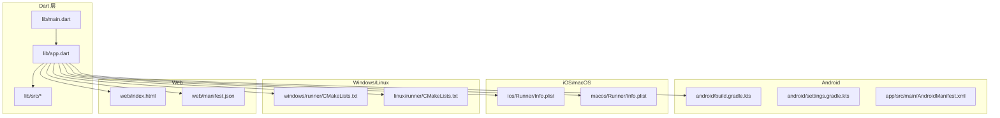
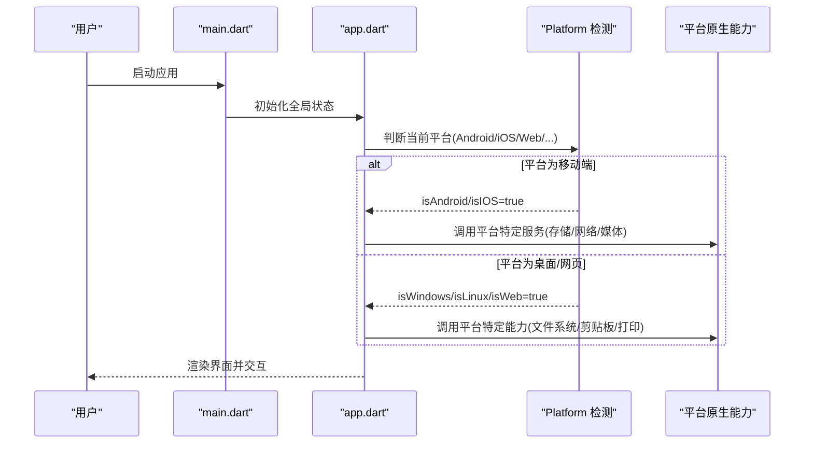
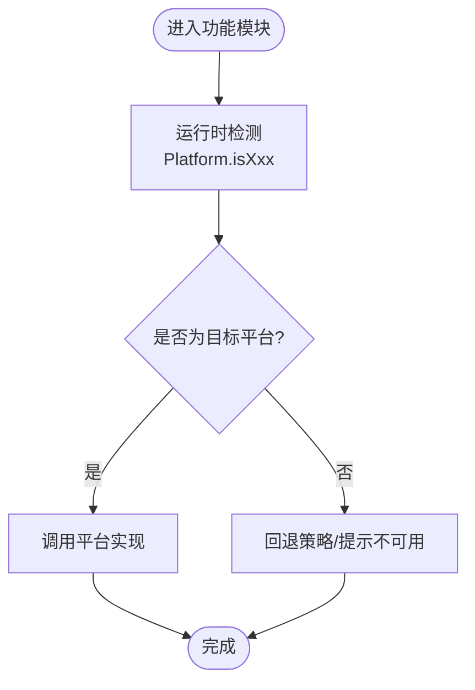
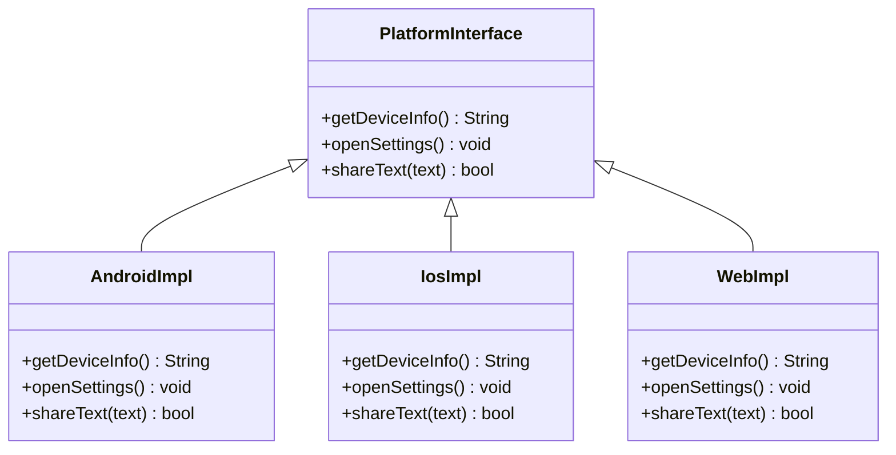
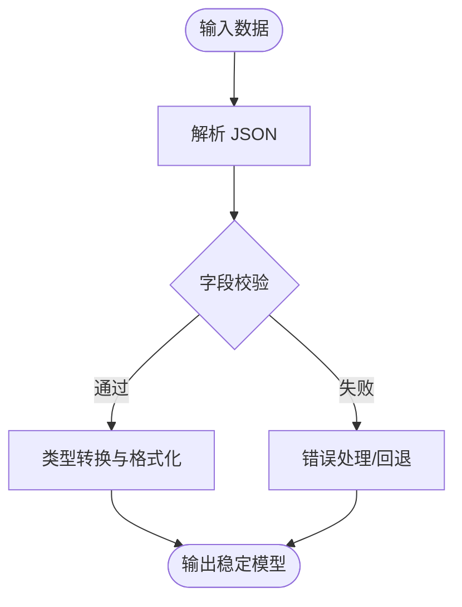
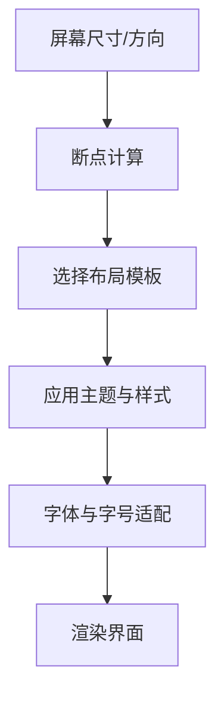
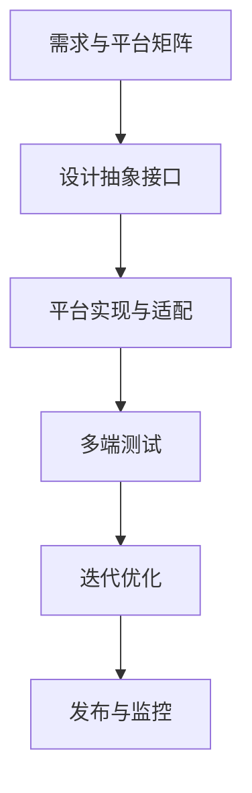
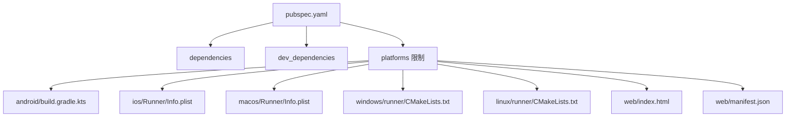

# 跨平台兼容性

<cite>
**本文档引用的文件**   
- [flutter_legado/pubspec.yaml](file://flutter_legado/pubspec.yaml)
- [flutter_legado/lib/main.dart](file://flutter_legado/lib/main.dart)
- [flutter_legado/lib/app.dart](file://flutter_legado/lib/app.dart)
- [flutter_legado/README.md](file://flutter_legado/README.md)
- [app/build.gradle](file://app/build.gradle)
- [android/build.gradle.kts](file://flutter_legado/android/build.gradle.kts)
- [android/settings.gradle.kts](file://flutter_legado/android/settings.gradle.kts)
- [ios/Runner/Info.plist](file://flutter_legado/ios/Runner/Info.plist)
- [macos/Runner/Info.plist](file://flutter_legado/macos/Runner/Info.plist)
- [windows/runner/CMakeLists.txt](file://flutter_legado/windows/runner/CMakeLists.txt)
- [linux/runner/CMakeLists.txt](file://flutter_legado/linux/runner/CMakeLists.txt)
- [web/index.html](file://flutter_legado/web/index.html)
- [web/manifest.json](file://flutter_legado/web/manifest.json)
</cite>

## 目录
1. [简介](#简介)
2. [项目结构](#项目结构)
3. [核心组件](#核心组件)
4. [架构总览](#架构总览)
5. [详细组件分析](#详细组件分析)
6. [依赖关系分析](#依赖关系分析)
7. [性能考量](#性能考量)
8. [故障排查指南](#故障排查指南)
9. [结论](#结论)
10. [附录](#附录)

## 简介
本文件聚焦于 Flutter 项目的跨平台兼容性，围绕以下主题展开：
- 平台检测机制与条件编译（Platform.isAndroid、Platform.isIOS 等）
- 平台特定代码组织（@Target 注解、platform.dart 文件结构）
- 数据类型转换与序列化差异（JSON 格式、日期时间处理）
- 平台特定依赖管理（pubspec.yaml 平台限制、条件依赖）
- UI 适配策略（响应式、主题、字体）
- 跨平台测试与调试技巧

本说明旨在帮助开发者在多端（Android、iOS、macOS、Windows、Linux、Web）保持一致的行为与体验。

## 项目结构
Flutter 工程采用标准多平台目录布局，关键位置如下：
- lib：跨平台 Dart 源码入口与业务逻辑
- android、ios、macos、windows、linux、web：各平台原生配置与资源
- pubspec.yaml：依赖声明与平台限定
- 各平台构建脚本与清单文件：控制打包产物与权限

图表来源
- [flutter_legado/lib/main.dart](file://flutter_legado/lib/main.dart)
- [flutter_legado/lib/app.dart](file://flutter_legado/lib/app.dart)
- [android/build.gradle.kts](file://flutter_legado/android/build.gradle.kts)
- [android/settings.gradle.kts](file://flutter_legado/android/settings.gradle.kts)
- [ios/Runner/Info.plist](file://flutter_legado/ios/Runner/Info.plist)
- [macos/Runner/Info.plist](file://flutter_legado/macos/Runner/Info.plist)
- [windows/runner/CMakeLists.txt](file://flutter_legado/windows/runner/CMakeLists.txt)
- [linux/runner/CMakeLists.txt](file://flutter_legado/linux/runner/CMakeLists.txt)
- [web/index.html](file://flutter_legado/web/index.html)
- [web/manifest.json](file://flutter_legado/web/manifest.json)

章节来源
- [flutter_legado/README.md](file://flutter_legado/README.md)

## 核心组件
- 平台检测与运行时判断
  - 使用 Platform 类进行运行时平台识别（如 isAndroid、isIOS、isMacOS、isWindows、isLinux、isWeb）。
  - 在需要严格编译期分支时，结合 #if 条件编译或 platform.dart 抽象接口实现。
- 平台特定代码组织
  - 通过 platform.dart 定义统一接口，按平台提供具体实现（例如 Android/iOS/Web 差异化行为）。
  - 使用 @Target 注解对 API 进行平台限定，避免在不支持的平台被调用。
- 数据序列化与类型转换
  - 针对 JSON 字段在不同平台的解析差异，建立统一的转换器（如日期时间、枚举、空值处理）。
  - 对数值精度、字符串编码、时区等进行规范化封装。
- 依赖管理与平台限制
  - 在 pubspec.yaml 中通过 dependencies 与 dev_dependencies 声明依赖，并使用 platforms 字段限制可用平台。
  - 使用 conditional imports 与条件依赖，确保仅在目标平台引入必要模块。
- UI 适配与主题
  - 基于 MediaQuery、LayoutBuilder、ResponsiveBuilder 等实现响应式布局。
  - 通过 ThemeData、Theme.of(context) 与平台默认样式对齐，处理字体与图标差异。
- 测试与调试
  - 使用 flutter test、integration_test 与平台原生测试框架组合验证。
  - 借助日志、断点、模拟器/真机切换与网络抓包定位问题。

章节来源
- [flutter_legado/lib/main.dart](file://flutter_legado/lib/main.dart)
- [flutter_legado/lib/app.dart](file://flutter_legado/lib/app.dart)
- [flutter_legado/pubspec.yaml](file://flutter_legado/pubspec.yaml)

## 架构总览
下图展示 Flutter 应用在各平台的启动流程与平台检测关键点。

图表来源
- [flutter_legado/lib/main.dart](file://flutter_legado/lib/main.dart)
- [flutter_legado/lib/app.dart](file://flutter_legado/lib/app.dart)

## 详细组件分析

### 平台检测与条件编译
- 运行时检测
  - 使用 Platform 的布尔属性判断当前运行环境，用于分支逻辑（如权限申请、系统设置读取）。
  - 建议在入口处集中判断，减少重复检查。
- 编译期分支
  - 使用 #if 条件编译隔离平台相关代码，提升可维护性。
  - 配合 platform.dart 抽象接口，将平台差异收敛到最小范围。
- 注解限定
  - 使用 @Target 标注 API 的适用平台，避免误用。

章节来源
- [flutter_legado/lib/app.dart](file://flutter_legado/lib/app.dart)

### 平台特定代码组织（platform.dart 与 @Target）
- 文件结构建议
  - platform.dart：定义统一接口与工厂方法。
  - platform_android.dart、platform_ios.dart、platform_web.dart：各平台实现。
  - 在业务层仅依赖 platform.dart，屏蔽平台细节。
- 注解使用
  - 对平台专属 API 添加 @Target，明确适用范围。
  - 在静态分析与文档生成时提供平台信息。

图表来源
- [flutter_legado/lib/app.dart](file://flutter_legado/lib/app.dart)

### 数据类型转换与序列化
- JSON 差异
  - 不同平台库对 null、空字符串、数字精度的处理可能不一致，需统一转换器。
  - 对日期时间字段，统一为 ISO 8601 或时间戳，并在解析层做兼容。
- 类型安全
  - 使用强类型模型与校验器，避免隐式转换导致的问题。
  - 对可选字段提供默认值与降级逻辑。
- 示例策略
  - 建立统一的 JsonConverter，集中处理特殊类型。
  - 在 API 层对请求/响应进行标准化。

章节来源
- [flutter_legado/lib/app.dart](file://flutter_legado/lib/app.dart)

### 平台特定依赖管理（pubspec.yaml）
- 平台限制
  - 在 pubspec.yaml 中使用 platforms 字段限制插件可用平台。
  - 对仅移动端可用的依赖，避免在 Web/桌面引入。
- 条件依赖
  - 使用 conditional imports 与条件依赖，按需加载模块。
  - 将平台差异封装在独立包内，降低耦合。
- 版本与冲突
  - 锁定依赖版本，避免升级带来不兼容。
  - 定期审计第三方库的平台支持情况。

章节来源
- [flutter_legado/pubspec.yaml](file://flutter_legado/pubspec.yaml)

### UI 适配策略（响应式、主题、字体）
- 响应式设计
  - 使用 LayoutBuilder、MediaQuery 与断点控制布局。
  - 针对不同屏幕尺寸与方向优化排版。
- 主题适配
  - 通过 ThemeData 统一管理颜色、字体、阴影等。
  - 遵循平台设计规范（Material/Cupertino），保证一致性。
- 字体处理
  - 预置常用字体，动态加载自定义字体。
  - 处理跨平台字体回退与缩放。

章节来源
- [flutter_legado/lib/app.dart](file://flutter_legado/lib/app.dart)

### 跨平台测试与调试
- 单元测试
  - 使用 flutter test 覆盖业务逻辑与工具函数。
  - 模拟平台差异（如 Platform 返回值）以验证分支。
- 集成测试
  - 使用 integration_test 模拟真实用户操作。
  - 在 Android/iOS 模拟器与桌面/浏览器上执行。
- 调试技巧
  - 启用 verbose 日志，定位平台差异。
  - 使用网络抓包与断点调试，确认数据流。
  - 利用平台原生调试工具（Logcat/Xcode/DevTools）。

章节来源
- [flutter_legado/lib/main.dart](file://flutter_legado/lib/main.dart)
- [flutter_legado/lib/app.dart](file://flutter_legado/lib/app.dart)

### 概念总览
下图给出跨平台开发的通用工作流，便于理解整体思路。

[此图为概念流程图，不直接映射具体源码文件]

## 依赖关系分析
Flutter 工程依赖由 pubspec.yaml 管理，各平台构建脚本与清单文件协同工作。

图表来源
- [flutter_legado/pubspec.yaml](file://flutter_legado/pubspec.yaml)
- [android/build.gradle.kts](file://flutter_legado/android/build.gradle.kts)
- [android/settings.gradle.kts](file://flutter_legado/android/settings.gradle.kts)
- [ios/Runner/Info.plist](file://flutter_legado/ios/Runner/Info.plist)
- [macos/Runner/Info.plist](file://flutter_legado/macos/Runner/Info.plist)
- [windows/runner/CMakeLists.txt](file://flutter_legado/windows/runner/CMakeLists.txt)
- [linux/runner/CMakeLists.txt](file://flutter_legado/linux/runner/CMakeLists.txt)
- [web/index.html](file://flutter_legado/web/index.html)
- [web/manifest.json](file://flutter_legado/web/manifest.json)

章节来源
- [flutter_legado/pubspec.yaml](file://flutter_legado/pubspec.yaml)
- [android/build.gradle.kts](file://flutter_legado/android/build.gradle.kts)
- [android/settings.gradle.kts](file://flutter_legado/android/settings.gradle.kts)

## 性能考量
- 减少不必要的平台检测与分支，尽量在初始化阶段完成。
- 懒加载平台特定模块，降低首屏体积。
- 缓存平台能力检测结果，避免重复查询。
- 对大数据量序列化使用流式处理与增量更新。
- 合理划分 UI 层级，避免频繁重建。

## 故障排查指南
- 常见问题
  - 平台检测失效：检查 Platform 返回值与条件编译是否正确。
  - 依赖冲突：核对 pubspec.yaml 的平台限制与版本锁定。
  - 序列化异常：统一转换器与默认值策略。
  - UI 错位：断点与尺寸测量，确认响应式逻辑。
- 调试步骤
  - 启用详细日志，记录平台信息与关键路径。
  - 使用模拟器/真机对比，逐步缩小范围。
  - 借助平台原生工具（Logcat/Xcode/DevTools）定位。

章节来源
- [flutter_legado/lib/main.dart](file://flutter_legado/lib/main.dart)
- [flutter_legado/lib/app.dart](file://flutter_legado/lib/app.dart)

## 结论
通过规范的平台检测、清晰的代码组织、统一的序列化策略、严格的依赖管理与完善的 UI 适配，可以在多平台上获得一致且稳定的用户体验。结合系统的测试与调试方法，能够高效发现并解决问题，保障跨平台质量。

## 附录
- 最佳实践清单
  - 在入口集中进行平台检测与初始化。
  - 使用 platform.dart 抽象接口收敛平台差异。
  - 统一 JSON 转换器与时区处理。
  - 在 pubspec.yaml 中精确限制平台与版本。
  - 采用响应式布局与主题化设计。
  - 建立多端测试矩阵与自动化流水线。