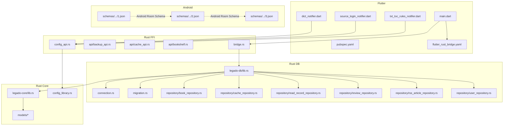
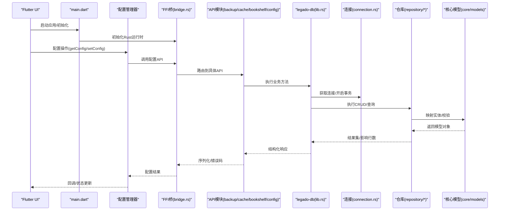
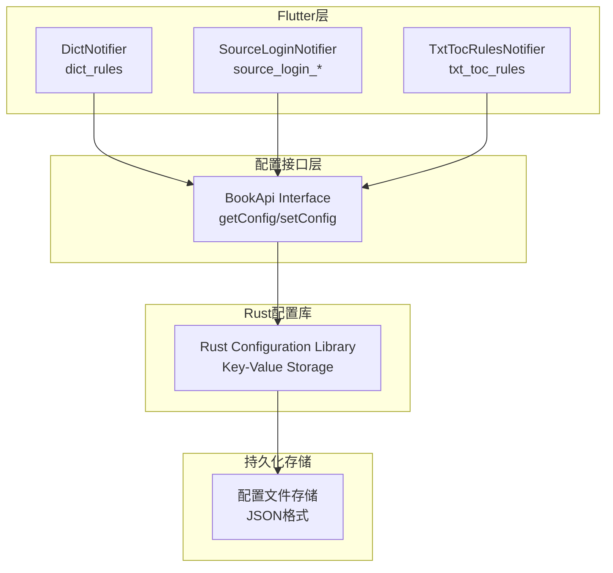
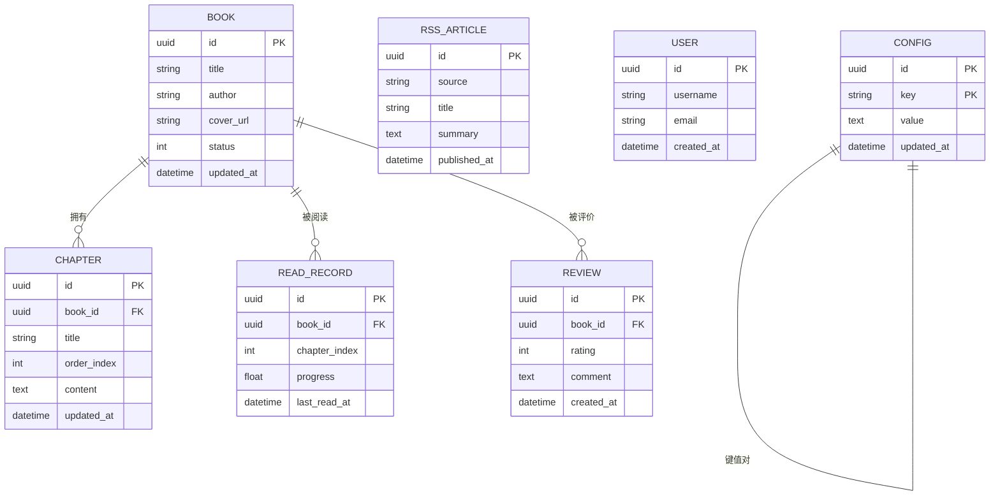
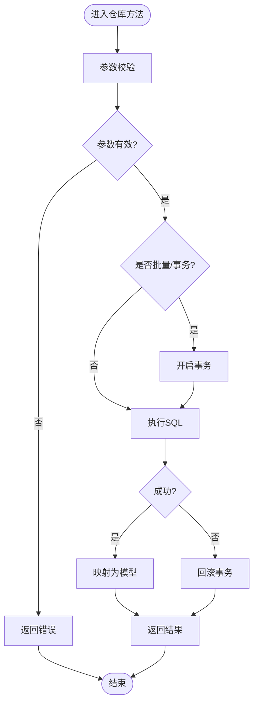
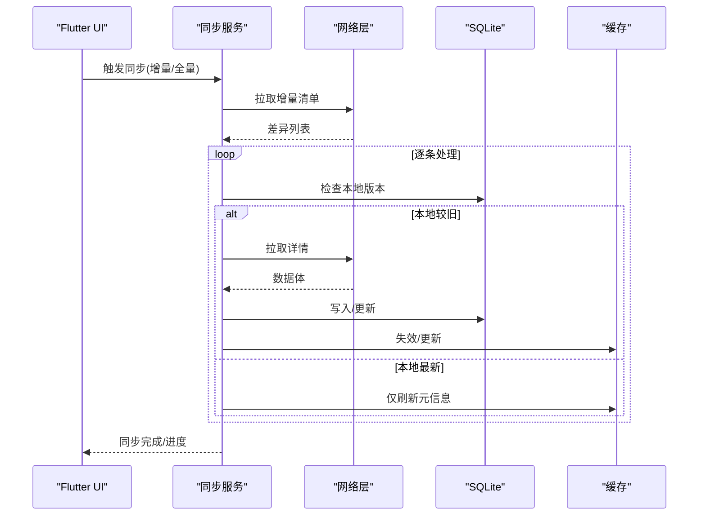
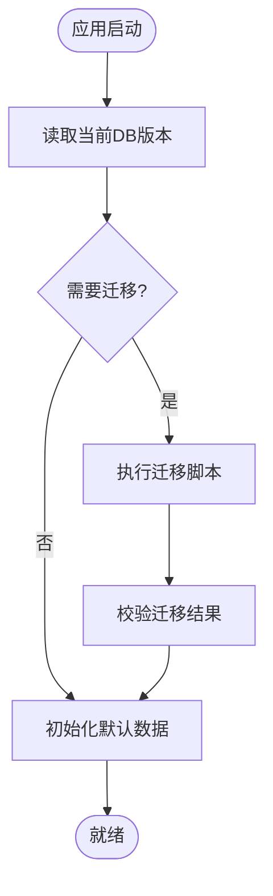
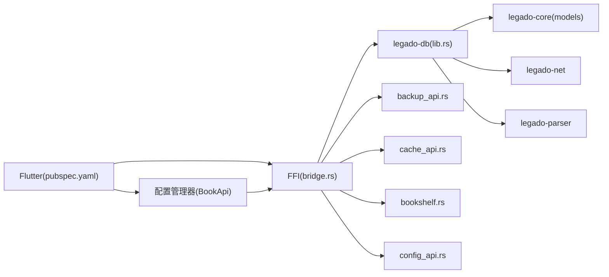

# 数据持久化

<cite>
**本文引用的文件**   
- [flutter_legado/pubspec.yaml](file://flutter_legado/pubspec.yaml)
- [flutter_legado/lib/main.dart](file://flutter_legado/lib/main.dart)
- [flutter_legado/flutter_rust_bridge.yaml](file://flutter_legado/flutter_rust_bridge.yaml)
- [rust/legado-db/Cargo.toml](file://rust/legado-db/Cargo.toml)
- [rust/legado-db/src/lib.rs](file://rust/legado-db/src/lib.rs)
- [rust/legado-db/src/connection.rs](file://rust/legado-db/src/connection.rs)
- [rust/legado-db/src/migration.rs](file://rust/legado-db/src/migration.rs)
- [rust/legado-db/src/default_data.rs](file://rust/legado-db/src/default_data.rs)
- [rust/legado-db/src/import.rs](file://rust/legado-db/src/import.rs)
- [rust/legado-db/src/schema.rs](file://rust/legado-db/src/schema.rs)
- [rust/legado-db/src/repository/book_repository.rs](file://rust/legado-db/src/repository/book_repository.rs)
- [rust/legado-db/src/repository/cache_repository.rs](file://rust/legado-db/src/repository/cache_repository.rs)
- [rust/legado-db/src/repository/read_record_repository.rs](file://rust/legado-db/src/repository/read_record_repository.rs)
- [rust/legado-db/src/repository/review_repository.rs](file://rust/legado-db/src/repository/review_repository.rs)
- [rust/legado-db/src/repository/rss_article_repository.rs](file://rust/legado-db/src/repository/rss_article_repository.rs)
- [rust/legado-db/src/repository/user_repository.rs](file://rust/legado-db/src/repository/user_repository.rs)
- [rust/legado-core/src/lib.rs](file://rust/legado-core/src/lib.rs)
- [rust/legado-core/src/models/mod.rs](file://rust/legado-core/src/models/mod.rs)
- [rust/legado-core/src/models/book.rs](file://rust/legado-core/src/models/book.rs)
- [rust/legado-core/src/models/book_chapter.rs](file://rust/legado-core/src/models/book_chapter.rs)
- [rust/legado-core/src/models/misc.rs](file://rust/legado-core/src/models/misc.rs)
- [rust/legado-ffi/src/bridge.rs](file://rust/legado-ffi/src/bridge.rs)
- [rust/legado-ffi/src/api/backup_api.rs](file://rust/legado-ffi/src/api/backup_api.rs)
- [rust/legado-ffi/src/api/cache_api.rs](file://rust/legado-ffi/src/api/cache_api.rs)
- [rust/legado-ffi/src/api/bookshelf.rs](file://rust/legado-ffi/src/api/bookshelf.rs)
- [app/schemas/io.legado.app.data.AppDatabase/1.json](file://app/schemas/io.legado.app.data.AppDatabase/1.json)
- [app/schemas/io.legado.app.data.AppDatabase/2.json](file://app/schemas/io.legado.app.data.AppDatabase/2.json)
- [app/schemas/io.legado.app.data.AppDatabase/3.json](file://app/schemas/io.legado.app.data.AppDatabase/3.json)
- [flutter_legado/lib/src/providers/dict/dict_notifier.dart](file://flutter_legado/lib/src/providers/dict/dict_notifier.dart)
- [flutter_legado/lib/src/providers/dict/dict_state.dart](file://flutter_legado/lib/src/providers/dict/dict_state.dart)
- [flutter_legado/lib/src/providers/source_login/source_login_notifier.dart](file://flutter_legado/lib/src/providers/source_login/source_login_notifier.dart)
- [flutter_legado/lib/src/providers/txt_toc_rules/txt_toc_rules_notifier.dart](file://flutter_legado/lib/src/providers/txt_toc_rules/txt_toc_rules_notifier.dart)
- [flutter_legado/lib/src/services/book_api.dart](file://flutter_legado/lib/src/services/book_api.dart)
</cite>

## 更新摘要
**所做更改**   
- 新增 Rust 配置库集成章节，说明 BookApi.getConfig/setConfig 的统一配置管理
- 更新本地缓存策略章节，强调三个主要组件（词典规则、书源登录凭据、TXT目录规则）已迁移到 Rust 配置库
- 新增配置持久化架构图，展示 Flutter 到 Rust 配置库的数据流
- 更新依赖关系分析，包含新的配置持久化路径

## 目录
1. [简介](#简介)
2. [项目结构](#项目结构)
3. [核心组件](#核心组件)
4. [架构总览](#架构总览)
5. [详细组件分析](#详细组件分析)
6. [依赖关系分析](#依赖关系分析)
7. [性能考量](#性能考量)
8. [故障排查指南](#故障排查指南)
9. [结论](#结论)
10. [附录](#附录)

## 简介
本文件面向Flutter与Rust混合工程中的数据持久化方案，覆盖以下主题：
- SQLite数据库使用（以Rust侧SQLite为核心，通过FFI暴露给Flutter）
- 表结构与CRUD操作（仓库层封装）
- **新增** Rust配置库集成（BookApi.getConfig/setConfig统一配置管理）
- 本地缓存策略（SharedPreferences、文件系统缓存、内存缓存）
- 数据同步机制（与Rust核心库的数据交换、增量同步、冲突解决）
- 数据迁移与版本管理（数据库升级、备份恢复）
- 数据安全与隐私保护最佳实践

**重要更新**：本项目现已采用统一的Rust配置库进行关键配置的持久化管理。三个主要组件（词典规则、书源登录凭据、TXT目录规则）已迁移至BookApi.getConfig/setConfig接口，替代了之前的SharedPreferences存储方式，提供了跨平台一致的配置持久化方案。

说明：本项目在Android端同时存在Room数据库的schema快照，但Flutter/Rust路径主要依赖Rust侧SQLite实现并通过FFI桥接。下文将分别阐述两种路径的实现要点与集成方式。

## 项目结构
- Flutter应用入口位于 flutter_legado/lib/main.dart，负责初始化Flutter环境、加载配置、启动Rust FFI桥并挂载UI状态。
- Rust侧持久化核心位于 rust/legado-db，包含连接管理、迁移、默认数据、导入导出以及按领域划分的Repository。
- FFI桥位于 rust/legado-ffi，提供跨语言API（如备份、缓存、书架等）。
- Android Room schema快照位于 app/schemas/io.legado.app.data.AppDatabase/*.json，用于Android原生侧数据库版本演进校验。

**图表来源** 
- [flutter_legado/lib/main.dart](file://flutter_legado/lib/main.dart)
- [flutter_legado/flutter_rust_bridge.yaml](file://flutter_legado/flutter_rust_bridge.yaml)
- [flutter_legado/lib/src/providers/dict/dict_notifier.dart](file://flutter_legado/lib/src/providers/dict/dict_notifier.dart)
- [flutter_legado/lib/src/providers/source_login/source_login_notifier.dart](file://flutter_legado/lib/src/providers/source_login/source_login_notifier.dart)
- [flutter_legado/lib/src/providers/txt_toc_rules/txt_toc_rules_notifier.dart](file://flutter_legado/lib/src/providers/txt_toc_rules/txt_toc_rules_notifier.dart)
- [rust/legado-ffi/src/bridge.rs](file://rust/legado-ffi/src/bridge.rs)
- [rust/legado-db/src/lib.rs](file://rust/legado-db/src/lib.rs)
- [rust/legado-db/src/connection.rs](file://rust/legado-db/src/connection.rs)
- [rust/legado-db/src/migration.rs](file://rust/legado-db/src/migration.rs)
- [rust/legado-db/src/repository/book_repository.rs](file://rust/legado-db/src/repository/book_repository.rs)
- [rust/legado-db/src/repository/cache_repository.rs](file://rust/legado-db/src/repository/cache_repository.rs)
- [rust/legado-db/src/repository/read_record_repository.rs](file://rust/legado-db/src/repository/read_record_repository.rs)
- [rust/legado-db/src/repository/review_repository.rs](file://rust/legado-db/src/repository/review_repository.rs)
- [rust/legado-db/src/repository/rss_article_repository.rs](file://rust/legado-db/src/repository/rss_article_repository.rs)
- [rust/legado-db/src/repository/user_repository.rs](file://rust/legado-db/src/repository/user_repository.rs)
- [rust/legado-core/src/lib.rs](file://rust/legado-core/src/lib.rs)
- [rust/legado-core/src/models/mod.rs](file://rust/legado-core/src/models/mod.rs)
- [app/schemas/io.legado.app.data.AppDatabase/1.json](file://app/schemas/io.legado.app.data.AppDatabase/1.json)
- [app/schemas/io.legado.app.data.AppDatabase/2.json](file://app/schemas/io.legado.app.data.AppDatabase/2.json)
- [app/schemas/io.legado.app.data.AppDatabase/3.json](file://app/schemas/io.legado.app.data.AppDatabase/3.json)

**章节来源**
- [flutter_legado/lib/main.dart](file://flutter_legado/lib/main.dart)
- [flutter_legado/pubspec.yaml](file://flutter_legado/pubspec.yaml)
- [flutter_legado/flutter_rust_bridge.yaml](file://flutter_legado/flutter_rust_bridge.yaml)
- [flutter_legado/lib/src/providers/dict/dict_notifier.dart](file://flutter_legado/lib/src/providers/dict/dict_notifier.dart)
- [flutter_legado/lib/src/providers/source_login/source_login_notifier.dart](file://flutter_legado/lib/src/providers/source_login/source_login_notifier.dart)
- [flutter_legado/lib/src/providers/txt_toc_rules/txt_toc_rules_notifier.dart](file://flutter_legado/lib/src/providers/txt_toc_rules/txt_toc_rules_notifier.dart)
- [rust/legado-db/src/lib.rs](file://rust/legado-db/src/lib.rs)
- [rust/legado-db/src/connection.rs](file://rust/legado-db/src/connection.rs)
- [rust/legado-db/src/migration.rs](file://rust/legado-db/src/migration.rs)
- [rust/legado-db/src/default_data.rs](file://rust/legado-db/src/default_data.rs)
- [rust/legado-db/src/import.rs](file://rust/legado-db/src/import.rs)
- [rust/legado-db/src/schema.rs](file://rust/legado-db/src/schema.rs)
- [rust/legado-core/src/lib.rs](file://rust/legado-core/src/lib.rs)
- [rust/legado-core/src/models/mod.rs](file://rust/legado-core/src/models/mod.rs)
- [app/schemas/io.legado.app.data.AppDatabase/1.json](file://app/schemas/io.legado.app.data.AppDatabase/1.json)
- [app/schemas/io.legado.app.data.AppDatabase/2.json](file://app/schemas/io.legado.app.data.AppDatabase/2.json)
- [app/schemas/io.legado.app.data.AppDatabase/3.json](file://app/schemas/io.legado.app.data.AppDatabase/3.json)

## 核心组件
- Flutter入口与桥接初始化
  - main.dart负责启动应用、加载配置、初始化Rust FFI桥，确保后续调用DB/Cache/Backup等能力可用。
  - pubspec.yaml声明Flutter依赖（如sqflite、shared_preferences、path_provider等），用于本地缓存与文件访问。
  - flutter_rust_bridge.yaml定义Rust与Flutter之间的类型映射与函数绑定，保证跨语言数据结构一致。

- **新增** Rust配置库集成
  - BookApi接口提供统一的getConfig/setConfig/deleteConfig方法，用于跨平台配置持久化。
  - 支持JSON格式的键值对存储，适用于复杂配置数据的序列化与反序列化。
  - 三个主要组件已迁移至此统一接口：词典规则（dict_rules）、书源登录凭据（source_login_*）、TXT目录规则（txt_toc_rules）。

- Rust数据库层（legado-db）
  - connection.rs：管理SQLite连接池、事务、读写分离等。
  - migration.rs：处理数据库版本迁移，支持向前兼容与回滚策略。
  - default_data.rs：首次安装或重置时写入基础数据。
  - import.rs：导入外部数据（如JSON/CSV/备份包）。
  - repository/*：按领域划分的数据访问层，封装CRUD、批量操作、分页与索引优化。

- Rust核心模型（legado-core）
  - models/*：定义书籍、章节、规则、统计等核心实体，供DB层与业务逻辑复用。

- FFI接口（legado-ffi）
  - bridge.rs：统一暴露给Flutter的函数入口。
  - api/*：按功能域组织API（如备份、缓存、书架、搜索等）。

**章节来源**
- [flutter_legado/lib/main.dart](file://flutter_legado/lib/main.dart)
- [flutter_legado/pubspec.yaml](file://flutter_legado/pubspec.yaml)
- [flutter_legado/flutter_rust_bridge.yaml](file://flutter_legado/flutter_rust_bridge.yaml)
- [flutter_legado/lib/src/services/book_api.dart](file://flutter_legado/lib/src/services/book_api.dart)
- [flutter_legado/lib/src/providers/dict/dict_notifier.dart](file://flutter_legado/lib/src/providers/dict/dict_notifier.dart)
- [flutter_legado/lib/src/providers/source_login/source_login_notifier.dart](file://flutter_legado/lib/src/providers/source_login/source_login_notifier.dart)
- [flutter_legado/lib/src/providers/txt_toc_rules/txt_toc_rules_notifier.dart](file://flutter_legado/lib/src/providers/txt_toc_rules/txt_toc_rules_notifier.dart)
- [rust/legado-db/src/connection.rs](file://rust/legado-db/src/connection.rs)
- [rust/legado-db/src/migration.rs](file://rust/legado-db/src/migration.rs)
- [rust/legado-db/src/default_data.rs](file://rust/legado-db/src/default_data.rs)
- [rust/legado-db/src/import.rs](file://rust/legado-db/src/import.rs)
- [rust/legado-db/src/repository/book_repository.rs](file://rust/legado-db/src/repository/book_repository.rs)
- [rust/legado-db/src/repository/cache_repository.rs](file://rust/legado-db/src/repository/cache_repository.rs)
- [rust/legado-db/src/repository/read_record_repository.rs](file://rust/legado-db/src/repository/read_record_repository.rs)
- [rust/legado-db/src/repository/review_repository.rs](file://rust/legado-db/src/repository/review_repository.rs)
- [rust/legado-db/src/repository/rss_article_repository.rs](file://rust/legado-db/src/repository/rss_article_repository.rs)
- [rust/legado-db/src/repository/user_repository.rs](file://rust/legado-db/src/repository/user_repository.rs)
- [rust/legado-core/src/models/mod.rs](file://rust/legado-core/src/models/mod.rs)
- [rust/legado-ffi/src/bridge.rs](file://rust/legado-ffi/src/bridge.rs)
- [rust/legado-ffi/src/api/backup_api.rs](file://rust/legado-ffi/src/api/backup_api.rs)
- [rust/legado-ffi/src/api/cache_api.rs](file://rust/legado-ffi/src/api/cache_api.rs)
- [rust/legado-ffi/src/api/bookshelf.rs](file://rust/legado-ffi/src/api/bookshelf.rs)

## 架构总览
下图展示从Flutter到Rust FFI再到SQLite的完整调用链，以及缓存与备份流程的关键节点。

**图表来源** 
- [flutter_legado/lib/main.dart](file://flutter_legado/lib/main.dart)
- [flutter_legado/lib/src/services/book_api.dart](file://flutter_legado/lib/src/services/book_api.dart)
- [flutter_legado/lib/src/providers/dict/dict_notifier.dart](file://flutter_legado/lib/src/providers/dict/dict_notifier.dart)
- [flutter_legado/lib/src/providers/source_login/source_login_notifier.dart](file://flutter_legado/lib/src/providers/source_login/source_login_notifier.dart)
- [flutter_legado/lib/src/providers/txt_toc_rules/txt_toc_rules_notifier.dart](file://flutter_legado/lib/src/providers/txt_toc_rules/txt_toc_rules_notifier.dart)
- [rust/legado-ffi/src/bridge.rs](file://rust/legado-ffi/src/bridge.rs)
- [rust/legado-db/src/lib.rs](file://rust/legado-db/src/lib.rs)
- [rust/legado-db/src/connection.rs](file://rust/legado-db/src/connection.rs)
- [rust/legado-db/src/repository/book_repository.rs](file://rust/legado-db/src/repository/book_repository.rs)
- [rust/legado-core/src/models/mod.rs](file://rust/legado-core/src/models/mod.rs)

## 详细组件分析

### SQLite数据库与Sqflite插件配置
- Flutter侧可通过pubspec.yaml引入sqflite、shared_preferences、path_provider等依赖，用于本地缓存与文件访问。
- 实际持久化由Rust侧SQLite驱动完成，Flutter通过FFI调用Rust API，避免在Flutter直接操作SQLite，提升跨平台一致性与性能。
- 若需要在Flutter侧进行轻量缓存（如设置项、临时列表），可使用shared_preferences；大体积内容建议走Rust文件缓存或SQLite。

**章节来源**
- [flutter_legado/pubspec.yaml](file://flutter_legado/pubspec.yaml)
- [flutter_legado/lib/main.dart](file://flutter_legado/lib/main.dart)

### **新增** Rust配置库集成
**更新** 项目现已采用统一的Rust配置库进行关键配置的持久化管理，替代了分散的SharedPreferences存储方式。

- **统一接口**：BookApi提供getConfig/setConfig/deleteConfig/getAllConfigs四个核心方法，所有配置操作都通过这些接口进行。
- **三大组件迁移**：
  - 词典规则（dict_rules）：通过DictNotifier使用BookApi.getConfig/setConfig管理在线词典规则
  - 书源登录凭据（source_login_*）：通过SourceLoginNotifier管理Token、Cookies、Headers等认证信息
  - TXT目录规则（txt_toc_rules）：通过TxtTocRulesNotifier管理TXT文件的章节解析规则
- **数据格式**：配置值以JSON字符串形式存储，支持复杂对象的序列化和反序列化
- **跨平台一致性**：所有平台的配置存储和读取都通过相同的Rust接口，确保行为一致

**图表来源** 
- [flutter_legado/lib/src/providers/dict/dict_notifier.dart](file://flutter_legado/lib/src/providers/dict/dict_notifier.dart)
- [flutter_legado/lib/src/providers/source_login/source_login_notifier.dart](file://flutter_legado/lib/src/providers/source_login/source_login_notifier.dart)
- [flutter_legado/lib/src/providers/txt_toc_rules/txt_toc_rules_notifier.dart](file://flutter_legado/lib/src/providers/txt_toc_rules/txt_toc_rules_notifier.dart)
- [flutter_legado/lib/src/services/book_api.dart](file://flutter_legado/lib/src/services/book_api.dart)

**章节来源**
- [flutter_legado/lib/src/providers/dict/dict_notifier.dart](file://flutter_legado/lib/src/providers/dict/dict_notifier.dart)
- [flutter_legado/lib/src/providers/source_login/source_login_notifier.dart](file://flutter_legado/lib/src/providers/source_login/source_login_notifier.dart)
- [flutter_legado/lib/src/providers/txt_toc_rules/txt_toc_rules_notifier.dart](file://flutter_legado/lib/src/providers/txt_toc_rules/txt_toc_rules_notifier.dart)
- [flutter_legado/lib/src/services/book_api.dart](file://flutter_legado/lib/src/services/book_api.dart)

### 表结构设计（Rust侧）
- 表结构由Rust模型与Schema共同定义，Repository层基于这些结构生成SQL语句。
- 常见实体包括书籍、章节、书签、阅读记录、评论、RSS文章、用户等，均对应独立仓库。
- 建议在高频查询字段上建立索引，合理设计外键与唯一约束，避免全表扫描。

**图表来源** 
- [rust/legado-core/src/models/book.rs](file://rust/legado-core/src/models/book.rs)
- [rust/legado-core/src/models/book_chapter.rs](file://rust/legado-core/src/models/book_chapter.rs)
- [rust/legado-core/src/models/misc.rs](file://rust/legado-core/src/models/misc.rs)
- [rust/legado-db/src/repository/book_repository.rs](file://rust/legado-db/src/repository/book_repository.rs)
- [rust/legado-db/src/repository/read_record_repository.rs](file://rust/legado-db/src/repository/read_record_repository.rs)
- [rust/legado-db/src/repository/review_repository.rs](file://rust/legado-db/src/repository/review_repository.rs)
- [rust/legado-db/src/repository/rss_article_repository.rs](file://rust/legado-db/src/repository/rss_article_repository.rs)
- [rust/legado-db/src/repository/user_repository.rs](file://rust/legado-db/src/repository/user_repository.rs)

### CRUD操作（仓库层）
- 每个领域仓库提供增删改查、批量插入、分页查询、条件过滤等方法。
- 推荐在批量写入时使用事务，减少IO开销与锁竞争。
- 对复杂查询应结合索引与EXPLAIN分析，避免N+1问题。

**图表来源** 
- [rust/legado-db/src/repository/book_repository.rs](file://rust/legado-db/src/repository/book_repository.rs)
- [rust/legado-db/src/repository/cache_repository.rs](file://rust/legado-db/src/repository/cache_repository.rs)
- [rust/legado-db/src/repository/read_record_repository.rs](file://rust/legado-db/src/repository/read_record_repository.rs)
- [rust/legado-db/src/repository/review_repository.rs](file://rust/legado-db/src/repository/review_repository.rs)
- [rust/legado-db/src/repository/rss_article_repository.rs](file://rust/legado-db/src/repository/rss_article_repository.rs)
- [rust/legado-db/src/repository/user_repository.rs](file://rust/legado-db/src/repository/user_repository.rs)

### 本地缓存策略
- SharedPreferences：适合存储小量配置、开关、用户偏好等键值对。**注意**：关键配置已迁移至Rust配置库，仅保留非关键的简单设置。
- 文件系统缓存：适用于图片、音频、电子书等二进制资源，配合TTL与清理策略。
- 内存缓存：在进程内维护热点数据（如最近阅读章节、搜索结果），注意生命周期与内存上限。
- 缓存一致性：当底层数据变更时，需失效或更新相关缓存条目，避免脏读。

**更新**：现在关键配置（词典规则、登录凭据、TXT规则）通过Rust配置库统一管理，不再使用SharedPreferences存储。

**章节来源**
- [flutter_legado/pubspec.yaml](file://flutter_legado/pubspec.yaml)
- [rust/legado-ffi/src/api/cache_api.rs](file://rust/legado-ffi/src/api/cache_api.rs)

### 数据同步机制（与Rust核心库）
- 增量同步：基于时间戳或版本号拉取差异数据，减少网络与IO压力。
- 冲突解决：采用“服务端优先”或“合并策略”，对关键字段（如标题、排序）制定优先级规则。
- 断点续传：下载任务支持暂停/恢复，失败重试与退避策略。
- 并发控制：使用队列或信号量限制并发请求，避免过载。

**图表来源** 
- [rust/legado-core/src/lib.rs](file://rust/legado-core/src/lib.rs)
- [rust/legado-db/src/lib.rs](file://rust/legado-db/src/lib.rs)
- [rust/legado-db/src/repository/book_repository.rs](file://rust/legado-db/src/repository/book_repository.rs)
- [rust/legado-db/src/repository/cache_repository.rs](file://rust/legado-db/src/repository/cache_repository.rs)

### 数据迁移与版本管理
- 数据库迁移：通过migration.rs集中管理版本升级脚本，支持新增表、字段、索引与数据修复。
- 默认数据：default_data.rs在首次安装或重置时写入基础配置与模板。
- 导入导出：import.rs支持从外部源导入数据；备份API提供打包导出与恢复。
- Android Room Schema：app/schemas下的JSON文件用于验证Room数据库结构演进，确保原生侧兼容性。

**图表来源** 
- [rust/legado-db/src/migration.rs](file://rust/legado-db/src/migration.rs)
- [rust/legado-db/src/default_data.rs](file://rust/legado-db/src/default_data.rs)
- [rust/legado-db/src/import.rs](file://rust/legado-db/src/import.rs)
- [app/schemas/io.legado.app.data.AppDatabase/1.json](file://app/schemas/io.legado.app.data.AppDatabase/1.json)
- [app/schemas/io.legado.app.data.AppDatabase/2.json](file://app/schemas/io.legado.app.data.AppDatabase/2.json)
- [app/schemas/io.legado.app.data.AppDatabase/3.json](file://app/schemas/io.legado.app.data.AppDatabase/3.json)

### 数据安全与隐私保护最佳实践
- 敏感数据加密：对密码、令牌、个人信息进行加密存储（可借助core中的crypto模块）。
- 权限最小化：按需申请存储、网络、媒体等权限，避免过度收集。
- 日志脱敏：禁止输出敏感字段，生产环境关闭调试日志。
- 备份安全：导出包增加口令保护，传输过程使用HTTPS/TLS。
- 数据隔离：不同用户/会话使用独立命名空间，防止越权访问。

**更新**：Rust配置库提供了统一的配置管理接口，便于实施统一的安全策略和加密措施。

**章节来源**
- [rust/legado-core/src/lib.rs](file://rust/legado-core/src/lib.rs)
- [rust/legado-ffi/src/api/backup_api.rs](file://rust/legado-ffi/src/api/backup_api.rs)

## 依赖关系分析
- Flutter依赖：pubspec.yaml中声明的插件用于缓存、文件、网络等能力。
- Rust依赖：legado-db依赖legado-core（模型）、legado-net（网络）、legado-parser（解析）等。
- FFI依赖：bridge.rs统一暴露API，各api/*模块按职责拆分。

**更新**：新增了Rust配置库作为配置管理的核心依赖，所有配置相关的操作都通过BookApi接口进行。

**图表来源** 
- [flutter_legado/pubspec.yaml](file://flutter_legado/pubspec.yaml)
- [flutter_legado/flutter_rust_bridge.yaml](file://flutter_legado/flutter_rust_bridge.yaml)
- [flutter_legado/lib/src/services/book_api.dart](file://flutter_legado/lib/src/services/book_api.dart)
- [rust/legado-ffi/src/bridge.rs](file://rust/legado-ffi/src/bridge.rs)
- [rust/legado-db/src/lib.rs](file://rust/legado-db/src/lib.rs)
- [rust/legado-core/src/lib.rs](file://rust/legado-core/src/lib.rs)

**章节来源**
- [flutter_legado/pubspec.yaml](file://flutter_legado/pubspec.yaml)
- [flutter_legado/flutter_rust_bridge.yaml](file://flutter_legado/flutter_rust_bridge.yaml)
- [flutter_legado/lib/src/services/book_api.dart](file://flutter_legado/lib/src/services/book_api.dart)
- [rust/legado-ffi/src/bridge.rs](file://rust/legado-ffi/src/bridge.rs)
- [rust/legado-db/src/lib.rs](file://rust/legado-db/src/lib.rs)
- [rust/legado-core/src/lib.rs](file://rust/legado-core/src/lib.rs)

## 性能考量
- 连接与事务：复用连接池，批量操作包裹事务，减少提交次数。
- 索引与查询：为高频过滤与排序字段建立索引，避免SELECT *。
- 分页与流式读取：大数据集使用分页与游标，降低内存峰值。
- 缓存命中：热点数据入内存缓存，冷数据落盘，TTL过期自动清理。
- 异步与背压：网络与IO操作异步化，限制并发度，避免阻塞主线程。
- **配置缓存**：Rust配置库内部实现配置缓存，避免频繁的磁盘IO操作。

## 故障排查指南
- 常见问题
  - 数据库版本不一致：检查migration脚本与当前版本，必要时执行降级或重建。
  - 同步失败：查看网络状态、增量清单差异、冲突策略与重试次数。
  - 缓存不一致：确认失效策略与写入顺序，必要时清空缓存重试。
  - 权限不足：检查存储、网络、媒体权限是否授予。
  - **配置读取失败**：检查BookApi接口调用是否正确，确认配置键名格式。
- 定位手段
  - 启用调试日志（生产环境关闭），关注错误码与堆栈。
  - 使用EXPLAIN分析慢查询，调整索引与SQL。
  - 备份/恢复测试，验证数据完整性。
  - **配置验证**：使用getAllConfigs方法检查配置存储状态。

**章节来源**
- [rust/legado-db/src/migration.rs](file://rust/legado-db/src/migration.rs)
- [rust/legado-ffi/src/api/backup_api.rs](file://rust/legado-ffi/src/api/backup_api.rs)
- [rust/legado-ffi/src/api/cache_api.rs](file://rust/legado-ffi/src/api/cache_api.rs)
- [flutter_legado/lib/src/services/book_api.dart](file://flutter_legado/lib/src/services/book_api.dart)

## 结论
本项目通过Flutter + Rust FFI + SQLite的组合，实现了高性能、可扩展且跨平台一致的数据持久化方案。**新增的Rust配置库集成**进一步提升了配置管理的统一性和跨平台一致性。仓库层清晰划分领域职责，迁移与备份机制完善，缓存策略灵活。遵循本文的最佳实践与排障指南，可有效保障数据一致性、性能与安全。

**重要改进**：通过BookApi.getConfig/setConfig统一接口，三个关键组件（词典规则、书源登录凭据、TXT目录规则）实现了跨平台一致的配置持久化，消除了之前分散存储带来的不一致性问题。

## 附录
- 术语
  - FFI：跨语言调用接口
  - Repository：数据访问层，封装CRUD与业务规则
  - Migration：数据库版本迁移
  - TTL：生存时间（缓存过期）
  - **Config API：Rust配置库接口，提供统一的配置管理功能**
- 参考
  - Flutter依赖与插件配置见pubspec.yaml
  - Rust FFI定义见flutter_rust_bridge.yaml与bridge.rs
  - Android Room Schema见app/schemas下JSON文件
  - **配置接口定义见lib/src/services/book_api.dart**

**新增**：配置持久化最佳实践
- 使用统一的BookApi接口进行配置操作，避免直接使用SharedPreferences
- 合理设计配置键名，使用前缀区分不同类型的配置（如source_login_、dict_rules等）
- 对敏感配置数据进行加密存储
- 实现配置版本管理，支持向后兼容
- 提供配置导入导出功能，便于数据迁移和备份