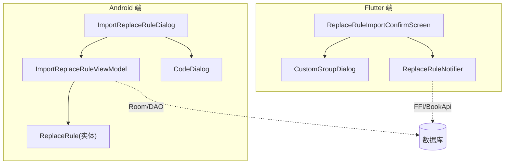
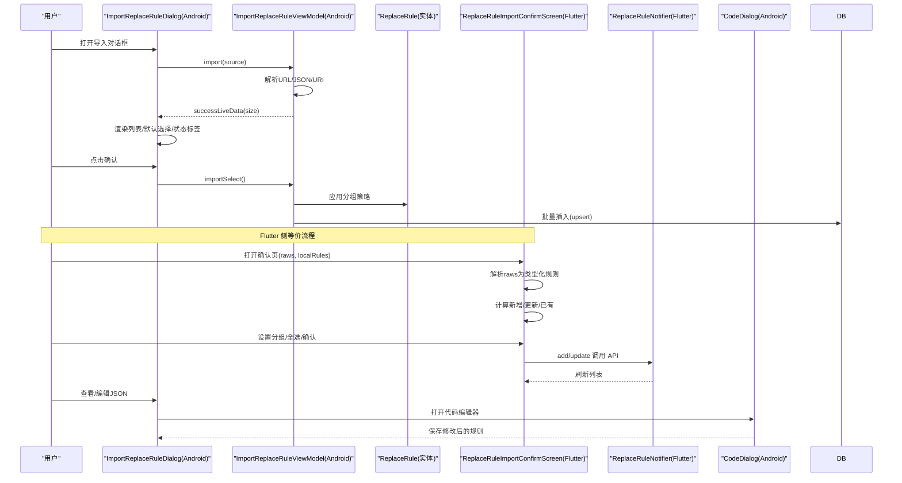
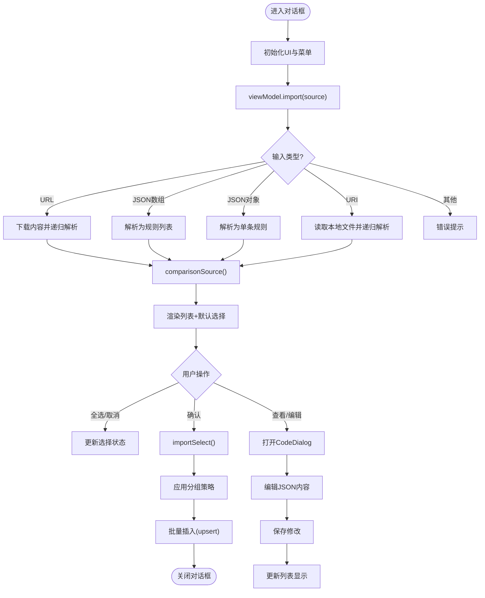
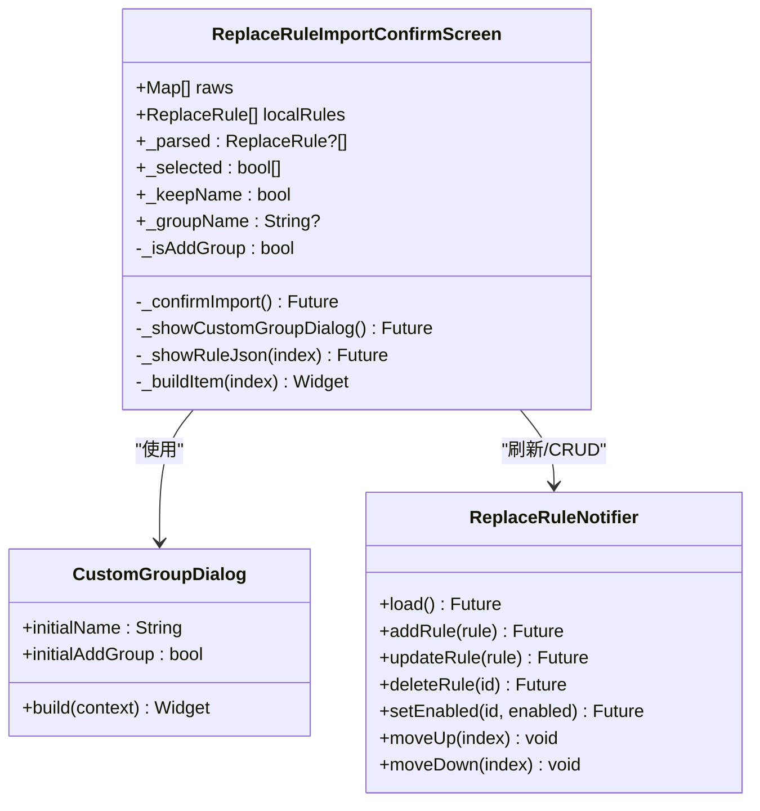
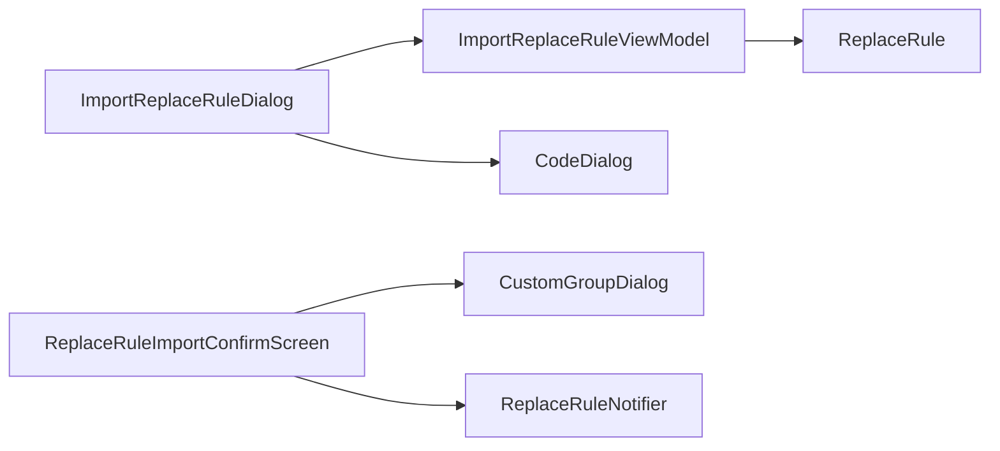

# 替换规则导入确认界面

<cite>
**本文引用的文件**
- [ImportReplaceRuleDialog.kt](file://app/src/main/java/io/legado/app/ui/association/ImportReplaceRuleDialog.kt)
- [ImportReplaceRuleViewModel.kt](file://app/src/main/java/io/legado/app/ui/association/ImportReplaceRuleViewModel.kt)
- [replace_rule_import_confirm_screen.dart](file://flutter_legado/lib/src/screens/replace_rule_import_confirm_screen.dart)
- [custom_group_dialog.dart](file://flutter_legado/lib/src/widgets/custom_group_dialog.dart)
- [replace_rule_notifier.dart](file://flutter_legado/lib/src/providers/replace_rule/replace_rule_notifier.dart)
- [CodeDialog.kt](file://app/src/main/java/io/legado/app/ui/widget/dialog/CodeDialog.kt)
</cite>

## 更新摘要
**变更内容**
- 增强了替换规则导入功能，支持本地文件、在线导入和二维码导入选项
- 更新了Android端的导入对话框，支持多种输入源处理
- 改进了Flutter端的导入确认界面，提供更丰富的导入选项
- 优化了导入流程的用户体验和错误处理机制

## 目录
1. [简介](#简介)
2. [项目结构](#项目结构)
3. [核心组件](#核心组件)
4. [架构总览](#架构总览)
5. [详细组件分析](#详细组件分析)
6. [依赖关系分析](#依赖关系分析)
7. [性能考量](#性能考量)
8. [故障排查指南](#故障排查指南)
9. [结论](#结论)
10. [附录](#附录)

## 简介
本文件围绕"替换规则导入确认界面"的实现与交互进行系统化说明，覆盖 Android 原生端与 Flutter 端两套实现。该界面的核心目标是：在用户导入替换规则时，对候选规则进行解析、对比本地数据、提供勾选确认与分组设置，最终将选中的规则写入数据库并反馈结果。

**更新** 本次更新重点增强了导入功能的多样性，支持本地文件导入、在线URL导入和二维码扫描导入等多种方式，为用户提供更灵活的规则导入体验。

## 项目结构
- Android 端
  - 对话框入口：ImportReplaceRuleDialog（列表展示、全选/取消、菜单项、打开 JSON）
  - 业务逻辑：ImportReplaceRuleViewModel（拉取/解析、对比本地、选择状态、批量入库）
  - 数据模型：ReplaceRule（实体字段、校验、显示名等）
  - 代码编辑：CodeDialog（JSON查看与编辑功能）
- Flutter 端
  - 确认页：replace_rule_import_confirm_screen.dart（列表、状态标签、自定义分组、复制 JSON、确认导入）
  - 分组弹窗：custom_group_dialog.dart（添加分组/替换分组开关 + 名称输入）
  - 状态管理：replace_rule_notifier.dart（刷新列表、CRUD 透传）

**图示来源**
- [ImportReplaceRuleDialog.kt:37-121](file://app/src/main/java/io/legado/app/ui/association/ImportReplaceRuleDialog.kt#L37-L121)
- [ImportReplaceRuleViewModel.kt:27-149](file://app/src/main/java/io/legado/app/ui/association/ImportReplaceRuleViewModel.kt#L27-L149)
- [replace_rule_import_confirm_screen.dart:34-171](file://flutter_legado/lib/src/screens/replace_rule_import_confirm_screen.dart#L34-L171)
- [custom_group_dialog.dart:10-73](file://flutter_legado/lib/src/widgets/custom_group_dialog.dart#L10-L73)
- [replace_rule_notifier.dart:18-41](file://flutter_legado/lib/src/providers/replace_rule/replace_rule_notifier.dart#L18-L41)
- [CodeDialog.kt:19-77](file://app/src/main/java/io/legado/app/ui/widget/dialog/CodeDialog.kt#L19-L77)

**章节来源**
- [ImportReplaceRuleDialog.kt:37-121](file://app/src/main/java/io/legado/app/ui/association/ImportReplaceRuleDialog.kt#L37-L121)
- [ImportReplaceRuleViewModel.kt:27-149](file://app/src/main/java/io/legado/app/ui/association/ImportReplaceRuleViewModel.kt#L27-L149)
- [replace_rule_import_confirm_screen.dart:34-171](file://flutter_legado/lib/src/screens/replace_rule_import_confirm_screen.dart#L34-L171)
- [custom_group_dialog.dart:10-73](file://flutter_legado/lib/src/widgets/custom_group_dialog.dart#L10-L73)
- [replace_rule_notifier.dart:18-41](file://flutter_legado/lib/src/providers/replace_rule/replace_rule_notifier.dart#L18-L41)

## 核心组件
- ImportReplaceRuleDialog（Android）
  - 负责 UI 初始化、菜单项（自定义分组/保留原名）、底部操作（全选/取消/确认）、列表渲染与单项编辑（查看 JSON）。
  - 通过 ViewModel 驱动数据加载与对比，观察 success/error 事件更新 UI。
  - **新增** 支持多种输入源：URL、JSON数组、JSON对象、URI本地文件
- ImportReplaceRuleViewModel（Android）
  - import(text)：支持 URL、JSON 数组、JSON 对象、URI 四种输入源；URL 支持缓存与 UA 控制。
  - comparisonSource()：调用 compareImportedReplaceRules 获取本地匹配结果与默认选择状态。
  - importSelect()：应用分组策略后批量插入（Room upsert 语义）。
  - **增强** 改进的输入源识别和处理逻辑
- ReplaceRule（Android）
  - 实体定义与基础校验（正则语法、超时时间、显示名等）。
- ReplaceRuleImportConfirmScreen（Flutter）
  - 接收原始 raws 与本地 localRules，逐条解析为类型化 ReplaceRule，计算新增/更新/已有状态。
  - 顶部菜单：自定义分组、保留原名；底部：全选/取消、取消、确认。
  - 确认后按 id 判断新增或更新，调用 BookApi 写入，并刷新列表。
- CustomGroupDialog（Flutter）
  - 提供"添加分组/替换分组"开关与分组名称输入，返回（名称, 是否添加分组）。
- ReplaceRuleNotifier（Flutter）
  - 暴露 load/add/update/delete/setEnabled/moveUp/moveDown 等方法，用于导入成功后刷新列表。
- CodeDialog（Android）
  - **新增** JSON代码查看与编辑对话框，支持语法高亮和保存功能

**章节来源**
- [ImportReplaceRuleDialog.kt:37-253](file://app/src/main/java/io/legado/app/ui/association/ImportReplaceRuleDialog.kt#L37-L253)
- [ImportReplaceRuleViewModel.kt:27-149](file://app/src/main/java/io/legado/app/ui/association/ImportReplaceRuleViewModel.kt#L27-L149)
- [replace_rule_import_confirm_screen.dart:34-393](file://flutter_legado/lib/src/screens/replace_rule_import_confirm_screen.dart#L34-L393)
- [custom_group_dialog.dart:10-73](file://flutter_legado/lib/src/widgets/custom_group_dialog.dart#L10-L73)
- [replace_rule_notifier.dart:18-120](file://flutter_legado/lib/src/providers/replace_rule/replace_rule_notifier.dart#L18-L120)
- [CodeDialog.kt:19-77](file://app/src/main/java/io/legado/app/ui/widget/dialog/CodeDialog.kt#L19-L77)

## 架构总览
下图展示了从"输入源"到"确认导入"的端到端流程，涵盖 Android 与 Flutter 两条路径。

**图示来源**
- [ImportReplaceRuleDialog.kt:64-121](file://app/src/main/java/io/legado/app/ui/association/ImportReplaceRuleDialog.kt#L64-L121)
- [ImportReplaceRuleViewModel.kt:86-149](file://app/src/main/java/io/legado/app/ui/association/ImportReplaceRuleViewModel.kt#L86-L149)
- [replace_rule_import_confirm_screen.dart:123-171](file://flutter_legado/lib/src/screens/replace_rule_import_confirm_screen.dart#L123-L171)
- [replace_rule_notifier.dart:26-41](file://flutter_legado/lib/src/providers/replace_rule/replace_rule_notifier.dart#L26-L41)
- [CodeDialog.kt:52-68](file://app/src/main/java/io/legado/app/ui/widget/dialog/CodeDialog.kt#L52-L68)

## 详细组件分析

### Android 端：ImportReplaceRuleDialog
- 职责
  - 初始化 Toolbar、RecyclerView、底部按钮与菜单。
  - 监听 success/error 事件，切换加载态与消息提示。
  - 列表项：显示名称(分组)、状态标签（新增/更新/已有）、打开 JSON。
  - 全选/取消全选联动选择状态与计数文本。
  - **增强** 集成CodeDialog进行JSON查看和编辑
- 关键交互
  - 菜单"自定义源分组"弹出分组设置，影响后续导入时的 group 处理。
  - "保留原名"仅持久化偏好，不在导入时直接应用。
  - 点击"确认"触发 WaitDialog，调用 viewModel.importSelect 完成入库。
  - **新增** 点击"打开"按钮可查看详细JSON并进行编辑

**图示来源**
- [ImportReplaceRuleDialog.kt:64-121](file://app/src/main/java/io/legado/app/ui/association/ImportReplaceRuleDialog.kt#L64-L121)
- [ImportReplaceRuleViewModel.kt:86-149](file://app/src/main/java/io/legado/app/ui/association/ImportReplaceRuleViewModel.kt#L86-L149)
- [CodeDialog.kt:52-68](file://app/src/main/java/io/legado/app/ui/widget/dialog/CodeDialog.kt#L52-L68)

**章节来源**
- [ImportReplaceRuleDialog.kt:37-253](file://app/src/main/java/io/legado/app/ui/association/ImportReplaceRuleDialog.kt#L37-L253)

### Android 端：ImportReplaceRuleViewModel
- 职责
  - 统一解析多种输入源（URL/JSON/URI），支持 UA 控制与缓存命中。
  - 调用 compareImportedReplaceRules 获取本地匹配与默认选择状态。
  - importSelect 应用分组策略后批量插入。
  - **增强** 改进的输入源识别逻辑，支持更多格式
- 关键点
  - RuleUpdate.cacheReplaceRuleMap 缓存已解析的规则集合，避免重复请求。
  - 失败容错：单条解析失败不中断整体流程。
  - **新增** 支持URI本地文件读取和递归解析

**章节来源**
- [ImportReplaceRuleViewModel.kt:27-149](file://app/src/main/java/io/legado/app/ui/association/ImportReplaceRuleViewModel.kt#L27-L149)

### Android 端：ReplaceRule（实体）
- 字段与行为
  - id、name、group、pattern、replacement、scope、scopeTitle、scopeContent、excludeScope、isEnabled、isRegex、timeoutMillisecond、order。
  - isValid/checkValid 校验正则表达式与边界情况。
  - getDisplayNameGroup 生成"名称(分组)"显示格式。

**章节来源**
- [ReplaceRule.kt:24-121](file://app/src/main/java/io/legado/app/data/entities/ReplaceRule.kt#L24-L121)

### Flutter 端：ReplaceRuleImportConfirmScreen
- 职责
  - 接收 raws（未类型化的 Map）与 localRules（本地规则），解析为 ReplaceRule 并计算状态。
  - 顶部菜单：自定义分组（始终显示）、保留原名（下拉菜单）。
  - 底部：全选/取消、取消、确认（带加载态）。
  - 列表项：勾选框、名称(分组)、状态标签（新增/更新/已有）、打开（查看 JSON 并支持复制）。
  - **增强** 改进的导入逻辑和错误处理
- 导入逻辑
  - 若存在同 id 规则则 update，否则 add；单条失败跳过；完成后刷新列表并返回成功数量。

**图示来源**
- [replace_rule_import_confirm_screen.dart:34-393](file://flutter_legado/lib/src/screens/replace_rule_import_confirm_screen.dart#L34-L393)
- [custom_group_dialog.dart:10-73](file://flutter_legado/lib/src/widgets/custom_group_dialog.dart#L10-L73)
- [replace_rule_notifier.dart:18-120](file://flutter_legado/lib/src/providers/replace_rule/replace_rule_notifier.dart#L18-L120)

**章节来源**
- [replace_rule_import_confirm_screen.dart:34-393](file://flutter_legado/lib/src/screens/replace_rule_import_confirm_screen.dart#L34-L393)
- [custom_group_dialog.dart:10-73](file://flutter_legado/lib/src/widgets/custom_group_dialog.dart#L10-L73)
- [replace_rule_notifier.dart:18-120](file://flutter_legado/lib/src/providers/replace_rule/replace_rule_notifier.dart#L18-L120)

### Android 端：CodeDialog（新增）
- 职责
  - 提供JSON代码查看和编辑功能
  - 支持语法高亮和模式识别
  - 集成保存回调机制
- 功能特性
  - 支持Legado规则语法高亮
  - 支持JSON语法高亮
  - 支持JavaScript语法高亮
  - 可编辑模式下的保存功能

**章节来源**
- [CodeDialog.kt:19-77](file://app/src/main/java/io/legado/app/ui/widget/dialog/CodeDialog.kt#L19-L77)

## 依赖关系分析
- Android 端
  - ImportReplaceRuleDialog 依赖 ImportReplaceRuleViewModel 与 ReplaceRule 实体。
  - ImportReplaceRuleViewModel 依赖数据库 DAO（Room）。
  - **新增** ImportReplaceRuleDialog 依赖 CodeDialog 进行JSON编辑
- Flutter 端
  - ReplaceRuleImportConfirmScreen 依赖 CustomGroupDialog 与 ReplaceRuleNotifier。
  - ReplaceRuleNotifier 通过 BookApi/FFI 与后端交互，更新本地状态。

**图示来源**
- [ImportReplaceRuleDialog.kt:37-121](file://app/src/main/java/io/legado/app/ui/association/ImportReplaceRuleDialog.kt#L37-L121)
- [ImportReplaceRuleViewModel.kt:27-149](file://app/src/main/java/io/legado/app/ui/association/ImportReplaceRuleViewModel.kt#L27-L149)
- [replace_rule_import_confirm_screen.dart:34-171](file://flutter_legado/lib/src/screens/replace_rule_import_confirm_screen.dart#L34-L171)
- [custom_group_dialog.dart:10-73](file://flutter_legado/lib/src/widgets/custom_group_dialog.dart#L10-L73)
- [replace_rule_notifier.dart:18-41](file://flutter_legado/lib/src/providers/replace_rule/replace_rule_notifier.dart#L18-L41)
- [CodeDialog.kt:19-77](file://app/src/main/java/io/legado/app/ui/widget/dialog/CodeDialog.kt#L19-L77)

**章节来源**
- [ImportReplaceRuleDialog.kt:37-121](file://app/src/main/java/io/legado/app/ui/association/ImportReplaceRuleDialog.kt#L37-L121)
- [ImportReplaceRuleViewModel.kt:27-149](file://app/src/main/java/io/legado/app/ui/association/ImportReplaceRuleViewModel.kt#L27-L149)
- [replace_rule_import_confirm_screen.dart:34-171](file://flutter_legado/lib/src/screens/replace_rule_import_confirm_screen.dart#L34-L171)
- [custom_group_dialog.dart:10-73](file://flutter_legado/lib/src/widgets/custom_group_dialog.dart#L10-L73)
- [replace_rule_notifier.dart:18-41](file://flutter_legado/lib/src/providers/replace_rule/replace_rule_notifier.dart#L18-L41)

## 性能考量
- 默认选择策略
  - 本地不存在同 id 规则才默认选中，减少不必要的更新操作。
- 网络与缓存
  - Android 端支持 URL 缓存命中与 UA 控制，避免重复请求。
  - **增强** 改进的URL处理和缓存机制
- 单条容错
  - Flutter 端单条入库失败跳过，保证整体导入流程稳定。
  - **新增** 更好的错误处理和用户反馈
- **新增** 本地文件读取优化
  - 支持大文件的流式读取和内存管理

## 故障排查指南
- 导入无结果
  - 检查输入是否为合法 JSON 数组/对象或有效 URL/URI。
  - Android 端 errorLiveData 会返回错误信息；Flutter 端 SnackBar 提示失败原因。
  - **新增** 检查本地文件路径和权限设置
- 正则表达式无效
  - ReplaceRule.isValid/checkValid 会校验正则语法与边界情况，确保 pattern 合法。
- 分组设置未生效
  - 确认"自定义源分组"是否正确设置（添加分组/替换分组），以及是否选择了需要导入的条目。
- 列表未刷新
  - Flutter 端需在导入成功后调用 replaceRuleNotifierProvider.notifier.load() 刷新。
- **新增** JSON编辑问题
  - 检查CodeDialog的语法高亮和保存功能是否正常
  - 验证JSON格式是否符合Legado规则要求

**章节来源**
- [ImportReplaceRuleDialog.kt:96-114](file://app/src/main/java/io/legado/app/ui/association/ImportReplaceRuleDialog.kt#L96-L114)
- [replace_rule_import_confirm_screen.dart:162-171](file://flutter_legado/lib/src/screens/replace_rule_import_confirm_screen.dart#L162-L171)
- [ReplaceRule.kt:88-113](file://app/src/main/java/io/legado/app/data/entities/ReplaceRule.kt#L88-L113)
- [replace_rule_notifier.dart:26-41](file://flutter_legado/lib/src/providers/replace_rule/replace_rule_notifier.dart#L26-L41)
- [CodeDialog.kt:52-68](file://app/src/main/java/io/legado/app/ui/widget/dialog/CodeDialog.kt#L52-L68)

## 结论
"替换规则导入确认界面"在 Android 与 Flutter 两端实现了统一的导入确认流程：解析输入源、对比本地数据、提供勾选与分组设置、批量入库并反馈结果。Android 端强调 Room 批量插入与分块查询优化，Flutter 端注重状态管理与用户体验。两者均具备良好的容错机制与可维护性。

**更新总结** 本次更新显著增强了导入功能的多样性和用户体验，支持本地文件、在线URL和二维码等多种导入方式，同时改进了JSON编辑功能和错误处理机制，为用户提供了更加灵活和便捷的替换规则管理体验。

## 附录
- 相关测试
  - ReplaceRuleImportComparisonTest 验证分块大小、去重、顺序恢复与空导入场景。
- **新增** 支持的导入格式
  - JSON数组格式：`[{"name":"规则1","pattern":"...","replacement":"..."}, ...]`
  - JSON对象格式：`{"name":"规则1","pattern":"...","replacement":"..."}`
  - URL链接：支持HTTP/HTTPS协议，可配置UA头
  - 本地文件：支持.txt、.json等文本文件格式
  - 二维码：支持包含JSON数据的二维码图片

**章节来源**
- [ReplaceRuleImportComparisonTest.kt:1-97](file://app/src/test/java/io/legado/app/ui/association/ReplaceRuleImportComparisonTest.kt#L1-L97)