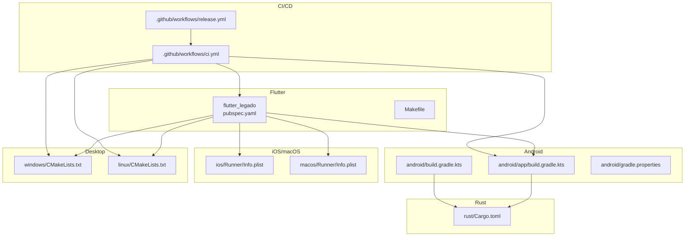
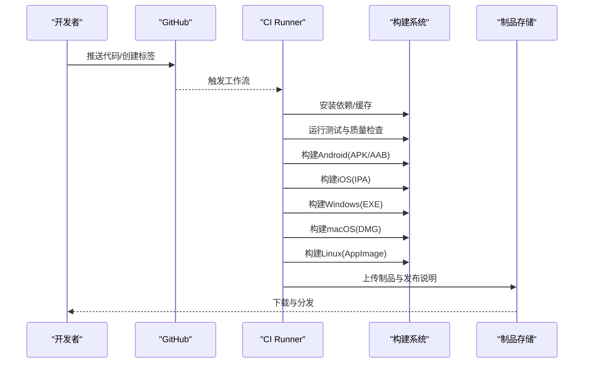
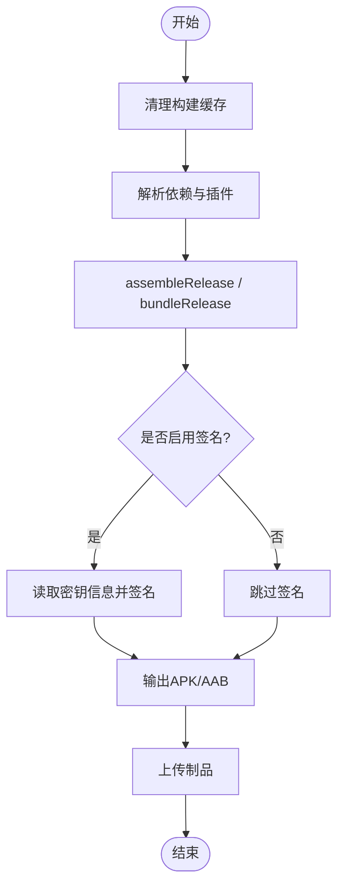
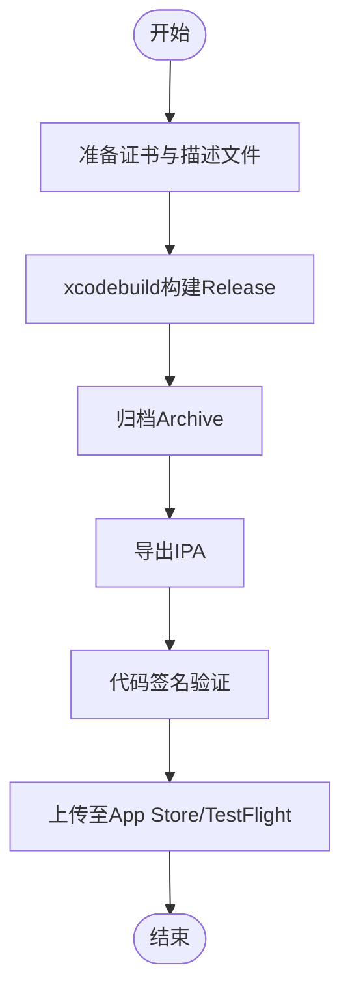
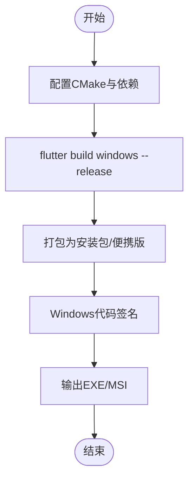
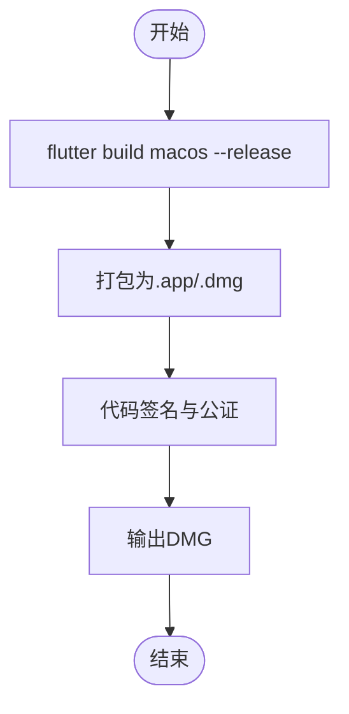
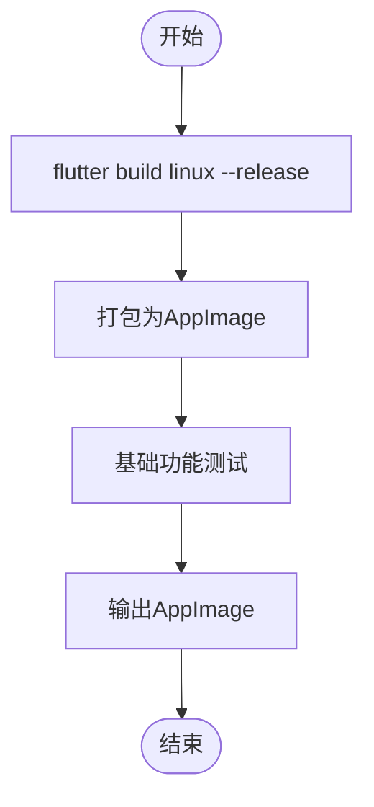
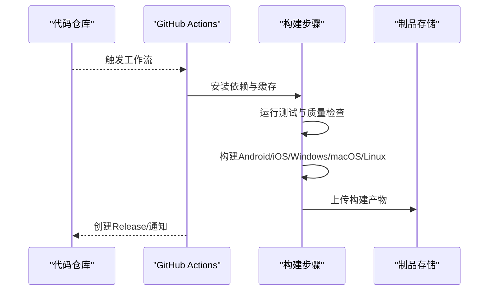
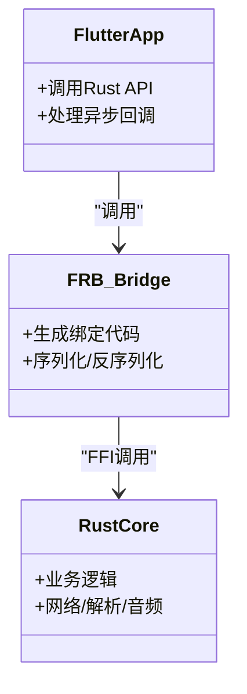
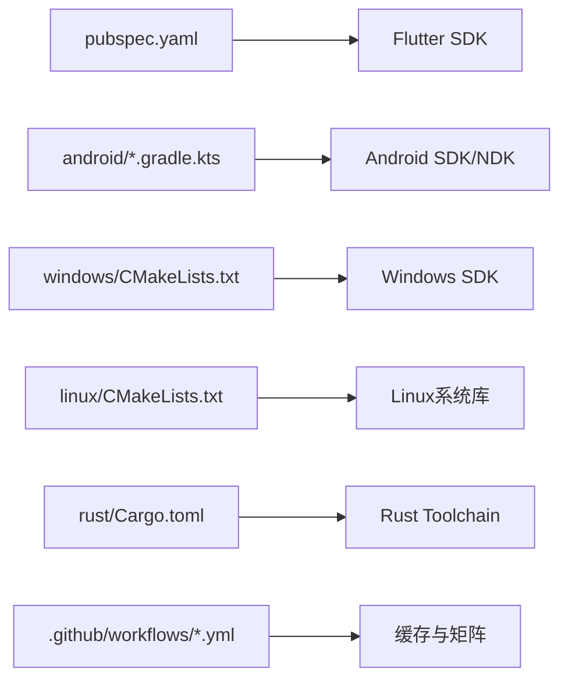

# 构建和部署

<cite>
**本文引用的文件**   
- [flutter_legado/pubspec.yaml](file://flutter_legado/pubspec.yaml)
- [flutter_legado/Makefile](file://flutter_legado/Makefile)
- [flutter_legado/scripts/build-apk.ps1](file://flutter_legado/scripts/build-apk.ps1)
- [flutter_legado/scripts/build-windows.ps1](file://flutter_legado/scripts/build-windows.ps1)
- [flutter_legado/scripts/build-windows.bat](file://flutter_legado/scripts/build-windows.bat)
- [flutter_legado/android/app/build.gradle.kts](file://flutter_legado/android/app/build.gradle.kts)
- [flutter_legado/android/build.gradle.kts](file://flutter_legado/android/build.gradle.kts)
- [flutter_legado/android/gradle.properties](file://flutter_legado/android/gradle.properties)
- [flutter_legado/ios/Runner/Info.plist](file://flutter_legado/ios/Runner/Info.plist)
- [flutter_legado/macos/Runner/Info.plist](file://flutter_legado/macos/Runner/Info.plist)
- [flutter_legado/linux/CMakeLists.txt](file://flutter_legado/linux/CMakeLists.txt)
- [flutter_legado/windows/CMakeLists.txt](file://flutter_legado/windows/CMakeLists.txt)
- [.github/workflows/ci.yml](file://.github/workflows/ci.yml)
- [.github/workflows/release.yml](file://.github/workflows/release.yml)
- [.github/release.yml](file://.github/release.yml)
- [app/build.gradle](file://app/build.gradle)
- [app/proguard-rules.pro](file://app/proguard-rules.pro)
- [app/download.gradle](file://app/download.gradle)
- [rust/Cargo.toml](file://rust/Cargo.toml)
</cite>

## 目录
1. [简介](#简介)
2. [项目结构](#项目结构)
3. [核心组件](#核心组件)
4. [架构总览](#架构总览)
5. [详细组件分析](#详细组件分析)
6. [依赖分析](#依赖分析)
7. [性能考虑](#性能考虑)
8. [故障排除指南](#故障排除指南)
9. [结论](#结论)
10. [附录](#附录)

## 简介
本文件面向Flutter与原生混合工程（Android/iOS/Windows/macOS/Linux）的构建与部署，覆盖多平台产物（APK/AAB、IPA、EXE、DMG、AppImage等）、CI/CD流水线（GitHub Actions）、签名与发布流程（应用商店、热更新）、构建优化（混淆、压缩、增量构建）以及常见问题排查。文档基于仓库中的Flutter模块、Android Gradle配置、CMake目标、脚本与GitHub工作流进行说明，确保读者可据此搭建本地与自动化构建环境并稳定产出各平台安装包。

## 项目结构
本项目采用“Flutter + Android原生 + Rust FFI”的多语言混合架构：
- Flutter层负责跨平台UI与业务逻辑
- Android端通过Gradle构建APK/AAB，并与Rust FFI集成
- iOS/macOS使用Xcode工程与CocoaPods/Flutter插件体系
- Windows/Linux通过CMake生成可执行包或AppImage
- Rust核心库提供高性能计算与FFI桥接
- GitHub Actions用于CI/CD与制品发布

图表来源
- [flutter_legado/pubspec.yaml](file://flutter_legado/pubspec.yaml)
- [flutter_legado/Makefile](file://flutter_legado/Makefile)
- [flutter_legado/android/app/build.gradle.kts](file://flutter_legado/android/app/build.gradle.kts)
- [flutter_legado/android/build.gradle.kts](file://flutter_legado/android/build.gradle.kts)
- [flutter_legado/ios/Runner/Info.plist](file://flutter_legado/ios/Runner/Info.plist)
- [flutter_legado/macos/Runner/Info.plist](file://flutter_legado/macos/Runner/Info.plist)
- [flutter_legado/windows/CMakeLists.txt](file://flutter_legado/windows/CMakeLists.txt)
- [flutter_legado/linux/CMakeLists.txt](file://flutter_legado/linux/CMakeLists.txt)
- [rust/Cargo.toml](file://rust/Cargo.toml)
- [.github/workflows/ci.yml](file://.github/workflows/ci.yml)
- [.github/workflows/release.yml](file://.github/workflows/release.yml)

章节来源
- [flutter_legado/pubspec.yaml](file://flutter_legado/pubspec.yaml)
- [flutter_legado/Makefile](file://flutter_legado/Makefile)
- [flutter_legado/android/app/build.gradle.kts](file://flutter_legado/android/app/build.gradle.kts)
- [flutter_legado/android/build.gradle.kts](file://flutter_legado/android/build.gradle.kts)
- [flutter_legado/ios/Runner/Info.plist](file://flutter_legado/ios/Runner/Info.plist)
- [flutter_legado/macos/Runner/Info.plist](file://flutter_legado/macos/Runner/Info.plist)
- [flutter_legado/windows/CMakeLists.txt](file://flutter_legado/windows/CMakeLists.txt)
- [flutter_legado/linux/CMakeLists.txt](file://flutter_legado/linux/CMakeLists.txt)
- [rust/Cargo.toml](file://rust/Cargo.toml)
- [.github/workflows/ci.yml](file://.github/workflows/ci.yml)
- [.github/workflows/release.yml](file://.github/workflows/release.yml)

## 核心组件
- Flutter工程入口与依赖管理：pubspec.yaml定义依赖、资源、平台能力与构建变体
- Android构建系统：Gradle/Kotlin DSL配置签名、变体、ProGuard规则与下载任务
- iOS/macOS配置：Info.plist定义权限、Bundle标识与应用元数据
- Desktop构建：CMakeLists.txt定义编译目标、链接库与打包参数
- Rust核心与FFI：Cargo.toml组织crate与依赖，供Android与Flutter调用
- 构建脚本：PowerShell/BAT批处理封装常用构建命令
- CI/CD：GitHub Actions工作流实现测试、质量检查、构建与发布

章节来源
- [flutter_legado/pubspec.yaml](file://flutter_legado/pubspec.yaml)
- [flutter_legado/android/app/build.gradle.kts](file://flutter_legado/android/app/build.gradle.kts)
- [flutter_legado/ios/Runner/Info.plist](file://flutter_legado/ios/Runner/Info.plist)
- [flutter_legado/macos/Runner/Info.plist](file://flutter_legado/macos/Runner/Info.plist)
- [flutter_legado/windows/CMakeLists.txt](file://flutter_legado/windows/CMakeLists.txt)
- [flutter_legado/linux/CMakeLists.txt](file://flutter_legado/linux/CMakeLists.txt)
- [rust/Cargo.toml](file://rust/Cargo.toml)
- [flutter_legado/scripts/build-apk.ps1](file://flutter_legado/scripts/build-apk.ps1)
- [flutter_legado/scripts/build-windows.ps1](file://flutter_legado/scripts/build-windows.ps1)
- [flutter_legado/scripts/build-windows.bat](file://flutter_legado/scripts/build-windows.bat)

## 架构总览
下图展示从代码提交到产物的端到端流程：开发者提交触发CI，执行静态检查与单元测试；随后按平台并行构建，生成APK/AAB、IPA、EXE、DMG、AppImage等；最后上传至Release或分发渠道。

图表来源
- [.github/workflows/ci.yml](file://.github/workflows/ci.yml)
- [.github/workflows/release.yml](file://.github/workflows/release.yml)

## 详细组件分析

### Android构建（APK/AAB）
- 构建入口与变体：通过Gradle Kotlin DSL配置buildTypes与flavors，支持debug/release与多渠道
- 签名配置：在Gradle中配置keystore路径、别名与密码，或使用环境变量注入
- ProGuard/R8：启用混淆与裁剪，结合proguard-rules.pro与cronet-proguard-rules.pro
- 资源与下载任务：download.gradle用于拉取外部依赖或资源
- 构建脚本：scripts/build-apk.ps1封装签名与产物输出

图表来源
- [flutter_legado/android/app/build.gradle.kts](file://flutter_legado/android/app/build.gradle.kts)
- [flutter_legado/android/build.gradle.kts](file://flutter_legado/android/build.gradle.kts)
- [flutter_legado/android/gradle.properties](file://flutter_legado/android/gradle.properties)
- [app/build.gradle](file://app/build.gradle)
- [app/proguard-rules.pro](file://app/proguard-rules.pro)
- [app/download.gradle](file://app/download.gradle)
- [flutter_legado/scripts/build-apk.ps1](file://flutter_legado/scripts/build-apk.ps1)

章节来源
- [flutter_legado/android/app/build.gradle.kts](file://flutter_legado/android/app/build.gradle.kts)
- [flutter_legado/android/build.gradle.kts](file://flutter_legado/android/build.gradle.kts)
- [flutter_legado/android/gradle.properties](file://flutter_legado/android/gradle.properties)
- [app/build.gradle](file://app/build.gradle)
- [app/proguard-rules.pro](file://app/proguard-rules.pro)
- [app/download.gradle](file://app/download.gradle)
- [flutter_legado/scripts/build-apk.ps1](file://flutter_legado/scripts/build-apk.ps1)

### iOS构建（IPA）
- 工程配置：Info.plist定义Bundle ID、权限与版本信息
- Xcode构建：通过xcodebuild或fastlane生成IPA，支持签名与归档
- 签名与证书：使用Apple Developer账号与 provisioning profile
- 发布：上传至App Store Connect或通过TestFlight分发

图表来源
- [flutter_legado/ios/Runner/Info.plist](file://flutter_legado/ios/Runner/Info.plist)

章节来源
- [flutter_legado/ios/Runner/Info.plist](file://flutter_legado/ios/Runner/Info.plist)

### Windows构建（EXE）
- CMake目标：windows/CMakeLists.txt定义可执行目标、链接库与资源
- 构建脚本：build-windows.ps1/bat封装flutter build windows与产物整理
- 签名：使用Windows SDK工具对EXE进行签名

图表来源
- [flutter_legado/windows/CMakeLists.txt](file://flutter_legado/windows/CMakeLists.txt)
- [flutter_legado/scripts/build-windows.ps1](file://flutter_legado/scripts/build-windows.ps1)
- [flutter_legado/scripts/build-windows.bat](file://flutter_legado/scripts/build-windows.bat)

章节来源
- [flutter_legado/windows/CMakeLists.txt](file://flutter_legado/windows/CMakeLists.txt)
- [flutter_legado/scripts/build-windows.ps1](file://flutter_legado/scripts/build-windows.ps1)
- [flutter_legado/scripts/build-windows.bat](file://flutter_legado/scripts/build-windows.bat)

### macOS构建（DMG）
- 工程配置：macos/Runner/Info.plist定义Bundle信息与权限
- 构建流程：flutter build macos生成.app，再用productbuild或codesign制作DMG
- 签名与公证：使用Apple证书签名并进行Notarization

图表来源
- [flutter_legado/macos/Runner/Info.plist](file://flutter_legado/macos/Runner/Info.plist)

章节来源
- [flutter_legado/macos/Runner/Info.plist](file://flutter_legado/macos/Runner/Info.plist)

### Linux构建（AppImage）
- CMake目标：linux/CMakeLists.txt定义可执行与依赖
- 构建流程：flutter build linux生成可执行，再打包为AppImage
- 依赖管理：确保运行时库可用，必要时使用FPM或linuxdeploy

图表来源
- [flutter_legado/linux/CMakeLists.txt](file://flutter_legado/linux/CMakeLists.txt)

章节来源
- [flutter_legado/linux/CMakeLists.txt](file://flutter_legado/linux/CMakeLists.txt)

### CI/CD流水线（GitHub Actions）
- 触发条件：push、pull_request、tag事件
- 步骤：环境准备、依赖缓存、单元测试、静态检查、多平台构建、制品上传
- 发布：根据标签自动创建Release并上传产物

图表来源
- [.github/workflows/ci.yml](file://.github/workflows/ci.yml)
- [.github/workflows/release.yml](file://.github/workflows/release.yml)
- [.github/release.yml](file://.github/release.yml)

章节来源
- [.github/workflows/ci.yml](file://.github/workflows/ci.yml)
- [.github/workflows/release.yml](file://.github/workflows/release.yml)
- [.github/release.yml](file://.github/release.yml)

### Rust核心与FFI集成
- Cargo组织：rust/Cargo.toml定义crate与依赖，暴露FFI接口
- Android集成：Gradle调用cargo构建动态库，并在JNI层桥接
- Flutter调用：通过flutter_rust_bridge生成绑定，Flutter侧调用Rust函数

图表来源
- [rust/Cargo.toml](file://rust/Cargo.toml)

章节来源
- [rust/Cargo.toml](file://rust/Cargo.toml)

## 依赖分析
- Flutter依赖：pubspec.yaml声明Dart包与平台插件
- Android依赖：Gradle管理Kotlin、插件与第三方库
- Desktop依赖：CMakeLists.txt链接系统库与Flutter引擎
- Rust依赖：Cargo.toml管理crate与特性开关
- CI依赖：Actions矩阵与缓存策略提升构建速度

图表来源
- [flutter_legado/pubspec.yaml](file://flutter_legado/pubspec.yaml)
- [flutter_legado/android/app/build.gradle.kts](file://flutter_legado/android/app/build.gradle.kts)
- [flutter_legado/windows/CMakeLists.txt](file://flutter_legado/windows/CMakeLists.txt)
- [flutter_legado/linux/CMakeLists.txt](file://flutter_legado/linux/CMakeLists.txt)
- [rust/Cargo.toml](file://rust/Cargo.toml)
- [.github/workflows/ci.yml](file://.github/workflows/ci.yml)

章节来源
- [flutter_legado/pubspec.yaml](file://flutter_legado/pubspec.yaml)
- [flutter_legado/android/app/build.gradle.kts](file://flutter_legado/android/app/build.gradle.kts)
- [flutter_legado/windows/CMakeLists.txt](file://flutter_legado/windows/CMakeLists.txt)
- [flutter_legado/linux/CMakeLists.txt](file://flutter_legado/linux/CMakeLists.txt)
- [rust/Cargo.toml](file://rust/Cargo.toml)
- [.github/workflows/ci.yml](file://.github/workflows/ci.yml)

## 性能考虑
- 增量构建：启用Gradle守护进程与并行构建，利用构建缓存与文件系统缓存
- 代码混淆：Android启用R8/ProGuard，裁剪未使用代码与资源
- 资源压缩：图片与资源按需裁剪，启用WebP/AVIF，减少包体积
- 构建优化：使用构建变体分离调试与发布，避免不必要的编译
- Rust优化：开启release优化与LTO，合理划分crate减少链接时间
- CI加速：缓存依赖与中间产物，矩阵化并行构建不同平台

[本节为通用指导，不直接分析具体文件]

## 故障排除指南
- Android构建失败
  - 检查Gradle版本与Android SDK路径
  - 确认keystore与签名信息正确
  - 查看ProGuard规则冲突
- iOS构建失败
  - 校验证书与描述文件有效期
  - 检查Info.plist权限声明
- Windows/Linux构建失败
  - 确认CMake与编译器版本兼容
  - 检查系统依赖库是否安装
- Rust编译失败
  - 检查toolchain与目标三元组
  - 查看cargo日志定位错误
- CI失败
  - 检查环境变量与密钥注入
  - 查看缓存命中情况与矩阵配置

章节来源
- [flutter_legado/android/app/build.gradle.kts](file://flutter_legado/android/app/build.gradle.kts)
- [flutter_legado/ios/Runner/Info.plist](file://flutter_legado/ios/Runner/Info.plist)
- [flutter_legado/windows/CMakeLists.txt](file://flutter_legado/windows/CMakeLists.txt)
- [flutter_legado/linux/CMakeLists.txt](file://flutter_legado/linux/CMakeLists.txt)
- [rust/Cargo.toml](file://rust/Cargo.toml)
- [.github/workflows/ci.yml](file://.github/workflows/ci.yml)

## 结论
通过统一的Flutter工程与多平台构建配置，配合CI/CD流水线，可实现稳定的跨平台构建与发布。建议持续优化构建速度与产物体积，完善签名与发布流程，建立完善的监控与回滚机制，保障发布质量与用户体验。

[本节为总结性内容，不直接分析具体文件]

## 附录
- 常用命令参考
  - Android：assembleRelease、bundleRelease
  - iOS：xcodebuild archive/export
  - Windows：flutter build windows
  - macOS：flutter build macos
  - Linux：flutter build linux
- 制品命名规范
  - 包含版本号与平台后缀，便于识别与追溯
- 安全建议
  - 密钥与证书妥善保管，使用加密存储
  - 最小权限原则配置应用权限

[本节为补充信息，不直接分析具体文件]