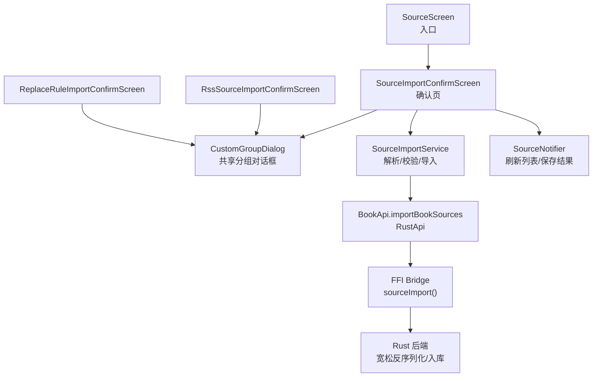
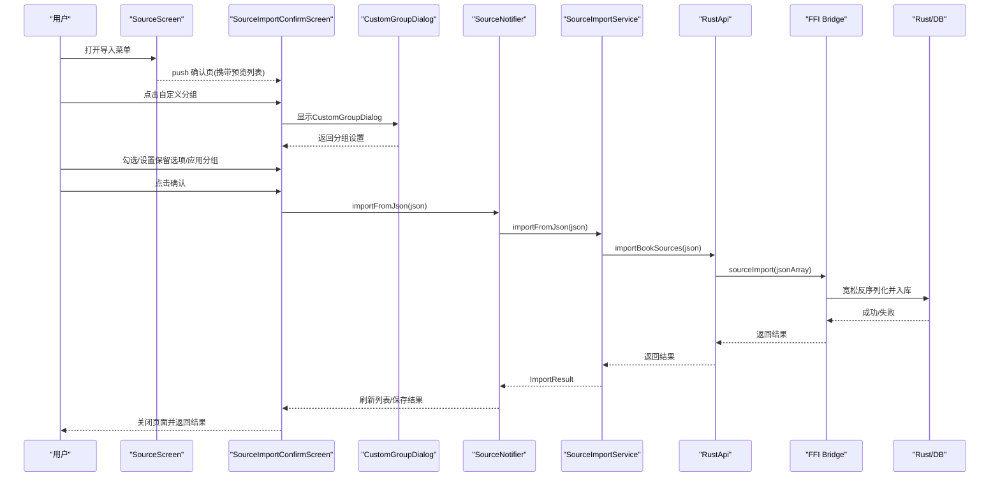
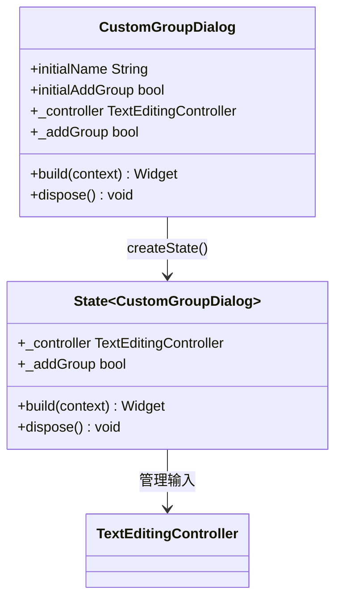
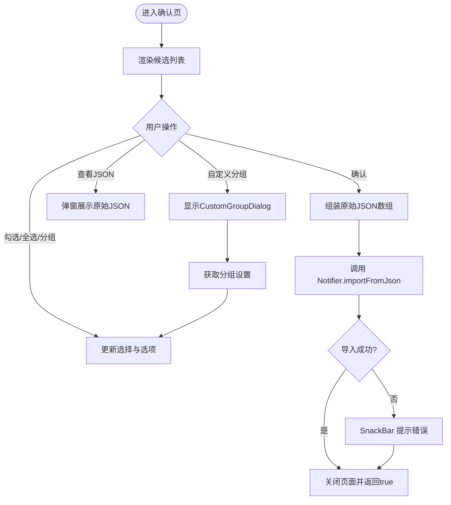
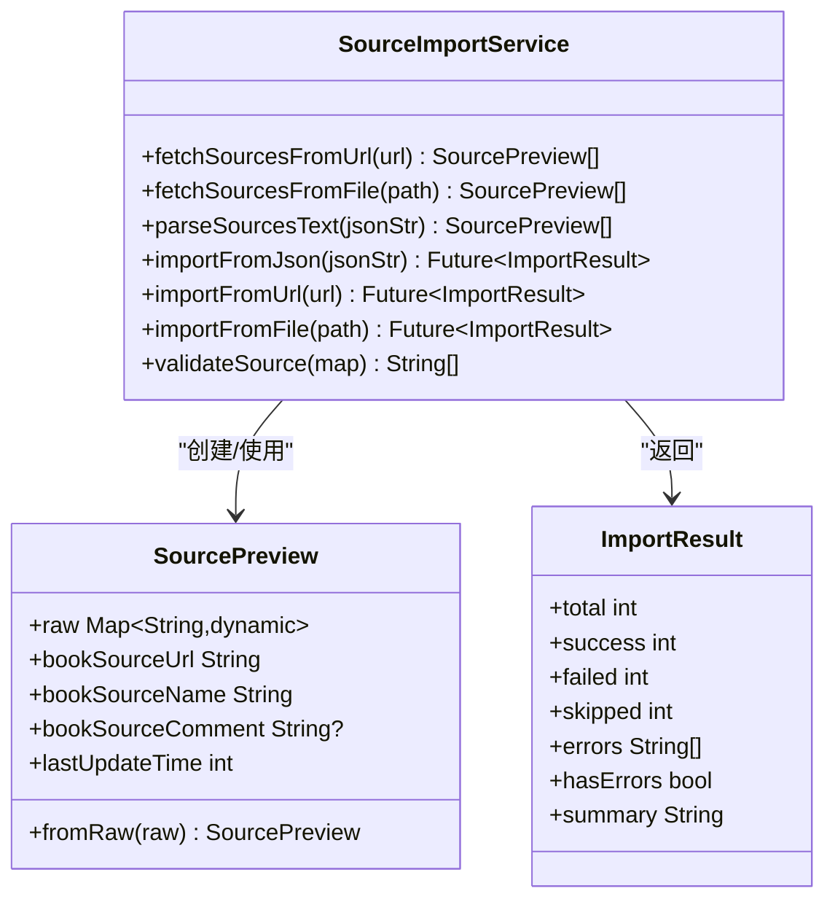
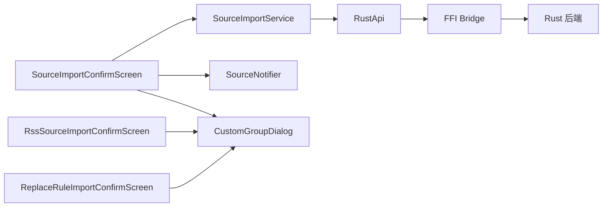

# 源导入确认界面

<cite>
**本文引用的文件**   
- [source_import_confirm_screen.dart](file://flutter_legado/lib/src/screens/source_import_confirm_screen.dart)
- [custom_group_dialog.dart](file://flutter_legado/lib/src/widgets/custom_group_dialog.dart)
- [rss_source_import_confirm_screen.dart](file://flutter_legado/lib/src/screens/rss_source_import_confirm_screen.dart)
- [replace_rule_import_confirm_screen.dart](file://flutter_legado/lib/src/screens/replace_rule_import_confirm_screen.dart)
- [source_import_service.dart](file://flutter_legado/lib/src/services/source_import_service.dart)
- [source_notifier.dart](file://flutter_legado/lib/src/providers/source/source_notifier.dart)
- [book_source.dart](file://flutter_legado/lib/src/models/book_source.dart)
- [source_screen.dart](file://flutter_legado/lib/src/screens/source_screen.dart)
- [rust_api.dart](file://flutter_legado/lib/src/services/rust_api.dart)
- [ffi.dart](file://flutter_legado/lib/src/bridge/ffi/ffi.dart)
- [source_import_service_test.dart](file://flutter_legado/test/unit/source_import_service_test.dart)
- [source_import_crash_regression_test.dart](file://flutter_legado/test/widget/source_import_crash_regression_test.dart)
</cite>

## 更新摘要
**所做更改**   
- 更新了自定义分组对话框组件的集成说明
- 新增共享CustomGroupDialog组件的详细分析
- 更新了所有导入确认界面的统一化设计模式
- 增强了组件复用性和一致性说明

## 目录
1. [简介](#简介)
2. [项目结构](#项目结构)
3. [核心组件](#核心组件)
4. [架构总览](#架构总览)
5. [详细组件分析](#详细组件分析)
6. [依赖分析](#依赖分析)
7. [性能考量](#性能考量)
8. [故障排查指南](#故障排查指南)
9. [结论](#结论)
10. [附录](#附录)

## 简介
本文件聚焦"源导入确认界面"的实现与流程，涵盖 Flutter 侧的确认页、预览解析服务、状态管理以及 Rust FFI 调用链路。该功能允许用户从 URL/文件/剪贴板获取书源 JSON，进行轻量预览与勾选确认，再按保留策略（原名、分组、启用状态等）写入数据库。**最新更新**：已集成统一的CustomGroupDialog组件，确保所有导入操作的一致性和可维护性。

## 项目结构
围绕"源导入确认界面"的关键代码分布在以下模块：
- UI 层：确认页与入口跳转，现已统一使用CustomGroupDialog组件
- 服务层：JSON 解析、校验、导入编排
- 状态层：Notifier 统一更新列表与结果
- 数据模型：BookSource 实体
- 桥接层：Rust FFI 调用
- **新增**：共享组件层：CustomGroupDialog统一分组对话框

**图表来源**
- [source_screen.dart](file://flutter_legado/lib/src/screens/source_screen.dart)
- [source_import_confirm_screen.dart](file://flutter_legado/lib/src/screens/source_import_confirm_screen.dart)
- [custom_group_dialog.dart](file://flutter_legado/lib/src/widgets/custom_group_dialog.dart)
- [rss_source_import_confirm_screen.dart](file://flutter_legado/lib/src/screens/rss_source_import_confirm_screen.dart)
- [replace_rule_import_confirm_screen.dart](file://flutter_legado/lib/src/screens/replace_rule_import_confirm_screen.dart)

章节来源
- [source_screen.dart](file://flutter_legado/lib/src/screens/source_screen.dart)
- [source_import_confirm_screen.dart](file://flutter_legado/lib/src/screens/source_import_confirm_screen.dart)
- [custom_group_dialog.dart](file://flutter_legado/lib/src/widgets/custom_group_dialog.dart)
- [rss_source_import_confirm_screen.dart](file://flutter_legado/lib/src/screens/rss_source_import_confirm_screen.dart)
- [replace_rule_import_confirm_screen.dart](file://flutter_legado/lib/src/screens/replace_rule_import_confirm_screen.dart)

## 核心组件
- **SourceImportConfirmScreen**：确认页 UI，展示候选书源、选择与批量操作、**使用CustomGroupDialog进行自定义分组**、查看原始 JSON、确认导入。
- **CustomGroupDialog**：**新增**共享分组对话框组件，提供统一的分组名称输入和添加分组开关功能。
- SourceImportService：轻量预览解析、严格校验、批量导入、URL/文件读取、超时处理。
- SourceNotifier：导入后刷新本地书源列表，维护 lastImportResult。
- BookSource：自由冻结的数据模型，用于本地持久化与 UI 展示。
- RustApi/FFI：将 JSON 字符串透传到 Rust 侧进行宽松反序列化和入库。

**更新**：CustomGroupDialog组件已被所有导入确认界面统一使用，包括书源、订阅源和替换规则的导入界面。

章节来源
- [source_import_confirm_screen.dart](file://flutter_legado/lib/src/screens/source_import_confirm_screen.dart)
- [custom_group_dialog.dart](file://flutter_legado/lib/src/widgets/custom_group_dialog.dart)
- [rss_source_import_confirm_screen.dart](file://flutter_legado/lib/src/screens/rss_source_import_confirm_screen.dart)
- [replace_rule_import_confirm_screen.dart](file://flutter_legado/lib/src/screens/replace_rule_import_confirm_screen.dart)
- [source_import_service.dart](file://flutter_legado/lib/src/services/source_import_service.dart)
- [source_notifier.dart](file://flutter_legado/lib/src/providers/source/source_notifier.dart)
- [book_source.dart](file://flutter_legado/lib/src/models/book_source.dart)
- [rust_api.dart](file://flutter_legado/lib/src/services/rust_api.dart)
- [ffi.dart](file://flutter_legado/lib/src/bridge/ffi/ffi.dart)

## 架构总览
确认导入的整体时序如下，**现已包含统一的CustomGroupDialog组件**：

**图表来源**
- [source_screen.dart](file://flutter_legado/lib/src/screens/source_screen.dart)
- [source_import_confirm_screen.dart](file://flutter_legado/lib/src/screens/source_import_confirm_screen.dart)
- [custom_group_dialog.dart](file://flutter_legado/lib/src/widgets/custom_group_dialog.dart)
- [source_notifier.dart](file://flutter_legado/lib/src/providers/source/source_notifier.dart)
- [source_import_service.dart](file://flutter_legado/lib/src/services/source_import_service.dart)
- [rust_api.dart](file://flutter_legado/lib/src/services/rust_api.dart)
- [ffi.dart](file://flutter_legado/lib/src/bridge/ffi/ffi.dart)

## 详细组件分析

### CustomGroupDialog（共享分组对话框）
**新增组件**：统一的自定义分组对话框，被所有导入确认界面复用。

- **功能特性**
  - 分组名称输入框：支持文本编辑和验证
  - 添加分组开关：切换替换或追加模式
  - 生命周期管理：控制器随对话框子树卸载释放，避免断言错误
  - 返回值：返回元组`(分组名, 是否添加分组)`，取消时返回null

- **设计优势**
  - 统一用户体验：所有导入界面使用相同的分组设置交互
  - 代码复用：减少重复的分組对话框实现
  - 易于维护：修改分组逻辑只需更新单一组件
  - 生命周期安全：避免Flutter框架在退场动画期间的dispose断言

**图表来源**
- [custom_group_dialog.dart](file://flutter_legado/lib/src/widgets/custom_group_dialog.dart)

章节来源
- [custom_group_dialog.dart](file://flutter_legado/lib/src/widgets/custom_group_dialog.dart)

### SourceImportConfirmScreen（确认页）
- **功能要点**
  - 列表项：勾选框 + 源名 + 状态标签（新增/更新/已有）+ "打开"查看原始 JSON。
  - 顶部菜单：**使用CustomGroupDialog进行自定义分组**；选中新增源/更新源；保留原名/分组/启用状态；显示源注释。
  - 底部操作：全选/取消全选（n/m）、取消、确认。
  - 默认选中策略：新增与更新默认选中，已有不选。
  - 自定义分组：**通过CustomGroupDialog获取分组设置**。
  - 确认导入：对选中项应用保留策略与分组策略，生成原始 JSON 数组，调用 Notifier 导入。
- **关键交互**
  - 查看 JSON：弹出对话框，支持复制原始 JSON。
  - 错误提示：导入失败时通过 SnackBar 提示。
  - **分组设置**：点击"自定义源分组"按钮显示CustomGroupDialog。
- **复杂度与性能**
  - 列表渲染为 ListView.separated，按需构建。
  - 状态判定基于本地 Map 索引，时间复杂度 O(1)。

**更新**：现在使用CustomGroupDialog组件替代内部分组对话框实现，提升了代码复用性和一致性。

**图表来源**
- [source_import_confirm_screen.dart](file://flutter_legado/lib/src/screens/source_import_confirm_screen.dart)
- [custom_group_dialog.dart](file://flutter_legado/lib/src/widgets/custom_group_dialog.dart)

章节来源
- [source_import_confirm_screen.dart](file://flutter_legado/lib/src/screens/source_import_confirm_screen.dart)
- [custom_group_dialog.dart](file://flutter_legado/lib/src/widgets/custom_group_dialog.dart)

### 其他导入确认界面（统一化）
**更新**：所有导入确认界面现在都使用统一的CustomGroupDialog组件。

- **RssSourceImportConfirmScreen**：订阅源导入确认界面，同样集成了CustomGroupDialog。
- **ReplaceRuleImportConfirmScreen**：替换规则导入确认界面，也使用了CustomGroupDialog。

这些界面共享相同的设计模式和交互体验，确保了用户在不同导入场景下的一致性。

章节来源
- [rss_source_import_confirm_screen.dart](file://flutter_legado/lib/src/screens/rss_source_import_confirm_screen.dart)
- [replace_rule_import_confirm_screen.dart](file://flutter_legado/lib/src/screens/replace_rule_import_confirm_screen.dart)
- [custom_group_dialog.dart](file://flutter_legado/lib/src/widgets/custom_group_dialog.dart)

### SourceImportService（导入服务）
- 功能要点
  - 轻量预览：parseSourcesText 支持单个对象或数组，宽容提取展示字段，保留原始 Map。
  - 校验规则：validateSource 要求 bookSourceUrl 与 bookSourceName 非空。
  - 导入流程：importFromJson 逐条校验、调用 API 导入，统计 total/success/failed/skipped/errors。
  - 网络/文件导入：importFromUrl/importFromFile 封装超时与 IO 异常。
- 设计动机
  - 第三方书源常含字符串数字/字符串布尔，避免严格 freezed 解析导致整批丢弃。
  - 确认导入时直传原始 JSON，交由 Rust 侧宽松反序列化兜底。

**图表来源**
- [source_import_service.dart](file://flutter_legado/lib/src/services/source_import_service.dart)

章节来源
- [source_import_service.dart](file://flutter_legado/lib/src/services/source_import_service.dart)

### SourceNotifier（状态管理）
- 职责
  - 提供 importFromJson/importFromUrl/importFromFile 方法，统一加载状态与错误映射。
  - 导入完成后重新拉取书源列表，更新 lastImportResult。
- 与服务的协作
  - 通过 ref.read(bookApiProvider) 获取 BookApi，进而调用 RustApi 完成导入。

章节来源
- [source_notifier.dart](file://flutter_legado/lib/src/providers/source/source_notifier.dart)

### BookSource（数据模型）
- 说明
  - 使用 freezed 生成的不可变模型，包含书源名称、分组、类型、排序、启用状态、评论、更新时间等字段。
  - 确认页在导入前仅做轻量预览，最终入库仍依赖 Rust 侧宽松反序列化。

章节来源
- [book_source.dart](file://flutter_legado/lib/src/models/book_source.dart)

### 入口与路由（SourceScreen）
- 行为
  - 提供导入菜单项，跳转到 SourceImportConfirmScreen，并传入预览列表与本地书源。
- 与确认页的关系
  - 负责导航与参数传递，确认页负责具体导入逻辑。

章节来源
- [source_screen.dart](file://flutter_legado/lib/src/screens/source_screen.dart)

### Rust 桥接（RustApi/FFI）
- 行为
  - rust_api.dart 暴露 importBookSources，底层通过 FFI bridge.sourceImport 调用 Rust。
  - FFI 层接收 JSON 字符串，交由 Rust 宽松反序列化并入库。

章节来源
- [rust_api.dart](file://flutter_legado/lib/src/services/rust_api.dart)
- [ffi.dart](file://flutter_legado/lib/src/bridge/ffi/ffi.dart)

## 依赖分析
- 组件耦合
  - SourceImportConfirmScreen 依赖 SourceImportService、SourceNotifier 和 **CustomGroupDialog**。
  - SourceImportService 依赖 BookApi（RustApi），并通过 FFI 与 Rust 通信。
  - SourceNotifier 依赖 BookApi 与 SourceImportService。
  - **所有导入确认界面都依赖 CustomGroupDialog**。
- 外部依赖
  - http 库用于网络请求与超时控制。
  - shared_preferences 用于主题配置导入（关联导入场景）。
- 潜在循环依赖
  - 当前无直接循环依赖，UI → Service → Notifier → API → FFI → Rust，层次清晰。
  - **CustomGroupDialog作为独立组件，无循环依赖风险**。

**图表来源**
- [source_import_confirm_screen.dart](file://flutter_legado/lib/src/screens/source_import_confirm_screen.dart)
- [custom_group_dialog.dart](file://flutter_legado/lib/src/widgets/custom_group_dialog.dart)
- [rss_source_import_confirm_screen.dart](file://flutter_legado/lib/src/screens/rss_source_import_confirm_screen.dart)
- [replace_rule_import_confirm_screen.dart](file://flutter_legado/lib/src/screens/replace_rule_import_confirm_screen.dart)
- [source_import_service.dart](file://flutter_legado/lib/src/services/source_import_service.dart)
- [source_notifier.dart](file://flutter_legado/lib/src/providers/source/source_notifier.dart)
- [rust_api.dart](file://flutter_legado/lib/src/services/rust_api.dart)
- [ffi.dart](file://flutter_legado/lib/src/bridge/ffi/ffi.dart)

章节来源
- [source_import_confirm_screen.dart](file://flutter_legado/lib/src/screens/source_import_confirm_screen.dart)
- [custom_group_dialog.dart](file://flutter_legado/lib/src/widgets/custom_group_dialog.dart)
- [rss_source_import_confirm_screen.dart](file://flutter_legado/lib/src/screens/rss_source_import_confirm_screen.dart)
- [replace_rule_import_confirm_screen.dart](file://flutter_legado/lib/src/screens/replace_rule_import_confirm_screen.dart)
- [source_import_service.dart](file://flutter_legado/lib/src/services/source_import_service.dart)
- [source_notifier.dart](file://flutter_legado/lib/src/providers/source/source_notifier.dart)
- [rust_api.dart](file://flutter_legado/lib/src/services/rust_api.dart)
- [ffi.dart](file://flutter_legado/lib/src/bridge/ffi/ffi.dart)

## 性能考量
- 预览阶段轻量解析：避免严格 freezed 解析导致的 TypeError，提升鲁棒性。
- 列表渲染优化：ListView.separated 按需构建，减少不必要的重建。
- 状态判定 O(1)：通过 Map 索引本地书源，快速判断新增/更新/已有。
- 网络超时保护：HTTP 请求设置 30 秒超时，避免长时间阻塞。
- 批量导入串行调用：逐条调用 importBookSources，便于错误隔离与统计。
- **组件复用优化**：CustomGroupDialog作为独立组件，避免重复创建和销毁开销。

[本节为通用指导，不直接分析具体文件]

## 故障排查指南
- 常见问题
  - 网络导入失败：检查 HTTP 状态码与超时，确认 URL 可达。
  - JSON 格式错误：确保为对象或数组，必填字段 bookSourceUrl 与 bookSourceName 存在且非空。
  - 第三方字段类型不一致：如 lastUpdateTime 为字符串数字，预览阶段已宽容处理，确认导入时原样传给 Rust。
  - 框架断言崩溃：确认页内控制器生命周期绑定对话框子树，避免退场动画期间 dispose 引发断言。
  - **分组对话框问题**：CustomGroupDialog的生命周期管理已优化，避免dispose断言。
- 定位建议
  - 查看 ImportResult.errors 与 summary，定位失败条目。
  - 使用"打开"查看原始 JSON，核对字段值与类型。
  - 检查 Notifier 的错误映射与状态更新是否生效。
  - **测试CustomGroupDialog的输入验证和返回值处理**。

**更新**：新增了关于CustomGroupDialog的故障排查指导。

章节来源
- [source_import_service_test.dart](file://flutter_legado/test/unit/source_import_service_test.dart)
- [source_import_crash_regression_test.dart](file://flutter_legado/test/widget/source_import_crash_regression_test.dart)
- [custom_group_dialog.dart](file://flutter_legado/lib/src/widgets/custom_group_dialog.dart)

## 结论
"源导入确认界面"通过轻量预览、严格校验与 Rust 宽松反序列化的组合，兼顾了兼容性与可靠性。**最新改进**：通过引入统一的CustomGroupDialog组件，实现了所有导入操作的一致性和可维护性。UI 层提供直观的确认与批量操作，服务层保证导入过程的健壮性，状态层统一管理结果与列表刷新。整体架构清晰、扩展性强，适合持续迭代与测试覆盖。

**更新总结**：CustomGroupDialog的引入显著提升了代码复用率和用户体验一致性，同时保持了原有的功能完整性和性能表现。

[本节为总结性内容，不直接分析具体文件]

## 附录
- 相关测试用例
  - SourceImportService 单元测试：覆盖 validateSource、importFromJson、parseSourcesText、ImportResult。
  - 回归测试：验证 URL 导入失败路径与扫码导入进入确认页不崩溃。
  - Widget 测试：验证书源管理菜单项数量与扫码页降级输入模式。
  - **新增**：CustomGroupDialog组件测试应覆盖输入验证、开关切换和返回值处理。

**更新**：建议为CustomGroupDialog组件添加专门的测试用例。

章节来源
- [source_import_service_test.dart](file://flutter_legado/test/unit/source_import_service_test.dart)
- [source_import_crash_regression_test.dart](file://flutter_legado/test/widget/source_import_crash_regression_test.dart)
- [custom_group_dialog.dart](file://flutter_legado/lib/src/widgets/custom_group_dialog.dart)