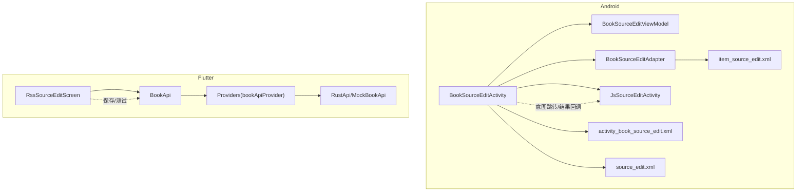
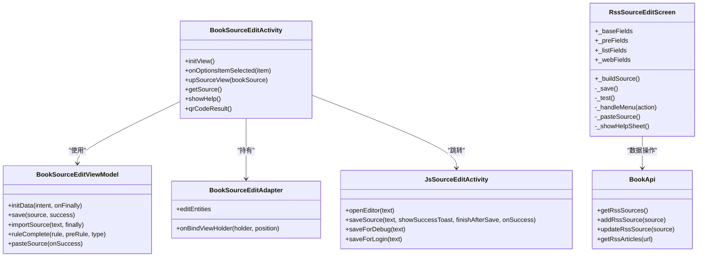
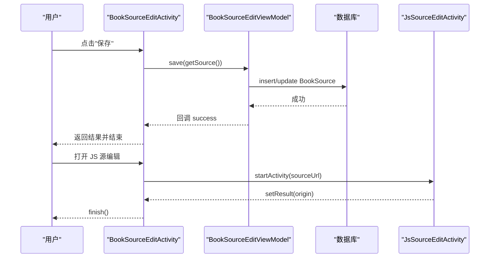
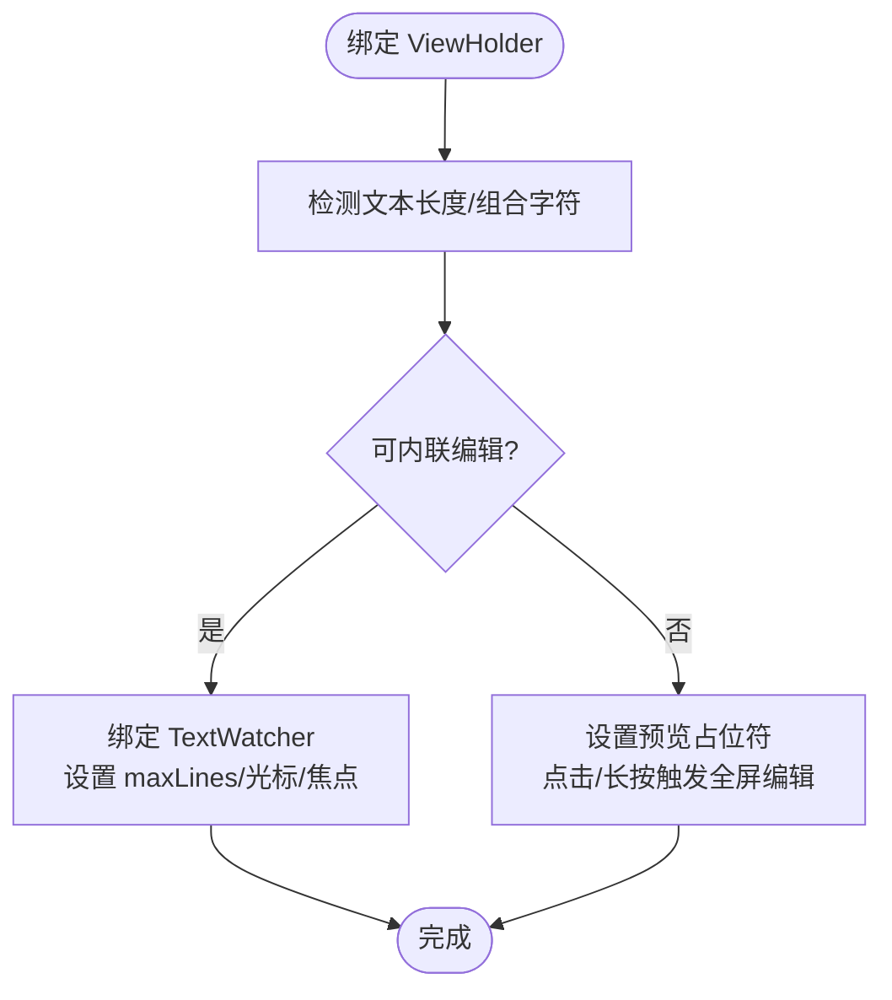
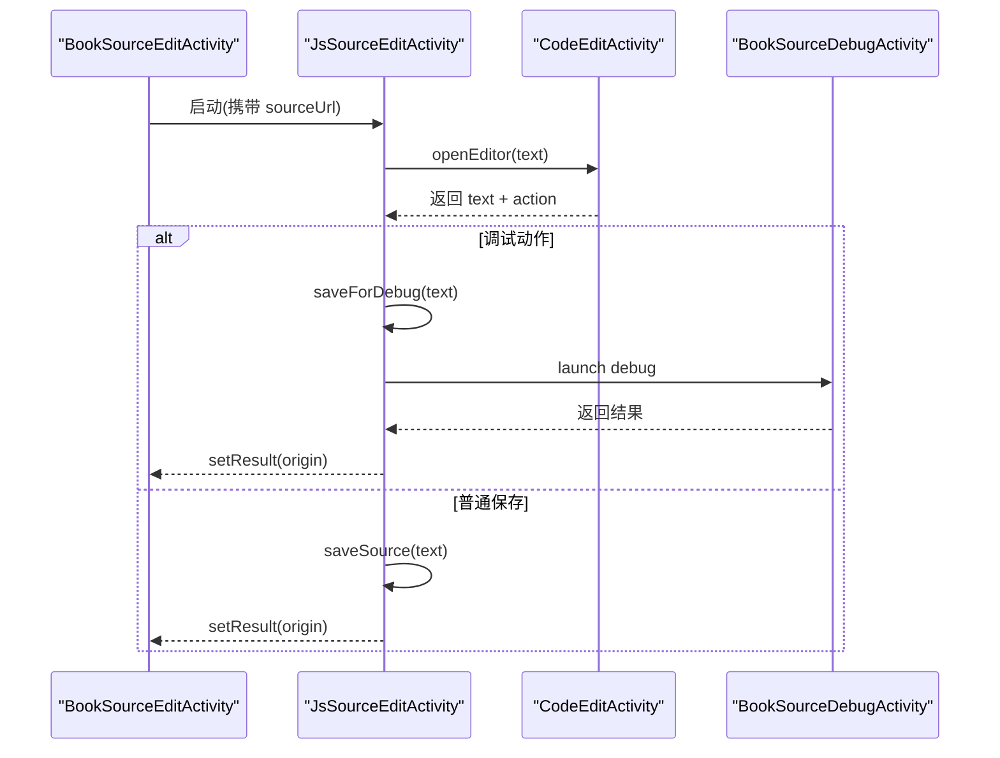
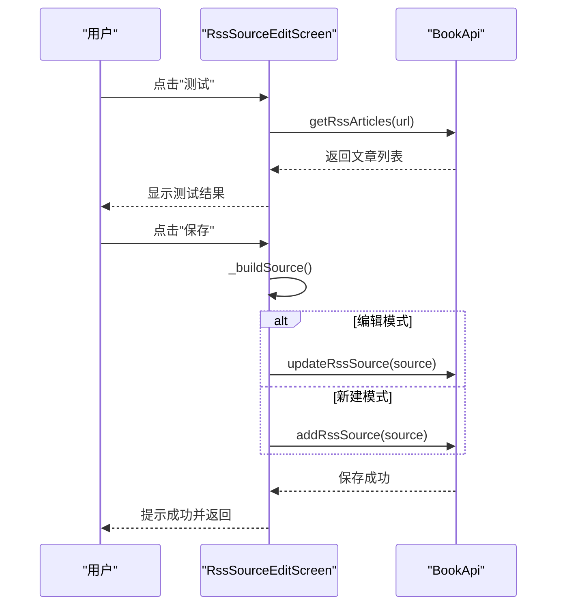
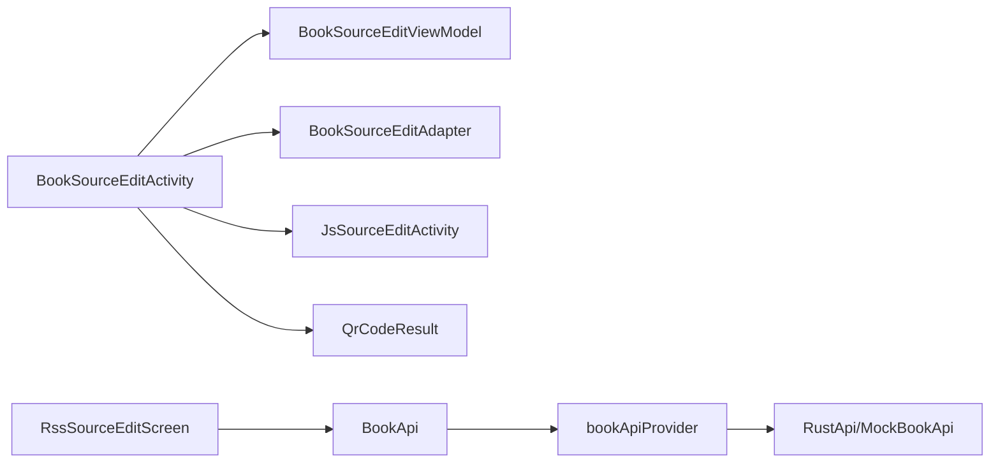

# 源编辑界面重构

<cite>
**本文引用的文件**   
- [BookSourceEditActivity.kt](file://app/src/main/java/io/legado/app/ui/book/source/edit/BookSourceEditActivity.kt)
- [BookSourceEditViewModel.kt](file://app/src/main/java/io/legado/app/ui/book/source/edit/BookSourceEditViewModel.kt)
- [BookSourceEditAdapter.kt](file://app/src/main/java/io/legado/app/ui/book/source/edit/BookSourceEditAdapter.kt)
- [JsSourceEditActivity.kt](file://app/src/main/java/io/legado/app/ui/book/source/edit/JsSourceEditActivity.kt)
- [activity_book_source_edit.xml](file://app/src/main/res/layout/activity_book_source_edit.xml)
- [item_source_edit.xml](file://app/src/main/res/layout/item_source_edit.xml)
- [source_edit.xml](file://app/src/main/res/menu/source_edit.xml)
- [rss_source_edit_screen.dart](file://flutter_legado/lib/src/screens/rss_source_edit_screen.dart)
- [book_api.dart](file://flutter_legado/lib/src/services/book_api.dart)
- [providers.dart](file://flutter_legado/lib/src/providers/providers.dart)
</cite>

## 更新摘要
**变更内容**   
- RSS源编辑界面完全重构：从简单的两标签界面发展为功能完备的四标签架构（基本、预处理、列表规则、WEB_VIEW）
- 新增可折叠设置面板，包含类型下拉选择、多个开关选项等高级配置功能
- 修复RSS源编辑界面的TabBar崩溃问题，通过isScrollable属性解决对齐问题
- 改进批量选择界面的用户体验，增强交互反馈和错误处理机制
- 集成完整的调试功能和实时测试能力

## 目录
1. [简介](#简介)
2. [项目结构](#项目结构)
3. [核心组件](#核心组件)
4. [架构总览](#架构总览)
5. [详细组件分析](#详细组件分析)
6. [依赖关系分析](#依赖关系分析)
7. [性能考量](#性能考量)
8. [故障排查指南](#故障排查指南)
9. [结论](#结论)
10. [附录](#附录)

## 简介
本文件围绕"源编辑界面重构"展开，聚焦 Android 端书源编辑与 Flutter 端RSS源编辑界面的实现、交互流程与数据流。Android 侧采用 Activity + ViewModel + RecyclerView Adapter 的经典分层；Flutter 侧以多 Tab 表单驱动编辑，并通过 FFI 调用 Rust 能力进行规则验证与测试。**本次重大更新重点介绍了RssSourceEditScreen的完全重构，从简单的两标签界面发展为功能完备的四标签RSS源编辑器，并集成了完整的调试功能。**

**更新** 本次重构新增了RssSourceEditScreen的四标签架构、可折叠设置面板、增强的UI交互体验、完整的错误处理机制，以及修复了TabBar崩溃问题，大幅提升了RSS源的编辑和管理体验。

## 项目结构
- Android 模块
  - 编辑入口：BookSourceEditActivity（Tab + RecyclerView 配置化编辑）
  - 逻辑层：BookSourceEditViewModel（保存、导入、自动补全等）
  - 列表渲染：BookSourceEditAdapter（字段行渲染与安全编辑策略）
  - JS 源编辑：JsSourceEditActivity（JS 源码编辑、调试、保存流程）
  - 布局：activity_book_source_edit.xml、item_source_edit.xml
  - 菜单：source_edit.xml（溢出菜单定义）
- Flutter 模块
  - **RSS 源编辑：rss_source_edit_screen.dart（四标签架构、完整功能）**
  - API 接口：book_api.dart（统一的API抽象层）
  - 状态管理：providers.dart（Riverpod Provider注入）

**图示来源** 
- [BookSourceEditActivity.kt:123-157](file://app/src/main/java/io/legado/app/ui/book/source/edit/BookSourceEditActivity.kt#L123-L157)
- [BookSourceEditViewModel.kt:37-50](file://app/src/main/java/io/legado/app/ui/book/source/edit/BookSourceEditViewModel.kt#L37-L50)
- [BookSourceEditAdapter.kt:32-47](file://app/src/main/java/io/legado/app/ui/book/source/edit/BookSourceEditAdapter.kt#L32-47)
- [JsSourceEditActivity.kt:66-89](file://app/src/main/java/io/legado/app/ui/book/source/edit/JsSourceEditActivity.kt#L66-89)
- [activity_book_source_edit.xml:181-195](file://app/src/main/res/layout/activity_book_source_edit.xml#L181-L195)
- [item_source_edit.xml:1-20](file://app/src/main/res/layout/item_source_edit.xml#L1-L20)
- [source_edit.xml:1-86](file://app/src/main/res/menu/source_edit.xml#L1-L86)
- [rss_source_edit_screen.dart:31-40](file://flutter_legado/lib/src/screens/rss_source_edit_screen.dart#L31-L40)
- [book_api.dart:195-222](file://flutter_legado/lib/src/services/book_api.dart#L195-L222)
- [providers.dart:14-17](file://flutter_legado/lib/src/providers/providers.dart#L14-L17)

**章节来源**
- [BookSourceEditActivity.kt:123-157](file://app/src/main/java/io/legado/app/ui/book/source/edit/BookSourceEditActivity.kt#L123-L157)
- [activity_book_source_edit.xml:181-195](file://app/src/main/res/layout/activity_book_source_edit.xml#L181-L195)

## 核心组件
- BookSourceEditActivity
  - 负责 UI 初始化、Tab 切换、菜单操作、全屏编辑器跳转、二维码导入、软键盘工具集成、窗口 Insets 处理、选项面板折叠/展开、数据回填与收集。
  - 溢出菜单系统集成，支持保存、调试、清空Cookie、自动补全、复制/粘贴、扫码导入、分享、登录、搜索等功能。
  - 首次使用帮助系统，在onPostCreate中检查并显示规则帮助。
- BookSourceEditViewModel
  - 负责数据加载、保存、剪贴板导入、URL/JSON 导入、Cookie 清理、规则自动补全。
  - 复制粘贴功能，支持从剪贴板导入JSON格式书源。
- BookSourceEditAdapter
  - 负责每行字段的渲染、安全文本展示（长文本/组合字符）、内联编辑与全屏编辑切换、焦点与光标管理。
- JsSourceEditActivity
  - 负责 JS 源编辑生命周期、编辑器打开/关闭、调试流程、保存与返回结果。
  - 完整的调试和登录流程支持。
- **Flutter RssSourceEditScreen（完全重构）**
  - **四标签架构**：基本（15个字段）、预处理（4个字段）、列表规则（7个规则）、WEB_VIEW（10个配置项）
  - **可折叠选项面板**：启用开关、单URL模式、Cookie管理、预加载设置、源类型选择、文章样式配置
  - **完整的功能菜单**：调试源、复制源、粘贴源、分享文本、帮助文档
  - **实时测试功能**：快速验证源URL可用性，显示前5篇文章标题
  - **智能保存机制**：编辑模式使用updateRssSource，新建模式使用addRssSource
  - **状态管理**：未保存修改检测、退出确认对话框、快照对比机制
  - **错误处理**：表单验证、网络异常捕获、用户友好提示

**章节来源**
- [BookSourceEditActivity.kt:298-357](file://app/src/main/java/io/legado/app/ui/book/source/edit/BookSourceEditActivity.kt#L298-L357)
- [BookSourceEditViewModel.kt:52-85](file://app/src/main/java/io/legado/app/ui/book/source/edit/BookSourceEditViewModel.kt#L52-85)
- [BookSourceEditAdapter.kt:49-141](file://app/src/main/java/io/legado/app/ui/book/source/edit/BookSourceEditAdapter.kt#L49-L141)
- [JsSourceEditActivity.kt:98-162](file://app/src/main/java/io/legado/app/ui/book/source/edit/JsSourceEditActivity.kt#L98-L162)
- [rss_source_edit_screen.dart:31-40](file://flutter_legado/lib/src/screens/rss_source_edit_screen.dart#L31-L40)

## 架构总览
Android 端通过 Activity 组织 UI 与用户交互，ViewModel 承载业务逻辑，RecyclerView Adapter 负责列表渲染；Flutter 端以 StatefulWidget 为核心，结合 Riverpod 状态管理与 FFI 桥接 Rust 能力，形成跨平台一致的编辑体验。**RssSourceEditScreen的重构采用了现代化的四标签架构，提供了比原版更丰富的功能和更好的用户体验。**

**图示来源** 
- [BookSourceEditActivity.kt:298-357](file://app/src/main/java/io/legado/app/ui/book/source/edit/BookSourceEditActivity.kt#L298-L357)
- [BookSourceEditViewModel.kt:37-85](file://app/src/main/java/io/legado/app/ui/book/source/edit/BookSourceEditViewModel.kt#L37-L85)
- [BookSourceEditAdapter.kt:32-47](file://app/src/main/java/io/legado/app/ui/book/source/edit/BookSourceEditAdapter.kt#L32-47)
- [JsSourceEditActivity.kt:98-162](file://app/src/main/java/io/legado/app/ui/book/source/edit/JsSourceEditActivity.kt#L98-L162)
- [rss_source_edit_screen.dart:31-40](file://flutter_legado/lib/src/screens/rss_source_edit_screen.dart#L31-L40)
- [book_api.dart:195-222](file://flutter_legado/lib/src/services/book_api.dart#L195-L222)

## 详细组件分析

### Android 书源编辑（BookSourceEditActivity）
- 功能要点
  - 初始化 Tab 与 RecyclerView，设置透明导航栏与底部 Padding。
  - 选项面板折叠/展开，汇总当前启用项。
  - 根据当前 Tab 切换不同 EditEntity 列表并刷新。
  - 溢出菜单系统集成，支持保存、调试、清空 Cookie、自动补全、复制/粘贴、扫码导入、分享、登录、搜索等完整功能。
  - 首次使用帮助系统，在onPostCreate中检查LocalConfig.ruleHelpVersionIsLast并显示帮助。
  - 全屏编辑器：将当前 EditText 的 key 与光标位置传递到 CodeEditActivity，回传后应用变更。
  - upSourceView：将 BookSource 展平为各 Tab 的 EditEntity 列表，便于统一渲染。
  - getSource：从 UI 收集所有字段，构建 BookSource 对象，包含搜索/发现/详情/目录/内容/评论规则。
  - QR码集成，通过QrCodeResult活动结果处理器支持扫码导入书源。

**图示来源** 
- [BookSourceEditActivity.kt:253-296](file://app/src/main/java/io/legado/app/ui/book/source/edit/BookSourceEditActivity.kt#L253-296)
- [BookSourceEditViewModel.kt:52-85](file://app/src/main/java/io/legado/app/ui/book/source/edit/BookSourceEditViewModel.kt#L52-85)
- [JsSourceEditActivity.kt:98-162](file://app/src/main/java/io/legado/app/ui/book/source/edit/JsSourceEditActivity.kt#L98-L162)

**章节来源**
- [BookSourceEditActivity.kt:298-357](file://app/src/main/java/io/legado/app/ui/book/source/edit/BookSourceEditActivity.kt#L298-L357)
- [BookSourceEditActivity.kt:446-590](file://app/src/main/java/io/legado/app/ui/book/source/edit/BookSourceEditActivity.kt#L446-L590)
- [BookSourceEditActivity.kt:609-800](file://app/src/main/java/io/legado/app/ui/book/source/edit/BookSourceEditActivity.kt#L609-L800)

### Android 适配器（BookSourceEditAdapter）
- 功能要点
  - 根据 EditSafety 判断是否适合内联编辑，否则显示占位提示并引导至全屏编辑器。
  - 绑定 TextWatcher 更新 EditEntity 值，避免重复监听器。
  - 控制最大行数、光标可见性、焦点行为，提升长文本编辑体验。

**图示来源** 
- [BookSourceEditAdapter.kt:49-141](file://app/src/main/java/io/legado/app/ui/book/source/edit/BookSourceEditAdapter.kt#L49-L141)

**章节来源**
- [BookSourceEditAdapter.kt:32-47](file://app/src/main/java/io/legado/app/ui/book/source/edit/BookSourceEditAdapter.kt#L32-47)
- [BookSourceEditAdapter.kt:49-141](file://app/src/main/java/io/legado/app/ui/book/source/edit/BookSourceEditAdapter.kt#L49-L141)

### Android JS 源编辑（JsSourceEditActivity）
- 功能要点
  - 生命周期管理：恢复状态、打开编辑器、保存/调试流程。
  - 完整的调试流程支持，包括saveForDebug和launchDebugWhenResumed方法。
  - 登录流程支持，包括saveForLogin和launchLoginWhenResumed方法。
  - 编辑器结果处理：区分普通保存与调试保存，必要时延迟启动调试。
  - 保存成功后返回 origin URL，供上层 Activity 处理。

**图示来源** 
- [JsSourceEditActivity.kt:66-89](file://app/src/main/java/io/legado/app/ui/book/source/edit/JsSourceEditActivity.kt#L66-89)
- [JsSourceEditActivity.kt:98-162](file://app/src/main/java/io/legado/app/ui/book/source/edit/JsSourceEditActivity.kt#L98-L162)

**章节来源**
- [JsSourceEditActivity.kt:98-162](file://app/src/main/java/io/legado/app/ui/book/source/edit/JsSourceEditActivity.kt#L98-L162)

### **Flutter RSS 源编辑（RssSourceEditScreen - 完全重构）**
- **四标签架构设计**
  - **基本标签**：源名称、源URL、图标、分组、注释、搜索URL、分类URL、登录相关配置、请求头、并发率、JS库等15个核心字段
  - **预处理标签**：初始HTML、初始样式、初始JS、预加载JS等4个页面预处理配置
  - **列表规则标签**：文章列表规则、下一页规则、标题规则、日期规则、描述规则、图片规则、链接规则等7个解析规则
  - **WEB_VIEW标签**：内容规则、样式、注入JS、内容白名单/黑名单、URL拦截等10个WebView配置项

- **可折叠选项面板**
  - 启用开关：控制源是否启用
  - 单URL模式：限制只使用单个URL
  - Cookie管理：启用Cookie持久化
  - 预加载设置：控制资源预加载行为
  - 源类型选择：网页、图片、视频三种类型
  - 文章样式：列表、单列、双列、瀑布、三列五种样式

- **完整的功能菜单**
  - 调试源：跳转到调试页面进行深度调试
  - 复制源：将当前源配置复制到剪贴板
  - 粘贴源：从剪贴板导入JSON格式的源配置
  - 分享文本：分享源配置的JSON文本
  - 帮助文档：显示使用说明和配置指南

- **实时测试功能**
  - 快速验证源URL的可访问性
  - 获取前5篇文章的标题作为测试结果
  - 显示连接状态和错误信息
  - 提供友好的错误提示和解决方案

- **智能保存机制**
  - 编辑模式：使用updateRssSource更新现有源
  - 新建模式：使用addRssSource添加新源
  - 保存状态追踪：记录初始快照，检测未保存修改
  - 退出确认：未保存时弹出确认对话框

- **完善的错误处理**
  - 表单验证：必填字段检查（源名称、源URL）
  - 网络异常：捕获并显示网络请求错误
  - 用户反馈：使用SnackBar提供操作反馈
  - 状态管理：异步操作的加载状态控制

**图示来源** 
- [rss_source_edit_screen.dart:307-335](file://flutter_legado/lib/src/screens/rss_source_edit_screen.dart#L307-335)
- [rss_source_edit_screen.dart:339-365](file://flutter_legado/lib/src/screens/rss_source_edit_screen.dart#L339-365)
- [rss_source_edit_screen.dart:239-280](file://flutter_legado/lib/src/screens/rss_source_edit_screen.dart#L239-280)

**章节来源**
- [rss_source_edit_screen.dart:31-40](file://flutter_legado/lib/src/screens/rss_source_edit_screen.dart#L31-L40)
- [rss_source_edit_screen.dart:45-94](file://flutter_legado/lib/src/screens/rss_source_edit_screen.dart#L45-L94)
- [rss_source_edit_screen.dart:239-280](file://flutter_legado/lib/src/screens/rss_source_edit_screen.dart#L239-280)
- [rss_source_edit_screen.dart:307-335](file://flutter_legado/lib/src/screens/rss_source_edit_screen.dart#L307-335)
- [rss_source_edit_screen.dart:339-365](file://flutter_legado/lib/src/screens/rss_source_edit_screen.dart#L339-365)
- [rss_source_edit_screen.dart:418-453](file://flutter_legado/lib/src/screens/rss_source_edit_screen.dart#L418-L453)

## 依赖关系分析
- Android 侧
  - Activity 依赖 ViewModel 进行数据持久化与导入逻辑。
  - Adapter 依赖 EditEntity 与 EditSafety 进行安全编辑策略。
  - JsSourceEditActivity 依赖 CodeEditActivity 与 BookSourceDebugActivity。
  - 依赖 QrCodeResult 进行QR码扫描处理。
- Flutter 侧
  - **RssSourceEditScreen 依赖 BookApi 进行RSS源操作**。
  - **所有组件通过 providers.dart 中的 bookApiProvider 进行依赖注入**。

**图示来源** 
- [BookSourceEditActivity.kt:298-357](file://app/src/main/java/io/legado/app/ui/book/source/edit/BookSourceEditActivity.kt#L298-L357)
- [BookSourceEditViewModel.kt:37-85](file://app/src/main/java/io/legado/app/ui/book/source/edit/BookSourceEditViewModel.kt#L37-L85)
- [BookSourceEditAdapter.kt:32-47](file://app/src/main/java/io/legado/app/ui/book/source/edit/BookSourceEditAdapter.kt#L32-47)
- [JsSourceEditActivity.kt:98-162](file://app/src/main/java/io/legado/app/ui/book/source/edit/JsSourceEditActivity.kt#L98-L162)
- [rss_source_edit_screen.dart:307-335](file://flutter_legado/lib/src/screens/rss_source_edit_screen.dart#L307-335)
- [providers.dart:14-17](file://flutter_legado/lib/src/providers/providers.dart#L14-L17)

**章节来源**
- [BookSourceEditActivity.kt:298-357](file://app/src/main/java/io/legado/app/ui/book/source/edit/BookSourceEditActivity.kt#L298-L357)
- [rss_source_edit_screen.dart:307-335](file://flutter_legado/lib/src/screens/rss_source_edit_screen.dart#L307-335)
- [providers.dart:14-17](file://flutter_legado/lib/src/providers/providers.dart#L14-L17)

## 性能考量
- Android
  - 长文本与组合字符场景下，Adapter 使用预览占位符减少频繁重绘与输入法抖动。
  - RecyclerView 在短行数时禁用跟随滚动，改用 TextView 自身滚动，降低布局开销。
  - 保存时清理并发限制缓存，避免后续请求被误限流。
  - QR码扫描使用异步处理，避免阻塞主线程。
- Flutter
  - **RssSourceEditScreen优化**：使用ExpansionTile实现可折叠面板，减少初始渲染压力。
  - **状态管理优化**：使用setState局部更新，避免整个页面重建。
  - **TabBar修复**：通过isScrollable属性解决对齐导致的崩溃问题。

## 故障排查指南
- 保存失败
  - Android：检查名称与 URL 非空校验；查看 ViewModel 的错误提示与日志打印。
  - Flutter：检查表单校验与 Provider 保存异常，确认 FFI 调用是否成功。
- JS 源编辑异常
  - Android：检查编辑器返回结果与调试流程状态机；确认保存后 origin 是否正确返回。
- QR码导入失败
  - 检查权限设置和网络连接；确认扫码内容是否为有效的JSON格式。
- **新增** RSS源编辑问题
  - 检查四标签字段完整性；确认源URL格式正确；查看网络请求日志。
  - 调试模式下查看详细错误信息；确认BookApi实例是否正确注入。
- **新增** TabBar崩溃问题
  - 确认TabBar的isScrollable属性已设置为true，解决对齐导致的断言崩溃。

**章节来源**
- [BookSourceEditViewModel.kt:52-85](file://app/src/main/java/io/legado/app/ui/book/source/edit/BookSourceEditViewModel.kt#L52-85)
- [JsSourceEditActivity.kt:134-162](file://app/src/main/java/io/legado/app/ui/book/source/edit/JsSourceEditActivity.kt#L134-L162)
- [rss_source_edit_screen.dart:239-280](file://flutter_legado/lib/src/screens/rss_source_edit_screen.dart#L239-280)

## 结论
重构后的源编辑界面在 Android 与 Flutter 两端实现了统一的编辑体验：Android 通过配置化的 EditEntity 列表与安全的内联/全屏编辑策略，Flutter 通过多 Tab 表单与 FFI 规则验证，提升了易用性与可维护性。**本次重大更新中，RssSourceEditScreen的完全重构从简单的两标签界面发展为功能完备的四标签RSS源编辑器，集成了完整的调试功能、增强的UI交互体验和完善的错误处理机制，同时修复了TabBar崩溃问题，大幅提升了RSS源的编辑和管理体验。**建议在后续迭代中继续优化长文本编辑体验、完善错误提示与单元测试覆盖率。

## 附录
- 布局参考
  - activity_book_source_edit.xml：顶部标题、选项卡片、TabLayout、RecyclerView。
  - item_source_edit.xml：单行字段布局，使用自定义 CodeView。
  - source_edit.xml：溢出菜单定义，包含所有功能菜单项。
- **新增** RSS源数据结构
  - 支持完整的RSS源配置：基本信息、预处理规则、列表规则、WebView配置等。

**章节来源**
- [activity_book_source_edit.xml:1-207](file://app/src/main/res/layout/activity_book_source_edit.xml#L1-L207)
- [item_source_edit.xml:1-20](file://app/src/main/res/layout/item_source_edit.xml#L1-L20)
- [source_edit.xml:1-86](file://app/src/main/res/menu/source_edit.xml#L1-L86)