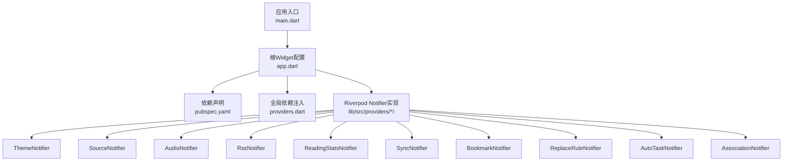
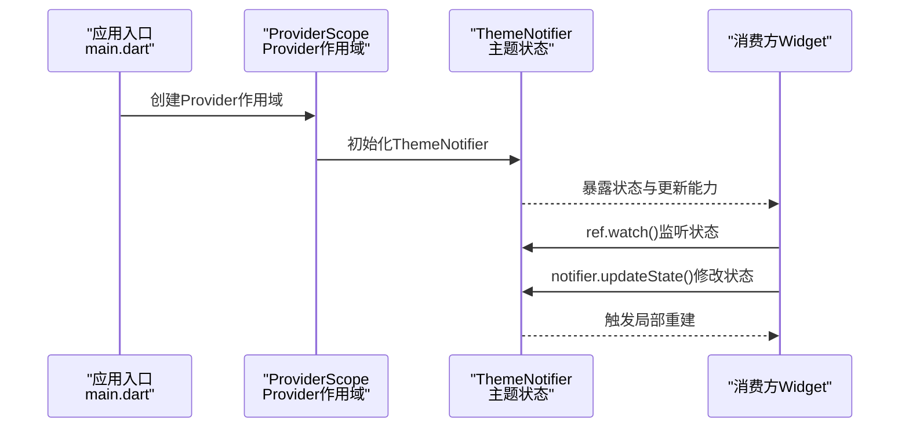
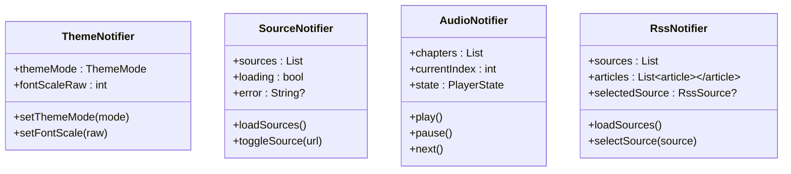
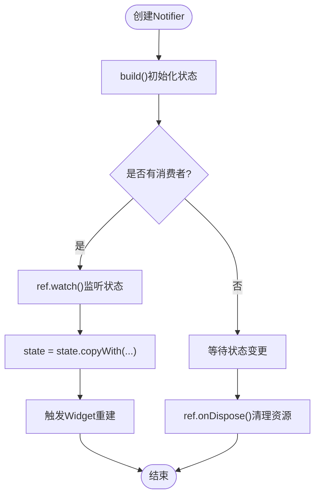
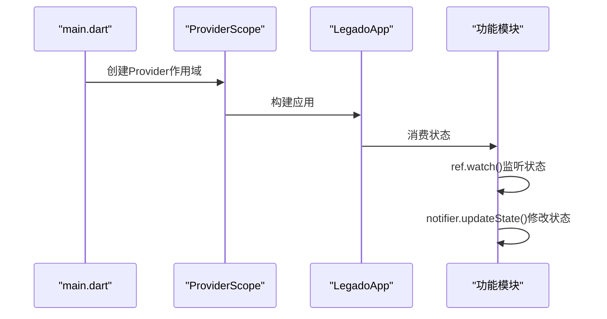
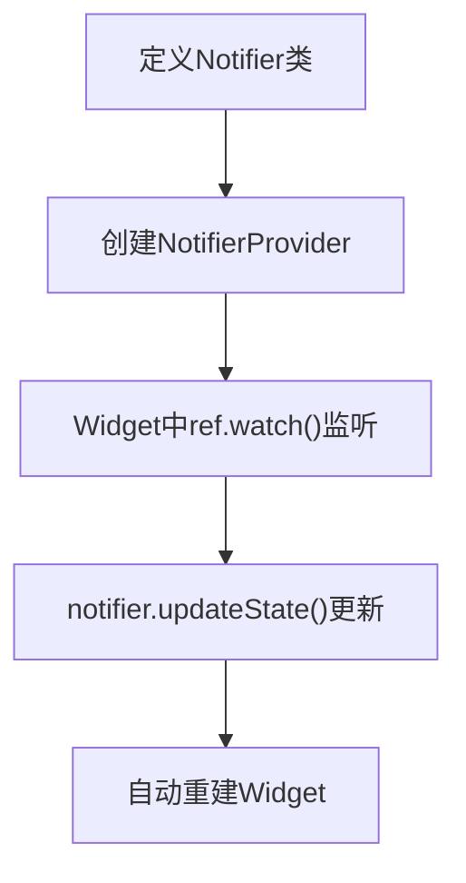
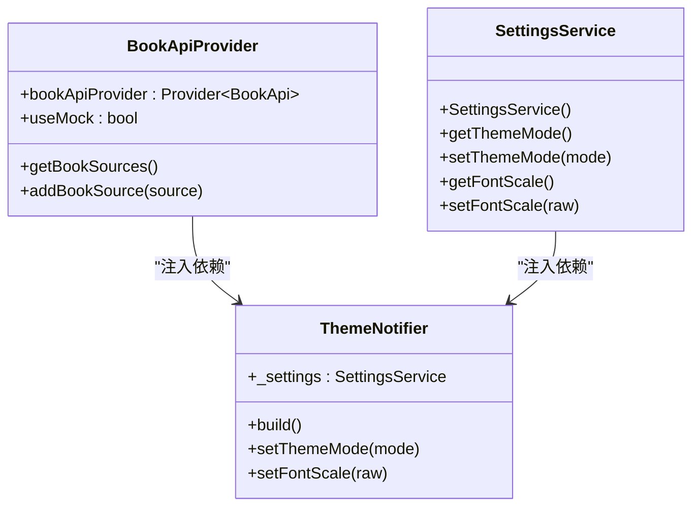
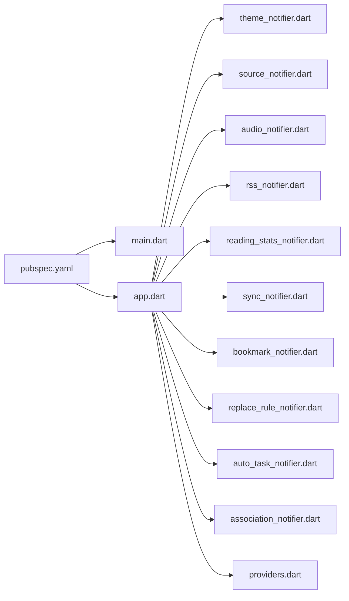

# Provider基础概念

<cite>
**本文档引用的文件**   
- [flutter_legado/lib/main.dart](file://flutter_legado/lib/main.dart)
- [flutter_legado/lib/app.dart](file://flutter_legado/lib/app.dart)
- [flutter_legado/pubspec.yaml](file://flutter_legado/pubspec.yaml)
- [flutter_legado/lib/src/providers/providers.dart](file://flutter_legado/lib/src/providers/providers.dart)
- [flutter_legado/lib/src/providers/theme/theme_notifier.dart](file://flutter_legado/lib/src/providers/theme/theme_notifier.dart)
- [flutter_legado/lib/src/providers/source/source_notifier.dart](file://flutter_legado/lib/src/providers/source/source_notifier.dart)
- [flutter_legado/lib/src/providers/audio/audio_notifier.dart](file://flutter_legado/lib/src/providers/audio/audio_notifier.dart)
- [flutter_legado/lib/src/providers/rss/rss_notifier.dart](file://flutter_legado/lib/src/providers/rss/rss_notifier.dart)
- [flutter_legado/lib/src/providers/reading_stats/reading_stats_notifier.dart](file://flutter_legado/lib/src/providers/reading_stats/reading_stats_notifier.dart)
- [flutter_legado/lib/src/providers/sync/sync_notifier.dart](file://flutter_legado/lib/src/providers/sync/sync_notifier.dart)
- [flutter_legado/lib/src/providers/bookmark/bookmark_notifier.dart](file://flutter_legado/lib/src/providers/bookmark/bookmark_notifier.dart)
- [flutter_legado/lib/src/providers/replace_rule/replace_rule_notifier.dart](file://flutter_legado/lib/src/providers/replace_rule/replace_rule_notifier.dart)
- [flutter_legado/lib/src/providers/auto_task/auto_task_notifier.dart](file://flutter_legado/lib/src/providers/auto_task/auto_task_notifier.dart)
- [flutter_legado/lib/src/providers/association/association_notifier.dart](file://flutter_legado/lib/src/providers/association/association_notifier.dart)
</cite>

## 更新摘要
**所做更改**   
- 完全迁移至Riverpod Notifier架构，移除旧Provider模式支持
- 新增完整的Riverpod Notifier实现说明和最佳实践
- 更新所有核心功能模块的Riverpod实现示例
- 增强依赖注入和状态管理的现代化指导
- 提供从旧Provider到Riverpod的完整迁移指南

## 目录
1. [简介](#简介)
2. [项目结构](#项目结构)
3. [核心组件](#核心组件)
4. [架构总览](#架构总览)
5. [详细组件分析](#详细组件分析)
6. [依赖分析](#依赖分析)
7. [性能考虑](#性能考虑)
8. [故障排查指南](#故障排查指南)
9. [结论](#结论)
10. [附录](#附录) 

## 简介
本文件面向Flutter开发者，系统化讲解Riverpod Notifier状态管理的基础概念与最佳实践。重点围绕Notifier与NotifierProvider展开，涵盖现代状态管理的原理、生命周期管理、监听机制，以及Provider的创建、初始化、销毁流程。**重要更新**：本项目已完全迁移至Riverpod Notifier，所有主要功能模块（主题、书源、音频、RSS、阅读统计、同步、书签、替换规则、定时任务、关联导入）均采用Riverpod模式实现。同时提供在Widget树中集成Riverpod的正确方式、消费状态的常用模式，并提供性能优化建议与常见问题排查方法。

## 项目结构
本项目为多端Flutter工程（Android/iOS/Web/Windows/Linux/macOS），其中Flutter代码位于flutter_legado目录。与Riverpod相关的入口和实现通常出现在应用启动文件与各个功能模块中：
- 应用入口与根Widget配置：main.dart、app.dart
- 依赖声明：pubspec.yaml
- Riverpod Notifier实现：lib/src/providers/*/
- 全局依赖注入：lib/src/providers/providers.dart

**图表来源** 
- [flutter_legado/lib/main.dart](file://flutter_legado/lib/main.dart)
- [flutter_legado/lib/app.dart](file://flutter_legado/lib/app.dart)
- [flutter_legado/pubspec.yaml](file://flutter_legado/pubspec.yaml)
- [flutter_legado/lib/src/providers/providers.dart](file://flutter_legado/lib/src/providers/providers.dart)

章节来源
- [flutter_legado/lib/main.dart](file://flutter_legado/lib/main.dart)
- [flutter_legado/lib/app.dart](file://flutter_legado/lib/app.dart)
- [flutter_legado/pubspec.yaml](file://flutter_legado/pubspec.yaml)

## 核心组件
- **Notifier（Riverpod）**
  - 职责：封装可观察的状态数据，通过state属性管理不可变状态，自动触发UI更新。
  - 生命周期：build()方法用于初始化状态；ref.onDispose()用于资源清理。
  - 线程模型：所有状态更新都在UI线程执行，确保线程安全。
- **NotifierProvider（Riverpod）**
  - 职责：将Notifier实例注入到Widget树中，供后代通过ref读取或监听。
  - 生命周期：随ProviderScope的生命周期创建与销毁；支持lazy初始化与自动释放。
  - 更新机制：当Notifier的state属性改变时，订阅该Provider的Widget会按需重建。
- **Provider（Riverpod）**
  - 职责：用于注入服务、API客户端等单例对象。
  - 优势：类型安全、依赖注入、测试友好。

**章节来源**
- [flutter_legado/lib/src/providers/theme/theme_notifier.dart](file://flutter_legado/lib/src/providers/theme/theme_notifier.dart)
- [flutter_legado/lib/src/providers/source/source_notifier.dart](file://flutter_legado/lib/src/providers/source/source_notifier.dart)
- [flutter_legado/lib/src/providers/providers.dart](file://flutter_legado/lib/src/providers/providers.dart)

## 架构总览
下图展示了Riverpod Notifier在Flutter中的典型数据流：应用启动后，在ProviderScope处注入所有状态管理器；子Widget通过ref.watch()获取并订阅状态；状态变更时，仅重建受影响的Widget分支。

**图表来源** 
- [flutter_legado/lib/main.dart](file://flutter_legado/lib/main.dart)
- [flutter_legado/lib/app.dart](file://flutter_legado/lib/app.dart)
- [flutter_legado/lib/src/providers/theme/theme_notifier.dart](file://flutter_legado/lib/src/providers/theme/theme_notifier.dart)

## 详细组件分析

### Riverpod Notifier 核心实现模式
- **BookshelfNotifier**：书架状态管理，处理书籍列表、搜索、分类等功能
- **ReaderNotifier**：阅读器状态管理，控制阅读进度、设置、页面切换等
- **SearchNotifier**：搜索功能状态管理，处理搜索结果、过滤条件等
- **ExploreNotifier**：探索页面状态管理，管理内容发现相关逻辑

**图表来源** 
- [flutter_legado/lib/src/providers/theme/theme_notifier.dart](file://flutter_legado/lib/src/providers/theme/theme_notifier.dart)
- [flutter_legado/lib/src/providers/source/source_notifier.dart](file://flutter_legado/lib/src/providers/source/source_notifier.dart)
- [flutter_legado/lib/src/providers/audio/audio_notifier.dart](file://flutter_legado/lib/src/providers/audio/audio_notifier.dart)
- [flutter_legado/lib/src/providers/rss/rss_notifier.dart](file://flutter_legado/lib/src/providers/rss/rss_notifier.dart)

章节来源
- [flutter_legado/lib/src/providers/theme/theme_notifier.dart](file://flutter_legado/lib/src/providers/theme/theme_notifier.dart)
- [flutter_legado/lib/src/providers/source/source_notifier.dart](file://flutter_legado/lib/src/providers/source/source_notifier.dart)
- [flutter_legado/lib/src/providers/audio/audio_notifier.dart](file://flutter_legado/lib/src/providers/audio/audio_notifier.dart)
- [flutter_legado/lib/src/providers/rss/rss_notifier.dart](file://flutter_legado/lib/src/providers/rss/rss_notifier.dart)

### Riverpod Notifier 生命周期与状态管理
- **创建与初始化**
  - build()方法返回初始状态，使用const构造函数提高性能。
  - 异步初始化通过Future.microtask()或页面initState触发。
- **状态更新**
  - 通过state = state.copyWith(...)更新不可变状态。
  - 自动触发依赖该状态的Widget重建。
- **资源清理**
  - 使用ref.onDispose()注册清理回调。
  - 取消Stream订阅、释放网络请求等资源。

**图表来源** 
- [flutter_legado/lib/src/providers/theme/theme_notifier.dart](file://flutter_legado/lib/src/providers/theme/theme_notifier.dart)
- [flutter_legado/lib/src/providers/audio/audio_notifier.dart](file://flutter_legado/lib/src/providers/audio/audio_notifier.dart)

章节来源
- [flutter_legado/lib/src/providers/theme/theme_notifier.dart](file://flutter_legado/lib/src/providers/theme/theme_notifier.dart)
- [flutter_legado/lib/src/providers/audio/audio_notifier.dart](file://flutter_legado/lib/src/providers/audio/audio_notifier.dart)

### 在应用中正确集成Riverpod的步骤
- **声明依赖**
  - 在pubspec.yaml中添加flutter_riverpod和riverpod_annotation依赖。
- **应用入口**
  - main.dart中使用ProviderScope包裹整个应用。
- **根Widget配置**
  - app.dart中通过ConsumerStatefulWidget访问状态。
- **子树消费**
  - 在需要的Widget中通过ref.watch()读取状态，或通过ref.read()调用方法。

**图表来源** 
- [flutter_legado/lib/main.dart](file://flutter_legado/lib/main.dart)
- [flutter_legado/lib/app.dart](file://flutter_legado/lib/app.dart)
- [flutter_legado/pubspec.yaml](file://flutter_legado/pubspec.yaml)

章节来源
- [flutter_legado/lib/main.dart](file://flutter_legado/lib/main.dart)
- [flutter_legado/lib/app.dart](file://flutter_legado/lib/app.dart)
- [flutter_legado/pubspec.yaml](file://flutter_legado/pubspec.yaml)

### 基础示例：创建与消费简单的Notifier
- **创建Notifier**
  - 继承Notifier<T>，定义状态类型T。
  - 实现build()方法返回初始状态。
  - 添加状态更新方法。
- **定义Provider**
  - 使用NotifierProvider<Notifier, State>创建全局Provider。
- **消费状态**
  - 在Widget中使用ref.watch(provider)监听状态。
  - 通过ref.read(provider.notifier).updateState()修改状态。

**图表来源** 
- [flutter_legado/lib/src/providers/theme/theme_notifier.dart](file://flutter_legado/lib/src/providers/theme/theme_notifier.dart)
- [flutter_legado/lib/src/providers/source/source_notifier.dart](file://flutter_legado/lib/src/providers/source/source_notifier.dart)

章节来源
- [flutter_legado/lib/src/providers/theme/theme_notifier.dart](file://flutter_legado/lib/src/providers/theme/theme_notifier.dart)
- [flutter_legado/lib/src/providers/source/source_notifier.dart](file://flutter_legado/lib/src/providers/source/source_notifier.dart)

### 高级特性：依赖注入与服务管理
- **全局依赖注入**
  - 使用Provider<BookApi>()注入API客户端。
  - 支持Mock和真实实现的切换。
- **服务生命周期管理**
  - 使用ref.onDispose()管理资源清理。
  - 支持Stream订阅的自动取消。
- **条件依赖**
  - 根据环境变量选择不同的实现。
  - 支持测试时的依赖覆盖。

**图表来源** 
- [flutter_legado/lib/src/providers/providers.dart](file://flutter_legado/lib/src/providers/providers.dart)
- [flutter_legado/lib/src/providers/theme/theme_notifier.dart](file://flutter_legado/lib/src/providers/theme/theme_notifier.dart)

章节来源
- [flutter_legado/lib/src/providers/providers.dart](file://flutter_legado/lib/src/providers/providers.dart)
- [flutter_legado/lib/src/providers/theme/theme_notifier.dart](file://flutter_legado/lib/src/providers/theme/theme_notifier.dart)

## 依赖分析
- **依赖声明**
  - pubspec.yaml中声明flutter_riverpod和riverpod_annotation版本。
- **模块耦合**
  - 业务模块通过Provider解耦状态与UI，降低耦合度。
  - 支持Mock实现进行独立开发。
- **测试依赖**
  - 单元测试通过overrideWithValue注入Mock依赖。

**图表来源** 
- [flutter_legado/pubspec.yaml](file://flutter_legado/pubspec.yaml)
- [flutter_legado/lib/main.dart](file://flutter_legado/lib/main.dart)
- [flutter_legado/lib/app.dart](file://flutter_legado/lib/app.dart)
- [flutter_legado/lib/src/providers/providers.dart](file://flutter_legado/lib/src/providers/providers.dart)

章节来源
- [flutter_legado/pubspec.yaml](file://flutter_legado/pubspec.yaml)
- [flutter_legado/lib/main.dart](file://flutter_legado/lib/main.dart)
- [flutter_legado/lib/app.dart](file://flutter_legado/lib/app.dart)
- [flutter_legado/lib/src/providers/providers.dart](file://flutter_legado/lib/src/providers/providers.dart)

## 性能考虑
- **最小化重建范围**
  - 使用更细粒度的Notifier，避免全局状态频繁更新导致大面积重建。
  - 合理使用ref.watch()精确监听所需状态。
- **懒加载与按需注入**
  - 对非首屏所需的状态使用延迟创建，减少初始渲染开销。
- **避免在build中进行昂贵计算**
  - 将计算结果缓存，仅在必要时更新状态。
- **合理使用watch与read**
  - 通过ref.watch()精确指定需要重建的子树。
  - 通过ref.read()进行一次性读取，不建立订阅关系。
- **内存管理**
  - 使用ref.onDispose()及时释放资源。
  - 避免循环引用导致的内存泄漏。
- **监控与调试**
  - 使用Flutter DevTools的性能面板观察重建次数与耗时。
  - 利用Riverpod的调试工具查看状态变化。

## 故障排查指南
- **常见错误**
  - 在非UI线程调用状态更新方法导致异常。
  - 在dispose之后仍尝试更新状态。
  - 未正确注入Provider导致ref无法读取。
- **排查步骤**
  - 检查Provider注入位置是否在消费Widget的祖先节点。
  - 确认状态更新是否发生在正确的线程。
  - 查看日志与DevTools，定位频繁重建的原因。
- **Riverpod特定问题**
  - 检查Notifier是否正确继承Notifier<T>。
  - 确认ref的使用是否符合Riverpod规范。
  - 验证状态更新是否触发了预期的重建。
- **测试辅助**
  - 使用单元测试模拟Provider上下文，验证状态变化与UI响应是否符合预期。

## 结论
Riverpod通过Notifier与NotifierProvider实现了现代化的高效状态管理与UI同步。项目已完全迁移至Riverpod Notifier，提供了更强大的类型安全、更好的性能和更清晰的API设计。合理划分状态、精准注入与消费、关注生命周期与线程安全，是构建高性能Flutter应用的关键。结合单元测试与性能工具，可以持续提升应用的稳定性与用户体验。对于新项目，推荐使用Riverpod Notifier作为首选状态管理方案。

## 附录
- **参考路径**
  - 应用入口：main.dart
  - 根Widget配置：app.dart
  - 依赖声明：pubspec.yaml
  - Riverpod实现：lib/src/providers/*/
  - 全局依赖注入：lib/src/providers/providers.dart