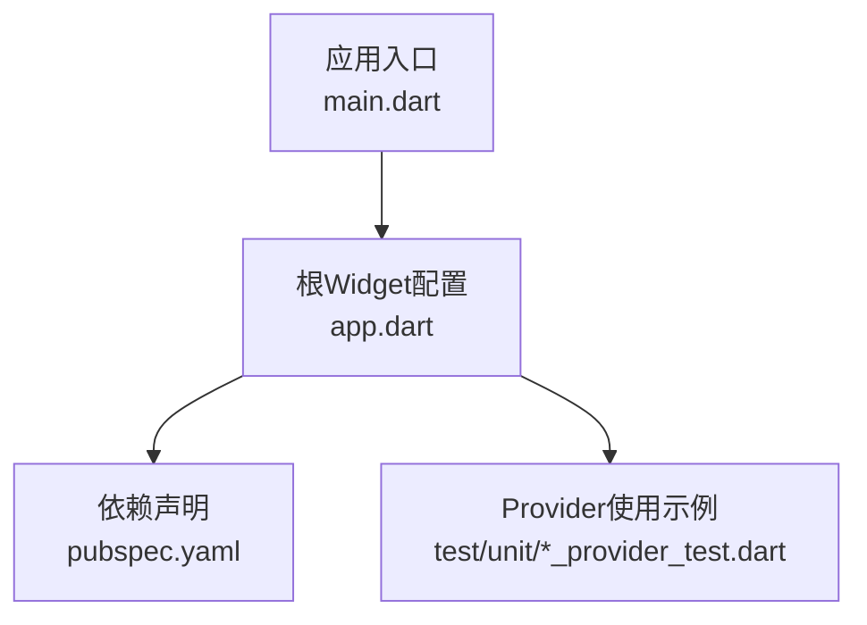
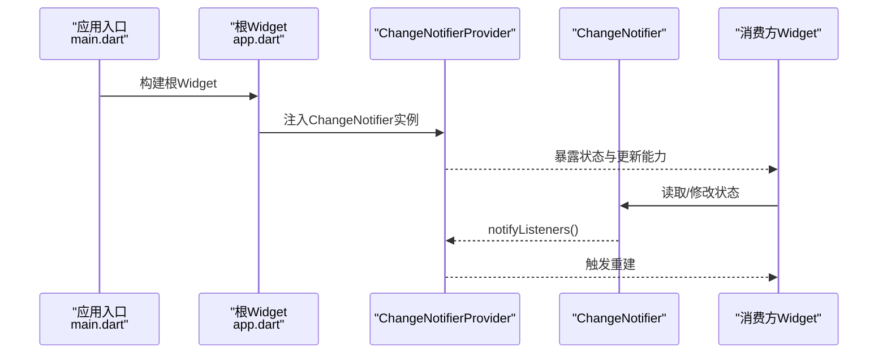
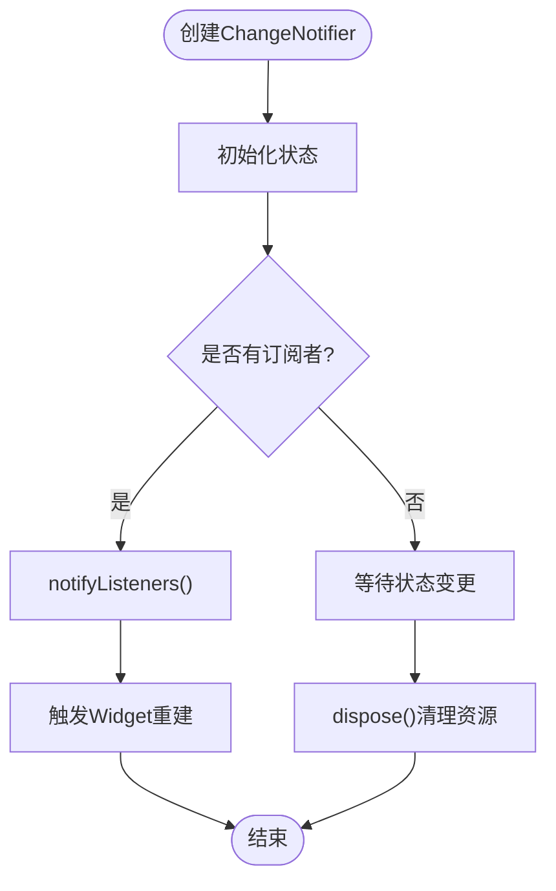
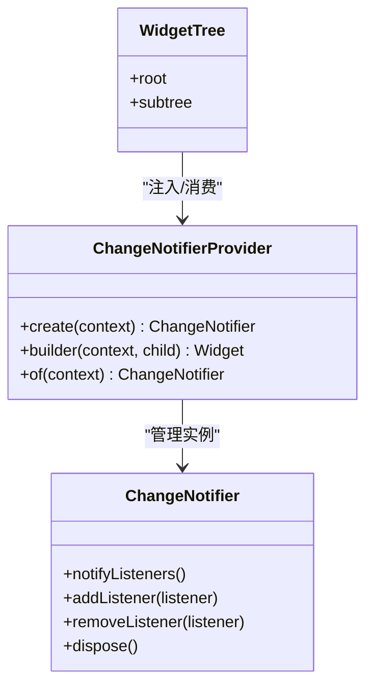
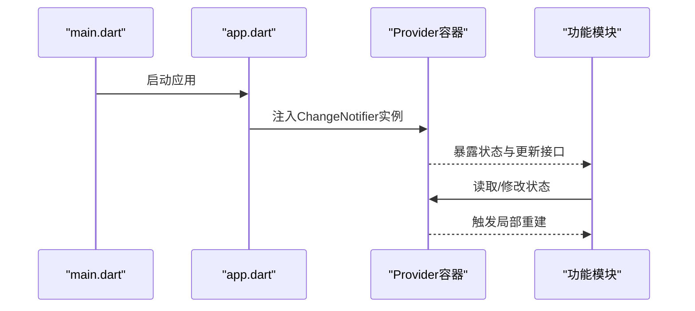
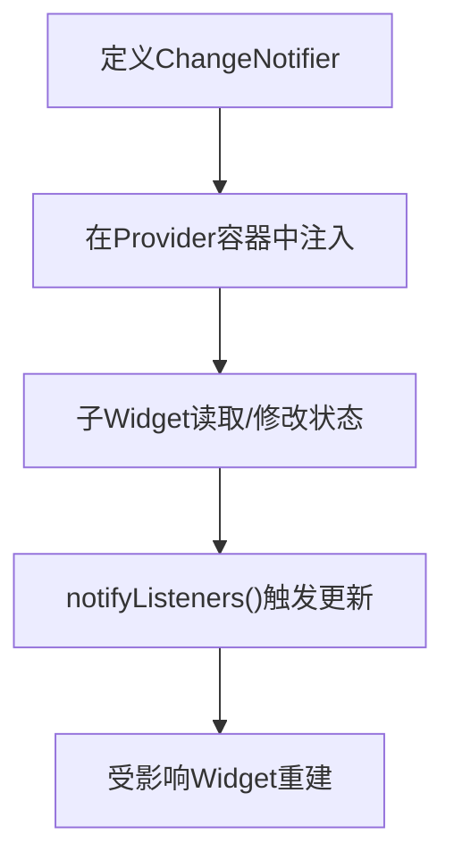
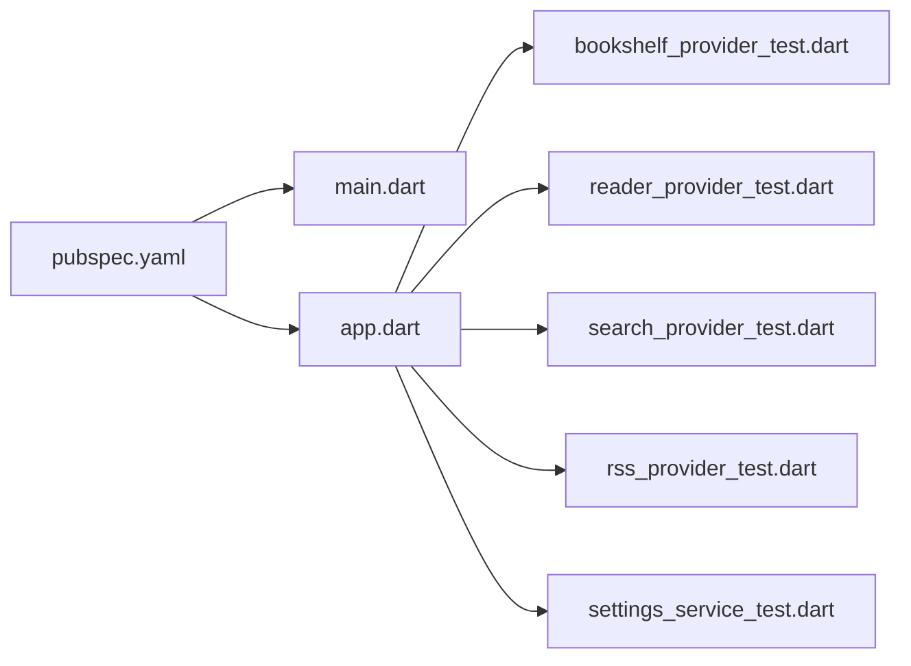

# Provider基础概念

<cite>
**本文档引用的文件**   
- [flutter_legado/lib/main.dart](file://flutter_legado/lib/main.dart)
- [flutter_legado/lib/app.dart](file://flutter_legado/lib/app.dart)
- [flutter_legado/pubspec.yaml](file://flutter_legado/pubspec.yaml)
- [flutter_legado/test/unit/bookshelf_provider_test.dart](file://flutter_legado/test/unit/bookshelf_provider_test.dart)
- [flutter_legado/test/unit/reader_provider_test.dart](file://flutter_legado/test/unit/reader_provider_test.dart)
- [flutter_legado/test/unit/search_provider_test.dart](file://flutter_legado/test/unit/search_provider_test.dart)
- [flutter_legado/test/unit/rss_provider_test.dart](file://flutter_legado/test/unit/rss_provider_test.dart)
- [flutter_legado/test/unit/settings_service_test.dart](file://flutter_legado/test/unit/settings_service_test.dart)
</cite>

## 目录
1. [简介](#简介)
2. [项目结构](#项目结构)
3. [核心组件](#核心组件)
4. [架构总览](#架构总览)
5. [详细组件分析](#详细组件分析)
6. [依赖分析](#依赖分析)
7. [性能考虑](#性能考虑)
8. [故障排查指南](#故障排查指南)
9. [结论](#结论)
10. [附录](#附录) 

## 简介
本文件面向Flutter开发者，系统化讲解Provider状态管理的基础概念与最佳实践。重点围绕ChangeNotifier与ChangeNotifierProvider展开，涵盖状态管理的原理、生命周期管理、监听机制，以及Provider的创建、初始化、销毁流程。同时给出在Widget树中集成Provider的正确方式、消费状态的常用模式，并提供性能优化建议与常见问题排查方法。

## 项目结构
本项目为多端Flutter工程（Android/iOS/Web/Windows/Linux/macOS），其中Flutter代码位于flutter_legado目录。与Provider相关的入口和示例通常出现在应用启动文件与测试用例中：
- 应用入口与根Widget配置：main.dart、app.dart
- 依赖声明：pubspec.yaml
- 单元测试：test/unit/*_provider_test.dart、settings_service_test.dart

图表来源 
- [flutter_legado/lib/main.dart](file://flutter_legado/lib/main.dart)
- [flutter_legado/lib/app.dart](file://flutter_legado/lib/app.dart)
- [flutter_legado/pubspec.yaml](file://flutter_legado/pubspec.yaml)
- [flutter_legado/test/unit/bookshelf_provider_test.dart](file://flutter_legado/test/unit/bookshelf_provider_test.dart)

章节来源
- [flutter_legado/lib/main.dart](file://flutter_legado/lib/main.dart)
- [flutter_legado/lib/app.dart](file://flutter_legado/lib/app.dart)
- [flutter_legado/pubspec.yaml](file://flutter_legado/pubspec.yaml)

## 核心组件
- ChangeNotifier
  - 职责：封装可观察的状态数据，提供notifyListeners()触发更新。
  - 生命周期：构造时注册监听者；dispose时清理监听关系与资源。
  - 线程模型：建议在UI线程调用notifyListeners()，避免跨线程直接通知导致异常。
- ChangeNotifierProvider
  - 职责：将ChangeNotifier实例注入到Widget树中，供后代通过context读取或监听。
  - 生命周期：随所在InheritedWidget的生命周期创建与销毁；支持lazy初始化与自动释放。
  - 更新机制：当底层ChangeNotifier调用notifyListeners()时，订阅该Provider的Widget会按需重建。

章节来源
- [flutter_legado/test/unit/bookshelf_provider_test.dart](file://flutter_legado/test/unit/bookshelf_provider_test.dart)
- [flutter_legado/test/unit/reader_provider_test.dart](file://flutter_legado/test/unit/reader_provider_test.dart)
- [flutter_legado/test/unit/search_provider_test.dart](file://flutter_legado/test/unit/search_provider_test.dart)
- [flutter_legado/test/unit/rss_provider_test.dart](file://flutter_legado/test/unit/rss_provider_test.dart)
- [flutter_legado/test/unit/settings_service_test.dart](file://flutter_legado/test/unit/settings_service_test.dart)

## 架构总览
下图展示了Provider在Flutter中的典型数据流：应用启动后，在根Widget处注入ChangeNotifier实例；子Widget通过Provider.of或consumer API获取并订阅状态；状态变更时，仅重建受影响的Widget分支。

图表来源 
- [flutter_legado/lib/main.dart](file://flutter_legado/lib/main.dart)
- [flutter_legado/lib/app.dart](file://flutter_legado/lib/app.dart)
- [flutter_legado/test/unit/bookshelf_provider_test.dart](file://flutter_legado/test/unit/bookshelf_provider_test.dart)

## 详细组件分析

### ChangeNotifier 生命周期与监听机制
- 创建与初始化
  - 构造时完成状态初始化，必要时注册外部监听器（如事件总线）。
  - 若涉及异步任务，应在合适的时机发起，并在完成后调用notifyListeners()。
- 监听与更新
  - 通过notifyListeners()通知所有订阅者；内部维护监听者集合，避免重复通知。
  - 推荐按粒度拆分多个ChangeNotifier，减少不必要的重建范围。
- 销毁与资源清理
  - 重写dispose()释放资源，移除监听器，取消未完成的异步操作。
  - 确保不在dispose之后继续调用notifyListeners()。

图表来源 
- [flutter_legado/test/unit/bookshelf_provider_test.dart](file://flutter_legado/test/unit/bookshelf_provider_test.dart)
- [flutter_legado/test/unit/reader_provider_test.dart](file://flutter_legado/test/unit/reader_provider_test.dart)

章节来源
- [flutter_legado/test/unit/bookshelf_provider_test.dart](file://flutter_legado/test/unit/bookshelf_provider_test.dart)
- [flutter_legado/test/unit/reader_provider_test.dart](file://flutter_legado/test/unit/reader_provider_test.dart)

### ChangeNotifierProvider 在Widget树中的集成
- 放置位置
  - 通常在根Widget或功能模块入口处包裹，使目标子树共享同一实例。
- 初始化策略
  - 支持立即创建或延迟创建；延迟创建可减少首屏开销。
- 生命周期绑定
  - 与InheritedWidget同生命周期；当Provider节点从树中移除时，其管理的ChangeNotifier将被释放。
- 消费方式
  - 通过context读取状态；或使用builder/consumer等API进行细粒度重建控制。

图表来源 
- [flutter_legado/lib/app.dart](file://flutter_legado/lib/app.dart)
- [flutter_legado/test/unit/bookshelf_provider_test.dart](file://flutter_legado/test/unit/bookshelf_provider_test.dart)

章节来源
- [flutter_legado/lib/app.dart](file://flutter_legado/lib/app.dart)
- [flutter_legado/test/unit/bookshelf_provider_test.dart](file://flutter_legado/test/unit/bookshelf_provider_test.dart)

### 在应用中正确集成Provider的步骤
- 声明依赖
  - 在pubspec.yaml中添加provider相关依赖。
- 应用入口
  - main.dart中运行应用，确保后续能访问MaterialApp或自定义根Widget。
- 根Widget配置
  - app.dart中通过Provider容器（如MultiProvider）注入多个ChangeNotifier实例。
- 子树消费
  - 在需要的Widget中通过context读取状态，或在用户交互时修改状态并触发更新。

图表来源 
- [flutter_legado/lib/main.dart](file://flutter_legado/lib/main.dart)
- [flutter_legado/lib/app.dart](file://flutter_legado/lib/app.dart)
- [flutter_legado/pubspec.yaml](file://flutter_legado/pubspec.yaml)

章节来源
- [flutter_legado/lib/main.dart](file://flutter_legado/lib/main.dart)
- [flutter_legado/lib/app.dart](file://flutter_legado/lib/app.dart)
- [flutter_legado/pubspec.yaml](file://flutter_legado/pubspec.yaml)

### 基础示例：创建与消费简单的Provider
- 创建ChangeNotifier
  - 定义状态字段与方法，修改状态后调用notifyListeners()。
- 注入Provider
  - 在根或模块级通过Provider容器注入实例。
- 消费状态
  - 在子Widget中通过context读取状态，或在交互中修改状态。

图表来源 
- [flutter_legado/test/unit/bookshelf_provider_test.dart](file://flutter_legado/test/unit/bookshelf_provider_test.dart)
- [flutter_legado/test/unit/reader_provider_test.dart](file://flutter_legado/test/unit/reader_provider_test.dart)
- [flutter_legado/test/unit/search_provider_test.dart](file://flutter_legado/test/unit/search_provider_test.dart)
- [flutter_legado/test/unit/rss_provider_test.dart](file://flutter_legado/test/unit/rss_provider_test.dart)
- [flutter_legado/test/unit/settings_service_test.dart](file://flutter_legado/test/unit/settings_service_test.dart)

章节来源
- [flutter_legado/test/unit/bookshelf_provider_test.dart](file://flutter_legado/test/unit/bookshelf_provider_test.dart)
- [flutter_legado/test/unit/reader_provider_test.dart](file://flutter_legado/test/unit/reader_provider_test.dart)
- [flutter_legado/test/unit/search_provider_test.dart](file://flutter_legado/test/unit/search_provider_test.dart)
- [flutter_legado/test/unit/rss_provider_test.dart](file://flutter_legado/test/unit/rss_provider_test.dart)
- [flutter_legado/test/unit/settings_service_test.dart](file://flutter_legado/test/unit/settings_service_test.dart)

## 依赖分析
- 依赖声明
  - pubspec.yaml中声明provider及相关插件版本，确保一致性。
- 模块耦合
  - 业务模块通过Provider解耦状态与UI，降低耦合度。
- 测试依赖
  - 单元测试通过模拟Provider上下文，验证状态变化与UI响应。

图表来源 
- [flutter_legado/pubspec.yaml](file://flutter_legado/pubspec.yaml)
- [flutter_legado/lib/main.dart](file://flutter_legado/lib/main.dart)
- [flutter_legado/lib/app.dart](file://flutter_legado/lib/app.dart)
- [flutter_legado/test/unit/bookshelf_provider_test.dart](file://flutter_legado/test/unit/bookshelf_provider_test.dart)
- [flutter_legado/test/unit/reader_provider_test.dart](file://flutter_legado/test/unit/reader_provider_test.dart)
- [flutter_legado/test/unit/search_provider_test.dart](file://flutter_legado/test/unit/search_provider_test.dart)
- [flutter_legado/test/unit/rss_provider_test.dart](file://flutter_legado/test/unit/rss_provider_test.dart)
- [flutter_legado/test/unit/settings_service_test.dart](file://flutter_legado/test/unit/settings_service_test.dart)

章节来源
- [flutter_legado/pubspec.yaml](file://flutter_legado/pubspec.yaml)
- [flutter_legado/lib/main.dart](file://flutter_legado/lib/main.dart)
- [flutter_legado/lib/app.dart](file://flutter_legado/lib/app.dart)
- [flutter_legado/test/unit/bookshelf_provider_test.dart](file://flutter_legado/test/unit/bookshelf_provider_test.dart)
- [flutter_legado/test/unit/reader_provider_test.dart](file://flutter_legado/test/unit/reader_provider_test.dart)
- [flutter_legado/test/unit/search_provider_test.dart](file://flutter_legado/test/unit/search_provider_test.dart)
- [flutter_legado/test/unit/rss_provider_test.dart](file://flutter_legado/test/unit/rss_provider_test.dart)
- [flutter_legado/test/unit/settings_service_test.dart](file://flutter_legado/test/unit/settings_service_test.dart)

## 性能考虑
- 最小化重建范围
  - 使用更细粒度的ChangeNotifier，避免全局状态频繁更新导致大面积重建。
- 懒加载与按需注入
  - 对非首屏所需的状态使用延迟创建，减少初始渲染开销。
- 避免在notifyListeners中进行昂贵计算
  - 将计算结果缓存，仅在必要时更新状态。
- 合理使用builder与selector
  - 通过builder精确指定需要重建的子树，避免整棵树重建。
- 监控与调试
  - 使用Flutter DevTools的性能面板观察重建次数与耗时，定位热点。

[本节为通用指导，不直接分析具体文件]

## 故障排查指南
- 常见错误
  - 在非UI线程调用notifyListeners()导致异常。
  - 在dispose之后仍尝试更新状态。
  - 未正确注入Provider导致context无法读取。
- 排查步骤
  - 检查Provider注入位置是否在消费Widget的祖先节点。
  - 确认状态更新是否发生在正确的线程。
  - 查看日志与DevTools，定位频繁重建的原因。
- 测试辅助
  - 使用单元测试模拟Provider上下文，验证状态变化与UI响应是否符合预期。

章节来源
- [flutter_legado/test/unit/bookshelf_provider_test.dart](file://flutter_legado/test/unit/bookshelf_provider_test.dart)
- [flutter_legado/test/unit/reader_provider_test.dart](file://flutter_legado/test/unit/reader_provider_test.dart)
- [flutter_legado/test/unit/search_provider_test.dart](file://flutter_legado/test/unit/search_provider_test.dart)
- [flutter_legado/test/unit/rss_provider_test.dart](file://flutter_legado/test/unit/rss_provider_test.dart)
- [flutter_legado/test/unit/settings_service_test.dart](file://flutter_legado/test/unit/settings_service_test.dart)

## 结论
Provider通过ChangeNotifier与ChangeNotifierProvider实现了简洁高效的状态管理与UI同步。合理划分状态、精准注入与消费、关注生命周期与线程安全，是构建高性能Flutter应用的关键。结合单元测试与性能工具，可以持续提升应用的稳定性与用户体验。

[本节为总结性内容，不直接分析具体文件]

## 附录
- 参考路径
  - 应用入口：main.dart
  - 根Widget配置：app.dart
  - 依赖声明：pubspec.yaml
  - 单元测试示例：test/unit/*_provider_test.dart、settings_service_test.dart

[本节为参考信息，不直接分析具体文件]