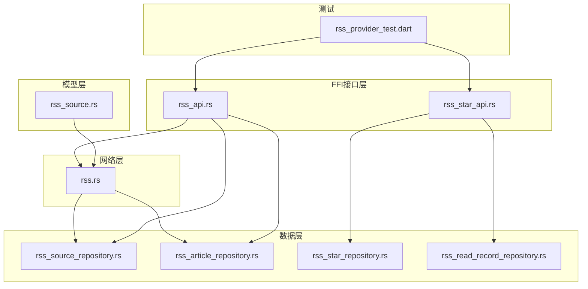
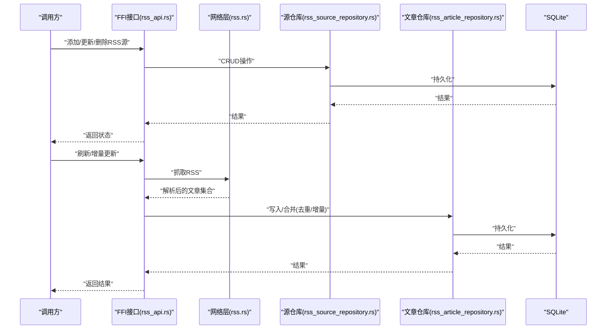
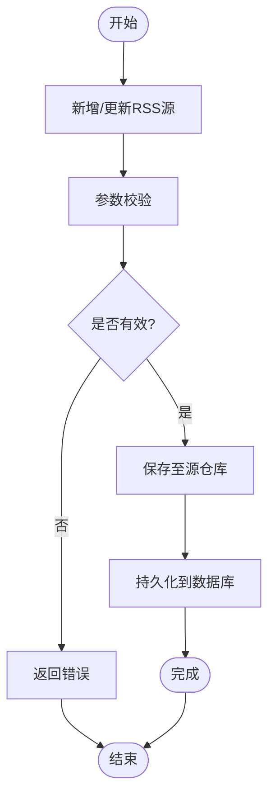
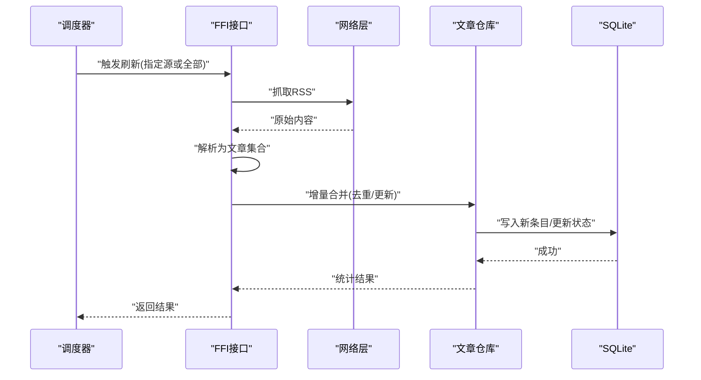
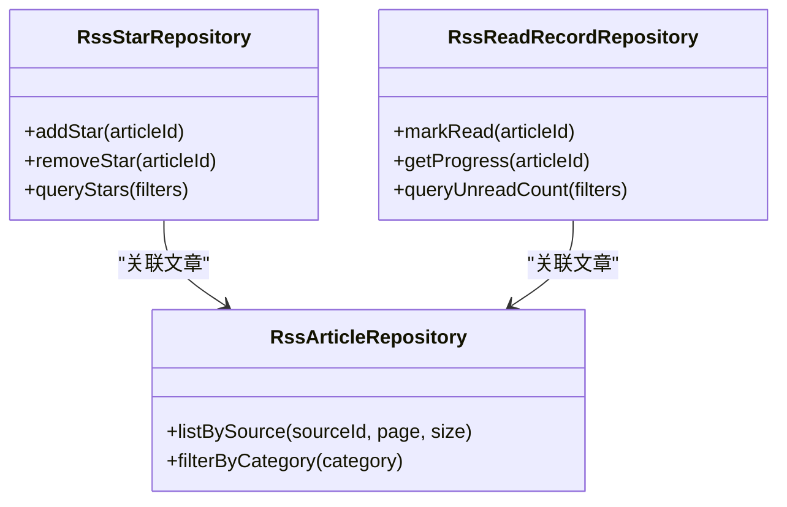
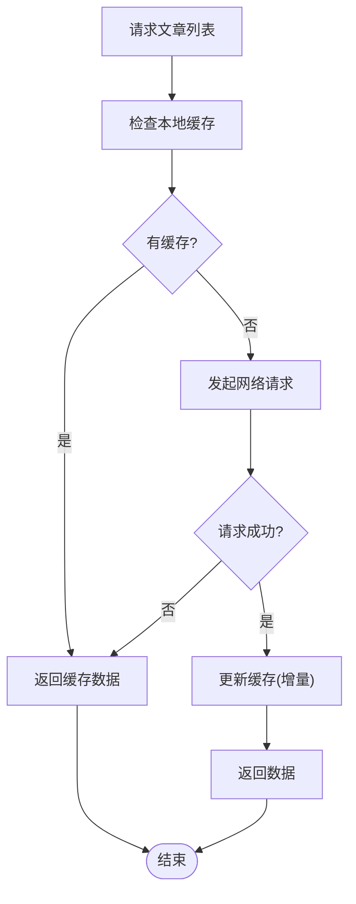
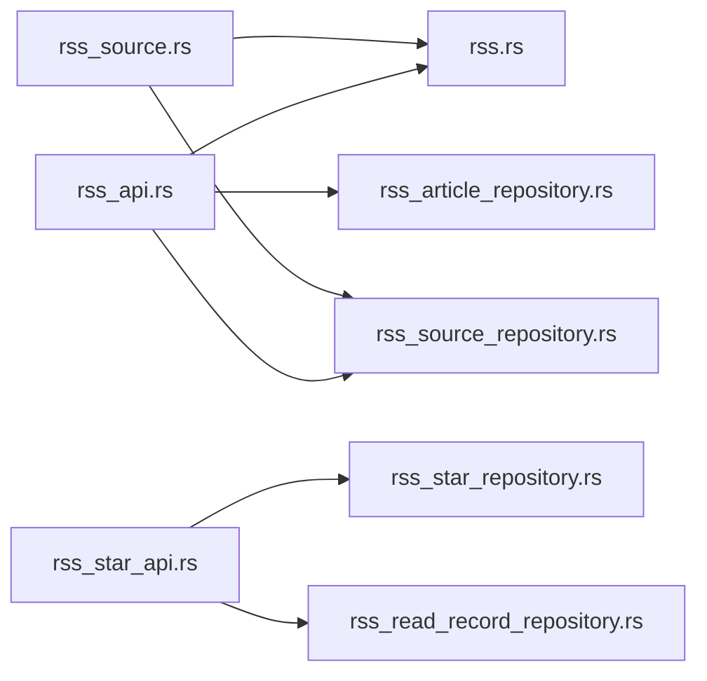
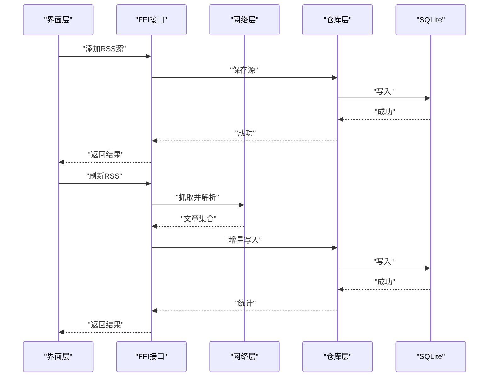

# RSS Provider

<cite>
**本文引用的文件**   
- [rss.rs](file://rust/legado-net/src/rss.rs)
- [rss_source_repository.rs](file://rust/legado-db/src/repository/rss_source_repository.rs)
- [rss_article_repository.rs](file://rust/legado-db/src/repository/rss_article_repository.rs)
- [rss_star_repository.rs](file://rust/legado-db/src/repository/rss_star_repository.rs)
- [rss_read_record_repository.rs](file://rust/legado-db/src/repository/rss_read_record_repository.rs)
- [rss_api.rs](file://rust/legado-ffi/src/api/rss.rs)
- [rss_star_api.rs](file://rust/legado-ffi/src/api/rss_star_api.rs)
- [rss_source.rs](file://rust/legado-core/src/models/rss_source.rs)
- [rss_provider_test.dart](file://flutter_legado/test/unit/rss_provider_test.dart)
</cite>

## 目录
1. [简介](#简介)
2. [项目结构](#项目结构)
3. [核心组件](#核心组件)
4. [架构总览](#架构总览)
5. [详细组件分析](#详细组件分析)
6. [依赖关系分析](#依赖关系分析)
7. [性能与缓存策略](#性能与缓存策略)
8. [故障排查指南](#故障排查指南)
9. [结论](#结论)
10. [附录：API使用示例](#附录api使用示例)

## 简介
本文件面向Legado中的RSS订阅源管理（RssProvider）能力，系统性说明以下方面：
- 订阅源的增删改查、分类与过滤
- RSS内容的抓取与解析流程，包括定时更新与增量更新策略
- 文章收藏与标记的实现方式
- 缓存策略与离线支持
- API调用示例与异常处理方案

## 项目结构
RSS相关功能横跨网络层、数据库层、FFI接口层以及Flutter测试用例。关键模块如下：
- 网络层：负责HTTP请求、重试、速率限制、RSS内容获取与基础解析
- 数据层：SQLite持久化，包含RSS源、文章、收藏、阅读记录等仓库
- FFI接口层：对外暴露统一的API（供上层或跨语言调用）
- Flutter测试：对RSS Provider行为进行单元测试

**图表来源** 
- [rss.rs](file://rust/legado-net/src/rss.rs)
- [rss_source_repository.rs](file://rust/legado-db/src/repository/rss_source_repository.rs)
- [rss_article_repository.rs](file://rust/legado-db/src/repository/rss_article_repository.rs)
- [rss_star_repository.rs](file://rust/legado-db/src/repository/rss_star_repository.rs)
- [rss_read_record_repository.rs](file://rust/legado-db/src/repository/rss_read_record_repository.rs)
- [rss_api.rs](file://rust/legado-ffi/src/api/rss.rs)
- [rss_star_api.rs](file://rust/legado-ffi/src/api/rss_star_api.rs)
- [rss_source.rs](file://rust/legado-core/src/models/rss_source.rs)
- [rss_provider_test.dart](file://flutter_legado/test/unit/rss_provider_test.dart)

**章节来源**
- [rss.rs](file://rust/legado-net/src/rss.rs)
- [rss_source_repository.rs](file://rust/legado-db/src/repository/rss_source_repository.rs)
- [rss_article_repository.rs](file://rust/legado-db/src/repository/rss_article_repository.rs)
- [rss_star_repository.rs](file://rust/legado-db/src/repository/rss_star_repository.rs)
- [rss_read_record_repository.rs](file://rust/legado-db/src/repository/rss_read_record_repository.rs)
- [rss_api.rs](file://rust/legado-ffi/src/api/rss.rs)
- [rss_star_api.rs](file://rust/legado-ffi/src/api/rss_star_api.rs)
- [rss_source.rs](file://rust/legado-core/src/models/rss_source.rs)
- [rss_provider_test.dart](file://flutter_legado/test/unit/rss_provider_test.dart)

## 核心组件
- 网络抓取与解析（rss.rs）
  - 负责发起HTTP请求、处理响应、提取RSS条目并转换为内部数据结构
  - 可结合重试、超时、代理、UA设置等通用网络能力
- 数据仓库（rss_*_repository.rs）
  - rss_source_repository：RSS源的CRUD、分组/标签、启用状态
  - rss_article_repository：文章列表、分页、去重、按源/分类筛选
  - rss_star_repository：收藏/星标操作
  - rss_read_record_repository：阅读进度、已读标记
- FFI接口（rss_api.rs, rss_star_api.rs）
  - 统一对外暴露的API方法，封装业务逻辑与错误码
- 模型（rss_source.rs）
  - RSS源实体定义，字段包括名称、URL、分类、规则等

**章节来源**
- [rss.rs](file://rust/legado-net/src/rss.rs)
- [rss_source_repository.rs](file://rust/legado-db/src/repository/rss_source_repository.rs)
- [rss_article_repository.rs](file://rust/legado-db/src/repository/rss_article_repository.rs)
- [rss_star_repository.rs](file://rust/legado-db/src/repository/rss_star_repository.rs)
- [rss_read_record_repository.rs](file://rust/legado-db/src/repository/rss_read_record_repository.rs)
- [rss_api.rs](file://rust/legado-ffi/src/api/rss.rs)
- [rss_star_api.rs](file://rust/legado-ffi/src/api/rss_star_api.rs)
- [rss_source.rs](file://rust/legado-core/src/models/rss_source.rs)

## 架构总览
整体采用分层架构：上层通过FFI接口调用，中间层协调网络与数据仓库，底层由SQLite提供持久化。

**图表来源** 
- [rss_api.rs](file://rust/legado-ffi/src/api/rss.rs)
- [rss.rs](file://rust/legado-net/src/rss.rs)
- [rss_source_repository.rs](file://rust/legado-db/src/repository/rss_source_repository.rs)
- [rss_article_repository.rs](file://rust/legado-db/src/repository/rss_article_repository.rs)

## 详细组件分析

### RSS源管理（增删改查、分类与过滤）
- 新增/更新/删除RSS源
  - 通过FFI接口提交源信息（名称、URL、分类、规则等），由源仓库完成校验与持久化
  - 支持批量导入/导出（常见于配置迁移）
- 分类与过滤
  - 源仓库支持按分类/标签查询、排序与分页
  - 可按启用状态筛选，便于快速定位活跃源

**图表来源** 
- [rss_api.rs](file://rust/legado-ffi/src/api/rss.rs)
- [rss_source_repository.rs](file://rust/legado-db/src/repository/rss_source_repository.rs)

**章节来源**
- [rss_api.rs](file://rust/legado-ffi/src/api/rss.rs)
- [rss_source_repository.rs](file://rust/legado-db/src/repository/rss_source_repository.rs)

### RSS内容抓取与解析（定时更新与增量更新）
- 抓取流程
  - 根据RSS源URL发起HTTP请求，获取XML/JSON内容
  - 解析为文章列表（标题、链接、摘要、发布时间等）
- 增量更新策略
  - 基于时间戳或唯一标识进行去重，仅写入新增或变更的文章
  - 避免重复入库，减少存储与渲染压力
- 定时更新
  - 可由上层调度器触发刷新任务，按源粒度执行增量更新

**图表来源** 
- [rss.rs](file://rust/legado-net/src/rss.rs)
- [rss_article_repository.rs](file://rust/legado-db/src/repository/rss_article_repository.rs)
- [rss_api.rs](file://rust/legado-ffi/src/api/rss.rs)

**章节来源**
- [rss.rs](file://rust/legado-net/src/rss.rs)
- [rss_article_repository.rs](file://rust/legado-db/src/repository/rss_article_repository.rs)
- [rss_api.rs](file://rust/legado-ffi/src/api/rss.rs)

### 文章收藏与标记（收藏/星标、阅读记录）
- 收藏/星标
  - 通过rss_star_repository实现文章的收藏/取消收藏
  - 支持按源、分类、关键词过滤收藏列表
- 阅读记录
  - 通过rss_read_record_repository维护阅读进度、已读标记
  - 用于“未读计数”、“继续阅读”等功能

**图表来源** 
- [rss_star_repository.rs](file://rust/legado-db/src/repository/rss_star_repository.rs)
- [rss_read_record_repository.rs](file://rust/legado-db/src/repository/rss_read_record_repository.rs)
- [rss_article_repository.rs](file://rust/legado-db/src/repository/rss_article_repository.rs)

**章节来源**
- [rss_star_repository.rs](file://rust/legado-db/src/repository/rss_star_repository.rs)
- [rss_read_record_repository.rs](file://rust/legado-db/src/repository/rss_read_record_repository.rs)
- [rss_article_repository.rs](file://rust/legado-db/src/repository/rss_article_repository.rs)

### 缓存策略与离线支持
- 本地缓存
  - 文章列表与详情优先从SQLite读取，保证离线可用
  - 增量更新时仅拉取差异数据，降低网络开销
- 失效与回退
  - 网络失败时回退到本地缓存；若缓存为空则返回空列表或提示
- 缓存清理
  - 支持按源或时间范围清理缓存，释放存储空间

**图表来源** 
- [rss_article_repository.rs](file://rust/legado-db/src/repository/rss_article_repository.rs)
- [rss.rs](file://rust/legado-net/src/rss.rs)

**章节来源**
- [rss_article_repository.rs](file://rust/legado-db/src/repository/rss_article_repository.rs)
- [rss.rs](file://rust/legado-net/src/rss.rs)

## 依赖关系分析
- FFI接口依赖网络层与数据仓库
- 数据仓库之间通过文章ID建立关联（收藏、阅读记录与文章实体）
- 模型层提供RSS源的结构定义，被网络层与仓库层共同使用

**图表来源** 
- [rss_api.rs](file://rust/legado-ffi/src/api/rss.rs)
- [rss.rs](file://rust/legado-net/src/rss.rs)
- [rss_source_repository.rs](file://rust/legado-db/src/repository/rss_source_repository.rs)
- [rss_article_repository.rs](file://rust/legado-db/src/repository/rss_article_repository.rs)
- [rss_star_repository.rs](file://rust/legado-db/src/repository/rss_star_repository.rs)
- [rss_read_record_repository.rs](file://rust/legado-db/src/repository/rss_read_record_repository.rs)
- [rss_source.rs](file://rust/legado-core/src/models/rss_source.rs)

**章节来源**
- [rss_api.rs](file://rust/legado-ffi/src/api/rss.rs)
- [rss.rs](file://rust/legado-net/src/rss.rs)
- [rss_source_repository.rs](file://rust/legado-db/src/repository/rss_source_repository.rs)
- [rss_article_repository.rs](file://rust/legado-db/src/repository/rss_article_repository.rs)
- [rss_star_repository.rs](file://rust/legado-db/src/repository/rss_star_repository.rs)
- [rss_read_record_repository.rs](file://rust/legado-db/src/repository/rss_read_record_repository.rs)
- [rss_source.rs](file://rust/legado-core/src/models/rss_source.rs)

## 性能与缓存策略
- 增量更新
  - 通过时间戳或唯一键去重，避免重复写入
  - 分批写入，降低单次事务压力
- 并发控制
  - 多源刷新时限制并发度，避免资源争用
- 缓存命中
  - 列表页优先读库，详情页按需拉取
- 内存占用
  - 分页加载，避免一次性加载大量数据

[本节为通用指导，不直接分析具体文件]

## 故障排查指南
- 常见问题
  - 网络超时/连接失败：检查代理、UA、SSL配置与目标站点可达性
  - 解析失败：确认RSS格式是否符合规范，必要时调整解析规则
  - 重复文章：检查去重键（如链接或时间戳）是否正确
  - 收藏/阅读记录不同步：确认文章ID一致性与事务完整性
- 调试建议
  - 开启日志输出，观察请求与解析过程
  - 使用测试用例验证关键路径（参考Flutter测试）

**章节来源**
- [rss_provider_test.dart](file://flutter_legado/test/unit/rss_provider_test.dart)

## 结论
RSS Provider在Legado中实现了完整的订阅源管理与内容消费链路：从网络抓取、解析、增量更新到本地持久化与离线访问，并通过FFI接口提供稳定调用。配合收藏与阅读记录能力，形成闭环的用户体验。建议在集成时关注增量去重、并发控制与缓存策略，以获得更优的性能与稳定性。

[本节为总结，不直接分析具体文件]

## 附录：API使用示例
以下为典型调用场景与步骤（以概念性描述为主，实际参数与返回值请参考对应接口定义）：
- 添加RSS源
  - 调用FFI接口传入源信息（名称、URL、分类等）
  - 成功后可通过列表接口验证新增
- 更新RSS源
  - 修改名称、URL或分类后提交更新
- 删除RSS源
  - 指定源ID执行删除，注意级联清理（可选）
- 刷新RSS内容
  - 触发增量更新，返回新增/更新数量
- 收藏/取消收藏
  - 指定文章ID执行收藏或取消收藏
- 标记已读/查询未读数
  - 标记已读后，未读计数相应变化

**图表来源** 
- [rss_api.rs](file://rust/legado-ffi/src/api/rss.rs)
- [rss.rs](file://rust/legado-net/src/rss.rs)
- [rss_source_repository.rs](file://rust/legado-db/src/repository/rss_source_repository.rs)
- [rss_article_repository.rs](file://rust/legado-db/src/repository/rss_article_repository.rs)

**章节来源**
- [rss_api.rs](file://rust/legado-ffi/src/api/rss.rs)
- [rss.rs](file://rust/legado-net/src/rss.rs)
- [rss_source_repository.rs](file://rust/legado-db/src/repository/rss_source_repository.rs)
- [rss_article_repository.rs](file://rust/legado-db/src/repository/rss_article_repository.rs)