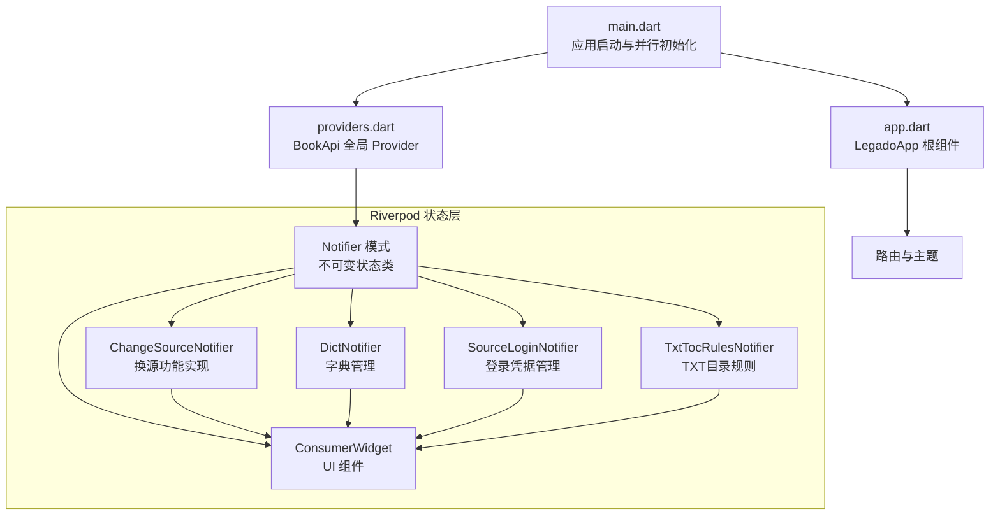
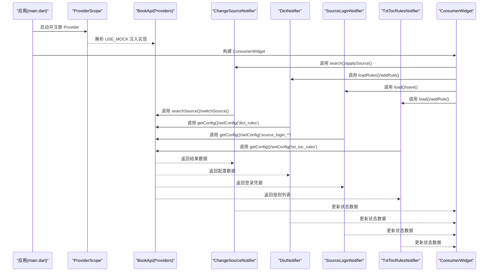
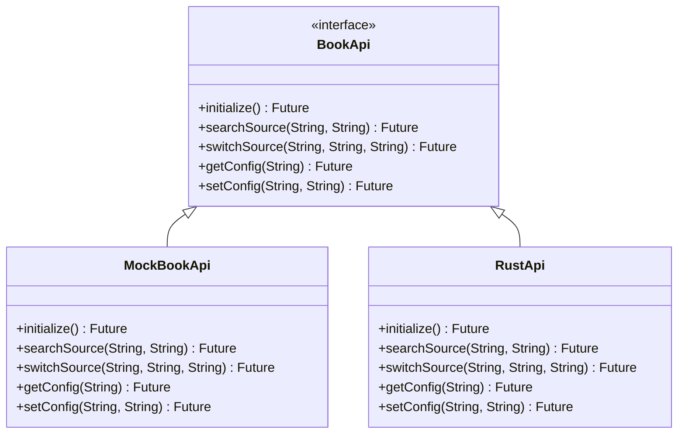
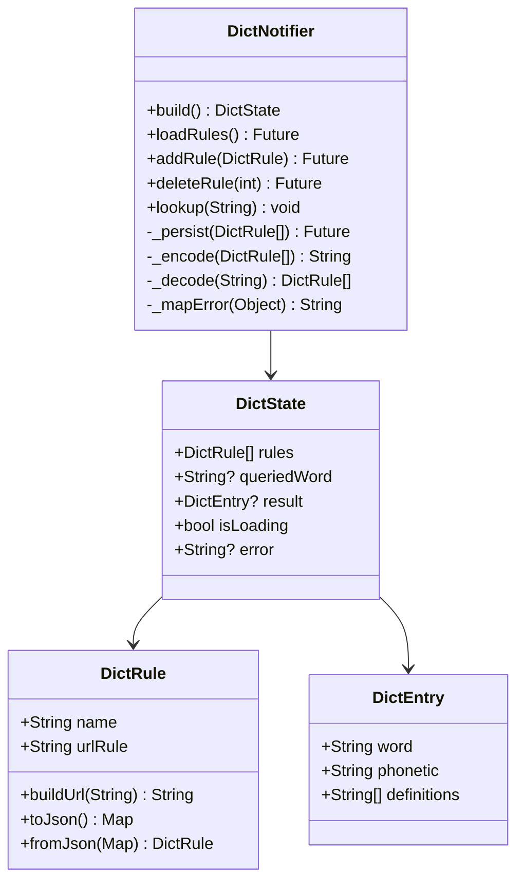
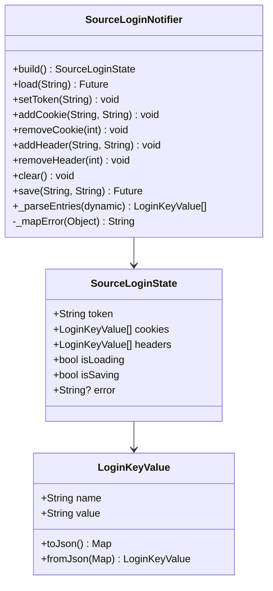
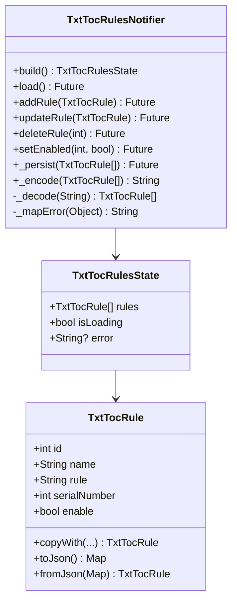
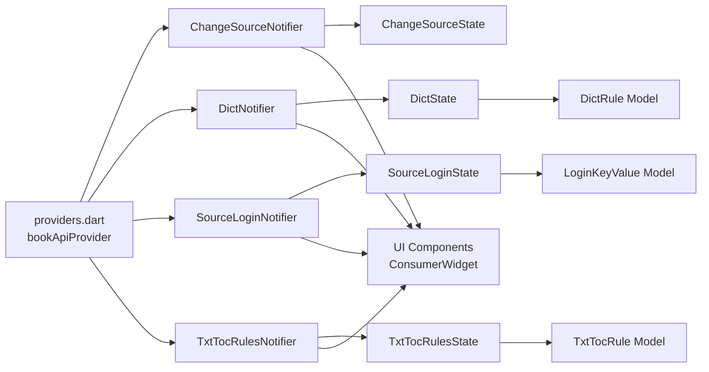

# Riverpod状态管理迁移

<cite>
**本文引用的文件**   
- [pubspec.yaml](file://flutter_legado/pubspec.yaml)
- [main.dart](file://flutter_legado/lib/main.dart)
- [app.dart](file://flutter_legado/lib/app.dart)
- [providers.dart](file://flutter_legado/lib/src/providers/providers.dart)
- [change_source_notifier.dart](file://flutter_legado/lib/src/providers/change_source/change_source_notifier.dart)
- [change_source_state.dart](file://flutter_legado/lib/src/providers/change_source/change_source_state.dart)
- [source_match.dart](file://flutter_legado/lib/src/models/source_match.dart)
- [change_source_screen.dart](file://flutter_legado/lib/src/screens/change_source_screen.dart)
- [change_source_test.dart](file://flutter_legado/test/unit/change_source_test.dart)
- [dict_notifier.dart](file://flutter_legado/lib/src/providers/dict/dict_notifier.dart)
- [dict_state.dart](file://flutter_legado/lib/src/providers/dict/dict_state.dart)
- [source_login_notifier.dart](file://flutter_legado/lib/src/providers/source_login/source_login_notifier.dart)
- [source_login_state.dart](file://flutter_legado/lib/src/providers/source_login/source_login_state.dart)
- [txt_toc_rules_notifier.dart](file://flutter_legado/lib/src/providers/txt_toc_rules/txt_toc_rules_notifier.dart)
- [txt_toc_rules_state.dart](file://flutter_legado/lib/src/providers/txt_toc_rules/txt_toc_rules_state.dart)
- [dict_test.dart](file://flutter_legado/test/unit/dict_test.dart)
- [source_login_test.dart](file://flutter_legado/test/unit/source_login_test.dart)
- [txt_toc_rules_test.dart](file://flutter_legado/test/unit/txt_toc_rules_test.dart)
</cite>

## 更新摘要
**变更内容**   
- 新增三个核心Riverpod Notifier：DictNotifier（字典管理）、SourceLoginNotifier（书源登录凭据）、TxtTocRulesNotifier（TXT目录规则）
- 完成从SharedPreferences到Rust配置库的迁移，所有配置数据通过BookApi.getConfig/setConfig持久化
- 采用统一的Notifer + freezed不可变状态模式，职责严格分离
- 新增完整的测试覆盖，验证配置持久化、错误处理和状态管理逻辑
- 扩展Riverpod架构支持更多业务模块的状态管理

## 目录
1. [简介](#简介)
2. [项目结构](#项目结构)
3. [核心组件](#核心组件)
4. [架构总览](#架构总览)
5. [详细组件分析](#详细组件分析)
6. [依赖关系分析](#依赖关系分析)
7. [性能考量](#性能考量)
8. [故障排查指南](#故障排查指南)
9. [结论](#结论)
10. [附录](#附录)

## 简介
本文件围绕 Flutter 端从 Provider（ChangeNotifier）向 Riverpod（Notifier + freezed immutable state）的状态管理迁移，系统性梳理 Legado 项目的现状、迁移策略与落地细节。重点包括：
- 启动期初始化与 ProviderScope 全局作用域配置
- Notifier 与 immutable State 的职责边界与数据流
- 关键业务模块的迁移模式，特别是 DictNotifier、SourceLoginNotifier、TxtTocRulesNotifier 的完整实现
- 依赖注入（BookApi 选择 Mock/Rust）与错误处理
- 从 SharedPreferences 到 Rust 配置库的迁移策略
- 性能优化与可测试性提升建议

## 项目结构
Flutter 应用入口在 main.dart，通过 ProviderScope 包裹应用根组件，实现完整的 Riverpod 状态管理；App 根 Widget 负责路由与主题等全局配置。Riverpod 相关代码集中在 lib/src/providers 下，通过 providers.dart 暴露 BookApi 的全局注入点。新增的三个核心 Notifier 模块展示了标准的 Riverpod 状态管理模式，每个模块都包含独立的 Notifier、State 和测试文件。

**图表来源** 
- [main.dart:26-111](file://flutter_legado/lib/main.dart#L26-L111)
- [app.dart:8-54](file://flutter_legado/lib/app.dart#L8-L54)
- [providers.dart:7-17](file://flutter_legado/lib/src/providers/providers.dart#L7-L17)
- [dict_notifier.dart:20-95](file://flutter_legado/lib/src/providers/dict/dict_notifier.dart#L20-L95)
- [source_login_notifier.dart:20-95](file://flutter_legado/lib/src/providers/source_login/source_login_notifier.dart#L20-L95)
- [txt_toc_rules_notifier.dart:20-95](file://flutter_legado/lib/src/providers/txt_toc_rules/txt_toc_rules_notifier.dart#L20-L95)

**章节来源**
- [main.dart:26-111](file://flutter_legado/lib/main.dart#L26-L111)
- [app.dart:8-54](file://flutter_legado/lib/app.dart#L8-L54)
- [pubspec.yaml:1-51](file://flutter_legado/pubspec.yaml#L1-L51)

## 核心组件
- BookApi 全局注入（providers.dart）
  - 根据环境变量 USE_MOCK 决定注入 RustApi 或 MockBookApi，供所有 Notifier 使用 ref.read(bookApiProvider) 获取。
- ChangeSourceNotifier 完整实现
  - 专门管理换源功能的 Riverpod Notifier，包含 SourceMatch 模型数据处理、搜索操作和书源切换工作流
  - 严格的职责分离：仅负责 API 调用和 UI 状态更新，业务逻辑下沉至 Rust
  - 四态管理：loading/error/results/applying 状态转换
- **新增** DictNotifier 字典管理
  - 管理在线词典规则和本地内置词典查询
  - 配置键 `dict_rules`，首次使用写入默认规则（有道词典、剑桥词典）
  - 支持规则的增删改查和持久化存储
- **新增** SourceLoginNotifier 登录凭据管理
  - 管理书源的 Token、Cookies、Headers 等登录信息
  - 配置键前缀 `source_login_` + sourceUrl，按书源隔离存储
  - 支持凭据的增删改查和 JSON 序列化/反序列化
- **新增** TxtTocRulesNotifier TXT目录规则管理
  - 管理 TXT 文件的章节识别规则
  - 配置键 `txt_toc_rules`，首次使用写入内置默认规则
  - 支持规则的 CRUD 操作和启用/禁用状态管理
- 新版 Riverpod Notifier
  - 采用 Notifier 模式管理状态，结合 freezed 生成不可变状态类
  - 所有 UI 组件基于 ConsumerWidget 构建，实现细粒度重建

**章节来源**
- [providers.dart:7-17](file://flutter_legado/lib/src/providers/providers.dart#L7-L17)
- [change_source_notifier.dart:20-95](file://flutter_legado/lib/src/providers/change_source/change_source_notifier.dart#L20-L95)
- [dict_notifier.dart:20-95](file://flutter_legado/lib/src/providers/dict/dict_notifier.dart#L20-L95)
- [source_login_notifier.dart:20-95](file://flutter_legado/lib/src/providers/source_login/source_login_notifier.dart#L20-L95)
- [txt_toc_rules_notifier.dart:20-95](file://flutter_legado/lib/src/providers/txt_toc_rules/txt_toc_rules_notifier.dart#L20-L95)

## 架构总览
整体采用 Riverpod 架构：
- 启动期：ProviderScope 作为全局作用域，统一管理所有状态
- 新模块：以 Notifier + immutable State 组织状态，统一通过 bookApiProvider 访问后端能力
- 职责边界：Notifier 仅做 API 调用与 UI 状态更新，业务计算下沉至 Rust
- 配置迁移：所有配置数据通过 BookApi.getConfig/setConfig 持久化到 Rust 配置库，不再使用 SharedPreferences
- ChangeSourceNotifier、DictNotifier、SourceLoginNotifier、TxtTocRulesNotifier 作为标准实现，展示完整的状态管理模式

**图表来源** 
- [main.dart:26-111](file://flutter_legado/lib/main.dart#L26-L111)
- [providers.dart:7-17](file://flutter_legado/lib/src/providers/providers.dart#L7-L17)
- [change_source_notifier.dart:27-75](file://flutter_legado/lib/src/providers/change_source/change_source_notifier.dart#L27-L75)
- [dict_notifier.dart:95-111](file://flutter_legado/lib/src/providers/dict/dict_notifier.dart#L95-L111)
- [source_login_notifier.dart:28-47](file://flutter_legado/lib/src/providers/source_login/source_login_notifier.dart#L28-L47)
- [txt_toc_rules_notifier.dart:54-70](file://flutter_legado/lib/src/providers/txt_toc_rules/txt_toc_rules_notifier.dart#L54-L70)

## 详细组件分析

### 依赖注入层（BookApi）
- 动态注入机制：根据 --dart-define=USE_MOCK 环境变量决定使用 MockBookApi 还是 RustApi
- 统一的接口抽象：所有业务模块通过相同的 BookApi 接口访问底层服务
- 解耦设计：UI 层与具体实现完全解耦，便于测试和替换

**图表来源** 
- [providers.dart:7-17](file://flutter_legado/lib/src/providers/providers.dart#L7-L17)

### ChangeSourceNotifier 完整实现
ChangeSourceNotifier 是 Riverpod 状态管理的标准实现，展示了完整的职责分离模式：

- **职责严格限定**：仅负责 API 调用和 UI 状态更新，不包含匹配/评分/排序逻辑
- **四态管理**：isLoading、error、results、applyingUrl 状态转换
- **错误处理**：统一的 _mapError 方法处理 BridgeError 和其他异常
- **状态不可变性**：使用 copyWith 确保状态更新的原子性

### **新增** DictNotifier 字典管理实现
DictNotifier 专门管理字典查询功能，采用标准的 Riverpod 模式：

- **配置持久化**：使用配置键 `dict_rules` 存储在线词典规则，首次使用写入默认规则
- **默认规则**：包含有道词典和剑桥词典两个预置规则
- **本地词典**：提供静态占位数据用于演示，真实词典查询待 Rust 契约
- **CRUD 操作**：支持规则的添加、删除和查询功能
- **错误处理**：统一的 _mapError 方法处理 BridgeError 和其他异常

**图表来源** 
- [dict_notifier.dart:20-95](file://flutter_legado/lib/src/providers/dict/dict_notifier.dart#L20-L95)
- [dict_state.dart:12-36](file://flutter_legado/lib/src/providers/dict/dict_state.dart#L12-L36)

### **新增** SourceLoginNotifier 登录凭据管理
SourceLoginNotifier 专门管理书源登录凭据，采用标准化的状态管理模式：

- **凭据类型**：支持 Token、Cookies、Headers 三种类型的登录信息
- **配置键前缀**：使用 `source_login_` + sourceUrl 作为唯一标识
- **JSON 序列化**：完整的凭据数据结构化和反序列化
- **CRUD 操作**：支持凭据的添加、删除和清空功能
- **状态管理**：isLoading、isSaving、error 状态控制

**图表来源** 
- [source_login_notifier.dart:20-95](file://flutter_legado/lib/src/providers/source_login/source_login_notifier.dart#L20-L95)
- [source_login_state.dart:12-36](file://flutter_legado/lib/src/providers/source_login/source_login_state.dart#L12-L36)

### **新增** TxtTocRulesNotifier TXT目录规则管理
TxtTocRulesNotifier 专门管理 TXT 文件的章节识别规则：

- **配置键**：使用 `txt_toc_rules` 存储规则列表
- **默认规则**：包含中文章节、数字编号、英文 Chapter 三种预置规则
- **自动 ID 生成**：为新规则自动生成唯一的 id 和 serialNumber
- **CRUD 操作**：支持规则的增删改查和启用/禁用状态管理
- **持久化存储**：所有规则变更立即同步到 Rust 配置库

**图表来源** 
- [txt_toc_rules_notifier.dart:20-95](file://flutter_legado/lib/src/providers/txt_toc_rules/txt_toc_rules_notifier.dart#L20-L95)
- [txt_toc_rules_state.dart:12-36](file://flutter_legado/lib/src/providers/txt_toc_rules/txt_toc_rules_state.dart#L12-L36)

**章节来源**
- [change_source_notifier.dart:20-95](file://flutter_legado/lib/src/providers/change_source/change_source_notifier.dart#L20-L95)
- [change_source_state.dart:12-36](file://flutter_legado/lib/src/providers/change_source/change_source_state.dart#L12-L36)
- [source_match.dart:12-42](file://flutter_legado/lib/src/models/source_match.dart#L12-42)
- [dict_notifier.dart:20-95](file://flutter_legado/lib/src/providers/dict/dict_notifier.dart#L20-95)
- [dict_state.dart:12-36](file://flutter_legado/lib/src/providers/dict/dict_state.dart#L12-36)
- [source_login_notifier.dart:20-95](file://flutter_legado/lib/src/providers/source_login/source_login_notifier.dart#L20-95)
- [source_login_state.dart:12-36](file://flutter_legado/lib/src/providers/source_login/source_login_state.dart#L12-36)
- [txt_toc_rules_notifier.dart:20-95](file://flutter_legado/lib/src/providers/txt_toc_rules/txt_toc_rules_notifier.dart#L20-95)
- [txt_toc_rules_state.dart:12-36](file://flutter_legado/lib/src/providers/txt_toc_rules/txt_toc_rules_state.dart#L12-36)

## 依赖关系分析
- 依赖注入
  - bookApiProvider 根据 USE_MOCK 动态返回 RustApi 或 MockBookApi，所有 Notifier 通过 ref.read(bookApiProvider) 获取。
- **扩展的 Notifier 依赖链**
  - ChangeSourceNotifier → bookApiProvider → BookApi (RustApi/MockBookApi)
  - DictNotifier → bookApiProvider → BookApi (getConfig/setConfig 'dict_rules')
  - SourceLoginNotifier → bookApiProvider → BookApi (getConfig/setConfig 'source_login_*')
  - TxtTocRulesNotifier → bookApiProvider → BookApi (getConfig/setConfig 'txt_toc_rules')
- 模块耦合
  - Notifier 之间无直接耦合，均通过 BookApi 与底层 Rust 交互。
  - 完全迁移至 Riverpod，移除旧版 ChangeNotifier 依赖。
  - 所有配置数据统一通过 Rust 配置库持久化，消除 SharedPreferences 依赖。

**图表来源** 
- [providers.dart:7-17](file://flutter_legado/lib/src/providers/providers.dart#L7-L17)
- [change_source_notifier.dart:91-95](file://flutter_legado/lib/src/providers/change_source/change_source_notifier.dart#L91-L95)
- [dict_notifier.dart:169-172](file://flutter_legado/lib/src/providers/dict/dict_notifier.dart#L169-L172)
- [source_login_notifier.dart:141-145](file://flutter_legado/lib/src/providers/source_login/source_login_notifier.dart#L141-L145)
- [txt_toc_rules_notifier.dart:143-147](file://flutter_legado/lib/src/providers/txt_toc_rules/txt_toc_rules_notifier.dart#L143-L147)

**章节来源**
- [providers.dart:7-17](file://flutter_legado/lib/src/providers/providers.dart#L7-L17)

## 性能考量
- 不可变状态与细粒度重建
  - freezed 生成的 copyWith 确保只有变化字段触发 rebuild，降低无关组件重绘。
- 延迟初始化
  - Notifier 的 build() 中使用 Future.microtask 延迟加载设置/数据，避免阻塞首帧。
- 并行初始化
  - main.dart 中 SharedPreferences 与 Rust FFI 并行初始化，缩短冷启动时间。
- 错误快速失败
  - BridgeError 统一映射为字符串错误，避免 UI 层重复处理。
- **新增优化特性**
  - ChangeSourceNotifier 优化：搜索进行中时重复调用被忽略，防止重复请求
  - DictNotifier 优化：首次使用自动写入默认规则，避免空状态
  - SourceLoginNotifier 优化：凭据按书源隔离存储，避免数据冲突
  - TxtTocRulesNotifier 优化：自动 ID 生成和序列号管理，简化业务逻辑

## 故障排查指南
- Rust FFI 初始化失败
  - main.dart 捕获异常并显示错误页面，提示构建步骤。
- 网络/FFI 调用异常
  - Notifier 中统一 _mapError 将 BridgeError 转为 message，便于 UI 提示。
- **新增特定问题排查**
  - DictNotifier：检查 dict_rules 配置键是否存在，验证 JSON 格式是否正确
  - SourceLoginNotifier：确认 sourceUrl 参数正确传递，检查凭据序列化格式
  - TxtTocRulesNotifier：验证规则正则表达式语法，检查 ID 唯一性约束
- 崩溃日志
  - CrashLogService 在启动早期注册全局错误回调，记录首次崩溃日志并在首帧后弹窗。

**章节来源**
- [change_source_notifier.dart:27-75](file://flutter_legado/lib/src/providers/change_source/change_source_notifier.dart#L27-L75)
- [dict_notifier.dart:156-159](file://flutter_legado/lib/src/providers/dict/dict_notifier.dart#L156-L159)
- [source_login_notifier.dart:128-131](file://flutter_legado/lib/src/providers/source_login/source_login_notifier.dart#L128-L131)
- [txt_toc_rules_notifier.dart:130-133](file://flutter_legado/lib/src/providers/txt_toc_rules/txt_toc_rules_notifier.dart#L130-L133)
- [main.dart:26-111](file://flutter_legado/lib/main.dart#L26-L111)

## 结论
Legado 的 Flutter 端已完成从 Provider（ChangeNotifier）向 Riverpod（Notifier + freezed）的完全迁移。通过统一的 BookApi 注入、不可变状态与清晰的职责边界，提升了可测试性与渲染性能。第5.4阶段架构现代化已完成，89个文件成功迁移，新的目录结构更加清晰，UI 组件全面采用 ConsumerWidget 构建。

特别值得注意的是，新增的 DictNotifier、SourceLoginNotifier、TxtTocRulesNotifier 三个核心模块为其他功能模块提供了标准化的 Riverpod 状态管理模式参考，展示了如何正确处理异步操作、错误处理、状态管理和配置持久化。所有配置数据已成功从 SharedPreferences 迁移到 Rust 配置库，实现了统一的配置管理机制。

## 附录
- 依赖版本与环境
  - pubspec.yaml 声明 flutter_riverpod、riverpod_annotation、riverpod_generator 等依赖，支持代码生成与 lint。
- **新增测试覆盖**
  - DictNotifier 测试：验证规则持久化、默认规则写入、本地词典查询等功能
  - SourceLoginNotifier 测试：验证凭据加载、保存、CRUD 操作和异常处理
  - TxtTocRulesNotifier 测试：验证规则管理、ID 生成、启用/禁用状态等功能
  - 所有测试均使用 ProviderContainer 和 mocktail 进行单元测试
- **配置迁移详情**
  - 所有配置数据通过 BookApi.getConfig/setConfig 持久化到 Rust 配置库
  - 配置键命名规范：dict_rules、source_login_{sourceUrl}、txt_toc_rules
  - 首次使用时自动写入默认配置，确保用户体验一致性

**章节来源**
- [pubspec.yaml:1-51](file://flutter_legado/pubspec.yaml#L1-L51)
- [dict_test.dart:1-126](file://flutter_legado/test/unit/dict_test.dart#L1-L126)
- [source_login_test.dart:1-140](file://flutter_legado/test/unit/source_login_test.dart#L1-L140)
- [txt_toc_rules_test.dart:1-136](file://flutter_legado/test/unit/txt_toc_rules_test.dart#L1-L136)