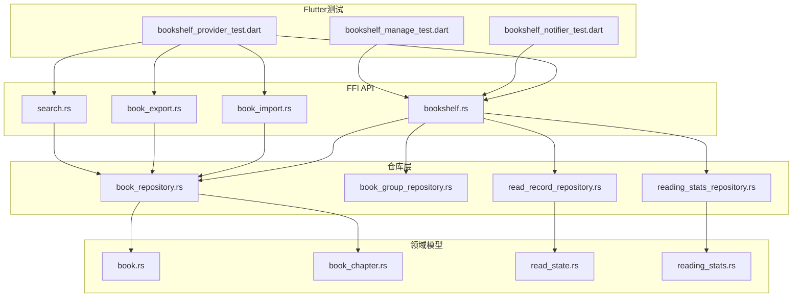
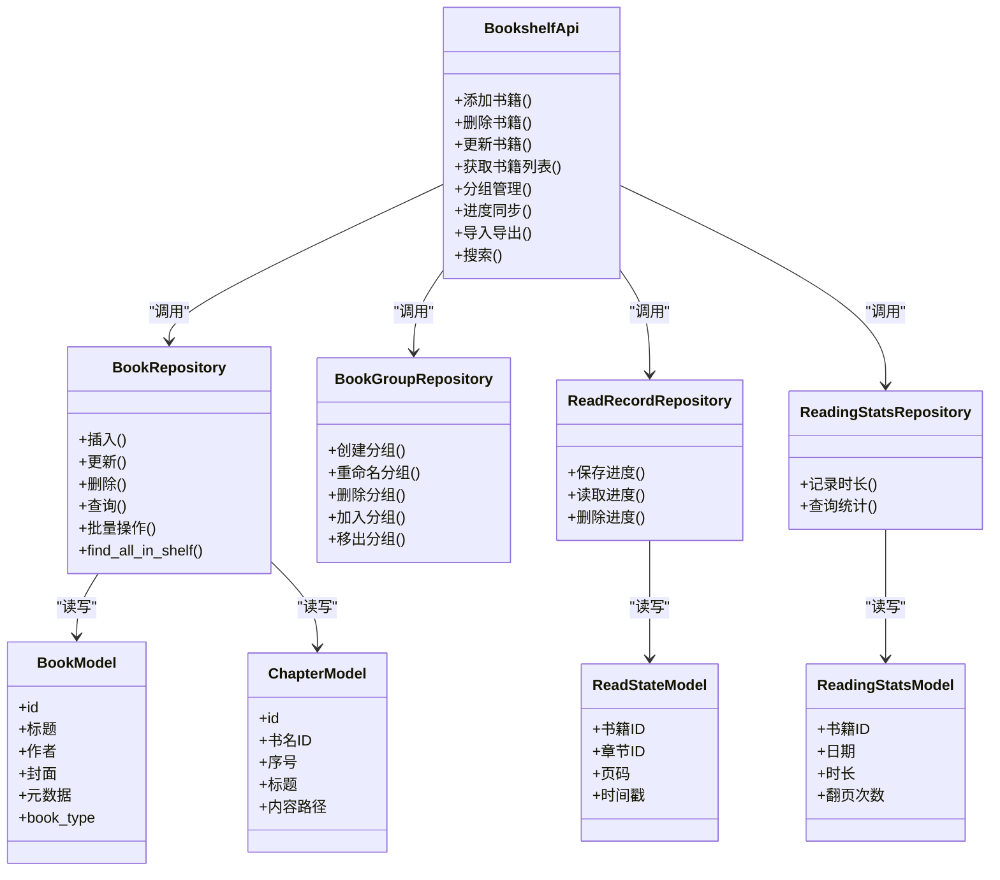
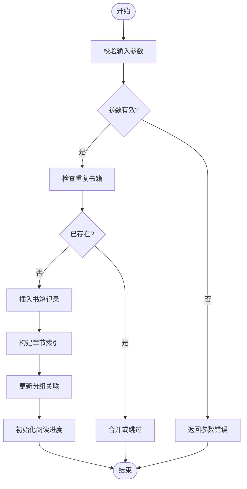
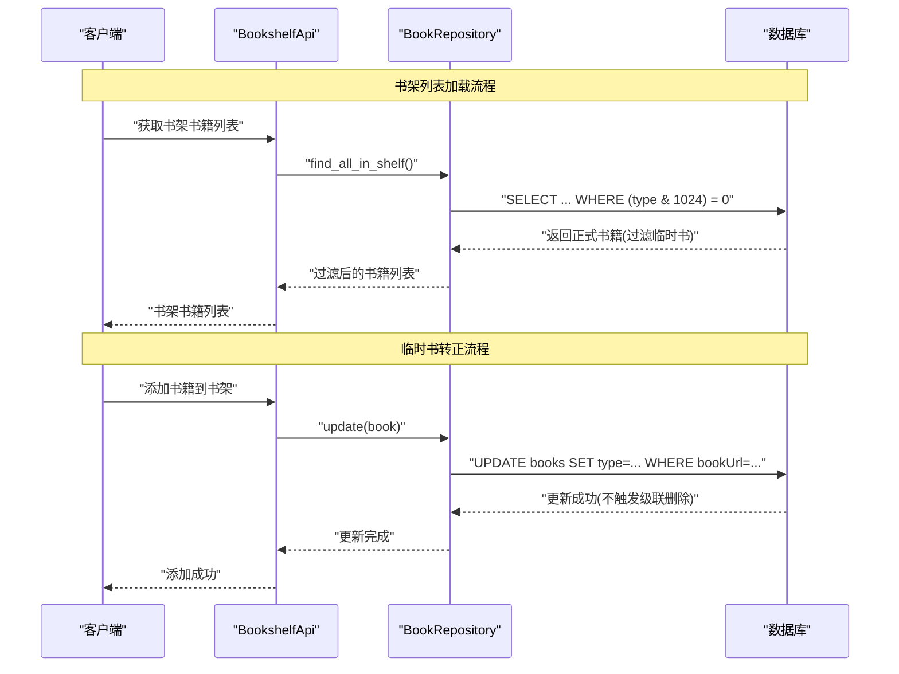
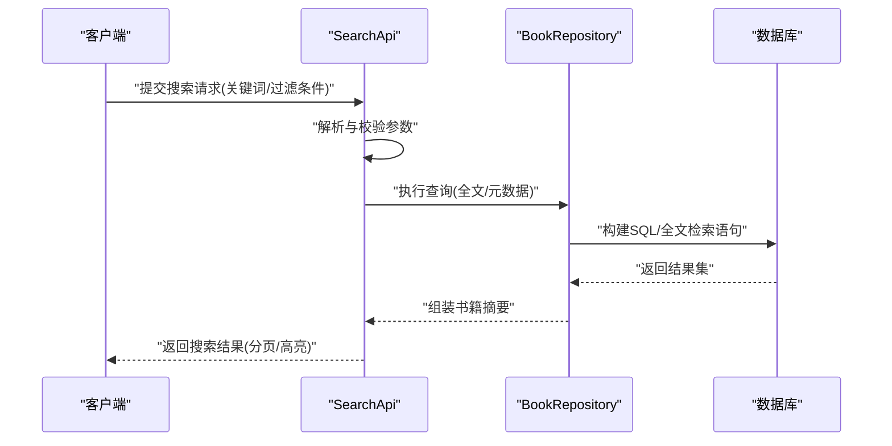
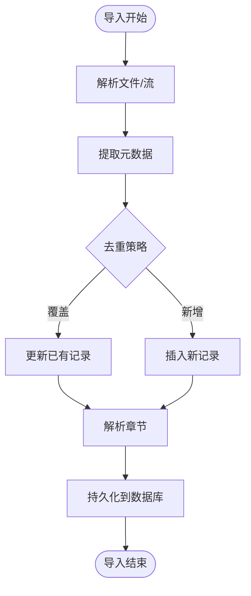
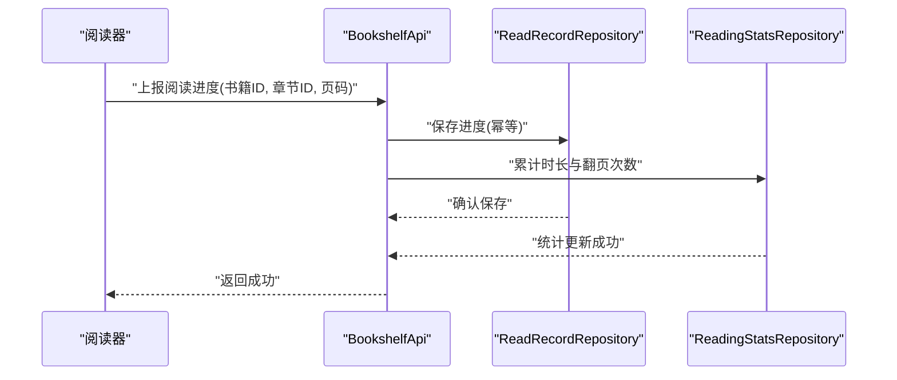
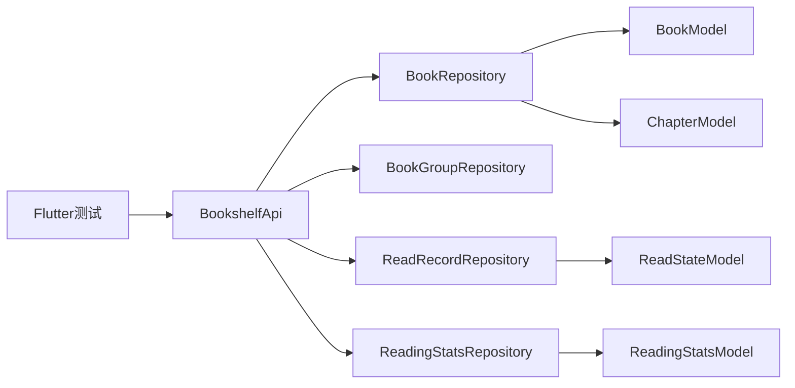

# 书架Provider

<cite>
**本文引用的文件**   
- [bookshelf_provider_test.dart](file://flutter_legado/test/unit/bookshelf_provider_test.dart)
- [bookshelf_notifier_test.dart](file://flutter_legado/test/unit/bookshelf_notifier_test.dart)
- [bookshelf_manage_test.dart](file://flutter_legado/test/unit/bookshelf_manage_test.dart)
- [bookshelf.rs](file://rust/legado-ffi/src/api/bookshelf.rs)
- [book_repository.rs](file://rust/legado-db/src/repository/book_repository.rs)
- [book_group_repository.rs](file://rust/legado-db/src/repository/book_group_repository.rs)
- [read_record_repository.rs](file://rust/legado-db/src/repository/read_record_repository.rs)
- [reading_stats_repository.rs](file://rust/legado-db/src/repository/reading_stats_repository.rs)
- [book_import.rs](file://rust/legado-ffi/src/api/book_import.rs)
- [book_export.rs](file://rust/legado-ffi/src/api/book_export.rs)
- [search.rs](file://rust/legado-ffi/src/api/search.rs)
- [lib.rs](file://rust/legado-core/src/lib.rs)
- [book.rs](file://rust/legado-core/src/models/book.rs)
- [book_chapter.rs](file://rust/legado-core/src/models/book_chapter.rs)
- [read_state.rs](file://rust/legado-core/src/read_state.rs)
- [reading_stats.rs](file://rust/legado-core/src/reading_stats.rs)
</cite>

## 更新摘要
**变更内容**   
- 增强了书架Provider的书籍管理功能，新增临时书籍智能识别和过滤机制
- 在书架列表查询中自动过滤临时书籍（notShelf标记），确保用户只看到正式添加到书架的书籍
- 优化了书籍添加和更新流程，支持临时书转正时的安全处理
- 更新了相关测试用例以验证临时书籍过滤功能的正确性

## 目录
1. [简介](#简介)
2. [项目结构](#项目结构)
3. [核心组件](#核心组件)
4. [架构总览](#架构总览)
5. [详细组件分析](#详细组件分析)
6. [依赖关系分析](#依赖关系分析)
7. [性能考量](#性能考量)
8. [故障排查指南](#故障排查指南)
9. [结论](#结论)
10. [附录：API使用示例与错误处理](#附录api使用示例与错误处理)

## 简介
本文件面向BookshelfProvider（书架Provider）的完整技术文档，聚焦于书籍书架管理的核心能力：书籍的增删改、分类与分组管理、搜索（全文与元数据）、导入导出、以及阅读进度的同步与管理。文档从系统架构、数据流、关键算法与接口契约出发，提供可操作的API使用示例与错误处理方案，帮助开发者快速集成与扩展书架功能。

**更新** 新增了临时书籍智能识别和过滤功能，确保书架列表只显示正式添加到书架的书籍，排除搜索/发现时产生的临时阅读记录。

## 项目结构
书架相关能力由Flutter层测试用例驱动验证，Rust侧通过FFI暴露API，底层由数据库仓库与领域模型支撑。整体分层如下：
- Flutter测试层：用于校验Provider行为与边界条件
- FFI API层：对外暴露统一方法，封装业务编排与错误转换
- 仓库层：对SQLite等持久化存储进行CRUD操作
- 领域模型层：定义书籍、章节、阅读状态、统计等数据结构与规则

图表来源
- [bookshelf_provider_test.dart:1-200](file://flutter_legado/test/unit/bookshelf_provider_test.dart#L1-L200)
- [bookshelf_notifier_test.dart:1-441](file://flutter_legado/test/unit/bookshelf_notifier_test.dart#L1-L441)
- [bookshelf_manage_test.dart:1-161](file://flutter_legado/test/unit/bookshelf_manage_test.dart#L1-L161)
- [bookshelf.rs:1-96](file://rust/legado-ffi/src/api/bookshelf.rs#L1-L96)
- [book_import.rs:1-200](file://rust/legado-ffi/src/api/book_import.rs#L1-L200)
- [book_export.rs:1-200](file://rust/legado-ffi/src/api/book_export.rs#L1-L200)
- [search.rs:1-200](file://rust/legado-ffi/src/api/search.rs#L1-L200)
- [book_repository.rs:1-688](file://rust/legado-db/src/repository/book_repository.rs#L1-L688)
- [book_group_repository.rs:1-200](file://rust/legado-db/src/repository/book_group_repository.rs#L1-L200)
- [read_record_repository.rs:1-200](file://rust/legado-db/src/repository/read_record_repository.rs#L1-L200)
- [reading_stats_repository.rs:1-200](file://rust/legado-db/src/repository/reading_stats_repository.rs#L1-L200)
- [book.rs:1-353](file://rust/legado-core/src/models/book.rs#L1-L353)
- [book_chapter.rs:1-200](file://rust/legado-core/src/models/book_chapter.rs#L1-L200)
- [read_state.rs:1-200](file://rust/legado-core/src/read_state.rs#L1-L200)
- [reading_stats.rs:1-200](file://rust/legado-core/src/reading_stats.rs#L1-L200)

章节来源
- [bookshelf_provider_test.dart:1-200](file://flutter_legado/test/unit/bookshelf_provider_test.dart#L1-L200)
- [bookshelf_notifier_test.dart:1-441](file://flutter_legado/test/unit/bookshelf_notifier_test.dart#L1-L441)
- [bookshelf_manage_test.dart:1-161](file://flutter_legado/test/unit/bookshelf_manage_test.dart#L1-L161)
- [bookshelf.rs:1-96](file://rust/legado-ffi/src/api/bookshelf.rs#L1-L96)
- [book_import.rs:1-200](file://rust/legado-ffi/src/api/book_import.rs#L1-L200)
- [book_export.rs:1-200](file://rust/legado-ffi/src/api/book_export.rs#L1-L200)
- [search.rs:1-200](file://rust/legado-ffi/src/api/search.rs#L1-L200)
- [book_repository.rs:1-688](file://rust/legado-db/src/repository/book_repository.rs#L1-L688)
- [book_group_repository.rs:1-200](file://rust/legado-db/src/repository/book_group_repository.rs#L1-L200)
- [read_record_repository.rs:1-200](file://rust/legado-db/src/repository/read_record_repository.rs#L1-L200)
- [reading_stats_repository.rs:1-200](file://rust/legado-db/src/repository/reading_stats_repository.rs#L1-L200)
- [book.rs:1-353](file://rust/legado-core/src/models/book.rs#L1-L353)
- [book_chapter.rs:1-200](file://rust/legado-core/src/models/book_chapter.rs#L1-L200)
- [read_state.rs:1-200](file://rust/legado-core/src/read_state.rs#L1-L200)
- [reading_stats.rs:1-200](file://rust/legado-core/src/reading_stats.rs#L1-L200)

## 核心组件
- 书架API（bookshelf.rs）：聚合书籍CRUD、分组管理、进度同步、批量操作等上层编排逻辑，并负责错误码转换与事务控制。
- 书籍仓库（book_repository.rs）：实现书籍实体的增删改查、索引维护、分页与排序、批量更新，**新增临时书籍过滤功能**。
- 分组仓库（book_group_repository.rs）：自定义分组的创建、重命名、删除、成员增减、排序与可见性。
- 阅读记录仓库（read_record_repository.rs）：章节级阅读进度读写、书签、最后阅读位置、阅读时长累计。
- 阅读统计仓库（reading_stats_repository.rs）：按日/周/月维度统计阅读时长、翻页次数、完成度等指标。
- 领域模型（book.rs, book_chapter.rs, read_state.rs, reading_stats.rs）：定义书籍、章节、阅读状态、统计数据的结构与约束，**包含临时书籍标识常量**。

章节来源
- [bookshelf.rs:1-96](file://rust/legado-ffi/src/api/bookshelf.rs#L1-L96)
- [book_repository.rs:1-688](file://rust/legado-db/src/repository/book_repository.rs#L1-L688)
- [book_group_repository.rs:1-200](file://rust/legado-db/src/repository/book_group_repository.rs#L1-L200)
- [read_record_repository.rs:1-200](file://rust/legado-db/src/repository/read_record_repository.rs#L1-L200)
- [reading_stats_repository.rs:1-200](file://rust/legado-db/src/repository/reading_stats_repository.rs#L1-L200)
- [book.rs:1-353](file://rust/legado-core/src/models/book.rs#L1-L353)
- [book_chapter.rs:1-200](file://rust/legado-core/src/models/book_chapter.rs#L1-L200)
- [read_state.rs:1-200](file://rust/legado-core/src/read_state.rs#L1-L200)
- [reading_stats.rs:1-200](file://rust/legado-core/src/reading_stats.rs#L1-L200)

## 架构总览
书架Provider采用"FFI API -> 仓库 -> 领域模型"的分层设计，确保职责清晰、易于测试与扩展。

图表来源
- [bookshelf.rs:1-96](file://rust/legado-ffi/src/api/bookshelf.rs#L1-L96)
- [book_repository.rs:1-688](file://rust/legado-db/src/repository/book_repository.rs#L1-L688)
- [book_group_repository.rs:1-200](file://rust/legado-db/src/repository/book_group_repository.rs#L1-L200)
- [read_record_repository.rs:1-200](file://rust/legado-db/src/repository/read_record_repository.rs#L1-L200)
- [reading_stats_repository.rs:1-200](file://rust/legado-db/src/repository/reading_stats_repository.rs#L1-L200)
- [book.rs:1-353](file://rust/legado-core/src/models/book.rs#L1-L353)
- [book_chapter.rs:1-200](file://rust/legado-core/src/models/book_chapter.rs#L1-L200)
- [read_state.rs:1-200](file://rust/legado-core/src/read_state.rs#L1-L200)
- [reading_stats.rs:1-200](file://rust/legado-core/src/reading_stats.rs#L1-L200)

## 详细组件分析

### 书籍CRUD与分组管理
- 添加书籍：校验输入、去重、解析元数据、写入书籍表与章节索引，必要时触发封面下载或缓存预热。
- 删除书籍：级联删除章节、阅读记录与统计；支持软删除标记与回收站恢复。
- 更新书籍：增量更新元数据、封面、标签、分组归属；保持索引一致性。
- 分组管理：创建自定义分组、重命名、删除；将书籍加入/移出分组；支持分组排序与显示顺序。

图表来源
- [bookshelf.rs:1-96](file://rust/legado-ffi/src/api/bookshelf.rs#L1-L96)
- [book_repository.rs:1-688](file://rust/legado-db/src/repository/book_repository.rs#L1-L688)
- [book_group_repository.rs:1-200](file://rust/legado-db/src/repository/book_group_repository.rs#L1-L200)

章节来源
- [bookshelf.rs:1-96](file://rust/legado-ffi/src/api/bookshelf.rs#L1-L96)
- [book_repository.rs:1-688](file://rust/legado-db/src/repository/book_repository.rs#L1-L688)
- [book_group_repository.rs:1-200](file://rust/legado-db/src/repository/book_group_repository.rs#L1-L200)

### 临时书籍智能识别与过滤
**新增功能** 实现了临时书籍的智能识别和过滤机制，确保书架列表只显示正式添加到书架的书籍。

- **临时书籍标识**：使用`NOT_SHELF`位掩码（0b100_0000_0000）标记临时书籍，这些书籍来自搜索/发现页面的在线阅读体验，但未正式加入书架。
- **书架列表过滤**：在`find_all_in_shelf()`方法中，通过SQL条件`(type & 1024) = 0`过滤掉临时书籍，确保用户只看到正式书籍。
- **安全更新机制**：当临时书籍被正式添加到书架时，使用原地UPDATE语义避免触发级联删除，保护章节目录完整性。

图表来源
- [bookshelf.rs:14-20](file://rust/legado-ffi/src/api/bookshelf.rs#L14-L20)
- [book_repository.rs:74-99](file://rust/legado-db/src/repository/book_repository.rs#L74-L99)
- [book_repository.rs:339-408](file://rust/legado-db/src/repository/book_repository.rs#L339-L408)
- [book.rs:12-15](file://rust/legado-core/src/models/book.rs#L12-L15)

章节来源
- [bookshelf.rs:14-20](file://rust/legado-ffi/src/api/bookshelf.rs#L14-L20)
- [book_repository.rs:74-99](file://rust/legado-db/src/repository/book_repository.rs#L74-L99)
- [book_repository.rs:339-408](file://rust/legado-db/src/repository/book_repository.rs#L339-L408)
- [book.rs:12-15](file://rust/legado-core/src/models/book.rs#L12-L15)

### 搜索功能（全文与元数据）
- 全文搜索：基于章节内容建立倒排索引或使用全文检索引擎，支持关键词匹配、高亮与分页。
- 元数据搜索：按标题、作者、标签、分组、来源等字段过滤，支持模糊匹配与组合查询。
- 搜索结果：返回书籍摘要、匹配片段、命中字段，便于前端展示与交互。

图表来源
- [search.rs:1-200](file://rust/legado-ffi/src/api/search.rs#L1-L200)
- [book_repository.rs:1-688](file://rust/legado-db/src/repository/book_repository.rs#L1-L688)

章节来源
- [search.rs:1-200](file://rust/legado-ffi/src/api/search.rs#L1-L200)
- [book_repository.rs:1-688](file://rust/legado-db/src/repository/book_repository.rs#L1-L688)

### 导入导出（Provider层）
- 导入：支持多种格式（EPUB/TXT/PDF等），解析元数据与章节，去重策略，批量入库，失败回滚。
- 导出：按书籍或分组导出，生成标准格式，支持压缩与分卷，断点续传与进度回调。

图表来源
- [book_import.rs:1-200](file://rust/legado-ffi/src/api/book_import.rs#L1-L200)
- [book_repository.rs:1-688](file://rust/legado-db/src/repository/book_repository.rs#L1-L688)

章节来源
- [book_import.rs:1-200](file://rust/legado-ffi/src/api/book_import.rs#L1-L200)
- [book_export.rs:1-200](file://rust/legado-ffi/src/api/book_export.rs#L1-L200)
- [book_repository.rs:1-688](file://rust/legado-db/src/repository/book_repository.rs#L1-L688)

### 阅读进度同步与管理
- 进度写入：章节级页码、时间戳、阅读时长累计，支持并发安全与幂等更新。
- 进度读取：按书籍或章节快速获取最近阅读位置、书签、阅读历史。
- 统计上报：按日/周/月汇总阅读时长与翻页次数，供分析与展示。

图表来源
- [bookshelf.rs:1-96](file://rust/legado-ffi/src/api/bookshelf.rs#L1-L96)
- [read_record_repository.rs:1-200](file://rust/legado-db/src/repository/read_record_repository.rs#L1-L200)
- [reading_stats_repository.rs:1-200](file://rust/legado-db/src/repository/reading_stats_repository.rs#L1-L200)

章节来源
- [bookshelf.rs:1-96](file://rust/legado-ffi/src/api/bookshelf.rs#L1-L96)
- [read_record_repository.rs:1-200](file://rust/legado-db/src/repository/read_record_repository.rs#L1-L200)
- [reading_stats_repository.rs:1-200](file://rust/legado-db/src/repository/reading_stats_repository.rs#L1-L200)

## 依赖关系分析
- 低耦合：API层仅依赖仓库接口，不直接访问数据库，便于替换存储实现。
- 高内聚：仓库层围绕单一实体组织，减少跨模块副作用。
- 外部依赖：FFI桥接Flutter与Rust，需保证ABI稳定与错误码映射一致。

图表来源
- [bookshelf_provider_test.dart:1-200](file://flutter_legado/test/unit/bookshelf_provider_test.dart#L1-L200)
- [bookshelf.rs:1-96](file://rust/legado-ffi/src/api/bookshelf.rs#L1-L96)
- [book_repository.rs:1-688](file://rust/legado-db/src/repository/book_repository.rs#L1-L688)
- [book_group_repository.rs:1-200](file://rust/legado-db/src/repository/book_group_repository.rs#L1-L200)
- [read_record_repository.rs:1-200](file://rust/legado-db/src/repository/read_record_repository.rs#L1-L200)
- [reading_stats_repository.rs:1-200](file://rust/legado-db/src/repository/reading_stats_repository.rs#L1-L200)
- [book.rs:1-353](file://rust/legado-core/src/models/book.rs#L1-L353)
- [book_chapter.rs:1-200](file://rust/legado-core/src/models/book_chapter.rs#L1-L200)
- [read_state.rs:1-200](file://rust/legado-core/src/read_state.rs#L1-L200)
- [reading_stats.rs:1-200](file://rust/legado-core/src/reading_stats.rs#L1-L200)

章节来源
- [bookshelf_provider_test.dart:1-200](file://flutter_legado/test/unit/bookshelf_provider_test.dart#L1-L200)
- [bookshelf.rs:1-96](file://rust/legado-ffi/src/api/bookshelf.rs#L1-L96)
- [book_repository.rs:1-688](file://rust/legado-db/src/repository/book_repository.rs#L1-L688)
- [book_group_repository.rs:1-200](file://rust/legado-db/src/repository/book_group_repository.rs#L1-L200)
- [read_record_repository.rs:1-200](file://rust/legado-db/src/repository/read_record_repository.rs#L1-L200)
- [reading_stats_repository.rs:1-200](file://rust/legado-db/src/repository/reading_stats_repository.rs#L1-L200)
- [book.rs:1-353](file://rust/legado-core/src/models/book.rs#L1-L353)
- [book_chapter.rs:1-200](file://rust/legado-core/src/models/book_chapter.rs#L1-L200)
- [read_state.rs:1-200](file://rust/legado-core/src/read_state.rs#L1-L200)
- [reading_stats.rs:1-200](file://rust/legado-core/src/reading_stats.rs#L1-L200)

## 性能考量
- 批量操作：导入/导出与批量更新应使用事务与批处理，降低IO开销。
- 索引优化：全文检索与元数据查询需合理建索引，避免全表扫描。
- 异步处理：大文件解析与网络请求应异步执行，避免阻塞主线程。
- 内存管理：分页加载与流式处理，防止大对象驻留导致OOM。
- 缓存策略：封面与章节元数据缓存，提高二次访问速度。
- **临时书籍过滤优化**：通过SQL位运算`(type & 1024) = 0`高效过滤临时书籍，避免应用层额外处理开销。

[本节为通用指导，无需引用具体文件]

## 故障排查指南
- 常见错误类型
  - 参数无效：缺失必填字段、类型不匹配、范围越界
  - 资源冲突：重复书籍、分组名称冲突、文件占用
  - 权限问题：存储读写权限不足、网络不可用
  - 数据异常：章节解析失败、索引损坏、统计不一致
- 定位步骤
  - 查看日志与错误码，确认失败阶段（解析/写入/索引）
  - 复现最小用例，隔离问题模块
  - 检查数据库完整性与索引状态
  - 验证权限与网络环境
- 恢复建议
  - 回滚事务，清理中间状态
  - 重建索引或修复损坏数据
  - 重试机制与退避策略
- **临时书籍相关问题**
  - 书架列表显示临时书籍：检查`find_all_in_shelf()`方法的SQL过滤条件
  - 临时书转正失败：确认使用原地UPDATE而非INSERT OR REPLACE，避免触发级联删除
  - 临时书籍数据污染：验证`NOT_SHELF`位掩码设置是否正确

章节来源
- [bookshelf.rs:1-96](file://rust/legado-ffi/src/api/bookshelf.rs#L1-L96)
- [book_import.rs:1-200](file://rust/legado-ffi/src/api/book_import.rs#L1-L200)
- [book_export.rs:1-200](file://rust/legado-ffi/src/api/book_export.rs#L1-L200)
- [search.rs:1-200](file://rust/legado-ffi/src/api/search.rs#L1-L200)
- [book_repository.rs:74-99](file://rust/legado-db/src/repository/book_repository.rs#L74-L99)

## 结论
BookshelfProvider以清晰的层次结构与稳健的错误处理为核心，提供完整的书架管理能力。通过仓库抽象与领域模型解耦，既保证了可扩展性，也提升了可测试性与可维护性。结合全文与元数据搜索、导入导出与进度同步，满足多样化使用场景。

**更新** 新增的临时书籍智能识别和过滤功能显著提升了用户体验，确保书架列表的纯净性和准确性，同时保持了良好的性能和向后兼容性。

[本节为总结，无需引用具体文件]

## 附录：API使用示例与错误处理
- 添加书籍
  - 输入：书籍元数据、章节信息、分组ID
  - 输出：书籍ID、状态码
  - 错误：参数无效、重复、权限不足
- 删除书籍
  - 输入：书籍ID、是否级联删除
  - 输出：删除数量、状态码
  - 错误：不存在、权限不足
- 更新书籍
  - 输入：书籍ID、更新字段
  - 输出：更新数量、状态码
  - 错误：不存在、字段非法
- 分组管理
  - 创建分组：名称、排序、可见性
  - 重命名分组：旧名与新名
  - 删除分组：级联移除成员
  - 加入/移出分组：书籍ID与分组ID
- 搜索
  - 全文搜索：关键词、分页、高亮
  - 元数据搜索：标题、作者、标签、分组
- 导入导出
  - 导入：文件路径/流、格式、去重策略
  - 导出：书籍ID列表或分组ID、目标格式、压缩选项
- 进度同步
  - 上报：书籍ID、章节ID、页码、时间戳
  - 读取：书籍ID或章节ID，返回最近位置与书签
  - 统计：日期范围、聚合维度
- **临时书籍管理**
  - 书架列表：自动过滤临时书籍，仅显示正式书籍
  - 临时书转正：安全更新type字段，避免触发级联删除
  - 临时书籍识别：通过NOT_SHELF位掩码标识临时阅读记录

章节来源
- [bookshelf_provider_test.dart:1-200](file://flutter_legado/test/unit/bookshelf_provider_test.dart#L1-L200)
- [bookshelf.rs:1-96](file://rust/legado-ffi/src/api/bookshelf.rs#L1-L96)
- [book_import.rs:1-200](file://rust/legado-ffi/src/api/book_import.rs#L1-L200)
- [book_export.rs:1-200](file://rust/legado-ffi/src/api/book_export.rs#L1-L200)
- [search.rs:1-200](file://rust/legado-ffi/src/api/search.rs#L1-L200)
- [read_record_repository.rs:1-200](file://rust/legado-db/src/repository/read_record_repository.rs#L1-L200)
- [reading_stats_repository.rs:1-200](file://rust/legado-db/src/repository/reading_stats_repository.rs#L1-L200)
- [book_repository.rs:74-99](file://rust/legado-db/src/repository/book_repository.rs#L74-L99)
- [book.rs:12-15](file://rust/legado-core/src/models/book.rs#L12-L15)