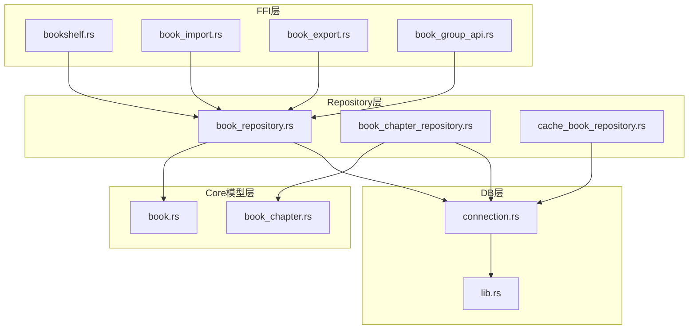
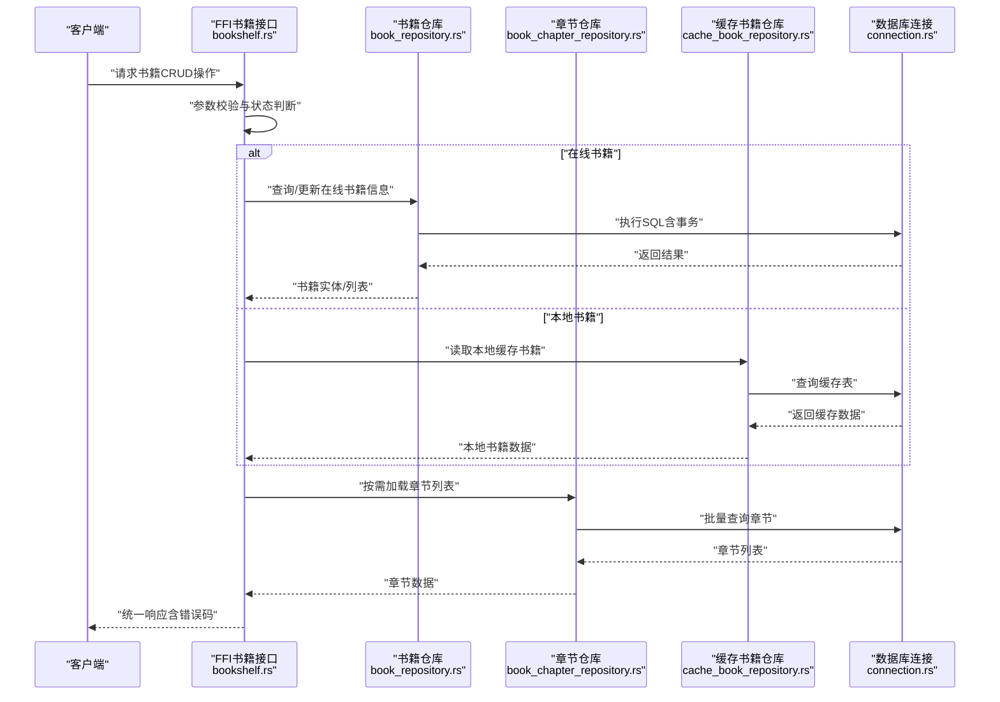
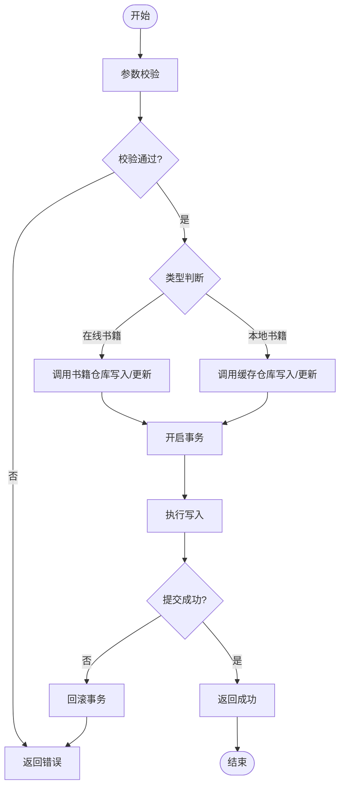
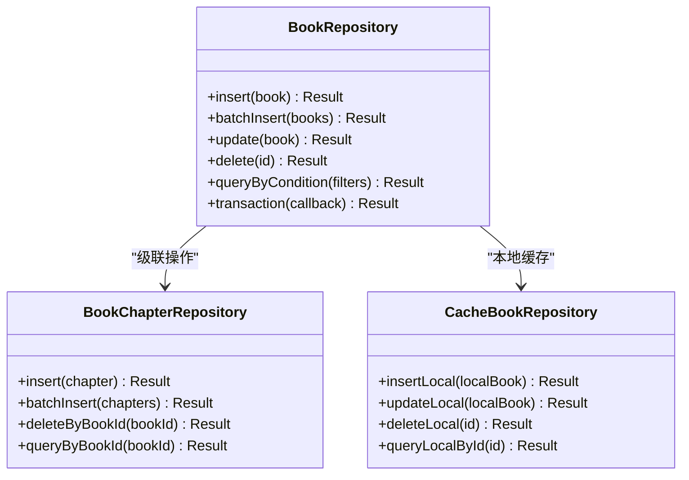
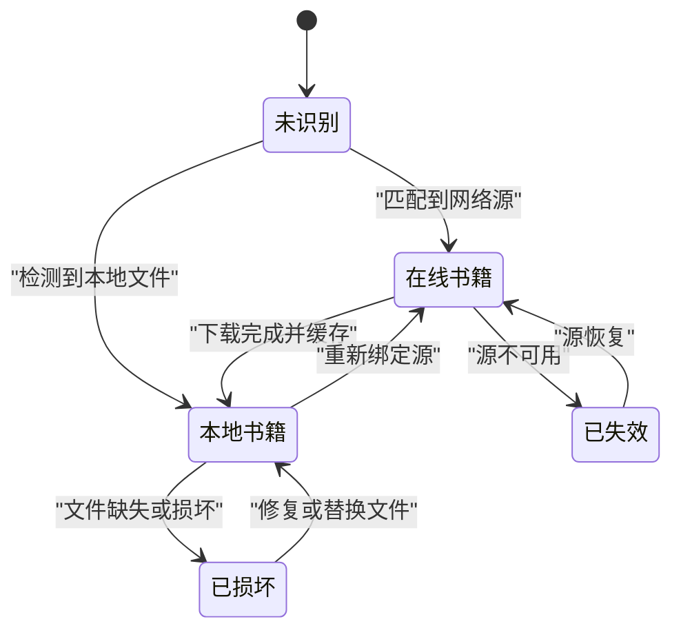
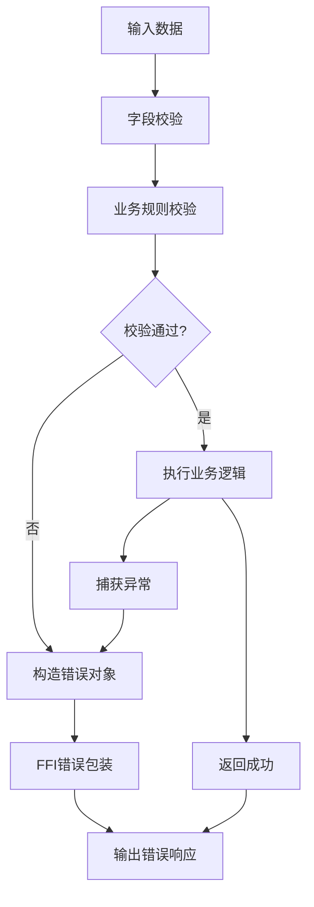
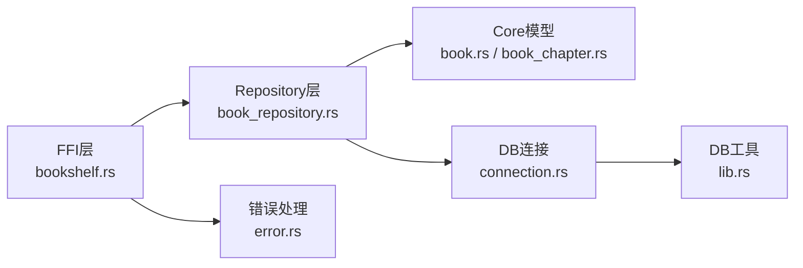

# 书籍CRUD操作

<cite>
**本文档引用的文件**   
- [book_repository.rs](file://rust/legado-db/src/repository/book_repository.rs)
- [book_chapter_repository.rs](file://rust/legado-db/src/repository/book_chapter_repository.rs)
- [bookshelf.rs](file://rust/legado-ffi/src/api/bookshelf.rs)
- [book_import.rs](file://rust/legado-ffi/src/api/book_import.rs)
- [book_export.rs](file://rust/legado-ffi/src/api/book_export.rs)
- [book_group_api.rs](file://rust/legado-ffi/src/api/book_group_api.rs)
- [cache_book_repository.rs](file://rust/legado-db/src/repository/cache_book_repository.rs)
- [book.rs](file://rust/legado-core/src/models/book.rs)
- [book_chapter.rs](file://rust/legado-core/src/models/book_chapter.rs)
- [lib.rs](file://rust/legado-db/src/lib.rs)
- [connection.rs](file://rust/legado-db/src/connection.rs)
- [error.rs](file://rust/legado-ffi/src/error.rs)
</cite>

## 目录
1. [简介](#简介)
2. [项目结构](#项目结构)
3. [核心组件](#核心组件)
4. [架构总览](#架构总览)
5. [详细组件分析](#详细组件分析)
6. [依赖关系分析](#依赖关系分析)
7. [性能考虑](#性能考虑)
8. [故障排查指南](#故障排查指南)
9. [结论](#结论)
10. [附录](#附录)

## 简介
本文件面向Legado项目的书籍CRUD（增删改查）能力，系统性说明书籍数据的添加、删除、更新与查询实现，涵盖批量操作、事务处理、在线书籍与本地书籍的状态管理差异、数据验证与错误处理机制，并提供可操作的代码示例路径与性能优化建议。文档以Rust后端为核心，结合FFI层对外暴露的API进行讲解，帮助开发者快速定位并正确使用相关接口。

## 项目结构
本项目采用分层架构：
- FFI API层：对外暴露跨语言调用接口（如Flutter、Web等），封装业务编排与参数校验。
- Repository层：数据库访问抽象，提供书籍、章节、缓存书籍等的增删改查与批量操作。
- Core模型层：定义书籍、章节等数据结构与通用逻辑。
- DB连接与迁移：SQLite连接管理与Schema演进。

**图表来源** 
- [bookshelf.rs:1-200](file://rust/legado-ffi/src/api/bookshelf.rs#L1-L200)
- [book_import.rs:1-200](file://rust/legado-ffi/src/api/book_import.rs#L1-L200)
- [book_export.rs:1-200](file://rust/legado-ffi/src/api/book_export.rs#L1-L200)
- [book_group_api.rs:1-200](file://rust/legado-ffi/src/api/book_group_api.rs#L1-L200)
- [book_repository.rs:1-300](file://rust/legado-db/src/repository/book_repository.rs#L1-L300)
- [book_chapter_repository.rs:1-200](file://rust/legado-db/src/repository/book_chapter_repository.rs#L1-L200)
- [cache_book_repository.rs:1-200](file://rust/legado-db/src/repository/cache_book_repository.rs#L1-L200)
- [book.rs:1-200](file://rust/legado-core/src/models/book.rs#L1-L200)
- [book_chapter.rs:1-200](file://rust/legado-core/src/models/book_chapter.rs#L1-L200)
- [connection.rs:1-200](file://rust/legado-db/src/connection.rs#L1-L200)
- [lib.rs:1-200](file://rust/legado-db/src/lib.rs#L1-L200)

**章节来源**
- [bookshelf.rs:1-200](file://rust/legado-ffi/src/api/bookshelf.rs#L1-L200)
- [book_repository.rs:1-300](file://rust/legado-db/src/repository/book_repository.rs#L1-L300)
- [connection.rs:1-200](file://rust/legado-db/src/connection.rs#L1-L200)
- [lib.rs:1-200](file://rust/legado-db/src/lib.rs#L1-L200)

## 核心组件
- 书籍仓库（BookRepository）：负责书籍实体的增删改查、批量插入/更新、按条件查询、分页与排序。
- 章节仓库（BookChapterRepository）：负责章节列表的增删改查、批量写入、按书籍ID检索。
- 缓存书籍仓库（CacheBookRepository）：用于临时或离线缓存的书籍数据读写。
- FFI书籍接口（bookshelf.rs）：对外暴露书籍列表、详情、搜索、导入导出、分组管理等API。
- 书籍导入导出（book_import.rs / book_export.rs）：批量导入与导出书籍元数据与内容。
- 书籍分组（book_group_api.rs）：书籍分组维度的增删改查与成员管理。
- 核心模型（book.rs / book_chapter.rs）：书籍与章节的数据结构与基础方法。
- 数据库连接（connection.rs / lib.rs）：SQLite连接池、事务控制、迁移与初始化。

**章节来源**
- [book_repository.rs:1-300](file://rust/legado-db/src/repository/book_repository.rs#L1-L300)
- [book_chapter_repository.rs:1-200](file://rust/legado-db/src/repository/book_chapter_repository.rs#L1-L200)
- [cache_book_repository.rs:1-200](file://rust/legado-db/src/repository/cache_book_repository.rs#L1-L200)
- [bookshelf.rs:1-200](file://rust/legado-ffi/src/api/bookshelf.rs#L1-L200)
- [book_import.rs:1-200](file://rust/legado-ffi/src/api/book_import.rs#L1-L200)
- [book_export.rs:1-200](file://rust/legado-ffi/src/api/book_export.rs#L1-L200)
- [book_group_api.rs:1-200](file://rust/legado-ffi/src/api/book_group_api.rs#L1-L200)
- [book.rs:1-200](file://rust/legado-core/src/models/book.rs#L1-L200)
- [book_chapter.rs:1-200](file://rust/legado-core/src/models/book_chapter.rs#L1-L200)
- [connection.rs:1-200](file://rust/legado-db/src/connection.rs#L1-L200)
- [lib.rs:1-200](file://rust/legado-db/src/lib.rs#L1-L200)

## 架构总览
下图展示了从FFI到Repository再到DB的连接与调用流程，以及书籍状态管理的分支逻辑。

**图表来源** 
- [bookshelf.rs:1-200](file://rust/legado-ffi/src/api/bookshelf.rs#L1-L200)
- [book_repository.rs:1-300](file://rust/legado-db/src/repository/book_repository.rs#L1-L300)
- [book_chapter_repository.rs:1-200](file://rust/legado-db/src/repository/book_chapter_repository.rs#L1-L200)
- [cache_book_repository.rs:1-200](file://rust/legado-db/src/repository/cache_book_repository.rs#L1-L200)
- [connection.rs:1-200](file://rust/legado-db/src/connection.rs#L1-L200)

## 详细组件分析

### 书籍CRUD操作（增删改查）
- 新增书籍
  - 入口：FFI层接收请求，进行参数校验（书名、作者、链接、封面等）。
  - 逻辑：根据“在线书籍”或“本地书籍”分支，分别调用书籍仓库或缓存仓库写入。
  - 事务：批量插入时使用事务保证一致性。
  - 验证：字段长度、格式、唯一性检查；失败时返回标准化错误。
- 删除书籍
  - 入口：FFI层校验书籍ID与权限。
  - 逻辑：删除书籍主记录，级联删除章节与书签（如有）。
  - 事务：使用事务确保级联删除原子性。
- 更新书籍
  - 入口：FFI层校验更新字段合法性。
  - 逻辑：支持在线书籍元数据更新与本地书籍缓存更新。
  - 并发：基于乐观锁或版本号避免覆盖冲突。
- 查询书籍
  - 入口：支持按关键字、分类、标签、状态筛选。
  - 逻辑：分页、排序、索引命中；在线书籍优先，本地缓存兜底。
  - 扩展：支持全文检索与聚合统计。

**图表来源** 
- [bookshelf.rs:1-200](file://rust/legado-ffi/src/api/bookshelf.rs#L1-L200)
- [book_repository.rs:1-300](file://rust/legado-db/src/repository/book_repository.rs#L1-L300)
- [cache_book_repository.rs:1-200](file://rust/legado-db/src/repository/cache_book_repository.rs#L1-L200)
- [connection.rs:1-200](file://rust/legado-db/src/connection.rs#L1-L200)

**章节来源**
- [bookshelf.rs:1-200](file://rust/legado-ffi/src/api/bookshelf.rs#L1-L200)
- [book_repository.rs:1-300](file://rust/legado-db/src/repository/book_repository.rs#L1-L300)
- [cache_book_repository.rs:1-200](file://rust/legado-db/src/repository/cache_book_repository.rs#L1-L200)
- [connection.rs:1-200](file://rust/legado-db/src/connection.rs#L1-L200)

### 批量操作与事务处理
- 批量插入
  - 使用事务包裹多条INSERT，减少IO开销与锁竞争。
  - 分批提交，避免单次事务过大导致内存压力。
- 批量更新
  - 合并相同键的更新，减少重复SQL。
  - 使用UPSERT模式处理存在即更新场景。
- 事务边界
  - 明确事务起点与终点，异常时自动回滚。
  - 长事务拆分，避免持有锁过久。

**图表来源** 
- [book_repository.rs:1-300](file://rust/legado-db/src/repository/book_repository.rs#L1-L300)
- [book_chapter_repository.rs:1-200](file://rust/legado-db/src/repository/book_chapter_repository.rs#L1-L200)
- [cache_book_repository.rs:1-200](file://rust/legado-db/src/repository/cache_book_repository.rs#L1-L200)

**章节来源**
- [book_repository.rs:1-300](file://rust/legado-db/src/repository/book_repository.rs#L1-L300)
- [book_chapter_repository.rs:1-200](file://rust/legado-db/src/repository/book_chapter_repository.rs#L1-L200)
- [cache_book_repository.rs:1-200](file://rust/legado-db/src/repository/cache_book_repository.rs#L1-L200)

### 书籍状态管理（在线书籍 vs 本地书籍）
- 在线书籍
  - 元数据来源于网络源，包含URL、解析规则、封面等。
  - 更新策略：定时同步、增量更新、冲突解决（版本比较）。
- 本地书籍
  - 由用户导入或缓存生成，包含本地路径、哈希、大小等。
  - 更新策略：文件变更检测、增量扫描、去重。
- 状态切换
  - 在线转本地：下载后标记为本地，保留在线关联。
  - 本地转在线：重新绑定源与规则，恢复在线属性。

**图表来源** 
- [bookshelf.rs:1-200](file://rust/legado-ffi/src/api/bookshelf.rs#L1-L200)
- [book.rs:1-200](file://rust/legado-core/src/models/book.rs#L1-L200)

**章节来源**
- [bookshelf.rs:1-200](file://rust/legado-ffi/src/api/bookshelf.rs#L1-L200)
- [book.rs:1-200](file://rust/legado-core/src/models/book.rs#L1-L200)

### 数据验证与错误处理
- 输入验证
  - 必填字段、长度限制、格式校验（URL、邮箱、正则）。
  - 业务规则校验（唯一性、依赖关系）。
- 错误分类
  - 参数错误、数据冲突、系统异常、网络错误。
- 错误传播
  - FFI层统一包装错误码与消息，便于前端展示。
  - 日志记录关键上下文，便于问题定位。

**图表来源** 
- [bookshelf.rs:1-200](file://rust/legado-ffi/src/api/bookshelf.rs#L1-L200)
- [error.rs:1-200](file://rust/legado-ffi/src/error.rs#L1-L200)

**章节来源**
- [bookshelf.rs:1-200](file://rust/legado-ffi/src/api/bookshelf.rs#L1-L200)
- [error.rs:1-200](file://rust/legado-ffi/src/error.rs#L1-L200)

### 具体操作示例（代码片段路径）
- 新增书籍
  - 参考路径：[bookshelf.rs:1-200](file://rust/legado-ffi/src/api/bookshelf.rs#L1-L200)、[book_repository.rs:1-300](file://rust/legado-db/src/repository/book_repository.rs#L1-L300)
- 删除书籍
  - 参考路径：[bookshelf.rs:1-200](file://rust/legado-ffi/src/api/bookshelf.rs#L1-L200)、[book_repository.rs:1-300](file://rust/legado-db/src/repository/book_repository.rs#L1-L300)
- 更新书籍
  - 参考路径：[bookshelf.rs:1-200](file://rust/legado-ffi/src/api/bookshelf.rs#L1-L200)、[book_repository.rs:1-300](file://rust/legado-db/src/repository/book_repository.rs#L1-L300)
- 查询书籍
  - 参考路径：[bookshelf.rs:1-200](file://rust/legado-ffi/src/api/bookshelf.rs#L1-L200)、[book_repository.rs:1-300](file://rust/legado-db/src/repository/book_repository.rs#L1-L300)
- 批量导入
  - 参考路径：[book_import.rs:1-200](file://rust/legado-ffi/src/api/book_import.rs#L1-L200)、[book_repository.rs:1-300](file://rust/legado-db/src/repository/book_repository.rs#L1-L300)
- 批量导出
  - 参考路径：[book_export.rs:1-200](file://rust/legado-ffi/src/api/book_export.rs#L1-L200)、[book_repository.rs:1-300](file://rust/legado-db/src/repository/book_repository.rs#L1-L300)

**章节来源**
- [bookshelf.rs:1-200](file://rust/legado-ffi/src/api/bookshelf.rs#L1-L200)
- [book_repository.rs:1-300](file://rust/legado-db/src/repository/book_repository.rs#L1-L300)
- [book_import.rs:1-200](file://rust/legado-ffi/src/api/book_import.rs#L1-L200)
- [book_export.rs:1-200](file://rust/legado-ffi/src/api/book_export.rs#L1-L200)

## 依赖关系分析
- FFI层依赖Repository层进行数据访问，Repository层依赖Core模型定义数据结构。
- Repository层通过connection.rs获取数据库连接，使用lib.rs提供的工具函数进行事务与迁移。
- 错误处理集中在FFI层的error.rs，统一向上抛出。

**图表来源** 
- [bookshelf.rs:1-200](file://rust/legado-ffi/src/api/bookshelf.rs#L1-L200)
- [book_repository.rs:1-300](file://rust/legado-db/src/repository/book_repository.rs#L1-L300)
- [book.rs:1-200](file://rust/legado-core/src/models/book.rs#L1-L200)
- [book_chapter.rs:1-200](file://rust/legado-core/src/models/book_chapter.rs#L1-L200)
- [connection.rs:1-200](file://rust/legado-db/src/connection.rs#L1-L200)
- [lib.rs:1-200](file://rust/legado-db/src/lib.rs#L1-L200)
- [error.rs:1-200](file://rust/legado-ffi/src/error.rs#L1-L200)

**章节来源**
- [bookshelf.rs:1-200](file://rust/legado-ffi/src/api/bookshelf.rs#L1-L200)
- [book_repository.rs:1-300](file://rust/legado-db/src/repository/book_repository.rs#L1-L300)
- [connection.rs:1-200](file://rust/legado-db/src/connection.rs#L1-L200)
- [error.rs:1-200](file://rust/legado-ffi/src/error.rs#L1-L200)

## 性能考虑
- 索引优化
  - 对常用查询字段（书名、作者、标签、状态）建立索引。
  - 复合索引覆盖多条件查询。
- 批量操作
  - 使用事务包裹批量写入，减少IO次数。
  - 分批次提交，避免内存峰值过高。
- 查询优化
  - 分页查询限制返回条数。
  - 避免N+1查询，使用JOIN或预加载。
- 缓存策略
  - 热点书籍元数据缓存，缩短响应时间。
  - 本地缓存与在线数据一致性校验。
- 并发控制
  - 读写分离，读多写少场景提升吞吐。
  - 使用乐观锁避免写冲突。

[本节为通用指导，不直接分析具体文件]

## 故障排查指南
- 常见问题
  - 参数校验失败：检查输入字段是否符合规则。
  - 数据冲突：唯一性约束冲突，需去重或更新策略。
  - 事务失败：长事务或锁竞争导致超时，拆分事务。
  - 网络错误：在线书籍源不可用，重试或降级到本地缓存。
- 调试技巧
  - 启用详细日志，记录关键上下文。
  - 使用错误码定位问题阶段（参数、业务、系统）。
  - 复现最小用例，逐步缩小范围。

**章节来源**
- [error.rs:1-200](file://rust/legado-ffi/src/error.rs#L1-L200)
- [bookshelf.rs:1-200](file://rust/legado-ffi/src/api/bookshelf.rs#L1-L200)

## 结论
Legado项目的书籍CRUD操作通过清晰的层次划分与严格的错误处理机制，实现了高效稳定的数据管理能力。在线书籍与本地书籍的状态管理灵活可扩展，批量操作与事务处理保障了数据一致性与性能。开发者可依据本文档的定位与示例路径，快速集成与优化相关功能。

[本节为总结，不直接分析具体文件]

## 附录
- 术语表
  - 在线书籍：通过网络源解析的书籍元数据。
  - 本地书籍：用户导入或缓存生成的书籍数据。
  - 事务：一组操作的原子执行单元。
- 参考文件
  - [bookshelf.rs](file://rust/legado-ffi/src/api/bookshelf.rs)
  - [book_repository.rs](file://rust/legado-db/src/repository/book_repository.rs)
  - [book_chapter_repository.rs](file://rust/legado-db/src/repository/book_chapter_repository.rs)
  - [cache_book_repository.rs](file://rust/legado-db/src/repository/cache_book_repository.rs)
  - [book_import.rs](file://rust/legado-ffi/src/api/book_import.rs)
  - [book_export.rs](file://rust/legado-ffi/src/api/book_export.rs)
  - [book_group_api.rs](file://rust/legado-ffi/src/api/book_group_api.rs)
  - [book.rs](file://rust/legado-core/src/models/book.rs)
  - [book_chapter.rs](file://rust/legado-core/src/models/book_chapter.rs)
  - [connection.rs](file://rust/legado-db/src/connection.rs)
  - [lib.rs](file://rust/legado-db/src/lib.rs)
  - [error.rs](file://rust/legado-ffi/src/error.rs)

[本节为附录，不直接分析具体文件]