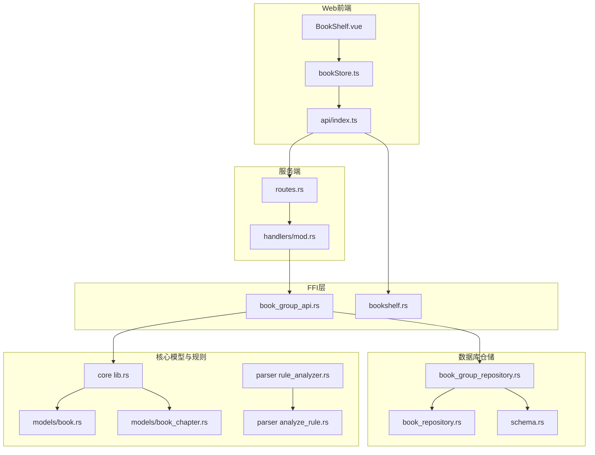
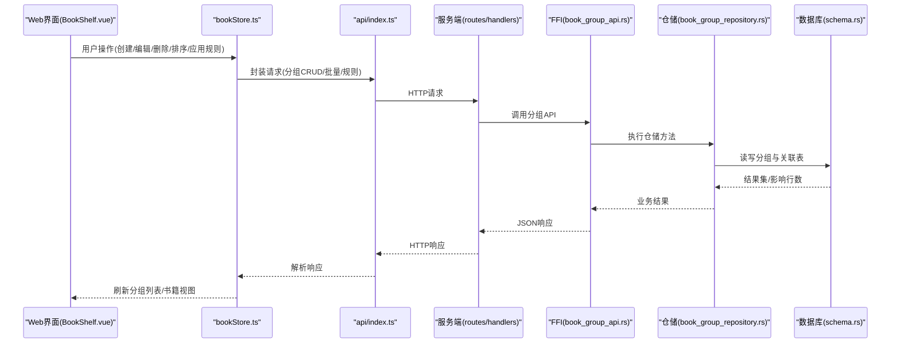
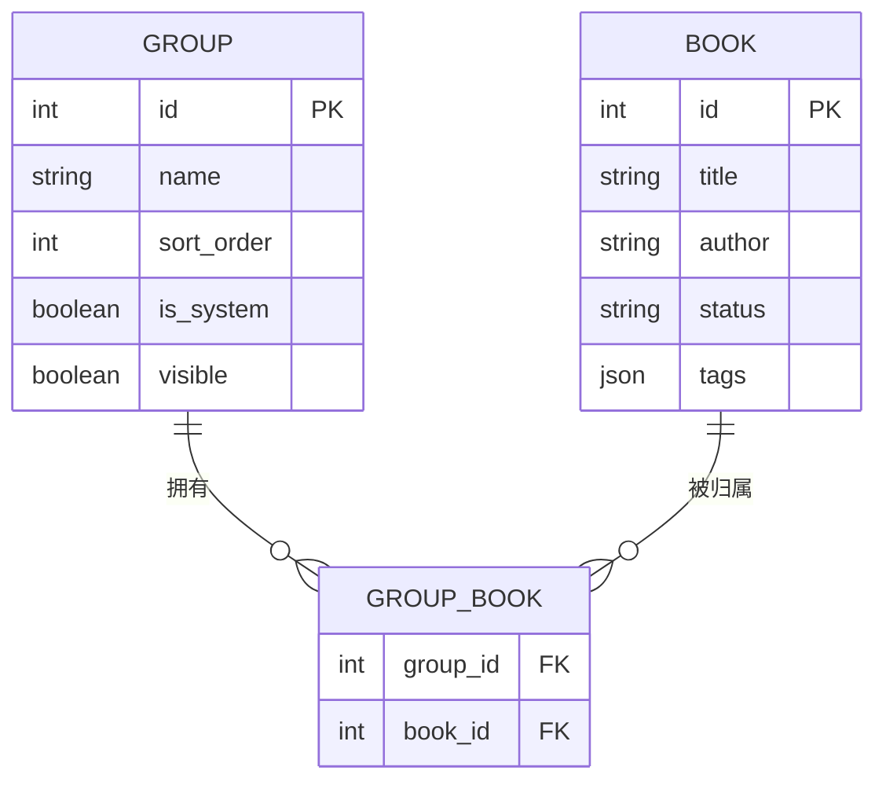
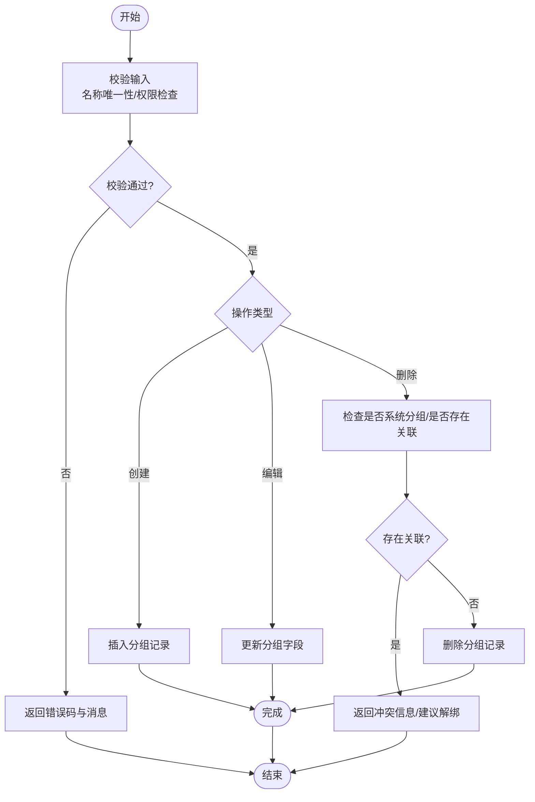
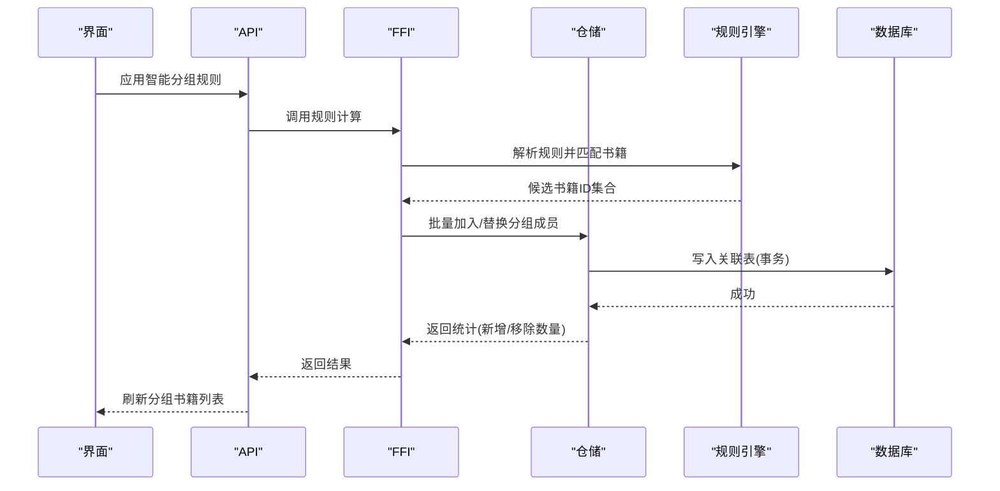
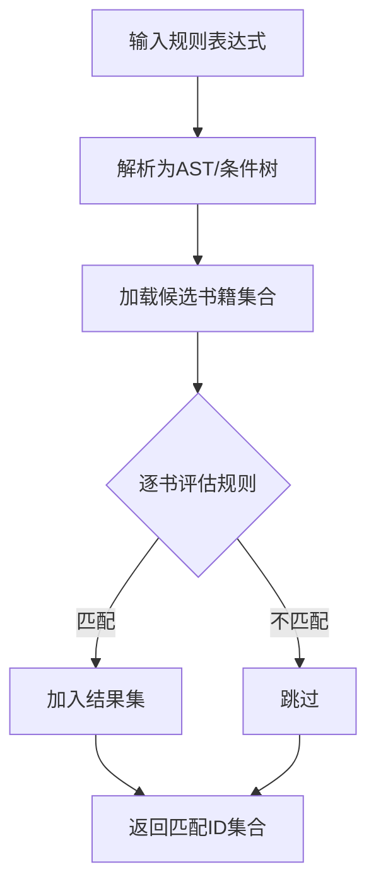
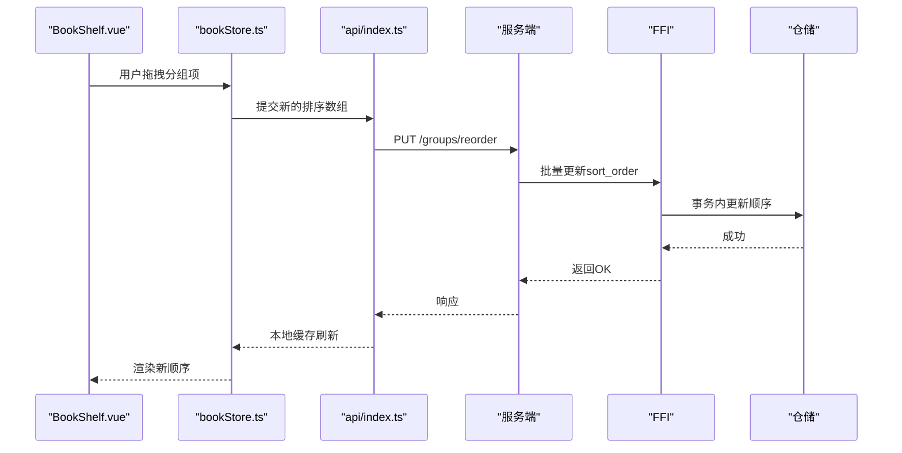
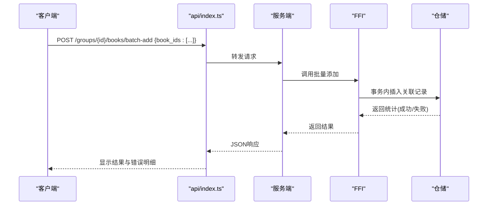
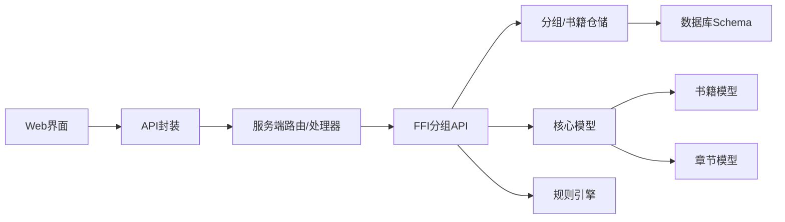

# 书籍分组管理

<cite>
**本文引用的文件**   
- [book_group_api.rs](file://rust/legado-ffi/src/api/book_group_api.rs)
- [book_group_repository.rs](file://rust/legado-db/src/repository/book_group_repository.rs)
- [book_repository.rs](file://rust/legado-db/src/repository/book_repository.rs)
- [schema.rs](file://rust/legado-db/src/schema.rs)
- [routes.rs](file://rust/legado-server/src/routes.rs)
- [handlers/mod.rs](file://rust/legado-server/src/handlers/mod.rs)
- [bookshelf.rs](file://rust/legado-ffi/src/api/bookshelf.rs)
- [lib.rs](file://rust/legado-core/src/lib.rs)
- [book.rs](file://rust/legado-core/src/models/book.rs)
- [book_chapter.rs](file://rust/legado-core/src/models/book_chapter.rs)
- [rule_analyzer.rs](file://rust/legado-parser/src/rule_analyzer.rs)
- [analyze_rule.rs](file://rust/legado-parser/src/analyze_rule.rs)
- [BookShelf.vue](file://modules/web/src/views/BookShelf.vue)
- [bookStore.ts](file://modules/web/src/store/bookStore.ts)
- [api/index.ts](file://modules/web/src/api/index.ts)
</cite>

## 目录
1. [简介](#简介)
2. [项目结构](#项目结构)
3. [核心组件](#核心组件)
4. [架构总览](#架构总览)
5. [详细组件分析](#详细组件分析)
6. [依赖关系分析](#依赖关系分析)
7. [性能考量](#性能考量)
8. [故障排查指南](#故障排查指南)
9. [结论](#结论)
10. [附录](#附录)

## 简介
本文件面向Legado项目的“书籍分组管理”能力，系统性说明自定义分组的创建、编辑与删除；阐述分组与书籍的关联关系与数据同步机制；解释智能分组规则（基于标签、作者、状态等）的实现思路；梳理分组排序与显示逻辑（含拖拽排序与视图切换）；并提供Web端API使用示例，包括批量操作与冲突解决策略。文档兼顾开发者与高级用户，力求在可操作性和技术深度之间取得平衡。

## 项目结构
围绕“书籍分组管理”，代码主要分布在以下层次：
- FFI层对外暴露接口：Rust FFI将分组相关能力暴露给上层调用方（Android/Flutter/Web）。
- 数据库仓储层：负责分组与书籍的CRUD、关联维护与事务一致性。
- 服务端路由与处理器：提供HTTP API供Web端调用。
- Web前端：提供分组管理的UI、交互与API封装。
- 规则引擎：解析并执行智能分组规则（标签、作者、状态等条件）。

图表来源 
- [routes.rs](file://rust/legado-server/src/routes.rs)
- [handlers/mod.rs](file://rust/legado-server/src/handlers/mod.rs)
- [book_group_api.rs](file://rust/legado-ffi/src/api/book_group_api.rs)
- [book_group_repository.rs](file://rust/legado-db/src/repository/book_group_repository.rs)
- [book_repository.rs](file://rust/legado-db/src/repository/book_repository.rs)
- [schema.rs](file://rust/legado-db/src/schema.rs)
- [bookshelf.rs](file://rust/legado-ffi/src/api/bookshelf.rs)
- [lib.rs](file://rust/legado-core/src/lib.rs)
- [book.rs](file://rust/legado-core/src/models/book.rs)
- [book_chapter.rs](file://rust/legado-core/src/models/book_chapter.rs)
- [rule_analyzer.rs](file://rust/legado-parser/src/rule_analyzer.rs)
- [analyze_rule.rs](file://rust/legado-parser/src/analyze_rule.rs)

章节来源
- [routes.rs](file://rust/legado-server/src/routes.rs)
- [handlers/mod.rs](file://rust/legado-server/src/handlers/mod.rs)
- [book_group_api.rs](file://rust/legado-ffi/src/api/book_group_api.rs)
- [book_group_repository.rs](file://rust/legado-db/src/repository/book_group_repository.rs)
- [book_repository.rs](file://rust/legado-db/src/repository/book_repository.rs)
- [schema.rs](file://rust/legado-db/src/schema.rs)
- [bookshelf.rs](file://rust/legado-ffi/src/api/bookshelf.rs)
- [lib.rs](file://rust/legado-core/src/lib.rs)
- [book.rs](file://rust/legado-core/src/models/book.rs)
- [book_chapter.rs](file://rust/legado-core/src/models/book_chapter.rs)
- [rule_analyzer.rs](file://rust/legado-parser/src/rule_analyzer.rs)
- [analyze_rule.rs](file://rust/legado-parser/src/analyze_rule.rs)

## 核心组件
- 分组仓储（Group Repository）：实现分组实体的增删改查、排序字段更新、与书籍的关联维护（多对多或外键集合），以及批量操作的事务边界。
- 书籍仓储（Book Repository）：提供书籍查询、按条件筛选、批量加入/移出分组的能力。
- FFI分组API（Group API）：将仓储能力包装为跨语言可调用的函数，统一错误码与返回结构。
- 服务端路由与处理器：定义RESTful路径，接收请求参数，调用FFI接口，返回JSON响应。
- 规则引擎（Rule Analyzer/Analyze Rule）：解析规则表达式，支持基于标签、作者、状态等条件的匹配，输出候选书籍ID集合。
- Web前端（BookShelf + bookStore + api）：提供分组列表、编辑器、拖拽排序、视图切换与API调用封装。

章节来源
- [book_group_repository.rs](file://rust/legado-db/src/repository/book_group_repository.rs)
- [book_repository.rs](file://rust/legado-db/src/repository/book_repository.rs)
- [book_group_api.rs](file://rust/legado-ffi/src/api/book_group_api.rs)
- [routes.rs](file://rust/legado-server/src/routes.rs)
- [handlers/mod.rs](file://rust/legado-server/src/handlers/mod.rs)
- [rule_analyzer.rs](file://rust/legado-parser/src/rule_analyzer.rs)
- [analyze_rule.rs](file://rust/legado-parser/src/analyze_rule.rs)
- [BookShelf.vue](file://modules/web/src/views/BookShelf.vue)
- [bookStore.ts](file://modules/web/src/store/bookStore.ts)
- [api/index.ts](file://modules/web/src/api/index.ts)

## 架构总览
下图展示从Web端到数据库的完整调用链，涵盖分组CRUD、智能分组计算与结果回写。

图表来源 
- [BookShelf.vue](file://modules/web/src/views/BookShelf.vue)
- [bookStore.ts](file://modules/web/src/store/bookStore.ts)
- [api/index.ts](file://modules/web/src/api/index.ts)
- [routes.rs](file://rust/legado-server/src/routes.rs)
- [handlers/mod.rs](file://rust/legado-server/src/handlers/mod.rs)
- [book_group_api.rs](file://rust/legado-ffi/src/api/book_group_api.rs)
- [book_group_repository.rs](file://rust/legado-db/src/repository/book_group_repository.rs)
- [schema.rs](file://rust/legado-db/src/schema.rs)

## 详细组件分析

### 分组实体与关联关系
- 分组实体包含名称、排序权重、可见性、是否系统内置等属性。
- 分组与书籍为多对多关系，通常通过中间表或书籍实体的分组ID集合维护。
- 智能分组不持久化成员，而是每次计算时根据规则动态生成候选集合。

图表来源 
- [schema.rs](file://rust/legado-db/src/schema.rs)
- [book_group_repository.rs](file://rust/legado-db/src/repository/book_group_repository.rs)
- [book_repository.rs](file://rust/legado-db/src/repository/book_repository.rs)

章节来源
- [schema.rs](file://rust/legado-db/src/schema.rs)
- [book_group_repository.rs](file://rust/legado-db/src/repository/book_group_repository.rs)
- [book_repository.rs](file://rust/legado-db/src/repository/book_repository.rs)

### 分组CRUD流程（创建、编辑、删除）
- 创建分组：校验名称唯一性，写入分组表，返回新分组ID与排序位置。
- 编辑分组：支持重命名、调整排序、切换可见性与系统标记（受权限控制）。
- 删除分组：若存在关联书籍，需先解除关联或提示冲突；系统内置分组禁止删除。

图表来源 
- [book_group_api.rs](file://rust/legado-ffi/src/api/book_group_api.rs)
- [book_group_repository.rs](file://rust/legado-db/src/repository/book_group_repository.rs)

章节来源
- [book_group_api.rs](file://rust/legado-ffi/src/api/book_group_api.rs)
- [book_group_repository.rs](file://rust/legado-db/src/repository/book_group_repository.rs)

### 分组与书籍的关联与同步机制
- 手动关联：将书籍加入/移出指定分组，仓储层保证事务一致性与索引效率。
- 智能分组：当规则变更或书籍元数据变化时，触发重新计算，增量更新分组成员。
- 同步策略：采用事件驱动或定时任务，避免全量扫描；优先处理受影响书籍集合。

图表来源 
- [book_group_api.rs](file://rust/legado-ffi/src/api/book_group_api.rs)
- [book_group_repository.rs](file://rust/legado-db/src/repository/book_group_repository.rs)
- [rule_analyzer.rs](file://rust/legado-parser/src/rule_analyzer.rs)
- [analyze_rule.rs](file://rust/legado-parser/src/analyze_rule.rs)

章节来源
- [book_group_api.rs](file://rust/legado-ffi/src/api/book_group_api.rs)
- [book_group_repository.rs](file://rust/legado-db/src/repository/book_group_repository.rs)
- [rule_analyzer.rs](file://rust/legado-parser/src/rule_analyzer.rs)
- [analyze_rule.rs](file://rust/legado-parser/src/analyze_rule.rs)

### 智能分组规则实现（标签、作者、状态）
- 规则解析：支持布尔表达式、字段匹配（如标签包含/等于、作者模糊匹配、状态枚举）。
- 匹配引擎：遍历候选书籍，逐项评估规则，输出匹配的书籍ID集合。
- 增量优化：仅对发生变化的书籍重新评估，减少CPU与IO开销。

图表来源 
- [rule_analyzer.rs](file://rust/legado-parser/src/rule_analyzer.rs)
- [analyze_rule.rs](file://rust/legado-parser/src/analyze_rule.rs)
- [book_repository.rs](file://rust/legado-db/src/repository/book_repository.rs)

章节来源
- [rule_analyzer.rs](file://rust/legado-parser/src/rule_analyzer.rs)
- [analyze_rule.rs](file://rust/legado-parser/src/analyze_rule.rs)
- [book_repository.rs](file://rust/legado-db/src/repository/book_repository.rs)

### 分组排序与显示逻辑（拖拽排序与视图切换）
- 排序字段：分组表包含sort_order，支持前端拖拽后批量更新顺序。
- 显示逻辑：按sort_order升序排列；支持按名称、时间等二次排序。
- 视图切换：网格/列表视图由前端状态控制，后端仅返回分组与书籍基础信息。

图表来源 
- [BookShelf.vue](file://modules/web/src/views/BookShelf.vue)
- [bookStore.ts](file://modules/web/src/store/bookStore.ts)
- [api/index.ts](file://modules/web/src/api/index.ts)
- [book_group_repository.rs](file://rust/legado-db/src/repository/book_group_repository.rs)

章节来源
- [BookShelf.vue](file://modules/web/src/views/BookShelf.vue)
- [bookStore.ts](file://modules/web/src/store/bookStore.ts)
- [api/index.ts](file://modules/web/src/api/index.ts)
- [book_group_repository.rs](file://rust/legado-db/src/repository/book_group_repository.rs)

### API使用示例（批量操作与冲突解决）
- 批量加入书籍到分组：传入分组ID与书籍ID数组，后端以事务执行，返回成功/失败计数。
- 批量移除书籍：同加入，支持部分失败的回滚或保留策略。
- 冲突解决：
  - 名称冲突：创建时校验唯一性，返回冲突码与提示。
  - 系统分组保护：禁止删除或修改系统分组，返回权限错误。
  - 关联冲突：删除分组前检查是否有书籍关联，若有则要求先解绑或选择迁移目标分组。

图表来源 
- [api/index.ts](file://modules/web/src/api/index.ts)
- [book_group_api.rs](file://rust/legado-ffi/src/api/book_group_api.rs)
- [book_group_repository.rs](file://rust/legado-db/src/repository/book_group_repository.rs)

章节来源
- [api/index.ts](file://modules/web/src/api/index.ts)
- [book_group_api.rs](file://rust/legado-ffi/src/api/book_group_api.rs)
- [book_group_repository.rs](file://rust/legado-db/src/repository/book_group_repository.rs)

## 依赖关系分析
- 分层耦合：Web前端依赖API封装，API依赖服务端路由与处理器，服务端依赖FFI接口，FFI依赖仓储与数据库Schema。
- 规则引擎解耦：规则解析与匹配独立于仓储，便于扩展新条件与优化匹配算法。
- 潜在循环依赖：仓储层不应直接依赖FFI或服务端；FFI仅作为适配层，避免反向依赖。

图表来源 
- [routes.rs](file://rust/legado-server/src/routes.rs)
- [handlers/mod.rs](file://rust/legado-server/src/handlers/mod.rs)
- [book_group_api.rs](file://rust/legado-ffi/src/api/book_group_api.rs)
- [book_group_repository.rs](file://rust/legado-db/src/repository/book_group_repository.rs)
- [schema.rs](file://rust/legado-db/src/schema.rs)
- [lib.rs](file://rust/legado-core/src/lib.rs)
- [book.rs](file://rust/legado-core/src/models/book.rs)
- [book_chapter.rs](file://rust/legado-core/src/models/book_chapter.rs)
- [rule_analyzer.rs](file://rust/legado-parser/src/rule_analyzer.rs)

章节来源
- [routes.rs](file://rust/legado-server/src/routes.rs)
- [handlers/mod.rs](file://rust/legado-server/src/handlers/mod.rs)
- [book_group_api.rs](file://rust/legado-ffi/src/api/book_group_api.rs)
- [book_group_repository.rs](file://rust/legado-db/src/repository/book_group_repository.rs)
- [schema.rs](file://rust/legado-db/src/schema.rs)
- [lib.rs](file://rust/legado-core/src/lib.rs)
- [book.rs](file://rust/legado-core/src/models/book.rs)
- [book_chapter.rs](file://rust/legado-core/src/models/book_chapter.rs)
- [rule_analyzer.rs](file://rust/legado-parser/src/rule_analyzer.rs)

## 性能考量
- 批量操作：尽量使用批量SQL与事务，减少往返次数与锁竞争。
- 索引设计：对分组ID、书籍ID、排序字段建立合适索引，提升查询与更新效率。
- 规则计算：对频繁匹配字段（标签、作者、状态）建立倒排或缓存，降低全表扫描。
- 增量同步：监听书籍元数据变更事件，仅重算受影响书籍，避免全量重建。
- 前端缓存：分组列表与书籍基础信息短期缓存，减少重复请求。

[本节为通用指导，不直接分析具体文件]

## 故障排查指南
- 名称冲突：创建分组时报错，检查唯一性约束与并发写入，必要时重试或提示用户改名。
- 权限错误：尝试删除系统分组或修改系统标记，确认权限位与角色配置。
- 关联冲突：删除分组前未解绑书籍，先查询关联数并引导用户迁移或解绑。
- 规则匹配异常：检查规则语法与字段映射，打印匹配日志定位问题。
- 批量失败：查看返回的成功/失败计数与明细，定位失败的书籍ID与原因。

章节来源
- [book_group_api.rs](file://rust/legado-ffi/src/api/book_group_api.rs)
- [book_group_repository.rs](file://rust/legado-db/src/repository/book_group_repository.rs)
- [rule_analyzer.rs](file://rust/legado-parser/src/rule_analyzer.rs)

## 结论
Legado的书籍分组管理通过清晰的层次划分与职责分离，实现了灵活的分组CRUD、高效的关联维护与可扩展的智能分组规则。借助批量操作与事务保障，系统在易用性与性能之间取得良好平衡。未来可进一步引入更丰富的规则类型、增量匹配优化与更细粒度的权限控制，以提升用户体验与系统稳定性。

[本节为总结，不直接分析具体文件]

## 附录
- 常见API路径参考（示例）：
  - 分组CRUD：POST/PUT/DELETE /groups
  - 批量操作：POST /groups/{id}/books/batch-add, POST /groups/{id}/books/batch-remove
  - 排序更新：PUT /groups/reorder
  - 智能分组：POST /groups/{id}/apply-rule
- 前端交互要点：
  - 拖拽排序后提交新的排序数组
  - 规则编辑器实时预览匹配数量
  - 视图切换不影响后端数据结构

[本节为补充信息，不直接分析具体文件]