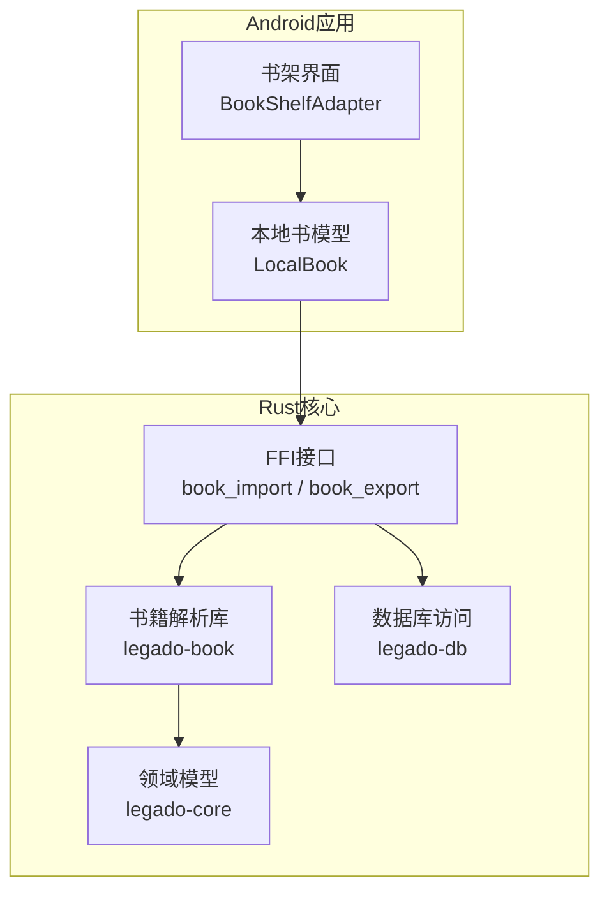
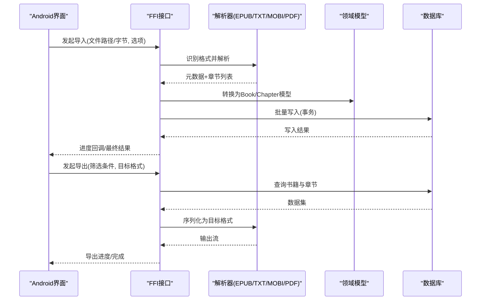
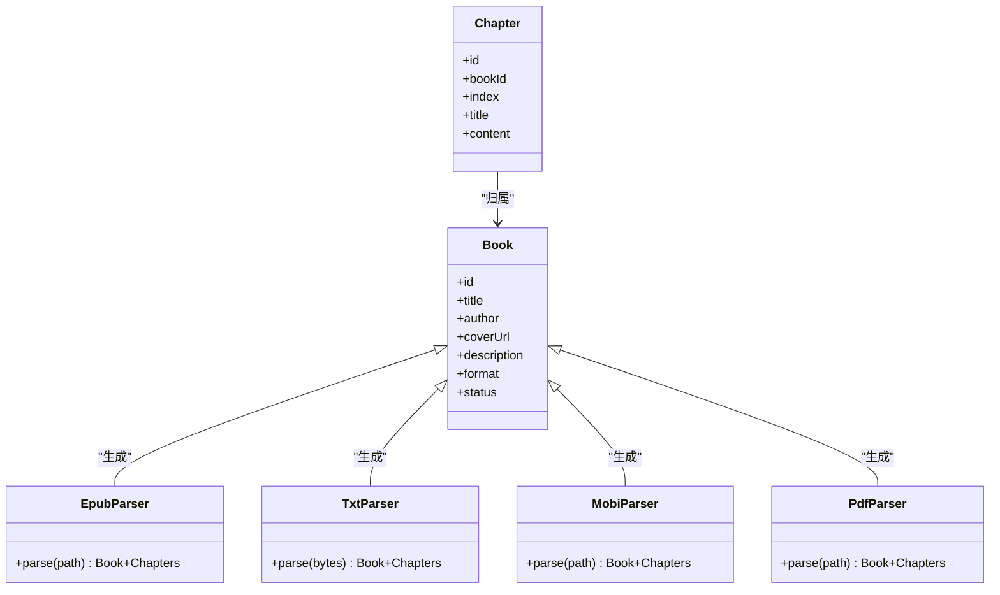
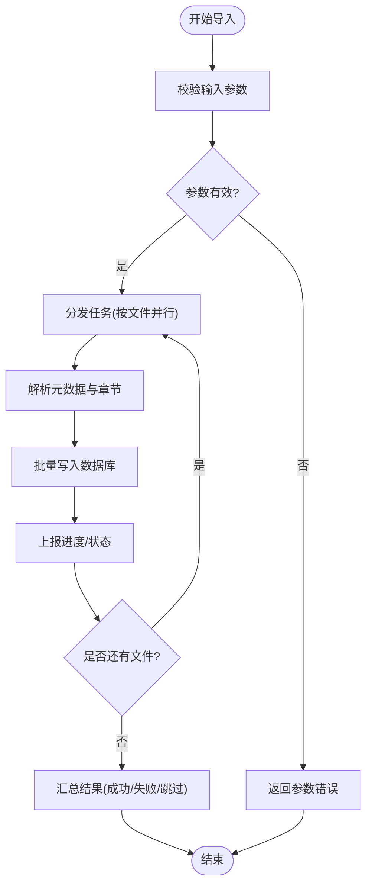
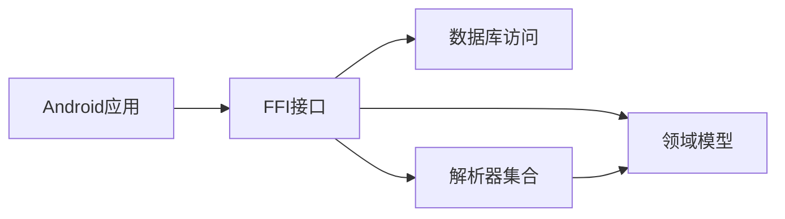

# 书籍导入导出

<cite>
**本文引用的文件**   
- [rust/legado-book/src/lib.rs](file://rust/legado-book/src/lib.rs)
- [rust/legado-book/src/epub.rs](file://rust/legado-book/src/epub.rs)
- [rust/legado-book/src/txt.rs](file://rust/legado-book/src/txt.rs)
- [rust/legado-book/src/mobi.rs](file://rust/legado-book/src/mobi.rs)
- [rust/legado-book/src/pdf.rs](file://rust/legado-book/src/pdf.rs)
- [rust/legado-book/src/export.rs](file://rust/legado-book/src/export.rs)
- [rust/legado-ffi/src/api/book_import.rs](file://rust/legado-ffi/src/api/book_import.rs)
- [rust/legado-ffi/src/api/book_export.rs](file://rust/legado-ffi/src/api/book_export.rs)
- [rust/legado-core/src/models/book.rs](file://rust/legado-core/src/models/book.rs)
- [rust/legado-core/src/models/book_chapter.rs](file://rust/legado-core/src/models/book_chapter.rs)
- [rust/legado-db/src/import.rs](file://rust/legado-db/src/import.rs)
- [app/src/main/java/io/legado/app/model/localBook/LocalBook.kt](file://app/src/main/java/io/legado/app/model/localBook/LocalBook.kt)
- [app/src/main/java/io/legado/app/ui/book/shelf/adapter/BookShelfAdapter.kt](file://app/src/main/java/io/legado/app/ui/book/shelf/adapter/BookShelfAdapter.kt)
</cite>

## 目录
1. [简介](#简介)
2. [项目结构](#项目结构)
3. [核心组件](#核心组件)
4. [架构总览](#架构总览)
5. [详细组件分析](#详细组件分析)
6. [依赖关系分析](#依赖关系分析)
7. [性能考虑](#性能考虑)
8. [故障排查指南](#故障排查指南)
9. [结论](#结论)
10. [附录](#附录)

## 简介
本文件面向Legado项目的“书籍导入导出”能力，系统性说明支持的书籍格式（EPUB、TXT、MOBI、PDF等）的解析与处理逻辑，批量导入的并发控制与进度反馈机制，元数据提取与自动分类策略，以及导出的配置项与内容筛选。同时给出API使用示例思路、错误处理与重试方案，帮助开发者快速集成与扩展。

## 项目结构
本项目采用多模块分层设计：
- Rust层负责核心解析与导出（legado-book）、FFI桥接（legado-ffi）、领域模型（legado-core）、数据库访问（legado-db）。
- Android应用层提供UI与业务编排（app模块），通过Rust FFI调用底层能力。
- Web管理端位于modules/web，用于远程管理与调试。

图表来源 
- [rust/legado-ffi/src/api/book_import.rs](file://rust/legado-ffi/src/api/book_import.rs)
- [rust/legado-ffi/src/api/book_export.rs](file://rust/legado-ffi/src/api/book_export.rs)
- [rust/legado-book/src/lib.rs](file://rust/legado-book/src/lib.rs)
- [rust/legado-core/src/models/book.rs](file://rust/legado-core/src/models/book.rs)
- [rust/legado-db/src/import.rs](file://rust/legado-db/src/import.rs)
- [app/src/main/java/io/legado/app/ui/book/shelf/adapter/BookShelfAdapter.kt](file://app/src/main/java/io/legado/app/ui/book/shelf/adapter/BookShelfAdapter.kt)
- [app/src/main/java/io/legado/app/model/localBook/LocalBook.kt](file://app/src/main/java/io/legado/app/model/localBook/LocalBook.kt)

章节来源
- [rust/legado-book/src/lib.rs](file://rust/legado-book/src/lib.rs)
- [rust/legado-ffi/src/api/book_import.rs](file://rust/legado-ffi/src/api/book_import.rs)
- [rust/legado-ffi/src/api/book_export.rs](file://rust/legado-ffi/src/api/book_export.rs)
- [rust/legado-core/src/models/book.rs](file://rust/legado-core/src/models/book.rs)
- [rust/legado-db/src/import.rs](file://rust/legado-db/src/import.rs)
- [app/src/main/java/io/legado/app/model/localBook/LocalBook.kt](file://app/src/main/java/io/legado/app/model/localBook/LocalBook.kt)
- [app/src/main/java/io/legado/app/ui/book/shelf/adapter/BookShelfAdapter.kt](file://app/src/main/java/io/legado/app/ui/book/shelf/adapter/BookShelfAdapter.kt)

## 核心组件
- 书籍解析器（legado-book）：针对EPUB、TXT、MOBI、PDF等格式实现元数据与目录/正文抽取。
- FFI接口（legado-ffi）：暴露统一的导入/导出API给上层调用，封装参数校验、并发调度与结果聚合。
- 领域模型（legado-core）：定义Book、Chapter等数据结构，贯穿解析、入库与导出流程。
- 数据库访问（legado-db）：提供批量写入、事务与导入状态持久化。
- Android模型与UI（app）：LocalBook映射到本地实体，书架适配器驱动导入任务与进度展示。

章节来源
- [rust/legado-book/src/epub.rs](file://rust/legado-book/src/epub.rs)
- [rust/legado-book/src/txt.rs](file://rust/legado-book/src/txt.rs)
- [rust/legado-book/src/mobi.rs](file://rust/legado-book/src/mobi.rs)
- [rust/legado-book/src/pdf.rs](file://rust/legado-book/src/pdf.rs)
- [rust/legado-core/src/models/book.rs](file://rust/legado-core/src/models/book.rs)
- [rust/legado-core/src/models/book_chapter.rs](file://rust/legado-core/src/models/book_chapter.rs)
- [rust/legado-db/src/import.rs](file://rust/legado-db/src/import.rs)
- [app/src/main/java/io/legado/app/model/localBook/LocalBook.kt](file://app/src/main/java/io/legado/app/model/localBook/LocalBook.kt)

## 架构总览
导入导出整体流程如下：
- 导入：上层发起导入请求 → FFI接收并校验参数 → 选择对应解析器 → 提取元数据与章节 → 批量写入数据库 → 返回统计与进度事件。
- 导出：上层发起导出请求 → FFI根据筛选条件查询书籍与章节 → 按目标格式序列化输出 → 流式写出文件。

图表来源 
- [rust/legado-ffi/src/api/book_import.rs](file://rust/legado-ffi/src/api/book_import.rs)
- [rust/legado-ffi/src/api/book_export.rs](file://rust/legado-ffi/src/api/book_export.rs)
- [rust/legado-book/src/lib.rs](file://rust/legado-book/src/lib.rs)
- [rust/legado-core/src/models/book.rs](file://rust/legado-core/src/models/book.rs)
- [rust/legado-db/src/import.rs](file://rust/legado-db/src/import.rs)

## 详细组件分析

### 支持格式与解析逻辑
- EPUB：解析OPF元数据、目录导航与内容HTML；支持封面图片提取与章节拆分。
- TXT：基于规则或启发式方法切分章节，尝试从头部注释或标题行推断书名/作者。
- MOBI：解析元数据与目录树，兼容常见Kindle格式变体。
- PDF：优先提取文本与书签；若不可用则回退为按页切分或提示用户转换。

图表来源 
- [rust/legado-core/src/models/book.rs](file://rust/legado-core/src/models/book.rs)
- [rust/legado-core/src/models/book_chapter.rs](file://rust/legado-core/src/models/book_chapter.rs)
- [rust/legado-book/src/epub.rs](file://rust/legado-book/src/epub.rs)
- [rust/legado-book/src/txt.rs](file://rust/legado-book/src/txt.rs)
- [rust/legado-book/src/mobi.rs](file://rust/legado-book/src/mobi.rs)
- [rust/legado-book/src/pdf.rs](file://rust/legado-book/src/pdf.rs)

章节来源
- [rust/legado-book/src/epub.rs](file://rust/legado-book/src/epub.rs)
- [rust/legado-book/src/txt.rs](file://rust/legado-book/src/txt.rs)
- [rust/legado-book/src/mobi.rs](file://rust/legado-book/src/mobi.rs)
- [rust/legado-book/src/pdf.rs](file://rust/legado-book/src/pdf.rs)
- [rust/legado-core/src/models/book.rs](file://rust/legado-core/src/models/book.rs)
- [rust/legado-core/src/models/book_chapter.rs](file://rust/legado-core/src/models/book_chapter.rs)

### 批量导入并发与进度反馈
- 并发策略：按文件粒度并行解析，内部对每个文件的章节写入采用批大小限制与线程池限流，避免内存峰值过高。
- 进度反馈：通过回调上报已处理数量、当前文件、解析耗时与失败原因；支持暂停/取消。
- 容错：单个文件失败不影响其他文件；汇总时记录失败清单与重试建议。

图表来源 
- [rust/legado-ffi/src/api/book_import.rs](file://rust/legado-ffi/src/api/book_import.rs)
- [rust/legado-db/src/import.rs](file://rust/legado-db/src/import.rs)

章节来源
- [rust/legado-ffi/src/api/book_import.rs](file://rust/legado-ffi/src/api/book_import.rs)
- [rust/legado-db/src/import.rs](file://rust/legado-db/src/import.rs)

### 元数据提取与自动分类
- 元数据来源：文件头信息、内嵌元数据（如EPUB OPF、MOBI头部）、文件名启发式规则。
- 自动分类：基于标签/关键词匹配、作者/出版社规则、阅读时长与收藏行为进行归类。
- 冲突处理：同名书籍去重策略（按ISBN/MD5/URL），保留最新或合并章节。

章节来源
- [rust/legado-core/src/models/book.rs](file://rust/legado-core/src/models/book.rs)
- [rust/legado-core/src/models/book_chapter.rs](file://rust/legado-core/src/models/book_chapter.rs)

### 导出功能与配置选项
- 目标格式：支持导出为EPUB、TXT、MOBI、PDF等（取决于解析器反向序列化能力）。
- 内容筛选：按书名、作者、标签、分组、时间范围、阅读状态过滤。
- 输出选项：是否包含封面、目录、正文、注释；压缩级别与编码设置。
- 流式输出：大文件采用流式写入，降低内存占用。

章节来源
- [rust/legado-book/src/export.rs](file://rust/legado-book/src/export.rs)
- [rust/legado-ffi/src/api/book_export.rs](file://rust/legado-ffi/src/api/book_export.rs)

### API使用示例（思路）
- 导入API
  - 输入：文件路径或字节数组、解析选项（是否覆盖、是否提取封面、并发数）。
  - 输出：进度事件流、最终统计（成功/失败/跳过）、失败详情。
  - 错误处理：参数校验失败、格式不支持、IO异常、数据库写入失败；支持重试指定文件。
- 导出API
  - 输入：筛选条件、目标格式、输出路径或流、压缩与编码选项。
  - 输出：进度事件、最终文件大小与路径。
  - 错误处理：无权限、磁盘空间不足、序列化失败；支持断点续写。

章节来源
- [rust/legado-ffi/src/api/book_import.rs](file://rust/legado-ffi/src/api/book_import.rs)
- [rust/legado-ffi/src/api/book_export.rs](file://rust/legado-ffi/src/api/book_export.rs)

## 依赖关系分析
- Android层依赖Rust FFI提供的导入导出接口。
- Rust核心层依赖领域模型与数据库访问层。
- 解析器之间相互独立，便于扩展新格式。

图表来源 
- [rust/legado-ffi/src/api/book_import.rs](file://rust/legado-ffi/src/api/book_import.rs)
- [rust/legado-ffi/src/api/book_export.rs](file://rust/legado-ffi/src/api/book_export.rs)
- [rust/legado-core/src/models/book.rs](file://rust/legado-core/src/models/book.rs)
- [rust/legado-db/src/import.rs](file://rust/legado-db/src/import.rs)

章节来源
- [rust/legado-ffi/src/api/book_import.rs](file://rust/legado-ffi/src/api/book_import.rs)
- [rust/legado-ffi/src/api/book_export.rs](file://rust/legado-ffi/src/api/book_export.rs)
- [rust/legado-core/src/models/book.rs](file://rust/legado-core/src/models/book.rs)
- [rust/legado-db/src/import.rs](file://rust/legado-db/src/import.rs)

## 性能考虑
- 解析阶段：对大文件采用流式读取，避免一次性加载；对PDF优先走书签与索引路径。
- 写入阶段：批量插入与事务边界控制，减少锁竞争；章节内容可异步压缩。
- 并发控制：限制线程池大小，防止CPU/IO争用；按文件大小动态调整批大小。
- 内存管理：及时释放临时对象，避免GC抖动；导出时使用零拷贝或缓冲复用。

[本节为通用指导，不直接分析具体文件]

## 故障排查指南
- 常见问题
  - 格式不支持：检查解析器注册与文件后缀/魔数识别。
  - 解析失败：查看日志中的章节切分规则与元数据字段缺失。
  - 写入失败：确认数据库连接、事务回滚与唯一键冲突。
  - 导出失败：检查磁盘空间、权限与序列化配置。
- 定位手段
  - 启用详细日志，记录每步耗时与失败堆栈。
  - 使用最小复现样本，逐步缩小问题范围。
  - 通过进度回调观察卡点位置。

章节来源
- [rust/legado-ffi/src/api/book_import.rs](file://rust/legado-ffi/src/api/book_import.rs)
- [rust/legado-ffi/src/api/book_export.rs](file://rust/legado-ffi/src/api/book_export.rs)
- [rust/legado-db/src/import.rs](file://rust/legado-db/src/import.rs)

## 结论
Legado的书籍导入导出体系以Rust为核心，具备高可靠、高性能与可扩展性。通过清晰的模块划分与FFI边界，上层Android应用可以便捷地调用导入导出能力，并在并发、进度与错误处理方面获得良好体验。未来可继续扩展更多格式与智能分类策略，提升用户体验。

[本节为总结，不直接分析具体文件]

## 附录
- 术语
  - 元数据：书名、作者、封面、描述、标签等。
  - 章节：按目录或启发式规则切分的正文片段。
  - 并发：多线程并行处理以提升吞吐。
- 最佳实践
  - 合理设置并发与批大小，平衡吞吐与资源占用。
  - 对失败任务提供重试与隔离，避免级联失败。
  - 导出前进行数据校验，确保一致性。

[本节为补充信息，不直接分析具体文件]