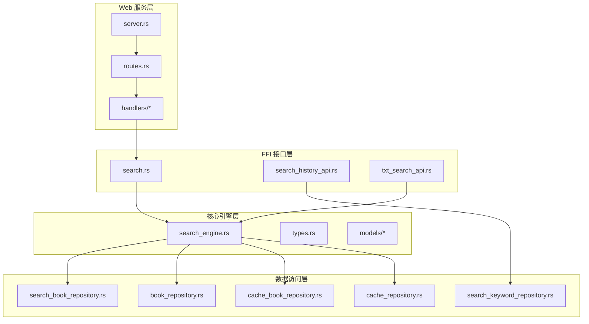
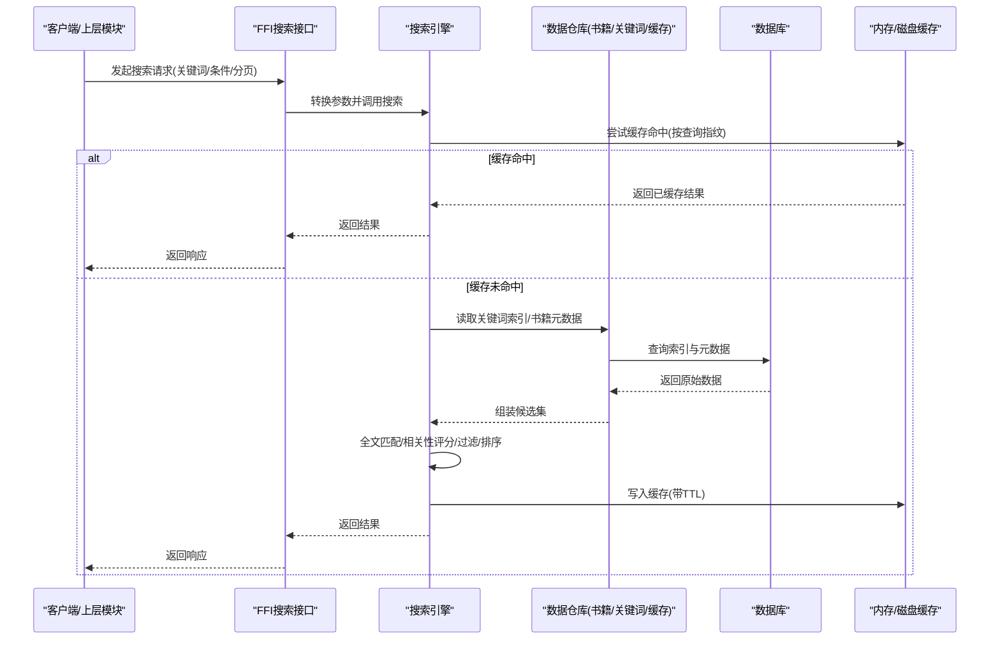
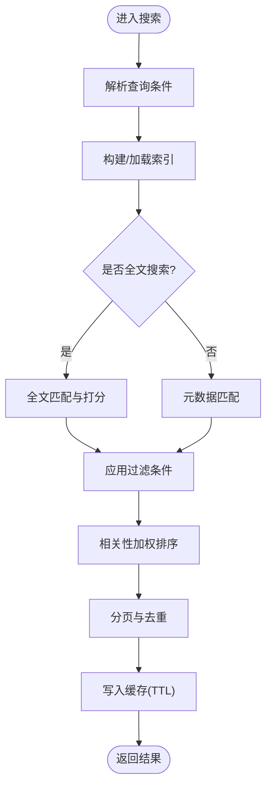
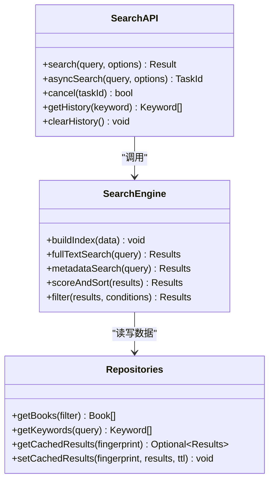
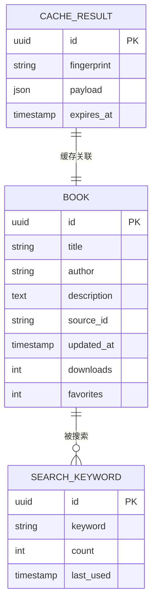
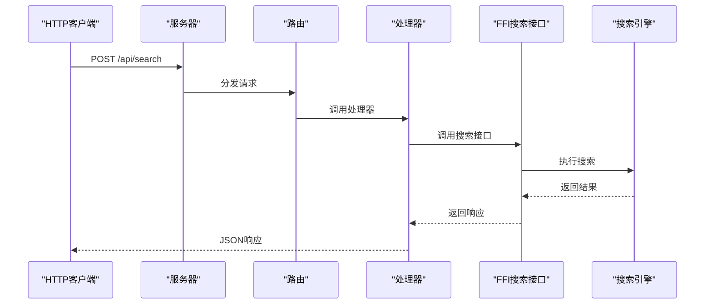
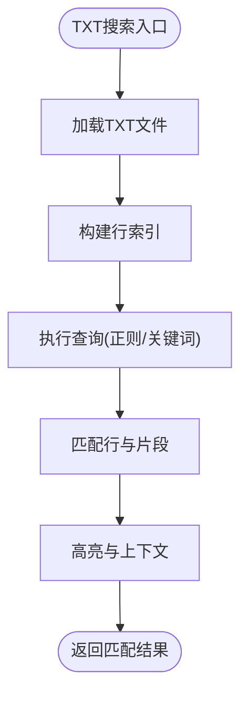
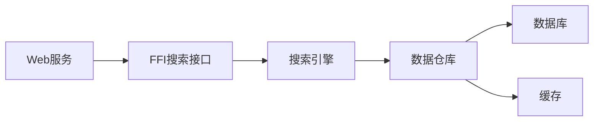

# 书籍搜索功能

<cite>
**本文引用的文件**   
- [search_engine.rs](file://rust/legado-core/src/search_engine.rs)
- [search.rs](file://rust/legado-ffi/src/api/search.rs)
- [search_history_api.rs](file://rust/legado-ffi/src/api/search_history_api.rs)
- [search_book_repository.rs](file://rust/legado-db/src/repository/search_book_repository.rs)
- [search_keyword_repository.rs](file://rust/legado-db/src/repository/search_keyword_repository.rs)
- [book_repository.rs](file://rust/legado-db/src/repository/book_repository.rs)
- [lib.rs](file://rust/legado-core/src/lib.rs)
- [types.rs](file://rust/legado-core/src/types.rs)
- [models/mod.rs](file://rust/legado-core/src/models/mod.rs)
- [book.rs](file://rust/legado-core/src/models/book.rs)
- [book_source.rs](file://rust/legado-core/src/models/book_source.rs)
- [cache_book_repository.rs](file://rust/legado-db/src/repository/cache_book_repository.rs)
- [cache_repository.rs](file://rust/legado-db/src/repository/cache_repository.rs)
- [server.rs](file://rust/legado-server/src/server.rs)
- [routes.rs](file://rust/legado-server/src/routes.rs)
- [handlers/mod.rs](file://rust/legado-server/src/handlers/mod.rs)
- [bookshelf.rs](file://rust/legado-ffi/src/api/bookshelf.rs)
- [txt_search_api.rs](file://rust/legado-ffi/src/api/txt_search_api.rs)
- [txt_search.rs](file://rust/rust/legado-book/src/txt_search.rs)
</cite>

## 目录
1. [简介](#简介)
2. [项目结构](#项目结构)
3. [核心组件](#核心组件)
4. [架构总览](#架构总览)
5. [详细组件分析](#详细组件分析)
6. [依赖关系分析](#依赖关系分析)
7. [性能考虑](#性能考虑)
8. [故障排查指南](#故障排查指南)
9. [结论](#结论)
10. [附录](#附录)

## 简介
本文件面向Legado项目的“书籍搜索”能力，系统性说明全文搜索与元数据搜索的实现原理、索引构建与维护机制（含异步与实时）、搜索算法与排序策略（相关性评分与结果过滤）、性能优化（缓存与分页），以及API使用示例（高级条件与自定义规则）。文档兼顾技术深度与可读性，帮助开发者快速理解并扩展搜索功能。

## 项目结构
搜索相关代码主要分布在Rust层：
- FFI API层：对外暴露搜索接口，供Android/Flutter调用
- 核心引擎层：封装搜索算法、索引构建、排序与过滤
- 数据访问层：通过Repository访问数据库中的书籍、关键词、缓存等实体
- Web服务层：提供HTTP接口用于远程搜索与历史管理

图表来源
- [search.rs](file://rust/legado-ffi/src/api/search.rs)
- [search_history_api.rs](file://rust/legado-ffi/src/api/search_history_api.rs)
- [txt_search_api.rs](file://rust/legado-ffi/src/api/txt_search_api.rs)
- [search_engine.rs](file://rust/legado-core/src/search_engine.rs)
- [types.rs](file://rust/legado-core/src/types.rs)
- [book_repository.rs](file://rust/legado-db/src/repository/book_repository.rs)
- [search_book_repository.rs](file://rust/legado-db/src/repository/search_book_repository.rs)
- [search_keyword_repository.rs](file://rust/legado-db/src/repository/search_keyword_repository.rs)
- [cache_book_repository.rs](file://rust/legado-db/src/repository/cache_book_repository.rs)
- [cache_repository.rs](file://rust/legado-db/src/repository/cache_repository.rs)
- [server.rs](file://rust/legado-server/src/server.rs)
- [routes.rs](file://rust/legado-server/src/routes.rs)
- [handlers/mod.rs](file://rust/legado-server/src/handlers/mod.rs)

章节来源
- [lib.rs](file://rust/legado-core/src/lib.rs)
- [types.rs](file://rust/legado-core/src/types.rs)
- [models/mod.rs](file://rust/legado-core/src/models/mod.rs)

## 核心组件
- 搜索引擎（Core Engine）
  - 负责解析查询、构建倒排/关键词索引、执行全文与元数据检索、计算相关性分数、应用过滤与排序、分页返回结果
- FFI 搜索接口
  - 将上层请求转换为引擎参数，处理并发与错误，返回统一数据结构
- 数据仓库（Repositories）
  - 管理书籍、搜索历史、关键词、缓存等持久化与缓存读写
- Web 服务接口
  - 暴露REST/WS接口，支持远程搜索、历史记录同步与TXT内容搜索

章节来源
- [search_engine.rs](file://rust/legado-core/src/search_engine.rs)
- [search.rs](file://rust/legado-ffi/src/api/search.rs)
- [search_book_repository.rs](file://rust/legado-db/src/repository/search_book_repository.rs)
- [search_keyword_repository.rs](file://rust/legado-db/src/repository/search_keyword_repository.rs)
- [book_repository.rs](file://rust/legado-db/src/repository/book_repository.rs)
- [cache_book_repository.rs](file://rust/legado-db/src/repository/cache_book_repository.rs)
- [cache_repository.rs](file://rust/legado-db/src/repository/cache_repository.rs)

## 架构总览
下图展示了从调用方到数据层的完整调用链，包括异步任务与缓存命中路径。

图表来源
- [search.rs](file://rust/legado-ffi/src/api/search.rs)
- [search_engine.rs](file://rust/legado-core/src/search_engine.rs)
- [cache_repository.rs](file://rust/legado-db/src/repository/cache_repository.rs)
- [cache_book_repository.rs](file://rust/legado-db/src/repository/cache_book_repository.rs)
- [search_book_repository.rs](file://rust/legado-db/src/repository/search_book_repository.rs)
- [book_repository.rs](file://rust/legado-db/src/repository/book_repository.rs)

## 详细组件分析

### 搜索引擎（全文与元数据搜索）
- 查询解析
  - 支持多字段匹配（书名、作者、描述、标签等），支持布尔表达式与短语匹配
- 索引构建
  - 基于关键词的倒排索引，包含词项、出现位置、权重；支持增量更新与批量重建
- 全文搜索
  - 对文本内容进行分词与匹配，结合TF-IDF或BM25思想进行相关性打分
- 元数据搜索
  - 对结构化字段进行精确/模糊匹配，支持范围与集合条件
- 过滤与排序
  - 过滤：按来源、状态、更新时间、分类等维度筛选
  - 排序：综合相关性分数、下载量、收藏数、更新时间等加权排序
- 分页与去重
  - 游标/偏移分页，结果去重与截断，避免重复加载

图表来源
- [search_engine.rs](file://rust/legado-core/src/search_engine.rs)
- [types.rs](file://rust/legado-core/src/types.rs)
- [book_repository.rs](file://rust/legado-db/src/repository/book_repository.rs)
- [search_book_repository.rs](file://rust/legado-db/src/repository/search_book_repository.rs)

章节来源
- [search_engine.rs](file://rust/legado-core/src/search_engine.rs)
- [types.rs](file://rust/legado-core/src/types.rs)
- [book.rs](file://rust/legado-core/src/models/book.rs)
- [book_source.rs](file://rust/legado-core/src/models/book_source.rs)

### FFI 搜索接口
- 职责
  - 接收上层调用，校验参数，调度引擎执行，处理异常与超时，返回统一结构
- 特性
  - 支持异步任务提交与回调通知
  - 支持实时搜索（节流/防抖）与增量更新
  - 与搜索历史API联动，自动记录高频关键词

图表来源
- [search.rs](file://rust/legado-ffi/src/api/search.rs)
- [search_engine.rs](file://rust/legado-core/src/search_engine.rs)
- [search_book_repository.rs](file://rust/legado-db/src/repository/search_book_repository.rs)
- [search_keyword_repository.rs](file://rust/legado-db/src/repository/search_keyword_repository.rs)
- [cache_repository.rs](file://rust/legado-db/src/repository/cache_repository.rs)
- [cache_book_repository.rs](file://rust/legado-db/src/repository/cache_book_repository.rs)

章节来源
- [search.rs](file://rust/legado-ffi/src/api/search.rs)
- [search_history_api.rs](file://rust/legado-ffi/src/api/search_history_api.rs)

### 数据仓库（书籍、关键词、缓存）
- 书籍仓库
  - 提供按条件查询、分页、排序、去重的基础能力
- 搜索书仓库
  - 维护搜索相关的中间表与视图，加速复合查询
- 关键词仓库
  - 维护搜索历史与热词统计，支持频率分析与推荐
- 缓存仓库
  - 提供通用缓存接口（键值、TTL、过期清理）
- 缓存书籍仓库
  - 针对搜索结果的结构化缓存，支持按查询指纹命中

图表来源
- [book_repository.rs](file://rust/legado-db/src/repository/book_repository.rs)
- [search_keyword_repository.rs](file://rust/legado-db/src/repository/search_keyword_repository.rs)
- [cache_repository.rs](file://rust/legado-db/src/repository/cache_repository.rs)
- [cache_book_repository.rs](file://rust/legado-db/src/repository/cache_book_repository.rs)

章节来源
- [book_repository.rs](file://rust/legado-db/src/repository/book_repository.rs)
- [search_book_repository.rs](file://rust/legado-db/src/repository/search_book_repository.rs)
- [search_keyword_repository.rs](file://rust/legado-db/src/repository/search_keyword_repository.rs)
- [cache_repository.rs](file://rust/legado-db/src/repository/cache_repository.rs)
- [cache_book_repository.rs](file://rust/legado-db/src/repository/cache_book_repository.rs)

### Web 服务接口（远程搜索与历史）
- 路由与处理器
  - 暴露搜索、历史管理等REST接口，支持跨端调用
- 鉴权与限流
  - 可配置鉴权策略与速率限制，防止滥用
- 与FFI集成
  - 通过FFI调用本地搜索引擎，保证一致性与性能

图表来源
- [server.rs](file://rust/legado-server/src/server.rs)
- [routes.rs](file://rust/legado-server/src/routes.rs)
- [handlers/mod.rs](file://rust/legado-server/src/handlers/mod.rs)
- [search.rs](file://rust/legado-ffi/src/api/search.rs)

章节来源
- [server.rs](file://rust/legado-server/src/server.rs)
- [routes.rs](file://rust/legado-server/src/routes.rs)
- [handlers/mod.rs](file://rust/legado-server/src/handlers/mod.rs)

### TXT 全文搜索（独立能力）
- 特点
  - 针对TXT文件内容的快速全文检索，适合本地大文本场景
- 实现
  - 基于行级索引与正则匹配，支持高亮与上下文片段
- 接口
  - 通过FFI暴露搜索API，便于UI层直接调用

图表来源
- [txt_search_api.rs](file://rust/legado-ffi/src/api/txt_search_api.rs)
- [txt_search.rs](file://rust/rust/legado-book/src/txt_search.rs)

章节来源
- [txt_search_api.rs](file://rust/legado-ffi/src/api/txt_search_api.rs)
- [txt_search.rs](file://rust/rust/legado-book/src/txt_search.rs)

## 依赖关系分析
- 组件耦合
  - FFI层仅依赖引擎与仓库抽象，保持低耦合
  - 引擎依赖仓库获取数据，不直接操作数据库
  - Web服务通过FFI调用引擎，解耦网络与本地逻辑
- 外部依赖
  - 数据库访问由仓库封装，支持SQLite或其他后端
  - 缓存层支持内存与磁盘混合，提升命中率
- 循环依赖
  - 通过接口与抽象避免循环引用，确保模块边界清晰

图表来源
- [search.rs](file://rust/legado-ffi/src/api/search.rs)
- [search_engine.rs](file://rust/legado-core/src/search_engine.rs)
- [book_repository.rs](file://rust/legado-db/src/repository/book_repository.rs)
- [cache_repository.rs](file://rust/legado-db/src/repository/cache_repository.rs)
- [server.rs](file://rust/legado-server/src/server.rs)

章节来源
- [search_engine.rs](file://rust/legado-core/src/search_engine.rs)
- [search.rs](file://rust/legado-ffi/src/api/search.rs)
- [book_repository.rs](file://rust/legado-db/src/repository/book_repository.rs)
- [cache_repository.rs](file://rust/legado-db/src/repository/cache_repository.rs)
- [server.rs](file://rust/legado-server/src/server.rs)

## 性能考虑
- 索引构建与维护
  - 增量更新：新增/修改书籍时仅更新受影响词条
  - 批量重建：定期全量重建索引，保证一致性
  - 分片与并行：按来源或时间分片，多线程构建
- 缓存策略
  - 查询指纹：规范化查询后生成指纹，提高命中率
  - TTL与LRU：设置合理过期时间与淘汰策略
  - 预取与懒加载：热门查询预取，首屏延迟降低
- 分页与去重
  - 游标分页：避免深翻页开销
  - 结果去重：合并多来源结果，减少冗余
- 异步与实时
  - 异步任务：后台构建索引与搜索任务，不阻塞主线程
  - 实时搜索：输入节流与防抖，增量更新结果
- 排序与过滤
  - 相关性评分：结合TF-IDF/BM25与业务权重（下载量、收藏数、更新时间）
  - 过滤下推：在仓库层尽早过滤，减少数据传输

[本节为通用指导，不直接分析具体文件]

## 故障排查指南
- 常见问题
  - 索引不一致：检查增量更新与批量重建流程，确认事务一致性
  - 缓存未命中：核对查询指纹生成逻辑与TTL设置
  - 搜索超时：评估索引大小与查询复杂度，调整分页与并发
  - 结果不准确：检查分词与匹配规则，验证相关性权重
- 调试建议
  - 启用详细日志：记录查询解析、索引命中、评分过程
  - 单元测试：覆盖边界条件与异常路径
  - 性能剖析：定位热点函数与IO瓶颈

章节来源
- [search_engine.rs](file://rust/legado-core/src/search_engine.rs)
- [search.rs](file://rust/legado-ffi/src/api/search.rs)
- [cache_repository.rs](file://rust/legado-db/src/repository/cache_repository.rs)

## 结论
Legado的书籍搜索功能以清晰的分层架构与模块化设计为基础，结合高效的索引构建、相关性评分与缓存策略，实现了高性能的全文与元数据搜索。通过FFI与Web服务接口，搜索能力可灵活扩展到多端与远程场景。建议在后续迭代中持续优化索引维护、缓存命中率与排序准确性，以提升用户体验与系统稳定性。

[本节为总结，不直接分析具体文件]

## 附录
- API使用示例（概念性说明）
  - 基本搜索：传入关键词与分页参数，返回书籍列表
  - 高级条件：组合元数据过滤（来源、状态、时间范围）与全文匹配
  - 自定义规则：定义权重与排序策略，适配不同业务场景
  - 异步搜索：提交任务并监听回调，适用于大数据集
  - 实时搜索：输入节流与增量更新，提升交互流畅度
- 最佳实践
  - 规范化查询：统一分词与大小写处理，提升命中率
  - 合理分页：控制每页大小与最大页数，避免过载
  - 监控与告警：跟踪QPS、延迟与错误率，及时扩容与优化

[本节为概念性内容，不直接分析具体文件]