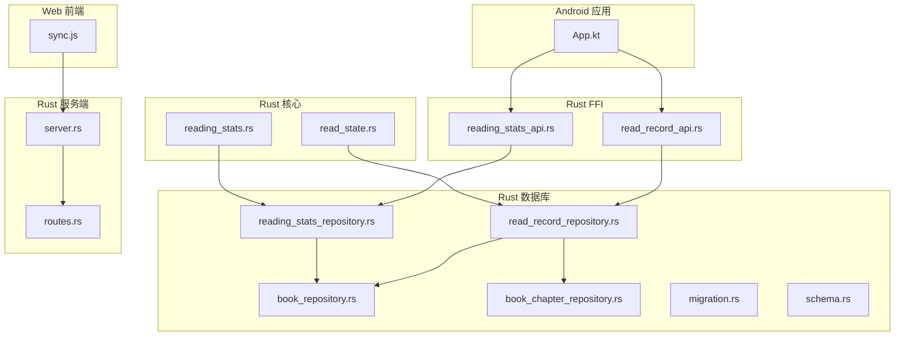
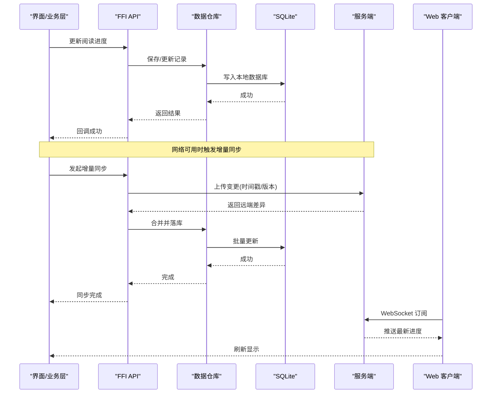
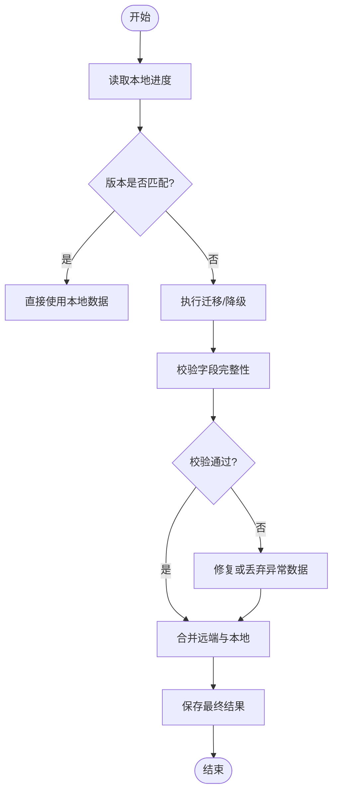
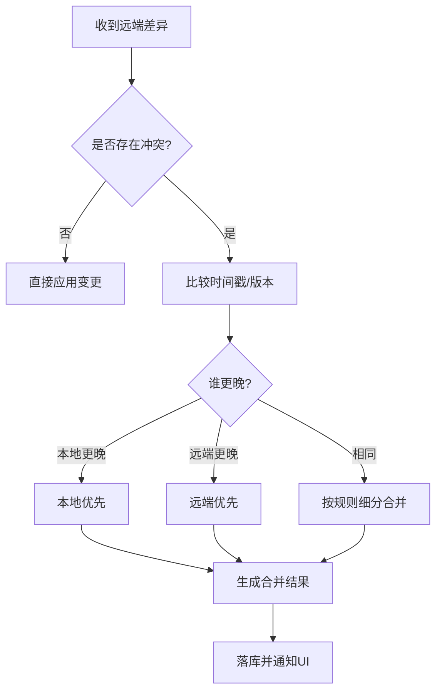
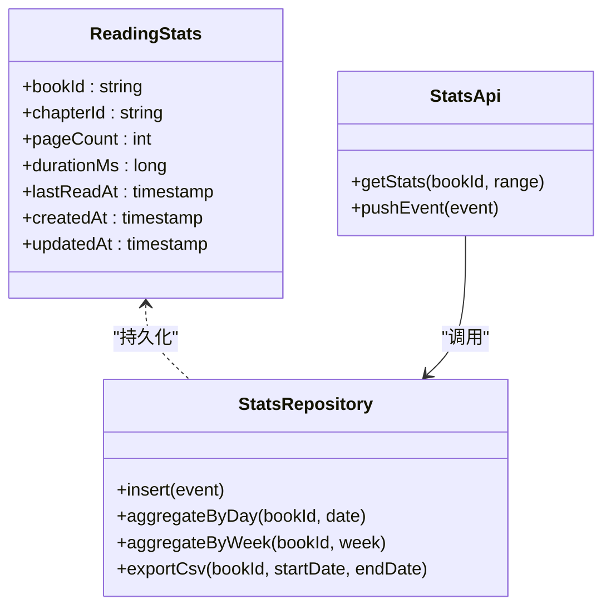
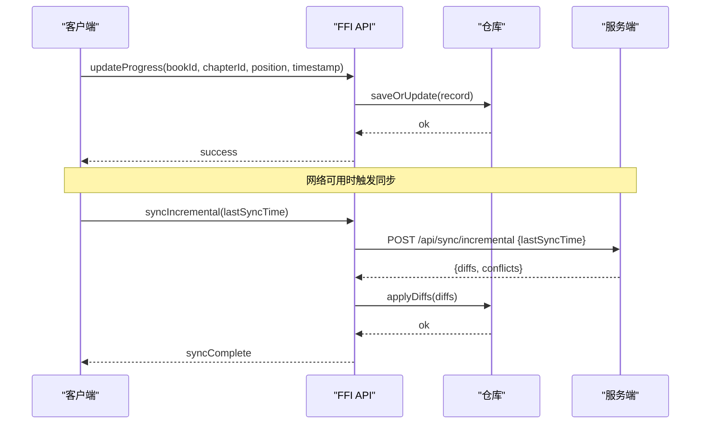
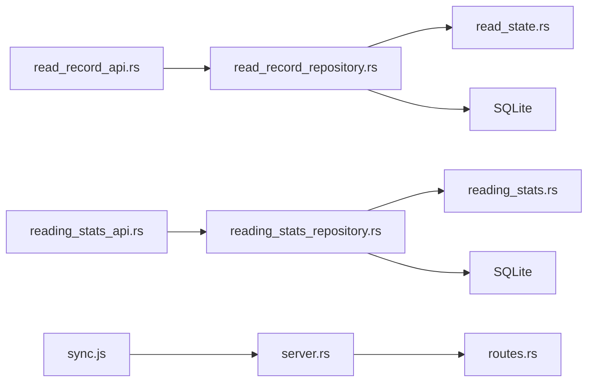

# 阅读进度同步

<cite>
**本文引用的文件**   
- [read_state.rs](file://rust/legado-core/src/read_state.rs)
- [reading_stats.rs](file://rust/legado-core/src/reading_stats.rs)
- [read_record_repository.rs](file://rust/legado-db/src/repository/read_record_repository.rs)
- [reading_stats_repository.rs](file://rust/legado-db/src/repository/reading_stats_repository.rs)
- [book_repository.rs](file://rust/legado-db/src/repository/book_repository.rs)
- [book_chapter_repository.rs](file://rust/legado-db/src/repository/book_chapter_repository.rs)
- [migration.rs](file://rust/legado-db/src/migration.rs)
- [schema.rs](file://rust/legado-db/src/schema.rs)
- [read_record_api.rs](file://rust/legado-ffi/src/api/read_record_api.rs)
- [reading_stats_api.rs](file://rust/legado-ffi/src/api/reading_stats_api.rs)
- [server.rs](file://rust/legado-server/src/server.rs)
- [routes.rs](file://rust/legado-server/src/routes.rs)
- [sync.js](file://modules/web/public/scripts/sync.js)
- [App.kt](file://app/src/main/java/io/legado/app/App.kt)
</cite>

## 目录
1. [简介](#简介)
2. [项目结构](#项目结构)
3. [核心组件](#核心组件)
4. [架构总览](#架构总览)
5. [详细组件分析](#详细组件分析)
6. [依赖分析](#依赖分析)
7. [性能考虑](#性能考虑)
8. [故障排查指南](#故障排查指南)
9. [结论](#结论)
10. [附录](#附录)

## 简介
本文件系统性阐述 Legado 的阅读进度与统计信息的本地存储、云端同步机制，以及多设备间的冲突检测与合并策略。内容涵盖：
- 进度数据的结构与版本兼容性处理
- 多设备同步策略（增量同步、离线支持、冲突检测与合并）
- 阅读统计信息的采集与展示
- API 使用示例（含离线与增量同步实现思路）

## 项目结构
Legado 在 Rust 层提供数据模型、仓库与 FFI API，Android 层负责应用初始化与集成，Web 端提供脚本辅助同步。关键路径如下：
- Rust 核心：read_state.rs、reading_stats.rs
- Rust 数据库：read_record_repository.rs、reading_stats_repository.rs、book_repository.rs、book_chapter_repository.rs、migration.rs、schema.rs
- Rust FFI：read_record_api.rs、reading_stats_api.rs
- Rust 服务端：server.rs、routes.rs
- Web 前端脚本：sync.js
- Android 入口：App.kt

**图表来源** 
- [App.kt](file://app/src/main/java/io/legado/app/App.kt)
- [read_state.rs](file://rust/legado-core/src/read_state.rs)
- [reading_stats.rs](file://rust/legado-core/src/reading_stats.rs)
- [read_record_repository.rs](file://rust/legado-db/src/repository/read_record_repository.rs)
- [reading_stats_repository.rs](file://rust/legado-db/src/repository/reading_stats_repository.rs)
- [book_repository.rs](file://rust/legado-db/src/repository/book_repository.rs)
- [book_chapter_repository.rs](file://rust/legado-db/src/repository/book_chapter_repository.rs)
- [migration.rs](file://rust/legado-db/src/migration.rs)
- [schema.rs](file://rust/legado-db/src/schema.rs)
- [read_record_api.rs](file://rust/legado-ffi/src/api/read_record_api.rs)
- [reading_stats_api.rs](file://rust/legado-ffi/src/api/reading_stats_api.rs)
- [server.rs](file://rust/legado-server/src/server.rs)
- [routes.rs](file://rust/legado-server/src/routes.rs)
- [sync.js](file://modules/web/public/scripts/sync.js)

**章节来源**
- [App.kt](file://app/src/main/java/io/legado/app/App.kt)
- [read_state.rs](file://rust/legado-core/src/read_state.rs)
- [reading_stats.rs](file://rust/legado-core/src/reading_stats.rs)
- [read_record_repository.rs](file://rust/legado-db/src/repository/read_record_repository.rs)
- [reading_stats_repository.rs](file://rust/legado-db/src/repository/reading_stats_repository.rs)
- [book_repository.rs](file://rust/legado-db/src/repository/book_repository.rs)
- [book_chapter_repository.rs](file://rust/legado-db/src/repository/book_chapter_repository.rs)
- [migration.rs](file://rust/legado-db/src/migration.rs)
- [schema.rs](file://rust/legado-db/src/schema.rs)
- [read_record_api.rs](file://rust/legado-ffi/src/api/read_record_api.rs)
- [reading_stats_api.rs](file://rust/legado-ffi/src/api/reading_stats_api.rs)
- [server.rs](file://rust/legado-server/src/server.rs)
- [routes.rs](file://rust/legado-server/src/routes.rs)
- [sync.js](file://modules/web/public/scripts/sync.js)

## 核心组件
- 阅读状态模型：定义阅读位置、翻页、时间戳等字段，用于记录单书阅读进度。
- 阅读统计模型：累计阅读时长、翻页次数、章节访问频次等指标。
- 数据仓库：对 SQLite 的读写封装，提供增删改查与批量操作接口。
- FFI API：暴露给 Android 层的函数，统一调用仓库逻辑。
- 服务端与路由：提供 HTTP/WebSocket 接口，支撑云端同步与实时推送。
- Web 同步脚本：在前端发起增量同步请求，处理冲突与合并。

**章节来源**
- [read_state.rs](file://rust/legado-core/src/read_state.rs)
- [reading_stats.rs](file://rust/legado-core/src/reading_stats.rs)
- [read_record_repository.rs](file://rust/legado-db/src/repository/read_record_repository.rs)
- [reading_stats_repository.rs](file://rust/legado-db/src/repository/reading_stats_repository.rs)
- [read_record_api.rs](file://rust/legado-ffi/src/api/read_record_api.rs)
- [reading_stats_api.rs](file://rust/legado-ffi/src/api/reading_stats_api.rs)
- [server.rs](file://rust/legado-server/src/server.rs)
- [routes.rs](file://rust/legado-server/src/routes.rs)
- [sync.js](file://modules/web/public/scripts/sync.js)

## 架构总览
整体采用“本地优先 + 增量同步”的架构：
- 本地优先：所有读取与写入首先落库，保证离线可用。
- 增量同步：通过时间戳或版本号识别变更，仅传输差异数据。
- 冲突合并：基于“最后写入胜出”或“按章节粒度合并”的策略解决冲突。
- 实时推送：WebSocket 通道用于跨设备即时更新。

**图表来源** 
- [read_record_api.rs](file://rust/legado-ffi/src/api/read_record_api.rs)
- [reading_stats_api.rs](file://rust/legado-ffi/src/api/reading_stats_api.rs)
- [read_record_repository.rs](file://rust/legado-db/src/repository/read_record_repository.rs)
- [reading_stats_repository.rs](file://rust/legado-db/src/repository/reading_stats_repository.rs)
- [server.rs](file://rust/legado-server/src/server.rs)
- [routes.rs](file://rust/legado-server/src/routes.rs)
- [sync.js](file://modules/web/public/scripts/sync.js)

## 详细组件分析

### 阅读进度数据结构与版本兼容
- 数据结构要点
  - 书籍标识：唯一 ID 或来源+URL 组合键
  - 章节信息：章节索引/ID、标题
  - 阅读位置：页码、滚动偏移、跳转锚点
  - 时间戳：最近更新时间、创建时间
  - 元数据：设备标识、客户端版本、扩展字段
- 版本兼容处理
  - 数据库迁移：通过 migration.rs 管理 schema 演进，确保旧版本数据可升级
  - 字段降级：新增字段设置默认值，缺失字段回退到安全值
  - 校验与修复：入库前进行合法性校验，异常数据标记并修复

**图表来源** 
- [migration.rs](file://rust/legado-db/src/migration.rs)
- [schema.rs](file://rust/legado-db/src/schema.rs)
- [read_record_repository.rs](file://rust/legado-db/src/repository/read_record_repository.rs)

**章节来源**
- [read_state.rs](file://rust/legado-core/src/read_state.rs)
- [migration.rs](file://rust/legado-db/src/migration.rs)
- [schema.rs](file://rust/legado-db/src/schema.rs)
- [read_record_repository.rs](file://rust/legado-db/src/repository/read_record_repository.rs)

### 多设备同步策略与冲突合并
- 增量同步
  - 客户端维护本地变更队列，包含时间戳或版本号
  - 服务端返回自上次同步以来的差异集
  - 客户端按顺序应用差异，避免重复与丢失
- 冲突检测
  - 同书同章存在多处修改时，比较时间戳或版本号
  - 若时间戳相同，结合设备标识与操作类型判定优先级
- 合并算法
  - 位置类字段：以“最后写入胜出”为主，必要时按章节粒度拆分合并
  - 统计类字段：累加或取最大值，避免覆盖导致失真
  - 元数据字段：保留最新有效值，忽略空值

**图表来源** 
- [read_record_repository.rs](file://rust/legado-db/src/repository/read_record_repository.rs)
- [reading_stats_repository.rs](file://rust/legado-db/src/repository/reading_stats_repository.rs)
- [sync.js](file://modules/web/public/scripts/sync.js)

**章节来源**
- [read_record_repository.rs](file://rust/legado-db/src/repository/read_record_repository.rs)
- [reading_stats_repository.rs](file://rust/legado-db/src/repository/reading_stats_repository.rs)
- [sync.js](file://modules/web/public/scripts/sync.js)

### 阅读统计信息的收集与展示
- 数据采集
  - 翻页事件：记录每次翻页的时间、章节、持续时间
  - 阅读时长：累计单次会话时长与历史总和
  - 章节热度：访问频次与停留时长
- 数据存储
  - 聚合表：按日/周/月维度汇总
  - 明细表：原始事件流水，便于回溯与分析
- 展示方式
  - 仪表盘：今日阅读时长、本周趋势、热门章节
  - 导出功能：CSV/JSON 导出，供外部工具分析

**图表来源** 
- [reading_stats.rs](file://rust/legado-core/src/reading_stats.rs)
- [reading_stats_repository.rs](file://rust/legado-db/src/repository/reading_stats_repository.rs)
- [reading_stats_api.rs](file://rust/legado-ffi/src/api/reading_stats_api.rs)

**章节来源**
- [reading_stats.rs](file://rust/legado-core/src/reading_stats.rs)
- [reading_stats_repository.rs](file://rust/legado-db/src/repository/reading_stats_repository.rs)
- [reading_stats_api.rs](file://rust/legado-ffi/src/api/reading_stats_api.rs)

### 进度同步 API 使用示例（离线支持与增量同步）
- 基本流程
  - 本地写入后立即返回成功，保证用户体验
  - 后台任务在网络可用时触发增量同步
  - 失败重试与指数退避，确保可靠性
- 增量同步
  - 客户端携带 lastSyncTime 或 version 参数
  - 服务端返回 diff 列表，包含新增、更新、删除
  - 客户端按序应用，遇到冲突走合并策略
- 离线支持
  - 未联网时缓存变更队列
  - 恢复连接后自动重放队列
  - 冲突时提示用户选择策略

**图表来源** 
- [read_record_api.rs](file://rust/legado-ffi/src/api/read_record_api.rs)
- [reading_stats_api.rs](file://rust/legado-ffi/src/api/reading_stats_api.rs)
- [server.rs](file://rust/legado-server/src/server.rs)
- [routes.rs](file://rust/legado-server/src/routes.rs)
- [sync.js](file://modules/web/public/scripts/sync.js)

**章节来源**
- [read_record_api.rs](file://rust/legado-ffi/src/api/read_record_api.rs)
- [reading_stats_api.rs](file://rust/legado-ffi/src/api/reading_stats_api.rs)
- [server.rs](file://rust/legado-server/src/server.rs)
- [routes.rs](file://rust/legado-server/src/routes.rs)
- [sync.js](file://modules/web/public/scripts/sync.js)

## 依赖分析
- 模块耦合
  - FFI 层依赖仓库层，仓库层依赖数据模型与服务端接口
  - 服务端与 Web 前端通过 HTTP/WebSocket 解耦
- 外部依赖
  - SQLite 作为本地存储后端
  - 网络库用于 HTTP 与 WebSocket 通信
- 潜在循环依赖
  - 仓库层不应直接依赖 FFI，避免反向耦合
  - 服务端与客户端通过协议契约隔离

**图表来源** 
- [read_record_api.rs](file://rust/legado-ffi/src/api/read_record_api.rs)
- [reading_stats_api.rs](file://rust/legado-ffi/src/api/reading_stats_api.rs)
- [read_record_repository.rs](file://rust/legado-db/src/repository/read_record_repository.rs)
- [reading_stats_repository.rs](file://rust/legado-db/src/repository/reading_stats_repository.rs)
- [read_state.rs](file://rust/legado-core/src/read_state.rs)
- [reading_stats.rs](file://rust/legado-core/src/reading_stats.rs)
- [server.rs](file://rust/legado-server/src/server.rs)
- [routes.rs](file://rust/legado-server/src/routes.rs)
- [sync.js](file://modules/web/public/scripts/sync.js)

**章节来源**
- [read_record_api.rs](file://rust/legado-ffi/src/api/read_record_api.rs)
- [reading_stats_api.rs](file://rust/legado-ffi/src/api/reading_stats_api.rs)
- [read_record_repository.rs](file://rust/legado-db/src/repository/read_record_repository.rs)
- [reading_stats_repository.rs](file://rust/legado-db/src/repository/reading_stats_repository.rs)
- [read_state.rs](file://rust/legado-core/src/read_state.rs)
- [reading_stats.rs](file://rust/legado-core/src/reading_stats.rs)
- [server.rs](file://rust/legado-server/src/server.rs)
- [routes.rs](file://rust/legado-server/src/routes.rs)
- [sync.js](file://modules/web/public/scripts/sync.js)

## 性能考虑
- 本地写入优化
  - 批量事务提交，减少磁盘 IO
  - 异步写入队列，避免阻塞主线程
- 增量同步优化
  - 差分压缩与分页拉取，降低带宽占用
  - 并发拉取不同书籍的差异，提升吞吐
- 冲突合并优化
  - 按章节粒度合并，减少全量替换开销
  - 预计算热点数据，加速展示

[本节为通用指导，不直接分析具体文件]

## 故障排查指南
- 常见问题
  - 同步失败：检查网络连接、服务端状态、认证令牌
  - 数据不一致：核对时间戳与版本号，确认合并策略
  - 性能问题：监控数据库锁、网络延迟、内存占用
- 调试建议
  - 启用详细日志，记录关键步骤与错误堆栈
  - 使用 Web 控制台观察 WebSocket 消息流
  - 导出本地数据库快照，对比远端差异

**章节来源**
- [read_record_repository.rs](file://rust/legado-db/src/repository/read_record_repository.rs)
- [reading_stats_repository.rs](file://rust/legado-db/src/repository/reading_stats_repository.rs)
- [server.rs](file://rust/legado-server/src/server.rs)
- [routes.rs](file://rust/legado-server/src/routes.rs)
- [sync.js](file://modules/web/public/scripts/sync.js)

## 结论
Legado 的阅读进度同步体系以本地优先为核心，结合增量同步与冲突合并，实现了稳定、高效的多设备一致性体验。通过清晰的模块分层与 API 设计，开发者可以便捷地扩展功能并优化性能。建议在后续迭代中持续完善统计分析与可视化能力，提升用户洞察与体验。

[本节为总结性内容，不直接分析具体文件]

## 附录
- 术语表
  - 增量同步：仅传输自上次同步以来的变更数据
  - 冲突合并：当同一数据被多处修改时，按策略决定最终值
  - 离线支持：无网络环境下仍可正常使用并缓存变更
- 参考路径
  - 数据模型：read_state.rs、reading_stats.rs
  - 仓库实现：read_record_repository.rs、reading_stats_repository.rs
  - FFI API：read_record_api.rs、reading_stats_api.rs
  - 服务端：server.rs、routes.rs
  - Web 脚本：sync.js
  - 数据库迁移：migration.rs、schema.rs

[本节为补充信息，不直接分析具体文件]