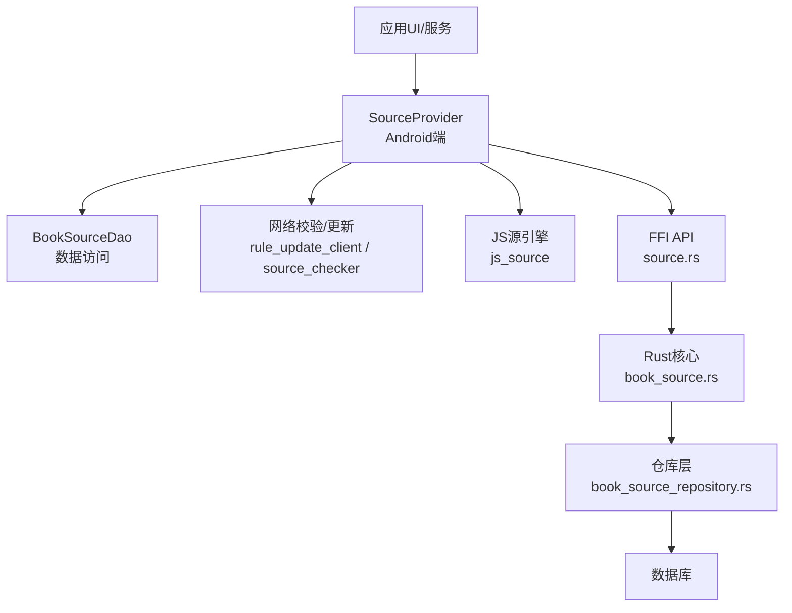
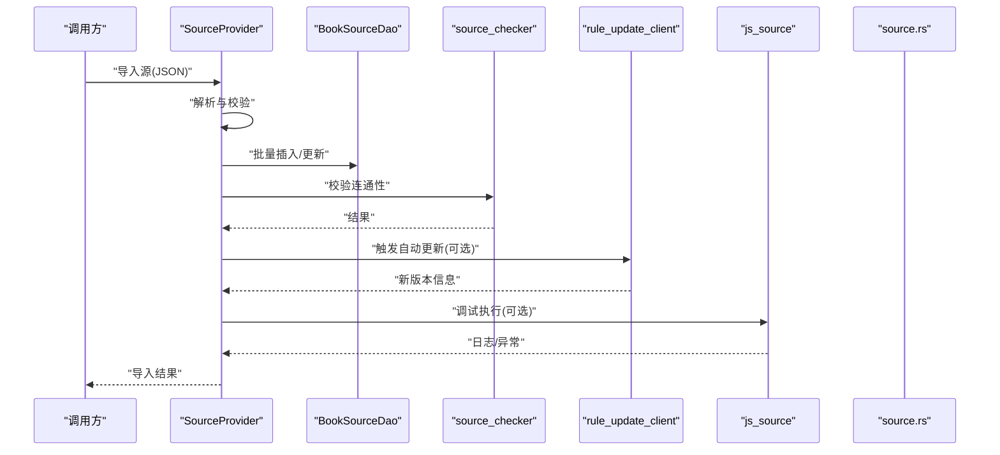
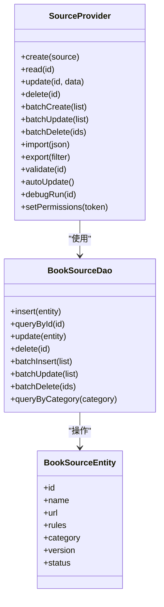
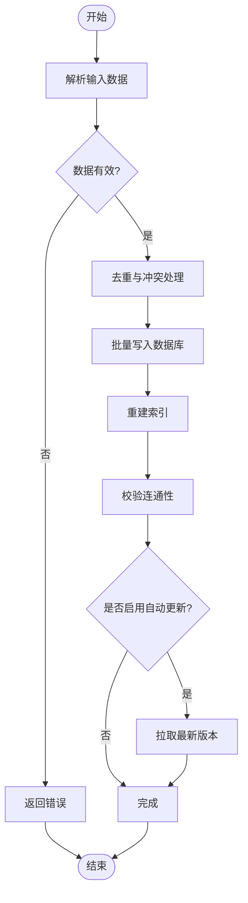
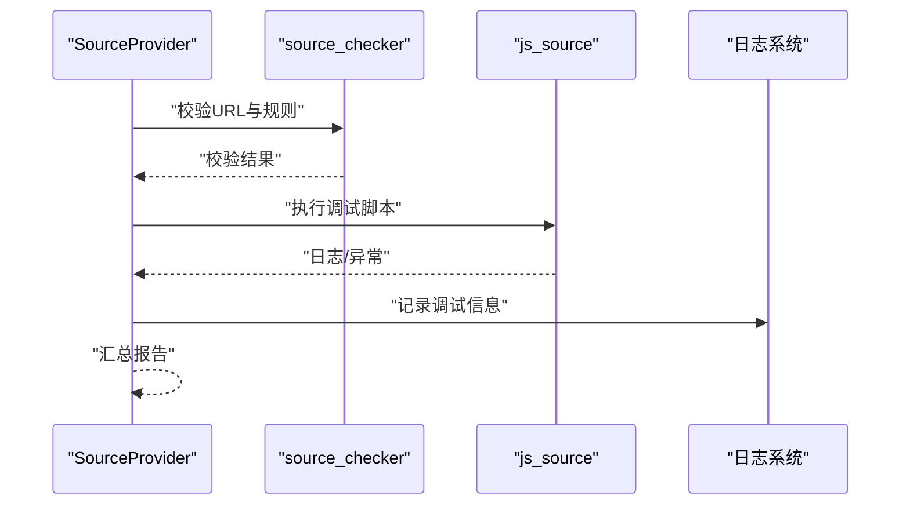
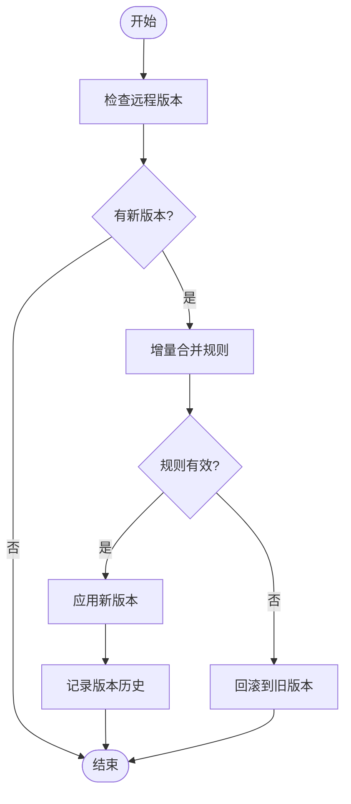
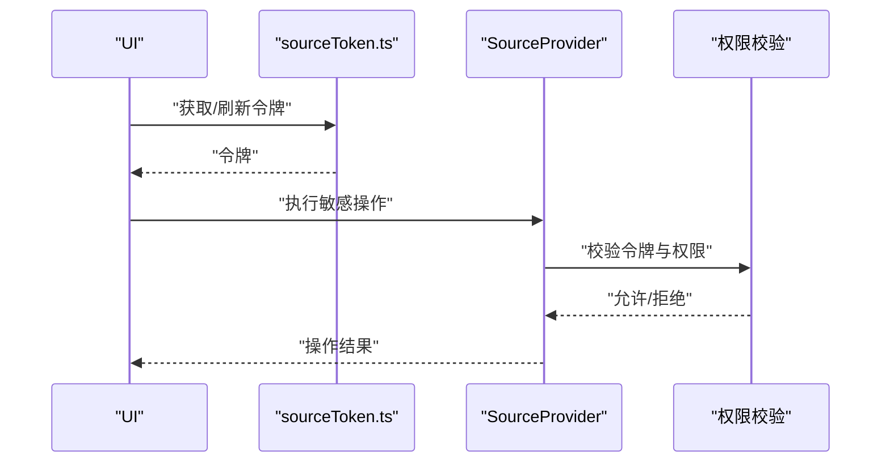
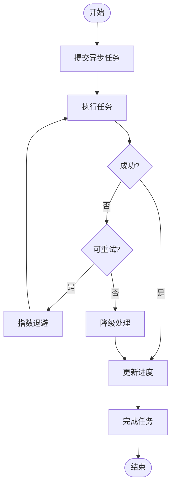
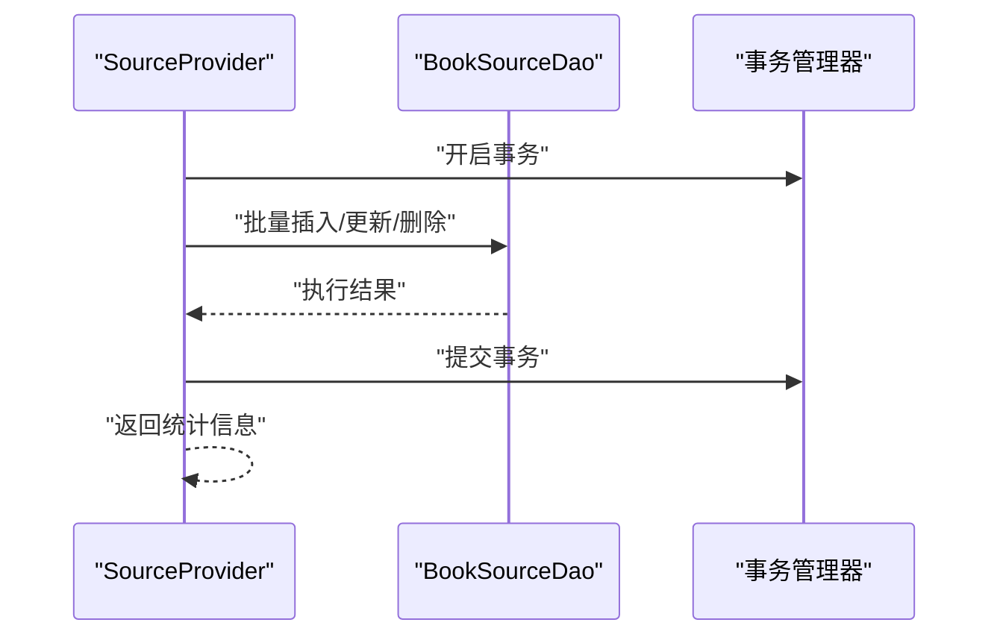
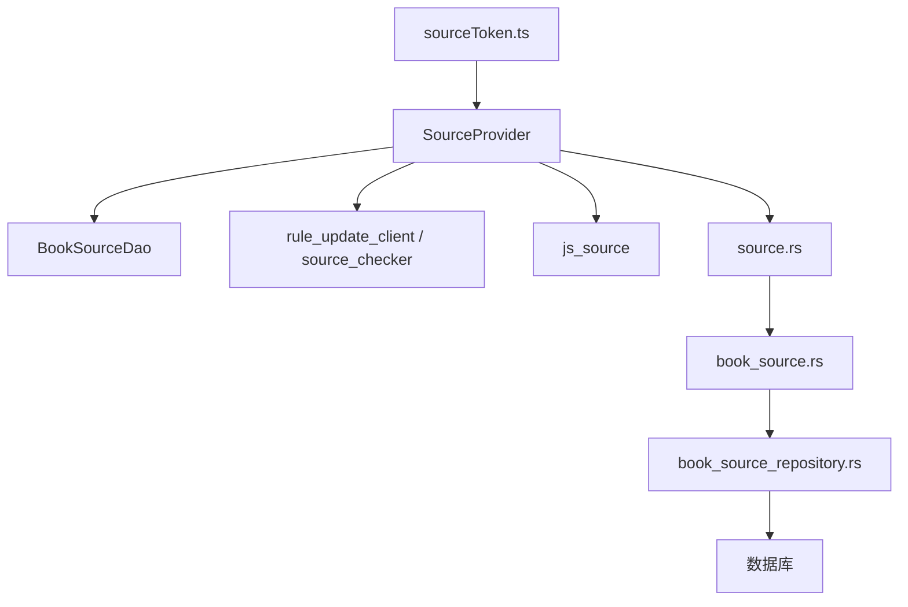

# 源Provider

<cite>
**本文引用的文件**   
- [app/src/main/java/io/legado/app/model/source/SourceProvider.kt](file://app/src/main/java/io/legado/app/model/source/SourceProvider.kt)
- [app/src/main/java/io/legado/app/data/dao/BookSourceDao.kt](file://app/src/main/java/io/legado/app/data/dao/BookSourceDao.kt)
- [app/src/main/java/io/legado/app/data/entities/BookSourceEntity.kt](file://app/src/main/java/io/legado/app/data/entities/BookSourceEntity.kt)
- [modules/web/src/api/sourceToken.ts](file://modules/web/src/api/sourceToken.ts)
- [rust/legado-core/src/models/book_source.rs](file://rust/legado-core/src/models/book_source.rs)
- [rust/legado-db/src/repository/book_source_repository.rs](file://rust/legado-db/src/repository/book_source_repository.rs)
- [rust/legado-ffi/src/api/source.rs](file://rust/legado-ffi/src/api/source.rs)
- [rust/legado-net/src/rule_update_client.rs](file://rust/legado-net/src/rule_update_client.rs)
- [rust/legado-net/src/source_checker.rs](file://rust/legado-net/src/source_checker.rs)
- [rust/legado-js/src/js_source/mod.rs](file://rust/legado-js/src/js_source/mod.rs)
</cite>

## 目录
1. [简介](#简介)
2. [项目结构](#项目结构)
3. [核心组件](#核心组件)
4. [架构总览](#架构总览)
5. [详细组件分析](#详细组件分析)
6. [依赖关系分析](#依赖关系分析)
7. [性能考量](#性能考量)
8. [故障排查指南](#故障排查指南)
9. [结论](#结论)
10. [附录](#附录)

## 简介
本文件面向“源Provider”（SourceProvider）的完整技术文档，聚焦网络源的增删改查、导入导出、验证、分类与批量操作、自动更新与版本管理、调试与测试、权限控制与访问限制、异步处理模式与错误恢复机制，并提供导入导出的具体实现示例。内容基于仓库中的Android端Provider层、Rust核心库与FFI接口进行系统化梳理，帮助开发者快速理解并扩展源管理能力。

## 项目结构
- Android端：提供SourceProvider作为统一入口，封装对数据持久化、网络校验、JS引擎等能力的调用。
- Rust核心：定义BookSource模型、仓库层CRUD、规则更新客户端、源检查器、JS源执行上下文等。
- FFI桥接：将Rust能力暴露给上层（如Web或Flutter），供UI与业务层调用。
- Web前端：提供源令牌管理与源编辑界面，辅助导入导出与调试。

**图表来源** 
- [app/src/main/java/io/legado/app/model/source/SourceProvider.kt](file://app/src/main/java/io/legado/app/model/source/SourceProvider.kt)
- [app/src/main/java/io/legado/app/data/dao/BookSourceDao.kt](file://app/src/main/java/io/legado/app/data/dao/BookSourceDao.kt)
- [rust/legado-core/src/models/book_source.rs](file://rust/legado-core/src/models/book_source.rs)
- [rust/legado-db/src/repository/book_source_repository.rs](file://rust/legado-db/src/repository/book_source_repository.rs)
- [rust/legado-ffi/src/api/source.rs](file://rust/legado-ffi/src/api/source.rs)
- [rust/legado-net/src/rule_update_client.rs](file://rust/legado-net/src/rule_update_client.rs)
- [rust/legado-net/src/source_checker.rs](file://rust/legado-net/src/source_checker.rs)
- [rust/legado-js/src/js_source/mod.rs](file://rust/legado-js/src/js_source/mod.rs)

**章节来源**
- [app/src/main/java/io/legado/app/model/source/SourceProvider.kt](file://app/src/main/java/io/legado/app/model/source/SourceProvider.kt)
- [app/src/main/java/io/legado/app/data/dao/BookSourceDao.kt](file://app/src/main/java/io/legado/app/data/dao/BookSourceDao.kt)
- [rust/legado-core/src/models/book_source.rs](file://rust/legado-core/src/models/book_source.rs)
- [rust/legado-db/src/repository/book_source_repository.rs](file://rust/legado-db/src/repository/book_source_repository.rs)
- [rust/legado-ffi/src/api/source.rs](file://rust/legado-ffi/src/api/source.rs)

## 核心组件
- SourceProvider：对外暴露源的CRUD、导入导出、验证、分类、批量操作、自动更新、调试与权限控制等能力。
- BookSourceDao：数据访问对象，负责BookSource实体的持久化操作。
- BookSourceEntity：源实体模型，承载源的元数据、规则、状态、版本等信息。
- Rust核心模型与仓库：book_source.rs定义数据结构，book_source_repository.rs实现持久化与查询逻辑。
- FFI API：source.rs为上层提供跨语言调用接口。
- 网络与校验：rule_update_client.rs负责规则更新，source_checker.rs负责源可用性检测。
- JS源引擎：js_source/mod.rs提供JS脚本运行环境，用于动态解析与调试。

**章节来源**
- [app/src/main/java/io/legado/app/model/source/SourceProvider.kt](file://app/src/main/java/io/legado/app/model/source/SourceProvider.kt)
- [app/src/main/java/io/legado/app/data/dao/BookSourceDao.kt](file://app/src/main/java/io/legado/app/data/dao/BookSourceDao.kt)
- [app/src/main/java/io/legado/app/data/entities/BookSourceEntity.kt](file://app/src/main/java/io/legado/app/data/entities/BookSourceEntity.kt)
- [rust/legado-core/src/models/book_source.rs](file://rust/legado-core/src/models/book_source.rs)
- [rust/legado-db/src/repository/book_source_repository.rs](file://rust/legado-db/src/repository/book_source_repository.rs)
- [rust/legado-ffi/src/api/source.rs](file://rust/legado-ffi/src/api/source.rs)
- [rust/legado-net/src/rule_update_client.rs](file://rust/legado-net/src/rule_update_client.rs)
- [rust/legado-net/src/source_checker.rs](file://rust/legado-net/src/source_checker.rs)
- [rust/legado-js/src/js_source/mod.rs](file://rust/legado-js/src/js_source/mod.rs)

## 架构总览
SourceProvider作为统一入口，协调DAO、网络校验、JS引擎与FFI接口，完成源的生命周期管理。其关键流程包括：
- 导入：接收JSON/YAML等格式，解析后写入数据库，触发校验与索引重建。
- 导出：按条件筛选源，序列化输出为可共享格式。
- 验证：通过source_checker进行连通性与规则有效性检查。
- 自动更新：通过rule_update_client拉取远程规则，合并本地变更并记录版本。
- 调试：借助js_source执行JS源脚本，捕获日志与异常，辅助定位问题。
- 权限：结合token与访问策略限制敏感操作。

**图表来源** 
- [app/src/main/java/io/legado/app/model/source/SourceProvider.kt](file://app/src/main/java/io/legado/app/model/source/SourceProvider.kt)
- [app/src/main/java/io/legado/app/data/dao/BookSourceDao.kt](file://app/src/main/java/io/legado/app/data/dao/BookSourceDao.kt)
- [rust/legado-net/src/source_checker.rs](file://rust/legado-net/src/source_checker.rs)
- [rust/legado-net/src/rule_update_client.rs](file://rust/legado-net/src/rule_update_client.rs)
- [rust/legado-js/src/js_source/mod.rs](file://rust/legado-js/src/js_source/mod.rs)
- [rust/legado-ffi/src/api/source.rs](file://rust/legado-ffi/src/api/source.rs)

## 详细组件分析

### 源CRUD与分类管理
- 创建：支持单条与批量创建，包含名称、URL、规则、分类标签等字段。
- 读取：按ID、分类、关键字检索；支持分页与排序。
- 更新：增量更新规则与元数据，保留历史版本。
- 删除：软删除与硬删除策略，支持级联清理缓存。
- 分类：维护分类树与标签映射，便于批量筛选与管理。

**图表来源** 
- [app/src/main/java/io/legado/app/model/source/SourceProvider.kt](file://app/src/main/java/io/legado/app/model/source/SourceProvider.kt)
- [app/src/main/java/io/legado/app/data/dao/BookSourceDao.kt](file://app/src/main/java/io/legado/app/data/dao/BookSourceDao.kt)
- [app/src/main/java/io/legado/app/data/entities/BookSourceEntity.kt](file://app/src/main/java/io/legado/app/data/entities/BookSourceEntity.kt)

**章节来源**
- [app/src/main/java/io/legado/app/model/source/SourceProvider.kt](file://app/src/main/java/io/legado/app/model/source/SourceProvider.kt)
- [app/src/main/java/io/legado/app/data/dao/BookSourceDao.kt](file://app/src/main/java/io/legado/app/data/dao/BookSourceDao.kt)
- [app/src/main/java/io/legado/app/data/entities/BookSourceEntity.kt](file://app/src/main/java/io/legado/app/data/entities/BookSourceEntity.kt)

### 导入与导出
- 导入：
  - 输入：JSON/YAML格式的源清单，包含名称、URL、规则、分类、版本等。
  - 处理：解析校验、去重、冲突解决（覆盖/合并）、批量写入。
  - 后续：触发校验与索引重建，必要时启动自动更新。
- 导出：
  - 过滤：按分类、关键字、状态筛选。
  - 输出：生成标准JSON/YAML，便于分享与备份。

**图表来源** 
- [app/src/main/java/io/legado/app/model/source/SourceProvider.kt](file://app/src/main/java/io/legado/app/model/source/SourceProvider.kt)
- [app/src/main/java/io/legado/app/data/dao/BookSourceDao.kt](file://app/src/main/java/io/legado/app/data/dao/BookSourceDao.kt)
- [rust/legado-net/src/rule_update_client.rs](file://rust/legado-net/src/rule_update_client.rs)

**章节来源**
- [app/src/main/java/io/legado/app/model/source/SourceProvider.kt](file://app/src/main/java/io/legado/app/model/source/SourceProvider.kt)
- [app/src/main/java/io/legado/app/data/dao/BookSourceDao.kt](file://app/src/main/java/io/legado/app/data/dao/BookSourceDao.kt)

### 验证与调试
- 验证：
  - 连通性：检查URL可达性与响应码。
  - 规则有效性：解析规则语法，确保无致命错误。
- 调试：
  - JS执行：在沙箱中运行源脚本，捕获日志与异常。
  - 断点与日志：记录请求/响应、解析过程，辅助定位问题。

**图表来源** 
- [rust/legado-net/src/source_checker.rs](file://rust/legado-net/src/source_checker.rs)
- [rust/legado-js/src/js_source/mod.rs](file://rust/legado-js/src/js_source/mod.rs)
- [app/src/main/java/io/legado/app/model/source/SourceProvider.kt](file://app/src/main/java/io/legado/app/model/source/SourceProvider.kt)

**章节来源**
- [rust/legado-net/src/source_checker.rs](file://rust/legado-net/src/source_checker.rs)
- [rust/legado-js/src/js_source/mod.rs](file://rust/legado-js/src/js_source/mod.rs)
- [app/src/main/java/io/legado/app/model/source/SourceProvider.kt](file://app/src/main/java/io/legado/app/model/source/SourceProvider.kt)

### 自动更新与版本管理
- 自动更新：
  - 定时任务：定期检查远程规则变更。
  - 增量合并：对比本地与远程版本，应用差异。
  - 回滚机制：失败时回滚至上一稳定版本。
- 版本管理：
  - 版本号：语义化版本，记录更新时间与作者。
  - 历史记录：保留变更摘要，支持审计与回退。

**图表来源** 
- [rust/legado-net/src/rule_update_client.rs](file://rust/legado-net/src/rule_update_client.rs)
- [rust/legado-core/src/models/book_source.rs](file://rust/legado-core/src/models/book_source.rs)
- [rust/legado-db/src/repository/book_source_repository.rs](file://rust/legado-db/src/repository/book_source_repository.rs)

**章节来源**
- [rust/legado-net/src/rule_update_client.rs](file://rust/legado-net/src/rule_update_client.rs)
- [rust/legado-core/src/models/book_source.rs](file://rust/legado-core/src/models/book_source.rs)
- [rust/legado-db/src/repository/book_source_repository.rs](file://rust/legado-db/src/repository/book_source_repository.rs)

### 权限控制与访问限制
- Token管理：通过sourceToken.ts管理访问令牌，限制敏感操作。
- 访问策略：基于角色与资源粒度控制，防止未授权修改或删除。
- 审计日志：记录权限相关事件，便于追踪与合规。

**图表来源** 
- [modules/web/src/api/sourceToken.ts](file://modules/web/src/api/sourceToken.ts)
- [app/src/main/java/io/legado/app/model/source/SourceProvider.kt](file://app/src/main/java/io/legado/app/model/source/SourceProvider.kt)

**章节来源**
- [modules/web/src/api/sourceToken.ts](file://modules/web/src/api/sourceToken.ts)
- [app/src/main/java/io/legado/app/model/source/SourceProvider.kt](file://app/src/main/java/io/legado/app/model/source/SourceProvider.kt)

### 异步处理与错误恢复
- 异步模式：
  - 协程/线程池：导入、导出、校验、更新等操作异步执行，避免阻塞主线程。
  - 进度反馈：实时推送任务进度与状态。
- 错误恢复：
  - 重试机制：网络失败时指数退避重试。
  - 事务回滚：批量操作失败时整体回滚，保证一致性。
  - 降级策略：部分失败时继续处理成功项，并记录失败详情。

**图表来源** 
- [app/src/main/java/io/legado/app/model/source/SourceProvider.kt](file://app/src/main/java/io/legado/app/model/source/SourceProvider.kt)
- [rust/legado-net/src/rule_update_client.rs](file://rust/legado-net/src/rule_update_client.rs)

**章节来源**
- [app/src/main/java/io/legado/app/model/source/SourceProvider.kt](file://app/src/main/java/io/legado/app/model/source/SourceProvider.kt)
- [rust/legado-net/src/rule_update_client.rs](file://rust/legado-net/src/rule_update_client.rs)

### 批量操作支持
- 批量创建/更新/删除：支持大批量数据高效处理，减少数据库往返。
- 事务保障：批量操作在事务中执行，确保原子性。
- 并发控制：限制并发度，避免资源争用。

**图表来源** 
- [app/src/main/java/io/legado/app/model/source/SourceProvider.kt](file://app/src/main/java/io/legado/app/model/source/SourceProvider.kt)
- [app/src/main/java/io/legado/app/data/dao/BookSourceDao.kt](file://app/src/main/java/io/legado/app/data/dao/BookSourceDao.kt)

**章节来源**
- [app/src/main/java/io/legado/app/model/source/SourceProvider.kt](file://app/src/main/java/io/legado/app/model/source/SourceProvider.kt)
- [app/src/main/java/io/legado/app/data/dao/BookSourceDao.kt](file://app/src/main/java/io/legado/app/data/dao/BookSourceDao.kt)

## 依赖关系分析
- SourceProvider依赖DAO进行数据访问，依赖网络模块进行校验与更新，依赖JS引擎进行调试。
- Rust核心提供模型与仓库实现，FFI接口暴露给上层。
- Web前端通过sourceToken.ts管理权限，辅助导入导出与调试。

**图表来源** 
- [app/src/main/java/io/legado/app/model/source/SourceProvider.kt](file://app/src/main/java/io/legado/app/model/source/SourceProvider.kt)
- [app/src/main/java/io/legado/app/data/dao/BookSourceDao.kt](file://app/src/main/java/io/legado/app/data/dao/BookSourceDao.kt)
- [rust/legado-core/src/models/book_source.rs](file://rust/legado-core/src/models/book_source.rs)
- [rust/legado-db/src/repository/book_source_repository.rs](file://rust/legado-db/src/repository/book_source_repository.rs)
- [rust/legado-ffi/src/api/source.rs](file://rust/legado-ffi/src/api/source.rs)
- [rust/legado-net/src/rule_update_client.rs](file://rust/legado-net/src/rule_update_client.rs)
- [rust/legado-net/src/source_checker.rs](file://rust/legado-net/src/source_checker.rs)
- [rust/legado-js/src/js_source/mod.rs](file://rust/legado-js/src/js_source/mod.rs)
- [modules/web/src/api/sourceToken.ts](file://modules/web/src/api/sourceToken.ts)

**章节来源**
- [app/src/main/java/io/legado/app/model/source/SourceProvider.kt](file://app/src/main/java/io/legado/app/model/source/SourceProvider.kt)
- [app/src/main/java/io/legado/app/data/dao/BookSourceDao.kt](file://app/src/main/java/io/legado/app/data/dao/BookSourceDao.kt)
- [rust/legado-core/src/models/book_source.rs](file://rust/legado-core/src/models/book_source.rs)
- [rust/legado-db/src/repository/book_source_repository.rs](file://rust/legado-db/src/repository/book_source_repository.rs)
- [rust/legado-ffi/src/api/source.rs](file://rust/legado-ffi/src/api/source.rs)
- [rust/legado-net/src/rule_update_client.rs](file://rust/legado-net/src/rule_update_client.rs)
- [rust/legado-net/src/source_checker.rs](file://rust/legado-net/src/source_checker.rs)
- [rust/legado-js/src/js_source/mod.rs](file://rust/legado-js/src/js_source/mod.rs)
- [modules/web/src/api/sourceToken.ts](file://modules/web/src/api/sourceToken.ts)

## 性能考量
- 批量操作：使用事务与批量API减少数据库往返，提升吞吐。
- 异步执行：非阻塞任务调度，避免主线程卡顿。
- 缓存策略：缓存校验结果与规则解析结果，降低重复计算。
- 连接池：网络请求复用连接，减少握手开销。
- 内存管理：大文件导入导出时分块处理，避免OOM。

[本节为通用指导，无需特定文件引用]

## 故障排查指南
- 导入失败：检查JSON格式、必填字段、规则语法；查看解析日志。
- 校验失败：确认URL可达、服务器响应正常；检查规则兼容性。
- 更新失败：检查网络连接、远程地址有效性；查看版本差异。
- 调试异常：启用JS调试日志，定位脚本错误；检查沙箱权限。
- 权限问题：确认令牌有效、角色权限充足；查看审计日志。

**章节来源**
- [app/src/main/java/io/legado/app/model/source/SourceProvider.kt](file://app/src/main/java/io/legado/app/model/source/SourceProvider.kt)
- [rust/legado-net/src/source_checker.rs](file://rust/legado-net/src/source_checker.rs)
- [rust/legado-js/src/js_source/mod.rs](file://rust/legado-js/src/js_source/mod.rs)
- [modules/web/src/api/sourceToken.ts](file://modules/web/src/api/sourceToken.ts)

## 结论
SourceProvider作为源管理的核心组件，提供了完整的CRUD、导入导出、验证、分类、批量操作、自动更新、调试与权限控制能力。通过异步处理与错误恢复机制，确保了高可用与稳定性。结合Rust核心与FFI接口，实现了高性能与跨平台能力。开发者可基于此文档快速理解并扩展源管理功能。

[本节为总结，无需特定文件引用]

## 附录
- 导入示例：参考SourceProvider的导入方法，构造JSON/YAML清单，调用批量写入接口。
- 导出示例：按分类或关键字筛选源，调用导出接口生成标准格式文件。
- 调试示例：使用JS引擎执行源脚本，捕获日志与异常，辅助定位问题。
- 权限示例：通过sourceToken.ts管理令牌，限制敏感操作。

[本节为补充说明，无需特定文件引用]