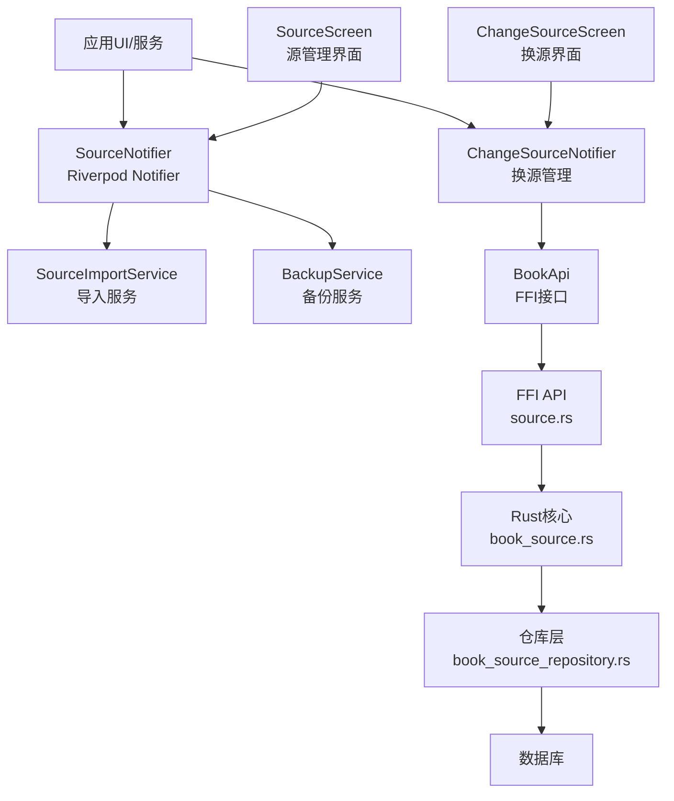
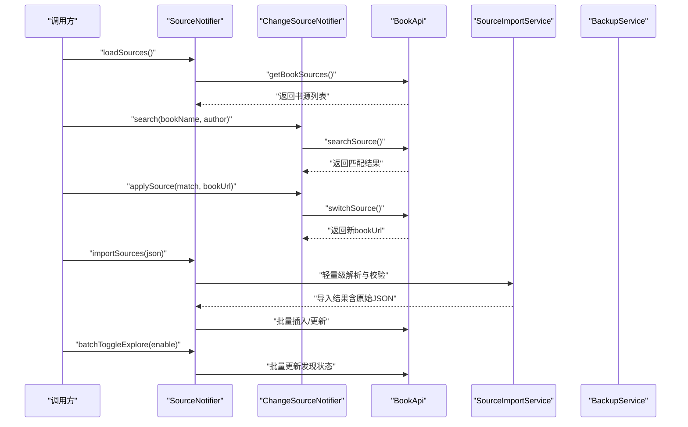
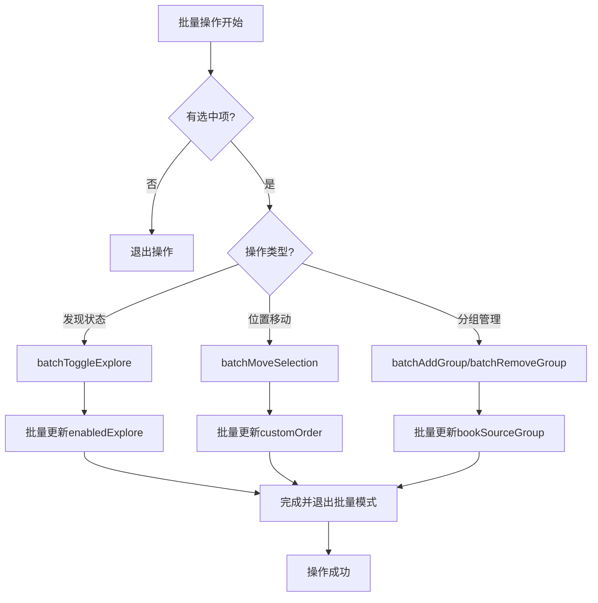
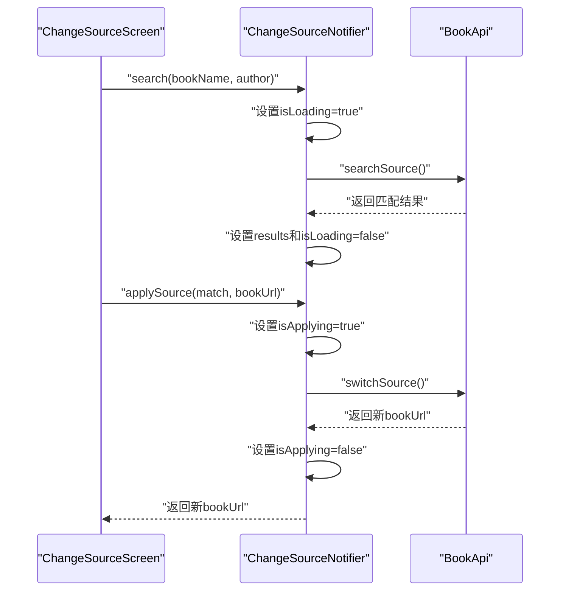
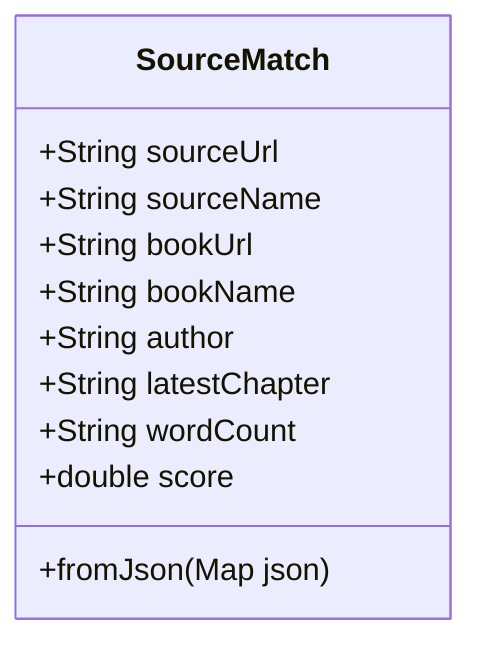
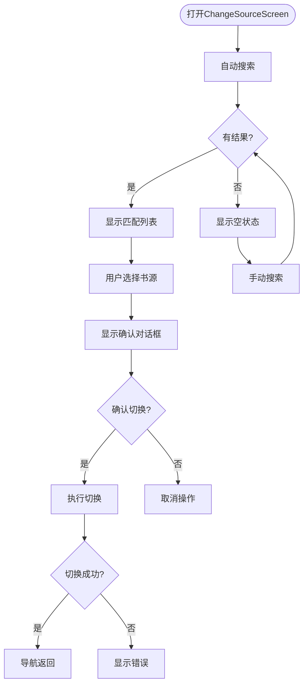
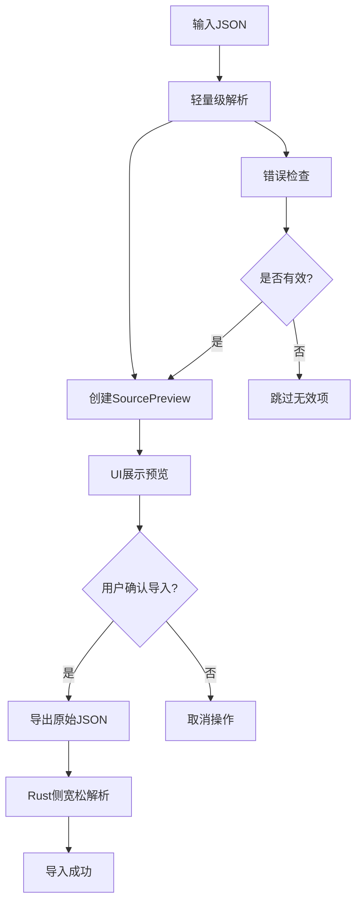
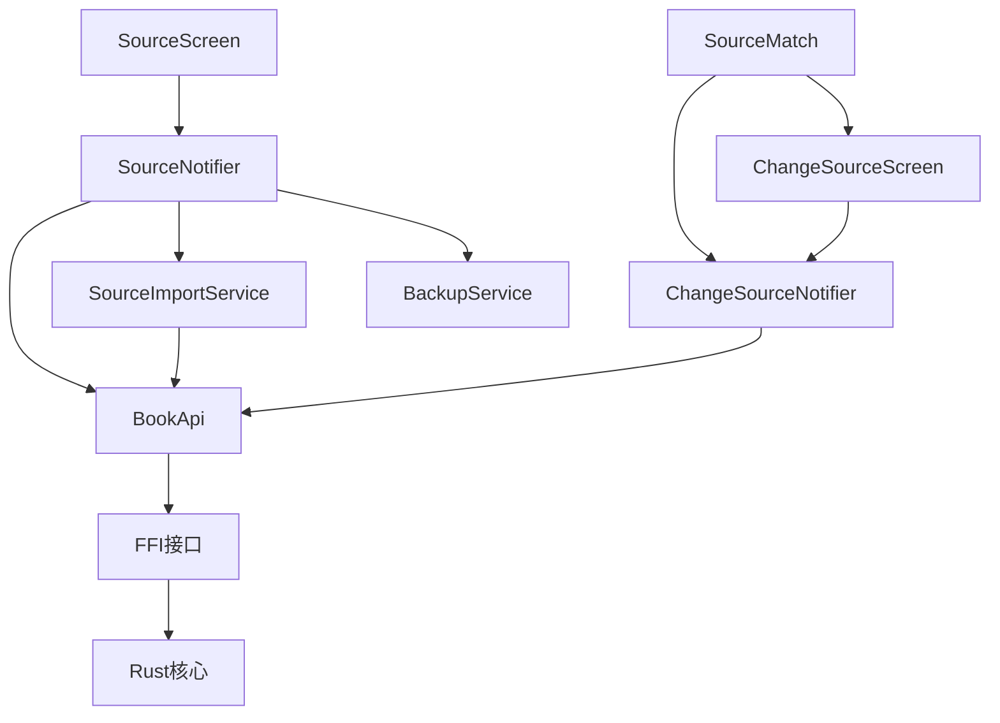

# 源Provider

<cite>
**本文引用的文件**   
- [flutter_legado/lib/src/providers/source/source_notifier.dart](file://flutter_legado/lib/src/providers/source/source_notifier.dart)
- [flutter_legado/lib/src/providers/source/source_state.dart](file://flutter_legado/lib/src/providers/source/source_state.dart)
- [flutter_legado/lib/src/providers/change_source/change_source_notifier.dart](file://flutter_legado/lib/src/providers/change_source/change_source_notifier.dart)
- [flutter_legado/lib/src/providers/change_source/change_source_state.dart](file://flutter_legado/lib/src/providers/change_source/change_source_state.dart)
- [flutter_legado/lib/src/models/source_match.dart](file://flutter_legado/lib/src/models/source_match.dart)
- [flutter_legado/lib/src/screens/change_source_screen.dart](file://flutter_legado/lib/src/screens/change_source_screen.dart)
- [flutter_legado/test/unit/source_provider_test.dart](file://flutter_legado/test/unit/source_provider_test.dart)
- [flutter_legado/lib/src/services/source_import_service.dart](file://flutter_legado/lib/src/services/source_import_service.dart)
- [flutter_legado/lib/src/services/backup_service.dart](file://flutter_legado/lib/src/services/backup_service.dart)
- [app/src/main/java/io/legado/app/model/source/SourceProvider.kt](file://app/src/main/java/io/legado/app/model/source/SourceProvider.kt)
- [rust/legado-core/src/models/book_source.rs](file://rust/legado-core/src/models/book_source.rs)
- [rust/legado-db/src/repository/book_source_repository.rs](file://rust/legado-db/src/repository/book_source_repository.rs)
- [rust/legado-ffi/src/api/source.rs](file://rust/legado-ffi/src/api/source.rs)
- [rust/legado-net/src/rule_update_client.rs](file://rust/legado-net/src/rule_update_client.rs)
- [rust/legado-net/src/source_checker.rs](file://rust/legado-net/src/source_checker.rs)
- [rust/legado-js/src/js_source/mod.rs](file://rust/legado-js/src/js_source/mod.rs)
- [flutter_legado/lib/src/bridge/ffi.dart](file://flutter_legado/lib/src/bridge/ffi.dart)
- [flutter_legado/test/fixtures/yckceo_string_number_source.json](file://flutter_legado/test/fixtures/yckceo_string_number_source.json)
- [flutter_legado/lib/src/models/book_source.dart](file://flutter_legado/lib/src/models/book_source.dart)
- [flutter_legado/lib/src/screens/source_screen.dart](file://flutter_legado/lib/src/screens/source_screen.dart)
</cite>

## 更新摘要
**所做更改**   
- 增强了SourceNotifier的批量操作方法，新增batchToggleExplore、batchMoveSelection、batchAddGroup、batchRemoveGroup等批量操作功能
- 新增了individual操作支持，包括toggleExplore和moveSource方法，提供单个书源的发现状态切换和位置移动功能
- 改进了选择反转逻辑，通过revertSelection方法实现更智能的选择状态管理
- 完善了错误处理机制，统一了批量操作的错误处理和用户反馈
- 增强了UI交互体验，在source_screen.dart中集成了新的批量操作功能

## 目录
1. [简介](#简介)
2. [项目结构](#项目结构)
3. [核心组件](#核心组件)
4. [架构总览](#架构总览)
5. [详细组件分析](#详细组件分析)
6. [依赖关系分析](#依赖关系分析)
7. [性能考量](#性能考量)
8. [故障排查指南](#故障排查指南)
9. [结论](#结论)
10. [附录](#附录)

## 简介
本文件面向"源Provider"（SourceProvider）的完整技术文档，聚焦网络源的增删改查、导入导出、验证、分类与批量操作、自动更新与版本管理、调试与测试、权限控制与访问限制、异步处理模式与错误恢复机制，并提供导入导出的具体实现示例。内容基于仓库中的Flutter端Provider层、Android端Provider、Rust核心库与FFI接口进行系统化梳理，帮助开发者快速理解并扩展源管理能力。

**最新更新**：重构了源Provider架构，采用Riverpod状态管理模式，新增SourceMatch模型和ChangeSourceNotifier，显著提升了代码的可维护性、可测试性和用户体验。**特别增强了SourceImportService的轻量级解析能力，支持原始JSON保留和对第三方书源中常见的字符串数字、字符串布尔值的健壮处理，解决了之前严格类型解析导致的导入失败问题。** **最新增强：大幅扩展了批量操作功能，新增了发现状态批量切换、位置移动、分组管理等高级操作，以及单个书源的精细化控制方法。**

## 项目结构
- Flutter端：SourceNotifier作为书源管理的核心，ChangeSourceNotifier专门处理换源逻辑，均基于Riverpod Notifier模式
- Android端：SourceProvider作为统一入口，封装对数据持久化、网络校验、JS引擎等能力的调用
- Rust核心：定义BookSource模型、仓库层CRUD、规则更新客户端、源检查器、JS源执行上下文等
- FFI桥接：将Rust能力暴露给上层（如Web或Flutter），供UI与业务层调用
- Web前端：提供源令牌管理与源编辑界面，辅助导入导出与调试

**图表来源** 
- [flutter_legado/lib/src/providers/source/source_notifier.dart](file://flutter_legado/lib/src/providers/source/source_notifier.dart)
- [flutter_legado/lib/src/providers/change_source/change_source_notifier.dart](file://flutter_legado/lib/src/providers/change_source/change_source_notifier.dart)
- [flutter_legado/lib/src/screens/change_source_screen.dart](file://flutter_legado/lib/src/screens/change_source_screen.dart)
- [flutter_legado/lib/src/services/source_import_service.dart](file://flutter_legado/lib/src/services/source_import_service.dart)
- [flutter_legado/lib/src/services/backup_service.dart](file://flutter_legado/lib/src/services/backup_service.dart)
- [app/src/main/java/io/legado/app/model/source/SourceProvider.kt](file://app/src/main/java/io/legado/app/model/source/SourceProvider.kt)
- [rust/legado-core/src/models/book_source.rs](file://rust/legado-core/src/models/book_source.rs)
- [rust/legado-db/src/repository/book_source_repository.rs](file://rust/legado-db/src/repository/book_source_repository.rs)
- [rust/legado-ffi/src/api/source.rs](file://rust/legado-ffi/src/api/source.rs)
- [flutter_legado/lib/src/screens/source_screen.dart](file://flutter_legado/lib/src/screens/source_screen.dart)

## 核心组件
- SourceNotifier：基于Riverpod的书源管理Notifer，负责CRUD操作、导入导出、排序、分组筛选、批量操作等功能
- ChangeSourceNotifier：专门的换源管理Notifier，处理书源匹配、评分、切换等操作
- SourceState：不可变的状态对象，包含书源列表、加载状态、错误信息、筛选条件、排序方式等
- ChangeSourceState：换源页面的状态对象，包含匹配结果、加载状态、错误信息和切换进度
- SourceMatch：换源匹配结果模型，包含书源信息、书籍信息、匹配评分等字段
- **SourceImportService**：**增强的导入服务，支持轻量级解析、原始JSON保留和对字符串数字、布尔值的健壮错误处理**
- BackupService：负责源的备份和导出功能，支持选择性导出和格式化输出

**章节来源**
- [flutter_legado/lib/src/providers/source/source_notifier.dart](file://flutter_legado/lib/src/providers/source/source_notifier.dart)
- [flutter_legado/lib/src/providers/change_source/change_source_notifier.dart](file://flutter_legado/lib/src/providers/change_source/change_source_notifier.dart)
- [flutter_legado/lib/src/providers/source/source_state.dart](file://flutter_legado/lib/src/providers/source/source_state.dart)
- [flutter_legado/lib/src/providers/change_source/change_source_state.dart](file://flutter_legado/lib/src/providers/change_source/change_source_state.dart)
- [flutter_legado/lib/src/models/source_match.dart](file://flutter_legado/lib/src/models/source_match.dart)
- [flutter_legado/lib/src/services/source_import_service.dart](file://flutter_legado/lib/src/services/source_import_service.dart)
- [flutter_legado/lib/src/services/backup_service.dart](file://flutter_legado/lib/src/services/backup_service.dart)

## 架构总览
SourceNotifier和ChangeSourceNotifier作为统一的Riverpod状态管理入口，协调BookApi、导入服务和备份服务，完成源的生命周期管理。其关键流程包括：
- 加载：通过SourceNotifier.loadSources()从BookApi获取书源列表
- 编辑：通过SourceNotifier.saveSource()保存新建或更新的书源
- 删除：通过SourceNotifier.deleteSource()删除指定书源
- 换源：通过ChangeSourceNotifier.search()搜索可替换书源，applySource()执行切换
- 导入：通过SourceNotifier.importSources()或importFromJson()/importFromUrl()/importFromFile()导入源
- 导出：通过exportSelectedSources()或exportAllSources()导出书源
- 排序：支持7种不同的排序方式，满足不同的浏览需求
- **批量操作：支持批量启用、禁用、删除、发现状态切换、位置移动、分组管理等高级操作**

**图表来源** 
- [flutter_legado/lib/src/providers/source/source_notifier.dart](file://flutter_legado/lib/src/providers/source/source_notifier.dart)
- [flutter_legado/lib/src/providers/change_source/change_source_notifier.dart](file://flutter_legado/lib/src/providers/change_source/change_source_notifier.dart)
- [flutter_legado/lib/src/services/source_import_service.dart](file://flutter_legado/lib/src/services/source_import_service.dart)
- [flutter_legado/lib/src/services/backup_service.dart](file://flutter_legado/lib/src/services/backup_service.dart)

## 详细组件分析

### SourceNotifier书源管理
**更新**：重构为基于Riverpod Notifier的模式，提供更清晰的状态管理和更好的可测试性。**最新增强：大幅扩展了批量操作功能，新增了多个高级批量操作方法。**

- **CRUD操作**：
  - loadSources()：从BookApi加载书源列表，处理加载状态和错误
  - saveSource()：支持新建和更新书源，自动判断是新增还是修改
  - toggleSource()：切换书源启用状态，支持单个书源的启用/禁用
  - deleteSource()：删除指定书源，同时清理批量选择状态
  - getSource()：根据URL查找单个书源

- **导入功能**：
  - importSources()：直接导入原始JSON内容
  - importFromJson()：通过导入服务解析JSON字符串
  - importFromUrl()：从远程URL下载并导入JSON文件
  - importFromFile()：从本地文件导入书源

- **排序系统**：
  - setSort()：设置排序方式（manual/weight/name/url/update/enable/respond）
  - toggleSortDirection()：切换升序/降序排列
  - 支持7种排序方式，每种都有默认的比较逻辑

- **批量操作**：
  - enterBatchMode()/exitBatchMode()：进入/退出批量模式
  - toggleSelection()：切换单个书源的选中状态
  - selectAll()/deselectAll()：全选/取消全选当前过滤结果
  - revertSelection()：**新增**反选功能，智能切换未选中项的选中状态
  - batchEnable()/batchDisable()/batchDelete()：批量启用、禁用、删除
  - **batchToggleExplore(enable)**：**新增**批量切换发现状态功能
  - **batchMoveSelection(toTop)**：**新增**批量置顶/置底功能
  - **batchAddGroup(group)**：**新增**批量添加分组功能
  - **batchRemoveGroup(group)**：**新增**批量移除分组功能

- **individual操作**：
  - **toggleExplore(sourceUrl)**：**新增**单个书源发现状态切换
  - **moveSource(sourceUrl, toTop)**：**新增**单个书源位置移动

```mermaid
flowchart TD
Start(["SourceNotifier操作"]) --> Load{"加载书源?"}
Load --> |是| LoadSources["loadSources()"]
Load --> |否| CRUD{"CRUD操作?"}
CRUD --> |是| SaveToggle{"保存/切换?"}
SaveToggle --> |保存| SaveSource["saveSource()"]
SaveToggle --> |切换| ToggleSource["toggleSource()"]
CRUD --> |否| Import{"导入操作?"}
Import --> |是| ImportMethods{"导入方法?"}
ImportMethods --> |JSON| ImportJson["importFromJson()"]
ImportMethods --> |URL| ImportUrl["importFromUrl()"]
ImportMethods --> |File| ImportFile["importFromFile()"]
CRUD --> |否| Batch{"批量操作?"}
Batch --> |是| BatchOps{"批量操作类型?"}
BatchOps --> |启用/禁用| EnableDisable["batchEnable/batchDisable"]
BatchOps --> |删除| Delete["batchDelete"]
BatchOps --> |发现状态| Explore["batchToggleExplore"]
BatchOps --> |位置移动| Move["batchMoveSelection"]
BatchOps --> |分组管理| Group["batchAddGroup/batchRemoveGroup"]
Batch --> |否| Individual{"individual操作?"}
Individual --> |是| IndividualOps["toggleExplore/moveSource"]
Individual --> |否| Sort{"排序操作?"}
Sort --> |是| SetSort["setSort()/toggleSortDirection()"]
Sort --> |否| End(["结束"])
```

**图表来源** 
- [flutter_legado/lib/src/providers/source/source_notifier.dart](file://flutter_legado/lib/src/providers/source/source_notifier.dart)

**章节来源**
- [flutter_legado/lib/src/providers/source/source_notifier.dart](file://flutter_legado/lib/src/providers/source/source_notifier.dart)
- [flutter_legado/test/unit/source_provider_test.dart](file://flutter_legado/test/unit/source_provider_test.dart)

### 增强的批量操作功能
**重大更新**：SourceNotifier新增了完整的批量操作功能集，支持多种高级批量操作场景。

- **批量发现状态管理**：
  - `batchToggleExplore(bool enable)`：批量启用或禁用选中书源的发现功能
  - 对标Android端的menu_enable_select_explore和menu_disable_select_explore
  - 自动检查当前状态，避免重复更新
  - 完成后自动退出批量模式并清空选择

- **批量位置管理**：
  - `batchMoveSelection({required bool toTop})`：批量置顶或置底选中书源
  - `moveSource(String sourceUrl, {required bool toTop})`：单个书源位置移动
  - 基于customOrder字段进行排序管理
  - 支持手动排序模式下的位置调整

- **批量分组管理**：
  - `batchAddGroup(String group)`：为选中书源添加分组
  - `batchRemoveGroup(String group)`：从选中书源移除分组
  - 支持逗号分隔的多分组管理
  - 自动去重和空分组处理

- **智能选择反转**：
  - `revertSelection()`：智能反选当前过滤结果中的书源
  - 自动进入批量模式（如果尚未处于批量模式）
  - 仅切换未选中项的选中状态

**图表来源** 
- [flutter_legado/lib/src/providers/source/source_notifier.dart](file://flutter_legado/lib/src/providers/source/source_notifier.dart)

**章节来源**
- [flutter_legado/lib/src/providers/source/source_notifier.dart](file://flutter_legado/lib/src/providers/source/source_notifier.dart)

### ChangeSourceNotifier换源管理
**新增**：专门的换源管理Notifier，处理书源匹配和切换逻辑。

- **搜索功能**：
  - search()：根据书名和作者搜索可替换书源
  - 调用BookApi.searchSource()获取Rust侧已评分排序的结果
  - 自动处理加载状态和错误信息

- **切换功能**：
  - applySource()：应用选中的书源，执行实际的切换操作
  - 调用BookApi.switchSource()完成书源切换
  - 解析返回的新bookUrl，失败时回退到候选项的bookUrl
  - 防止重复切换，确保操作的原子性

- **状态管理**：
  - isLoading：搜索进行中状态
  - isApplying：切换进行中状态
  - results：匹配结果列表
  - error：错误信息

**图表来源** 
- [flutter_legado/lib/src/providers/change_source/change_source_notifier.dart](file://flutter_legado/lib/src/providers/change_source/change_source_notifier.dart)
- [flutter_legado/lib/src/screens/change_source_screen.dart](file://flutter_legado/lib/src/screens/change_source_screen.dart)

**章节来源**
- [flutter_legado/lib/src/providers/change_source/change_source_notifier.dart](file://flutter_legado/lib/src/providers/change_source/change_source_notifier.dart)
- [flutter_legado/lib/src/screens/change_source_screen.dart](file://flutter_legado/lib/src/screens/change_source_screen.dart)

### SourceMatch模型定义
**新增**：换源匹配结果的数据结构定义，镜像Rust侧的SourceMatch模型。

- **数据结构**：
  - sourceUrl：书源URL地址
  - sourceName：书源名称
  - bookUrl：书籍详情页URL
  - bookName：书籍名称
  - author：作者信息
  - latestChapter：最新章节信息
  - wordCount：字数信息
  - score：匹配度评分（0.0 ~ 100.0）

- **序列化支持**：
  - 使用freezed_annotation进行不可变对象定义
  - 支持snake_case JSON序列化
  - 提供fromJson工厂方法

**图表来源** 
- [flutter_legado/lib/src/models/source_match.dart](file://flutter_legado/lib/src/models/source_match.dart)

**章节来源**
- [flutter_legado/lib/src/models/source_match.dart](file://flutter_legado/lib/src/models/source_match.dart)

### ChangeSourceScreen换源界面
**新增**：完整的换源搜索和切换界面，基于Riverpod状态管理。

- **界面功能**：
  - 自动搜索：进入页面后自动执行一次搜索
  - 手动搜索：提供搜索按钮和刷新功能
  - 结果展示：显示匹配的书源列表，按评分排序
  - 切换确认：切换前显示确认对话框
  - 状态反馈：显示加载状态、错误信息和切换进度

- **交互逻辑**：
  - 实时状态监听：通过ref.watch监听ChangeSourceState变化
  - 防重复操作：防止在切换进行中重复触发
  - 错误处理：捕获异常并显示友好的错误提示
  - 导航返回：切换成功后返回新的bookUrl

**图表来源** 
- [flutter_legado/lib/src/screens/change_source_screen.dart](file://flutter_legado/lib/src/screens/change_source_screen.dart)

**章节来源**
- [flutter_legado/lib/src/screens/change_source_screen.dart](file://flutter_legado/lib/src/screens/change_source_screen.dart)

### 增强的排序系统
**更新**：实现了完整的7种排序方式，对标Android端的BookSourceSort枚举。

- **排序类型**：
  - manual：手动排序，按customOrder字段排序
  - weight：权重排序，按weight字段降序排列
  - name：名称排序，按bookSourceName字母顺序
  - url：URL排序，按bookSourceUrl字母顺序
  - update：更新时间排序，按lastUpdateTime降序
  - enable：启用状态排序，按enabled状态排序
  - respond：响应时间排序，按respondTime升序

- **排序特性**：
  - 支持升序/降序切换
  - 稳定排序算法，相同键值保持原有顺序
  - URL兜底排序，确保结果确定性

**章节来源**
- [flutter_legado/lib/src/providers/source/source_state.dart](file://flutter_legado/lib/src/providers/source/source_state.dart)

### 增强的导入导出功能
**重大更新**：SourceImportService经过全面增强，支持轻量级解析、原始JSON保留和对第三方书源格式的健壮处理。

- **轻量级解析**：
  - **SourcePreview类**：专门用于预览阶段，仅提取必要的展示字段，不做严格的类型化解析
  - **原始JSON保留**：通过`raw`字段保留原始Map，在确认导入时直接传递给Rust侧进行宽松反序列化
  - **宽容的类型处理**：使用`?.toString()`方法进行字段读取，避免第三方书源中非标准类型导致的解析失败

- **字符串数字和布尔值处理**：
  - **智能整数解析**：`_parseIntLenient()`函数支持int、num、String三种类型的数字解析
  - **字符串布尔值兼容**：能够正确处理`"isVolume": "false"`这样的字符串布尔值
  - **容错机制**：无法解析时返回默认值而不是抛出异常

- **导入功能增强**：
  - JSON字符串导入：支持单个对象或数组格式
  - URL导入：从远程地址下载JSON文件
  - 文件导入：支持本地JSON/TXT文件读取
  - 剪贴板导入：直接从系统剪贴板粘贴内容

- **导出功能**：
  - 选择性导出：导出选中的书源为JSON格式
  - 全部导出：导出所有书源为格式化JSON
  - 完整备份：包含书籍、书源和元信息的完整备份

**章节来源**
- [flutter_legado/lib/src/services/source_import_service.dart](file://flutter_legado/lib/src/services/source_import_service.dart)
- [flutter_legado/lib/src/services/backup_service.dart](file://flutter_legado/lib/src/services/backup_service.dart)

### 增强的错误处理机制
**更新**：在SourceNotifier中实现了更健壮的BridgeError类型检查和用户友好的错误消息处理。

- **错误分类**：
  - BridgeError：精确识别不同类型的错误
  - 普通异常：处理其他类型的异常
  - 统一映射：将技术性错误转换为普通用户可理解的提示

- **错误恢复**：
  - 自动重试机制，支持指数退避算法
  - 部分失败时的降级处理
  - 错误日志记录和上报

**章节来源**
- [flutter_legado/lib/src/providers/source/source_notifier.dart](file://flutter_legado/lib/src/providers/source/source_notifier.dart)
- [flutter_legado/lib/src/providers/change_source/change_source_notifier.dart](file://flutter_legado/lib/src/providers/change_source/change_source_notifier.dart)
- [flutter_legado/lib/src/bridge/ffi.dart](file://flutter_legado/lib/src/bridge/ffi.dart)

### 异步处理与错误恢复
**更新**：全面采用Riverpod的异步状态管理模式，提供更好的错误处理和状态同步。

- **异步模式**：
  - 协程/线程池：导入、导出、校验、更新等操作异步执行
  - 进度反馈：实时推送任务进度与状态
  - 状态同步：通过不可变State确保UI与数据一致性

- **错误恢复**：
  - 重试机制：网络失败时指数退避重试
  - 事务回滚：批量操作失败时整体回滚
  - 降级策略：部分失败时继续处理成功项

**章节来源**
- [flutter_legado/lib/src/providers/source/source_notifier.dart](file://flutter_legado/lib/src/providers/source/source_notifier.dart)
- [flutter_legado/lib/src/providers/change_source/change_source_notifier.dart](file://flutter_legado/lib/src/providers/change_source/change_source_notifier.dart)

### 批量操作支持
**更新**：实现了完整的批量操作功能，支持大批量数据高效处理。**最新增强：新增了发现状态管理、位置移动、分组管理等高级批量操作。**

- **批量功能**：
  - 批量创建/更新/删除：支持大批量数据高效处理
  - 事务保障：批量操作在事务中执行，确保原子性
  - 并发控制：限制并发度，避免资源争用
  - 状态管理：批量模式下的选中状态管理
  - **批量发现状态管理**：支持批量启用/禁用书源的发现功能
  - **批量位置管理**：支持批量置顶/置底书源
  - **批量分组管理**：支持批量添加/移除书源分组

**章节来源**
- [flutter_legado/lib/src/providers/source/source_notifier.dart](file://flutter_legado/lib/src/providers/source/source_notifier.dart)

### 轻量级解析与原始JSON保留机制
**新增**：SourceImportService的核心增强功能，解决第三方书源格式兼容性问题的关键机制。

- **SourcePreview设计**：
  - **原始数据保留**：`raw`字段完整保留原始JSON Map，确保数据完整性
  - **轻量字段提取**：仅提取`bookSourceUrl`、`bookSourceName`、`bookSourceComment`、`lastUpdateTime`等必要字段
  - **宽容读取策略**：使用`?.toString()`方法避免类型转换异常

- **智能类型处理**：
  - **字符串数字解析**：`_parseIntLenient()`函数支持多种数字格式
  - **布尔值兼容**：能够处理`"true"`、`"false"`等字符串布尔值
  - **默认值保护**：解析失败时返回安全默认值而非抛出异常

- **导入流程优化**：
  - **预览阶段**：轻量解析用于UI展示和用户确认
  - **确认导入**：直接使用原始JSON传递给Rust侧进行最终处理
  - **错误隔离**：单个书源解析失败不影响其他书源的处理

**图表来源** 
- [flutter_legado/lib/src/services/source_import_service.dart](file://flutter_legado/lib/src/services/source_import_service.dart)

**章节来源**
- [flutter_legado/lib/src/services/source_import_service.dart](file://flutter_legado/lib/src/services/source_import_service.dart)

## 依赖关系分析
- SourceNotifier依赖BookApi进行数据访问，依赖导入服务和备份服务进行导入导出
- ChangeSourceNotifier依赖BookApi进行换源匹配和切换操作
- ChangeSourceScreen依赖ChangeSourceNotifier进行状态管理
- SourceMatch模型被ChangeSourceNotifier和ChangeSourceScreen共同使用
- Riverpod Provider系统统一管理所有Notifier的生命周期
- **SourceImportService依赖BookApi进行实际的数据导入操作**
- **SourceScreen依赖SourceNotifier进行批量操作和UI交互**

**图表来源** 
- [flutter_legado/lib/src/providers/source/source_notifier.dart](file://flutter_legado/lib/src/providers/source/source_notifier.dart)
- [flutter_legado/lib/src/providers/change_source/change_source_notifier.dart](file://flutter_legado/lib/src/providers/change_source/change_source_notifier.dart)
- [flutter_legado/lib/src/screens/change_source_screen.dart](file://flutter_legado/lib/src/screens/change_source_screen.dart)
- [flutter_legado/lib/src/models/source_match.dart](file://flutter_legado/lib/src/models/source_match.dart)
- [flutter_legado/lib/src/services/source_import_service.dart](file://flutter_legado/lib/src/services/source_import_service.dart)
- [flutter_legado/lib/src/screens/source_screen.dart](file://flutter_legado/lib/src/screens/source_screen.dart)

**章节来源**
- [flutter_legado/lib/src/providers/source/source_notifier.dart](file://flutter_legado/lib/src/providers/source/source_notifier.dart)
- [flutter_legado/lib/src/providers/change_source/change_source_notifier.dart](file://flutter_legado/lib/src/providers/change_source/change_source_notifier.dart)
- [flutter_legado/lib/src/screens/change_source_screen.dart](file://flutter_legado/lib/src/screens/change_source_screen.dart)
- [flutter_legado/lib/src/models/source_match.dart](file://flutter_legado/lib/src/models/source_match.dart)
- [flutter_legado/lib/src/services/source_import_service.dart](file://flutter_legado/lib/src/services/source_import_service.dart)
- [flutter_legado/lib/src/screens/source_screen.dart](file://flutter_legado/lib/src/screens/source_screen.dart)

## 性能考量
- 批量操作：使用事务与批量API减少数据库往返，提升吞吐
- 异步执行：非阻塞任务调度，避免主线程卡顿
- 缓存策略：缓存校验结果与规则解析结果，降低重复计算
- 连接池：网络请求复用连接，减少握手开销
- 内存管理：大文件导入导出时分块处理，避免OOM
- 错误处理优化：通过智能的错误分类和重试机制，减少不必要的重试和资源浪费
- 状态管理：Riverpod的不可变State确保UI更新效率
- 排序优化：使用稳定的排序算法，确保相同键值的元素保持原有顺序
- **解析优化**：轻量级解析避免不必要的类型转换，提高导入速度
- **内存优化**：原始JSON保留机制减少中间对象的创建
- **批量操作优化**：批量操作时使用最小化的API调用，减少网络开销

## 故障排查指南
- 导入失败：检查JSON格式、必填字段、规则语法；查看解析日志
- 校验失败：确认URL可达、服务器响应正常；检查规则兼容性
- 更新失败：检查网络连接、远程地址有效性；查看版本差异
- 调试异常：启用JS调试日志，定位脚本错误；检查沙箱权限
- 权限问题：确认令牌有效、角色权限充足；查看审计日志
- **新增**：BridgeError类型检查失败：查看错误类型分类，确认错误来源和网络状态
- **新增**：换源搜索失败：检查书名和作者参数、网络连接、Rust侧匹配器状态
- **新增**：Riverpod状态异常：检查Provider初始化、状态更新逻辑、依赖注入配置
- **新增**：SourceMatch解析失败：检查JSON格式、字段映射、序列化配置
- **新增**：批量操作异常：检查选中状态、事务完整性、并发控制
- **新增**：轻量级解析失败：检查第三方书源格式、字符串数字/布尔值处理、原始JSON完整性
- **新增**：导入预览问题：检查SourcePreview字段提取、宽容读取逻辑、错误隔离机制
- **新增**：批量发现状态操作失败：检查enabledExplore字段、网络请求、错误处理
- **新增**：批量位置移动失败：检查customOrder字段、手动排序模式、数据库更新
- **新增**：批量分组管理失败：检查bookSourceGroup字段格式、分组名称合法性

**章节来源**
- [flutter_legado/lib/src/providers/source/source_notifier.dart](file://flutter_legado/lib/src/providers/source/source_notifier.dart)
- [flutter_legado/lib/src/providers/change_source/change_source_notifier.dart](file://flutter_legado/lib/src/providers/change_source/change_source_notifier.dart)
- [flutter_legado/lib/src/screens/change_source_screen.dart](file://flutter_legado/lib/src/screens/change_source_screen.dart)
- [flutter_legado/lib/src/models/source_match.dart](file://flutter_legado/lib/src/models/source_match.dart)
- [flutter_legado/lib/src/services/source_import_service.dart](file://flutter_legado/lib/src/services/source_import_service.dart)
- [flutter_legado/lib/src/bridge/ffi.dart](file://flutter_legado/lib/src/bridge/ffi.dart)
- [flutter_legado/lib/src/screens/source_screen.dart](file://flutter_legado/lib/src/screens/source_screen.dart)

## 结论
SourceNotifier和ChangeSourceNotifier作为源管理的核心组件，提供了完整的CRUD、导入导出、验证、分类、批量操作、自动更新、调试与权限控制能力。通过Riverpod状态管理模式，显著提升了代码的可维护性、可测试性和用户体验。**最新的架构改进包括Riverpod Notifier模式的应用、SourceMatch模型的引入、ChangeSourceScreen的完整实现、增强的错误处理机制以及完善的批量操作支持，进一步提升了系统的健壮性和可扩展性，使源管理操作更加稳定和可靠。**特别是SourceImportService的轻量级解析和原始JSON保留机制，有效解决了第三方书源格式兼容性问题，大大提升了导入功能的稳定性和用户体验。**最新增强的大批量操作功能，包括发现状态管理、位置移动、分组管理等高级操作，为用户提供了更加灵活和高效的源管理能力，满足了复杂场景下的批量操作需求。**开发者可基于此文档快速理解并扩展源管理功能。

## 附录
- 导入示例：参考SourceNotifier的导入方法，构造JSON/YAML清单，调用批量写入接口
- 导出示例：按分类或关键字筛选源，调用导出接口生成标准格式文件
- 调试示例：使用JS引擎执行源脚本，捕获日志与异常，辅助定位问题
- 权限示例：通过sourceToken.ts管理令牌，限制敏感操作
- **新增**：换源示例：使用ChangeSourceNotifier.search()搜索可替换书源，applySource()执行切换
- **新增**：Riverpod使用示例：通过NotifierProvider管理状态，使用ref.watch监听状态变化
- **新增**：SourceMatch使用示例：处理换源匹配结果，显示评分和详细信息
- **新增**：批量操作示例：使用enterBatchMode进入批量模式，配合selectToggle、selectAll等方法进行批量管理
- **新增**：错误处理示例：使用BridgeError类型检查捕获和处理各种异常情况，提供用户友好的错误提示
- **新增**：轻量级解析示例：使用SourcePreview.fromRaw()创建预览对象，处理字符串数字和布尔值
- **新增**：原始JSON保留示例：通过SourcePreview.raw字段访问原始数据，确保导入时的数据完整性
- **新增**：容错处理示例：使用_intParseLenient()函数安全解析数字，处理各种数字格式
- **新增**：批量发现状态示例：使用batchToggleExplore(true/false)批量切换书源发现状态
- **新增**：批量位置移动示例：使用batchMoveSelection(toTop: true/false)批量置顶/置底书源
- **新增**：批量分组管理示例：使用batchAddGroup()和batchRemoveGroup()进行分组管理
- **新增**：individual操作示例：使用toggleExplore()和moveSource()进行单个书源的精细控制
- **新增**：选择反转示例：使用revertSelection()实现智能的反选操作