# 源的增删改查操作

<cite>
**本文引用的文件**   
- [source.rs](file://rust/legado-ffi/src/api/source.rs)
- [book_source_repository.rs](file://rust/legado-db/src/repository/book_source_repository.rs)
- [rss_source_repository.rs](file://rust/legado-db/src/repository/rss_source_repository.rs)
- [import.rs](file://rust/legado-db/src/import.rs)
- [source_checker.rs](file://rust/legado-net/src/source_checker.rs)
- [verification.rs](file://rust/legado-net/src/verification.rs)
- [server_api.rs](file://rust/legado-ffi/src/api/server_api.rs)
- [routes.rs](file://rust/legado-server/src/routes.rs)
- [handlers/source_handler.rs](file://rust/legado-server/src/handlers/source_handler.rs)
- [source_store.ts](file://flutter_legado/lib/src/store/sourceStore.ts)
- [source.d.ts](file://flutter_legado/lib/src/source.d.ts)
</cite>

## 目录
1. [简介](#简介)
2. [项目结构](#项目结构)
3. [核心组件](#核心组件)
4. [架构总览](#架构总览)
5. [详细组件分析](#详细组件分析)
6. [依赖关系分析](#依赖关系分析)
7. [性能考量](#性能考量)
8. [故障排查指南](#故障排查指南)
9. [结论](#结论)
10. [附录](#附录)

## 简介
本文件围绕“源”的增删改查（CRUD）与导入导出、验证机制、异步处理与错误恢复进行系统化说明。内容覆盖：
- 源的创建、读取、更新、删除的实现路径与数据流
- 从JSON文件、URL和网络链接导入源的具体流程
- 单个源与批量导出的格式与调用方式
- 语法检查、依赖验证与兼容性测试
- 异步处理模式与错误恢复策略
- 前端调用示例与最佳实践

## 项目结构
Legado在Rust层通过FFI暴露API，数据库访问由Repository实现，网络校验与验证逻辑位于net模块，服务端路由与处理器提供HTTP接口，Flutter前端通过store与类型定义调用API。

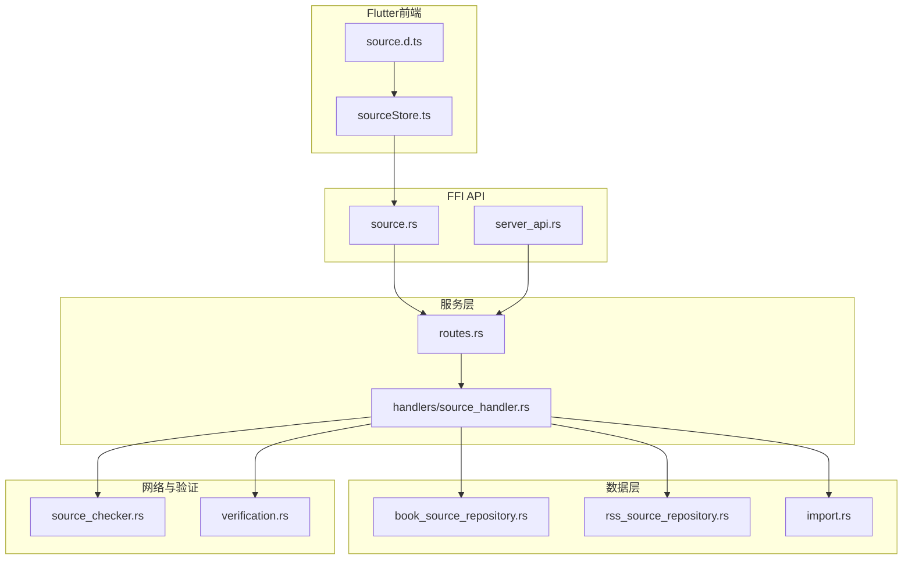

**图表来源** 
- [source.rs](file://rust/legado-ffi/src/api/source.rs)
- [server_api.rs](file://rust/legado-ffi/src/api/server_api.rs)
- [routes.rs](file://rust/legado-server/src/routes.rs)
- [handlers/source_handler.rs](file://rust/legado-server/src/handlers/source_handler.rs)
- [book_source_repository.rs](file://rust/legado-db/src/repository/book_source_repository.rs)
- [rss_source_repository.rs](file://rust/legado-db/src/repository/rss_source_repository.rs)
- [import.rs](file://rust/legado-db/src/import.rs)
- [source_checker.rs](file://rust/legado-net/src/source_checker.rs)
- [verification.rs](file://rust/legado-net/src/verification.rs)

**章节来源**
- [source.rs](file://rust/legado-ffi/src/api/source.rs)
- [server_api.rs](file://rust/legado-ffi/src/api/server_api.rs)
- [routes.rs](file://rust/legado-server/src/routes.rs)
- [handlers/source_handler.rs](file://rust/legado-server/src/handlers/source_handler.rs)
- [book_source_repository.rs](file://rust/legado-db/src/repository/book_source_repository.rs)
- [rss_source_repository.rs](file://rust/legado-db/src/repository/rss_source_repository.rs)
- [import.rs](file://rust/legado-db/src/import.rs)
- [source_checker.rs](file://rust/legado-net/src/source_checker.rs)
- [verification.rs](file://rust/legado-net/src/verification.rs)

## 核心组件
- FFI API层：对外暴露源操作的函数入口，负责参数解析、调用服务层并返回结果。
- 服务层（路由与处理器）：HTTP请求路由到具体处理器，处理器协调仓库、导入器与校验器。
- 数据仓库：BookSource与RSS Source的持久化读写。
- 导入器：统一处理JSON、URL、网络链接等格式的导入。
- 校验器：语法检查、依赖验证、兼容性测试。

**章节来源**
- [source.rs](file://rust/legado-ffi/src/api/source.rs)
- [routes.rs](file://rust/legado-server/src/routes.rs)
- [handlers/source_handler.rs](file://rust/legado-server/src/handlers/source_handler.rs)
- [book_source_repository.rs](file://rust/legado-db/src/repository/book_source_repository.rs)
- [rss_source_repository.rs](file://rust/legado-db/src/repository/rss_source_repository.rs)
- [import.rs](file://rust/legado-db/src/import.rs)
- [source_checker.rs](file://rust/legado-net/src/source_checker.rs)
- [verification.rs](file://rust/legado-net/src/verification.rs)

## 架构总览
下图展示一次“从URL导入源”的端到端调用链：前端调用FFI，FFI转发至服务端路由，处理器执行导入与校验，最终写入数据库。

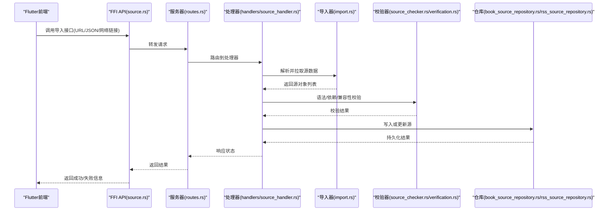

**图表来源** 
- [source.rs](file://rust/legado-ffi/src/api/source.rs)
- [routes.rs](file://rust/legado-server/src/routes.rs)
- [handlers/source_handler.rs](file://rust/legado-server/src/handlers/source_handler.rs)
- [import.rs](file://rust/legado-db/src/import.rs)
- [source_checker.rs](file://rust/legado-net/src/source_checker.rs)
- [verification.rs](file://rust/legado-net/src/verification.rs)
- [book_source_repository.rs](file://rust/legado-db/src/repository/book_source_repository.rs)
- [rss_source_repository.rs](file://rust/legado-db/src/repository/rss_source_repository.rs)

## 详细组件分析

### 源的创建（Create）
- 触发点：前端调用FFI创建接口，传入源定义（JSON字符串或对象）。
- 处理流程：
  - 参数校验与反序列化
  - 可选的语法检查与依赖验证
  - 写入对应仓库（BookSource或RSS Source）
  - 返回创建结果（ID、冲突提示等）
- 并发与事务：建议以事务包裹写入，保证一致性；对重复键进行冲突检测与合并策略。

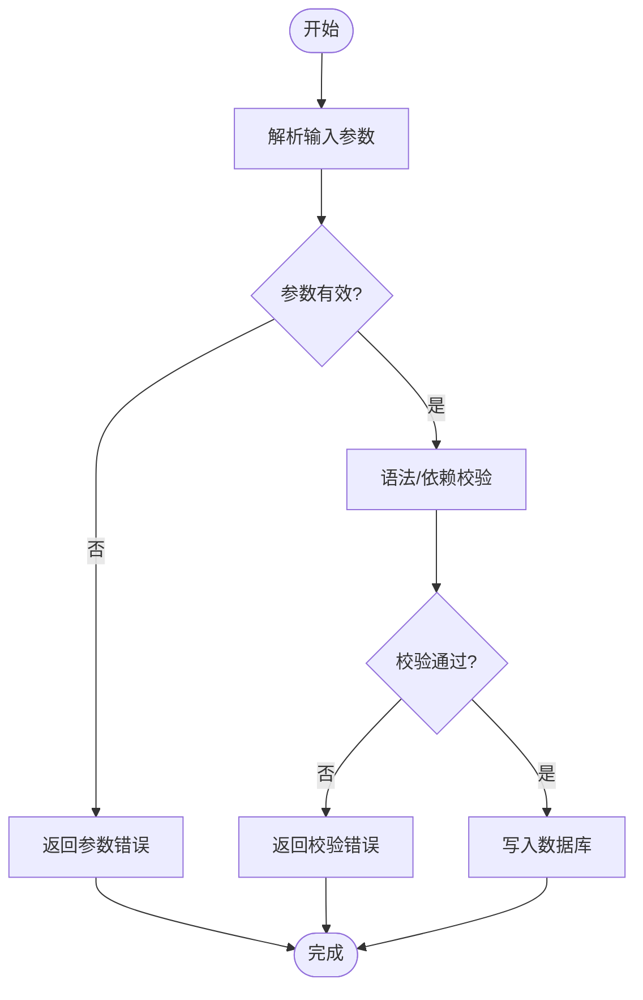

**图表来源** 
- [source.rs](file://rust/legado-ffi/src/api/source.rs)
- [handlers/source_handler.rs](file://rust/legado-server/src/handlers/source_handler.rs)
- [book_source_repository.rs](file://rust/legado-db/src/repository/book_source_repository.rs)
- [rss_source_repository.rs](file://rust/legado-db/src/repository/rss_source_repository.rs)
- [source_checker.rs](file://rust/legado-net/src/source_checker.rs)
- [verification.rs](file://rust/legado-net/src/verification.rs)

**章节来源**
- [source.rs](file://rust/legado-ffi/src/api/source.rs)
- [handlers/source_handler.rs](file://rust/legado-server/src/handlers/source_handler.rs)
- [book_source_repository.rs](file://rust/legado-db/src/repository/book_source_repository.rs)
- [rss_source_repository.rs](file://rust/legado-db/src/repository/rss_source_repository.rs)
- [source_checker.rs](file://rust/legado-net/src/source_checker.rs)
- [verification.rs](file://rust/legado-net/src/verification.rs)

### 源的读取（Read）
- 支持按ID查询、条件过滤、分页与排序。
- 可返回完整源定义或摘要信息。
- 缓存策略：热点源可短期缓存，避免频繁DB访问。

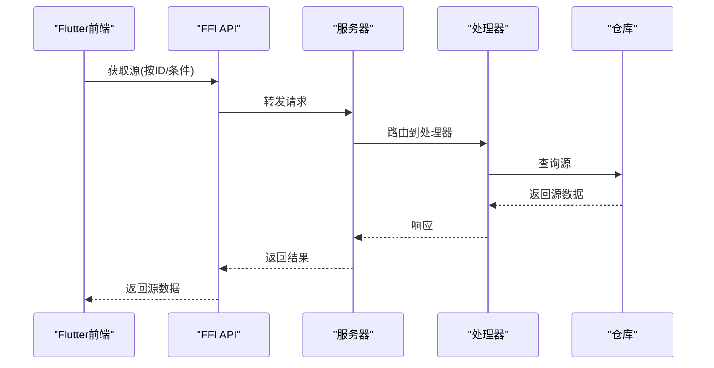

**图表来源** 
- [source.rs](file://rust/legado-ffi/src/api/source.rs)
- [routes.rs](file://rust/legado-server/src/routes.rs)
- [handlers/source_handler.rs](file://rust/legado-server/src/handlers/source_handler.rs)
- [book_source_repository.rs](file://rust/legado-db/src/repository/book_source_repository.rs)
- [rss_source_repository.rs](file://rust/legado-db/src/repository/rss_source_repository.rs)

**章节来源**
- [source.rs](file://rust/legado-ffi/src/api/source.rs)
- [handlers/source_handler.rs](file://rust/legado-server/src/handlers/source_handler.rs)
- [book_source_repository.rs](file://rust/legado-db/src/repository/book_source_repository.rs)
- [rss_source_repository.rs](file://rust/legado-db/src/repository/rss_source_repository.rs)

### 源的更新（Update）
- 支持增量更新与全量替换两种模式。
- 更新前进行版本与兼容性检查，必要时触发迁移或回滚。
- 并发控制：使用锁或版本号防止覆盖写。

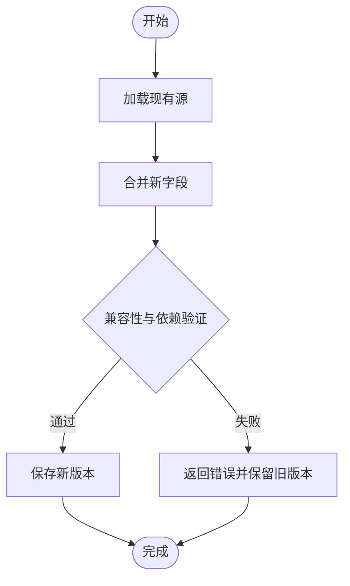

**图表来源** 
- [handlers/source_handler.rs](file://rust/legado-server/src/handlers/source_handler.rs)
- [book_source_repository.rs](file://rust/legado-db/src/repository/book_source_repository.rs)
- [rss_source_repository.rs](file://rust/legado-db/src/repository/rss_source_repository.rs)
- [verification.rs](file://rust/legado-net/src/verification.rs)

**章节来源**
- [handlers/source_handler.rs](file://rust/legado-server/src/handlers/source_handler.rs)
- [book_source_repository.rs](file://rust/legado-db/src/repository/book_source_repository.rs)
- [rss_source_repository.rs](file://rust/legado-db/src/repository/rss_source_repository.rs)
- [verification.rs](file://rust/legado-net/src/verification.rs)

### 源的删除（Delete）
- 支持软删除与硬删除策略。
- 删除前检查引用关系（如订阅、收藏），必要时级联清理或拒绝删除。
- 记录审计日志以便恢复。

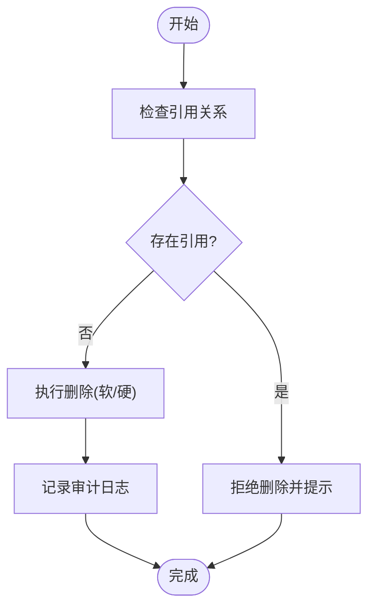

**图表来源** 
- [handlers/source_handler.rs](file://rust/legado-server/src/handlers/source_handler.rs)
- [book_source_repository.rs](file://rust/legado-db/src/repository/book_source_repository.rs)
- [rss_source_repository.rs](file://rust/legado-db/src/repository/rss_source_repository.rs)

**章节来源**
- [handlers/source_handler.rs](file://rust/legado-server/src/handlers/source_handler.rs)
- [book_source_repository.rs](file://rust/legado-db/src/repository/book_source_repository.rs)
- [rss_source_repository.rs](file://rust/legado-db/src/repository/rss_source_repository.rs)

### 导入功能（Import）
- 支持的来源：
  - JSON文件：本地文件或上传的JSON内容
  - URL：远程JSON或脚本地址
  - 网络链接：直接的网络资源链接
- 处理步骤：
  - 拉取数据（网络请求、重试、超时控制）
  - 解析与标准化（统一为内部模型）
  - 校验（语法、依赖、兼容性）
  - 写入数据库（批量插入/更新）
  - 返回导入报告（成功数、失败数、错误详情）

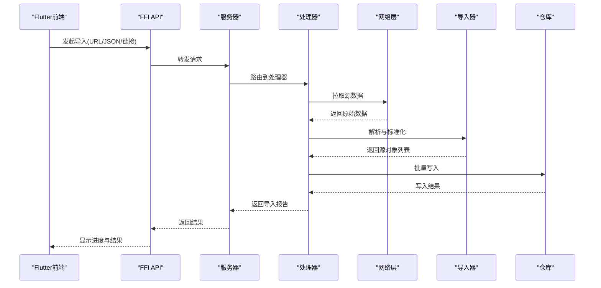

**图表来源** 
- [source.rs](file://rust/legado-ffi/src/api/source.rs)
- [routes.rs](file://rust/legado-server/src/routes.rs)
- [handlers/source_handler.rs](file://rust/legado-server/src/handlers/source_handler.rs)
- [import.rs](file://rust/legado-db/src/import.rs)
- [book_source_repository.rs](file://rust/legado-db/src/repository/book_source_repository.rs)
- [rss_source_repository.rs](file://rust/legado-db/src/repository/rss_source_repository.rs)

**章节来源**
- [source.rs](file://rust/legado-ffi/src/api/source.rs)
- [handlers/source_handler.rs](file://rust/legado-server/src/handlers/source_handler.rs)
- [import.rs](file://rust/legado-db/src/import.rs)
- [book_source_repository.rs](file://rust/legado-db/src/repository/book_source_repository.rs)
- [rss_source_repository.rs](file://rust/legado-db/src/repository/rss_source_repository.rs)

### 导出功能（Export）
- 单个源导出：按ID导出指定源的完整定义。
- 批量导出：按条件筛选多个源，输出统一格式（JSON或压缩包）。
- 导出格式：包含元数据、规则、依赖声明与版本信息。

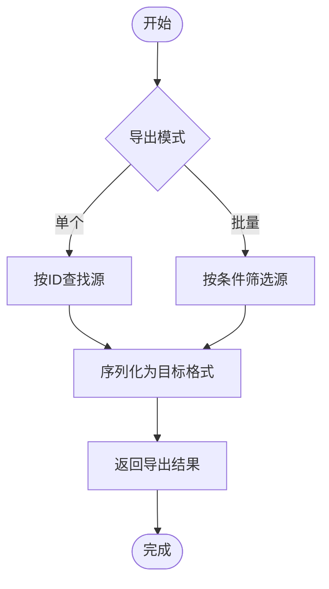

**图表来源** 
- [handlers/source_handler.rs](file://rust/legado-server/src/handlers/source_handler.rs)
- [book_source_repository.rs](file://rust/legado-db/src/repository/book_source_repository.rs)
- [rss_source_repository.rs](file://rust/legado-db/src/repository/rss_source_repository.rs)

**章节来源**
- [handlers/source_handler.rs](file://rust/legado-server/src/handlers/source_handler.rs)
- [book_source_repository.rs](file://rust/legado-db/src/repository/book_source_repository.rs)
- [rss_source_repository.rs](file://rust/legado-db/src/repository/rss_source_repository.rs)

### 验证机制（Validation）
- 语法检查：解析源定义中的表达式与模板，确保语法正确。
- 依赖验证：检查外部依赖是否可用、版本是否兼容。
- 兼容性测试：在不同环境或版本下模拟运行关键路径，确保行为一致。

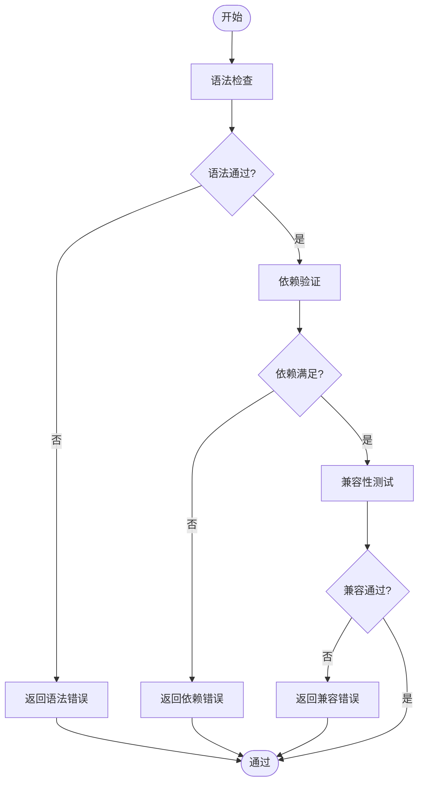

**图表来源** 
- [source_checker.rs](file://rust/legado-net/src/source_checker.rs)
- [verification.rs](file://rust/legado-net/src/verification.rs)

**章节来源**
- [source_checker.rs](file://rust/legado-net/src/source_checker.rs)
- [verification.rs](file://rust/legado-net/src/verification.rs)

### 异步处理与错误恢复
- 异步模式：长耗时操作（导入、校验、网络拉取）采用协程或任务队列，避免阻塞主线程。
- 错误恢复：
  - 重试策略：指数退避与最大重试次数
  - 部分成功：导入时记录失败项，允许继续处理其余项
  - 回滚机制：事务失败自动回滚，保证数据一致性
- 进度反馈：前端轮询或WebSocket推送进度与结果。

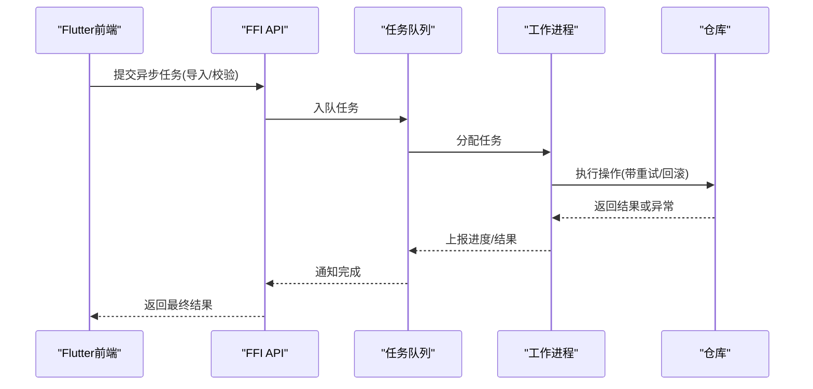

**图表来源** 
- [source.rs](file://rust/legado-ffi/src/api/source.rs)
- [handlers/source_handler.rs](file://rust/legado-server/src/handlers/source_handler.rs)
- [book_source_repository.rs](file://rust/legado-db/src/repository/book_source_repository.rs)
- [rss_source_repository.rs](file://rust/legado-db/src/repository/rss_source_repository.rs)

**章节来源**
- [source.rs](file://rust/legado-ffi/src/api/source.rs)
- [handlers/source_handler.rs](file://rust/legado-server/src/handlers/source_handler.rs)
- [book_source_repository.rs](file://rust/legado-db/src/repository/book_source_repository.rs)
- [rss_source_repository.rs](file://rust/legado-db/src/repository/rss_source_repository.rs)

## 依赖关系分析
- FFI API依赖服务器路由与处理器，处理器依赖仓库、导入器与校验器。
- 仓库模块解耦BookSource与RSS Source，便于扩展与维护。
- 网络校验模块独立于业务逻辑，便于复用与测试。

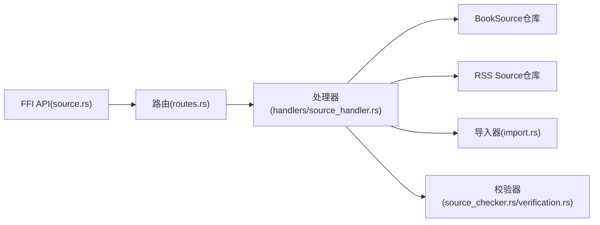

**图表来源** 
- [source.rs](file://rust/legado-ffi/src/api/source.rs)
- [routes.rs](file://rust/legado-server/src/routes.rs)
- [handlers/source_handler.rs](file://rust/legado-server/src/handlers/source_handler.rs)
- [book_source_repository.rs](file://rust/legado-db/src/repository/book_source_repository.rs)
- [rss_source_repository.rs](file://rust/legado-db/src/repository/rss_source_repository.rs)
- [import.rs](file://rust/legado-db/src/import.rs)
- [source_checker.rs](file://rust/legado-net/src/source_checker.rs)
- [verification.rs](file://rust/legado-net/src/verification.rs)

**章节来源**
- [source.rs](file://rust/legado-ffi/src/api/source.rs)
- [routes.rs](file://rust/legado-server/src/routes.rs)
- [handlers/source_handler.rs](file://rust/legado-server/src/handlers/source_handler.rs)
- [book_source_repository.rs](file://rust/legado-db/src/repository/book_source_repository.rs)
- [rss_source_repository.rs](file://rust/legado-db/src/repository/rss_source_repository.rs)
- [import.rs](file://rust/legado-db/src/import.rs)
- [source_checker.rs](file://rust/legado-net/src/source_checker.rs)
- [verification.rs](file://rust/legado-net/src/verification.rs)

## 性能考量
- 批量操作：导入与导出尽量使用批量接口，减少往返开销。
- 缓存热点：对常用源的读取结果进行短期缓存。
- 连接池：网络请求使用连接池与超时配置，避免资源耗尽。
- 异步处理：将耗时任务放入后台队列，提升响应速度。

[本节为通用指导，不直接分析具体文件]

## 故障排查指南
- 常见问题：
  - 导入失败：检查网络连通性、URL可达性与JSON格式
  - 校验失败：查看语法错误与依赖缺失信息
  - 更新冲突：确认版本与唯一键冲突策略
- 调试建议：
  - 启用详细日志，定位错误堆栈
  - 使用单元测试复现问题
  - 逐步禁用校验步骤，缩小问题范围

**章节来源**
- [source_checker.rs](file://rust/legado-net/src/source_checker.rs)
- [verification.rs](file://rust/legado-net/src/verification.rs)
- [handlers/source_handler.rs](file://rust/legado-server/src/handlers/source_handler.rs)

## 结论
通过对源CRUD、导入导出、验证机制与异步处理的系统分析，Legado提供了稳定、可扩展且高性能的源管理能力。建议在集成时遵循事务与重试策略，充分利用批量接口与缓存优化，以获得更好的用户体验与系统稳定性。

[本节为总结性内容，不直接分析具体文件]

## 附录
- Flutter前端调用示例（概念性说明）：
  - 创建源：调用FFI接口传入源定义对象
  - 读取源：按ID或条件查询
  - 更新源：提交增量或全量更新
  - 删除源：按ID删除并处理引用
  - 导入源：选择JSON/URL/网络链接并监控进度
  - 导出源：单个或批量导出为JSON或压缩包

[本节为概念性说明，不直接分析具体文件]