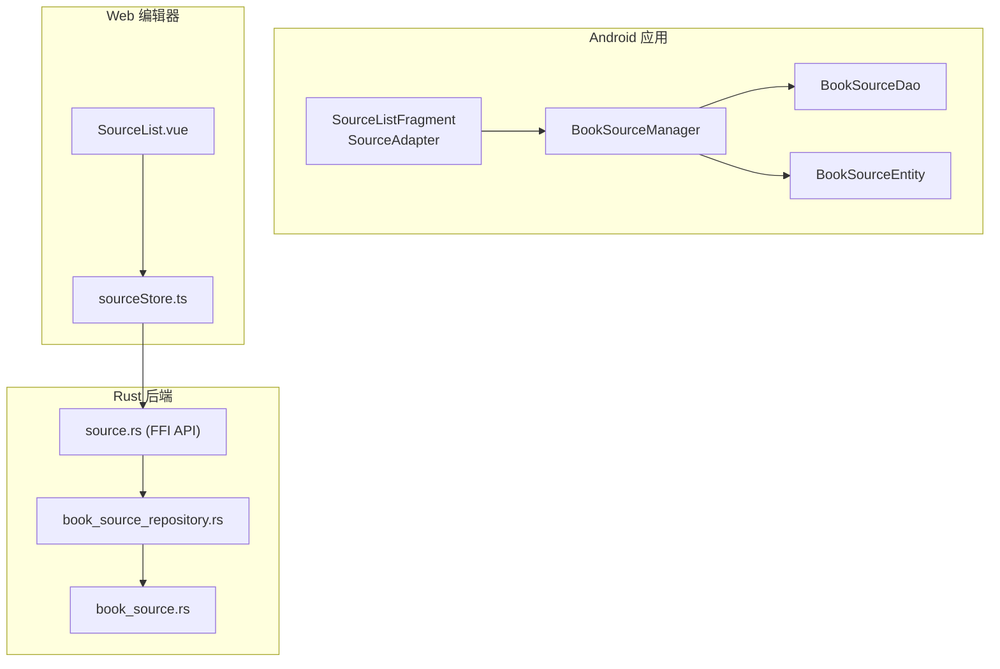
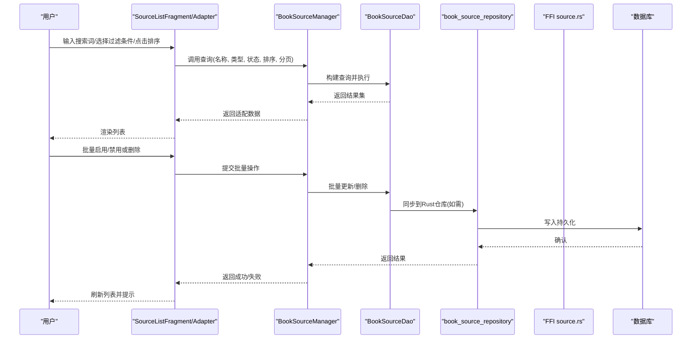
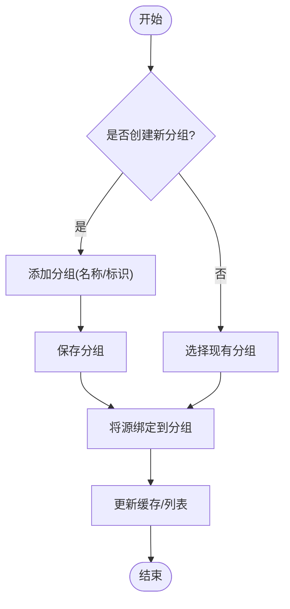
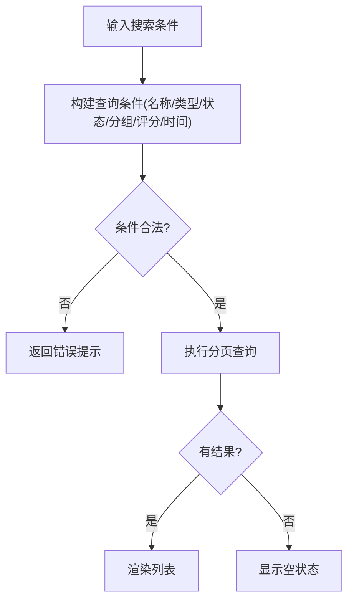
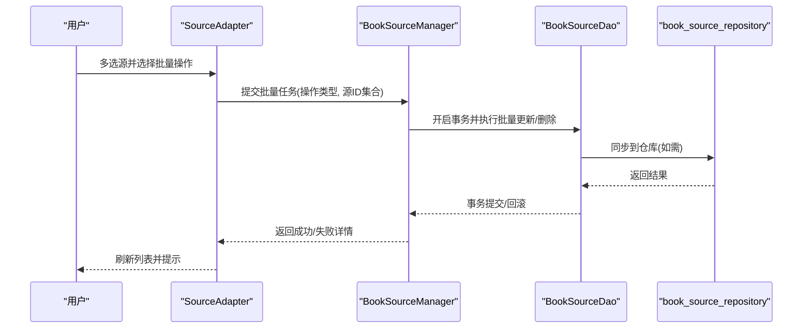
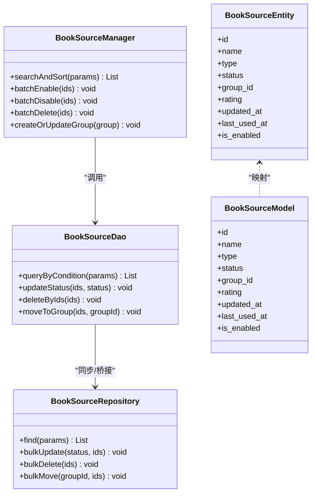
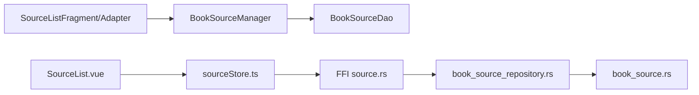

# 源的管理功能

<cite>
**本文引用的文件**   
- [app/src/main/java/io/legado/app/ui/source/SourceListFragment.kt](file://app/src/main/java/io/legado/app/ui/source/SourceListFragment.kt)
- [app/src/main/java/io/legado/app/ui/source/adapter/SourceAdapter.kt](file://app/src/main/java/io/legado/app/ui/source/adapter/SourceAdapter.kt)
- [app/src/main/java/io/legado/app/model/BookSourceManager.kt](file://app/src/main/java/io/legado/app/model/BookSourceManager.kt)
- [app/src/main/java/io/legado/app/data/entities/BookSourceEntity.kt](file://app/src/main/java/io/legado/app/data/entities/BookSourceEntity.kt)
- [app/src/main/java/io/legado/app/data/dao/BookSourceDao.kt](file://app/src/main/java/io/legado/app/data/dao/BookSourceDao.kt)
- [modules/web/src/pages/source/SourceList.vue](file://modules/web/src/pages/source/SourceList.vue)
- [modules/web/src/store/sourceStore.ts](file://modules/web/src/store/sourceStore.ts)
- [rust/legado-core/src/models/book_source.rs](file://rust/legado-core/src/models/book_source.rs)
- [rust/legado-db/src/repository/book_source_repository.rs](file://rust/legado-db/src/repository/book_source_repository.rs)
- [rust/legado-ffi/src/api/source.rs](file://rust/legado-ffi/src/api/source.rs)
</cite>

## 目录
1. [简介](#简介)
2. [项目结构](#项目结构)
3. [核心组件](#核心组件)
4. [架构总览](#架构总览)
5. [详细组件分析](#详细组件分析)
6. [依赖关系分析](#依赖关系分析)
7. [性能考虑](#性能考虑)
8. [故障排查指南](#故障排查指南)
9. [结论](#结论)
10. [附录](#附录)

## 简介
本文件面向Legado项目的“源管理”能力，系统性阐述源的分类与分组、自定义分类创建与管理、搜索与过滤（按名称、类型、状态等）、排序（更新时间、使用频率、评分等）、批量操作（启用/禁用、删除等）、权限控制（只读模式、编辑权限、访问限制），以及最佳实践与性能优化建议。文档基于Android端、Web端与Rust后端的数据模型、仓库与API进行综合说明，帮助开发者与高级用户高效管理与维护源。

## 项目结构
源管理涉及三层：
- Android UI层：列表展示、筛选、排序、批量操作入口与交互。
- Web编辑器层：在线编辑与管理的界面与状态管理。
- Rust后端层：数据模型、持久化仓库与对外API。

图表来源 
- [app/src/main/java/io/legado/app/ui/source/SourceListFragment.kt](file://app/src/main/java/io/legado/app/ui/source/SourceListFragment.kt)
- [app/src/main/java/io/legado/app/ui/source/adapter/SourceAdapter.kt](file://app/src/main/java/io/legado/app/ui/source/adapter/SourceAdapter.kt)
- [app/src/main/java/io/legado/app/model/BookSourceManager.kt](file://app/src/main/java/io/legado/app/model/BookSourceManager.kt)
- [app/src/main/java/io/legado/app/data/entities/BookSourceEntity.kt](file://app/src/main/java/io/legado/app/data/entities/BookSourceEntity.kt)
- [app/src/main/java/io/legado/app/data/dao/BookSourceDao.kt](file://app/src/main/java/io/legado/app/data/dao/BookSourceDao.kt)
- [modules/web/src/pages/source/SourceList.vue](file://modules/web/src/pages/source/SourceList.vue)
- [modules/web/src/store/sourceStore.ts](file://modules/web/src/store/sourceStore.ts)
- [rust/legado-core/src/models/book_source.rs](file://rust/legado-core/src/models/book_source.rs)
- [rust/legado-db/src/repository/book_source_repository.rs](file://rust/legado-db/src/repository/book_source_repository.rs)
- [rust/legado-ffi/src/api/source.rs](file://rust/legado-ffi/src/api/source.rs)

章节来源
- [app/src/main/java/io/legado/app/ui/source/SourceListFragment.kt](file://app/src/main/java/io/legado/app/ui/source/SourceListFragment.kt)
- [app/src/main/java/io/legado/app/ui/source/adapter/SourceAdapter.kt](file://app/src/main/java/io/legado/app/ui/source/adapter/SourceAdapter.kt)
- [app/src/main/java/io/legado/app/model/BookSourceManager.kt](file://app/src/main/java/io/legado/app/model/BookSourceManager.kt)
- [app/src/main/java/io/legado/app/data/entities/BookSourceEntity.kt](file://app/src/main/java/io/legado/app/data/entities/BookSourceEntity.kt)
- [app/src/main/java/io/legado/app/data/dao/BookSourceDao.kt](file://app/src/main/java/io/legado/app/data/dao/BookSourceDao.kt)
- [modules/web/src/pages/source/SourceList.vue](file://modules/web/src/pages/source/SourceList.vue)
- [modules/web/src/store/sourceStore.ts](file://modules/web/src/store/sourceStore.ts)
- [rust/legado-core/src/models/book_source.rs](file://rust/legado-core/src/models/book_source.rs)
- [rust/legado-db/src/repository/book_source_repository.rs](file://rust/legado-db/src/repository/book_source_repository.rs)
- [rust/legado-ffi/src/api/source.rs](file://rust/legado-ffi/src/api/source.rs)

## 核心组件
- 数据模型与实体
  - BookSourceEntity：Android侧的源实体，包含名称、类型、状态、分组、评分、更新时间等字段，用于UI展示与本地缓存。
  - book_source.rs：Rust侧的源模型定义，承载核心字段与校验逻辑，作为跨平台数据契约。
- 数据访问层
  - BookSourceDao：Android侧DAO，提供CRUD、分页、条件查询、排序等操作接口。
  - book_source_repository.rs：Rust仓库层，封装对SQLite/存储的读写，统一事务与错误处理。
- 业务管理层
  - BookSourceManager：Android侧管理器，聚合DAO与业务规则，负责分组、启用/禁用、导入导出、统计更新等。
- 前端展示与交互
  - SourceListFragment + SourceAdapter：Android端源列表页与适配器，实现搜索、过滤、排序、批量选择与操作。
  - SourceList.vue + sourceStore.ts：Web端源列表页面与状态管理，对接Rust FFI API完成增删改查与批量操作。
- 外部接口
  - source.rs：Rust FFI API，暴露给Android与Web调用，统一参数校验与返回格式。

章节来源
- [app/src/main/java/io/legado/app/data/entities/BookSourceEntity.kt](file://app/src/main/java/io/legado/app/data/entities/BookSourceEntity.kt)
- [rust/legado-core/src/models/book_source.rs](file://rust/legado-core/src/models/book_source.rs)
- [app/src/main/java/io/legado/app/data/dao/BookSourceDao.kt](file://app/src/main/java/io/legado/app/data/dao/BookSourceDao.kt)
- [rust/legado-db/src/repository/book_source_repository.rs](file://rust/legado-db/src/repository/book_source_repository.rs)
- [app/src/main/java/io/legado/app/model/BookSourceManager.kt](file://app/src/main/java/io/legado/app/model/BookSourceManager.kt)
- [app/src/main/java/io/legado/app/ui/source/SourceListFragment.kt](file://app/src/main/java/io/legado/app/ui/source/SourceListFragment.kt)
- [app/src/main/java/io/legado/app/ui/source/adapter/SourceAdapter.kt](file://app/src/main/java/io/legado/app/ui/source/adapter/SourceAdapter.kt)
- [modules/web/src/pages/source/SourceList.vue](file://modules/web/src/pages/source/SourceList.vue)
- [modules/web/src/store/sourceStore.ts](file://modules/web/src/store/sourceStore.ts)
- [rust/legado-ffi/src/api/source.rs](file://rust/legado-ffi/src/api/source.rs)

## 架构总览
源管理采用分层架构：UI层通过管理器或Store发起请求，经DAO/仓库层访问持久化，最终由Rust FFI API统一对外暴露。

图表来源 
- [app/src/main/java/io/legado/app/ui/source/SourceListFragment.kt](file://app/src/main/java/io/legado/app/ui/source/SourceListFragment.kt)
- [app/src/main/java/io/legado/app/ui/source/adapter/SourceAdapter.kt](file://app/src/main/java/io/legado/app/ui/source/adapter/SourceAdapter.kt)
- [app/src/main/java/io/legado/app/model/BookSourceManager.kt](file://app/src/main/java/io/legado/app/model/BookSourceManager.kt)
- [app/src/main/java/io/legado/app/data/dao/BookSourceDao.kt](file://app/src/main/java/io/legado/app/data/dao/BookSourceDao.kt)
- [rust/legado-db/src/repository/book_source_repository.rs](file://rust/legado-db/src/repository/book_source_repository.rs)
- [rust/legado-ffi/src/api/source.rs](file://rust/legado-ffi/src/api/source.rs)

## 详细组件分析

### 分类与分组管理
- 分组概念
  - 源可按分组组织，支持内置分组与自定义分组。分组字段通常与源实体关联，便于列表快速筛选与导航。
- 自定义分类创建与管理
  - 在Android端，可通过管理器新增分组、重命名、删除分组；在Web端通过Store调用FFI接口完成相同操作。
  - 分组变更会触发列表刷新与缓存更新。
- 分组与源的绑定
  - 源实体包含分组ID或名称，支持将多个源归入同一分组；移动源至其他分组时，需保证分组存在且有效。

章节来源
- [app/src/main/java/io/legado/app/data/entities/BookSourceEntity.kt](file://app/src/main/java/io/legado/app/data/entities/BookSourceEntity.kt)
- [app/src/main/java/io/legado/app/model/BookSourceManager.kt](file://app/src/main/java/io/legado/app/model/BookSourceManager.kt)
- [modules/web/src/store/sourceStore.ts](file://modules/web/src/store/sourceStore.ts)

### 搜索与过滤
- 支持的筛选维度
  - 名称：模糊匹配，支持大小写不敏感。
  - 类型：如小说源、RSS源等，按枚举值精确匹配。
  - 状态：启用/禁用/已失效等状态筛选。
  - 分组：按分组ID或名称筛选。
  - 评分与更新时间：范围筛选或阈值过滤。
- 实现要点
  - Android端通过DAO组合查询条件，避免全表扫描；Web端通过Store构造查询参数后调用FFI接口。
  - 搜索结果应支持分页加载，减少首屏压力。

章节来源
- [app/src/main/java/io/legado/app/data/dao/BookSourceDao.kt](file://app/src/main/java/io/legado/app/data/dao/BookSourceDao.kt)
- [modules/web/src/store/sourceStore.ts](file://modules/web/src/store/sourceStore.ts)
- [rust/legado-db/src/repository/book_source_repository.rs](file://rust/legado-db/src/repository/book_source_repository.rs)

### 排序选项
- 可用排序维度
  - 更新时间：最近修改或最近使用的源优先。
  - 使用频率：根据读取次数或最近访问时间排序。
  - 评分：按用户评分从高到低或从低到高。
  - 名称：字母顺序或拼音排序。
- 排序策略
  - 默认按更新时间降序；用户可切换为使用频率或评分排序。
  - 排序字段需在DAO与仓库层支持，确保索引命中以提升性能。

章节来源
- [app/src/main/java/io/legado/app/data/dao/BookSourceDao.kt](file://app/src/main/java/io/legado/app/data/dao/BookSourceDao.kt)
- [rust/legado-db/src/repository/book_source_repository.rs](file://rust/legado-db/src/repository/book_source_repository.rs)

### 批量操作
- 支持的操作
  - 批量启用/禁用：选中多个源，统一更改状态。
  - 批量删除：移除选中的源，必要时清理关联数据。
  - 批量移动分组：将多个源移动到目标分组。
- 操作流程
  - 用户在列表中选择多个项，确认后提交批量任务；后端以事务方式执行，保证一致性。
  - 失败回滚与部分成功场景需明确提示。

章节来源
- [app/src/main/java/io/legado/app/ui/source/adapter/SourceAdapter.kt](file://app/src/main/java/io/legado/app/ui/source/adapter/SourceAdapter.kt)
- [app/src/main/java/io/legado/app/model/BookSourceManager.kt](file://app/src/main/java/io/legado/app/model/BookSourceManager.kt)
- [app/src/main/java/io/legado/app/data/dao/BookSourceDao.kt](file://app/src/main/java/io/legado/app/data/dao/BookSourceDao.kt)
- [rust/legado-db/src/repository/book_source_repository.rs](file://rust/legado-db/src/repository/book_source_repository.rs)

### 权限控制
- 只读模式
  - 当应用处于只读模式时，禁止任何写操作（新增、编辑、删除、批量操作）；仅允许查询与浏览。
- 编辑权限
  - 管理员或拥有编辑权限的用户才能执行写操作；普通用户仅能查看与筛选。
- 访问限制
  - 可通过分组或标签限制特定源的可见性；未授权用户无法看到受限源。
- 实现建议
  - 在管理器层集中校验权限，拦截非法操作；在DAO与仓库层做二次校验，确保安全。

章节来源
- [app/src/main/java/io/legado/app/model/BookSourceManager.kt](file://app/src/main/java/io/legado/app/model/BookSourceManager.kt)
- [rust/legado-ffi/src/api/source.rs](file://rust/legado-ffi/src/api/source.rs)

### 数据模型与类关系

图表来源 
- [app/src/main/java/io/legado/app/data/entities/BookSourceEntity.kt](file://app/src/main/java/io/legado/app/data/entities/BookSourceEntity.kt)
- [app/src/main/java/io/legado/app/data/dao/BookSourceDao.kt](file://app/src/main/java/io/legado/app/data/dao/BookSourceDao.kt)
- [app/src/main/java/io/legado/app/model/BookSourceManager.kt](file://app/src/main/java/io/legado/app/model/BookSourceManager.kt)
- [rust/legado-db/src/repository/book_source_repository.rs](file://rust/legado-db/src/repository/book_source_repository.rs)
- [rust/legado-core/src/models/book_source.rs](file://rust/legado-core/src/models/book_source.rs)

## 依赖关系分析
- Android端依赖
  - SourceListFragment/Adapter依赖BookSourceManager进行业务编排；Manager依赖DAO进行数据访问。
- Web端依赖
  - SourceList.vue依赖sourceStore进行状态管理；Store调用Rust FFI API获取/更新数据。
- Rust后端依赖
  - FFI API依赖仓库层，仓库层依赖数据模型与持久化存储。

图表来源 
- [app/src/main/java/io/legado/app/ui/source/SourceListFragment.kt](file://app/src/main/java/io/legado/app/ui/source/SourceListFragment.kt)
- [app/src/main/java/io/legado/app/ui/source/adapter/SourceAdapter.kt](file://app/src/main/java/io/legado/app/ui/source/adapter/SourceAdapter.kt)
- [app/src/main/java/io/legado/app/model/BookSourceManager.kt](file://app/src/main/java/io/legado/app/model/BookSourceManager.kt)
- [app/src/main/java/io/legado/app/data/dao/BookSourceDao.kt](file://app/src/main/java/io/legado/app/data/dao/BookSourceDao.kt)
- [modules/web/src/pages/source/SourceList.vue](file://modules/web/src/pages/source/SourceList.vue)
- [modules/web/src/store/sourceStore.ts](file://modules/web/src/store/sourceStore.ts)
- [rust/legado-ffi/src/api/source.rs](file://rust/legado-ffi/src/api/source.rs)
- [rust/legado-db/src/repository/book_source_repository.rs](file://rust/legado-db/src/repository/book_source_repository.rs)
- [rust/legado-core/src/models/book_source.rs](file://rust/legado-core/src/models/book_source.rs)

## 性能考虑
- 查询优化
  - 合理使用索引：名称、类型、状态、分组ID、更新时间、评分等常用筛选字段建立索引。
  - 分页加载：默认每页固定数量，避免一次性加载大量数据。
  - 懒加载与虚拟列表：在UI层使用RecyclerView/虚拟滚动提升渲染性能。
- 批量操作
  - 使用事务批量更新/删除，减少IO次数；分批次提交，避免单次事务过大导致超时。
- 缓存策略
  - 对热点分组与常用筛选结果进行短期缓存，设置合理TTL。
- 网络与FFI
  - Web端调用FFI接口时合并请求，减少往返次数；对大结果集采用流式返回。

[本节为通用性能建议，不直接分析具体文件]

## 故障排查指南
- 常见问题
  - 搜索无结果：检查筛选条件是否过于严格；确认索引是否存在；验证名称匹配规则。
  - 批量操作失败：查看事务日志；确认权限与只读模式；检查数据一致性。
  - 列表卡顿：检查分页大小与渲染性能；启用虚拟化与按需加载。
- 定位方法
  - 在管理器层增加日志输出，记录查询条件与返回条数。
  - 在DAO与仓库层打印SQL与执行计划，确认索引命中。
  - Web端检查Store状态变化与FFI返回码。

章节来源
- [app/src/main/java/io/legado/app/model/BookSourceManager.kt](file://app/src/main/java/io/legado/app/model/BookSourceManager.kt)
- [app/src/main/java/io/legado/app/data/dao/BookSourceDao.kt](file://app/src/main/java/io/legado/app/data/dao/BookSourceDao.kt)
- [rust/legado-db/src/repository/book_source_repository.rs](file://rust/legado-db/src/repository/book_source_repository.rs)
- [modules/web/src/store/sourceStore.ts](file://modules/web/src/store/sourceStore.ts)

## 结论
源管理功能通过清晰的层次结构与统一的FFI接口，实现了分类分组、搜索过滤、排序、批量操作与权限控制的完整闭环。建议在开发中注重索引设计、分页与缓存策略，确保大规模源数据下的流畅体验。同时，完善权限校验与错误提示，提升系统的健壮性与可维护性。

## 附录
- 最佳实践
  - 分组命名规范：使用简洁明确的中文或英文命名，避免特殊字符。
  - 筛选条件组合：优先使用高选择性字段（如名称、类型）缩小结果集。
  - 批量操作分批：超过一定数量的操作拆分为多批提交，降低失败风险。
  - 权限最小化：默认只读，按需授予编辑权限。
- 扩展方向
  - 引入标签系统：与分组互补，支持多维度归类。
  - 增强统计指标：采集更多使用行为数据，优化推荐与排序。
  - 国际化支持：源名称与分组名称的多语言展示。

[本节为通用指导，不直接分析具体文件]