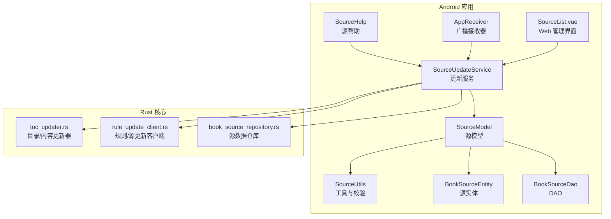
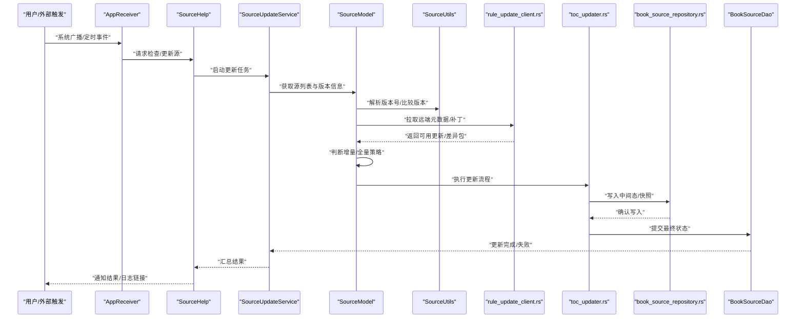
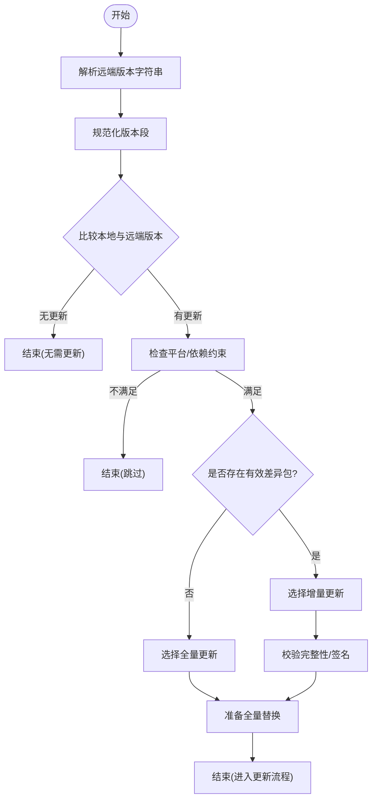
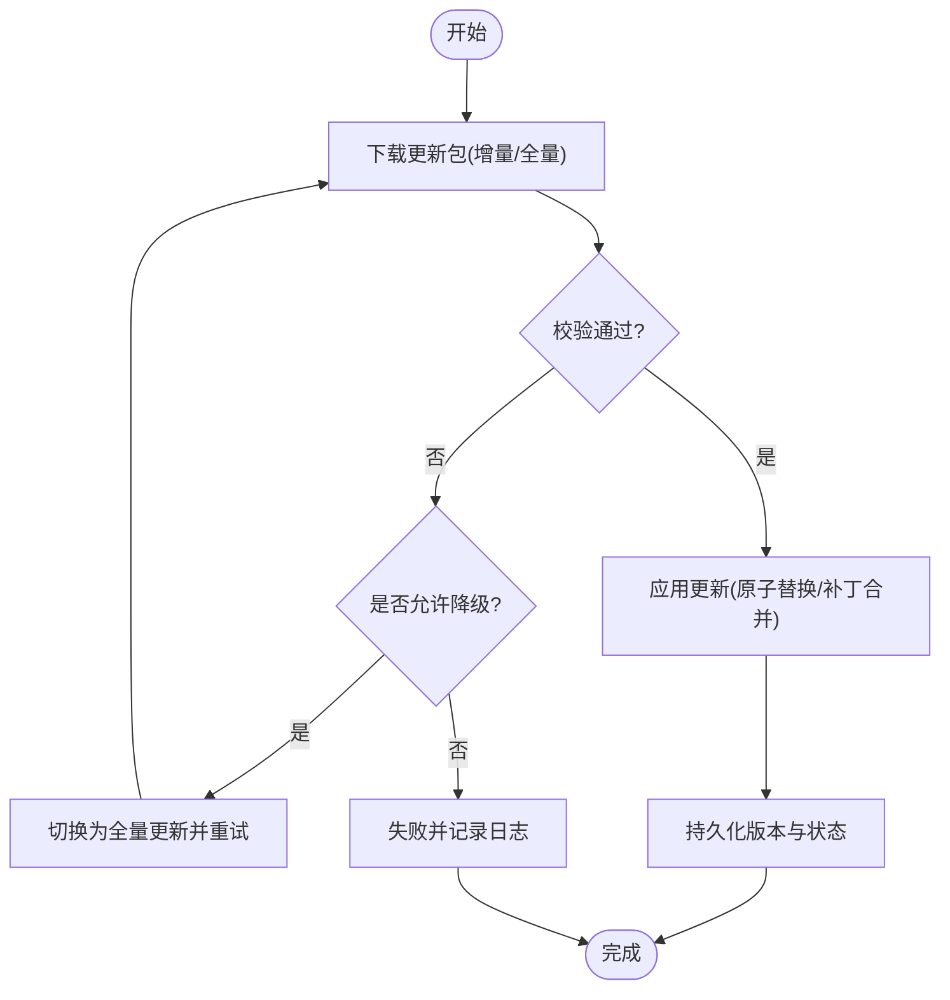
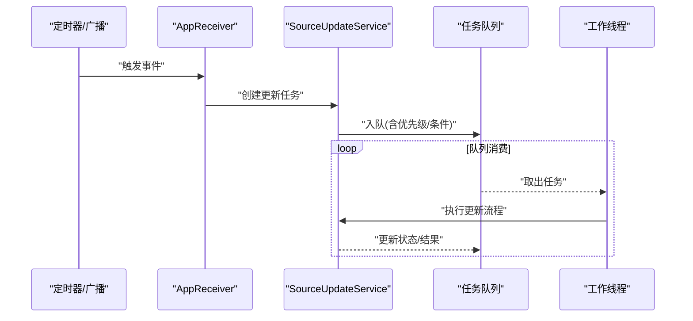
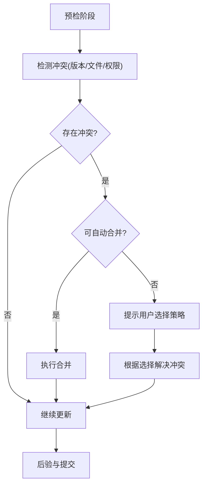
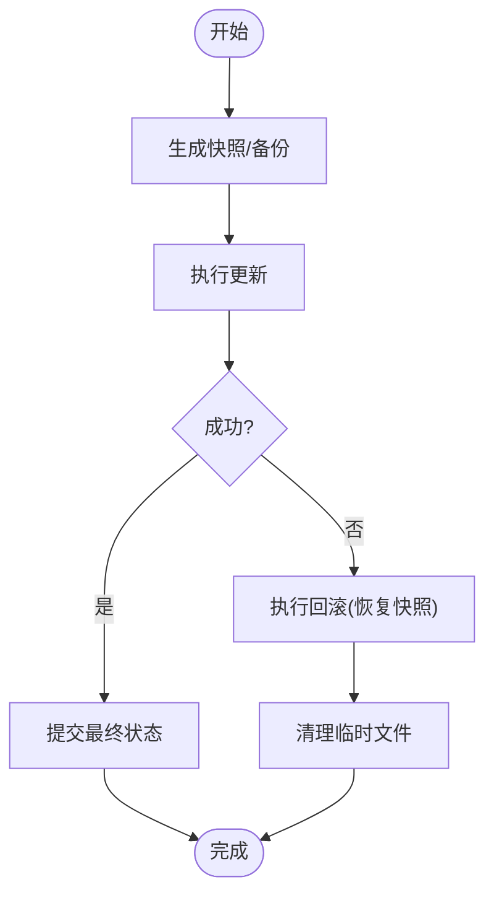
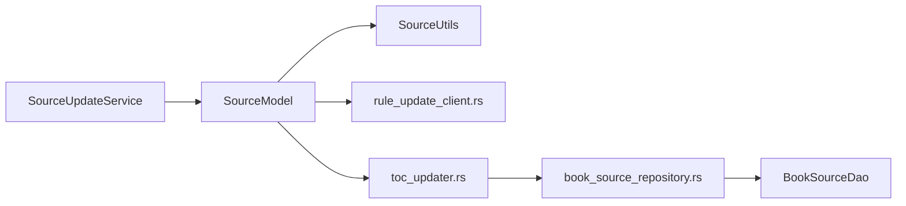

# 源的自动更新机制

<cite>
**本文引用的文件**   
- [app/src/main/java/io/legado/app/help/source/SourceHelp.kt](file://app/src/main/java/io/legado/app/help/source/SourceHelp.kt)
- [app/src/main/java/io/legado/app/service/SourceUpdateService.kt](file://app/src/main/java/io/legado/app/service/SourceUpdateService.kt)
- [app/src/main/java/io/legado/app/model/source/SourceModel.kt](file://app/src/main/java/io/legado/app/model/source/SourceModel.kt)
- [app/src/main/java/io/legado/app/utils/SourceUtils.kt](file://app/src/main/java/io/legado/app/utils/SourceUtils.kt)
- [app/src/main/java/io/legado/app/data/entity/BookSourceEntity.kt](file://app/src/main/java/io/legado/app/data/entity/BookSourceEntity.kt)
- [app/src/main/java/io/legado/app/data/dao/BookSourceDao.kt](file://app/src/main/java/io/legado/app/data/dao/BookSourceDao.kt)
- [app/src/main/java/io/legado/app/receiver/AppReceiver.kt](file://app/src/main/java/io/legado/app/receiver/AppReceiver.kt)
- [modules/web/src/pages/source/SourceList.vue](file://modules/web/src/pages/source/SourceList.vue)
- [rust/legado-core/src/toc_updater.rs](file://rust/legado-core/src/toc_updater.rs)
- [rust/legado-net/src/rule_update_client.rs](file://rust/legado-net/src/rule_update_client.rs)
- [rust/legado-db/src/repository/book_source_repository.rs](file://rust/legado-db/src/repository/book_source_repository.rs)
</cite>

## 目录
1. [简介](#简介)
2. [项目结构](#项目结构)
3. [核心组件](#核心组件)
4. [架构总览](#架构总览)
5. [详细组件分析](#详细组件分析)
6. [依赖关系分析](#依赖关系分析)
7. [性能考量](#性能考量)
8. [故障排查指南](#故障排查指南)
9. [结论](#结论)
10. [附录](#附录)

## 简介
本文件系统性阐述 Legado 项目中“源的自动更新机制”，覆盖版本检测、增量与全量更新策略、调度（定时与手动）、冲突检测与解决、失败回滚与数据保护、日志记录与查看、配置选项与自定义规则，以及异常处理与用户通知。文档面向不同技术背景的读者，提供从高层概览到代码级细节的渐进式说明，并辅以架构图与时序图帮助理解。

## 项目结构
源自动更新涉及 Android 层服务、模型与工具类，以及 Rust 层的网络客户端、数据库仓库与更新器。关键位置如下：
- Android 层
  - 源帮助与入口：SourceHelp.kt
  - 更新服务：SourceUpdateService.kt
  - 源业务模型：SourceModel.kt
  - 源工具与校验：SourceUtils.kt
  - 数据实体与 DAO：BookSourceEntity.kt、BookSourceDao.kt
  - 系统广播接收器（用于触发）：AppReceiver.kt
- Web 前端（管理界面）
  - 源列表与操作入口：SourceList.vue
- Rust 层（核心能力）
  - 目录/内容更新器：toc_updater.rs
  - 规则/源更新客户端：rule_update_client.rs
  - 源数据仓库：book_source_repository.rs

**图示来源** 
- [app/src/main/java/io/legado/app/help/source/SourceHelp.kt](file://app/src/main/java/io/legado/app/help/source/SourceHelp.kt)
- [app/src/main/java/io/legado/app/service/SourceUpdateService.kt](file://app/src/main/java/io/legado/app/service/SourceUpdateService.kt)
- [app/src/main/java/io/legado/app/model/source/SourceModel.kt](file://app/src/main/java/io/legado/app/model/source/SourceModel.kt)
- [app/src/main/java/io/legado/app/utils/SourceUtils.kt](file://app/src/main/java/io/legado/app/utils/SourceUtils.kt)
- [app/src/main/java/io/legado/app/data/entity/BookSourceEntity.kt](file://app/src/main/java/io/legado/app/data/entity/BookSourceEntity.kt)
- [app/src/main/java/io/legado/app/data/dao/BookSourceDao.kt](file://app/src/main/java/io/legado/app/data/dao/BookSourceDao.kt)
- [app/src/main/java/io/legado/app/receiver/AppReceiver.kt](file://app/src/main/java/io/legado/app/receiver/AppReceiver.kt)
- [modules/web/src/pages/source/SourceList.vue](file://modules/web/src/pages/source/SourceList.vue)
- [rust/legado-core/src/toc_updater.rs](file://rust/legado-core/src/toc_updater.rs)
- [rust/legado-net/src/rule_update_client.rs](file://rust/legado-net/src/rule_update_client.rs)
- [rust/legado-db/src/repository/book_source_repository.rs](file://rust/legado-db/src/repository/book_source_repository.rs)

**章节来源**
- [app/src/main/java/io/legado/app/help/source/SourceHelp.kt](file://app/src/main/java/io/legado/app/help/source/SourceHelp.kt)
- [app/src/main/java/io/legado/app/service/SourceUpdateService.kt](file://app/src/main/java/io/legado/app/service/SourceUpdateService.kt)
- [app/src/main/java/io/legado/app/model/source/SourceModel.kt](file://app/src/main/java/io/legado/app/model/source/SourceModel.kt)
- [app/src/main/java/io/legado/app/utils/SourceUtils.kt](file://app/src/main/java/io/legado/app/utils/SourceUtils.kt)
- [app/src/main/java/io/legado/app/data/entity/BookSourceEntity.kt](file://app/src/main/java/io/legado/app/data/entity/BookSourceEntity.kt)
- [app/src/main/java/io/legado/app/data/dao/BookSourceDao.kt](file://app/src/main/java/io/legado/app/data/dao/BookSourceDao.kt)
- [app/src/main/java/io/legado/app/receiver/AppReceiver.kt](file://app/src/main/java/io/legado/app/receiver/AppReceiver.kt)
- [modules/web/src/pages/source/SourceList.vue](file://modules/web/src/pages/source/SourceList.vue)
- [rust/legado-core/src/toc_updater.rs](file://rust/legado-core/src/toc_updater.rs)
- [rust/legado-net/src/rule_update_client.rs](file://rust/legado-net/src/rule_update_client.rs)
- [rust/legado-db/src/repository/book_source_repository.rs](file://rust/legado-db/src/repository/book_source_repository.rs)

## 核心组件
- SourceHelp：对外暴露源相关能力，包括检查更新、批量更新等入口方法，协调 UI 与服务。
- SourceUpdateService：后台更新服务，负责调度、并发控制、任务编排、状态上报与结果持久化。
- SourceModel：源业务逻辑封装，包含版本解析、差异计算、增量/全量策略选择、冲突检测与合并。
- SourceUtils：通用工具，如版本号比较、签名校验、URL 模板解析、重试与超时控制。
- BookSourceEntity / BookSourceDao：源元数据与持久化接口，存储版本、更新时间、状态、错误信息等。
- AppReceiver：监听系统事件或内部广播，触发定时或条件性更新。
- SourceList.vue：Web 管理端，提供手动触发更新、查看更新状态与日志的能力。
- Rust 层
  - toc_updater.rs：执行目录/内容更新的核心算法与流程控制。
  - rule_update_client.rs：与远端交互获取源/规则变更，支持断点续传与校验。
  - book_source_repository.rs：对源数据的增删改查与事务保障。

**章节来源**
- [app/src/main/java/io/legado/app/help/source/SourceHelp.kt](file://app/src/main/java/io/legado/app/help/source/SourceHelp.kt)
- [app/src/main/java/io/legado/app/service/SourceUpdateService.kt](file://app/src/main/java/io/legado/app/service/SourceUpdateService.kt)
- [app/src/main/java/io/legado/app/model/source/SourceModel.kt](file://app/src/main/java/io/legado/app/model/source/SourceModel.kt)
- [app/src/main/java/io/legado/app/utils/SourceUtils.kt](file://app/src/main/java/io/legado/app/utils/SourceUtils.kt)
- [app/src/main/java/io/legado/app/data/entity/BookSourceEntity.kt](file://app/src/main/java/io/legado/app/data/entity/BookSourceEntity.kt)
- [app/src/main/java/io/legado/app/data/dao/BookSourceDao.kt](file://app/src/main/java/io/legado/app/data/dao/BookSourceDao.kt)
- [app/src/main/java/io/legado/app/receiver/AppReceiver.kt](file://app/src/main/java/io/legado/app/receiver/AppReceiver.kt)
- [modules/web/src/pages/source/SourceList.vue](file://modules/web/src/pages/source/SourceList.vue)
- [rust/legado-core/src/toc_updater.rs](file://rust/legado-core/src/toc_updater.rs)
- [rust/legado-net/src/rule_update_client.rs](file://rust/legado-net/src/rule_update_client.rs)
- [rust/legado-db/src/repository/book_source_repository.rs](file://rust/legado-db/src/repository/book_source_repository.rs)

## 架构总览
下图展示从触发到落库的端到端流程，涵盖 Android 服务、Rust 核心与数据层。

**图示来源** 
- [app/src/main/java/io/legado/app/receiver/AppReceiver.kt](file://app/src/main/java/io/legado/app/receiver/AppReceiver.kt)
- [app/src/main/java/io/legado/app/help/source/SourceHelp.kt](file://app/src/main/java/io/legado/app/help/source/SourceHelp.kt)
- [app/src/main/java/io/legado/app/service/SourceUpdateService.kt](file://app/src/main/java/io/legado/app/service/SourceUpdateService.kt)
- [app/src/main/java/io/legado/app/model/source/SourceModel.kt](file://app/src/main/java/io/legado/app/model/source/SourceModel.kt)
- [app/src/main/java/io/legado/app/utils/SourceUtils.kt](file://app/src/main/java/io/legado/app/utils/SourceUtils.kt)
- [rust/legado-net/src/rule_update_client.rs](file://rust/legado-net/src/rule_update_client.rs)
- [rust/legado-core/src/toc_updater.rs](file://rust/legado-core/src/toc_updater.rs)
- [rust/legado-db/src/repository/book_source_repository.rs](file://rust/legado-db/src/repository/book_source_repository.rs)
- [app/src/main/java/io/legado/app/data/dao/BookSourceDao.kt](file://app/src/main/java/io/legado/app/data/dao/BookSourceDao.kt)

## 详细组件分析

### 版本检测与可用性判断
- 版本号解析
  - 通过工具类对服务端返回的版本字符串进行规范化与分段解析，支持语义化版本与自定义格式。
  - 使用比较函数判定新旧版本大小，考虑主/次/修订号及预发布标识。
- 更新可用性判断
  - 对比本地已安装版本与远端最新版本，结合平台兼容性、最低 API 要求与依赖约束。
  - 若存在差异且满足约束，则标记为“可更新”；否则跳过。
- 增量 vs 全量
  - 当差异包可用且体积小于阈值时优先选择增量更新；否则退化为全量更新。
  - 增量更新需校验完整性与签名，确保一致性。

**图示来源** 
- [app/src/main/java/io/legado/app/utils/SourceUtils.kt](file://app/src/main/java/io/legado/app/utils/SourceUtils.kt)
- [app/src/main/java/io/legado/app/model/source/SourceModel.kt](file://app/src/main/java/io/legado/app/model/source/SourceModel.kt)
- [rust/legado-net/src/rule_update_client.rs](file://rust/legado-net/src/rule_update_client.rs)

**章节来源**
- [app/src/main/java/io/legado/app/utils/SourceUtils.kt](file://app/src/main/java/io/legado/app/utils/SourceUtils.kt)
- [app/src/main/java/io/legado/app/model/source/SourceModel.kt](file://app/src/main/java/io/legado/app/model/source/SourceModel.kt)
- [rust/legado-net/src/rule_update_client.rs](file://rust/legado-net/src/rule_update_client.rs)

### 增量更新与全量更新策略
- 策略选择逻辑
  - 基于差异包大小、网络状况、设备存储空间与目标版本跨度综合决策。
  - 增量更新失败时自动降级为全量更新，保证成功率。
- 执行流程
  - 下载差异包或完整包至临时目录。
  - 校验哈希与签名，生成校验报告。
  - 应用更新：增量采用补丁合并，全量采用原子替换。
  - 写回新版本元数据与时间戳。

**图示来源** 
- [app/src/main/java/io/legado/app/model/source/SourceModel.kt](file://app/src/main/java/io/legado/app/model/source/SourceModel.kt)
- [rust/legado-core/src/toc_updater.rs](file://rust/legado-core/src/toc_updater.rs)
- [rust/legado-net/src/rule_update_client.rs](file://rust/legado-net/src/rule_update_client.rs)

**章节来源**
- [app/src/main/java/io/legado/app/model/source/SourceModel.kt](file://app/src/main/java/io/legado/app/model/source/SourceModel.kt)
- [rust/legado-core/src/toc_updater.rs](file://rust/legado-core/src/toc_updater.rs)
- [rust/legado-net/src/rule_update_client.rs](file://rust/legado-net/src/rule_update_client.rs)

### 更新任务的调度机制
- 定时更新
  - 通过系统广播或内部定时器周期性触发检查与更新。
  - 支持按日/周/月周期与网络条件限制（仅 Wi-Fi）。
- 手动触发
  - 用户在 Web 管理端或设置中主动发起检查/更新。
  - 支持单源或批量更新。
- 并发与限流
  - 服务内维护任务队列，限制并发数避免资源争用。
  - 支持优先级与重试策略。

**图示来源** 
- [app/src/main/java/io/legado/app/receiver/AppReceiver.kt](file://app/src/main/java/io/legado/app/receiver/AppReceiver.kt)
- [app/src/main/java/io/legado/app/service/SourceUpdateService.kt](file://app/src/main/java/io/legado/app/service/SourceUpdateService.kt)

**章节来源**
- [app/src/main/java/io/legado/app/receiver/AppReceiver.kt](file://app/src/main/java/io/legado/app/receiver/AppReceiver.kt)
- [app/src/main/java/io/legado/app/service/SourceUpdateService.kt](file://app/src/main/java/io/legado/app/service/SourceUpdateService.kt)

### 冲突检测与解决策略
- 冲突类型
  - 版本冲突：本地版本与远端不一致或与其他插件/依赖冲突。
  - 文件冲突：同名文件内容差异导致合并失败。
  - 权限/路径冲突：目标路径不可写或被占用。
- 检测方式
  - 在应用前进行差异比对与锁检查，识别潜在冲突。
  - 对关键文件生成快照，便于回滚。
- 解决策略
  - 自动合并：对可合并的差异进行三方合并。
  - 用户干预：对无法自动解决的冲突提示用户选择保留本地或远端版本。
  - 降级回退：合并失败时回退到更新前快照。

**图示来源** 
- [app/src/main/java/io/legado/app/model/source/SourceModel.kt](file://app/src/main/java/io/legado/app/model/source/SourceModel.kt)
- [rust/legado-core/src/toc_updater.rs](file://rust/legado-core/src/toc_updater.rs)

**章节来源**
- [app/src/main/java/io/legado/app/model/source/SourceModel.kt](file://app/src/main/java/io/legado/app/model/source/SourceModel.kt)
- [rust/legado-core/src/toc_updater.rs](file://rust/legado-core/src/toc_updater.rs)

### 失败回滚与数据保护
- 快照机制
  - 更新前对关键数据与文件生成快照，保存至安全目录。
- 原子操作
  - 使用原子替换或事务提交，确保要么全部成功，要么完全回滚。
- 回滚触发条件
  - 校验失败、运行时异常、磁盘空间不足、权限拒绝等。
- 回滚步骤
  - 停止更新进程，恢复快照，清理临时文件，写回稳定状态。

**图示来源** 
- [rust/legado-core/src/toc_updater.rs](file://rust/legado-core/src/toc_updater.rs)
- [rust/legado-db/src/repository/book_source_repository.rs](file://rust/legado-db/src/repository/book_source_repository.rs)

**章节来源**
- [rust/legado-core/src/toc_updater.rs](file://rust/legado-core/src/toc_updater.rs)
- [rust/legado-db/src/repository/book_source_repository.rs](file://rust/legado-db/src/repository/book_source_repository.rs)

### 更新日志的记录与查看
- 记录内容
  - 任务 ID、源名称、版本变化、操作类型（增量/全量）、耗时、错误码与堆栈摘要。
- 存储位置
  - 本地日志文件与数据库记录，支持按源与时间筛选。
- 查看方式
  - 通过 Web 管理端查看与导出日志，或在设置中打开日志文件。
- 生命周期
  - 支持日志轮转与过期清理，避免占用过多存储。

**章节来源**
- [app/src/main/java/io/legado/app/service/SourceUpdateService.kt](file://app/src/main/java/io/legado/app/service/SourceUpdateService.kt)
- [modules/web/src/pages/source/SourceList.vue](file://modules/web/src/pages/source/SourceList.vue)

### 更新配置选项与自定义规则
- 基础配置
  - 检查频率、网络条件限制（仅 Wi-Fi）、最大并发、重试次数与间隔。
- 高级配置
  - 增量阈值、强制全量开关、忽略特定源、白名单/黑名单。
- 自定义规则
  - 通过规则文件或脚本定义更新行为，如跳过某些版本、强制合并策略。
- 生效范围
  - 全局配置与单源覆盖，支持导入/导出配置。

**章节来源**
- [app/src/main/java/io/legado/app/model/source/SourceModel.kt](file://app/src/main/java/io/legado/app/model/source/SourceModel.kt)
- [app/src/main/java/io/legado/app/utils/SourceUtils.kt](file://app/src/main/java/io/legado/app/utils/SourceUtils.kt)

### 异常处理与用户通知
- 异常分类
  - 网络异常、校验失败、权限问题、磁盘不足、版本不兼容等。
- 处理策略
  - 重试与降级、错误码映射、用户友好提示。
- 通知机制
  - 系统通知栏、Web 端消息、日志链接直达。
- 反馈收集
  - 可选上传错误摘要，便于定位问题。

**章节来源**
- [app/src/main/java/io/legado/app/service/SourceUpdateService.kt](file://app/src/main/java/io/legado/app/service/SourceUpdateService.kt)
- [modules/web/src/pages/source/SourceList.vue](file://modules/web/src/pages/source/SourceList.vue)

## 依赖关系分析
- Android 层依赖
  - SourceUpdateService 依赖 SourceModel、SourceUtils、DAO 与系统服务。
  - SourceModel 依赖工具类与 Rust 客户端（通过桥接调用）。
- Rust 层依赖
  - toc_updater 依赖 rule_update_client 与 book_source_repository。
  - 仓库层提供事务与一致性保障。
- 外部依赖
  - 网络库、加密与校验库、文件系统与存储。

**图示来源** 
- [app/src/main/java/io/legado/app/service/SourceUpdateService.kt](file://app/src/main/java/io/legado/app/service/SourceUpdateService.kt)
- [app/src/main/java/io/legado/app/model/source/SourceModel.kt](file://app/src/main/java/io/legado/app/model/source/SourceModel.kt)
- [app/src/main/java/io/legado/app/utils/SourceUtils.kt](file://app/src/main/java/io/legado/app/utils/SourceUtils.kt)
- [rust/legado-net/src/rule_update_client.rs](file://rust/legado-net/src/rule_update_client.rs)
- [rust/legado-core/src/toc_updater.rs](file://rust/legado-core/src/toc_updater.rs)
- [rust/legado-db/src/repository/book_source_repository.rs](file://rust/legado-db/src/repository/book_source_repository.rs)
- [app/src/main/java/io/legado/app/data/dao/BookSourceDao.kt](file://app/src/main/java/io/legado/app/data/dao/BookSourceDao.kt)

**章节来源**
- [app/src/main/java/io/legado/app/service/SourceUpdateService.kt](file://app/src/main/java/io/legado/app/service/SourceUpdateService.kt)
- [app/src/main/java/io/legado/app/model/source/SourceModel.kt](file://app/src/main/java/io/legado/app/model/source/SourceModel.kt)
- [app/src/main/java/io/legado/app/utils/SourceUtils.kt](file://app/src/main/java/io/legado/app/utils/SourceUtils.kt)
- [rust/legado-net/src/rule_update_client.rs](file://rust/legado-net/src/rule_update_client.rs)
- [rust/legado-core/src/toc_updater.rs](file://rust/legado-core/src/toc_updater.rs)
- [rust/legado-db/src/repository/book_source_repository.rs](file://rust/legado-db/src/repository/book_source_repository.rs)
- [app/src/main/java/io/legado/app/data/dao/BookSourceDao.kt](file://app/src/main/java/io/legado/app/data/dao/BookSourceDao.kt)

## 性能考量
- 并发控制
  - 限制同时更新的源数量，避免 CPU/IO 峰值。
- 缓存与复用
  - 复用网络连接与解析器，减少重复开销。
- 增量优先
  - 优先使用差异包降低带宽与时间消耗。
- 异步与背压
  - 使用协程/线程池异步执行，防止阻塞主线程。
- 存储优化
  - 临时文件及时清理，日志轮转控制大小。

[本节为通用指导，不直接分析具体文件]

## 故障排查指南
- 常见问题
  - 网络超时：检查网络条件与代理设置。
  - 校验失败：确认签名与哈希一致，重新下载。
  - 权限不足：授予存储与网络权限。
  - 磁盘不足：清理空间或调整更新策略。
- 诊断步骤
  - 查看更新日志与错误码。
  - 启用调试模式，捕获堆栈与网络请求。
  - 隔离单源测试，逐步定位问题。
- 恢复措施
  - 使用回滚功能恢复到稳定版本。
  - 重置配置或清除缓存后重试。

**章节来源**
- [app/src/main/java/io/legado/app/service/SourceUpdateService.kt](file://app/src/main/java/io/legado/app/service/SourceUpdateService.kt)
- [modules/web/src/pages/source/SourceList.vue](file://modules/web/src/pages/source/SourceList.vue)

## 结论
Legado 的源自动更新机制以 Android 服务为核心，结合 Rust 高性能网络与更新器，实现了可靠的版本检测、智能的增量/全量策略、灵活的调度与完善的回滚保护。通过清晰的日志与通知，用户可便捷地管理与排障。建议在生产环境中合理配置并发与重试策略，并结合增量优先原则提升效率与稳定性。

[本节为总结，不直接分析具体文件]

## 附录
- 术语表
  - 增量更新：仅应用差异部分以减少传输与处理成本。
  - 全量更新：替换整个源文件集以确保一致性。
  - 快照：更新前的数据备份，用于快速回滚。
- 最佳实践
  - 开启增量更新与校验，保持网络条件限制。
  - 定期清理日志与临时文件，监控存储空间。
  - 对关键源设置白名单与强制全量策略，提高可靠性。

[本节为补充信息，不直接分析具体文件]