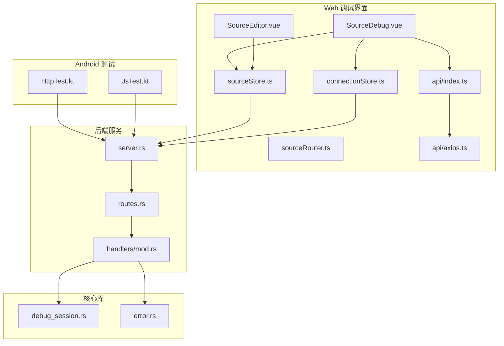
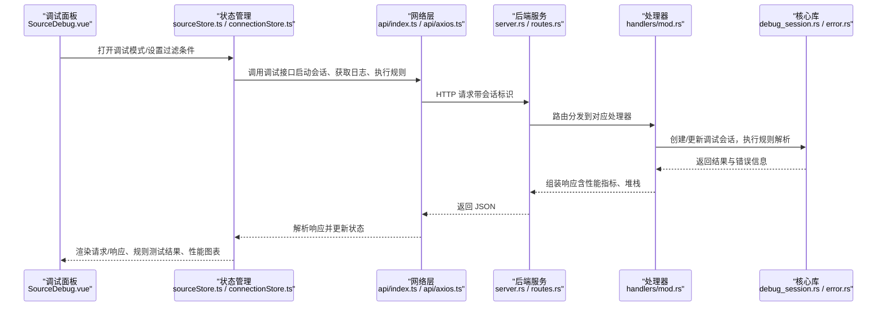
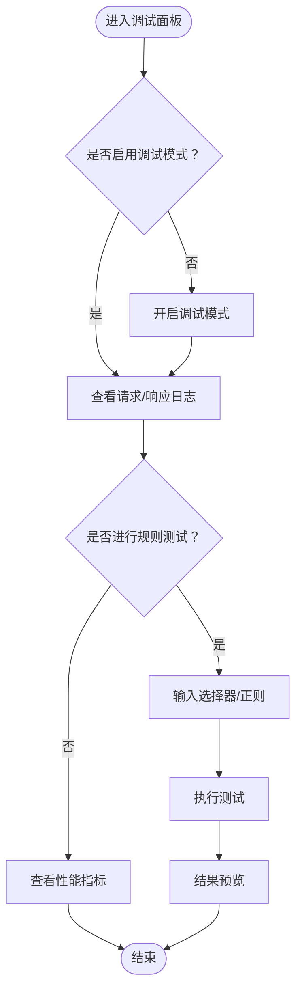
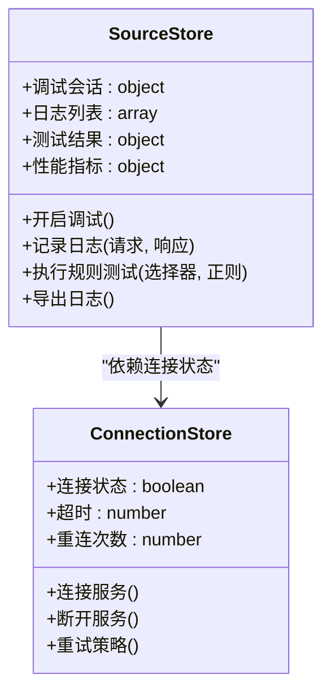
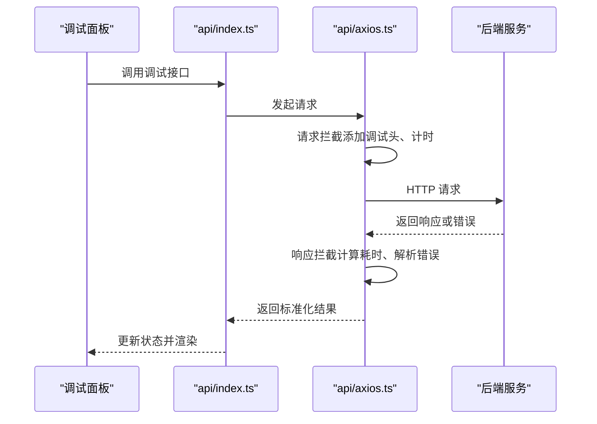
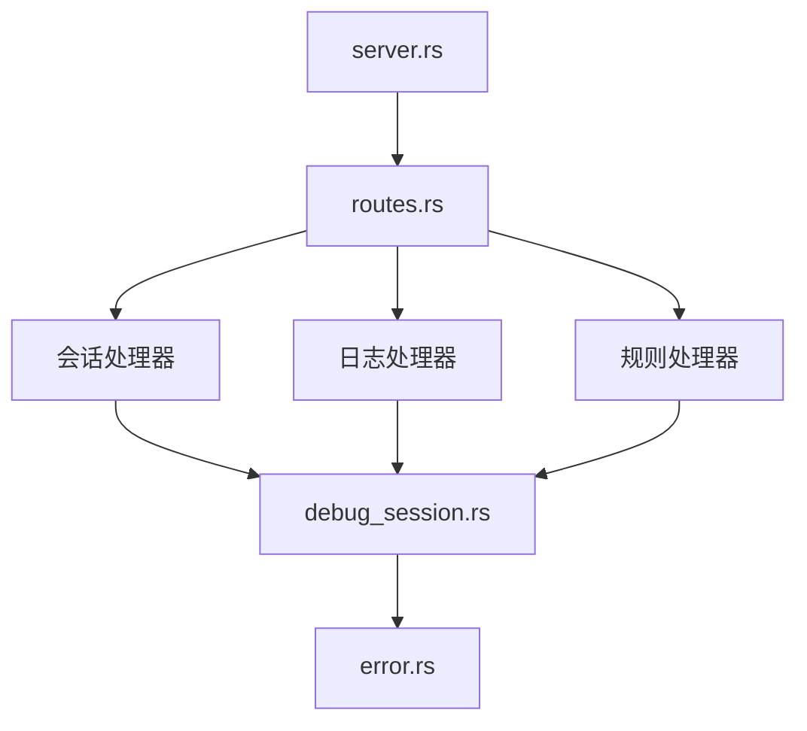
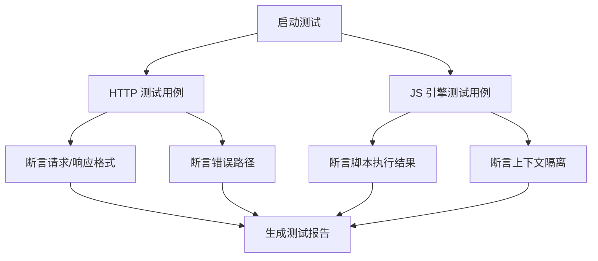
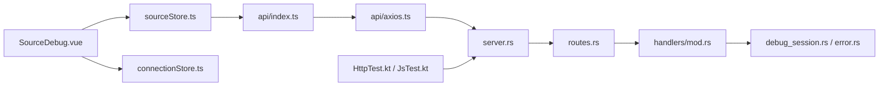

# 源的调试和测试

<cite>
**本文引用的文件**   
- [SourceDebug.vue](file://modules/web/src/components/SourceDebug.vue)
- [SourceEditor.vue](file://modules/web/src/views/SourceEditor.vue)
- [sourceRouter.ts](file://modules/web/src/router/sourceRouter.ts)
- [sourceStore.ts](file://modules/web/src/store/sourceStore.ts)
- [connectionStore.ts](file://modules/web/src/store/connectionStore.ts)
- [api/index.ts](file://modules/web/src/api/index.ts)
- [api/axios.ts](file://modules/web/src/api/axios.ts)
- [server.rs](file://rust/legado-server/src/server.rs)
- [routes.rs](file://rust/legado-server/src/routes.rs)
- [handlers/mod.rs](file://rust/legado-server/src/handlers/mod.rs)
- [debug_session.rs](file://rust/legado-core/src/debug_session.rs)
- [error.rs](file://rust/legado-core/src/error.rs)
- [HttpTest.kt](file://app/src/androidTest/java/io/legado/app/HttpTest.kt)
- [JsTest.kt](file://app/src/test/java/io/legado/app/JsTest.kt)
</cite>

## 目录
1. [简介](#简介)
2. [项目结构](#项目结构)
3. [核心组件](#核心组件)
4. [架构总览](#架构总览)
5. [详细组件分析](#详细组件分析)
6. [依赖关系分析](#依赖关系分析)
7. [性能考量](#性能考量)
8. [故障排查指南](#故障排查指南)
9. [结论](#结论)
10. [附录](#附录)

## 简介
本文件面向“源”（Book/RSS 等数据源）的调试与测试，覆盖以下能力：
- 调试模式开启与配置
- 请求拦截与响应查看（HTTP 监控与分析）
- 规则测试工具（选择器测试、正则表达式验证、结果预览）
- 模拟数据生成（用于不同场景下的源行为验证）
- 性能分析（响应时间统计、内存使用监控）
- 错误诊断（异常捕获、堆栈跟踪、错误报告）
- 调试工作流最佳实践与常见问题排查

## 项目结构
本项目包含前端 Web 调试界面（Vue）、后端服务（Rust）、Android 端测试用例三部分。Web 端提供可视化调试面板；后端暴露调试接口并处理会话与日志；Android 端提供 HTTP 与 JS 引擎相关的单元测试。

**图表来源** 
- [SourceDebug.vue](file://modules/web/src/components/SourceDebug.vue)
- [SourceEditor.vue](file://modules/web/src/views/SourceEditor.vue)
- [sourceRouter.ts](file://modules/web/src/router/sourceRouter.ts)
- [sourceStore.ts](file://modules/web/src/store/sourceStore.ts)
- [connectionStore.ts](file://modules/web/src/store/connectionStore.ts)
- [api/index.ts](file://modules/web/src/api/index.ts)
- [api/axios.ts](file://modules/web/src/api/axios.ts)
- [server.rs](file://rust/legado-server/src/server.rs)
- [routes.rs](file://rust/legado-server/src/routes.rs)
- [handlers/mod.rs](file://rust/legado-server/src/handlers/mod.rs)
- [debug_session.rs](file://rust/legado-core/src/debug_session.rs)
- [error.rs](file://rust/legado-core/src/error.rs)
- [HttpTest.kt](file://app/src/androidTest/java/io/legado/app/HttpTest.kt)
- [JsTest.kt](file://app/src/test/java/io/legado/app/JsTest.kt)

**章节来源**
- [SourceDebug.vue](file://modules/web/src/components/SourceDebug.vue)
- [SourceEditor.vue](file://modules/web/src/views/SourceEditor.vue)
- [sourceRouter.ts](file://modules/web/src/router/sourceRouter.ts)
- [sourceStore.ts](file://modules/web/src/store/sourceStore.ts)
- [connectionStore.ts](file://modules/web/src/store/connectionStore.ts)
- [api/index.ts](file://modules/web/src/api/index.ts)
- [api/axios.ts](file://modules/web/src/api/axios.ts)
- [server.rs](file://rust/legado-server/src/server.rs)
- [routes.rs](file://rust/legado-server/src/routes.rs)
- [handlers/mod.rs](file://rust/legado-server/src/handlers/mod.rs)
- [debug_session.rs](file://rust/legado-core/src/debug_session.rs)
- [error.rs](file://rust/legado-core/src/error.rs)
- [HttpTest.kt](file://app/src/androidTest/java/io/legado/app/HttpTest.kt)
- [JsTest.kt](file://app/src/test/java/io/legado/app/JsTest.kt)

## 核心组件
- 调试面板（SourceDebug.vue）：提供调试开关、请求/响应查看、规则测试入口、结果预览、性能指标展示。
- 编辑器（SourceEditor.vue）：编辑源脚本，支持在调试模式下运行片段与预览。
- 路由（sourceRouter.ts）：管理调试页面路由与参数传递。
- 状态管理（sourceStore.ts、connectionStore.ts）：维护调试会话、连接状态、缓存与日志。
- 网络层（api/index.ts、api/axios.ts）：封装调试接口调用，统一拦截与错误处理。
- 后端服务（server.rs、routes.rs、handlers/mod.rs）：提供调试相关 API，处理会话、日志、规则执行与结果返回。
- 核心库（debug_session.rs、error.rs）：调试会话生命周期、错误模型与堆栈信息。
- Android 测试（HttpTest.kt、JsTest.kt）：针对 HTTP 与 JS 引擎的自动化测试。

**章节来源**
- [SourceDebug.vue](file://modules/web/src/components/SourceDebug.vue)
- [SourceEditor.vue](file://modules/web/src/views/SourceEditor.vue)
- [sourceRouter.ts](file://modules/web/src/router/sourceRouter.ts)
- [sourceStore.ts](file://modules/web/src/store/sourceStore.ts)
- [connectionStore.ts](file://modules/web/src/store/connectionStore.ts)
- [api/index.ts](file://modules/web/src/api/index.ts)
- [api/axios.ts](file://modules/web/src/api/axios.ts)
- [server.rs](file://rust/legado-server/src/server.rs)
- [routes.rs](file://rust/legado-server/src/routes.rs)
- [handlers/mod.rs](file://rust/legado-server/src/handlers/mod.rs)
- [debug_session.rs](file://rust/legado-core/src/debug_session.rs)
- [error.rs](file://rust/legado-core/src/error.rs)
- [HttpTest.kt](file://app/src/androidTest/java/io/legado/app/HttpTest.kt)
- [JsTest.kt](file://app/src/test/java/io/legado/app/JsTest.kt)

## 架构总览
调试流程从 Web 面板发起，经状态管理与网络层转发到后端服务，后端通过处理器调用核心库进行规则解析与执行，最终将结果与日志回传至前端展示。

**图表来源** 
- [SourceDebug.vue](file://modules/web/src/components/SourceDebug.vue)
- [sourceStore.ts](file://modules/web/src/store/sourceStore.ts)
- [connectionStore.ts](file://modules/web/src/store/connectionStore.ts)
- [api/index.ts](file://modules/web/src/api/index.ts)
- [api/axios.ts](file://modules/web/src/api/axios.ts)
- [server.rs](file://rust/legado-server/src/server.rs)
- [routes.rs](file://rust/legado-server/src/routes.rs)
- [handlers/mod.rs](file://rust/legado-server/src/handlers/mod.rs)
- [debug_session.rs](file://rust/legado-core/src/debug_session.rs)
- [error.rs](file://rust/legado-core/src/error.rs)

## 详细组件分析

### 调试面板与编辑器
- 调试面板负责：
  - 开启/关闭调试模式
  - 过滤与搜索请求/响应日志
  - 触发规则测试（选择器、正则）
  - 展示结果预览与性能指标
- 编辑器负责：
  - 编辑源脚本
  - 在调试模式下运行片段
  - 实时预览输出

**图表来源** 
- [SourceDebug.vue](file://modules/web/src/components/SourceDebug.vue)
- [SourceEditor.vue](file://modules/web/src/views/SourceEditor.vue)

**章节来源**
- [SourceDebug.vue](file://modules/web/src/components/SourceDebug.vue)
- [SourceEditor.vue](file://modules/web/src/views/SourceEditor.vue)

### 状态管理与连接控制
- sourceStore.ts：维护调试会话、规则测试结果、性能统计、日志列表。
- connectionStore.ts：管理与服务端的连接状态、重连策略、超时配置。
- 交互流程：
  - 面板操作触发 store 方法
  - store 调用网络层接口
  - 成功后更新本地状态并刷新 UI

**图表来源** 
- [sourceStore.ts](file://modules/web/src/store/sourceStore.ts)
- [connectionStore.ts](file://modules/web/src/store/connectionStore.ts)

**章节来源**
- [sourceStore.ts](file://modules/web/src/store/sourceStore.ts)
- [connectionStore.ts](file://modules/web/src/store/connectionStore.ts)

### 网络层与请求拦截
- api/index.ts：定义调试相关 API（如启动会话、获取日志、执行规则）。
- api/axios.ts：封装 axios，实现请求/响应拦截、错误统一处理、超时与重试。
- 关键能力：
  - 请求拦截：附加调试头、记录开始时间
  - 响应拦截：记录耗时、解析错误、缓存响应
  - 错误处理：统一抛出可追踪的错误对象

**图表来源** 
- [api/index.ts](file://modules/web/src/api/index.ts)
- [api/axios.ts](file://modules/web/src/api/axios.ts)
- [server.rs](file://rust/legado-server/src/server.rs)

**章节来源**
- [api/index.ts](file://modules/web/src/api/index.ts)
- [api/axios.ts](file://modules/web/src/api/axios.ts)

### 后端服务与处理器
- server.rs：初始化服务、注册中间件、监听端口。
- routes.rs：定义调试相关路由（会话、日志、规则执行）。
- handlers/mod.rs：具体处理器逻辑，包括：
  - 调试会话创建与销毁
  - 日志收集与查询
  - 规则解析与执行（选择器、正则）
  - 性能指标采集与错误堆栈收集

**图表来源** 
- [server.rs](file://rust/legado-server/src/server.rs)
- [routes.rs](file://rust/legado-server/src/routes.rs)
- [handlers/mod.rs](file://rust/legado-server/src/handlers/mod.rs)
- [debug_session.rs](file://rust/legado-core/src/debug_session.rs)
- [error.rs](file://rust/legado-core/src/error.rs)

**章节来源**
- [server.rs](file://rust/legado-server/src/server.rs)
- [routes.rs](file://rust/legado-server/src/routes.rs)
- [handlers/mod.rs](file://rust/legado-server/src/handlers/mod.rs)
- [debug_session.rs](file://rust/legado-core/src/debug_session.rs)
- [error.rs](file://rust/legado-core/src/error.rs)

### Android 端测试用例
- HttpTest.kt：针对 HTTP 客户端的测试，验证请求构造、响应解析、错误处理。
- JsTest.kt：针对 JS 引擎的测试，验证脚本执行、上下文隔离、返回值正确性。

**图表来源** 
- [HttpTest.kt](file://app/src/androidTest/java/io/legado/app/HttpTest.kt)
- [JsTest.kt](file://app/src/test/java/io/legado/app/JsTest.kt)

**章节来源**
- [HttpTest.kt](file://app/src/androidTest/java/io/legado/app/HttpTest.kt)
- [JsTest.kt](file://app/src/test/java/io/legado/app/JsTest.kt)

## 依赖关系分析
- 前端依赖：
  - Vue 组件依赖状态管理与网络层
  - 状态管理依赖连接控制与后端 API
- 后端依赖：
  - 服务依赖路由与处理器
  - 处理器依赖核心库（调试会话、错误模型）
- 测试依赖：
  - Android 测试依赖后端服务提供的接口

**图表来源** 
- [SourceDebug.vue](file://modules/web/src/components/SourceDebug.vue)
- [sourceStore.ts](file://modules/web/src/store/sourceStore.ts)
- [connectionStore.ts](file://modules/web/src/store/connectionStore.ts)
- [api/index.ts](file://modules/web/src/api/index.ts)
- [api/axios.ts](file://modules/web/src/api/axios.ts)
- [server.rs](file://rust/legado-server/src/server.rs)
- [routes.rs](file://rust/legado-server/src/routes.rs)
- [handlers/mod.rs](file://rust/legado-server/src/handlers/mod.rs)
- [debug_session.rs](file://rust/legado-core/src/debug_session.rs)
- [error.rs](file://rust/legado-core/src/error.rs)
- [HttpTest.kt](file://app/src/androidTest/java/io/legado/app/HttpTest.kt)
- [JsTest.kt](file://app/src/test/java/io/legado/app/JsTest.kt)

**章节来源**
- [SourceDebug.vue](file://modules/web/src/components/SourceDebug.vue)
- [sourceStore.ts](file://modules/web/src/store/sourceStore.ts)
- [connectionStore.ts](file://modules/web/src/store/connectionStore.ts)
- [api/index.ts](file://modules/web/src/api/index.ts)
- [api/axios.ts](file://modules/web/src/api/axios.ts)
- [server.rs](file://rust/legado-server/src/server.rs)
- [routes.rs](file://rust/legado-server/src/routes.rs)
- [handlers/mod.rs](file://rust/legado-server/src/handlers/mod.rs)
- [debug_session.rs](file://rust/legado-core/src/debug_session.rs)
- [error.rs](file://rust/legado-core/src/error.rs)
- [HttpTest.kt](file://app/src/androidTest/java/io/legado/app/HttpTest.kt)
- [JsTest.kt](file://app/src/test/java/io/legado/app/JsTest.kt)

## 性能考量
- 响应时间统计：
  - 前端在请求拦截时记录开始时间，响应拦截时计算耗时
  - 后端在处理器中记录规则执行耗时
- 内存使用监控：
  - 前端限制日志条目数量，避免内存溢出
  - 后端定期清理过期的调试会话与日志
- 优化建议：
  - 分页加载日志，减少一次性传输量
  - 压缩响应体，降低带宽占用
  - 异步处理规则执行，避免阻塞主线程

[本节为通用指导，不直接分析具体文件]

## 故障排查指南
- 常见错误类型：
  - 网络连接失败：检查连接状态、超时配置、代理设置
  - 规则解析失败：验证选择器语法、正则表达式有效性
  - 脚本执行异常：查看堆栈跟踪、确认上下文变量
- 定位步骤：
  - 在调试面板中筛选错误日志
  - 查看请求/响应详情，确认参数与返回格式
  - 使用规则测试工具逐步验证选择器与正则
  - 导出日志并分析堆栈信息
- 修复建议：
  - 修正错误的选择器或正则表达式
  - 调整超时与重试策略
  - 增加必要的错误处理与降级逻辑

**章节来源**
- [error.rs](file://rust/legado-core/src/error.rs)
- [api/axios.ts](file://modules/web/src/api/axios.ts)
- [SourceDebug.vue](file://modules/web/src/components/SourceDebug.vue)

## 结论
本项目的调试与测试功能覆盖了从前端可视化面板到后端服务与核心库的全链路能力。通过调试模式、请求拦截、规则测试、性能分析与错误诊断，开发者可以高效地定位与解决源相关问题。建议遵循最佳实践，结合自动化测试与持续集成，提升源的稳定性与可维护性。

[本节为总结性内容，不直接分析具体文件]

## 附录
- 调试模式开启：
  - 在调试面板中切换调试开关
  - 配置过滤条件与日志级别
- 规则测试：
  - 输入选择器或正则表达式
  - 执行测试并查看结果预览
- 性能分析：
  - 查看响应时间与内存使用图表
  - 导出性能报告
- 错误诊断：
  - 查看堆栈跟踪与错误日志
  - 导出完整调试信息

[本节为补充说明，不直接分析具体文件]