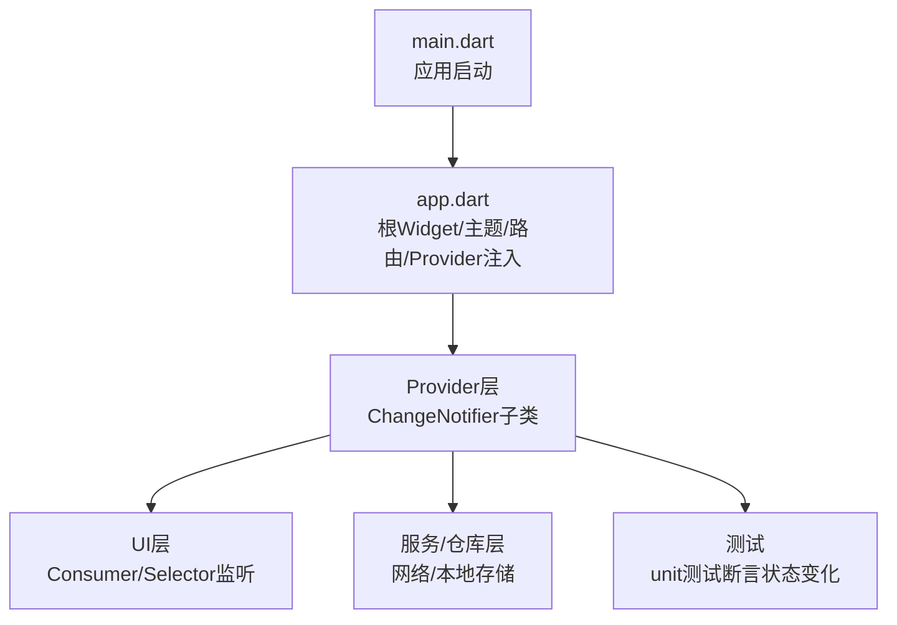
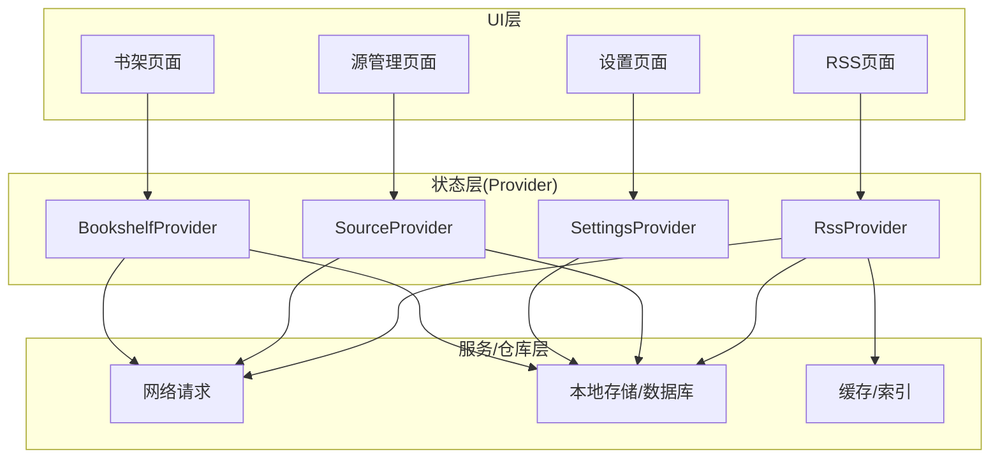
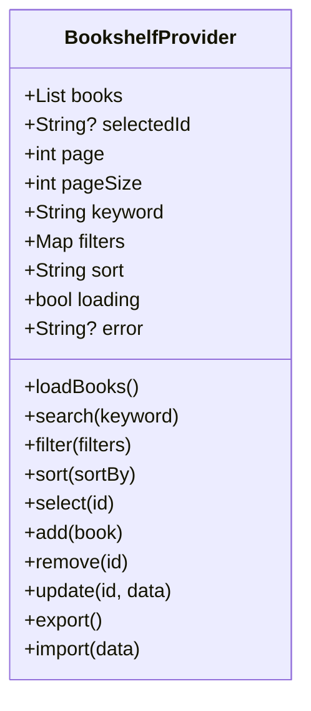
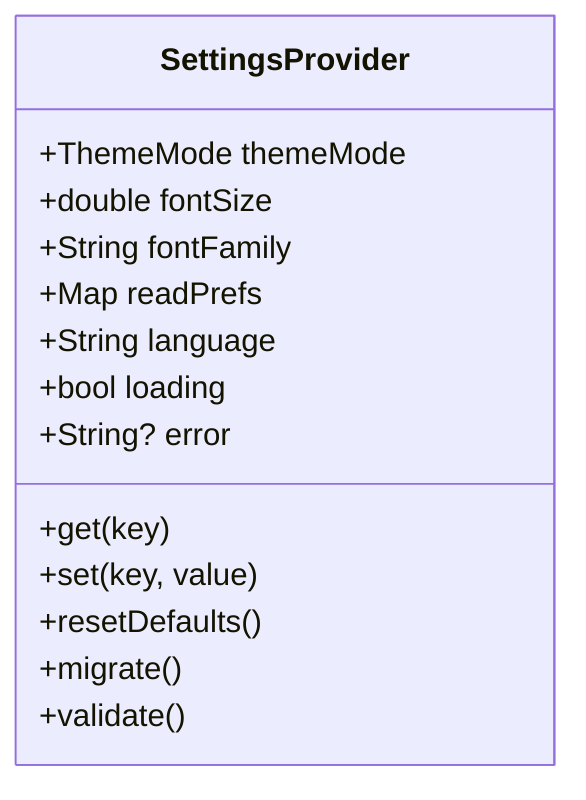
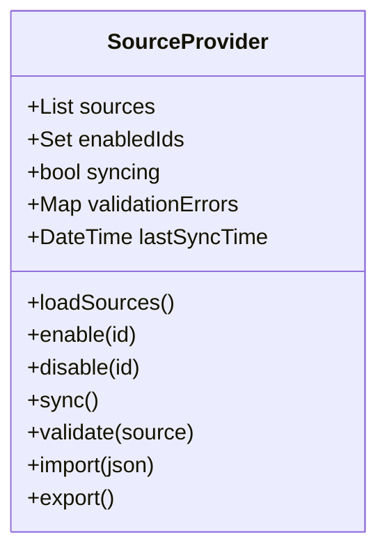
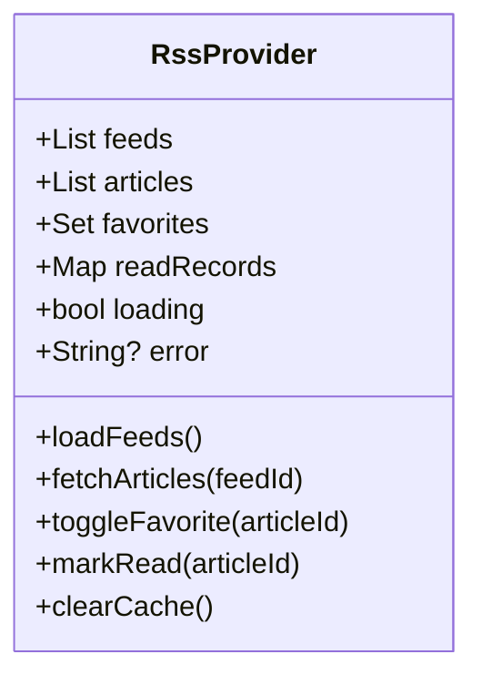
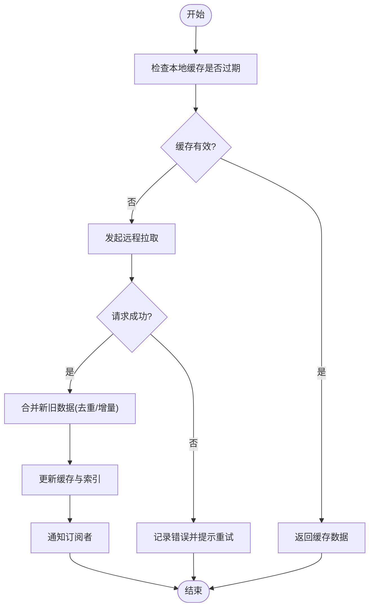
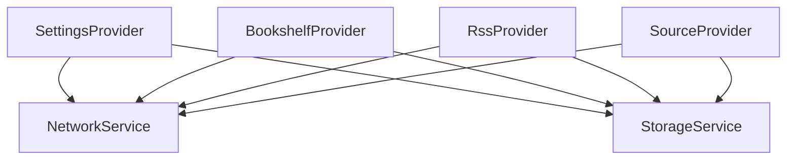
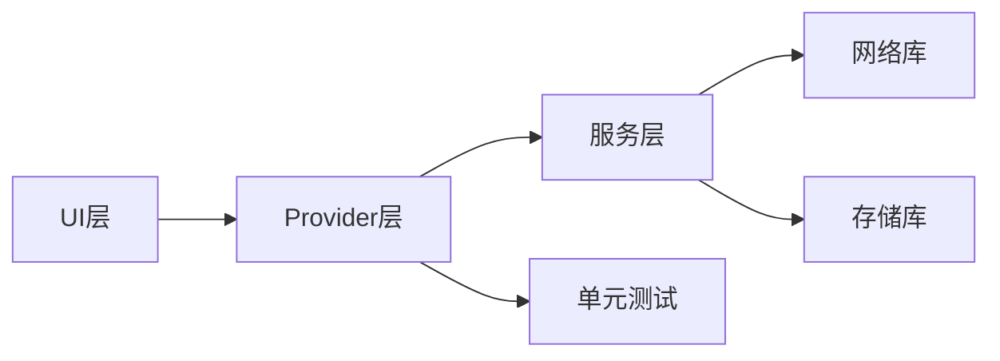

# 状态管理

<cite>
**本文引用的文件**   
- [flutter_legado/lib/main.dart](file://flutter_legado/lib/main.dart)
- [flutter_legado/lib/app.dart](file://flutter_legado/lib/app.dart)
- [flutter_legado/pubspec.yaml](file://flutter_legado/pubspec.yaml)
- [flutter_legado/test/unit/bookshelf_provider_test.dart](file://flutter_legado/test/unit/bookshelf_provider_test.dart)
- [flutter_legado/test/unit/rss_provider_test.dart](file://flutter_legado/test/unit/rss_provider_test.dart)
- [flutter_legado/test/unit/settings_service_test.dart](file://flutter_legado/test/unit/settings_service_test.dart)
</cite>

## 目录
1. [简介](#简介)
2. [项目结构](#项目结构)
3. [核心组件](#核心组件)
4. [架构总览](#架构总览)
5. [详细组件分析](#详细组件分析)
6. [依赖分析](#依赖分析)
7. [性能考虑](#性能考虑)
8. [故障排查指南](#故障排查指南)
9. [结论](#结论)
10. [附录](#附录)

## 简介
本文件面向Flutter端的状态管理，围绕Provider模式展开，重点说明：
- ChangeNotifier与ChangeNotifierProvider的基础概念与用法
- 核心Provider的职责边界与数据流（书架、设置、源、RSS等）
- 异步状态处理、错误处理与加载状态管理
- Provider之间的通信与数据共享模式
- 最佳实践与性能优化建议

## 项目结构
Flutter工程位于 flutter_legado 目录。入口文件为 main.dart，应用初始化与根Widget在 app.dart 中组织。测试用例集中在 test/unit 下，覆盖关键Provider的行为验证。



图表来源
- [flutter_legado/lib/main.dart](file://flutter_legado/lib/main.dart)
- [flutter_legado/lib/app.dart](file://flutter_legado/lib/app.dart)

章节来源
- [flutter_legado/lib/main.dart](file://flutter_legado/lib/main.dart)
- [flutter_legado/lib/app.dart](file://flutter_legado/lib/app.dart)
- [flutter_legado/pubspec.yaml](file://flutter_legado/pubspec.yaml)

## 核心组件
- ChangeNotifier：用于持有可被UI订阅的不可变或可变状态，通过 notifyListeners 触发重建。
- ChangeNotifierProvider：将ChangeNotifier实例注入到Widget树中，供子树消费。
- Consumer/Selector：以最小粒度重建UI，避免不必要的重绘。

职责划分建议
- BookshelfProvider：书籍书架列表、选中项、分页、搜索过滤、排序等
- SettingsProvider：全局设置（主题、字体、阅读偏好等），持久化读写
- SourceProvider：源列表、启用/禁用、同步、校验、错误提示
- RssProvider：RSS订阅源、文章列表、收藏、读取记录、缓存策略

章节来源
- [flutter_legado/test/unit/bookshelf_provider_test.dart](file://flutter_legado/test/unit/bookshelf_provider_test.dart)
- [flutter_legado/test/unit/rss_provider_test.dart](file://flutter_legado/test/unit/rss_provider_test.dart)
- [flutter_legado/test/unit/settings_service_test.dart](file://flutter_legado/test/unit/settings_service_test.dart)

## 架构总览
下图展示Provider在Flutter中的典型分层与数据流向：UI通过Consumer/Selector订阅状态；Provider负责业务逻辑与副作用；底层服务负责IO与持久化。



图表来源
- [flutter_legado/lib/app.dart](file://flutter_legado/lib/app.dart)
- [flutter_legado/pubspec.yaml](file://flutter_legado/pubspec.yaml)

## 详细组件分析

### BookshelfProvider（书架管理）
- 职责：维护书籍集合、当前选中书、分页、搜索与筛选、排序、批量操作、导入导出等
- 状态字段建议：books、selectedId、page、pageSize、keyword、filters、sort、loading、error
- 常用方法：loadBooks、search、filter、sort、select、add、remove、update、export/import
- 异步处理：使用Future/async-await，更新loading/error后notifyListeners
- 错误处理：捕获异常并转换为用户可读消息，提供重试机制
- 性能优化：使用Selector按字段订阅；分页加载；去抖搜索；局部刷新



图表来源
- [flutter_legado/test/unit/bookshelf_provider_test.dart](file://flutter_legado/test/unit/bookshelf_provider_test.dart)

章节来源
- [flutter_legado/test/unit/bookshelf_provider_test.dart](file://flutter_legado/test/unit/bookshelf_provider_test.dart)

### SettingsProvider（设置管理）
- 职责：集中管理应用设置，支持默认值、持久化、热重载
- 状态字段建议：themeMode、fontSize、fontFamily、readPrefs、language、...
- 常用方法：get/set、resetDefaults、migrate、validate
- 异步处理：读写持久化时更新loading/error
- 错误处理：配置校验失败回滚，异常信息上报



图表来源
- [flutter_legado/test/unit/settings_service_test.dart](file://flutter_legado/test/unit/settings_service_test.dart)

章节来源
- [flutter_legado/test/unit/settings_service_test.dart](file://flutter_legado/test/unit/settings_service_test.dart)

### SourceProvider（源管理）
- 职责：管理书源/RSS源的增删改查、启用/禁用、同步、校验、错误诊断
- 状态字段建议：sources、enabledSet、syncing、validationErrors、lastSyncTime
- 常用方法：loadSources、enable/disable、sync、validate、import/export
- 异步处理：批量同步时使用并发控制与进度反馈
- 错误处理：分类错误（网络、解析、规则不匹配），提供修复建议



图表来源
- [flutter_legado/test/unit/change_source_test.dart](file://flutter_legado/test/unit/change_source_test.dart)

章节来源
- [flutter_legado/test/unit/change_source_test.dart](file://flutter_legado/test/unit/change_source_test.dart)

### RssProvider（RSS订阅管理）
- 职责：管理RSS订阅源、文章列表、收藏、已读记录、缓存
- 状态字段建议：feeds、articles、favorites、readRecords、loading、error
- 常用方法：loadFeeds、fetchArticles、toggleFavorite、markRead、clearCache
- 异步处理：分页拉取、增量更新、冲突合并
- 错误处理：网络超时重试、解析失败降级、缓存回退



图表来源
- [flutter_legado/test/unit/rss_provider_test.dart](file://flutter_legado/test/unit/rss_provider_test.dart)

章节来源
- [flutter_legado/test/unit/rss_provider_test.dart](file://flutter_legado/test/unit/rss_provider_test.dart)

### 状态更新流程（示例：书架搜索）
```mermaid
sequenceDiagram
participant UI as "书架页面"
participant BP as "BookshelfProvider"
participant Net as "网络/仓库"
participant DB as "本地存储"
UI->>BP : search(keyword)
BP->>BP : loading=true; error=null
BP->>Net : fetchBooks(keyword, page, pageSize)
alt 成功
Net-->>BP : books
BP->>DB : cache(books)
BP->>BP : books=merge; loading=false
else 失败
Net-->>BP : error
BP->>BP : error=errorMessage; loading=false
end
BP-->>UI : notifyListeners()
UI-->>UI : 重建并显示结果/错误
```

图表来源
- [flutter_legado/test/unit/bookshelf_provider_test.dart](file://flutter_legado/test/unit/bookshelf_provider_test.dart)

章节来源
- [flutter_legado/test/unit/bookshelf_provider_test.dart](file://flutter_legado/test/unit/bookshelf_provider_test.dart)

### 复杂逻辑流程图（RSS增量更新）


图表来源
- [flutter_legado/test/unit/rss_provider_test.dart](file://flutter_legado/test/unit/rss_provider_test.dart)

章节来源
- [flutter_legado/test/unit/rss_provider_test.dart](file://flutter_legado/test/unit/rss_provider_test.dart)

### 概念总览（Provider通信与数据共享）
- 跨Provider通信：通过回调、事件总线或共享服务（如NetworkService、StorageService）进行解耦
- 数据共享：将公共数据放入顶层Provider（如SettingsProvider），由子Provider按需读取
- 事件驱动：对跨域副作用（如登录态变化、主题切换）采用事件发布/订阅



[本图为概念示意，不直接映射具体源码文件]

## 依赖分析
- 外部依赖：pubspec.yaml声明了provider、dio、shared_preferences等库的使用
- 模块耦合：UI层仅依赖Provider接口；Provider依赖服务层抽象；服务层封装IO细节
- 循环依赖规避：通过接口与服务单例/依赖注入避免循环引用



图表来源
- [flutter_legado/pubspec.yaml](file://flutter_legado/pubspec.yaml)

章节来源
- [flutter_legado/pubspec.yaml](file://flutter_legado/pubspec.yaml)

## 性能考虑
- 细粒度订阅：使用Selector只监听必要字段，减少重建范围
- 防抖与节流：搜索输入与频繁操作加防抖；滚动加载节流
- 分页与懒加载：列表数据分页获取，首屏优先渲染
- 内存管理：及时释放大对象、取消未完成的请求、清理定时器
- 计算优化：避免在build中进行昂贵计算，使用compute或缓存结果
- 并发控制：批量任务限制并发度，避免阻塞主线程

## 故障排查指南
- 常见问题
  - 状态未更新：确认notifyListeners是否调用；检查是否在异步回调外更新状态
  - 重复重建：检查Consumer/Selector的监听范围是否过大
  - 内存泄漏：确保在dispose中取消订阅与任务
  - 网络错误：统一错误码与提示，提供重试入口
- 调试技巧
  - 打印Provider变更日志
  - 使用DevTools观察Widget重建与内存占用
  - 编写单元测试覆盖关键路径

章节来源
- [flutter_legado/test/unit/bookshelf_provider_test.dart](file://flutter_legado/test/unit/bookshelf_provider_test.dart)
- [flutter_legado/test/unit/rss_provider_test.dart](file://flutter_legado/test/unit/rss_provider_test.dart)
- [flutter_legado/test/unit/settings_service_test.dart](file://flutter_legado/test/unit/settings_service_test.dart)

## 结论
通过Provider模式，本项目实现了清晰的状态分层与可维护的数据流。结合ChangeNotifier与Provider注入，UI与状态解耦，便于扩展与测试。遵循本文的最佳实践与优化建议，可在保证用户体验的同时提升性能与稳定性。

## 附录
- 快速上手
  - 定义ChangeNotifier子类，暴露状态与方法
  - 在根节点使用ChangeNotifierProvider注入
  - 在子树使用Consumer/Selector读取与响应状态变化
- 参考文件
  - 入口与根Widget：[flutter_legado/lib/main.dart](file://flutter_legado/lib/main.dart)、[flutter_legado/lib/app.dart](file://flutter_legado/lib/app.dart)
  - 依赖声明：[flutter_legado/pubspec.yaml](file://flutter_legado/pubspec.yaml)
  - 测试用例：[flutter_legado/test/unit/bookshelf_provider_test.dart](file://flutter_legado/test/unit/bookshelf_provider_test.dart)、[flutter_legado/test/unit/rss_provider_test.dart](file://flutter_legado/test/unit/rss_provider_test.dart)、[flutter_legado/test/unit/settings_service_test.dart](file://flutter_legado/test/unit/settings_service_test.dart)