# 状态管理

<cite>
**本文引用的文件**
- [app.dart](file://flutter_legado/lib/app.dart)
- [main.dart](file://flutter_legado/lib/main.dart)
- [theme_notifier.dart](file://flutter_legado/lib/src/providers/theme/theme_notifier.dart)
- [theme_state.dart](file://flutter_legado/lib/src/providers/theme/theme_state.dart)
- [theme_colors_notifier.dart](file://flutter_legado/lib/src/providers/theme/theme_colors_notifier.dart)
- [main_prefs_notifier.dart](file://flutter_legado/lib/src/providers/main_prefs_notifier.dart)
- [bookshelf_notifier.dart](file://flutter_legado/lib/src/providers/bookshelf/bookshelf_notifier.dart)
- [source_notifier.dart](file://flutter_legado/lib/src/providers/source/source_notifier.dart)
- [rss_notifier.dart](file://flutter_legado/lib/src/providers/rss/rss_notifier.dart)
- [audio_notifier.dart](file://flutter_legado/lib/src/providers/audio/audio_notifier.dart)
- [auto_task_notifier.dart](file://flutter_legado/lib/src/providers/auto_task/auto_task_notifier.dart)
- [bookmark_notifier.dart](file://flutter_legado/lib/src/providers/bookmark/bookmark_notifier.dart)
- [association_notifier.dart](file://flutter_legado/lib/src/providers/association/association_notifier.dart)
- [explore_notifier.dart](file://flutter_legado/lib/src/providers/explore/explore_notifier.dart)
- [reader_notifier.dart](file://flutter_legado/lib/src/providers/reader/reader_notifier.dart)
- [reader_state.dart](file://flutter_legado/lib/src/providers/reader/reader_state.dart)
- [reading_stats_notifier.dart](file://flutter_legado/lib/src/providers/reading_stats/reading_stats_notifier.dart)
- [replace_rule_notifier.dart](file://flutter_legado/lib/src/providers/replace_rule/replace_rule_notifier.dart)
- [search_notifier.dart](file://flutter_legado/lib/src/providers/search/search_notifier.dart)
- [search_state.dart](file://flutter_legado/lib/src/providers/search/search_state.dart)
- [providers.dart](file://flutter_legado/lib/src/providers/providers.dart)
- [change_cover_notifier.dart](file://flutter_legado/lib/src/providers/change_cover/change_cover_notifier.dart)
- [change_cover_state.dart](file://flutter_legado/lib/src/providers/change_cover/change_cover_state.dart)
- [dict_notifier.dart](file://flutter_legado/lib/src/providers/dict/dict_notifier.dart)
- [dict_state.dart](file://flutter_legado/lib/src/providers/dict/dict_state.dart)
- [paragraph_layout_engine.dart](file://flutter_legado/lib/src/widgets/paragraph_layout_engine.dart)
- [rust_api.dart](file://flutter_legado/lib/src/services/rust_api.dart)
- [book_api.dart](file://flutter_legado/lib/src/services/book_api.dart)
- [import_screen.dart](file://flutter_legado/lib/src/screens/import_screen.dart)
- [pref_keys.dart](file://flutter_legado/lib/src/constants/pref_keys.dart)
</cite>

## 更新摘要
**所做更改**
- 新增主题颜色管理组件（ThemeColorsNotifier），支持8种自定义主题颜色偏好管理
- 新增主界面偏好管理组件（MainPrefsNotifier），管理首页显示设置和默认页面
- 增强ReaderNotifier的全局页码同步机制，改进跨章节连续分页体验
- 新增统一的偏好键常量管理（PrefKeys），对齐原版Android配置
- 完善阅读器的自定义背景色支持和行距范围调整

## 目录
- [概述](#概述)
- [Riverpod Notifier基础概念](#riverpod-notifier基础概念)
- [核心Notifier实现](#核心notifier实现)
- [ThemeNotifier详解](#thememotifier详解)
- [ThemeColorsNotifier主题颜色管理](#themecolorsnotifier主题颜色管理)
- [MainPrefsNotifier主界面偏好管理](#mainprefsnotifier主界面偏好管理)
- [BookshelfNotifier书籍书架管理](#bookshelfnotifier书籍书架管理)
- [SourceNotifier源管理](#sourcenotifier源管理)
- [RssNotifier RSS订阅管理](#rssnotifier-rss订阅管理)
- [SearchNotifier搜索管理](#searchnotifier搜索管理)
- [ChangeCoverNotifier封面管理](#changecovernotifier封面管理)
- [DictNotifier字典查询管理](#dictnotifier字典查询管理)
- [ImportScreen导入功能](#importscreen导入功能)
- [其他功能Notifier](#其他功能notifier)
- [状态更新机制](#状态更新机制)
- [Notifier间通信](#notifier间通信)
- [最佳实践与性能优化](#最佳实践与性能优化)

## 概述

Flutter应用已完成从Provider ChangeNotifier到Riverpod Notifier的完整架构迁移。新架构采用不可变状态管理、函数式编程模式和精确的重建机制，提供更强的类型安全性和更好的性能表现。最新的更新包括主题颜色管理、主界面偏好管理和增强的阅读器功能，实现了与原版Android应用的完全对齐。

### 主要特点
- **不可变状态**：基于Freezed生成的immutable状态类
- **精确重建**：ref.watch自动追踪依赖，最小化UI重建
- **类型安全**：编译时类型检查，减少运行时错误
- **模块化设计**：按功能域划分的Notifier结构
- **统一API**：ref.watch读取状态，ref.read调用方法
- **依赖注入**：通过BookApi接口实现解耦和可测试性
- **Mock驱动**：支持Mock数据先行开发，无缝切换到真实API
- **偏好管理**：统一的偏好键管理和持久化存储

## Riverpod Notifier基础概念

### Notifier基础
Notifier是Riverpod提供的基类，用于管理状态变化：

```dart
class MyNotifier extends Notifier<MyState> {
  @override
  MyState build() {
    return const MyState();
  }
  
  void updateData(String newData) {
    state = state.copyWith(data: newData);
  }
}
```

### NotifierProvider使用
NotifierProvider用于创建和管理Notifier实例：

```dart
final myNotifierProvider = NotifierProvider<MyNotifier, MyState>(
  MyNotifier.new,
);

// 在Widget中使用
class MyWidget extends ConsumerWidget {
  @override
  Widget build(BuildContext context, WidgetRef ref) {
    final state = ref.watch(myNotifierProvider);
    return Text(state.data);
  }
}
```

### ConsumerWidget架构
所有UI组件都迁移到ConsumerWidget，提供ref参数用于状态访问：

```dart
class BookshelfScreen extends ConsumerWidget {
  @override
  Widget build(BuildContext context, WidgetRef ref) {
    final bookshelfState = ref.watch(bookshelfNotifierProvider);
    final books = bookshelfState.books;
    
    return Scaffold(
      body: ListView.builder(
        itemCount: books.length,
        itemBuilder: (context, index) => BookItem(book: books[index]),
      ),
    );
  }
}
```

## 核心Notifier实现

### ThemeNotifier主题管理
ThemeNotifier负责全局主题模式和字体缩放管理：

**核心功能**
- 主题模式切换（亮色/暗色/跟随系统）
- 全局字体缩放控制（0.8x-1.6x）
- 持久化存储用户偏好
- 实时主题切换无需重启

**状态管理**
- 使用ThemeState不可变状态类
- copyWith方法创建新状态实例
- 启动时自动加载持久化设置

### BookshelfNotifier书籍书架管理
BookshelfNotifier管理书籍列表和书架相关操作：

**主要职责**
- 书籍CRUD操作（增删改查）
- 视图模式切换（网格/列表）
- 分组显示控制
- 拖拽排序支持
- 本地书籍导入

**数据流**
- 通过BookApi与Rust后端通信
- 统一管理loading/error/data三态
- 同步UI状态与持久化设置

### SourceNotifier书源管理
SourceNotifier处理书源的完整生命周期管理：

**核心功能**
- 书源CRUD操作
- 批量操作（启用/禁用/删除）
- 多种导入方式（JSON/URL/文件）
- 搜索过滤和排序
- 导出备份功能

**高级特性**
- 支持多条件筛选
- 批量操作事务管理
- 导入结果统计和错误报告

### RssNotifier RSS订阅管理
RssNotifier管理RSS源和文章内容：

**主要职责**
- RSS源管理（添加/删除/选择）
- 文章列表加载和刷新
- 分组筛选功能
- 错误处理和状态管理

**数据处理**
- 支持多分组解析
- 异步数据加载
- 缓存当前选中源

## ThemeNotifier详解

ThemeNotifier是应用主题管理的核心组件，实现了完整的主题切换和字体缩放功能：

### 状态结构设计

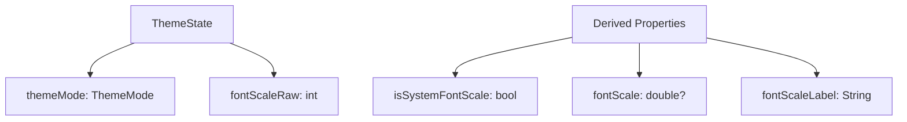

**图表来源**
- [theme_state.dart:12-43](file://flutter_legado/lib/src/providers/theme/theme_state.dart#L12-L43)

### 核心方法实现

#### 主题模式管理
```dart
Future<void> setThemeMode(ThemeMode mode) async {
  if (state.themeMode == mode) return;
  state = state.copyWith(themeMode: mode);
  await _settings.setThemeMode(mode);
}
```

#### 字体缩放控制
```dart
Future<void> setFontScale(int raw) async {
  if (state.fontScaleRaw == raw) return;
  state = state.copyWith(fontScaleRaw: raw);
  await _settings.setFontScale(raw);
}
```

### 集成使用
ThemeNotifier在应用启动时自动初始化，并在MaterialApp中应用主题设置：

**Section sources**
- [theme_notifier.dart:18-60](file://flutter_legado/lib/src/providers/theme/theme_notifier.dart#L18-L60)
- [theme_state.dart:12-43](file://flutter_legado/lib/src/providers/theme/theme_state.dart#L12-L43)
- [app.dart:45-65](file://flutter_legado/lib/app.dart#L45-L65)

## ThemeColorsNotifier主题颜色管理

**新增** ThemeColorsNotifier是自定义主题颜色的完整实现，支持8种颜色偏好的管理和持久化：

### 架构设计

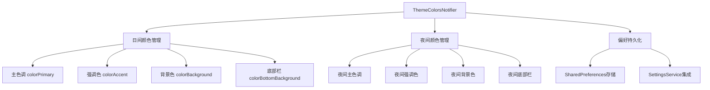

**图表来源**
- [theme_colors_notifier.dart:14-89](file://flutter_legado/lib/src/providers/theme/theme_colors_notifier.dart#L14-L89)

### 状态结构设计

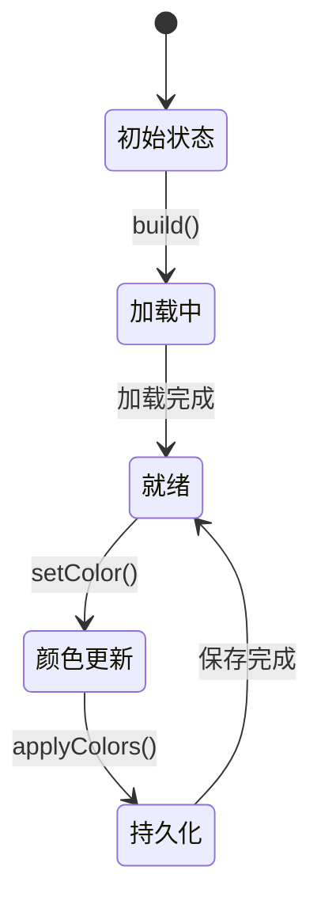

**图表来源**
- [theme_colors_notifier.dart:92-153](file://flutter_legado/lib/src/providers/theme/theme_colors_notifier.dart#L92-L153)

### 核心功能实现

#### 8种颜色偏好管理
```dart
class ThemeColorsState {
  /// 日间主色调（对齐原版 colorPrimary，映射 AppBar 背景）
  final int? primary;
  
  /// 日间强调色（对齐原版 colorAccent，映射全局 Tint）
  final int? accent;
  
  /// 日间背景色（对齐原版 colorBackground，映射 Scaffold 背景）
  final int? background;
  
  /// 日间底部操作栏颜色（对齐原版 colorBottomBackground，映射底部 TabBar 背景）
  final int? bottomBackground;
  
  /// 夜间主色调（colorPrimaryNight）
  final int? primaryNight;
  
  /// 夜间强调色（colorAccentNight）
  final int? accentNight;
  
  /// 夜间背景色（colorBackgroundNight）
  final int? backgroundNight;
  
  /// 夜间底部操作栏颜色（colorBottomBackgroundNight）
  final int? bottomBackgroundNight;
}
```

#### 批量颜色应用
```dart
Future<void> applyColors(Map<String, int?> colors) async {
  var next = state;
  for (final entry in colors.entries) {
    next = next.withValue(entry.key, entry.value);
  }
  try {
    final prefs = await SharedPreferences.getInstance();
    for (final entry in colors.entries) {
      final value = entry.value;
      if (value == null) {
        await prefs.remove(entry.key);
      } else {
        await prefs.setInt(entry.key, value);
      }
    }
  } catch (e) {
    debugPrint('ThemeColorsNotifier.applyColors 持久化异常: $e');
    return;
  }
  state = next;
}
```

### 集成使用
ThemeColorsNotifier在MaterialApp中应用自定义主题颜色：

```dart
final themeColors = ref.watch(themeColorsProvider);
Color? c(int? argb) => argb != null ? Color(argb) : null;

return MaterialApp(
  theme: AppTheme.lightCustom(
    primary: c(themeColors.primary),
    accent: c(themeColors.accent),
    background: c(themeColors.background),
    bottomBackground: c(themeColors.bottomBackground),
  ),
  darkTheme: AppTheme.darkCustom(
    primary: c(themeColors.primaryNight),
    accent: c(themeColors.accentNight),
    background: c(themeColors.backgroundNight),
    bottomBackground: c(themeColors.bottomBackgroundNight),
  ),
);
```

**Section sources**
- [theme_colors_notifier.dart:14-160](file://flutter_legado/lib/src/providers/theme/theme_colors_notifier.dart#L14-L160)
- [app.dart:66-87](file://flutter_legado/lib/app.dart#L66-L87)
- [pref_keys.dart:34-56](file://flutter_legado/lib/src/constants/pref_keys.dart#L34-L56)

## MainPrefsNotifier主界面偏好管理

**新增** MainPrefsNotifier管理主界面的显示偏好和默认页面设置：

### 功能架构

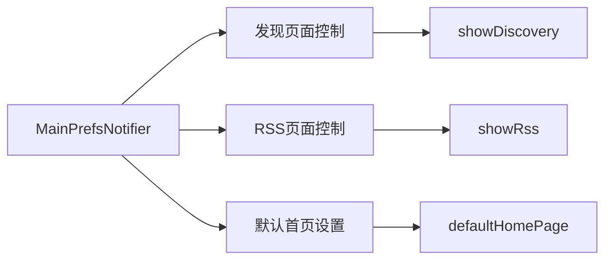

**图表来源**
- [main_prefs_notifier.dart:10-38](file://flutter_legado/lib/src/providers/main_prefs_notifier.dart#L10-L38)

### 状态结构设计

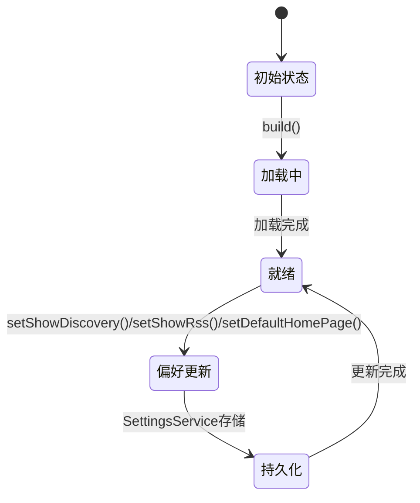

**图表来源**
- [main_prefs_notifier.dart:40-85](file://flutter_legado/lib/src/providers/main_prefs_notifier.dart#L40-L85)

### 核心功能实现

#### 主界面显示控制
```dart
class MainPrefsState {
  /// 显示发现（对齐原版 showDiscovery，默认 true）
  final bool showDiscovery;
  
  /// 显示订阅/RSS（对齐原版 showRss，默认 true）
  final bool showRss;
  
  /// 默认首页（对齐原版 defaultHomePage：bookshelf/explore/rss/my）
  final String defaultHomePage;
}
```

#### 偏好设置方法
```dart
Future<void> setShowDiscovery(bool value) async {
  state = state.copyWith(showDiscovery: value);
  await _settings.setBoolPref(PrefKeys.showDiscovery, value);
}

Future<void> setShowRss(bool value) async {
  state = state.copyWith(showRss: value);
  await _settings.setBoolPref(PrefKeys.showRss, value);
}

Future<void> setDefaultHomePage(String value) async {
  state = state.copyWith(defaultHomePage: value);
  await _settings.setStringPref(PrefKeys.defaultHomePage, value);
}
```

### 集成使用
MainPrefsNotifier为首页导航提供动态控制：

```dart
final mainPrefs = ref.watch(mainPrefsProvider);
// 根据showDiscovery和showRss控制底部Tab显示
// 根据defaultHomePage设置初始路由
```

**Section sources**
- [main_prefs_notifier.dart:10-91](file://flutter_legado/lib/src/providers/main_prefs_notifier.dart#L10-L91)
- [pref_keys.dart:106-113](file://flutter_legado/lib/src/constants/pref_keys.dart#L106-L113)

## ReaderNotifier增强：全局页码同步机制

**更新** 增强了ReaderNotifier的updatePosition方法，在更新当前章节位置后调用_syncGlobalPageInfo()，确保在章节内滑动手势和其他触摸交互时全局页码指示器正确同步。

### 跨章节连续分页架构

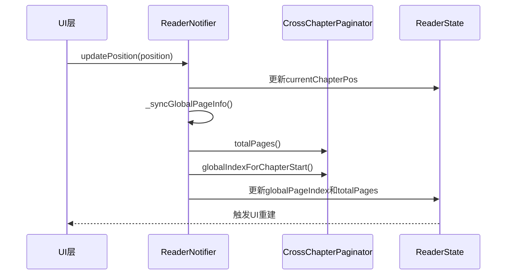

**图表来源**
- [reader_notifier.dart:207-236](file://flutter_legado/lib/src/providers/reader/reader_notifier.dart#L207-L236)

### 核心同步机制实现

#### 增强的updatePosition方法
```dart
void updatePosition(int position) {
  state = state.copyWith(currentChapterPos: position);
  // [UI-fix v2.0.3 | 2026-08-06] 翻页/滑动后同步全局页索引，
  // 保证点击翻页与滑动手势翻页时全局页码指示器实时更新（此前仅
  // updateChapterPageCount 才刷新，导致章内翻页指示器停滞） — Qoder
  _syncGlobalPageInfo();
}
```

#### 全局页信息同步
```dart
void _syncGlobalPageInfo() {
  final total = _paginator.totalPages();
  final globalStart = _paginator.globalIndexForChapterStart(state.currentChapterIndex);
  final globalIndex = globalStart >= 0 ? globalStart + state.currentChapterPos : state.globalPageIndex;
  state = state.copyWith(
    totalPages: total,
    globalPageIndex: globalIndex.clamp(0, total > 0 ? total - 1 : 0),
  );
}
```

### 自定义背景色支持

**更新** 添加了自定义背景色的完整支持，允许用户在阅读界面长按背景圆圈进行自定义配色：

#### 自定义背景色管理
```dart
Future<void> updateCustomBackgroundColor(Color color) async {
  state = state.copyWith(backgroundColor: color);
  final prefs = await SharedPreferences.getInstance();
  await prefs.setInt('reader_custom_bg_color', color.toARGB32());
  await prefs.setBool('reader_bg_use_custom', true);
}
```

#### 启动时恢复自定义背景
```dart
Future<void> _loadSettings() async {
  // ... 其他设置加载
  final prefs = await SharedPreferences.getInstance();
  if (prefs.getBool('reader_bg_use_custom') ?? false) {
    final custom = prefs.getInt('reader_custom_bg_color');
    if (custom != null) backgroundColor = Color(custom);
  }
  // ... 应用设置
}
```

### 行距范围调整

**更新** 将行距上限从2.5提升到3.0，以匹配原版Android应用的设置范围：

```dart
void updateLineHeight(double height) {
  final clamped = height.clamp(1.0, 3.0); // 从2.5提升到3.0
  state = state.copyWith(lineHeight: clamped);
  _settings.setLineHeight(clamped);
}
```

### 阅读器状态结构

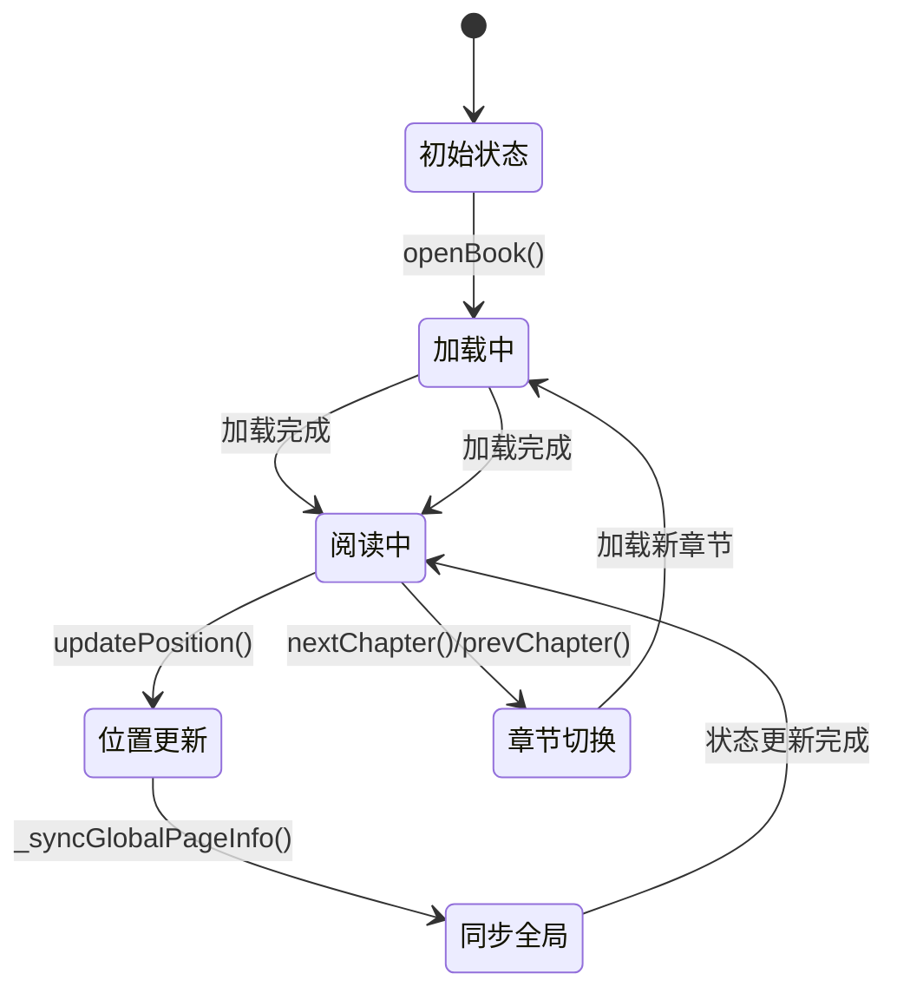

**图表来源**
- [reader_state.dart:92-141](file://flutter_legado/lib/src/providers/reader/reader_state.dart#L92-L141)

### 状态字段说明
- **currentChapterPos**: 当前章节内的阅读位置
- **globalPageIndex**: 跨章节的全局页索引（从0开始）
- **totalPages**: 所有章节的总页数
- **currentChapterIndex**: 当前章节索引

**Section sources**
- [reader_notifier.dart:207-236](file://flutter_legado/lib/src/providers/reader/reader_notifier.dart#L207-L236)
- [reader_state.dart:92-141](file://flutter_legado/lib/src/providers/reader/reader_state.dart#L92-L141)
- [paragraph_layout_engine.dart:725-925](file://flutter_legado/lib/src/widgets/paragraph_layout_engine.dart#L725-L925)

## BookshelfNotifier书籍书架管理

BookshelfNotifier是书架功能的核心状态管理器，提供了完整的书籍管理和展示控制：

### 状态管理架构

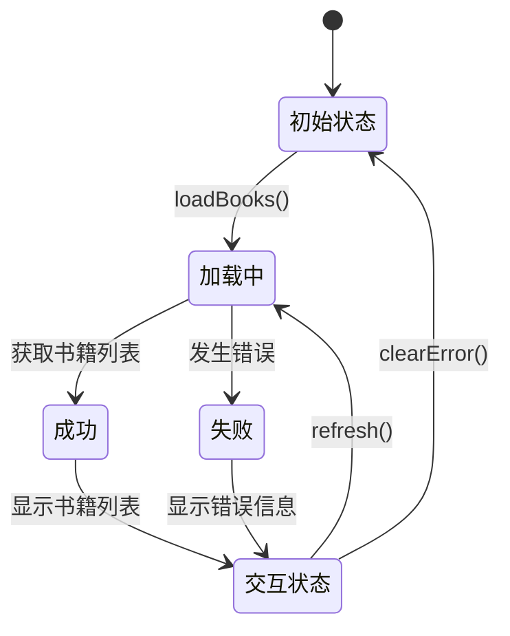

**图表来源**
- [bookshelf_notifier.dart:42-54](file://flutter_legado/lib/src/providers/bookshelf/bookshelf_notifier.dart#L42-L54)

### 核心功能实现

#### 书籍CRUD操作
```dart
Future<void> addBook(Book book) async {
  try {
    final api = ref.read(bookApiProvider);
    await api.addBook(book);
    state = state.copyWith(books: [...state.books, book]);
  } catch (e) {
    state = state.copyWith(error: _mapError(e));
  }
}

Future<void> removeBook(String bookUrl) async {
  try {
    final api = ref.read(bookApiProvider);
    await api.deleteBook(bookUrl);
    state = state.copyWith(
      books: state.books.where((b) => b.bookUrl != bookUrl).toList(),
    );
  } catch (e) {
    state = state.copyWith(error: _mapError(e));
  }
}
```

#### 视图模式切换
```dart
void toggleViewMode() {
  state = state.copyWith(isGridView: !state.isGridView);
}

void setGroupMode(GroupMode mode) {
  state = state.copyWith(groupMode: mode);
}
```

#### 拖拽排序支持
```dart
void reorderBook(int oldIndex, int newIndex) {
  if (oldIndex < 0 || oldIndex >= state.books.length) return;
  if (newIndex > oldIndex) newIndex--;
  
  final books = List<Book>.from(state.books);
  final book = books.removeAt(oldIndex);
  books.insert(newIndex, book);
  
  final reordered = [
    for (var i = 0; i < books.length; i++) 
      books[i].copyWith(order: i),
  ];
  state = state.copyWith(books: reordered);
}
```

**Section sources**
- [bookshelf_notifier.dart:19-171](file://flutter_legado/lib/src/providers/bookshelf/bookshelf_notifier.dart#L19-L171)

## SourceNotifier源管理

SourceNotifier是书源管理的核心组件，提供了完整的书源生命周期管理功能：

### 功能架构

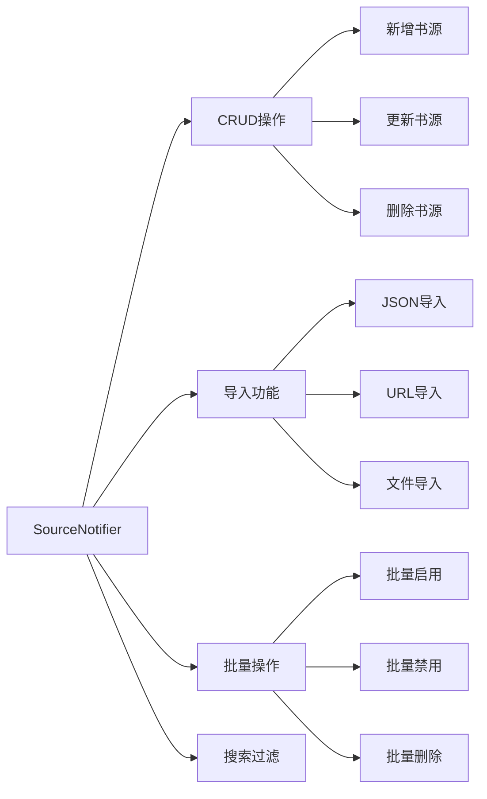

**图表来源**
- [source_notifier.dart:22-383](file://flutter_legado/lib/src/providers/source/source_notifier.dart#L22-L383)

### 核心功能实现

#### 书源CRUD操作
```dart
Future<void> saveSource(BookSource source) async {
  try {
    final api = ref.read(bookApiProvider);
    final index = state.sources.indexWhere(
      (s) => s.bookSourceUrl == source.bookSourceUrl
    );
    
    if (index == -1) {
      // 新建
      final added = await api.addBookSource(source);
      state = state.copyWith(sources: [...state.sources, added]);
    } else {
      // 更新
      await api.updateBookSource(source);
      final newSources = List<BookSource>.of(state.sources);
      newSources[index] = source;
      state = state.copyWith(sources: newSources);
    }
  } catch (e) {
    state = state.copyWith(error: _mapError(e));
    rethrow;
  }
}
```

#### 批量操作管理
```dart
Future<void> batchEnable() async {
  state = state.copyWith(loading: true);
  try {
    final api = ref.read(bookApiProvider);
    final newSources = List<BookSource>.of(state.sources);
    
    for (final url in state.selectedUrls) {
      final index = newSources.indexWhere(
        (s) => s.bookSourceUrl == url
      );
      if (index == -1) continue;
      
      final source = newSources[index];
      if (!source.enabled) {
        final updated = source.copyWith(enabled: true);
        await api.updateBookSource(updated);
        newSources[index] = updated;
      }
    }
    
    state = state.copyWith(
      sources: newSources,
      batchMode: false,
      selectedUrls: {},
      loading: false,
    );
  } catch (e) {
    state = state.copyWith(error: _mapError(e), loading: false);
  }
}
```

#### 导入功能支持
```dart
Future<ImportResult> importFromJson(String jsonStr) async {
  state = state.copyWith(loading: true, error: null);
  try {
    final result = await importService.importFromJson(jsonStr);
    final api = ref.read(bookApiProvider);
    final sources = await api.getBookSources();
    
    state = state.copyWith(
      sources: sources,
      lastImportResult: result,
      loading: false,
    );
    return result;
  } catch (e) {
    state = state.copyWith(error: _mapError(e), loading: false);
    return ImportResult(
      total: 0, success: 0, failed: 0, skipped: 0,
      errors: [e.toString()],
    );
  }
}
```

**Section sources**
- [source_notifier.dart:22-383](file://flutter_legado/lib/src/providers/source/source_notifier.dart#L22-L383)

## RssNotifier RSS订阅管理

RssNotifier负责RSS源和文章的完整管理流程：

### 功能架构

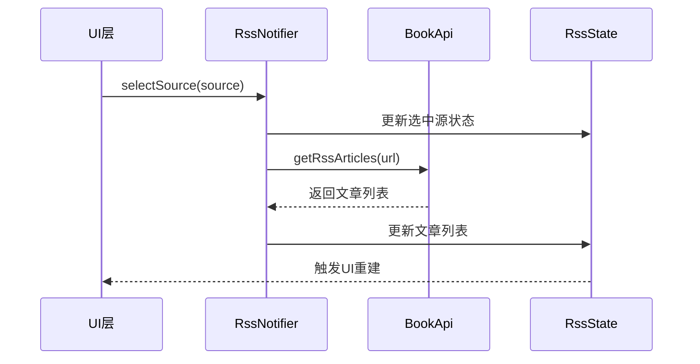

**图表来源**
- [rss_notifier.dart:45-61](file://flutter_legado/lib/src/providers/rss/rss_notifier.dart#L45-L61)

### 核心功能实现

#### 源和文章管理
```dart
Future<void> selectSource(RssSource source) async {
  state = state.copyWith(
    selectedSource: source,
    isLoadingArticles: true,
    error: null,
    articles: [],
  );

  try {
    final api = ref.read(bookApiProvider);
    final articles = await api.getRssArticles(source.sourceUrl);
    state = state.copyWith(articles: articles, isLoadingArticles: false);
  } catch (e) {
    state = state.copyWith(error: _mapError(e), isLoadingArticles: false);
  }
}

Future<void> addSource(String name, String url) async {
  state = state.copyWith(error: null);

  try {
    final newSource = RssSource(
      sourceUrl: url,
      sourceName: name,
    );
    final api = ref.read(bookApiProvider);
    final added = await api.addRssSource(newSource);
    state = state.copyWith(sources: [...state.sources, added]);
  } catch (e) {
    state = state.copyWith(error: _mapError(e));
  }
}
```

#### 分组筛选功能
```dart
void setGroup(String? group) {
  state = state.copyWith(selectedGroup: group);
}

void clearSelectedSource() {
  state = state.copyWith(selectedSource: null, articles: []);
}
```

**Section sources**
- [rss_notifier.dart:18-135](file://flutter_legado/lib/src/providers/rss/rss_notifier.dart#L18-L135)

## SearchNotifier搜索管理

SearchNotifier是搜索功能的完整实现，采用了最新的Riverpod Notifier模式和BookApi集成：

### 架构设计

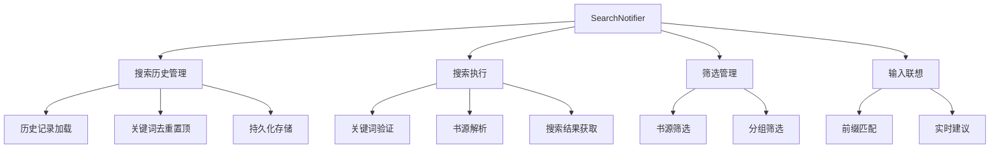

**图表来源**
- [search_notifier.dart:23-215](file://flutter_legado/lib/src/providers/search/search_notifier.dart#L23-L215)

### 核心功能实现

#### 搜索历史管理
```dart
Future<void> addToHistory(String keyword) async {
  final history = [...state.searchHistory];
  history.remove(keyword);
  history.insert(0, keyword);
  final trimmed = history.length > _maxHistory ? history.sublist(0, _maxHistory) : history;
  state = state.copyWith(searchHistory: trimmed);
  try {
    await ref.read(bookApiProvider).addSearchKeyword(keyword, '');
  } catch (_) {
    // 持久化失败不阻断 UI 历史展示
  }
}

Future<void> loadHistory() async {
  try {
    final keywords = await ref.read(bookApiProvider).getSearchHistory();
    state = state.copyWith(
      searchHistory: keywords.map((k) => k.word).toList(),
    );
  } catch (_) {
    // 历史加载失败不阻断搜索主流程，保持空历史
  }
}
```

#### 搜索执行流程
```dart
Future<void> search(String keyword) async {
  final trimmed = keyword.trim();
  if (trimmed.isEmpty) return;

  state = state.copyWith(keyword: trimmed, isLoading: true, error: null);
  await addToHistory(trimmed);

  try {
    final sourceUrls = await _resolveSearchSources();
    if (sourceUrls != null && sourceUrls.isEmpty) {
      state = state.copyWith(
        error: '所选筛选范围内无有效书源，请调整筛选条件',
        isLoading: false,
      );
      return;
    }
    final results = await ref.read(bookApiProvider).searchBooks(
          trimmed,
          sourceUrls: sourceUrls,
        );
    state = state.copyWith(results: results, isLoading: false);
  } catch (e) {
    state = state.copyWith(error: _mapError(e), isLoading: false);
  }
}
```

#### 智能筛选解析
```dart
Future<List<String>?> _resolveSearchSources() async {
  if (state.selectedSourceUrls.isEmpty && state.selectedGroups.isEmpty) {
    return null;
  }

  final urls = <String>{...state.selectedSourceUrls};

  if (state.selectedGroups.isNotEmpty) {
    try {
      final allSources = await ref.read(bookApiProvider).getEnabledBookSources();
      for (final source in allSources) {
        final group = source.bookSourceGroup;
        if (group != null && group.isNotEmpty) {
          final sourceGroups = group.split(RegExp(r'[,，]')).map((g) => g.trim());
          if (sourceGroups.any(state.selectedGroups.contains)) {
            urls.add(source.bookSourceUrl);
          }
        }
      }
    } catch (_) {
      // 分组解析失败时仅使用直接选中的书源
    }
  }

  return urls.toList();
}
```

### 状态结构设计

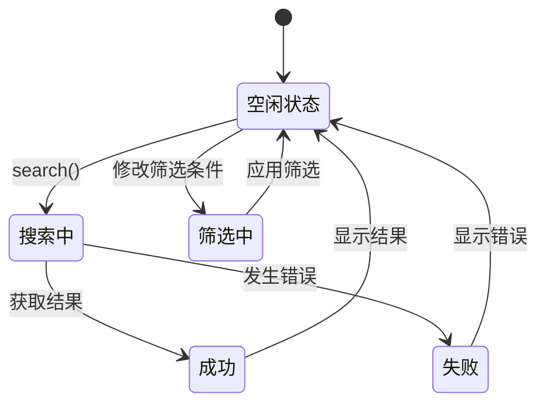

**图表来源**
- [search_state.dart:12-38](file://flutter_legado/lib/src/providers/search/search_state.dart#L12-L38)

### 联想搜索功能
```dart
List<String> get suggestions {
  final input = inputText.trim();
  if (input.isEmpty) return searchHistory;
  return searchHistory.where((w) => w.startsWith(input)).toList();
}

void setInput(String text) {
  if (state.inputText == text) return;
  state = state.copyWith(inputText: text);
}
```

**Section sources**
- [search_notifier.dart:23-215](file://flutter_legado/lib/src/providers/search/search_notifier.dart#L23-L215)
- [search_state.dart:12-65](file://flutter_legado/lib/src/providers/search/search_state.dart#L12-L65)

## ChangeCoverNotifier封面管理

ChangeCoverNotifier是封面管理功能的完整实现，展示了Riverpod Notifier模式的典型应用和BookApi抽象层的完美集成：

### 架构设计

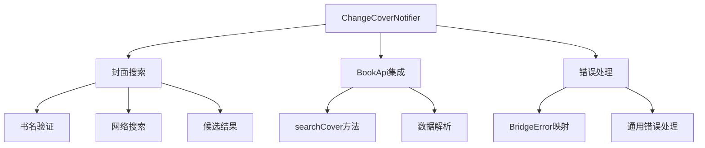

**图表来源**
- [change_cover_notifier.dart:18-62](file://flutter_legado/lib/src/providers/change_cover/change_cover_notifier.dart#L18-62)

### 核心功能实现

#### 封面搜索功能
```dart
Future<void> searchCovers(String bookName) async {
  final keyword = bookName.trim();
  if (keyword.isEmpty) return;
  state = state.copyWith(isSearching: true, error: null);
  try {
    final raw = await ref.read(bookApiProvider).searchCover(keyword);
    final candidates = raw
        .whereType<Map<String, dynamic>>()
        .map(CoverCandidate.fromJson)
        .toList();
    state = state.copyWith(candidates: candidates, isSearching: false);
  } catch (e) {
    state = state.copyWith(error: _mapError(e), isSearching: false);
  }
}
```

#### 错误处理策略
```dart
String _mapError(Object e) {
  if (e is BridgeError) return e.message;
  return e.toString();
}
```

### 状态结构设计

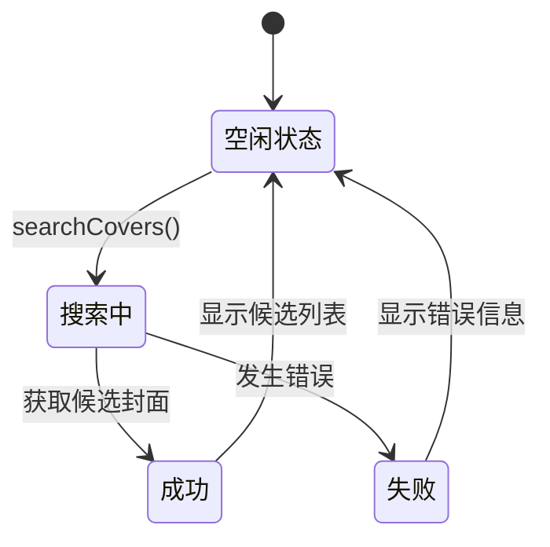

**图表来源**
- [change_cover_state.dart:12-23](file://flutter_legado/lib/src/providers/change_cover/change_cover_state.dart#L12-23)

### UI集成示例
ChangeCoverScreen展示了如何使用ChangeCoverNotifier：

```dart
class _ChangeCoverScreenState extends ConsumerState<ChangeCoverScreen> {
  void _searchCovers() {
    ref
        .read(changeCoverNotifierProvider.notifier)
        .searchCovers(_searchController.text);
  }

  @override
  Widget build(BuildContext context) {
    final coverState = ref.watch(changeCoverNotifierProvider);
    // 使用coverState.candidates渲染封面网格
  }
}
```

**Section sources**
- [change_cover_notifier.dart:18-75](file://flutter_legado/lib/src/providers/change_cover/change_cover_notifier.dart#L18-75)
- [change_cover_state.dart:12-24](file://flutter_legado/lib/src/providers/change_cover/change_cover_state.dart#L12-24)

## DictNotifier字典查询管理

DictNotifier是字典查询功能的完整实现，展示了BookApi抽象层在配置管理和数据查询方面的应用：

### 架构设计

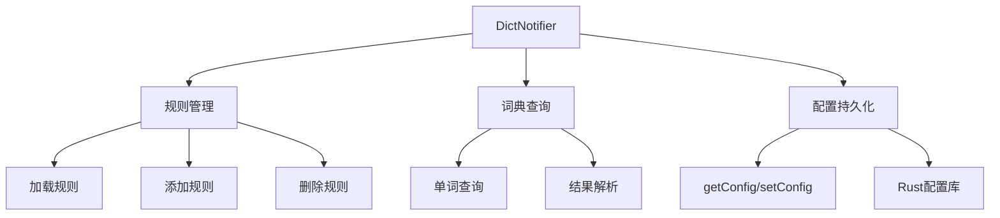

**图表来源**
- [dict_notifier.dart:22-136](file://flutter_legado/lib/src/providers/dict/dict_notifier.dart#L22-136)

### 核心功能实现

#### 规则管理功能
```dart
Future<void> loadRules() async {
  state = state.copyWith(isLoading: true, error: null);
  try {
    final api = ref.read(bookApiProvider);
    final raw = await api.getConfig(_configKey);
    List<DictRule> rules;
    if (raw == null || raw.isEmpty) {
      rules = _defaultRules;
      await api.setConfig(_configKey, _encode(rules));
    } else {
      rules = _decode(raw);
    }
    state = state.copyWith(rules: rules, isLoading: false);
  } catch (e) {
    state = state.copyWith(error: _mapError(e), isLoading: false);
  }
}

Future<void> addRule(DictRule rule) async {
  final rules = [...state.rules, rule];
  state = state.copyWith(rules: rules);
  await _persist(rules);
}
```

#### 词典查询功能
```dart
Future<void> lookup(String word) async {
  final key = word.trim().toLowerCase();
  if (key.isEmpty) return;
  state = state.copyWith(
    queriedWord: key,
    result: null,
    isLoading: true,
    error: null,
  );
  try {
    final raw = await ref.read(bookApiProvider).dictLookup(key);
    state = state.copyWith(
      result: DictEntry.fromJson(raw),
      isLoading: false,
    );
  } catch (e) {
    state = state.copyWith(error: _mapError(e), isLoading: false);
  }
}
```

#### 配置持久化
```dart
Future<void> _persist(List<DictRule> rules) async {
  try {
    await ref.read(bookApiProvider).setConfig(_configKey, _encode(rules));
  } catch (e) {
    state = state.copyWith(error: _mapError(e));
  }
}
```

### 状态结构设计

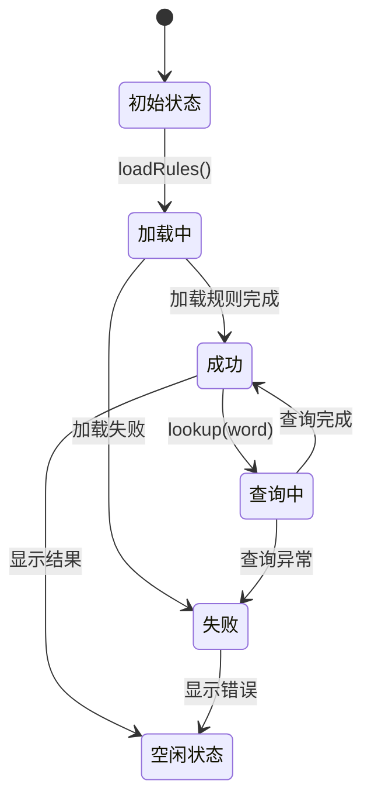

**图表来源**
- [dict_state.dart:12-30](file://flutter_legado/lib/src/providers/dict/dict_state.dart#L12-30)

### 默认规则配置
```dart
static const _defaultRules = [
  DictRule(
    name: '有道词典',
    urlRule: 'https://dict.youdao.com/w/{{key}}',
  ),
  DictRule(
    name: '剑桥词典',
    urlRule: 'https://dictionary.cambridge.org/dictionary/english-chinese-simplified/{{key}}',
  ),
];
```

**Section sources**
- [dict_notifier.dart:22-136](file://flutter_legado/lib/src/providers/dict/dict_notifier.dart#L22-136)
- [dict_state.dart:12-30](file://flutter_legado/lib/src/providers/dict/dict_state.dart#L12-30)

## ImportScreen导入功能

ImportScreen是本地书籍导入页面的完整实现，展示了Riverpod依赖注入的最佳实践和BookApi抽象层的正确使用：

### 架构设计

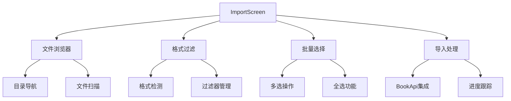

**图表来源**
- [import_screen.dart:43-77](file://flutter_legado/lib/src/screens/import_screen.dart#L43-77)

### 核心功能实现

#### 文件浏览和过滤
```dart
Future<void> _enterDir(Directory dir) async {
  setState(() {
    _currentDir = dir;
    _loading = true;
    _error = null;
  });
  try {
    final dirs = <Directory>[];
    final files = <File>[];
    await for (final entity in dir.list(followLinks: false)) {
      if (entity is Directory) {
        final name = entity.uri.pathSegments
            .where((s) => s.isNotEmpty)
            .lastOrNull;
        // 跳过隐藏目录
        if (name != null && !name.startsWith('.')) {
          dirs.add(entity);
        }
      } else if (entity is File) {
        final ext = _extOf(entity.path);
        if (_allBrowsableFormats.contains(ext)) {
          files.add(entity);
        }
      }
    }
    // 排序和状态更新
  } catch (e) {
    // 错误处理
  }
}
```

#### 压缩包导入处理
```dart
Future<void> _openArchiveImport(String path) async {
  // 经 BookApi（Riverpod 注入层）确认是否为压缩包
  try {
    final isArchive =
        await ref.read(bookApiProvider).archiveIsArchive(filePath: path);
    if (!isArchive) {
      if (mounted) {
        ScaffoldMessenger.of(context).showSnackBar(
          const SnackBar(content: Text('该文件不是有效的压缩包格式')),
        );
      }
      return;
    }
  } catch (_) {
    // FFI 调用失败时仍然尝试打开（可能是扩展名匹配但 FFI 未初始化）
  }
  if (!mounted) return;
  showDialog<void>(
    context: context,
    builder: (_) => ArchiveImportDialog(archivePath: path),
  );
}
```

#### 批量导入处理
```dart
Future<void> _startImport() async {
  if (_selected.isEmpty || _importing) return;
  final notifier = ref.read(bookshelfNotifierProvider.notifier);
  final paths = _selected.toList()..sort();

  setState(() {
    _importing = true;
    _importDone = 0;
    _importTotal = paths.length;
    _outcomes.clear();
    _showResult = false;
  });

  for (final path in paths) {
    final name = _displayName(path);
    // 逐次读取最新书架状态（导入会增量更新 state.books）
    if (_isAlreadyImported(path, ref.read(bookshelfNotifierProvider))) {
      _outcomes.add(_ImportOutcome(name: name, success: false, skipped: true));
    } else {
      try {
        await notifier.importLocalBook(path);
        _outcomes.add(_ImportOutcome(name: name, success: true));
      } catch (e) {
        _outcomes.add(_ImportOutcome(name: name, success: false, error: e.toString()));
      }
    }
    if (mounted) {
      setState(() => _importDone++);
    }
  }

  // 刷新书架确保与后端一致
  await notifier.refresh();
}
```

### 状态结构设计

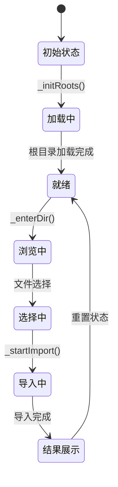

**图表来源**
- [import_screen.dart:50-77](file://flutter_legado/lib/src/screens/import_screen.dart#L50-77)

### Riverpod依赖注入使用
ImportScreen展示了正确的Riverpod依赖注入模式：

```dart
// 通过bookApiProvider获取API实例
final isArchive = await ref.read(bookApiProvider).archiveIsArchive(filePath: path);

// 通过bookshelfNotifierProvider访问书架状态
if (_isAlreadyImported(path, ref.read(bookshelfNotifierProvider))) {
  // 处理已存在的书籍
}

// 通过notifier访问方法
await notifier.importLocalBook(path);
```

**Section sources**
- [import_screen.dart:43-630](file://flutter_legado/lib/src/screens/import_screen.dart#L43-630)
- [providers.dart:7-18](file://flutter_legado/lib/src/providers/providers.dart#L7-18)
- [book_api.dart:760-762](file://flutter_legado/lib/src/services/book_api.dart#L760-762)

## 其他功能Notifier

### AudioNotifier音频播放管理
管理音频播放器的状态和控制：
- 播放/暂停/停止控制
- 播放进度跟踪
- 播放队列管理
- 音频文件缓存

### AutoTaskNotifier定时任务管理
处理应用的定时任务调度：
- 任务创建和配置
- 任务执行状态监控
- 任务优先级管理
- 错误重试机制

### BookmarkNotifier书签管理
管理阅读书签的CRUD操作：
- 书签添加和删除
- 书签位置管理
- 书签分类和搜索
- 书签导入导出

### 其他Notifier
- **AssociationNotifier**: 关联关系管理
- **ExploreNotifier**: 发现页面状态管理
- **ReaderNotifier**: 阅读器状态管理
- **ReadingStatsNotifier**: 阅读统计管理
- **ReplaceRuleNotifier**: 替换规则管理
- **SyncNotifier**: 数据同步管理

## 状态更新机制

### 不可变状态更新
所有Notifier都遵循不可变状态更新模式：

```dart
// 旧方式（ChangeNotifier）
_data = newData;
notifyListeners();

// 新方式（Riverpod Notifier）
state = state.copyWith(data: newData);
```

### 异步状态处理
统一的异步处理模式：

```dart
Future<void> loadData() async {
  state = state.copyWith(isLoading: true, error: null);
  
  try {
    final data = await api.getData();
    state = state.copyWith(data: data, isLoading: false);
  } catch (e) {
    state = state.copyWith(error: _mapError(e), isLoading: false);
  }
}
```

### 错误处理策略
统一的错误映射和处理：

```dart
String _mapError(Object e) {
  if (e is BridgeError) return e.message;
  return e.toString();
}
```

## Notifier间通信

### 依赖注入
通过ref.read进行服务依赖注入：

```dart
class BookshelfNotifier extends Notifier<BookshelfState> {
  Future<void> addBook(Book book) async {
    final api = ref.read(bookApiProvider);
    await api.addBook(book);
    state = state.copyWith(books: [...state.books, book]);
  }
}
```

### Provider注册
在应用启动时注册所有Provider：

```dart
runApp(
  ProviderScope(
    child: LegadoApp(initialRoute: initialRoute, lastCrashLog: lastCrash),
  ),
);
```

### 跨Notifier通信
通过共享服务和API进行Notifier间通信：

```dart
// 在Notifier中访问共享服务
final settingsService = SettingsService();
final bookApi = ref.read(bookApiProvider);
```

## 最佳实践与性能优化

### 状态设计原则
- **单一职责**：每个Notifier专注于特定领域
- **不可变数据**：使用copyWith创建新状态实例
- **最小化状态**：只存储必要的状态数据
- **派生计算**：使用扩展方法计算展示数据

### 性能优化技巧
- **精确重建**：ref.watch自动追踪依赖，避免不必要的重建
- **懒加载**：按需加载数据和Notifier
- **防抖处理**：频繁操作时添加防抖机制
- **内存管理**：及时清理监听器，避免循环引用

### 测试策略
- **单元测试**：覆盖Notifier的核心逻辑
- **集成测试**：验证端到端流程
- **Mock依赖**：使用Mock对象进行测试

### 代码组织
- **模块化结构**：按功能域组织Notifier
- **清晰接口**：暴露必要的方法和数据
- **错误处理**：统一的错误处理机制
- **文档注释**：详细的代码注释和示例

### 偏好管理最佳实践
- **统一键管理**：使用PrefKeys常量统一管理所有偏好键
- **类型安全**：通过SettingsService提供类型安全的读写方法
- **默认值处理**：合理设置默认值，避免空指针异常
- **异步加载**：在build方法中异步加载偏好数据

**Section sources**
- [main.dart:75-86](file://flutter_legado/lib/main.dart#L75-L86)
- [app.dart:45-65](file://flutter_legado/lib/app.dart#L45-L65)
- [providers.dart:7-18](file://flutter_legado/lib/src/providers/providers.dart#L7-L18)
- [rust_api.dart:231-246](file://flutter_legado/lib/src/services/rust_api.dart#L231-L246)
- [rust_api.dart:838-866](file://flutter_legado/lib/src/services/rust_api.dart#L838-866)
- [rust_api.dart:1730-1733](file://flutter_legado/lib/src/services/rust_api.dart#L1730-L1733)
- [pref_keys.dart:1-192](file://flutter_legado/lib/src/constants/pref_keys.dart#L1-L192)