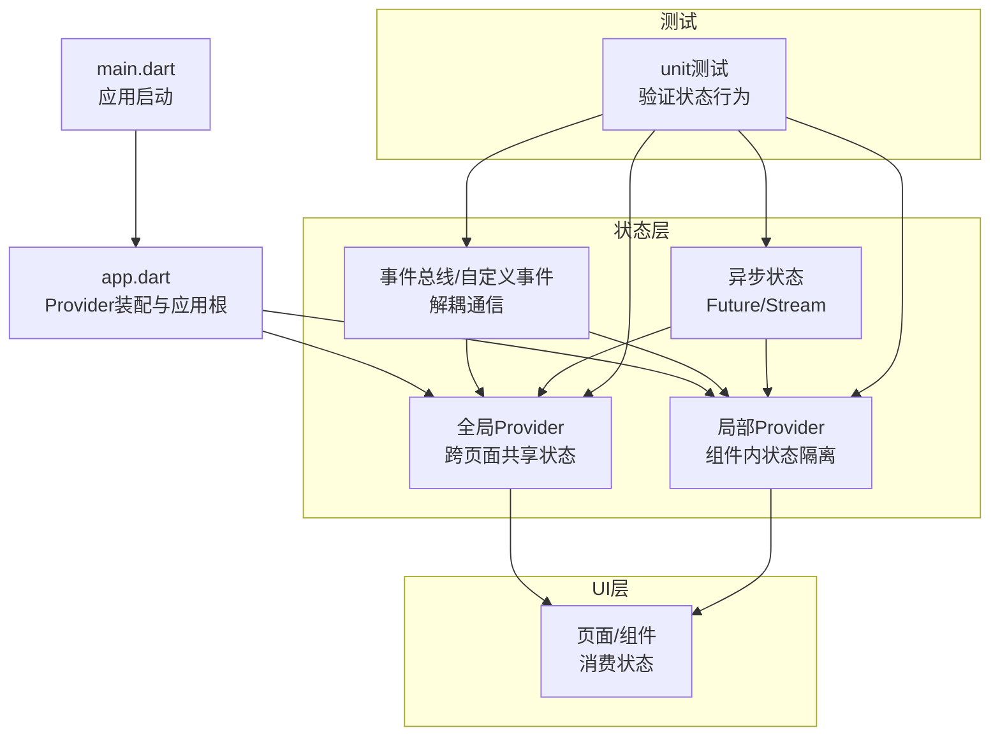
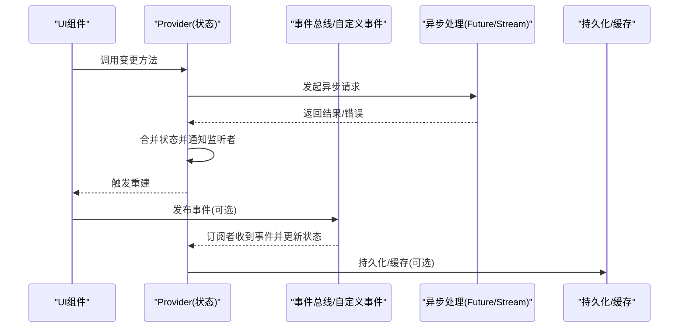
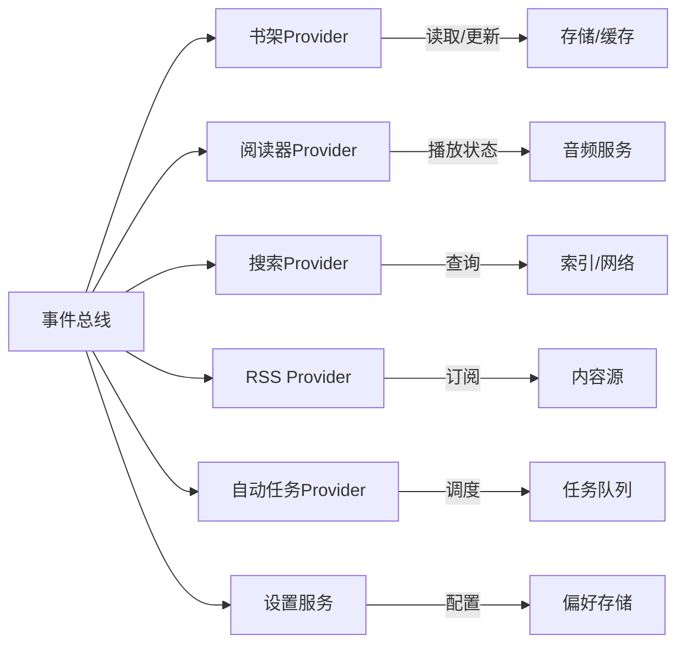

# 状态通信模式

<cite>
**本文档引用的文件**   
- [app.dart](file://flutter_legado/lib/app.dart)
- [main.dart](file://flutter_legado/lib/main.dart)
- [pubspec.yaml](file://flutter_legado/pubspec.yaml)
- [bookshelf_provider_test.dart](file://flutter_legado/test/unit/bookshelf_provider_test.dart)
- [reader_provider_test.dart](file://flutter_legado/test/unit/reader_provider_test.dart)
- [search_provider_test.dart](file://flutter_legado/test/unit/search_provider_test.dart)
- [rss_provider_test.dart](file://flutter_legado/test/unit/rss_provider_test.dart)
- [auto_task_test.dart](file://flutter_legado/test/unit/auto_task_test.dart)
- [settings_service_test.dart](file://flutter_legado/test/unit/settings_service_test.dart)
</cite>

## 目录
1. [简介](#简介)
2. [项目结构](#项目结构)
3. [核心组件](#核心组件)
4. [架构总览](#架构总览)
5. [详细组件分析](#详细组件分析)
6. [依赖分析](#依赖分析)
7. [性能考虑](#性能考虑)
8. [故障排查指南](#故障排查指南)
9. [结论](#结论)
10. [附录](#附录)

## 简介
本文件围绕Flutter应用中的“状态通信模式”进行系统化说明，重点包括：
- Provider之间的数据共享与通信机制（全局状态管理与局部状态隔离）
- 事件驱动的状态更新模式（事件总线与自定义事件）
- 异步状态处理（Future与Stream的使用场景）
- 状态更新优化策略（防抖、节流、批量更新）
- Provider间通信的最佳实践与性能优化建议
- 结合仓库中测试用例的示例路径，展示不同通信模式的用法

本说明旨在帮助开发者在复杂应用中构建可维护、高性能且易于调试的状态管理方案。

## 项目结构
Flutter端代码位于 flutter_legado 目录，入口为 main.dart，应用初始化与Provider配置通常在 app.dart 中完成。测试用例集中在 test/unit 下，覆盖书架、阅读器、搜索、RSS、自动任务、设置服务等模块的状态行为验证。

图表来源
- [main.dart](file://flutter_legado/lib/main.dart)
- [app.dart](file://flutter_legado/lib/app.dart)

章节来源
- [main.dart](file://flutter_legado/lib/main.dart)
- [app.dart](file://flutter_legado/lib/app.dart)

## 核心组件
- 全局状态Provider：用于跨页面共享的数据（如用户信息、主题、网络状态等），通过顶层Provider注入，避免层层传参。
- 局部状态Provider：封装在特定Widget树内的状态，提高隔离性与渲染效率。
- 事件总线/自定义事件：以发布-订阅方式实现模块间解耦通信，适合跨层级或无直接依赖的组件交互。
- 异步状态处理：使用Future表示一次性异步结果，使用Stream表示持续数据流（如实时日志、进度、网络事件）。

章节来源
- [pubspec.yaml](file://flutter_legado/pubspec.yaml)

## 架构总览
下图展示了典型的状态通信流程：UI触发动作→业务逻辑处理→状态更新→UI响应。Provider作为状态容器，事件总线作为解耦通道，异步操作确保非阻塞体验。

图表来源
- [app.dart](file://flutter_legado/lib/app.dart)
- [bookshelf_provider_test.dart](file://flutter_legado/test/unit/bookshelf_provider_test.dart)
- [reader_provider_test.dart](file://flutter_legado/test/unit/reader_provider_test.dart)
- [search_provider_test.dart](file://flutter_legado/test/unit/search_provider_test.dart)
- [rss_provider_test.dart](file://flutter_legado/test/unit/rss_provider_test.dart)
- [auto_task_test.dart](file://flutter_legado/test/unit/auto_task_test.dart)
- [settings_service_test.dart](file://flutter_legado/test/unit/settings_service_test.dart)

## 详细组件分析

### 全局状态与局部状态隔离
- 全局状态：在应用根节点提供，所有子树均可访问；适用于跨页面共享、频繁读写的状态。
- 局部状态：在组件内部提供，仅该Widget树可见；适用于表单输入、列表筛选条件等临时状态。
- 隔离原则：尽量将易变、高频更新的局部状态下沉到组件内，减少全局状态粒度，降低不必要的重绘。

章节来源
- [app.dart](file://flutter_legado/lib/app.dart)

### 事件驱动的状态更新模式
- 事件总线：定义统一的事件类型，发布者发送事件，订阅者根据事件类型执行相应逻辑。
- 自定义事件：针对具体业务场景定义事件载荷，保证类型安全与可追踪性。
- 适用场景：跨层级组件通信、第三方插件回调、后台任务完成通知等。

章节来源
- [bookshelf_provider_test.dart](file://flutter_legado/test/unit/bookshelf_provider_test.dart)
- [reader_provider_test.dart](file://flutter_legado/test/unit/reader_provider_test.dart)
- [search_provider_test.dart](file://flutter_legado/test/unit/search_provider_test.dart)
- [rss_provider_test.dart](file://flutter_legado/test/unit/rss_provider_test.dart)
- [auto_task_test.dart](file://flutter_legado/test/unit/auto_task_test.dart)
- [settings_service_test.dart](file://flutter_legado/test/unit/settings_service_test.dart)

### 异步状态处理（Future与Stream）
- Future：适用于一次性异步操作（如网络请求、文件读写），完成后更新状态。
- Stream：适用于连续数据流（如实时日志、进度条、WebSocket消息），按到达顺序更新状态。
- 最佳实践：在Provider中封装异步逻辑，对外暴露同步接口；对Stream进行必要的去抖/节流处理。

章节来源
- [search_provider_test.dart](file://flutter_legado/test/unit/search_provider_test.dart)
- [rss_provider_test.dart](file://flutter_legado/test/unit/rss_provider_test.dart)
- [auto_task_test.dart](file://flutter_legado/test/unit/auto_task_test.dart)

### 状态更新优化策略
- 防抖（Debounce）：合并短时间内重复触发的事件，减少无效更新（如搜索输入）。
- 节流（Throttle）：限制单位时间内最多执行一次，避免过载（如滚动加载、频繁点击）。
- 批量更新：将多次状态变更合并为一次提交，减少重建次数（如批量导入、批量删除）。

章节来源
- [search_provider_test.dart](file://flutter_legado/test/unit/search_provider_test.dart)
- [auto_task_test.dart](file://flutter_legado/test/unit/auto_task_test.dart)

### Provider间通信最佳实践
- 单一职责：每个Provider只负责一个领域状态，避免“上帝Provider”。
- 明确边界：全局与局部状态清晰划分，减少耦合。
- 不可变更新：通过创建新对象替换旧状态，便于Diff与缓存。
- 错误边界：在Provider中捕获异常并转换为可观察的错误状态。
- 可测试性：通过Mock与Stub验证Provider行为，确保稳定性。

章节来源
- [bookshelf_provider_test.dart](file://flutter_legado/test/unit/bookshelf_provider_test.dart)
- [reader_provider_test.dart](file://flutter_legado/test/unit/reader_provider_test.dart)
- [settings_service_test.dart](file://flutter_legado/test/unit/settings_service_test.dart)

## 依赖分析
Provider之间应保持低耦合，通过事件总线或明确的API接口通信。避免循环依赖，必要时引入中间层或服务类。

图表来源
- [bookshelf_provider_test.dart](file://flutter_legado/test/unit/bookshelf_provider_test.dart)
- [reader_provider_test.dart](file://flutter_legado/test/unit/reader_provider_test.dart)
- [search_provider_test.dart](file://flutter_legado/test/unit/search_provider_test.dart)
- [rss_provider_test.dart](file://flutter_legado/test/unit/rss_provider_test.dart)
- [auto_task_test.dart](file://flutter_legado/test/unit/auto_task_test.dart)
- [settings_service_test.dart](file://flutter_legado/test/unit/settings_service_test.dart)

章节来源
- [pubspec.yaml](file://flutter_legado/pubspec.yaml)

## 性能考虑
- 最小化重建范围：使用Consumer或Selector精确订阅所需字段。
- 避免大对象频繁复制：采用增量更新或不可变数据结构优化。
- 合理拆分Provider：按功能域拆分，减少单Provider体积。
- 异步批处理：合并多次写入，降低I/O压力。
- 缓存热点数据：在Provider层引入内存缓存，提升读取性能。

[本节为通用指导，不直接分析具体文件]

## 故障排查指南
- 状态未更新：检查Provider是否被正确订阅，是否存在作用域问题。
- 异步错误：确认Future/Stream的错误分支已处理，并提供用户反馈。
- 事件丢失：验证事件总线订阅生命周期，避免过早销毁。
- 性能抖动：使用性能分析工具定位频繁重建的Widget，优化状态粒度。
- 测试失败：检查Mock数据是否与真实行为一致，确保断言覆盖关键路径。

章节来源
- [bookshelf_provider_test.dart](file://flutter_legado/test/unit/bookshelf_provider_test.dart)
- [reader_provider_test.dart](file://flutter_legado/test/unit/reader_provider_test.dart)
- [search_provider_test.dart](file://flutter_legado/test/unit/search_provider_test.dart)
- [rss_provider_test.dart](file://flutter_legado/test/unit/rss_provider_test.dart)
- [auto_task_test.dart](file://flutter_legado/test/unit/auto_task_test.dart)
- [settings_service_test.dart](file://flutter_legado/test/unit/settings_service_test.dart)

## 结论
通过合理划分全局与局部状态、采用事件驱动的通信模式、规范异步处理与优化策略，可以在Flutter应用中构建高效、可维护的状态管理体系。结合单元测试验证关键路径，有助于持续提升质量与性能。

[本节为总结性内容，不直接分析具体文件]

## 附录
- 参考测试用例路径（示例）：
  - 书架状态行为：[bookshelf_provider_test.dart](file://flutter_legado/test/unit/bookshelf_provider_test.dart)
  - 阅读器状态行为：[reader_provider_test.dart](file://flutter_legado/test/unit/reader_provider_test.dart)
  - 搜索状态行为：[search_provider_test.dart](file://flutter_legado/test/unit/search_provider_test.dart)
  - RSS状态行为：[rss_provider_test.dart](file://flutter_legado/test/unit/rss_provider_test.dart)
  - 自动任务状态行为：[auto_task_test.dart](file://flutter_legado/test/unit/auto_task_test.dart)
  - 设置服务状态行为：[settings_service_test.dart](file://flutter_legado/test/unit/settings_service_test.dart)

[本节为补充信息，不直接分析具体文件]