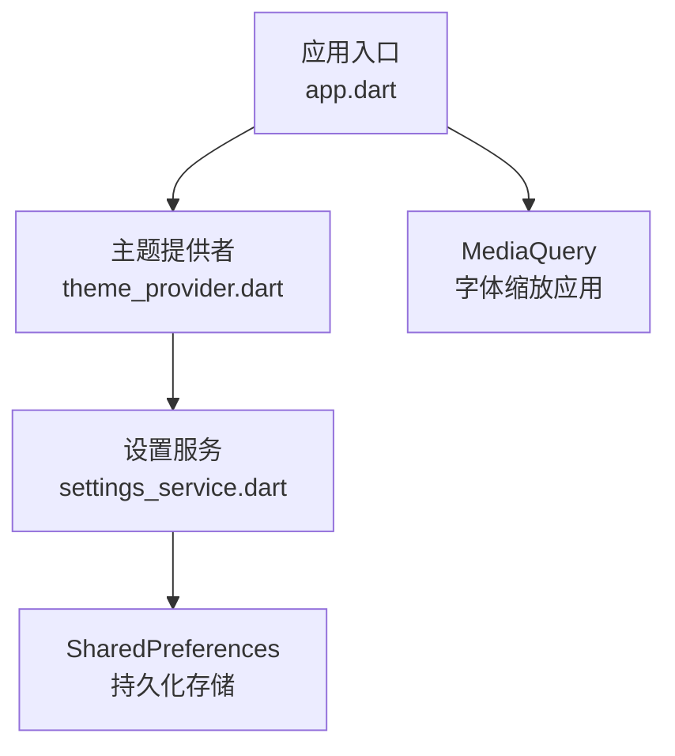
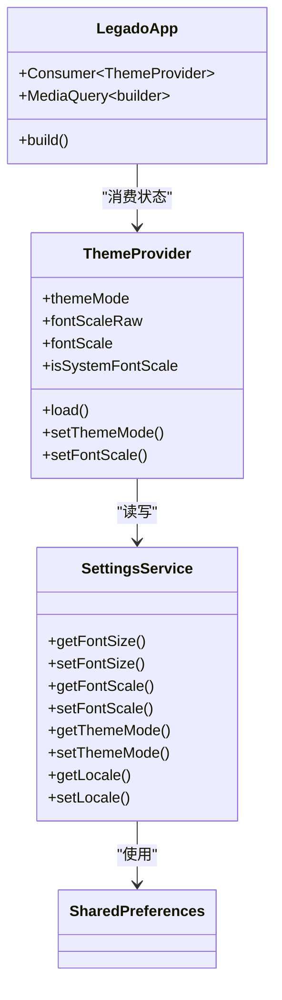
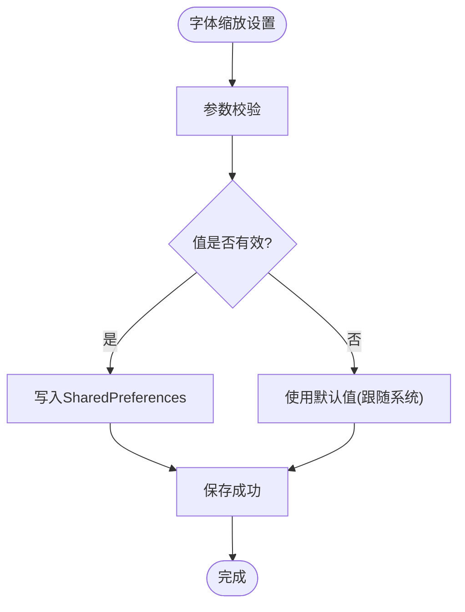
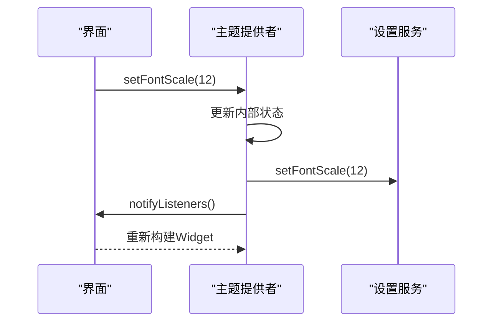
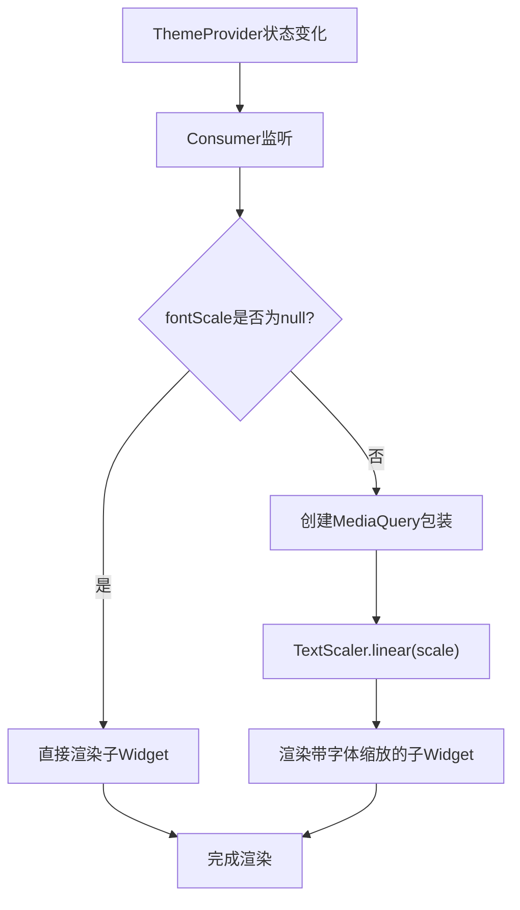
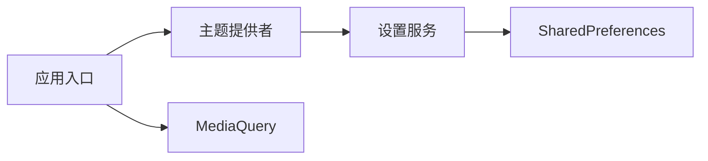

# 设置Provider

<cite>
**本文引用的文件**   
- [SettingsService.kt](file://flutter_legado/lib/src/services/settings_service.dart)
- [ThemeProvider.kt](file://flutter_legado/lib/src/providers/theme_provider.dart)
- [App.kt](file://flutter_legado/lib/app.dart)
- [settings_service_test.dart](file://flutter_legado/test/unit/settings_service_test.dart)
- [theme_provider_test.dart](file://flutter_legado/test/unit/theme_provider_test.dart)
</cite>

## 更新摘要
**所做更改**   
- 新增全局字体缩放功能（getFontScale/setFontScale）
- 增强ThemeProvider与SettingsService的集成，实现响应式UI更新
- 完善字体缩放的边界处理和默认值管理
- 添加完整的单元测试覆盖新功能的验证

## 目录
1. [简介](#简介)
2. [项目结构](#项目结构)
3. [核心组件](#核心组件)
4. [架构总览](#架构总览)
5. [详细组件分析](#详细组件分析)
6. [依赖关系分析](#依赖关系分析)
7. [性能考虑](#性能考虑)
8. [故障排查指南](#故障排查指南)
9. [结论](#结论)
10. [附录](#附录)

## 简介
本文件围绕应用"设置Provider"进行系统化技术文档化，聚焦用户偏好、主题配置、字体设置等设置的存储与管理机制。内容涵盖：
- 持久化方案与数据序列化（SharedPreferences 的使用）
- 设置验证与默认值处理
- 设置变更监听与响应机制
- 多语言配置的动态切换实现
- 设置项扩展方法与自定义配置的实现指南
- **新增**：全局字体缩放功能的完整实现与集成

## 项目结构
在 Flutter 应用中，设置相关能力由以下模块协作完成：
- 设置服务（SettingsService）：统一读写 SharedPreferences，提供类型安全的访问接口
- 主题提供者（ThemeProvider）：管理主题状态和字体缩放，驱动响应式UI更新
- 应用入口（LegadoApp）：集成ThemeProvider，应用全局字体缩放
- 测试套件：完整的单元测试覆盖所有设置功能

**图表来源** 
- [app.dart](file://flutter_legado/lib/app.dart)
- [theme_provider.dart](file://flutter_legado/lib/src/providers/theme_provider.dart)
- [settings_service.dart](file://flutter_legado/lib/src/services/settings_service.dart)

**章节来源**
- [app.dart](file://flutter_legado/lib/app.dart)
- [settings_service.dart](file://flutter_legado/lib/src/services/settings_service.dart)
- [theme_provider.dart](file://flutter_legado/lib/src/providers/theme_provider.dart)

## 核心组件
- 设置服务（SettingsService）
  - 职责：集中管理 SharedPreferences 的读写，暴露类型安全的方法；维护键名常量；支持异步操作和异常处理。
  - 关键点：异步IO、默认值回退、异常捕获、批量写入。
- 主题提供者（ThemeProvider）
  - 职责：管理主题模式和全局字体缩放，提供响应式状态管理；通过ChangeNotifier驱动UI更新。
  - 关键点：状态同步、通知机制、边界处理、计算属性。
- 应用入口（LegadoApp）
  - 职责：集成ThemeProvider，应用全局字体缩放到整个应用。
  - 关键点：MediaQuery集成、条件渲染、性能优化。

**章节来源**
- [settings_service.dart](file://flutter_legado/lib/src/services/settings_service.dart)
- [theme_provider.dart](file://flutter_legado/lib/src/providers/theme_provider.dart)
- [app.dart](file://flutter_legado/lib/app.dart)

## 架构总览
设置体系采用"服务 + 提供者 + 应用"的分层设计：
- 服务层：直接对接 SharedPreferences，保证数据一致性与异步操作
- 状态管理层：面向UI状态，封装复杂逻辑（校验、默认值、计算属性）
- 应用层：集成状态管理，应用全局配置到UI树

**图表来源** 
- [settings_service.dart](file://flutter_legado/lib/src/services/settings_service.dart)
- [theme_provider.dart](file://flutter_legado/lib/src/providers/theme_provider.dart)
- [app.dart](file://flutter_legado/lib/app.dart)

## 详细组件分析

### 设置服务（SettingsService）
- 存储与序列化
  - 基于 SharedPreferences 进行键值对持久化
  - 支持基础类型与简单对象的序列化
  - 提供异步方法避免阻塞主线程
- 默认值与验证
  - 读取时若缺失则返回默认值
  - 异常捕获确保稳定性
- 字体缩放功能
  - getFontScale(): 获取全局字体缩放原始值（0=跟随系统，8~16=0.8x~1.6x）
  - setFontScale(): 设置字体缩放并持久化
  - 键名：app_font_scale

**图表来源** 
- [settings_service.dart](file://flutter_legado/lib/src/services/settings_service.dart)

**章节来源**
- [settings_service.dart](file://flutter_legado/lib/src/services/settings_service.dart)

### 主题提供者（ThemeProvider）
- 功能
  - 管理主题模式（亮/暗/跟随系统）
  - 管理全局字体缩放（原始值与计算值）
  - 提供响应式状态更新
- 字体缩放处理
  - fontScaleRaw: 原始存储值（0, 8~16）
  - fontScale: 计算后的实际缩放倍数（null表示跟随系统）
  - isSystemFontScale: 判断是否跟随系统
  - fontScaleLabel: 显示文本（如"当前字体大小：1.2"）
- 状态管理
  - load(): 启动时加载持久化设置
  - setThemeMode(): 设置主题并通知监听者
  - setFontScale(): 设置字体缩放并通知监听者

**图表来源** 
- [theme_provider.dart](file://flutter_legado/lib/src/providers/theme_provider.dart)
- [settings_service.dart](file://flutter_legado/lib/src/services/settings_service.dart)

**章节来源**
- [theme_provider.dart](file://flutter_legado/lib/src/providers/theme_provider.dart)

### 应用入口（LegadoApp）
- 功能
  - 集成ThemeProvider作为全局状态管理
  - 应用全局字体缩放到整个应用
  - 条件渲染MediaQuery以应用字体缩放
- 字体缩放应用
  - 通过Consumer监听ThemeProvider状态变化
  - 当fontScale不为null时，使用MediaQuery包装子Widget
  - TextScaler.linear(scale)实现线性缩放

**图表来源** 
- [app.dart](file://flutter_legado/lib/app.dart)
- [theme_provider.dart](file://flutter_legado/lib/src/providers/theme_provider.dart)

**章节来源**
- [app.dart](file://flutter_legado/lib/app.dart)

### 测试覆盖
- SettingsService测试
  - 字体大小、行距、背景色等基础功能测试
  - 字体缩放功能的完整测试覆盖
  - 主题模式、语言设置等高级功能测试
- ThemeProvider测试
  - 初始状态验证
  - 加载持久化设置测试
  - 字体缩放边界值测试（8→0.8, 16→1.6）
  - 跟随系统逻辑测试（值为0或超出范围）

**章节来源**
- [settings_service_test.dart](file://flutter_legado/test/unit/settings_service_test.dart)
- [theme_provider_test.dart](file://flutter_legado/test/unit/theme_provider_test.dart)

## 依赖关系分析
- 低耦合
  - SettingsService不依赖具体业务，仅关注键值读写
  - ThemeProvider依赖SettingsService，但不反向依赖UI
  - LegadoApp依赖ThemeProvider，实现松耦合的状态管理
- 高内聚
  - 每个组件专注单一领域（设置持久化、状态管理、UI应用）
- 外部依赖
  - SharedPreferences（Flutter官方持久化插件）
  - Provider（状态管理）
  - Material Design（UI框架）

**图表来源** 
- [settings_service.dart](file://flutter_legado/lib/src/services/settings_service.dart)
- [theme_provider.dart](file://flutter_legado/lib/src/providers/theme_provider.dart)
- [app.dart](file://flutter_legado/lib/app.dart)

**章节来源**
- [settings_service.dart](file://flutter_legado/lib/src/services/settings_service.dart)
- [theme_provider.dart](file://flutter_legado/lib/src/providers/theme_provider.dart)
- [app.dart](file://flutter_legado/lib/app.dart)

## 性能考虑
- 读写优化
  - 异步IO避免阻塞主线程
  - 延迟加载与缓存热点配置
- 状态更新优化
  - 按需订阅，避免不必要的重建
  - 去抖与节流变更回调
- 内存管理
  - 及时释放监听器
  - 避免循环引用

## 故障排查指南
- 常见问题
  - 字体缩放未生效：检查fontScale值是否正确，MediaQuery是否正确应用
  - 主题切换无效：确认ThemeProvider是否正确初始化，notifyListeners是否调用
  - 设置持久化失败：检查SharedPreferences权限，异常处理日志
- 定位步骤
  - 查看设置服务的异常日志
  - 检查ThemeProvider的状态变化
  - 验证SharedPreferences中的键值
  - 调试MediaQuery的textScaler值

**章节来源**
- [settings_service.dart](file://flutter_legado/lib/src/services/settings_service.dart)
- [theme_provider.dart](file://flutter_legado/lib/src/providers/theme_provider.dart)
- [app.dart](file://flutter_legado/lib/app.dart)

## 结论
设置体系通过清晰的分层设计与响应式状态管理，实现了稳定、可扩展且高性能的用户偏好管理。新增的全局字体缩放功能进一步完善了应用的个性化设置能力，通过与ThemeProvider的深度集成，实现了真正的响应式UI更新。借助SharedPreferences的持久化能力与Provider的状态管理机制，结合完善的测试覆盖，能够保障用户体验的一致性与可靠性。

## 附录
- 扩展设置项的建议
  - 在SettingsService中定义新的get/set方法
  - 在ThemeProvider中添加相应的状态管理
  - 在LegadoApp中集成新的UI应用逻辑
  - 编写完整的单元测试覆盖新功能
- 自定义配置实现指南
  - 定义配置数据结构（含字段、默认值、校验）
  - 在SettingsService中集成该配置
  - 在ThemeProvider中管理相关状态
  - 在UI层绑定设置项，确保实时反馈
- 字体缩放最佳实践
  - 遵循0=跟随系统，8~16=0.8x~1.6x的映射规则
  - 使用isSystemFontScale判断是否需要应用缩放
  - 提供友好的用户界面展示当前缩放级别