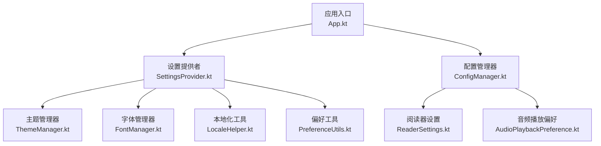
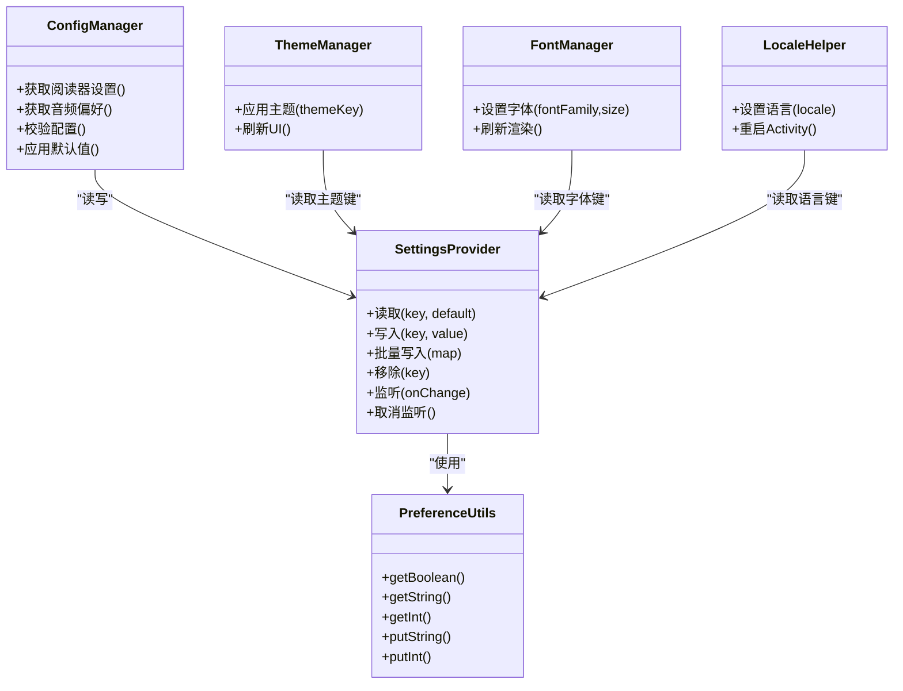
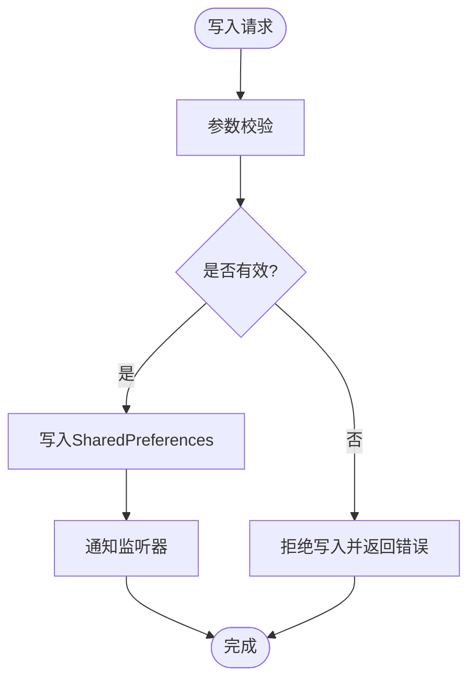
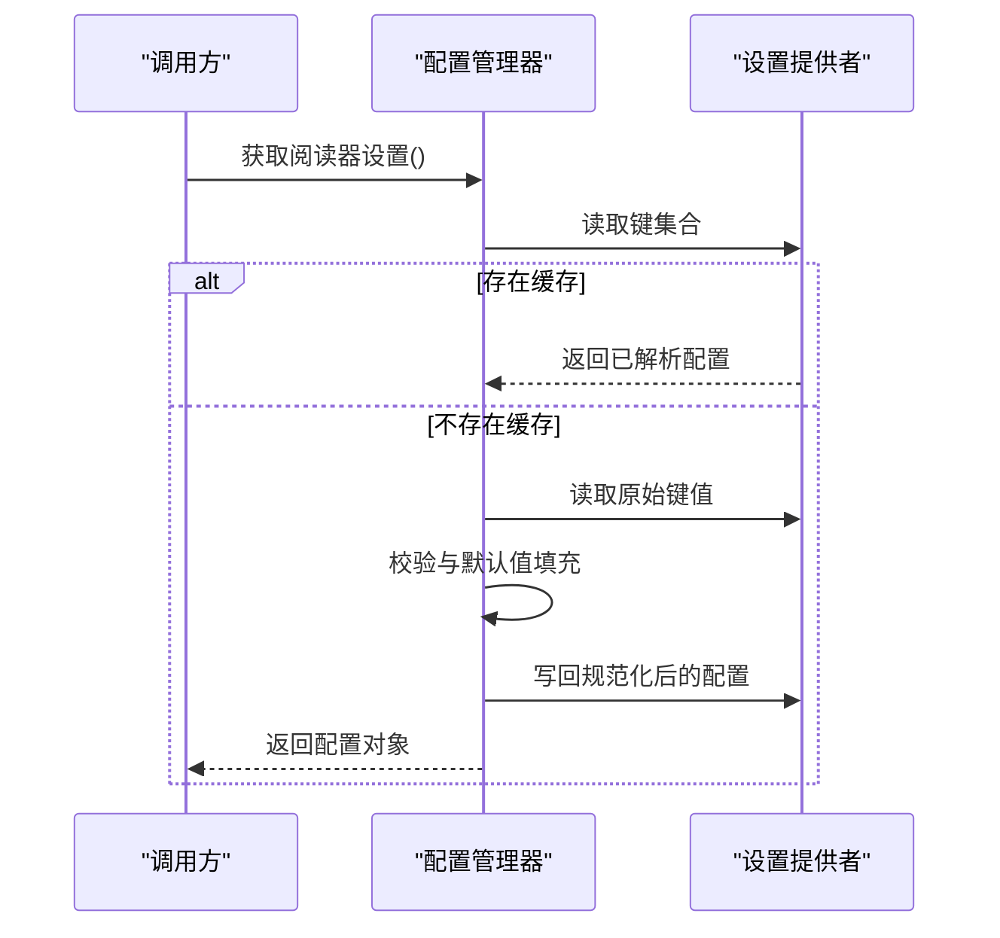
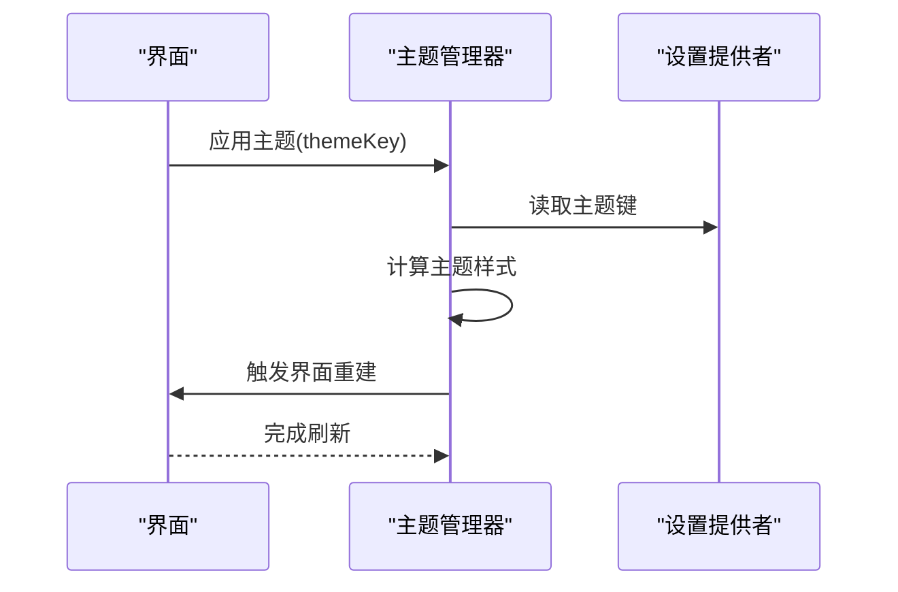
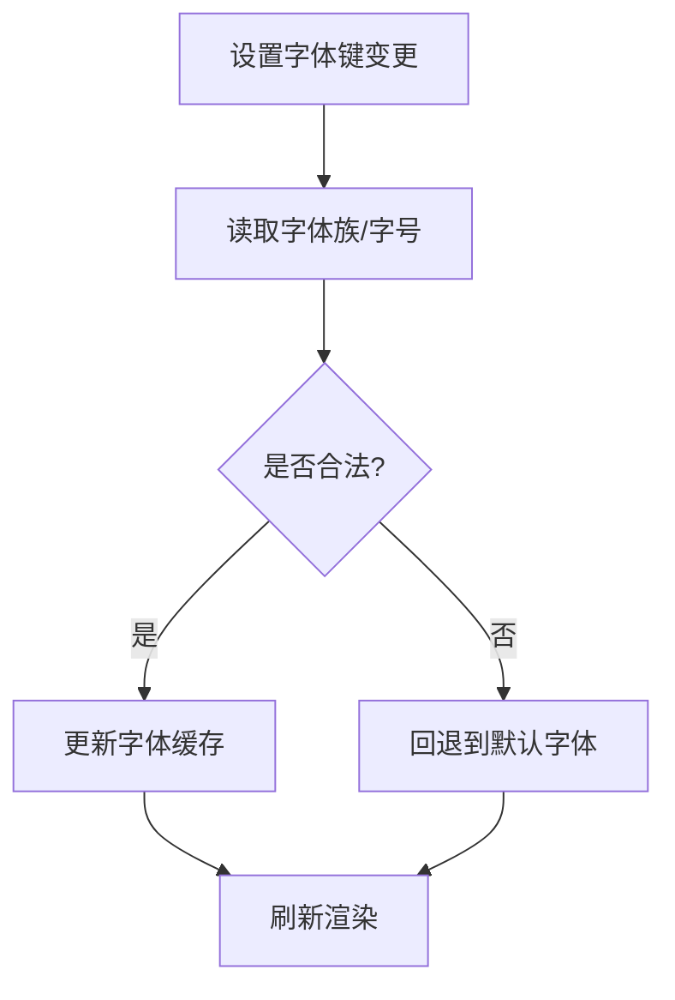
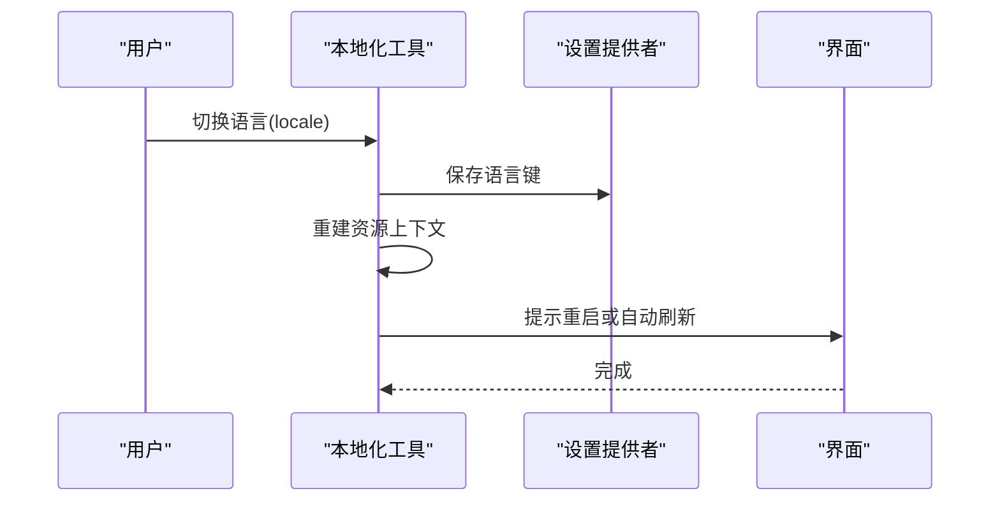
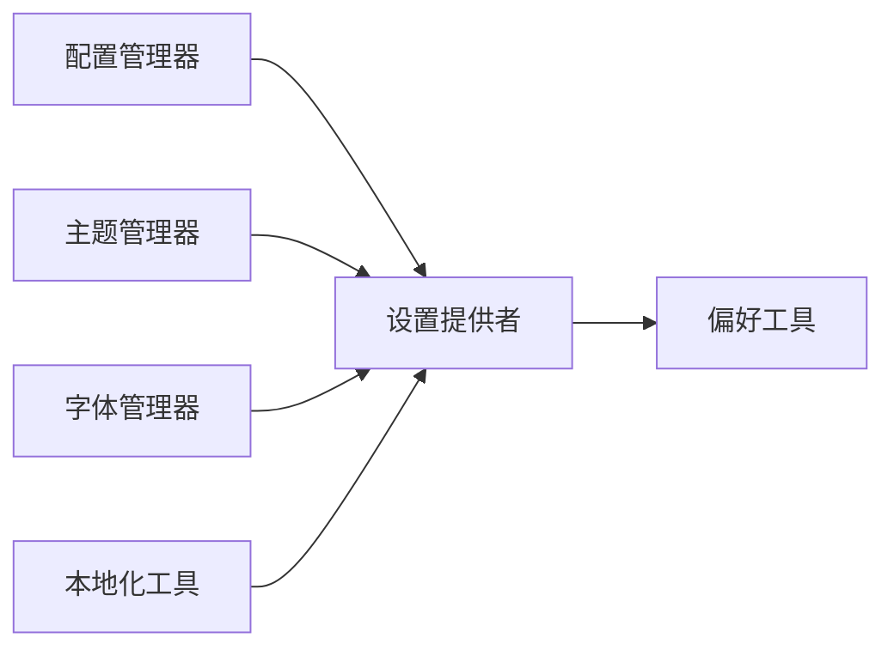

# 设置Provider

<cite>
**本文引用的文件**   
- [App.kt](file://app/src/main/java/io/legado/app/App.kt)
- [SettingsProvider.kt](file://app/src/main/java/io/legado/app/utils/SettingsProvider.kt)
- [ConfigManager.kt](file://app/src/main/java/io/legado/app/help/ConfigManager.kt)
- [ThemeManager.kt](file://app/src/main/java/io/legado/app/ui/theme/ThemeManager.kt)
- [FontManager.kt](file://app/src/main/java/io/legado/app/ui/font/FontManager.kt)
- [LocaleHelper.kt](file://app/src/main/java/io/legado/app/utils/LocaleHelper.kt)
- [PreferenceUtils.kt](file://app/src/main/java/io/legado/app/utils/PreferenceUtils.kt)
- [ReaderSettings.kt](file://app/src/main/java/io/legado/app/model/reader/ReaderSettings.kt)
- [AudioPlaybackPreference.kt](file://app/src/main/java/io/legado/app/model/AudioPlaybackPreference.kt)
</cite>

## 目录
1. [简介](#简介)
2. [项目结构](#项目结构)
3. [核心组件](#核心组件)
4. [架构总览](#架构总览)
5. [详细组件分析](#详细组件分析)
6. [依赖关系分析](#依赖关系分析)
7. [性能考虑](#性能考虑)
8. [故障排查指南](#故障排查指南)
9. [结论](#结论)
10. [附录](#附录)

## 简介
本文件围绕应用“设置Provider”进行系统化技术文档化，聚焦用户偏好、主题配置、字体设置等设置的存储与管理机制。内容涵盖：
- 持久化方案与数据序列化（SharedPreferences 的使用）
- 设置验证与默认值处理
- 设置变更监听与响应机制
- 多语言配置的动态切换实现
- 设置项扩展方法与自定义配置的实现指南

## 项目结构
在 Android 应用中，设置相关能力通常由以下模块协作完成：
- 全局初始化入口：负责应用启动时加载并缓存关键设置
- 设置提供者：统一读写 SharedPreferences，提供类型安全的访问接口
- 配置管理器：聚合业务域配置（如阅读、音频播放），并提供校验与默认值
- 主题与字体管理器：基于设置驱动 UI 主题与字体渲染
- 本地化工具：管理语言资源与运行时语言切换
- 工具类：封装 SharedPreferences 的常用操作

**图表来源** 
- [App.kt](file://app/src/main/java/io/legado/app/App.kt)
- [SettingsProvider.kt](file://app/src/main/java/io/legado/app/utils/SettingsProvider.kt)
- [ConfigManager.kt](file://app/src/main/java/io/legado/app/help/ConfigManager.kt)
- [ThemeManager.kt](file://app/src/main/java/io/legado/app/ui/theme/ThemeManager.kt)
- [FontManager.kt](file://app/src/main/java/io/legado/app/ui/font/FontManager.kt)
- [LocaleHelper.kt](file://app/src/main/java/io/legado/app/utils/LocaleHelper.kt)
- [PreferenceUtils.kt](file://app/src/main/java/io/legado/app/utils/PreferenceUtils.kt)
- [ReaderSettings.kt](file://app/src/main/java/io/legado/app/model/reader/ReaderSettings.kt)
- [AudioPlaybackPreference.kt](file://app/src/main/java/io/legado/app/model/AudioPlaybackPreference.kt)

**章节来源**
- [App.kt](file://app/src/main/java/io/legado/app/App.kt)
- [SettingsProvider.kt](file://app/src/main/java/io/legado/app/utils/SettingsProvider.kt)
- [ConfigManager.kt](file://app/src/main/java/io/legado/app/help/ConfigManager.kt)

## 核心组件
- 设置提供者（SettingsProvider）
  - 职责：集中管理 SharedPreferences 的读写，暴露类型安全的方法；维护键名常量；支持监听器注册与回调。
  - 关键点：线程安全、默认值回退、批量写入、事件分发。
- 配置管理器（ConfigManager）
  - 职责：聚合各业务域的配置对象（阅读器、音频等），提供统一的获取与更新入口；负责配置校验与默认值填充。
- 主题管理器（ThemeManager）
  - 职责：根据设置中的主题键值切换系统/应用主题，必要时触发界面重建。
- 字体管理器（FontManager）
  - 职责：根据设置选择字体族/大小，影响文本渲染与预览。
- 本地化工具（LocaleHelper）
  - 职责：读取语言设置，动态切换应用语言环境，确保资源匹配。
- 偏好工具（PreferenceUtils）
  - 职责：对 SharedPreferences 的常见操作进行封装，简化调用。

**章节来源**
- [SettingsProvider.kt](file://app/src/main/java/io/legado/app/utils/SettingsProvider.kt)
- [ConfigManager.kt](file://app/src/main/java/io/legado/app/help/ConfigManager.kt)
- [ThemeManager.kt](file://app/src/main/java/io/legado/app/ui/theme/ThemeManager.kt)
- [FontManager.kt](file://app/src/main/java/io/legado/app/ui/font/FontManager.kt)
- [LocaleHelper.kt](file://app/src/main/java/io/legado/app/utils/LocaleHelper.kt)
- [PreferenceUtils.kt](file://app/src/main/java/io/legado/app/utils/PreferenceUtils.kt)

## 架构总览
设置体系采用“提供者 + 管理器 + 工具”的分层设计：
- 提供者层：直接对接 SharedPreferences，保证数据一致性与可观测性
- 管理层：面向业务域，封装复杂逻辑（校验、默认值、组合配置）
- 工具层：通用能力（读写、序列化、监听）

**图表来源** 
- [SettingsProvider.kt](file://app/src/main/java/io/legado/app/utils/SettingsProvider.kt)
- [ConfigManager.kt](file://app/src/main/java/io/legado/app/help/ConfigManager.kt)
- [ThemeManager.kt](file://app/src/main/java/io/legado/app/ui/theme/ThemeManager.kt)
- [FontManager.kt](file://app/src/main/java/io/legado/app/ui/font/FontManager.kt)
- [LocaleHelper.kt](file://app/src/main/java/io/legado/app/utils/LocaleHelper.kt)
- [PreferenceUtils.kt](file://app/src/main/java/io/legado/app/utils/PreferenceUtils.kt)

## 详细组件分析

### 设置提供者（SettingsProvider）
- 存储与序列化
  - 基于 SharedPreferences 进行键值对持久化
  - 支持基础类型与简单对象的序列化（如 JSON 字符串）
  - 提供批量写入以提升性能
- 默认值与验证
  - 读取时若缺失则返回默认值
  - 写入前可进行范围或格式校验，非法值拒绝写入并记录日志
- 监听机制
  - 支持注册监听器，当指定 key 变化时触发回调
  - 支持按 key 精确订阅或全量监听
- 线程模型
  - 读写建议在主线程或协程调度器上执行，避免并发冲突
  - 内部可使用锁或原子操作保证一致性

**图表来源** 
- [SettingsProvider.kt](file://app/src/main/java/io/legado/app/utils/SettingsProvider.kt)
- [PreferenceUtils.kt](file://app/src/main/java/io/legado/app/utils/PreferenceUtils.kt)

**章节来源**
- [SettingsProvider.kt](file://app/src/main/java/io/legado/app/utils/SettingsProvider.kt)
- [PreferenceUtils.kt](file://app/src/main/java/io/legado/app/utils/PreferenceUtils.kt)

### 配置管理器（ConfigManager）
- 职责
  - 聚合阅读器、音频等配置对象
  - 提供统一的获取与更新接口
  - 负责配置校验与默认值填充
- 数据流
  - 首次启动或迁移后，从 SharedPreferences 加载配置
  - 未命中时生成默认配置并写回
  - 后续变更通过 SettingsProvider 持久化

**图表来源** 
- [ConfigManager.kt](file://app/src/main/java/io/legado/app/help/ConfigManager.kt)
- [SettingsProvider.kt](file://app/src/main/java/io/legado/app/utils/SettingsProvider.kt)
- [ReaderSettings.kt](file://app/src/main/java/io/legado/app/model/reader/ReaderSettings.kt)

**章节来源**
- [ConfigManager.kt](file://app/src/main/java/io/legado/app/help/ConfigManager.kt)
- [ReaderSettings.kt](file://app/src/main/java/io/legado/app/model/reader/ReaderSettings.kt)

### 主题管理器（ThemeManager）
- 功能
  - 根据设置中的主题键切换应用主题
  - 触发必要的界面重建以生效
- 交互
  - 从 SettingsProvider 读取主题键
  - 调用系统 API 应用主题
  - 广播或回调通知 UI 层刷新

**图表来源** 
- [ThemeManager.kt](file://app/src/main/java/io/legado/app/ui/theme/ThemeManager.kt)
- [SettingsProvider.kt](file://app/src/main/java/io/legado/app/utils/SettingsProvider.kt)

**章节来源**
- [ThemeManager.kt](file://app/src/main/java/io/legado/app/ui/theme/ThemeManager.kt)

### 字体管理器（FontManager）
- 功能
  - 根据设置选择字体族与字号
  - 影响文本渲染与预览效果
- 交互
  - 从 SettingsProvider 读取字体相关键
  - 更新字体缓存并在需要时刷新渲染

**图表来源** 
- [FontManager.kt](file://app/src/main/java/io/legado/app/ui/font/FontManager.kt)
- [SettingsProvider.kt](file://app/src/main/java/io/legado/app/utils/SettingsProvider.kt)

**章节来源**
- [FontManager.kt](file://app/src/main/java/io/legado/app/ui/font/FontManager.kt)

### 本地化工具（LocaleHelper）
- 功能
  - 读取语言设置键
  - 动态切换应用语言环境
  - 必要时重启 Activity 以完全生效
- 流程
  - 修改语言键后，重新构建资源上下文
  - 通知 UI 层刷新显示

**图表来源** 
- [LocaleHelper.kt](file://app/src/main/java/io/legado/app/utils/LocaleHelper.kt)
- [SettingsProvider.kt](file://app/src/main/java/io/legado/app/utils/SettingsProvider.kt)

**章节来源**
- [LocaleHelper.kt](file://app/src/main/java/io/legado/app/utils/LocaleHelper.kt)

### 偏好工具（PreferenceUtils）
- 功能
  - 封装 SharedPreferences 的 get/put 方法
  - 提供布尔、整型、字符串等类型的便捷存取
- 优势
  - 减少样板代码
  - 统一异常处理与日志记录

**章节来源**
- [PreferenceUtils.kt](file://app/src/main/java/io/legado/app/utils/PreferenceUtils.kt)

### 阅读器设置（ReaderSettings）
- 内容
  - 阅读背景、行距、翻页模式、夜间模式等
- 特点
  - 与 UI 强相关，变更需即时生效
  - 提供默认值与边界校验

**章节来源**
- [ReaderSettings.kt](file://app/src/main/java/io/legado/app/model/reader/ReaderSettings.kt)

### 音频播放偏好（AudioPlaybackPreference）
- 内容
  - 播放速度、音量策略、后台播放开关等
- 特点
  - 与播放器状态联动，变更需同步至播放引擎

**章节来源**
- [AudioPlaybackPreference.kt](file://app/src/main/java/io/legado/app/model/AudioPlaybackPreference.kt)

## 依赖关系分析
- 低耦合
  - 设置提供者不依赖具体业务，仅关注键值读写与监听
  - 管理器依赖提供者，但不反向依赖 UI
- 高内聚
  - 每个管理器专注单一领域（主题、字体、语言、配置）
- 外部依赖
  - SharedPreferences（系统级持久化）
  - 资源系统（主题、字体、语言资源）

**图表来源** 
- [SettingsProvider.kt](file://app/src/main/java/io/legado/app/utils/SettingsProvider.kt)
- [PreferenceUtils.kt](file://app/src/main/java/io/legado/app/utils/PreferenceUtils.kt)
- [ConfigManager.kt](file://app/src/main/java/io/legado/app/help/ConfigManager.kt)
- [ThemeManager.kt](file://app/src/main/java/io/legado/app/ui/theme/ThemeManager.kt)
- [FontManager.kt](file://app/src/main/java/io/legado/app/ui/font/FontManager.kt)
- [LocaleHelper.kt](file://app/src/main/java/io/legado/app/utils/LocaleHelper.kt)

**章节来源**
- [SettingsProvider.kt](file://app/src/main/java/io/legado/app/utils/SettingsProvider.kt)
- [ConfigManager.kt](file://app/src/main/java/io/legado/app/help/ConfigManager.kt)

## 性能考虑
- 读写优化
  - 批量写入减少磁盘 IO
  - 延迟加载与缓存热点配置
- 监听优化
  - 按需订阅，避免全量监听造成开销
  - 去抖与节流变更回调
- 序列化
  - 大对象尽量分片或压缩存储
  - 避免频繁 GC 的临时对象分配

[本节为通用指导，无需特定文件引用]

## 故障排查指南
- 常见问题
  - 设置未生效：检查键名是否正确、是否被覆盖、监听是否注册
  - 主题/字体切换无效：确认 UI 是否重建、资源是否可用
  - 语言切换失败：确认资源包是否存在、是否需要重启 Activity
- 定位步骤
  - 查看写入日志与返回值
  - 检查 SharedPreferences 中对应键的值
  - 验证监听器回调是否触发
  - 核对默认值与校验逻辑

**章节来源**
- [SettingsProvider.kt](file://app/src/main/java/io/legado/app/utils/SettingsProvider.kt)
- [ThemeManager.kt](file://app/src/main/java/io/legado/app/ui/theme/ThemeManager.kt)
- [FontManager.kt](file://app/src/main/java/io/legado/app/ui/font/FontManager.kt)
- [LocaleHelper.kt](file://app/src/main/java/io/legado/app/utils/LocaleHelper.kt)

## 结论
设置体系通过清晰的层次划分与职责分离，实现了稳定、可扩展且高性能的用户偏好管理。借助 SharedPreferences 的持久化能力与监听机制，结合管理器层的校验与默认值策略，能够保障用户体验的一致性与可靠性。未来可在性能优化与跨端一致性方面继续演进。

[本节为总结性内容，无需特定文件引用]

## 附录
- 扩展设置项的建议
  - 新增键名：在设置提供者中定义常量，提供读写方法
  - 默认值：在配置管理器中声明默认值与校验规则
  - 监听：在需要处订阅变更，避免全局监听
  - 测试：为新增设置编写单元测试，覆盖默认值与边界条件
- 自定义配置实现指南
  - 定义配置数据结构（含字段、默认值、校验）
  - 在配置管理器中集成该配置
  - 在 SettingsProvider 中提供对应的键值存取
  - 在 UI 层绑定设置项，确保实时反馈

[本节为通用指导，无需特定文件引用]