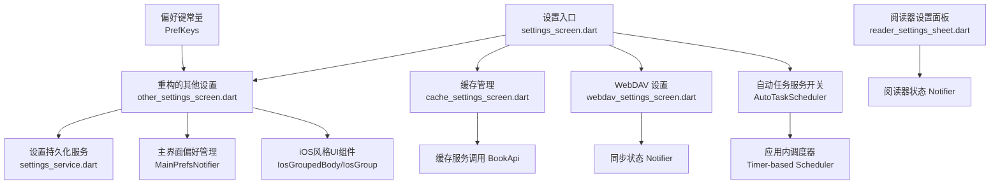
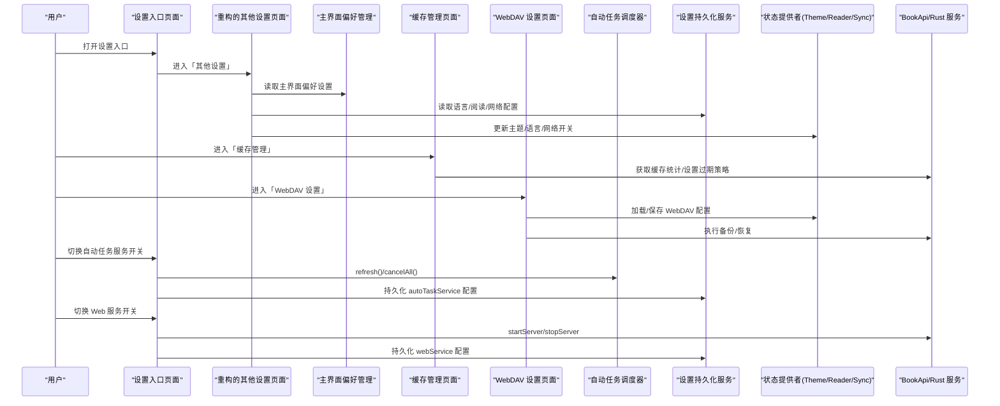
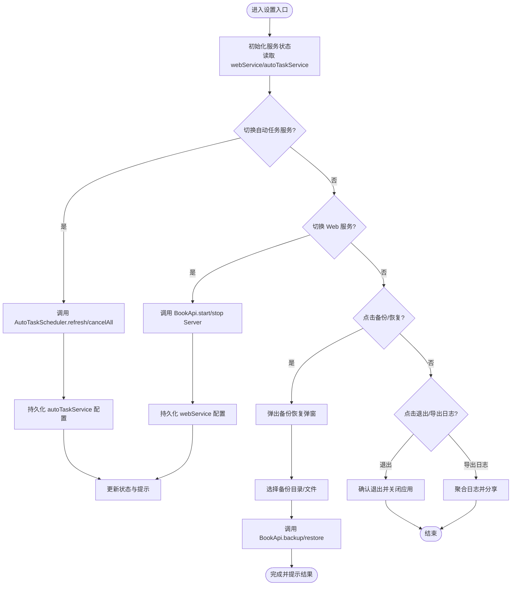
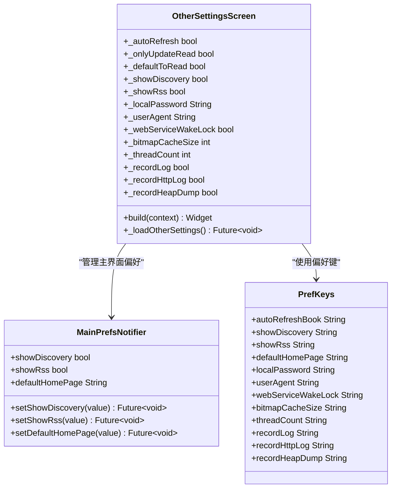
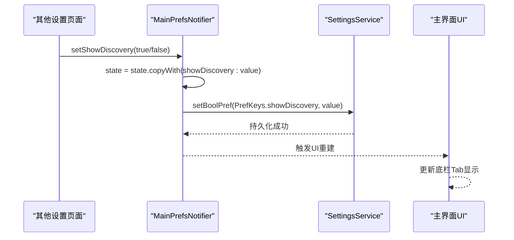
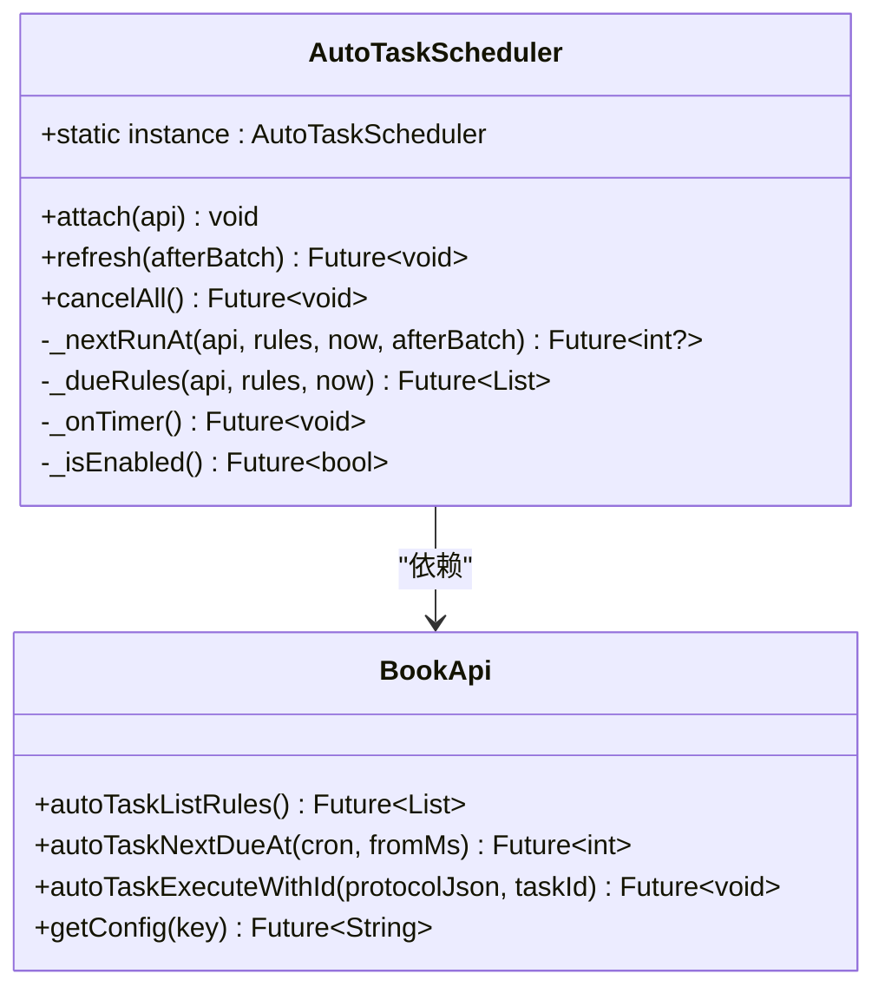
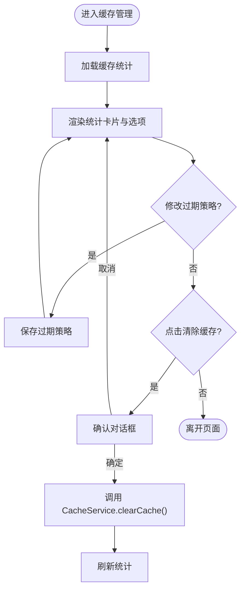
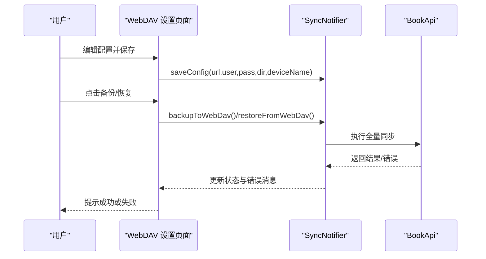
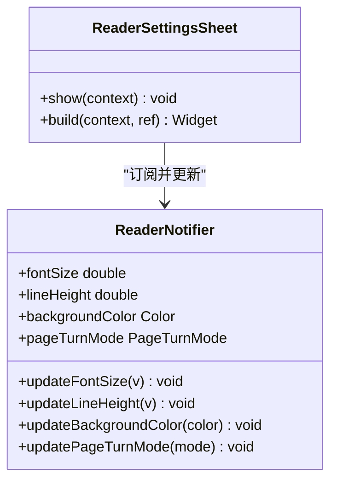
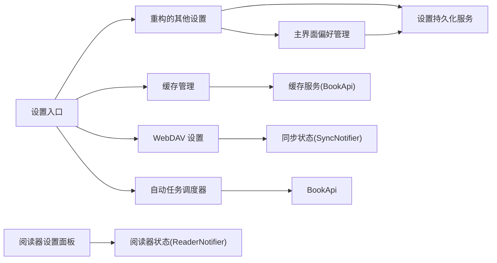

# 设置界面增强

<cite>
**本文引用的文件**   
- [settings_screen.dart](file://flutter_legado/lib/src/screens/settings_screen.dart)
- [other_settings_screen.dart](file://flutter_legado/lib/src/screens/other_settings_screen.dart)
- [cache_settings_screen.dart](file://flutter_legado/lib/src/screens/cache_settings_screen.dart)
- [webdav_settings_screen.dart](file://flutter_legado/lib/src/screens/webdav_settings_screen.dart)
- [reader_settings_sheet.dart](file://flutter_legado/lib/src/widgets/reader/reader_settings_sheet.dart)
- [settings_service.dart](file://flutter_legado/lib/src/services/settings_service.dart)
- [auto_task_scheduler.dart](file://flutter_legado/lib/src/services/auto_task_scheduler.dart)
- [main_prefs_notifier.dart](file://flutter_legado/lib/src/providers/main_prefs_notifier.dart)
- [pref_keys.dart](file://flutter_legado/lib/src/constants/pref_keys.dart)
- [ios_widgets.dart](file://flutter_legado/lib/src/widgets/ios_widgets.dart)
</cite>

## 更新摘要
**变更内容**   
- 其他设置页面完全重构以匹配Android原版OtherConfigFragment布局，包含33个设置项
- 新增主界面偏好设置管理（main_prefs_notifier.dart），控制显示发现、显示订阅、默认首页
- 引入iOS风格UI组件库，提供统一的分组卡片视觉效果
- 新增大量设置项：本地密码、UserAgent、Web服务唤醒锁、图片缓存、线程数、日志记录等
- 完善设置项的持久化存储和状态管理

## 目录
1. [简介](#简介)
2. [项目结构](#项目结构)
3. [核心组件](#核心组件)
4. [架构总览](#架构总览)
5. [详细组件分析](#详细组件分析)
6. [依赖关系分析](#依赖关系分析)
7. [性能考量](#性能考量)
8. [故障排查指南](#故障排查指南)
9. [结论](#结论)
10. [附录](#附录)

## 简介
本文件聚焦于 Legado Flutter 端的"设置界面增强"方案，围绕设置入口、其他设置、缓存管理、WebDAV 同步与阅读设置面板等关键页面进行系统化梳理。**最新更新**：其他设置页面完全重构以匹配Android原版OtherConfigFragment布局，新增33个设置项并分为语言选择、主界面设置、阅读设置、网络设置等多个逻辑分组，同时新增主界面偏好设置管理器，提供完整的设置管理能力。目标是为开发者与使用者提供清晰的架构理解、数据流说明、交互流程与排障建议，帮助快速定位问题并指导后续增强开发。

## 项目结构
Flutter 端设置相关代码集中在 flutter_legado/lib/src 下，按功能拆分：
- 设置入口与聚合页：settings_screen.dart
- **重构后的其他设置页面**：other_settings_screen.dart（33个设置项，多分组布局）
- 缓存管理（统计/过期策略/清理）：cache_settings_screen.dart
- WebDAV 设置（连接/备份恢复/自动同步）：webdav_settings_screen.dart
- 阅读器内嵌设置面板（字体/行距/背景色/翻页模式）：reader_settings_sheet.dart
- 设置持久化服务（SharedPreferences 封装）：settings_service.dart
- **新增**：自动任务调度器（应用内 Timer 调度）：auto_task_scheduler.dart
- **新增**：主界面偏好设置管理：main_prefs_notifier.dart
- **新增**：iOS风格UI组件库：ios_widgets.dart
- **新增**：偏好键常量定义：pref_keys.dart

**图表来源** 
- [settings_screen.dart:1-615](file://flutter_legado/lib/src/screens/settings_screen.dart#L1-L615)
- [other_settings_screen.dart:1-1157](file://flutter_legado/lib/src/screens/other_settings_screen.dart#L1-L1157)
- [cache_settings_screen.dart:1-332](file://flutter_legado/lib/src/screens/cache_settings_screen.dart#L1-L332)
- [webdav_settings_screen.dart:1-280](file://flutter_legado/lib/src/screens/webdav_settings_screen.dart#L1-L280)
- [reader_settings_sheet.dart:1-169](file://flutter_legado/lib/src/widgets/reader/reader_settings_sheet.dart#L1-L169)
- [settings_service.dart:1-584](file://flutter_legado/lib/src/services/settings_service.dart#L1-L584)
- [auto_task_scheduler.dart:1-259](file://flutter_legado/lib/src/services/auto_task_scheduler.dart#L1-L259)
- [main_prefs_notifier.dart:1-91](file://flutter_legado/lib/src/providers/main_prefs_notifier.dart#L1-L91)
- [pref_keys.dart:1-192](file://flutter_legado/lib/src/constants/pref_keys.dart#L1-L192)
- [ios_widgets.dart:1-236](file://flutter_legado/lib/src/widgets/ios_widgets.dart#L1-L236)

章节来源
- [settings_screen.dart:1-615](file://flutter_legado/lib/src/screens/settings_screen.dart#L1-L615)
- [other_settings_screen.dart:1-1157](file://flutter_legado/lib/src/screens/other_settings_screen.dart#L1-L1157)
- [cache_settings_screen.dart:1-332](file://flutter_legado/lib/src/screens/cache_settings_screen.dart#L1-L332)
- [webdav_settings_screen.dart:1-280](file://flutter_legado/lib/src/screens/webdav_settings_screen.dart#L1-L280)
- [reader_settings_sheet.dart:1-169](file://flutter_legado/lib/src/widgets/reader/reader_settings_sheet.dart#L1-L169)
- [settings_service.dart:1-584](file://flutter_legado/lib/src/services/settings_service.dart#L1-L584)
- [auto_task_scheduler.dart:1-259](file://flutter_legado/lib/src/services/auto_task_scheduler.dart#L1-L259)
- [main_prefs_notifier.dart:1-91](file://flutter_legado/lib/src/providers/main_prefs_notifier.dart#L1-L91)
- [pref_keys.dart:1-192](file://flutter_legado/lib/src/constants/pref_keys.dart#L1-L192)
- [ios_widgets.dart:1-236](file://flutter_legado/lib/src/widgets/ios_widgets.dart#L1-L236)

## 核心组件
- 设置入口（SettingsScreen）
  - 聚合书源管理、定时任务、**定时任务服务开关**、TXT 目录规则、替换净化、词典规则、主题模式、Web/MCP 服务等入口
  - 提供"备份恢复"底部弹窗（本地备份/恢复、WebDAV 跳转）、导出日志、退出应用
  - Web 服务开关通过 BookApi 启动/停止 Rust server，并持久化 webService 配置
  - **新增**：自动任务服务开关，控制应用内调度器的启停，支持状态持久化
- **重构后的其他设置页面（OtherSettingsScreen）**
  - **完全对齐Android原版OtherConfigFragment布局**，包含33个设置项
  - **多分组设计**：语言选择、主界面设置、阅读设置、网络设置、其他设置
  - **新增主界面偏好管理**：通过MainPrefsNotifier控制显示发现、显示订阅、默认首页
  - **iOS风格UI**：使用IosGroupedBody、IosSectionHeader、IosGroup等组件
  - **新增设置项**：本地密码、UserAgent、Web服务唤醒锁、图片缓存、线程数、日志记录等
- 缓存管理（CacheSettingsScreen）
  - 展示缓存大小、书籍/章节数量；支持自动过期策略（7/30/永不过期）与一键清理
- WebDAV 设置（WebDavSettingsScreen）
  - 服务器地址/账号/密码/子目录/设备名编辑；备份/恢复操作；最后同步时间显示
  - 同步开关：是否同步书籍进度、是否启用增强模式
- 阅读器设置面板（ReaderSettingsSheet）
  - 即时调整字体大小、行距、背景色、翻页模式，实时生效
- 设置持久化服务（SettingsService）
  - 统一读写 SharedPreferences，覆盖阅读偏好、应用主题、书架布局、语言、网络代理、WebDAV 等键值
- **新增**：自动任务调度器（AutoTaskScheduler）
  - 应用内 Timer 调度器，负责定时任务的执行管理
  - 支持任务列表获取、到期计算、批量执行、失败重试等完整生命周期
  - 明确标注为"前台应用内调度（应用退出后不执行）"
- **新增**：主界面偏好管理（MainPrefsNotifier）
  - 管理显示发现、显示订阅、默认首页等主界面偏好设置
  - 通过Riverpod Provider实现跨页面状态共享
  - 支持即时生效的主界面底栏Tab显隐控制

**章节来源**
- [settings_screen.dart:1-615](file://flutter_legado/lib/src/screens/settings_screen.dart#L1-L615)
- [other_settings_screen.dart:1-1157](file://flutter_legado/lib/src/screens/other_settings_screen.dart#L1-L1157)
- [cache_settings_screen.dart:1-332](file://flutter_legado/lib/src/screens/cache_settings_screen.dart#L1-L332)
- [webdav_settings_screen.dart:1-280](file://flutter_legado/lib/src/screens/webdav_settings_screen.dart#L1-L280)
- [reader_settings_sheet.dart:1-169](file://flutter_legado/lib/src/widgets/reader/reader_settings_sheet.dart#L1-L169)
- [settings_service.dart:1-584](file://flutter_legado/lib/src/services/settings_service.dart#L1-L584)
- [auto_task_scheduler.dart:1-259](file://flutter_legado/lib/src/services/auto_task_scheduler.dart#L1-L259)
- [main_prefs_notifier.dart:1-91](file://flutter_legado/lib/src/providers/main_prefs_notifier.dart#L1-L91)

## 架构总览
设置界面采用"页面 + 服务 + 状态提供者"的分层结构：
- 页面层：负责 UI 与用户交互，路由导航，弹窗/底部面板
- 服务层：SettingsService 负责本地持久化；各页面通过 BookApi/Notifier 与后端或状态层交互
- 状态层：Riverpod Provider/Notifier 管理跨页面共享状态（如主题、阅读器、同步）
- **新增**：调度器层：AutoTaskScheduler 提供应用内定时任务调度能力
- **新增**：偏好管理层：MainPrefsNotifier 专门管理主界面偏好设置

**图表来源** 
- [settings_screen.dart:1-615](file://flutter_legado/lib/src/screens/settings_screen.dart#L1-L615)
- [other_settings_screen.dart:1-1157](file://flutter_legado/lib/src/screens/other_settings_screen.dart#L1-L1157)
- [cache_settings_screen.dart:1-332](file://flutter_legado/lib/src/screens/cache_settings_screen.dart#L1-L332)
- [webdav_settings_screen.dart:1-280](file://flutter_legado/lib/src/screens/webdav_settings_screen.dart#L1-L280)
- [auto_task_scheduler.dart:1-259](file://flutter_legado/lib/src/services/auto_task_scheduler.dart#L1-L259)
- [settings_service.dart:1-584](file://flutter_legado/lib/src/services/settings_service.dart#L1-L584)
- [main_prefs_notifier.dart:1-91](file://flutter_legado/lib/src/providers/main_prefs_notifier.dart#L1-L91)

## 详细组件分析

### 设置入口（SettingsScreen）
- 功能要点
  - 顶部管理入口聚合多个子页面（书源、定时任务、**定时任务服务**、TXT 目录规则、替换净化、词典规则、主题模式、Web/MCP 服务）
  - "设置"分组包含备份恢复、主题设置、其他设置
  - "其他"分组包含书签、阅读记录、文件管理、关于、退出、导出日志
  - Web 服务开关对接 Rust server_start/server_stop，状态持久化到 config 键 webService
  - **新增**：定时任务服务开关，控制应用内调度器的启停，支持状态持久化到 config 键 autoTaskService
- 交互流程
  - 初始化时读取 webService/autoTaskService 配置，必要时拉取服务状态
  - 切换 Web 服务时调用 BookApi.startServer/stopServer，并刷新状态提示
  - **新增**：切换自动任务服务时调用 AutoTaskScheduler.instance.refresh()/cancelAll()
  - 备份/恢复通过底部弹窗触发，选择目录或文件后调用 BookApi.backup/restore
  - 导出日志通过 CrashLogService 聚合后分享

**图表来源** 
- [settings_screen.dart:1-615](file://flutter_legado/lib/src/screens/settings_screen.dart#L1-L615)

章节来源
- [settings_screen.dart:1-615](file://flutter_legado/lib/src/screens/settings_screen.dart#L1-L615)

### 重构后的其他设置页面（OtherSettingsScreen）
- **完全重构**：对齐Android原版OtherConfigFragment布局，包含33个设置项
- **多分组设计**：
  - **语言分组**：系统/中文/英文切换
  - **主界面分组**：自动刷新、仅更新已读书籍、默认进入阅读界面、显示发现、显示订阅、默认首页
  - **阅读设置分组**：字体大小、行距、背景色
  - **网络设置分组**：代理设置、请求超时
  - **其他设置分组**：本地密码、UserAgent、Web服务唤醒锁、图片缓存、线程数、日志记录等
- **新增主界面偏好管理**：通过MainPrefsNotifier控制显示发现、显示订阅、默认首页
- **iOS风格UI**：使用IosGroupedBody、IosSectionHeader、IosGroup等组件提供统一视觉效果
- **新增设置项详情**：
  - 本地密码：用于Web服务访问鉴权
  - UserAgent：自定义浏览器标识
  - Web服务唤醒锁：Android专属，保持屏幕常亮
  - 图片抗锯齿：提高渲染质量但可能降低性能
  - 图片解码缓存：可配置的MB大小
  - 预下载章节数量：离线阅读优化
  - 线程数量：并发处理优化
  - 日志记录：应用运行日志、HTTP请求日志、内存堆转储

**图表来源** 
- [other_settings_screen.dart:1-1157](file://flutter_legado/lib/src/screens/other_settings_screen.dart#L1-L1157)
- [main_prefs_notifier.dart:1-91](file://flutter_legado/lib/src/providers/main_prefs_notifier.dart#L1-L91)
- [pref_keys.dart:1-192](file://flutter_legado/lib/src/constants/pref_keys.dart#L1-L192)

章节来源
- [other_settings_screen.dart:1-1157](file://flutter_legado/lib/src/screens/other_settings_screen.dart#L1-L1157)
- [main_prefs_notifier.dart:1-91](file://flutter_legado/lib/src/providers/main_prefs_notifier.dart#L1-L91)
- [pref_keys.dart:1-192](file://flutter_legado/lib/src/constants/pref_keys.dart#L1-L192)

### 主界面偏好管理（MainPrefsNotifier）
- **新增**：功能要点
  - 管理显示发现、显示订阅、默认首页等主界面偏好设置
  - 通过Riverpod Provider实现跨页面状态共享
  - 支持即时生效的主界面底栏Tab显隐控制
  - 与SettingsService集成实现持久化存储
- **数据模型**：
  - MainPrefsState：包含showDiscovery、showRss、defaultHomePage三个核心属性
  - 支持copyWith方法实现不可变状态更新
- **Provider设计**：
  - mainPrefsProvider：全局单例Provider
  - 启动时异步加载持久化偏好
  - 提供setShowDiscovery、setShowRss、setDefaultHomePage等方法

**图表来源** 
- [main_prefs_notifier.dart:1-91](file://flutter_legado/lib/src/providers/main_prefs_notifier.dart#L1-L91)
- [other_settings_screen.dart:237-248](file://flutter_legado/lib/src/screens/other_settings_screen.dart#L237-L248)

章节来源
- [main_prefs_notifier.dart:1-91](file://flutter_legado/lib/src/providers/main_prefs_notifier.dart#L1-L91)
- [other_settings_screen.dart:237-248](file://flutter_legado/lib/src/screens/other_settings_screen.dart#L237-L248)

### iOS风格UI组件库（IosWidgets）
- **新增**：功能要点
  - 提供iOS风格的分组列表组件库
  - IosGroupedBody：分组列表外层容器，提供背景色和安全边距
  - IosSectionHeader：分组标题，iOS风格的灰色小标题
  - IosGroup：白色圆角分组卡片，包含hairline分隔线
  - IosListTile：iOS风格列表项，图标+标题+副标题+尾部
  - IosGrabber：Bottom Sheet顶部短横条
- **设计原则**：
  - 统一视觉风格，提升用户体验
  - 模块化设计，便于复用
  - 与Material Design兼容，保持平台一致性

章节来源
- [ios_widgets.dart:1-236](file://flutter_legado/lib/src/widgets/ios_widgets.dart#L1-L236)

### 自动任务调度器（AutoTaskScheduler）
- **新增**：功能要点
  - 应用内 Timer 调度器，实现定时任务的自动执行
  - 支持任务列表获取、到期时间计算、批量任务执行
  - 具备失败重试机制（60秒退避重试）和首次运行宽限期（5分钟）
  - 明确标注为"前台应用内调度（应用退出后不执行）"，诚实区分与真正后台服务的边界
  - 支持应用生命周期监听，后台恢复时重新计算调度
- 设计原则
  - 全局单例模式，无依赖注入
  - 串行执行锁，避免重复触发
  - 生成代数机制，处理并发 refresh 调用
  - 与 Kotlin 原版组件保持对应关系

**图表来源** 
- [auto_task_scheduler.dart:1-259](file://flutter_legado/lib/src/services/auto_task_scheduler.dart#L1-L259)

章节来源
- [auto_task_scheduler.dart:1-259](file://flutter_legado/lib/src/services/auto_task_scheduler.dart#L1-L259)

### 缓存管理（CacheSettingsScreen）
- 功能要点
  - 展示缓存总大小、书籍数量、章节数量
  - 自动过期策略：7 天/30 天/永不过期
  - 一键清除全部缓存，带确认对话框与进度反馈
- 数据流
  - 初始化加载缓存统计与过期策略
  - 清理成功后刷新统计信息

**图表来源** 
- [cache_settings_screen.dart:1-332](file://flutter_legado/lib/src/screens/cache_settings_screen.dart#L1-L332)

章节来源
- [cache_settings_screen.dart:1-332](file://flutter_legado/lib/src/screens/cache_settings_screen.dart#L1-L332)

### WebDAV 设置（WebDavSettingsScreen）
- 功能要点
  - 编辑服务器地址、账号、密码、子目录、设备名
  - 备份/恢复按钮，带不可关闭的进度对话框
  - 同步开关：是否同步书籍进度、是否启用增强模式
  - 显示最后同步时间
- 数据流
  - 从 SyncNotifier 加载配置，编辑后整体保存
  - 备份/恢复通过 notifier 的方法调用，错误信息回显

**图表来源** 
- [webdav_settings_screen.dart:1-280](file://flutter_legado/lib/src/screens/webdav_settings_screen.dart#L1-L280)

章节来源
- [webdav_settings_screen.dart:1-280](file://flutter_legado/lib/src/screens/webdav_settings_screen.dart#L1-L280)

### 阅读器设置面板（ReaderSettingsSheet）
- 功能要点
  - 字体大小滑块、行距 ChoiceChip、背景色预设、翻页模式 ChoiceChip
  - 即时更新 ReaderNotifier，无需额外保存
- 数据流
  - 监听 readerNotifierProvider 的状态变化，实时更新 UI

**图表来源** 
- [reader_settings_sheet.dart:1-169](file://flutter_legado/lib/src/widgets/reader/reader_settings_sheet.dart#L1-L169)

章节来源
- [reader_settings_sheet.dart:1-169](file://flutter_legado/lib/src/widgets/reader/reader_settings_sheet.dart#L1-L169)

### 设置持久化服务（SettingsService）
- 功能要点
  - 统一封装 SharedPreferences 读写，涵盖阅读偏好、应用主题、书架布局、语言、网络代理、WebDAV 等键值
  - 所有方法具备异常捕获与调试打印，保证稳定性
- 设计原则
  - 键名集中定义，避免散乱字符串
  - 默认值明确，便于首次运行与降级处理
  - 异步 IO 包装，避免阻塞 UI

**章节来源**
- [settings_service.dart:1-584](file://flutter_legado/lib/src/services/settings_service.dart#L1-L584)

## 依赖关系分析
- 页面间依赖
  - SettingsScreen 作为枢纽，路由到其他设置页面（主题、其他设置、WebDAV、缓存等）
  - **重构后的** OtherSettingsScreen 依赖 SettingsService、MainPrefsNotifier、BookApi
  - CacheSettingsScreen 依赖 CacheService（通过 BookApi）
  - WebDavSettingsScreen 依赖 SyncNotifier 与 BookApi
  - ReaderSettingsSheet 依赖 ReaderNotifier
  - **新增**：SettingsScreen 依赖 AutoTaskScheduler（应用内调度器）
- 状态与持久化
  - Riverpod Provider/Notifier 管理跨页面共享状态（主题、阅读器、同步）
  - SettingsService 统一管理本地持久化键值
  - **新增**：AutoTaskScheduler 通过 BookApi 获取配置和任务信息
  - **新增**：MainPrefsNotifier 通过 SettingsService 管理主界面偏好

**图表来源** 
- [settings_screen.dart:1-615](file://flutter_legado/lib/src/screens/settings_screen.dart#L1-L615)
- [other_settings_screen.dart:1-1157](file://flutter_legado/lib/src/screens/other_settings_screen.dart#L1-L1157)
- [cache_settings_screen.dart:1-332](file://flutter_legado/lib/src/screens/cache_settings_screen.dart#L1-L332)
- [webdav_settings_screen.dart:1-280](file://flutter_legado/lib/src/screens/webdav_settings_screen.dart#L1-L280)
- [reader_settings_sheet.dart:1-169](file://flutter_legado/lib/src/widgets/reader/reader_settings_sheet.dart#L1-L169)
- [auto_task_scheduler.dart:1-259](file://flutter_legado/lib/src/services/auto_task_scheduler.dart#L1-L259)
- [settings_service.dart:1-584](file://flutter_legado/lib/src/services/settings_service.dart#L1-L584)
- [main_prefs_notifier.dart:1-91](file://flutter_legado/lib/src/providers/main_prefs_notifier.dart#L1-L91)

章节来源
- [settings_screen.dart:1-615](file://flutter_legado/lib/src/screens/settings_screen.dart#L1-L615)
- [other_settings_screen.dart:1-1157](file://flutter_legado/lib/src/screens/other_settings_screen.dart#L1-L1157)
- [cache_settings_screen.dart:1-332](file://flutter_legado/lib/src/screens/cache_settings_screen.dart#L1-L332)
- [webdav_settings_screen.dart:1-280](file://flutter_legado/lib/src/screens/webdav_settings_screen.dart#L1-L280)
- [reader_settings_sheet.dart:1-169](file://flutter_legado/lib/src/widgets/reader/reader_settings_sheet.dart#L1-L169)
- [auto_task_scheduler.dart:1-259](file://flutter_legado/lib/src/services/auto_task_scheduler.dart#L1-L259)
- [settings_service.dart:1-584](file://flutter_legado/lib/src/services/settings_service.dart#L1-L584)
- [main_prefs_notifier.dart:1-91](file://flutter_legado/lib/src/providers/main_prefs_notifier.dart#L1-L91)

## 性能考量
- 设置持久化
  - 使用 SharedPreferences 进行轻量级键值存储，适合少量配置项；大量配置可考虑分模块存储或引入更高效的存储方案
- 网络与后端交互
  - Web 服务启停、QUIC 开关、缓存统计等操作涉及网络/FFI 调用，应做好超时与重试策略，避免阻塞 UI
- 状态更新
  - Riverpod 状态更新需避免频繁重建，尽量在局部范围内 setState 或使用精确的 Provider 订阅
- 缓存管理
  - 清理缓存为耗时操作，应在后台执行并给出进度反馈；过期策略应在应用启动时按需清理，避免主线程阻塞
- **新增**：自动任务调度
  - 应用内 Timer 调度器避免系统级后台服务的开销
  - 串行执行锁防止重复触发和资源竞争
  - 失败重试机制确保任务执行的可靠性
  - 明确标注应用退出后不执行，避免用户误解
- **新增**：主界面偏好管理
  - 通过Riverpod Provider实现状态共享，避免重复计算
  - 异步加载偏好设置，避免阻塞UI初始化
  - 支持即时生效的设置更新，提升用户体验

## 故障排查指南
- Web 服务无法启停
  - 检查 BookApi 的 startServer/stopServer 调用是否成功，查看 SnackBar 错误提示
  - 确认 webService 配置是否正确持久化
- **新增**：自动任务服务异常
  - 检查 AutoTaskScheduler.instance 是否正确 attach BookApi
  - 验证 autoTaskService 配置是否持久化成功
  - 查看调度器日志输出，确认任务列表获取和执行状态
  - 确认应用处于前台状态（应用内调度器仅在前台运行）
- **新增**：主界面偏好设置未生效
  - 检查 MainPrefsNotifier 的 setShowDiscovery/setShowRss 方法是否正确调用
  - 验证偏好设置是否通过 SettingsService 正确持久化
  - 确认主界面是否正确订阅 mainPrefsProvider 状态
- 其他设置未生效
  - 检查 SettingsService 对应键值是否写入成功
  - 语言切换后确认 AppStrings.setLocale 是否被调用
- 缓存清理失败
  - 检查权限与路径选择是否正确
  - 查看 CacheService.clearCache 的错误信息
- WebDAV 备份/恢复失败
  - 确认服务器地址、账号、密码、子目录配置正确
  - 查看 SyncNotifier 的错误消息与最后同步时间
- 阅读器设置未实时生效
  - 确认 ReaderNotifier 的更新方法被调用
  - 检查 UI 是否重新构建

**章节来源**
- [settings_screen.dart:1-615](file://flutter_legado/lib/src/screens/settings_screen.dart#L1-L615)
- [other_settings_screen.dart:1-1157](file://flutter_legado/lib/src/screens/other_settings_screen.dart#L1-L1157)
- [cache_settings_screen.dart:1-332](file://flutter_legado/lib/src/screens/cache_settings_screen.dart#L1-L332)
- [webdav_settings_screen.dart:1-280](file://flutter_legado/lib/src/screens/webdav_settings_screen.dart#L1-L280)
- [reader_settings_sheet.dart:1-169](file://flutter_legado/lib/src/widgets/reader/reader_settings_sheet.dart#L1-L169)
- [auto_task_scheduler.dart:1-259](file://flutter_legado/lib/src/services/auto_task_scheduler.dart#L1-L259)
- [settings_service.dart:1-584](file://flutter_legado/lib/src/services/settings_service.dart#L1-L584)
- [main_prefs_notifier.dart:1-91](file://flutter_legado/lib/src/providers/main_prefs_notifier.dart#L1-L91)

## 结论
本次设置界面增强以模块化页面与统一持久化服务为核心，结合 Riverpod 状态管理与 BookApi 后端交互，实现了设置入口聚合、**其他设置页面完全重构**、缓存管理独立化、WebDAV 同步能力与阅读器即时设置。**重大更新**：其他设置页面完全重构以匹配Android原版OtherConfigFragment布局，包含33个设置项并分为多个逻辑分组，新增主界面偏好设置管理器，提供完整的设置管理能力。建议在后续版本中继续补齐定时任务服务后端能力、优化网络与 FFI 调用的健壮性，并扩展更多个性化设置项以提升用户体验。

## 附录
- 常用键值参考（SettingsService）
  - 阅读偏好：reader_font_size、reader_line_height、reader_bg_color_index、reader_flip_mode、reader_flip_mode_name、reader_brightness
  - 应用主题：app_theme_mode、app_font_scale、app_locale
  - 书架偏好：bookshelf_show_recent_reading、bookshelf_show_stats、bookshelf_tab_position、bookshelf_layout
  - 网络设置：net_proxy_type、net_proxy_host、net_proxy_port、net_request_timeout
  - WebDAV：sync_webdav_url、sync_webdav_username、sync_webdav_password、sync_webdav_remote_dir、sync_webdav_device_name、sync_book_progress、sync_book_progress_plus、sync_auto、sync_last_time
  - **新增**：服务开关：webService、autoTaskService
- **新增**：主界面偏好键（PrefKeys）
  - showDiscovery：显示发现页
  - showRss：显示订阅页  
  - defaultHomePage：默认首页（bookshelf/explore/rss/my）
- **新增**：其他设置键（PrefKeys）
  - autoRefreshBook：启动时自动刷新书架
  - onlyUpdateRead：仅更新已读书籍
  - defaultToRead：默认进入阅读界面
  - localPassword：本地密码
  - userAgent：浏览器标识
  - webServiceWakeLock：Web服务唤醒锁
  - bitmapCacheSize：图片解码缓存大小
  - threadCount：线程数量
  - recordLog：记录日志
  - recordHttpLog：记录HTTP请求日志
  - recordHeapDump：记录内存堆转储

**章节来源**
- [settings_service.dart:1-584](file://flutter_legado/lib/src/services/settings_service.dart#L1-L584)
- [pref_keys.dart:1-192](file://flutter_legado/lib/src/constants/pref_keys.dart#L1-L192)
- [main_prefs_notifier.dart:1-91](file://flutter_legado/lib/src/providers/main_prefs_notifier.dart#L1-L91)